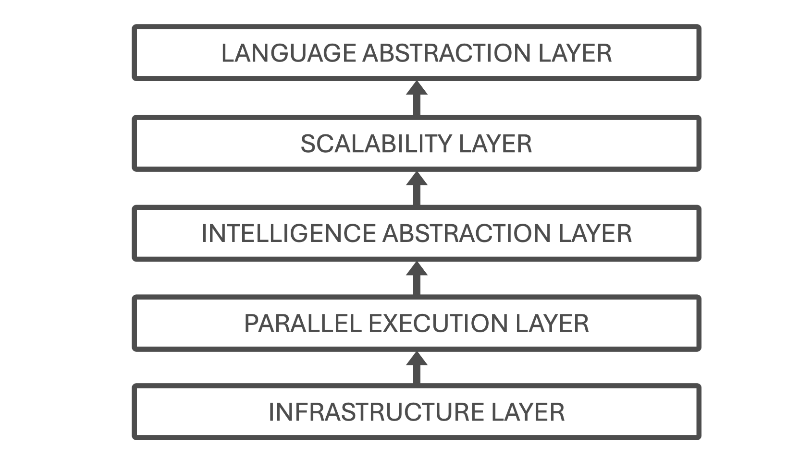

# The Four Axes of the Book

* TOC
{:toc}

### Axis 1 — AI as a Supercomputing Problem (Training-Centered View)

This book is built on a clear and deliberate thesis: the training of modern artificial intelligence models is, at its core, a supercomputing problem.

While advances in model architectures and learning algorithms remain important, the dominant factor enabling today’s large-scale AI systems is the ability to execute massive training workloads efficiently on high performance computing infrastructures. Contemporary models—particularly large language models—are defined not only by what they compute, but by how that computation is orchestrated across thousands of cores, multiple GPUs, and distributed nodes under strict performance and efficiency constraints.

From this perspective, training is not treated as an abstract algorithmic process, but as a complex systems workload. Its behavior is governed by the interaction between compute throughput, memory capacity and bandwidth, data movement within and across nodes, synchronization and communication overheads, and the software layers responsible for coordinating distributed execution. These interactions determine whether a model can be trained at all, how long it takes, how efficiently hardware is utilized, and at what cost.

This training-centered focus is intentional. Although inference, deployment, and edge execution are increasingly important in real-world applications, they expose a different set of constraints and optimization objectives. Inference is often dominated by memory access patterns, latency requirements, and serving efficiency, whereas training stresses the system more broadly and more deeply. It is during training that the full complexity of modern supercomputing platforms becomes visible, and where architectural, system-level, and performance trade-offs can be studied most clearly.

By framing AI as a supercomputing problem, the book places artificial intelligence within the natural domain of high performance computing rather than treating it as a separate or exceptional discipline. GPUs, interconnects, runtimes, batch schedulers, communication libraries, and launch mechanisms are not auxiliary tools; they are the primary enablers of modern AI progress. Understanding their role is therefore essential for anyone who wishes to reason about scalability, efficiency, or performance limits in contemporary AI systems.

_Figure 1 – Conceptual map of the book’s scope. The figure highlights the progressive narrowing of focus from computing to supercomputing and large-scale AI training._

This axis also defines the scope of the book. The emphasis is on training workflows executed on supercomputing platforms, where the challenges of scale, coordination, and performance are unavoidable. The goal is to equip the reader with the conceptual tools needed to understand why training behaves the way it does on real systems, how bottlenecks arise, and how system-level decisions shape what is computationally feasible.

Figure 1 provides a conceptual map that situates this viewpoint within the broader landscape of artificial intelligence and computing. It highlights the progressive narrowing of focus—from computing, to supercomputing, to large-scale training—reflecting the central idea that contemporary advances in AI are fundamentally driven by high performance computing systems.

### Axis 2 — A Layered Book Structure That Mirrors the System Stack

The second foundational axis of this book is its organization around a layered structure that mirrors the abstraction hierarchy of real supercomputing systems.

Rather than grouping content solely by topic or technology, the book is structured according to levels of abstraction that reflect how AI workloads are actually executed on modern high performance platforms. This design choice is not merely editorial; it is pedagogical and conceptual. It provides the reader with a coherent mental model that connects hardware, system software, parallel execution, AI frameworks, and large-scale training workflows into a single, navigable structure.

Modern AI training systems are inherently multi-layered. Performance behavior observed at the application level is rarely attributable to a single component. Instead, it emerges from interactions across layers: processor architecture, memory hierarchies, interconnects, runtimes, launch mechanisms, communication libraries, and high level frameworks. Understanding such systems requires the ability to reason both within a layer and across layers. The book’s structure is designed explicitly to support this form of reasoning.

To this end, the content is organized into five major parts, each corresponding to a distinct abstraction layer in the supercomputing stack. The progression begins with foundational infrastructure—computer architecture, node design, operating systems, compilers, and resource management—and advances through parallel execution models, deep learning frameworks, scalable distributed training, and finally the abstraction-rich workflows associated with Large Language Models. Each part builds on the conceptual ground laid by the previous ones, while remaining sufficiently self-contained to allow selective access.

_Figure 2 – Hierarchical structure of the book, illustrating the five abstraction layers that guide the learning path from supercomputing fundamentals to Large Language Models. Each layer can be approached independently as an entry point, with lower layers serving as supporting context when needed._

This layered organization serves three essential purposes. First, it acts as a pedagogical scaffold, enabling readers to construct understanding incrementally without being overwhelmed by system complexity. Second, it functions as a navigational map, helping readers identify where a particular concept, tool, or performance phenomenon belongs within the overall system. Third, it supports multiple entry points into the material. Readers with a strong background in performance computing may begin at the lower layers, while those approaching from an AI or data science perspective may start higher up the stack and descend as needed.

Importantly, this structure avoids a common pitfall in AI-related texts: presenting high-level frameworks in isolation from the systems that make them viable. By aligning the book’s organization with the system stack, abstractions are never treated as magic. Each layer is shown to rest on—and depend upon—the layers below it, reinforcing the book’s central thesis that AI training is a systems problem grounded in supercomputing.

Figure 2 summarizes this layered organization and its correspondence to the structure of the book. It provides a visual overview of how the different parts relate to one another and can be used as a persistent reference throughout the reading process. Readers are encouraged to return to this figure as they move across chapters, particularly when transitioning between abstraction levels or revisiting earlier concepts from a more advanced perspective.

### Axis 3 — Foundational Performance Principles as a Unifying Reasoning Framework

The third foundational axis of this book is the use of a small set of Foundational Performance Principles as a unifying reasoning framework across all abstraction layers and case studies.

Modern AI training systems are too complex to be understood through isolated optimizations or local rules of thumb. Performance behavior emerges from the interaction of many components—hardware, system software, runtimes, communication libraries, and application-level frameworks—often in non-obvious ways. As a result, purely technique-driven explanations (“use this optimization,” “enable that flag”) tend to be brittle, difficult to generalize, and prone to misinterpretation when conditions change.

In an era where generating correct-looking code has become trivial, the dominant engineering failure mode has shifted. The problem is no longer that systems fail to run, but that they run for the wrong reasons. AI-assisted tooling makes it easy to produce training pipelines, distributed execution logic, and seemingly functional systems that conceal inefficiencies, hidden overheads, and poor scaling behavior.

The Foundational Performance Principles are therefore introduced not as optimization advice, but as tools of skepticism. Their role is to challenge surface-level correctness, expose costs that are invisible at the code level, and force explicit reasoning about execution behavior, scalability limits, and economic trade-offs. In this book, a system that “works” is treated as a hypothesis—not as evidence of good performance.

To address this, the book is built around a deliberately limited set of performance principles that act as a shared analytical language. These principles are not presented as laws, recipes, or prescriptive checklists. Instead, they function as diagnostic lenses—ways of framing performance behavior that help the reader reason systematically about bottlenecks, trade-offs, and scalability limits.

This choice reflects a core pedagogical conviction: understanding performance is not about memorizing optimizations, but about learning how to ask the right questions. The Foundational Performance Principles provide a stable conceptual framework that remains valid even as specific technologies, frameworks, or hardware generations evolve.

The four principles introduced in this book are:

1.  Amortization of Overheads

2.  Hardware–Software Co-Design

3.  Balanced Pipelines

4.  Scale Must Serve Purpose

Each principle captures a recurring pattern observed across supercomputing systems, from low-level GPU kernels to large-scale distributed training of neural networks. Individually, they illuminate specific aspects of performance behavior. Taken together, they form a coherent mental model that supports cross-layer reasoning.

Crucially, these principles are not confined to a single chapter or abstraction level. They reappear throughout the book in different contexts: CUDA kernels, data loading pipelines, mixed-precision training, distributed gradient synchronization, batch size selection, and large-scale scaling experiments. What changes is not the principle itself, but the depth at which it can be understood and applied.

For this reason, the principles are introduced progressively rather than all at once. Early chapters expose the reader to concrete performance phenomena without naming them explicitly. As the necessary technical context accumulates, the principles are formalized and revisited with increasing precision. This staged approach ensures that the principles are grounded in experience rather than presented as abstract theory.

Throughout the book, the reader is explicitly encouraged to return to these principles when interpreting results, comparing strategies, or diagnosing unexpected behavior. Whether analyzing why a GPU is underutilized, why scaling efficiency drops, or why a sophisticated model fails to deliver expected speedups, the same four lenses apply.

In this sense, the Foundational Performance Principles are what give the book its internal coherence. They connect chapters that would otherwise appear heterogeneous, unify discussions that span hardware and software boundaries, and provide continuity between classical high-performance computing and modern AI training workloads.

The next section introduces these principles more concretely, framing them explicitly as diagnostic lenses and clarifying when and how each one is developed throughout the book.

### Axis 4 — Architecture vs. Execution Flow, Made Practical and Reproducible

The fourth axis of the book is the systematic distinction between architecture and execution flow, and the decision to make this distinction explicit, practical, and reproducible.

In complex AI training systems, confusion often arises not from lack of information, but from conflating two fundamentally different perspectives:

- Architecture answers the question *“who does what, and at which layer?”*. It describes the static organization of components: hardware, runtimes, libraries, frameworks, and orchestration tools.

- Execution flow answers the question *“what actually happens, when, and at what cost?”*. It describes the dynamic behavior of a system at runtime: process launch, synchronization points, data movement, computation, and communication.

Many treatments of distributed training implicitly mix these two views, leading to misunderstandings about responsibility, performance attribution, and scalability limits. This book treats their separation as a first-class conceptual tool.

Crucially, this distinction is not presented as an abstract modeling exercise. It is continuously grounded in real executions, real scripts, and real environments. Readers do not merely study execution models—they run them, measure them, and reason about them.

This axis manifests concretely through: explicit launcher choices (e.g., srun, torchrun, accelerate), full SLURM job scripts rather than simplified snippets, and controlled software environments.

The canonical expression of this axis is the full-stack execution model introduced later in the book (Figure 3), where high-level training abstractions (such as the Hugging Face Trainer) are positioned clearly on top of lower-level execution mechanisms without obscuring them. This model makes it possible to reason precisely about where coordination occurs, where overheads are introduced, and which layers are responsible for performance-critical behavior.

The modular, task-based structure of the book is a direct consequence of this philosophy. Each task isolates a specific architectural layer or execution stage while remaining runnable within the full system. This design enables reuse, incremental learning, and controlled experimentation, while preserving the integrity of the real execution pipeline.

By insisting on this separation—and by making it executable rather than merely descriptive—the book equips readers with a durable mental model. One that scales from single-GPU experiments to multi-node training, and from classical HPC workloads to modern large language models.

_Figure 3 – Full-stack execution model for distributed LLM introduced later in the book._

This full-stack view serves as a recurring reference for understanding scalability, coordination, and performance throughout the book.