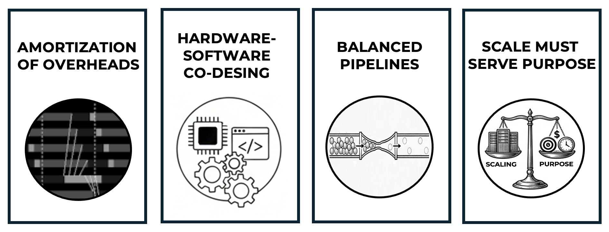

# Foundational Performance Principles

* TOC
{:toc}

### The Four Diagnostic Lenses

Throughout this book, performance is analyzed using four Foundational Performance Principles. These principles are best understood as *diagnostic lenses* rather than optimization rules.

In modern AI workflows, correctness is an increasingly weak signal. A training job that converges, a distributed run that completes, or a pipeline that produces results may still be fundamentally inefficient, uneconomic, or poorly scaled. These four principles are introduced to make such failure modes visible. Their purpose is not to accelerate systems blindly, but to reveal when apparent success hides structural inefficiency.

They are not intended to be applied sequentially, nor do they form a hierarchy. Figure 4 summarizes them as four complementary diagnostic lenses. In real systems, all four are active simultaneously. Each lens highlights a different constraint that shapes observed performance behavior.

#### Amortization of Overheads

This principle explains why fixed costs—such as kernel launches, memory allocations, synchronization barriers, or process coordination—must be spread over enough useful work to become negligible.

It provides the intuition behind practices such as operating on sufficiently large matrices, choosing appropriate batch sizes, or avoiding excessively fine-grained parallelism. When overheads dominate useful computation, even powerful hardware will appear underutilized.

In practice, this principle explains why “it runs” is not evidence that it scales. AI-generated pipelines often produce correct execution flows that are dominated by fixed overheads—kernel launches, synchronization points, communication setup, or framework-level coordination. Apparent correctness can therefore mask pathological inefficiency.

#### Hardware–Software Co-Design

This principle emphasizes that modern hardware capabilities only translate into performance when the software stack is designed to exploit them.

High-end GPUs, fast interconnects, tensor cores, or advanced memory hierarchies offer no intrinsic benefit if runtimes, libraries, and frameworks fail to expose or orchestrate their use. Performance emerges from the *joint* design of hardware and software, not from either in isolation.

When code is generated without awareness of the underlying hardware, mismatches between software abstractions and physical execution units become invisible but costly. Generic framework-level solutions may ignore memory hierarchies, interconnect topology, or accelerator-specific execution models. In such cases, abstraction hides the cost—but hardware still pays it.

#### Balanced Pipelines

This principle states that overall performance is limited by the slowest stage in the execution pipeline.

In practice, many performance problems are not solved by acquiring faster accelerators, but by eliminating imbalances—such as situations where GPUs wait for data loading, preprocessing, or CPU-side work. In such cases, software engineering and pipeline design matter more than raw compute capability.

AI-assisted development tends to optimize locally: faster kernels, larger batch sizes, deeper models. This principle exists to reveal why such local improvements frequently fail at the system level, producing idle hardware, stalled execution, and wasted resources. Local brilliance does not imply global performance.

#### Scale Must Serve Purpose

This principle challenges the assumption that scaling is inherently beneficial.

Adding more GPUs or nodes does not automatically improve outcomes if communication overheads, efficiency losses, or costs outweigh the gains. Purpose-driven scaling explicitly connects performance, efficiency, and cost, framing scaling decisions in terms of objectives rather than maximum hardware usage.

In modern AI systems, the cost of a logical bug is often negligible. The cost of a poor scaling decision can be orders of magnitude larger. This principle exists to prevent the most expensive class of errors in contemporary AI workloads: scaling without purpose, measurement, or economic justification.

Together, these four lenses provide a compact yet expressive framework for reasoning about performance across all levels of the AI training stack.

_Figure 4 — The four Foundational Performance Principles presented as diagnostic lenses._

The Foundational Performance Principles are not introduced all at once, nor are they presented upfront as abstract theory. Instead, they are deliberately staged throughout the book, following a pedagogical progression aligned with the reader’s growing technical context.

Early chapters expose the reader to concrete performance phenomena—such as underutilized hardware, unexpected slowdowns, or limited scalability—without immediately naming the underlying principles. This allows intuition to form through observation and experimentation.

As the necessary architectural and execution context becomes available, each principle is introduced explicitly, formalized, and connected to concrete examples. At that point, the reader can recognize recurring patterns that were previously encountered implicitly.

This approach serves two goals:

- it avoids premature abstraction before the reader has sufficient grounding,

- and it reinforces the idea that the same principles apply repeatedly across abstraction layers.

As the book progresses, the principles reappear in increasingly complex settings: from GPU kernels, to data pipelines, to distributed training, and finally to large-scale LLM workloads. What changes is not the principle itself, but the scale and richness of the systems to which it is applied.

Readers are encouraged to revisit these principles continuously. Recognizing familiar performance behaviors in new contexts is a central learning objective of the book—and a key step toward developing true system-level intuition.