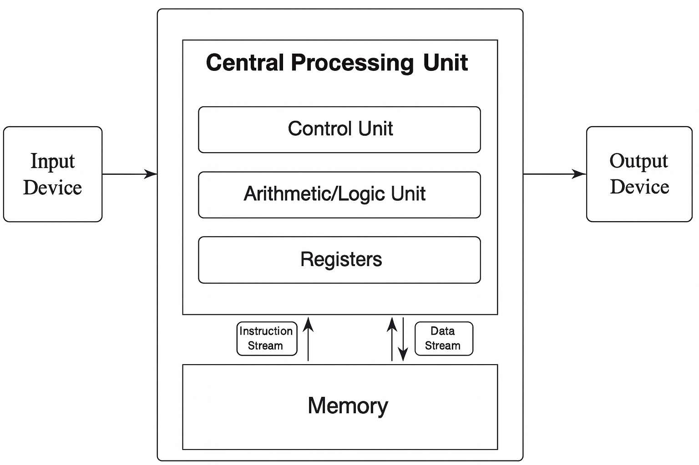
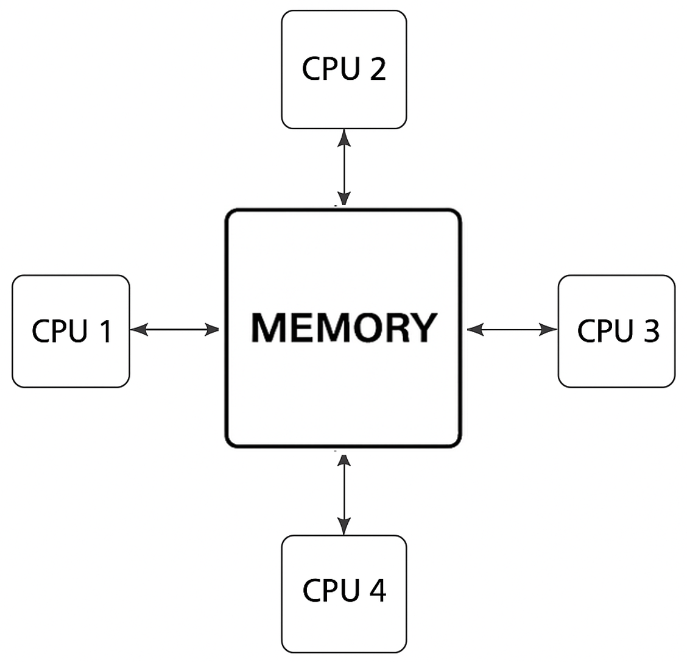
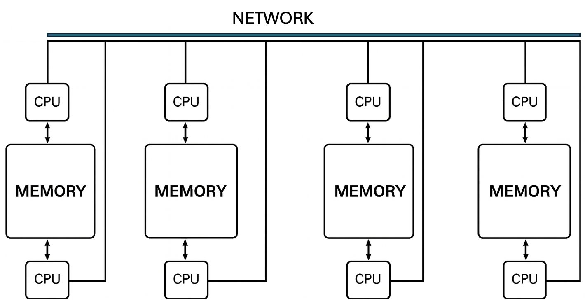
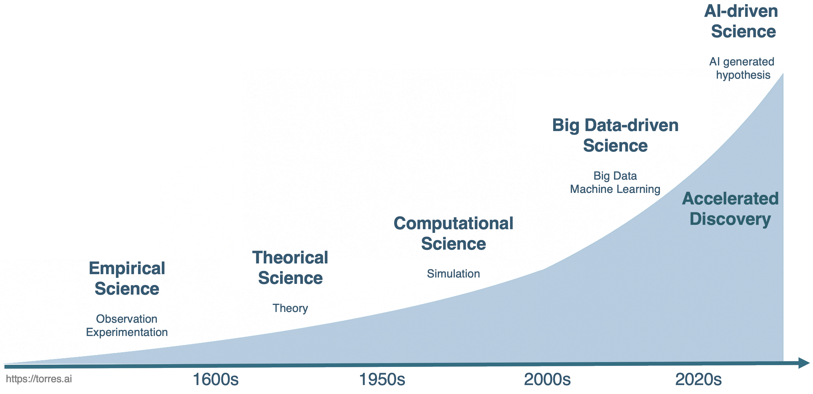
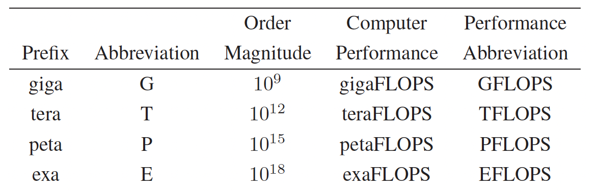
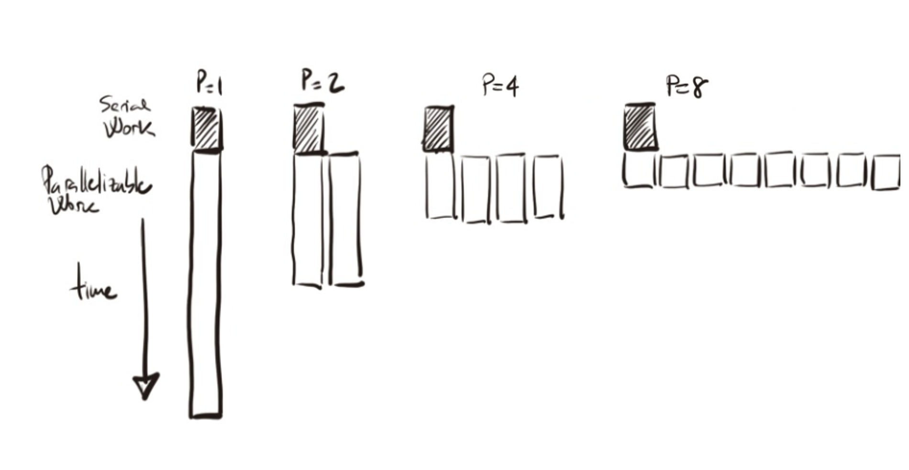
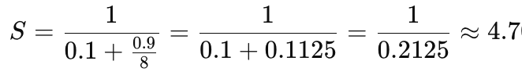
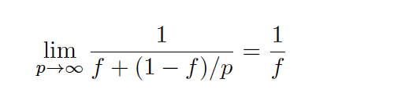
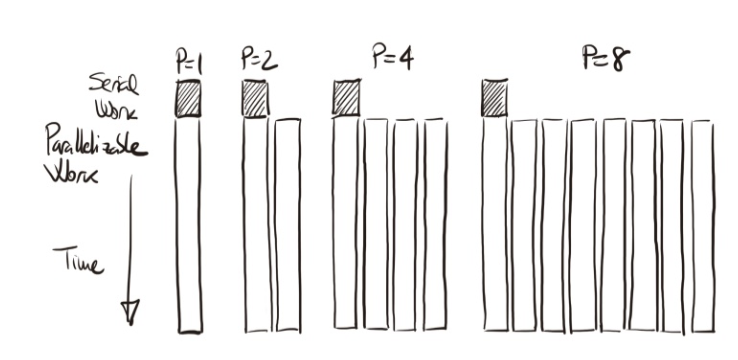

# Supercomputing Basics

This chapter provides a conceptual introduction to supercomputing and
performance-oriented thinking. It establishes the vocabulary and mental
models used throughout the book to reason about parallelism,
scalability, and system-level performance.

Readers new to High Performance Computing are encouraged to start here.
Readers with prior HPC experience may use this chapter as a refresher or
reference, focusing on sections that contextualize modern supercomputing
in the era of artificial intelligence.

## What is Supercomputing?

Since the advent of artificial intelligence (AI), the field of
supercomputing<span class="indexref" entry="Supercomputing"></span> has
undergone a significant transformation, rendering some topics
traditionally found in supercomputing textbooks less central today,
while new areas of focus have emerged.

In this first chapter, we have chosen to retain the classical concepts
that form part of the historical foundations and culture of the *High
Performance Computing*<span class="indexref"
entry="High Performance Computing"></span> (HPC<span class="indexref"
entry="HPC" crossref="See High Performance Computing"></span>)
community, recognizing that understanding these fundamentals remains
essential for grasping the field’s evolution. However, throughout the
book, we will also introduce the new topics that are increasingly
shaping the current landscape of supercomputing, particularly in its
application to artificial intelligence.

But what exactly is a supercomputer? In simple terms, a supercomputer is
a computing system with capabilities far beyond those of typical
general-purpose machines like desktops or laptops. Of course, this
definition is somewhat fluid—a laptop today might have outperformed a
supercomputer from a few decades ago. Yet, no matter how much consumer
technology advances, there will always be a need for even more powerful
systems to tackle the most demanding computational challenges.

The origins of supercomputing date back to the 1960s, when Seymour Cray
<span class="indexref" entry=" Seymour Cray"></span>, working at Control
Data Corporation, developed the first machines designed specifically for
high performance tasks. Since then, supercomputers have become
indispensable tools in scientific research and engineering. Today, the
global community tracks the evolution of these systems through the
*Top500* list<span class="indexref" entry="Top500 list"></span> , an
authoritative ranking of the world’s 500 most powerful supercomputers,
updated twice a year to reflect the state of the art.

Supercomputers owe their power to *parallel
computing*<span class="indexref" entry=" Parallel computing"></span> , a
method that enables the simultaneous execution of many operations.
Rather than solving tasks one after another, a supercomputer distributes
the workload across thousands—or even millions—of processing units, all
working together to tackle a complex problem. You can think of it as
harnessing the capabilities of countless general-purpose machines
focused on the same task at once. This model of computation is at the
heart of how modern supercomputers function, and as you progress through
this book, you'll explore the key role that parallelism plays in
virtually every aspect of supercomputing.

### High Performance Computing vs. Supercomputing

*Supercomputing* <span class="indexref"
entry=" Supercomputing"></span>represents one of the most transformative
technological advancements of the modern era. Its impact extends across
a remarkably diverse range of fields, from the most theoretical sciences
to the most immediate practical challenges—such as those posed by
artificial intelligence—fundamentally expanding human capabilities and
understanding.

Throughout the relatively brief history of computing, no other
technological domain has demonstrated a comparable rate of advancement.
Early machines of the late 1940s performed fewer than 1,000 operations
per second. In contrast, modern supercomputers now routinely exceed 1
exaFLOP—one quintillion floating-point operations per second—with
leading systems sustaining performances of approximately 1.7 exaFLOPS.
This extraordinary growth has been driven by continuous innovation
across hardware technologies, computer architectures, programming
models, algorithms, and system software.

While often used interchangeably, high performance computing
<span class="indexref" entry="High Performance Computing"></span>
**(**HPC**)** and supercomputing reflect slightly different
perspectives—and understanding this distinction helps frame the scope of
this book:

- Supercomputing refers specifically to the use of
  supercomputers—large-scale, specialized computing systems designed to
  solve problems requiring extreme processing power. It evokes the idea
  of powerful machines and cutting-edge performance.

- High performance computing, on the other hand, is a broader term. It
  encompasses not only the hardware (supercomputers themselves) but also
  the software tools, programming models, resource management
  techniques, and algorithms that enable performance at scale. HPC
  represents the field of study and practice that makes supercomputing
  possible and effective.

In practice—particularly in education—the two terms are often used
interchangeably. As an academic, I have traditionally favored the term
HPC, which I consistently employed throughout the earlier stages of my
career. However, over time, supercomputing has gained broader
recognition and resonance, especially among non-specialist audiences and
university students. Its clarity and immediate impact often make it the
more intuitive choice. For this reason, although we have titled this
book with the term supercomputing, throughout its content we will use
both terms interchangeably.

At its core, HPC is concerned with achieving the greatest computing
capability possible at any given point in time and technology. This
means continually pushing the boundaries of what is computationally
feasible using the best available hardware and software technologies. It
is a dynamic field, constantly adapting to new scientific challenges and
emerging computational paradigms. In summary, HPC is a field at the
intersection of technology, methodology, and application, integrating
all these facets:

- Technology — the physical and architectural design of computing
  systems, including CPUs, GPUs, memory hierarchies, interconnects, and
  storage.

- Methodology — the techniques used to parallelize, coordinate, and
  scale computations across many processing units, nodes, and
  accelerators.

- Application — the scientific or industrial problems that drive the
  need for high computing power: from climate modeling and genomics to
  fluid dynamics.

This convergence makes HPC, especially when combined with advances in
AI, a foundational discipline for modern research and technological
innovation.

### Parallelism: The Cornerstone of High Performance Computing

#### Why Parallel Computing?

For several decades, improvements in processor performance were
primarily driven by increases in clock frequency. From the early 1990s
to around 2010, clock speeds rose steadily—from approximately 60 MHz to
nearly 5 GHz—allowing software to run faster simply by upgrading to the
latest CPU. However, this trend has now stalled due to physical
limitations in miniaturization, power consumption, and heat dissipation.
As a result, continuing performance gains through faster single-core
processors has become increasingly impractical and costly.

Modern computing systems instead pursue performance improvements through
parallelism—by using multiple moderately fast processing units working
together. This strategy is both more scalable and energy-efficient, and
it has become the cornerstone of high performance computing in the
post-frequency-scaling era.

#### Serial Execution on Standard Computers

One of the fundamental principles behind HPC is *parallelism*
<span class="indexref" entry="Parallelism"></span>—the ability to divide
a computational task into smaller parts that can be executed
simultaneously across many processing units<span class="indexref"
entry="Processing units"></span>[^1]. Parallelism is the key to
achieving the high performance levels required to solve complex
scientific and engineering problems. It is what transforms a large
computational challenge from something intractable into something
feasible.

On a standard laptop or desktop computer, most programs are designed to
execute *serially*—that is, instructions are carried out sequentially on
a single processing unit[^2]. This execution model is generally adequate
for everyday computing tasks such as web browsing, word processing, or
lightweight programming. While modern laptops can achieve a degree of
concurrency by assigning different serial applications to run
simultaneously on separate processor units, serial execution quickly
becomes a bottleneck when it comes to large-scale simulations, big data
processing, or training large deep learning models. The limitations of a
single processing unit—in terms of computation speed, memory, and data
throughput[^3]—make it impractical or even impossible to process such
workloads efficiently.

#### Parallel Execution in HPC Systems

In contrast to traditional sequential execution, where instructions are
processed one after another on a single CPU (see Figure 1.1, top), high
performance computing systems are designed to execute tasks in parallel.
In a sequential program, a problem is broken down into a list of
instructions that are executed in order by a single processor. While
this model is simple and sufficient for general-purpose computing, it
becomes a severe bottleneck for time-sensitive or large-scale workloads.

As illustrated in Figure 1.1 (bottom), parallel execution enables a
problem to be divided into independent sub-tasks, each processed
simultaneously on a different CPU or node. This parallelism allows large
computations to scale in both speed and memory capacity, enabling
scientific and engineering challenges to be tackled effectively.

This model usually involves additional complexity: each sub-task must be
assigned to a processor, and synchronization and communication between
them may be required. However, the benefits in performance and
scalability far outweigh the overhead in many HPC use cases.

There are two primary motivations for using parallelism in HPC:

- To reduce execution time: By distributing a problem across multiple
  processing units, the total time to solution can be drastically
  shortened. This is especially important in time-sensitive applications
  such as weather forecasting or epidemiological simulations, where
  timely decisions are essential.

- To solve problems that exceed the capabilities of a single machine:
  Large-scale scientific workloads—such as climate modeling, training of
  state-of-the-art neural networks, or massive genomic analyses—demand
  computational and memory resources far beyond what a single system can
  provide.

- 

>  style="width:4.90046in;height:1.90607in"
> alt="A diagram of instructions and instructions AI-generated content may be incorrect." />

Figure 1.1 – Sequential vs. parallel execution of a computational task.
In the sequential model (top), a single stream of instructions is
executed by one CPU. In the parallel model (bottom), the problem is
divided into parts, each with its own instruction stream executed
concurrently on different CPUs, leading to faster and more scalable
results.

In addition to task-level parallelism within a single problem, HPC
systems are also well-suited for concurrent execution of multiple
independent problems. This scenario is common in shared supercomputing
environments, where many users or experiments must run simultaneously.
As shown in Figure 1.2, each problem is processed independently by a
dedicated CPU or core, with its own instruction stream and result. This
form of parallelism maximizes resource utilization without requiring
communication or synchronization between tasks. It is particularly
effective for parameter sweeps, hyperparameter tuning, or serving
multiple users in parallel.

This form of parallelism is referred to as
*concurrency*<span class="indexref" entry="Concurrency"></span>, and it
enables efficient utilization of the available computing resources.

#### 

Figure 1.2 – Concurrency through the execution of multiple independent
problems. Each problem follows its own instruction stream and is handled
by a separate CPU. Unlike parallelism within a single problem (Figure
1.1), concurrency focuses on executing independent computations in
parallel, thereby enhancing overall system throughput and efficiency.

#### Limitations and Challenges of Parallelization

Despite its advantages, not all problems benefit equally from parallel
execution. Some programs are inherently sequential or exhibit limited
scalability. There are several reasons for this:

- Task dependencies: Some algorithms require the result of one
  computation before another can proceed. These data or control
  dependencies introduce delays and force some computations to wait,
  reducing parallel efficiency.

- Imbalanced workloads: If tasks are not evenly divided, some processors
  may finish earlier than others and remain idle, resulting in
  inefficient resource utilization.

- Redundant computations: In certain programs, portions of the code may
  need to be replicated across tasks when running in parallel. This can
  add unnecessary overhead, especially when memory usage or data access
  becomes a bottleneck.

The challenge in HPC is not just to parallelize a problem, but to do so
in a way that is efficient, scalable, and sustainable across many nodes.
This requires careful algorithmic design and often specialized
programming models—many of which will be introduced later in this book.

### Understanding Parallel Computer Architectures

Before diving into supercomputing building blocks and programming models
for parallel computing, it's essential to understand how computer
architectures have evolved to support parallelism. This includes both
historical context—such as the classical Von Neumann architecture—and
modern adaptations that incorporate multiple CPUs and GPUs working
together in distributed environments. This foundational knowledge will
help us better understand the performance characteristics and
limitations of parallel applications running on today’s supercomputers.

#### The Von Neumann Model

The Von Neumann<span class="indexref"
entry="Von Neumann architecture"></span> architecture (Figure 1.3),
introduced in the 1940s, has served as the conceptual backbone of most
modern computing systems. It describes a simple and elegant design in
which a single processing unit retrieves and executes instructions
sequentially from a shared memory.



Figure 1.3 – The von Neumann architecture. The CPU contains a control
unit, arithmetic/logic unit, and registers. Both instructions and data
are stored in the same memory space and accessed sequentially.

In this architecture, the Central Processing Unit
(CPU<span class="indexref" entry="CPU"></span>) consists of three main
components: the control unit, which orchestrates the execution of
instructions; the arithmetic and logic unit (ALU<span class="indexref"
entry="ALU"></span>), responsible for basic computations and logical
operations; and the registers, which act as the CPU's fastest memory,
holding temporary data for immediate processing.

This model also includes memory for storing both instructions and data,
and input/output devices that interface with the external world. Despite
its simplicity, this architecture remains relevant today and provides
the foundation for understanding more complex systems.

#### From Single to Multiple Cores

Over time, computing demands increased beyond what a single processor
could handle. To address this, computer chips evolved to include
multiple cores, each capable of executing its own instruction stream.
Modern CPUs, while still based on the von Neumann model internally,
typically integrate several of these cores, each acting as a mini-CPU.

For example, a standard server CPU in 2025 may include 64 cores,
enabling it to process multiple tasks in parallel. However, it's
important to distinguish between a "CPU" as a physical package and a
"core" as a processing unit inside that package. From a programming
perspective, each core can be thought of as an independent processor.

#### Memory Architectures for Parallelism

The organization of memory plays a crucial role in enabling efficient
parallel execution. Two principal models are used in parallel computing
systems: shared memory <span class="indexref"
entry="Shared memory"></span>, and distributed memory
<span class="indexref" entry="Distributed memory"></span>, each with
distinct advantages and challenges.

In shared memory systems, all processors have access to a common memory
space (Figure 1.4). This simplifies programming, as all data can be
accessed uniformly. However, contention arises when many processors try
to access memory simultaneously, which can limit scalability.



Figure 1.4 – Shared memory (UMA<span class="indexref"
entry="UMA"></span>, Uniform Memory Acces)**.** All CPUs access the same
memory space with equal latency. Suitable for systems with a limited
number of processors.

As systems grew larger, the Non-Uniform Memory
Access<span class="indexref" entry="Non-Uniform Memory Access"></span>
(NUMA<span class="indexref" entry="NUMA"></span>) architecture emerged
(Figure 1.5). In NUMA systems, each processor accesses its local memory
faster than memory attached to other processors. This reduces contention
but introduces complexity, as data placement affects performance.


Figure 1.5 – Shared memory (NUMA). Each CPU has faster access to its
local memory but can still access remote memory. Improves scalability
compared to UMA.

Alternatively, distributed memory systems (Figure 1.6) assign each
processor its own private memory. Processors communicate through
explicit message-passing over a network. This model scales well and is
used in large supercomputers, but it increases programming complexity.


Figure 1.6 – Distributed memory architecture. Each CPU accesses its own
local memory and communicates with others via a high-speed network.

To combine the best of both worlds, many HPC systems now adopt hybrid
architectures that integrate shared and distributed memory models
(Figure 1.7). Within a node, multiple processors may share memory;
across nodes, communication occurs over a network. This is the dominant
model in supercomputing today.



Figure 1.7 – Hybrid distributed-shared memory. Each node contains two
CPUs with shared memory; nodes are interconnected via a network. Enables
scalable yet flexible parallelism.

#### Adding GPUs to the Architecture

While the architectures described so far focus on CPUs, modern
supercomputers heavily rely on Graphics Processing Units (GPUs) to
accelerate performance. GPUs are specialized processors originally
designed for rendering graphics, but their highly parallel architecture
makes them ideal for scientific computing and deep learning.

Each GPU contains thousands of smaller cores optimized for throughput
rather than latency. In contrast to CPUs, which are best suited for
executing a few complex tasks at high speed, GPUs can simultaneously
handle a large number of simple operations. This makes them especially
powerful for data-parallel computations found in artificial intelligence
and highperformance scientific simulations.

In contemporary HPC systems, GPUs act as co-processors, meaning they do
not operate independently but are orchestrated by the CPU, which
offloads compute-intensive tasks to the GPU. This collaboration allows
the system to leverage the strengths of both architectures—CPUs for
control logic and serial execution, and GPUs for high-throughput
parallelism.


Figure 1.8 – Hybrid CPU-GPU architecture with distributed nodes. Each
node combines multiple CPUs and GPUs with local memory. Inter-node
communication is enabled via a high-speed network.

To support this, each node in a modern supercomputer typically includes
multiple CPUs and GPUs, connected via high-speed links. These hybrid
nodes are then connected to each other across a high-speed interconnect
network, enabling them to work together as a single distributed system
while maintaining fast internal communication (Figure 1.8).

This combination of shared memory within nodes and distributed
communication across nodes forms the basis of nearly all current
supercomputing platforms. In the following chapters, we will explore in
greater detail how to program and optimize applications for these hybrid
CPU-GPU systems.

### How Supercomputing Powers Modern Science

Throughout history, scientific discovery has traditionally rested on two
fundamental paradigms: *experimentation* and *theory*. For centuries,
the cycle of observation, hypothesis formulation, experimentation, and
theoretical refinement has provided the foundation for our understanding
of the natural world. Classical science advanced through this iterative
process, building robust explanations of phenomena based on measurable
reality.

However, as the complexity of scientific questions has grown,
traditional methods have encountered significant limitations. Some
phenomena are too dangerous to test (e.g., nuclear fusion), too
expensive to replicate (e.g., jet crash tests), too slow to observe
(e.g., climate change), or simply too vast or too small to manipulate
physically.

In these situations, an additional tool has become indispensable,
leading to the emergence of new paradigms.

#### The Three Paradigms of Science: From Empirical to Simulation

Following the advent of computers in the mid-20th century, and
particularly with the emergence of *simulation* capabilities —made
possible by supercomputers since the 1990s— *Computational Science* was
established as the third paradigm of scientific inquiry, complementing
theory and experiment. <span class="indexref"
entry="Computational Science"></span>

This approach allows scientists to *create virtual models of
reality* and test hypotheses computationally, offering insights where
direct experimentation is impractical or impossible. Thanks to
supercomputing, simulations are often performed before any physical
prototype is built or any real-world measurement is taken, through the
use of powerful *digital twins*, which represent the current evolution
of numerical simulations. In this paradigm, supercomputers serve as
virtual laboratories, enabling new modes of discovery that extend far
beyond the reach of classical experimentation.

#### Big Data-driven Science (The Fourth Paradigm)

With the explosion of data availability at the beginning of this
century, spanning fields from genomics to astrophysics, science
underwent a fundamental shift.

<span class="indexref" entry="Big Data-driven Science"></span>Instead of
explicitly simulating physical laws, researchers began to rely heavily
on machine learning, pattern recognition, and anomaly detection to
extract meaningful insights from massive datasets. Scientific discovery
increasingly involves approximating physical laws from empirical data,
an approach particularly effective when dealing with large, complex, or
noisy datasets. This *fourth paradigm* —*Big Data-driven Science*— 
marked a transformative shift in the way scientific discovery is
conducted.

#### AI-driven Science (The Fifth Paradigm)

We are now living in a vibrant moment for science. Building upon the
advancements of the Fourth Paradigm, the 21st century has witnessed the
emergence of an even more transformative paradigm: *AI-driven Science*.
While the Big Data-Driven Science enabled massive analysis, the *Fifth
Paradigm* takes a crucial step further: AI is leveraged not only to
detect patterns but also to actively generate hypotheses and accelerate
the discovery process itself.

In this new context, AI is no longer merely an analysis tool; it becomes
an *autonomous collaborator*, proposing new lines of inquiry, designing
experiments, and optimizing research strategies. Discovery is becoming
not only faster but also increasingly automated and scalable. This
progression, from empirical science to autonomous hypothesis generation,
is clearly illustrated in Figure 1.9.



Figure 1.9 – Evolution of scientific paradigms throughout the history of
science.

Figure 1.9 illustrates the progression of scientific discovery over
time, from empirical science based on observation and experimentation to
the current frontier of AI-driven science, which introduces autonomous
hypothesis generation and accelerated discovery—achieving breakthroughs
in ways previously unimaginable.

#### The Evolving Role of the Scientist: The Builder’s Dilemma

This acceleration, made possible by modern supercomputing
infrastructures capable of training powerful AI models, is changing the
very nature of scientific work. The reflection offered by *Oriol
Vinyals* (a key figure behind systems such as AlphaFold and Gemini)
<span class="indexref" entry="Vinyals, Oriol"></span>in his 2025
acceptance speech for an honorary doctorate from the Universitat
Politècnica de Catalunya, is particularly insightful.

Vinyals frames this transformation not primarily in terms of speed or
computational power, but in terms of how the role of the scientist is
evolving.

One of his central ideas is simple yet deeply consequential: in a world
where AI can execute experiments and analyze data, the true value of the
scientist increasingly lies in *asking the right questions*. When
machines can explore hypotheses at a scale no human could match,
formulating meaningful, well-posed scientific questions becomes not just
important, but essential.

This shift leads to what Vinyals calls the *"builder’s dilemma"*: the
uneasy feeling that, by creating systems capable of scientific
reasoning, we might be designing tools that eventually perform our own
work better than we do. However, he proposes a different interpretation:
AI should be understood as an *amplifier of human curiosity and
creativity, not as its replacement.* It is a tool that expands what we
can explore, not one that eliminates the need for human insight.

The scientist’s role moves away from executing every experiment
toward orchestrating exploration through questions. Supercomputing
provides the physical infrastructure that makes this transformation
possible; AI provides the cognitive machinery that reshapes discovery.
But neither replaces the need for *scientific judgment, ethical
responsibility, and intellectual curiosity.*

Vinyals closes his reflection with a message that is both sobering and
hopeful: technologies will continue to change at an accelerating pace,
but curiosity, critical thinking, and the ability to ask good questions
will remain the most valuable scientific skills. The challenge for the
next generation of scientists and engineers will not be to compete with
machines at what they do best—but to learn how to guide them toward
meaningful discovery.

### Barcelona Supercomputing Center and MareNostrum 5

The *Barcelona Supercomputing Center–Centro Nacional de
Supercomputación* (BSC<span class="indexref" entry="BSC"
crossref="See Barcelona Supercomputing Center"></span>)
<span class="indexref" entry="Barcelona Supercomputing Center"></span>
is Spain’s national supercomputing facility and a recognized leader in
HPC in Europe. It manages MareNostrum 5 supercomputer
<span class="indexref" entry="MareNostrum 5"></span>and provides
advanced computational resources to both the international scientific
community and industry. Its research activity spans five main areas:
Computer Sciences, Life Sciences, Earth Sciences, Engineering
Applications, and Computational Social Sciences.

BSC coordinates the Spanish Supercomputing Network (RES), was a founding
member of the former European infrastructure PRACE (Partnership for
Advanced Computing in Europe), and currently serves as a hosting entity
of EuroHPC JU, the Joint Undertaking that leads large-scale
supercomputing investments at the European level. The center plays an
active role in major European HPC initiatives and maintains close
collaboration with other top-tier supercomputing institutions across
Europe.

The MareNostrum 5 (MN5) <span class="indexref" entry="MN5"
crossref="See MareNostrum 5"></span>machine, housed at the BSC premises
in Barcelona, is of particular importance to this book. Since our
practical exercises will utilize the MN5 infrastructure, its presence
underpins many of the concepts discussed in the following chapters.

MN5 is designed to support the development of next-generation
applications, including those leveraging AI, providing the massive scale
and low-latency needed for the AI-driven science paradigm (as discussed
in the previous section).

BSC inherits the legacy of the European Center for Parallelism of
Barcelona <span class="indexref"
entry=" European Center for Parallelism of Barcelona "></span>
(CEPBA<span class="indexref" entry="CEPBA"
crossref="See European Center for Parallelism of Barcelona "></span>), a
pioneering research, development, and innovation center in parallel
computing technologies. CEPBA was established at the Universitat
Politècnica de Catalunya (UPC) in 1991, consolidating the expertise and
needs of several UPC departments, particularly the Department of
Computer Architecture.

In 2000, CEPBA entered into a collaboration agreement with IBM to create
the CEPBA-IBM Research Institute, which paved the way for the formal
establishment of the BSC in 2005, with an initial team of 67 staff
members. Today, BSC employs more than 1,400 professionals, including
over 1,100 researchers—a distinctive feature that sets it apart from
other supercomputing centers worldwide: the strong integration of
cutting-edge research and HPC infrastructure under the same institution.

## Performance in Supercomputing

### Performance and Metrics

Understanding the performance of a supercomputer is essential for
evaluating its capabilities, yet this concept, while seemingly
intuitive, is far from simple. No single measurement can fully capture
all aspects of a supercomputer’s operational quality. Instead, multiple
quantifiable parameters — known as metrics — are routinely applied to
characterize the behavior and efficiency of HPC systems. A metric in
supercomputing is defined as an observable and quantifiable operational
parameter that provides insight into how a system performs under
specified conditions.

At the foundation of performance measurement lie two fundamental
dimensions: the amount of time required to complete a given task, and
the number of operations performed during that task. These two measures
are often combined to create practical evaluation standards. Among them,
the most widely used metric is FLOPS<span class="indexref" entry="FLOPS"
crossref="See Floating-point operations per second"></span> —
*Floating-Point Operations Per Second* <span class="indexref"
entry=" Floating-point operations per second "></span>— which measures
how many arithmetic operations (specifically, addition or multiplication
of real numbers) a system can perform in one second. FLOPS provides a
standardized, hardware-independent way to compare the raw computational
capabilities of different supercomputers.

Throughout this book, we adopt the FLOPS notation (e.g., PFLOPS, EFLOPS)
to express floating-point performance. However, readers may encounter
alternative notations in the literature, such as PFlop/s or simply flops
(in lowercase), all referring to the same concept: the number of
floating-point operations per second. While the capitalization may vary,
the underlying unit remains consistent.

In essence, FLOPS is a measure of throughput—a key performance concept
that describes the rate at which a system processes work over time. In
the context of HPC, throughput<span class="indexref"
entry="Throughput"></span> refers to the number of useful operations
completed per unit of time, reflecting how effectively a supercomputer
utilizes its computational resources. We will return to this concept
later in the book, when we explore the different types of throughput
used in various contexts.

Given the extraordinary scale of performance in modern computing, it is
necessary to use scientific prefixes to express these large numbers
compactly: kilo (10³), mega (10⁶), giga (10⁹), tera (10¹²), peta (10¹⁵),
and exa (10¹⁸).

For example, early supercomputers achieved performance levels around 1
kiloFLOPS (10³ FLOPS), while today's leading systems surpass the exaFLOP
barrier, routinely achieving performances on the order of 10¹⁸
FLOPS<span class="indexref" entry="kiloFLOPS&quot;"></span>. Meanwhile,
modern laptops, which have seen remarkable growth in their own right,
can reach several teraFLOPS (10¹² FLOPS), showing that while personal
computing power has grown dramatically, it still lags millions of times
behind top-tier supercomputers when measured by raw FLOPS.
<span class="indexref" entry="gigaFLOPS&quot;"></span>
<span class="indexref" entry="teraFLOPS&quot;"><span class="indexref"
entry="petaFLOPS&quot;"><span class="indexref"
entry="exaFLOPS&quot;"></span></span></span>. <span class="indexref"
entry="GFLOPS" crossref="See gigaFLOPS"></span> <span class="indexref"
entry="TFLOPS" crossref="See teraFLOPS"></span> <span class="indexref"
entry="PFLOPS" crossref="See petaFLOPS"></span> <span class="indexref"
entry="EFLOPS" crossref="See exaFLOPS"></span>



Table 1.1 – Scientific prefixes commonly used to express computer
performance in FLOPS.

### Standard Benchmarks in HPC

While FLOPS is a widely used metric for quantifying computational
capacity, it has inherent limitations. FLOPS measures the potential
arithmetic throughput of a system, but not how efficiently real-world
applications are executed—especially those constrained by memory
bandwidth, I/O bottlenecks, or algorithmic complexity. To address this
gap, the HPC community relies on standardized benchmark applications
that simulate realistic workloads. These benchmarks allow for meaningful
comparisons between systems by measuring the time required to complete
well-defined computational tasks under controlled conditions..

#### Top500 List

One of the most prominent benchmarks in HPC is the *Highly Parallel
Linpack*<span class="indexref" entry="Highly Parallel Linpack"></span>
(HPL<span class="indexref" entry="HPL"
crossref="See Highly Parallel Linpack"></span>). HPL evaluates how
efficiently a system can solve large, dense systems of linear equations
using floating-point arithmetic, and it forms the basis of the Top500
list[^4]<span class="indexref" entry="Top500 list"></span>—a biannual
ranking of the world’s 500 most powerful supercomputers.

Although HPL does not represent the full diversity of scientific
workloads, it provides a consistent and historically rich measure of
system capability. Figure 1.10 illustrates the exponential growth in
supercomputing performance over recent decades, based on HPL data
reported in the Top500 list. The plot shows the combined performance of
all ranked systems, the top-performing system, and the system ranked
500th, highlighting the rapid pace of architectural and computational
advances.

Since its first edition in 1993, the Top500 list ranking has served as a
key indicator of progress in HPC, capturing not only performance
evolution but also trends in architecture (e.g., the increasing use of
accelerators like GPUs), software stack complexity, or the geographical
distribution of HPC leadership.


Figure 1.10 – Rapid growth of supercomputer performance, based on data
from the Top500 list, adapted from Wikipedia. The logarithmic y-axis
shows performance in FLOPS. Top line: Combined performance of the 500
largest supercomputers. Middle line: Fastest supercomputer. Bottom line:
Supercomputer ranked 500th in the list (Source: top500.org).

As of the latest edition of the Top500 list, released in November 2025,
the El Capitan system at Lawrence Livermore National Laboratory (USA)
remains at the top, having achieved 1.8 exaFLOPS on the HPL benchmark.
With Frontier(1.3 exaFLOPS) and Aurora (1.012 exaFLOPS) occupying the
second and third positions respectively, the Top500 list continues to
feature three fully operational exascale systems from U.S. Department of
Energy facilities.

A significant highlight of this edition is the formal entry and rise of
European systems. Europe’s progress toward exascale is now consolidated
by the JUPITER system at Forschungszentrum Jülich (Germany), which fully
enters the list at rank four with a confirmed HPL score of 1 exaFLOPS.
This achievement marks Europe's first operational exascale system and
represents a crucial milestone in global HPC leadership. Furthermore,
the list notes the continued strong presence of cloud-based HPC
solutions such as Microsoft Azure’s Eagle (561 petaFLOPS, rank five).

MareNostrum 5<span class="indexref" entry="MareNostrum 5"></span>
appears in the list under its two major partitions (applications
typically run on one partition or the other, not across both
simultaneously). The Accelerated Partition<span class="indexref"
entry="MN5 Accelerated Partition"></span> (ACC), equipped with NVIDIA
H100 GPUs ranks 14th with 175.3 petaFLOPS. The general purpose partition
(GPP), based solely on CPUs, remains a vital resource, ranking 50th with
40.1 petaFLOPS. This dual configuration reflects the growing trend in
modern supercomputers of combining CPU-only and GPU-accelerated
resources to serve a diverse range of scientific and AI workloads.

#### Peak Performance vs. Sustained Performance

As previously discussed, the Top500 list reports two different
performance figures for each supercomputer: Rpeak and Rmax.

- Rpeak<span class="indexref" entry="Rpeak"></span>, known as peak
  performance<span class="indexref" entry="peak performance"
  crossref="See Rpeak"></span>, corresponds to the theoretical maximum
  number of floating-point operations per second (FLOPS) a system could
  achieve under ideal conditions if all components were fully utilized
  without any inefficiencies. Essentially, it reflects the hardware
  potential of the system based on its architectural specifications.

- Rmax<span class="indexref" entry="Rmax"></span>, also called maximum
  performance<span class="indexref" entry="maximum performance"
  crossref="See Rmax"></span>, is measured using the HPL benchmark and
  accounts for various practical factors that affect real execution,
  such as memory access latency, communication overhead, and I/O
  constraints. It represents the actual number of floating-point
  operations the system completes during the benchmark, divided by the
  total wall-clock time.

This dual reporting allows analysts and users to assess both the
architectural potential (Rpeak) and how efficiently that potential is
realized in practice (Rmax). The official ranking position in the Top500
list is determined by Rmax rather than Rpeak, since it provides a more
realistic measure of the system’s usable performance.

While some authors refer to Rmax as a form of sustained
performance<span class="indexref" entry="Sustained performance"></span>,
it is important to emphasize that running a benchmark is not the same as
running real-world applications. Actual workloads may present highly
diverse computational patterns, irregular communication patterns, or
more demanding I/O requirements, and therefore may not fully exploit the
system’s theoretical or even benchmarked capabilities. This is something
we routinely observe in real production environments such as MareNostrum
5 at BSC, where application performance often varies significantly
depending on the specific workload characteristics.

That said, for the purposes of this book, we will not dwell excessively
on these nuances, but it is important for students to be aware that
passing the HPL benchmark "exam" with excellent results does not
necessarily guarantee equally high performance for all types of real
applications.

Moreover, in modern supercomputing, performance alone is no longer
sufficient. Energy efficiency <span class="indexref"
entry="Energy efficiency"></span>has become a key factor: supercomputers
must deliver high FLOPS while minimizing power consumption. This growing
concern has led to the creation of the Green500 ranking, which
highlights the most energy-efficient systems based on FLOPS-per-watt
metrics.

#### Green500 list

As energy consumption and sustainability have become increasingly
critical concerns in HPC, evaluating supercomputers based solely on
their raw computational performance is no longer sufficient. While the
Top500 list ranks systems according to their Rmax values — that is, the
maximum sustained floating-point performance measured by the HPL
benchmark — energy efficiency has emerged as a parallel and equally
important dimension of system evaluation.

To address this, the HPC community introduced the Green500
list<span class="indexref" entry="Green500 list"></span> as a
complementary ranking that highlights the energy efficiency of
supercomputing systems. Importantly, Green500 list is not based on a
separate benchmark but is directly derived from the same data collected
for the Top500. Each system's energy efficiency is computed simply by
dividing its measured Rmax (in FLOPS) by the electrical power consumed
during the benchmark run (in watts), resulting in a value expressed in
FLOPS per watt.

Since both Rmax and power consumption (reported in kilowatts) are
already collected for all Top500 submissions, the Green500 list is
automatically generated using this straightforward ratio.

This simple yet meaningful calculation highlights the importance of
balancing computational performance with power efficiency. As modern
supercomputers continue to scale towards exascale levels, power
consumption becomes one of the most significant challenges — both in
terms of operational costs and environmental sustainability.
Energy-efficient system design now influences nearly every aspect of HPC
architecture, including processors, accelerators, interconnects, memory
hierarchies, cooling infrastructures, and facility design.

A key observation is that high performance and high energy efficiency
are not mutually exclusive. Many of the leading systems on the Green500
list also rank among the most powerful machines on the Top500,
demonstrating that cutting-edge performance can be achieved while
maintaining responsible power usage. In fact, achieving exascale
computing within practical power budgets has driven much of the recent
innovation in heterogeneous architectures combining CPUs and GPUs, along
with sophisticated power management and optimized cooling technologies
(as will be discussed in the next chapter).

####  Specialized and AI Benchmarks

While both the Top500 and Green500 lists primarily rely on results from
the HPL benchmark, it is critical to recognize that no single metric
fully captures the complexity of real-world supercomputing workloads. To
obtain a multi-dimensional view of system behavior, two categories of
complementary benchmarks have emerged: those targeting specific HPC
bottlenecks, and those targeting the rising demands of Artificial
Intelligence.

***1. HPC Workload Benchmarks***

These focus on specific performance aspects that HPL does not address:

- HPCG<span class="indexref" entry="HPCG"></span> (High Performance
  Conjugate Gradient<span class="indexref"
  entry="High Performance Conjugate Gradient"
  crossref="See HPCG"></span>): Aims to represent the memory access
  patterns and communication bottlenecks common in many scientific
  applications, offering a more representative view of real-world
  sustained performance.

- STREAM<span class="indexref" entry="STREAM"></span>: Measures
  sustainable memory bandwidth, which is often a limiting factor in
  data-intensive computations.

- Graph500<span class="indexref" entry="Graph500"></span>: Evaluates
  performance for workloads involving irregular data structures and
  non-linear memory access, such as those used in graph analytics,
  sparse matrix operations, and emerging AI workloads.

***2. The AI Performance Standard: MLPerf***

With the ascendancy of the "AI-driven Science" paradigm, a new standard
has become essential for measuring the performance of systems
specifically for Machine Learning (ML) workloads.

*MLPerf* is the industry-standard benchmark suite for measuring the
efficiency and speed of AI hardware and software. It is the de facto
equivalent of HPL for Artificial Intelligence, designed to evaluate the
capability of systems across the entire AI lifecycle.

Although MLPerf provides metrics for AI performance, its deep-dive
analysis and practical usage extend beyond the scope required for the
purposes of this book. It is, however, an indispensable reference for
understanding the current competitive landscape of HPC, where the metric
of success is increasingly defined by the ability to handle both
traditional scientific simulations and cutting-edge AI workloads.

Taken together, these complementary benchmarks provide a
multi-dimensional view of supercomputing capabilities, better reflecting
the diverse range of scientific, industrial, and AI workloads
encountered in modern HPC facilities and future AI factories.

### Measuring and Understanding Parallel Performance

In the HPC community, we typically use the execution time of a
program—also known as wall clock time<span class="indexref"
entry="Wall clock time"></span>—defined as the elapsed time from when
the first processing unit starts execution until the last one finishes,
as the basis for constructing various metrics used to compare different
parallelization strategies.

The baseline for performance measurement is the time taken by the *best
serial algorithm* to execute the task on a single processing unit,
denoted as $`T_{s}`$ (serial time). The time taken for the parallel
execution of the same task using $`P`$ processors is denoted as
$`T_{P}`$ (parallel time).

It is crucial to understand that the parallel execution time ($`T_{P}`$)
is not solely composed of computation. In any real-world parallel
system, $`T_{P}\ `$must account for various non-computational costs,
collectively known as *Parallel Overhead*.

Formally, the total execution time on $`P`$ processors can be modeled
as:

``` math
T_{P} = T_{comp} + T_{overhead}
```

Where $`T_{comp}`$ is the actual time spent on useful computation, and
$`T_{overhead}`$ represents the time lost due to parallelization costs.
The primary goal of parallel programming is to minimize
$`T_{overhead}\ `$so that the benefits of dividing $`T_{comp}`$ by $`P`$
are maximized.

#### Speedup

The first and most commonly used metric to quantify the benefit of
parallelization is $`speedup(P)`$. In the supercomputing community we
define the *speedup*<span class="indexref" entry="Speedup"></span> as
the ratio between execution time in a base configuration (serial time)
and the execution in $`P`$ parallel processing unit:

``` math
speedup(P) = \frac{T_{s}}{T_{P}}
```

In parallel computing, the goal is to equally divide the work among the
available parallel processing units in the system while introducing no
additional work at the same time. Assume that we run our program with
$`P`$ processing units, then ideally, our parallel program will run
$`P`$ times faster than the serial program. Ideally

``` math
speedup(P) = P
```

In this case, we say that our parallel program has a *linear
speedup*<span class="indexref" entry="Linear speedup"></span>, achieving
a one-to-one improvement in performance for each additional processing
unit.

However, code or hardware characteristics sometimes will limit the
maximum speedup even though we increase the processing units available.
The next example will illustrate this situation.

Suppose that we are able to parallelize 90% of a serial program and the
speedup of the parallel part is linear regardless of the number of
processing units *p* we use. If the serial run-time $`T_{serial}`$ is 20
seconds, then the run-time of the parallelized part will be 0.9 *\**
$`T_{serial}`$ */ p =* 18 */ p* and the run-time of the unparalleled
part will be 0.1 *\** $`T_{serial}`$ *=* 2. Therefore the overall
parallel run-time of this parallel program will be *Tp =* 18 */ p +* 2.
Finally, the speedup can be defined as Speedup *=* 20 */ (*18 */ p +*
2*)*


Figure 1.11 – Illustration of sub-linear speedup behavior resulting from
performance degradation factors.

If *p* gets larger and larger, 18 / *p* gets closer and closer to 0, so
the denominator of the speedup can’t be smaller than 2. Thus speedup
will always be smaller than 10.

This illustrates that even if we have perfectly parallelized 90% of the
program, and even if we have the whole MareNostrum 5 supercomputer to
run this code, we will never get a speedup better than 10.

On the other hand, serial programs will not have these performance
degradation. Thus, it will be very unusual for us to find that our
parallel programs get a linear speedup. Furthermore, it is likely that
the performance degradation will increase as we increase the number of
processing units. Generally as *p* increases, we expect that the speedup
becomes a smaller and smaller fraction of the ideal linear speedup *p*.
We refer to this case as *sub-linear* speedup<span class="indexref"
entry="Sub-linear speedup"></span> (Figure 1.11), normally due to
different performance degradation factors. In the next section we will
return to this topic of speedup limits.

#### Performance Degradation Factors

We previously introduced $`T_{\text{overhead}}\ `$as a simplified way to
represent the time lost due to parallelization costs and to illustrate
performance degradation. In practice, however, this overhead does not
originate from a single source, but rather from a complex interplay of
multiple factors. The application code written by users, the efficiency
of compiler translations, the behavior of the operating system, and the
design of the underlying system architecture all contribute to this
performance gap. Understanding the causes of degradation is essential
for developing strategies that minimize their impact and maximize the
effective use of computing resources. Several situations explain why
performance is degraded:

- *Starvation*<span class="indexref" entry="Starvation"></span>:
  Starvation occurs when there is not enough parallel work available to
  keep all computational resources busy. In a perfectly efficient
  system, all functional units would operate simultaneously, executing
  independent instructions every clock cycle. However, if an application
  lacks sufficient parallelism, or if work is unevenly distributed among
  processors (load imbalance), some computational units remain idle.
  This absence of work reduces the overall throughput, leading to lower
  sustained performance. Addressing starvation often requires improving
  the parallel structure of the application and ensuring an even load
  distribution across resources.

- *Latency*<span class="indexref" entry="Latency"></span>: Latency
  refers to the delay incurred when data must travel between different
  parts of the system. When an execution unit must wait for data from a
  remote location—be it memory, or across nodes—the unit is effectively
  stalled until the data arrives. High latency can significantly hinder
  performance by introducing periods of inactivity. Mitigating the
  effects of latency involves improving data locality (keeping
  frequently accessed data close to where it is needed) and leveraging
  hardware features like cache hierarchies and multithreading to "hide"
  waiting times by overlapping computation with data transfer.

- *Overhead*: Overhead encompasses all additional work that does not
  directly contribute to the primary computation but is necessary for
  managing system resources. Examples include synchronization of
  parallel tasks, communication setup, or memory management. Although
  necessary, overhead consumes processing time and hardware resources,
  reducing the system’s effective throughput. Moreover, high overhead
  limits how finely tasks can be subdivided, thus indirectly restricting
  the performance of parallel programs. Reducing overhead through
  optimized algorithms and runtime systems is critical to improving
  overall system performance.

- *Contention*<span class="indexref" entry="Contention"></span>:
  Contention occurs when multiple threads or processes attempt to access
  the same resource simultaneously, such as a memory bank or network
  link. Since only one access can proceed at a time, others must wait,
  causing delays that extend the execution time of operations. This not
  only wastes time but also temporarily blocks the associated hardware,
  leading to inefficient use of computational capacity and increased
  energy consumption. Furthermore, contention introduces
  unpredictability into program execution, making performance
  optimization more challenging.

Ultimately, real-world performance is shaped by the cumulative impact of
these factors, each contributing to a gap between observed performance
and the theoretical peak. Mastering the effective design and use of
supercomputing systems therefore requires a deep understanding of the
mechanisms that lead to performance degradation, as well as proactive
strategies to mitigate their effects.

These concepts will reappear throughout this book in different contexts
and at different levels of detail. When referring to parallel
performance degradation in a general and abstract manner, without
analyzing its specific causes, we will use the term *overhead*.

#### Efficiency

In order to measure the percentage of ideal performance is achieved, we
define a new metric, the *efficiency*<span class="indexref"
entry="Efficiency"></span> of a parallel program (or *parallel
efficiency*<span class="indexref" entry="Parallel efficiency"></span>),
as

``` math
efficiency(P) = \frac{speedup(P)}{P}
```

Given this definition, we expect that *0 ≤ Efficiency ≤ 1* and it is
giving us a measure of the quality of the parallelization process. If
efficiency is equal to 1, this means that the speedup is *P*, and the
workload is equally divided between the *P* processing units which are
utilized 100% of the time (linear speedup).

Let’s revisit the previous scenario, where a parallelized program has a
$`Speedup(P) = 10`$ when using $`P = 32`$ processing units. According to
the definition of efficiency:

``` math
efficiency(32) = \frac{speedup(32)}{32} = \frac{10}{32} = 0.3125
```

This means that each processor is being used at only 31.25% of its ideal
capacity. The efficiency is far from perfect, even though we achieved a
significant speedup.

It is clear that $`T_{P}`$, speedup, and efficiency depend on *P*, the
number of processing units, but also all depend on the problem size. We
will return to this topic later.

Finally, mention that there are situations where $`speedup(P) > P`$ and
$`efficiency(P) > 1\ `$in what is known as *super-linear
speedup*<span class="indexref" entry="Super-linear speedup"></span>. In
Figure 1.12 we represent this situation. According to the interpretation
we gave to efficiency, this seems like an impossible case, but taking
timing from programs (as we will introduce later), we can find this
case.

A parallel system might exhibit such behavior if its memory is
hierarchical and if access time increases (in discrete steps) with the
memory used by the program. In this case, the effective computation
speed of a large program could be slower on a serial processing element
than on a parallel computer using similar processing elements. This is
because a sequential algorithm using *M* bytes of memory will use only
*M/P* bytes on each processor of a *P* processing units on a parallel
computer and for instance the working set of a problem is bigger than
the cache size when executed sequentially, but can fit nicely in each
available cache when executed in parallel. This situation can come from
vast amount of places as cache usage, memory hit patterns (divides
problem differently than in sequential application). Cache and virtual
memory effects could reduce the serial processor’s effective computation
rate.

Other reasons for super-linear speedup are simply better (or a slightly
different) parallel algorithm or different compilation optimizations,
etc.

Task 1.1 – Playing with Speedup and Efficiency

Imagine a parallel program that runs in 100 seconds on a single
processing units. When executed on 10 processors, it completes in 15
seconds. Compute the speedup achieved when using 10 processors and the
corresponding efficiency.

Reflect: Is the speedup linear? Why or why not? What could explain the
observed efficiency?


Figure 1.12 – Super-linear speedup vs sub-linear speedup.

#### Scalability

In the HPC community, we say that a system is scalable if it preserves
high efficiency even as more computational resources are added.

Two main types of scalability are typically distinguished in HPC:

- *Strong scalability*<span class="indexref"
  entry="Strong scalability"></span>: A program is said to be strongly
  scalable if its efficiency remains stable as the number of processing
  units increases, without changing the problem size. In this case, the
  program should ideally take *1/P* of the time to compute the result
  when using *P* processing units.

- *Weak scalability*<span class="indexref"
  entry="Weak scalability"></span>: A program is weakly scalable if its
  efficiency remains stable when both the number of processors and the
  problem size increase proportionally. This means the program takes
  approximately the same time to solve a problem that is *P* times
  larger using *P* times more resources.

In other words, weak scalability refers to scenarios where the problem
size increases proportionally with the number of processing units, with
the objective of maintaining a constant execution time. In contrast,
strong scalability refers to scenarios where the problem size remains
fixed while the number of processing units increases, aiming to reduce
execution time proportionally.

To illustrate strong scaling, suppose a program takes 120 seconds to run
on 1 processor. When executed on 8 processors, the execution time drops
to 18 seconds. This gives a speed-up of 120/18 ≈ 6.7, compared to the
ideal of 8, and an efficiency of approximately 84%. The significant
reduction in runtime, despite falling short of perfect efficiency,
indicates good strong scalability as the workload remains fixed while
resources increase.

Now consider weak scaling. If each processor handles 1 million cells,
the problem size increases proportionally with the number of processors.
With 1 processor (1M cells), the program takes 120 seconds. When run on
8 processors (8M cells), it completes in 135 seconds. Since the runtime
increases only slightly, the weak scaling efficiency is 120/135 ≈ 0.89,
or 89%. This suggests that the program maintains reasonable performance
even as both workload and resources scale up together.

In simple terms, strong scalability reflects how adding more processors
makes the program faster for the same problem (i.e., speedup with fixed
problem size), while weak scalability indicates whether the program can
handle larger problems without increasing runtime as more processors are
added (i.e., constant runtime with proportionally increasing problem
size).

Task 1.2 – Understanding Strong and Weak Scaling

To deepen your intuition about scalability, consider the following
thought experiment. Suppose you are analyzing the performance of a
parallel program under two different execution strategies. In the first
case, you want to solve a fixed-size problem faster by using more
processors. You run the same workload on 1, 2, 4, 8, and 16 processors
and observe the following execution times: 120, 70, 40, 28, and 25
seconds, respectively. In the second case, you scale the problem size
proportionally to the number of processors so that each processor always
receives the same amount of work. With this setup, the program takes 120
seconds on 1 processor, 125 seconds on 2 processors, 132 seconds on 4
processors, 140 seconds on 8 processors, and 160 seconds on 16
processors.

Reflect on how these two situations illustrate the concepts of strong
scaling and weak scaling. For the fixed-size case, try to estimate the
speedup and efficiency at each processor count. Then, observe when the
benefits begin to diminish and speculate why that might occur. For the
scaled-size case, consider whether the increase in total runtime is
acceptable and what factors could explain the degradation, even if each
processor is doing the same amount of work. Use these scenarios to
articulate in your own words the practical difference between strong and
weak scaling.

Since *scaling*<span class="indexref" entry="Scaling"></span> is a term
that we frequently use in the HPC community, often appearing in the
middle of any technical discussion, it is worth taking a closer look at
its implications.

Is strong scaling always better?

Strong scaling is more demanding because it requires reducing the
execution time of a fixed-size problem as more resources are added. It
is ideal for problems where the problem size is fixed (e.g., real-time
systems, strict deadlines, or simulations with fixed resolution).

Weak scaling, on the other hand, is often more realistic for problems
where the problem size can grow along with the available resources
(e.g., climate simulations, hyperparameter searches, or training large
language models with increasing datasets).

In real scientific workloads running on systems like MareNostrum 5, many
codes are designed to achieve good weak scalability, as the goal is
often to utilize larger machines to solve larger problems.

Therefore, while strong scaling is desirable when achievable, it is not
always applicable or necessarily better.

Does good strong scaling imply good weak scaling and viceversa?

However, in practice, this is often not the case. Some workloads scale
well in weak scaling (i.e. because computation grows faster than
communication), but not in strong scaling (i.e. because dividing the
problem into smaller chunks can reduce per-task efficiency).
Communication latencies, memory access contention, synchronization
overheads, and algorithmic complexities often lead to different
bottlenecks in weak versus strong scaling. Furthermore, many algorithms
exhibit overheads that increase with problem size.

In summary, both forms of scalability address different scenarios and
are subject to distinct performance limitations.

### Speedup Bounds and Scalability Models

To gain an intuitive understanding of the theoretical limits of speedup
in parallel computing, we often refer to two of the most classical and
widely cited models in the HPC field: Amdahl’s Law and
Gustafson-Barsis’s Law.

#### Amdahl's Law

*Amdahl’s Law*<span class="indexref" entry="Amdahl’s Law"></span> s
probably the most well-known law when discussing parallel systems. In
1967, Gene Amdahl formulated a simple thought experiment to derive the
performance benefits that could be expected from a parallel program.
Amdahl’s Law provides the theoretical speedup achievable by a system as
the number of processing units increases. When Gene Amdahl proposed his
law, he could not have foreseen the rapid advances in computer
architecture and microelectronics that would lead to single-chip
multiprocessors with dozens of processor cores. However, he made a
visionary observation that remains highly relevant today: any effort
invested in improving parallel processing performance is ultimately
limited — and may even be wasted — unless it is accompanied by
comparable improvements in sequential processing performance.

Let *f* be the fraction of operations in a computation that must be
performed sequentially, where 0 ≤ *f* ≤ 1. The maximum speedup achieved
by the parallel computer with *p* processing units performing the
computation is


Amdahl’s Law assumes that our goal is to solve a problem of fixed size
as quickly as possible. It provides an upper bound on the speedup
achievable when applying multiple processing units to execute the
problem in parallel. The speedup is fundamentally limited by the
fraction of work that cannot be parallelized — the serial portion —
which remains constant regardless of the number of processors used (see
Figure 1.13 for a visual illustration).



Figure 1.13 – Amdahl’s Law: Speedup is limited by the non-parallelizable
serial portion of the work.

Suppose that we are able to parallelize 90% of a serial program and the
speedup of the parallel part is linear regardless of the number of
execution units we use. The remaining 10 percent of the execution time
is spent in functions that must be executed sequentially on a single
execution unit. What is the maximum speedup that we could expect from a
parallel version of the program executing on eight processing units?

We apply Amdahl's Law and obtain:



The maximum speedup expected with 8 processors is approximately 4.7.

Amdahl’s Law can also be used to determine the asymptotic speedup
achievable as the number of execution units increases. Even with an
infinite number of processing units, the maximum speedup is limited by
the sequential portion of the workload:



In Figure 1.14 we can visualize a schematic illustration of the speedup
against the number of processing units. With this illustration we want
to remark the impact of *f* in the maximum speedup limited. Speedup
flattens quickly as *p* increases, especially if *f* is non-negligible.
This law highlights that improving sequential code remains essential.


Figure 1.14 – Speedup against the number of processors: *f* represents
the fraction of the computation that cannot be divided into concurrent
tasks.

Imagine that we have measured the execution times of the sequential
version of a matrix-vector multiplication program. The serial part takes
49.13 microseconds, while the parallel portion takes 2.90 microseconds.
What is the maximum speedup we could expect from a parallel version of
the program running on a high performance parallel supercomputer?

The total execution time is 49.13 + 2.90 = 52.03 microseconds. The
serial fraction of the code is 49/52.03 ≈ 0.944. Therefore, the maximum
theoretical speedup as the number of processors tends to infinity is
1/0.944 ≈ 1.059.

This result illustrates a case where parallelization offers little
performance improvement because most of the execution time is spent in
the serial portion of the code.

We can clearly observe much larger speedups in today’s programs than
Gene Amdahl originally anticipated in his seminal paper, likely because
his assumption about the inherently sequential fraction of the program
was overly conservative. This is largely due to the fact that the
premises and elements of his equation no longer fully apply in modern
parallel computing environments.  
Over time, we have learned how to design highly parallel programs, and
as we scale up problem sizes, the fraction of parallelizable work often
increases — sometimes almost without bound. We will analyze this
situation further in the next section, when we introduce
Gustafson-Barsis's Law.

Furthermore, Amdahl’s Law assumes that performance improvement from
adding processors is strictly a linear function of the number of
processors. However, many additional factors influence actual
performance. For example, building larger caches may improve performance
for certain problems even more effectively than simply adding processing
units, allowing speedups beyond those predicted by Amdahl’s Law.

In addition, Amdahl’s Law presumes that all processing units are
identical. In contrast, modern heterogeneous accelerated systems often
combine a host with a small number of general-purpose CPU cores and a
highly parallel accelerator with many cores of a different architecture.

In summary, the assumptions underlying Amdahl’s Law no longer fully
reflect the performance characteristics of modern supercomputing
systems, where many of its simplifying conditions are no longer valid.
Nevertheless, we include it in this book because this simple and elegant
performance model remains one of the most frequently cited works in the
field of parallel computing, and it provides an excellent starting point
for students to reflect on the performance limits of parallel programs.

Task 1.3 – Applying Amdahl’s Law

Suppose you have a program in which 85% of the code can be parallelized.
Use Amdahl’s Law to compute the maximum theoretical speedup when using
4,8,16, 64 and an infinite number of processors

What do you observe? Explain why this happens and why it matters in
real-world scenarios.

#### Gustafson-Barsis’s Law

Amdahl’s Law assumes that the problem size is fixed and analyzes how
performance improves as the number of processing units increases.
However, in practice, this assumption often does not hold: as computing
resources become available, applications typically scale up to address
larger problem sizes.

More than two decades after the formulation of Amdahl’s Law, John
Gustafson (in 1988) identified this limitation and proposed an
alternative perspective that better reflects empirical observations in
many real-world scenarios.

Gustafson observed that in many cases, the parallel portion of the
computation grows substantially as the problem size increases, while the
serial portion either remains constant or grows much more slowly.
Consequently, the serial fraction becomes progressively smaller relative
to the total execution time (as visually illustrated in Figure 1.15).

This insight leads to a different performance model: *scaled speedup*,
in which speedup is measured by solving a larger problem in the same
amount of time while utilizing more processors. Under this model,
speedup can increase nearly linearly with the number of processors,
provided that the serial fraction remains sufficiently small.



Figure 1.15 – Illustration of scaled speedup based on the same example
as in Figure 1.13. As the problem size grows with *p*, the parallel
portion scales proportionally while the serial part remains constant,
reducing the serial fraction and increasing speedup.

This behavior can be further illustrated by examining how different
types of algorithms scale with problem size. In many applications,
inherently sequential components such as data input or output tend to
grow proportionally to the size of the problem. In contrast, the
computational workload often grows much faster. For example, certain
sorting algorithms require a number of operations that increases roughly
with the square of the problem size, while matrix multiplication
requires a number of operations that increases approximately with the
cube of the problem size. As a result, increasing the problem size leads
to a disproportionate growth in the parallel workload relative to the
serial portion, making the serial fraction progressively smaller and
allowing parallel efficiency to improve as more processors are utilized.

*Gustafson-Barsis’s Law* <span class="indexref"
entry="Gustafson-Barsis’s Law "></span> can be formalized as follows:
given a parallel program executed on *p* processing units, let *s*
denote the fraction of total execution time spent in the serial portion
of the code. Then, the maximum speedup achievable is given by:


This formulation reflects a more realistic model for modern parallel
computing environments, where increasing the number of processing units
is often accompanied by a proportional increase in problem size. The
result is a *scaled speedup*<span class="indexref"
entry="Scaled Speedup"></span> model, where parallel systems are not
used merely to solve a fixed problem faster, but rather to handle larger
or more complex problems within the same execution time.

As an example, consider a matrix-vector multiplication algorithm
executed using 32 processors. The benchmarking indicates that 37% of
this time is spent executing the serial portion of the computation on a
single processing unit. We want to determine the maximum speedup
achievable for this application according to Gustafson-Barsis’s Law.
Applying the formula:

32-0.37(32-1) =20.53

Therefore, we should expect a maximum speedup of approximately 20.53 for
this application.

In summary, Gustafson’s Law also provides an upper bound for the speedup
that can be expected from a parallel version of a given program. It is
important to note, however, that this law does not account for
communication overhead, which can significantly affect real-world
performance.

Task 1.4 – Gustafson-Barsis’s Law and Scaling Intuition

Let’s assume a program is executed on 32 processors. You measure that
30% of the execution time is spent in serial work. Using
Gustafson-Barsis’s Law, calculate the maximum speedup.

Now, suppose the problem size increases proportionally with the number
of processors. What happens to the serial fraction? Reflect on why this
scaling behavior is often more realistic in scientific applications than
what Amdahl’s Law predicts.

#### Parallel Overhead and the Limits of Speedup Models

While Amdahl’s and Gustafson-Barsis’s laws provide useful first-order
models for understanding the theoretical limits of speedup in parallel
computing, they both rely on highly idealized assumptions. In practice,
many real-world factors limit the achievable performance of parallel
systems. These limitations are often grouped under the general concept
of *parallel overhead*, which refers to all additional work or delays
introduced as a consequence of managing parallel execution.

Parallel overhead can stem from a variety of sources, each contributing
to deviations from ideal speedup behavior. The most common forms of
parallel overhead encountered in supercomputing environments:

- Communication Overhead<span class="indexref"
  entry="Communication overhead"></span>: In parallel systems, tasks
  frequently need to exchange data among processing units. This
  communication occurs both within nodes (e.g., shared memory or cache
  transfers) and across nodes (e.g., message passing over
  interconnects). The time spent on these data transfers can grow
  significantly as the number of processors increases or as the problem
  size becomes large.

- Synchronization Overhead<span class="indexref"
  entry="Synchronization overhead"></span>: Many parallel algorithms
  require synchronization points where multiple threads or processes
  must wait for each other to reach the same stage of execution before
  proceeding. These barriers introduce idle time whenever some
  processing units complete their tasks earlier than others.

- Load Imbalance<span class="indexref" entry="Load imbalance"></span>:
  Load imbalance occurs when work is unevenly distributed among
  processing units, causing some processors to idle while others
  continue executing longer tasks. Even if the total work is
  parallelizable, poor workload distribution leads to inefficient
  resource utilization.

- Startup Overhead<span class="indexref"
  entry="Startup overhead"></span>: Startup overhead refers to the time
  required to initialize parallel resources, allocate memory, launch
  threads or processes, and establish communication contexts. While
  startup costs are often negligible for long-running computations, they
  can be significant for short or fine-grained parallel tasks.

- Memory and Cache Effects: Memory hierarchy behavior can introduce
  additional overheads that are not directly captured by classical
  speedup models.

- Operating System and Runtime Overheads<span class="indexref"
  entry="Runtime overheads"></span>: System-level factors such as
  operating system scheduling, thread management, and runtime library
  overheads can introduce additional delays.

Effective parallel programming requires not only maximizing parallel
work but also minimizing the many sources of overhead that prevent ideal
scalability. Many of these issues related to parallel overhead and
scalability will be examined in greater detail throughout the practical
case studies presented in the later chapters of this book.

## Key Takeaways from Chapter 1

- In this book, we will use the terms supercomputing and High
  Performance Computing (HPC) interchangeably, referring to the
  fundamental discipline of designing and using powerful computing
  systems to solve complex problems efficiently.

- Supercomputers are essential tools for tackling problems that are both
  computationally intensive and data-heavy, such as climate modeling,
  biomedical simulations, or training large-scale AI models. These
  systems are not simply faster versions of regular computers—they are
  architected specifically to exploit parallelism.

- Parallelism is the cornerstone of HPC. Achieving high speedup requires
  dividing a problem into independent tasks that can be executed
  simultaneously.

- Peak performance is often far from the sustained performance achieved
  in real applications. This gap arises due to limitations in memory
  bandwidth, communication latency, and software efficiency. Benchmark
  suites such as HPL are used to generate the Top500 list, which ranks
  worldwide HPC systems based on FLOPS.

- Energy consumption has become a first-class concern in HPC. As
  supercomputers grow in scale and complexity, minimizing power usage
  while maximizing useful computation becomes essential—for both
  environmental and economic reasons. The Green500 list ranks
  supercomputers according to their energy efficiency.

- Performance metrics such as speedup, efficiency, and scalability help
  quantify how well a program benefits from parallelization. Speedup
  compares execution times, efficiency relates the gain to the number of
  processors used, and scalability describes how performance evolves as
  computational resources increase. Amdahl’s and Gustafson’s laws serve
  as useful tools for building intuition and performing quick
  preliminary estimates to evaluate scalability under idealized
  conditions.

- Achieving good parallel performance in practice is not trivial.
  Overheads such as inter-process communication, task synchronization,
  and workload imbalance can significantly reduce the benefits of adding
  more processors. Understanding these performance degradation factors
  is essential for writing efficient parallel code.

[^1]: In this part of the book, processing units refers broadly to CPUs,
    cores, and GPU accelerators, in order to generalize before
    introducing more precise terminology later on.

[^2]: In this book, the terms serial <span class="indexref"
    entry="Serial execution"></span>and sequential<span class="indexref"
    entry="Sequential execution"></span> are closely related but not
    identical. Sequential refers to any execution where instructions are
    carried out one after another, regardless of whether parallel
    execution would be possible. In contrast, serial typically refers to
    the inherently non-parallelizable part of a program—that is, the
    portion that must be executed in sequence and cannot benefit from
    parallel execution. When describing program execution on a single
    processing unit, both terms may be used interchangeably in this book
    for simplicity, unless a precise distinction is required by context.

[^3]: In the context of HPC, throughput<span class="indexref"
    entry="Throughput"></span> refers to the number of useful operations
    completed per unit of time, reflecting how effectively a
    supercomputer utilizes its computational resources.

[^4]: https://top500.org/
