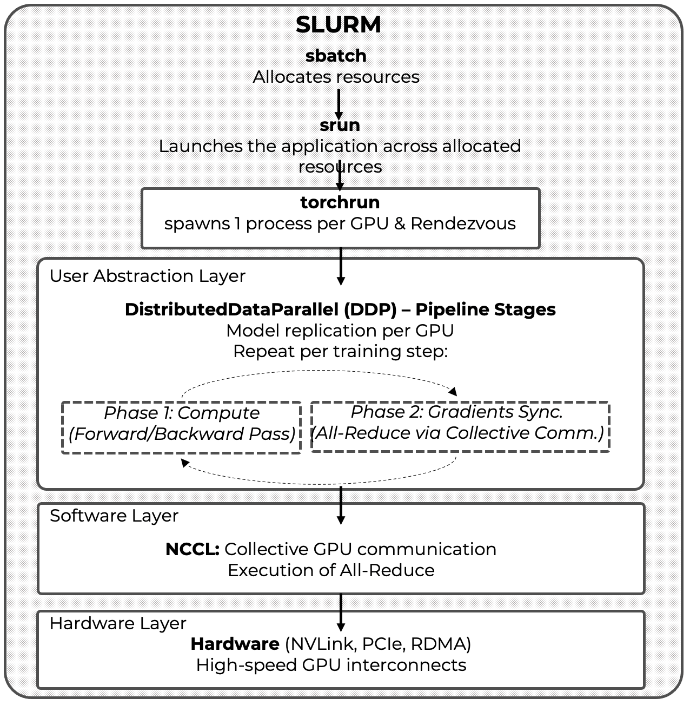
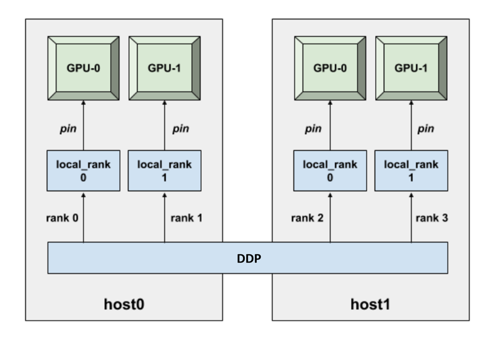
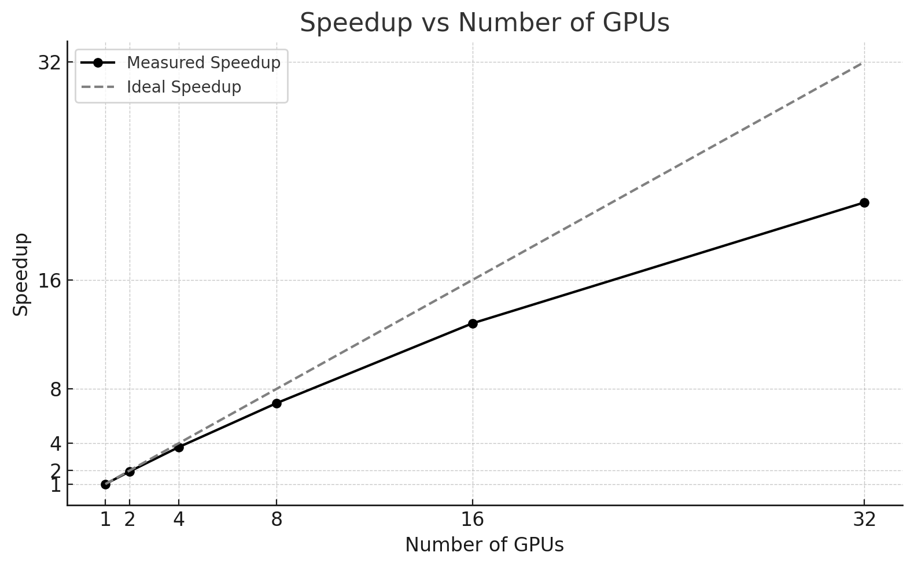

# 12. Parallelizing Model Training with Distributed Data Parallel

* TOC
{:toc}

This chapter assumes that the reader has already studied and worked through Chapter 11, where training efficiency was analyzed and optimized on a single GPU. Concepts such as batch size tuning, DataLoader performance, mixed precision, and balanced pipelines are taken as established knowledge.

Chapter 12 builds directly on those foundations and extends them to a distributed execution context, where multiple GPUs—potentially across multiple nodes—collaborate to train a single model using Distributed Data Parallelism (DDP).

To illustrate this, we will revisit the ViT model introduced earlier and run it in a distributed setup using the MareNostrum 5 supercomputer. On its accelerated partition, we can access up to 8 nodes, each equipped with 4 H100 GPUs. Despite academic usage constraints, this configuration provides sufficient resources to demonstrate how to efficiently scale training workloads across multiple GPUs and nodes.

The focus of this chapter is not algorithmic novelty, but system-level behavior: how distributed training is orchestrated, how performance scales, and why scaling efficiency depends as much on workload characteristics as on hardware availability.

From a performance analysis perspective, this chapter marks a change of regime. In Chapter 11, the training pipeline was local to a single GPU, and performance was governed by the balance between data loading, computation, and memory movement. In distributed training, this pipeline is extended with an additional, unavoidable stage: gradient synchronization across GPUs. This introduces coordination as a first-class cost. Scaling with DDP should therefore not be interpreted as a local optimization, but as a transition to a new performance regime where computation and coordination must be reasoned about jointly.

##  How Computation is Distributed

Before introducing Distributed Data Parallel (DDP), it is important to explicitly connect this chapter with the mental model developed in Chapter 11.

In Chapter 11, performance analysis was grounded in a single-GPU training pipeline: data loading, forward pass, backward pass, and optimizer step. Performance improvements were driven by balancing this pipeline and removing the dominant bottleneck at each stage.

Distributed Data Parallel does not change this local pipeline. Each GPU still executes the same training loop. What DDP changes is the global context in which that pipeline operates: gradients must now be synchronized across devices, communication becomes a first-class cost, and scalability is constrained not only by computation but also by coordination.

As a result, scaling with DDP should not be interpreted as a generic optimization. It represents a transition to a new performance regime, where throughput, training time, efficiency, and cost must be evaluated together.

Conceptually, this means that the training pipeline introduced in Chapter 11 must now be extended. In addition to data loading and GPU computation, each iteration includes a mandatory gradient synchronization stage across GPUs. The frequency and cost of this synchronization are as critical to performance as the amount of computation performed per iteration. Throughout this chapter, this extended pipeline—*computation plus coordination*—will serve as the mental framework for analyzing scalability and understanding when distributed training is effective and when it is not.

### Understanding the Full Stack of Distributed Training

To train deep learning models at scale, multiple components must operate together across different layers of abstraction. These range from low-level hardware interconnects to high-level Python APIs, collectively forming the distributed training software stack introduced earlier in Chapter 6.

We introduce this stack not as a taxonomy of technologies, but as a conceptual tool to reason about *where computation, communication, and coordination costs arise* in distributed training. Understanding which layer is responsible for which cost is essential for interpreting scalability results later in this chapter.

We can describe the distributed training environment from two complementary perspectives: a layered architecture perspective, and an execution flow perspective.

#### 1. Layered Architecture Perspective

As depicted in Figure 6.7, efficient multi-GPU training relies on a layered abstraction model:

- *Hardware level*: fast interconnects such as NVLink, PCIe Gen 5, InfiniBand with RDMA, and GPUDirect form the physical backbone of GPU-to-GPU communication.

- *Software level*: communication libraries such as NCCL and CUDA-aware MPI interface directly with the hardware to implement optimized collective operations (e.g., All-Reduce).

- *User abstraction level*: deep learning frameworks such as PyTorch expose high-level constructs—most notably DistributedDataParallel (DDP)—that encapsulate replication, synchronization, and the Single Program Multiple Data (SPMD) execution model.

Above these layers operates the *HPC execution environment*, managed by SLURM, which is responsible for resource allocation and job scheduling but does not participate directly in the training pipeline itself.

#### 2. Execution Flow Perspective

When a distributed training job is launched on a supercomputer, this layered model unfolds into a concrete execution sequence:

1.  SLURM (srun) allocates compute nodes and GPUs, ensuring exclusive access to resources according to the job specification.

2.  *torchrun* initializes the distributed execution context by spawning one process per GPU and coordinating process discovery through a rendezvous mechanism.

3.  *DistributedDataParallel* (DDP) operates inside each process, executing the training loop, replicating the model, partitioning data, and triggering gradient synchronization.

4.  NCCL performs the actual GPU-to-GPU communication required for gradient aggregation, both within and across nodes.

Figure 12.1 illustrates how these components interact, highlighting the distinction between *fixed, one-time coordination steps* and *per-iteration training operations*. This distinction will be critical when analyzing performance results in the remainder of the chapter.

This figure illustrates the complete execution model of PyTorch Distributed Data Parallel (DDP) training in an HPC environment. SLURM allocates resources (sbatch) and launches the application across the assigned nodes (srun). The torchrun utility then initializes the distributed execution by spawning one process per GPU and performing the rendezvous required for inter-process coordination.

Once initialized, training proceeds inside DDP following a per-iteration pipeline composed of two mandatory phases: local computation (forward and backward passes) and gradient synchronization via collective communication. This synchronization is implemented by NCCL over high-speed hardware interconnects such as NVLink, PCIe, and RDMA.

Throughout this chapter, this pipeline—computation plus coordination—serves as the mental model for analyzing scalability, efficiency, and performance trade-offs in distributed training.

Let us now examine these components in more detail through a concrete scenario: training a Vision Transformer model across 8 GPUs distributed over 2 compute nodes, with 4 GPUs per node.

### What is torchrun?

*torchrun* is the recommended entry point for launching PyTorch programs in a distributed training setup. It does not perform training itself, nor does it participate in the training pipeline. Instead, its role is to *initialize the distributed execution context* so that DistributedDataParallel (DDP) can operate correctly.

*Figure 12.1 – Distributed training in PyTorch: layered architecture and execution flow. The figure highlights the separation between fixed, one-time coordination steps (resource allocation via SLURM and process launch and rendezvous via torchrun) and the recurring training pipeline executed at each iteration (computation with DDP and gradient synchronization via NCCL).*

Conceptually, torchrun belongs to the *job startup and coordination phase*, not to the per-iteration training loop. For this reason, it should be understood as a *fixed-cost component* of distributed execution rather than as a performance optimization mechanism.

When executed, torchrun performs several critical initialization tasks:

- It spawns one Python process (also called a *worker*) per GPU, following the Single Program Multiple Data (SPMD) execution model required by DDP.

- It assigns process identifiers (RANK, WORLD_SIZE, LOCAL_RANK) through environment variables, allowing each process to identify its role within the global communication topology (see Figure 12.3).

- It manages the *rendezvous mechanism* (*rdzv*), which enables all processes to discover each other and agree on a common distributed training session before execution begins.

The rendezvous phase deserves particular attention. All participating processes must connect to a common rendezvous endpoint, defined by a backend and a network address. This coordination step ensures that the full set of processes is present and synchronized before any training begins. Until rendezvous is complete, no forward or backward computation can proceed

A typical torchrun invocation for a job spanning two nodes with four GPUs per node is shown below:

    torchrun \
      --nproc_per_node=4 \
      --nnodes=2 \
      --rdzv_backend=c10d \
      --rdzv_endpoint=node0:29400 \
      train.py

In this example, the *c10d backend*—PyTorch’s default rendezvous backend—is used. It operates over TCP and provides robust inter-node discovery. All processes, regardless of the node on which they run, connect to the same rendezvous endpoint, which acts as the coordination point for the distributed session.

In this example the rdzv_endpoint=node0:29400 argument specifies the hostname (node0) and port (29400) where this coordination occurs. Regardless of which node each process runs on, all of them connect to this same endpoint to initiate the distributed session. The node hosting this endpoint acts as the coordinator.

Once rendezvous is successfully completed, torchrun’s role effectively ends. From this point onward, lower-level libraries such as NCCL take over to handle all performance-critical GPU-to-GPU communication during training.

Because torchrun executes only once per job, *its cost is fixed* and does not scale with the number of training iterations. For short runs or small datasets, this startup overhead can represent a significant fraction of total execution time. For longer runs, it is amortized and becomes negligible.

It is therefore important to emphasize that torchrun is *not an optimization tool*. Its purpose is to enable distributed execution reliably and reproducibly. Performance analysis must be conducted in steady-state conditions, focusing on the per-iteration behavior of computation and synchronization rather than on one-time startup costs.

### What is Distributed Data Parallel?

*DistributedDataParallel* (DDP) is PyTorch’s built-in module for performing data-parallel training across multiple GPUs and compute nodes. Its design is simple yet powerful: each GPU runs a separate process that holds a full copy of the model and operates on a distinct subset of the dataset.

DDP provides a scalable and efficient solution for distributing the workload across multiple GPUs, enabling synchronous training with minimal modifications to a standard PyTorch training script.  
At the core of this approach lies the Single Program, Multiple Data (SPMD) paradigm—already introduced in Chapter 4—where each GPU runs its own Python process that executes the same code but operates on a distinct subset of the data.

During training, DDP performs the following key operations:

- Model replication: Each process (and therefore each GPU) maintains a full replica of the model.

- Data partitioning: The training data is divided into batches, and each GPU receives a different batch to work on. This allows all GPUs to process data in parallel.

- Parallel processing: All GPUs execute the forward and backward passes independently on their respective batches, which significantly accelerates computation.

- Gradient synchronization: After computing gradients, each process participates in an All-Reduce operation to ensure that all model replicas are updated with the same parameters. This keeps the models synchronized across all processes.

A visual representation of this workflow, assuming a single node with four GPUs, is shown in Figure 12.2. Each GPU runs its own process, processes a separate batch of data, and participates in the synchronization step to ensure consistent model updates.

*Figure 12.2 – Data-parallel training with DDP on a single node with four GPUs. Each GPU runs a separate process and receives different input batches. After the forward and backward passes, gradients are synchronized across processes to ensure consistent model updates.*

PyTorch DDP supports multiple communication backends for synchronizing gradients between processes. If NCCL is not available, MPI is used in HPC environments where MPI is already part of the software stack. or Gloo, a collective communication library developed by Meta.

When running DDP across multiple nodes, each process must be aware of its place in the global communication topology. To this end, PyTorch assigns several identifiers:

- local_rank: the process index within a node, typically ranging from 0 to (number of GPUs per node – 1). This is used to bind the process to a specific GPU on that node.

- global rank (rank): a unique identifier for each process across all nodes, from 0 to (world size – 1).

- world size: the total number of processes involved in the training job.

These identifiers help DDP coordinate computation and gradient synchronization across all GPUs, even when distributed over several nodes.

Figure 12.3 illustrates a typical DDP setup involving two compute nodes with two GPUs each. You can see how the processes are assigned local and global ranks, following a pattern reminiscent of the MPI style discussed earlier in Chapter 6. ç

The typical training script using DDP includes the following minimal setup:

    def setup(global_rank, world_size):
        dist.init_process_group(backend="nccl", rank=global_rank, world_size=world_size)

    device = torch.device("cuda:" + str(local_rank))
    model = Net().to(device)
    model = DDP(model, device_ids=[local_rank])

This snippet illustrates the basic steps:

- Initialization of the process group using a backend such as nccl.

- Device binding of each process to a specific GPU via local_rank.

- Model wrapping with DistributedDataParallel to enable automatic synchronization during training.

As mentioned earlier, when DDP uses NCCL as the communication backend, NCCL intelligently adapts its internal mechanism depending on the location of the GPUs involved. For intra-node communication, it leverages high-speed interconnects such as NVLink or PCIe to enable peer-to-peer GPU transfers. For inter-node communication, it uses InfiniBand with RDMA support to minimize latency and bypass the CPU. When available, NCCL takes full advantage of GPUDirect RDMA, which enables direct memory access between GPUs across nodes—eliminating unnecessary memory copies and further reducing communication overhead, as introduced in Chapter 6.

The key scalability question is therefore not whether DDP works—it does—but whether the ratio between per-step computation and per-step communication is favorable. When compute dominates, synchronization is effectively hidden; when it does not, the training loop becomes communication-bound and efficiency drops.

As a result, the central scalability criterion in DDP is not the number of GPUs used, but the ratio between per-iteration computation and per-iteration communication. This ratio determines whether adding GPUs leads to effective scaling or simply amplifies coordination overhead.

Figure 12.3 – DDP setup across two nodes, each with two GPUs. Each GPU is assigned a unique process. local_rank identifies the GPU index within a node, while rank corresponds to the global identifier across all processes. Communication and synchronization are handled transparently by DDP. (Image source: Horovod).

##  Dataset Sharding and Preprocessing in DDP

In DDP training, the model is replicated on each GPU, but each process must work with a different subset of the dataset, as visually emphasized in Figure 12.2. This ensures that each process trains on different samples, the entire dataset is covered in each epoch, and all model replicas remain synchronized throughout the training process.

If not properly handled, two or more processes may read the same data, resulting in duplicated gradients and inefficient training. This section explains how to divide, shuffle, and access data efficiently using PyTorch’s built-in tools.

To enable distributed data loading, PyTorch provides the torch.utils.data.DistributedSampler class, which partitions the dataset across processes, shuffles the data before each epoch, and ensures that each process sees a mutually exclusive subset. A typical usage looks like this:

    sampler = torch.utils.data.distributed.DistributedSampler(
        train_dataset,
        num_replicas=world_size,
        rank=global_rank,
        shuffle=True
    )

    train_loader = torch.utils.data.DataLoader(
        train_dataset,
        sampler=sampler,
        batch_size=batch_size,
        num_workers=4
    )

The key idea is that DDP does not split the dataset automatically—you must explicitly provide a sampler. In each epoch, the sampler shuffles the dataset (if shuffle=True), splits it into num_replicas partitions, and assigns each one according to the process's rank.

Correct dataset sharding is not only a correctness requirement; it is also a performance prerequisite. If multiple processes silently reuse the same samples, measured throughput may look high while the training signal is effectively duplicated and the parallel work is wasted.

From a pipeline perspective, dataset sharding directly influences batch granularity, the amount of useful computation performed per iteration, and the number of synchronization points encountered during training. Poor sharding reduces the effective workload per synchronization step, limiting amortization and pushing the training loop toward a communication-dominated regime.

To ensure proper shuffling, you must call sampler.set_epoch(epoch) at the beginning of each epoch:

    for epoch in range(num_epochs):
        sampler.set_epoch(epoch)
        for batch in train_loader:
            ...

Failing to call set_epoch() would cause all processes to load the same batch sequence in each epoch, which defeats the purpose of parallel training.

In distributed environments, it is common for all processes to share the same filesystem. Downloading the dataset in every process could lead to file corruption or race conditions. The correct approach is:

    download = True if local_rank == 0 else False
    train_set = torchvision.datasets.MNIST("./data", download=download)

Or, using explicit synchronization (similar to MPI):

    if local_rank == 0:
        torchvision.datasets.MNIST("./data", download=True)
    dist.barrier()
    train_set = torchvision.datasets.MNIST("./data", download=False)

The dist.barrier() call ensures that no process starts accessing the dataset until it is fully downloaded and available.

Finally, since DDP spawns one process per GPU, having every process print to standard output would create clutter. To avoid this, restrict logging and checkpoint saving to one designated process:

    if global_rank == 0:
        print(...)

This pattern ensures clean and centralized output during training.

##  Setting Up for DDP Experiment Execution

All the machinery introduced in this section—SLURM directives, environment variables, launchers, and scripts—exists for a single purpose: to enable controlled, reproducible scaling experiments. These details are not presented as boilerplate, but as the means by which performance behavior can be isolated, measured, and interpreted reliably in a distributed HPC environment.

To keep this chapter focused on the computational performance aspects of distributed training, rather than model tuning or accuracy, we follow the same principle as in Chapter 11: all experiments are designed so that students can configure and launch them by editing only the SLURM job script. There is no need to modify the Python code itself—unless they wish to do so for deeper experimentation.

This modular and reproducible setup allows students to explore how throughput and resource usage evolve when scaling the ViT model across multiple GPUs and nodes.

### Code Walkthrough: Key Differences in train_ddp.py

While the train_ddp.py script shares much of its structure with the single-GPU version discussed in Chapter 11, it introduces a number of critical modifications to enable efficient training across multiple GPUs using Distributed Data Parallel (DDP). This section highlights the main elements that differ from the previous implementation and are essential for understanding how DDP works in PyTorch.

**Distributed Initialization**

    from torch.distributed import init_process_group
    init_process_group(backend="nccl")

At the start of the script, a distributed process group is initialized using init_process_group(). This call sets up the communication backend among processes. The nccl backend is used here, as it provides high performance GPU communication primitives well-suited for NVIDIA hardware. This initialization is mandatory for DDP to function and must happen before any model wrapping or communication calls. The script then reads the global rank and world size from the environment, as passed by torchrun:

    world_size = int(os.environ["WORLD_SIZE"])
    rank = int(os.environ["RANK"])

As we already presented in this chapter, these values are used to determine which GPU the current process should operate on and how to split the dataset.

**GPU Device Selection Per Process**

    device_id = rank % torch.cuda.device_count()

Each process is pinned to a specific GPU by computing its local device ID. This ensures that the model and data are loaded onto the appropriate device, and prevents conflicts between processes.

**Distributed Data Loading**

    from torch.utils.data.distributed import DistributedSampler

    train_sampler = DistributedSampler(train_ds, num_replicas=world_size, 
                                       rank=rank, drop_last=True)

Instead of relying on random shuffling in DataLoader, the script uses a DistributedSampler to partition the dataset across all processes. Each process receives a unique, non-overlapping subset of the data.

**Model Wrapping with DDP**

    model.to(device_id)
    model = DDP(model, device_ids=[device_id])

Once the model is instantiated, it is moved to the appropriate GPU and wrapped with torch.nn.parallel.DistributedDataParallel. This wrapper intercepts the backward() call during training and performs automatic gradient averaging across all processes. As a result, all model replicas remain synchronized after each optimization step.

If requested, the script also applies JIT compilation after wrapping:

    if args.compile:
        model = torch.compile(model, mode="reduce-overhead")

#### Metric Aggregation

    from torch.distributed import all_reduce, ReduceOp

    accuracy = torch.tensor(accuracy_score(references, predictions), device=device_id)
    all_reduce(accuracy, op=ReduceOp.AVG)

Since each process only evaluates its local validation subset, final accuracy must be aggregated across all GPUs. This is achieved using all_reduce with the average operation (ReduceOp.AVG), yielding a global accuracy value consistent across all processes.

#### Logging and Output from DDP Training

To support this hands-on exploration, the script train_ddp.py is instrumented to print all relevant training metadata and metrics at runtime. These logs are written automatically to standard output and stored in the file defined by \#SBATCH --output in the SLURM script.

Each training run prints:

- The full configuration (dataset, model, batch sizes, precision, etc.).

- Training throughput per epoch.

- Final average throughput (excluding first epoch).

- Validation accuracy (averaged across GPUs using all_reduce).

- Reserved GPU memory.

This logging is handled with rank-aware functions (log_rank), so only the process with global rank 0 prints output—avoiding clutter from multiple parallel processes.

Example output:

    INFO - ### model_name: vit
    INFO - ### num_workers: 8
    INFO - ### batch_size: 64
    INFO - ### mixed_precision: bf16
    INFO - ### compile: True
    INFO - ### optimizer: sgd
    INFO - ### dataset: micro-224
    INFO - ### Total number of parameters: 631M
    INFO - [EPOCH: 3] Accuracy: 0.431 | Validation throughput: 512 imgs/s
    INFO - Training throughput: 1216 imgs/s
    INFO - GPU memory reserved: 29.8 GB

The rest of the script—such as argument parsing, model construction, AMP handling, and training loop structure—remains virtually unchanged from the single-GPU version explained in Chapter 11. Refer to that section for detailed insights into these shared components.

This continuity is deliberate: distributed training does not introduce a new kind of optimization, but rather reuses the same tuning levers (batch size, AMP, compilation, DataLoader configuration) under stricter constraints, where imbalance and overheads become more visible.

### Slurm Job Submission Scripts

All experiments in this chapter are launched using SLURM scripts. For instance, let’s consider one that executes training on 2 nodes, with 4 GPUs per node—making 8 GPUs in total. The general structure of the SLURM script includes the following lines of code.

#### SLURM Directives

    #!/bin/bashiming gh
    #SBATCH --job-name=ddp_tiny_2nodes_4gpus
    #SBATCH --chdir=.
    #SBATCH --output=./results/R-%x.%j.out
    #SBATCH --error=./results/R-%x.%j.err
    #SBATCH --nodes=2
    #SBATCH --ntasks-per-node=1
    #SBATCH --gres=gpu:4
    #SBATCH --cpus-per-task=20
    #SBATCH --time=01:30:00
    #SBATCH --account=<account>
    #SBATCH --qos=acc_debug
    #SBATCH --exclusive

#### Container Setup and Environment

As in Chapter 11, we rely on Singularity containers to ensure consistency:

    module purge
    module load singularity
    SINGULARITY_CONTAINER=/gpfs/apps/MN5/ACC/SINGULARITY/SRC/images/nvidiaPytorch24.07

This container includes all required software: CUDA, PyTorch, NCCL, and driver compatibility for H100 GPUs.

#### Setting the Rendezvous Address for torchrun

In order for torchrun to coordinate all participating processes, it requires a rendezvous address formed by an IP or hostname (MASTER_ADDR) and a port (MASTER_PORT). These environment variables must be set explicitly in the SLURM script before launching the job:

    MASTER_ADDR=$(scontrol show hostnames $SLURM_JOB_NODELIST | head -n 1)
    MASTER_PORT=6000

This configuration ensures that all processes, regardless of the node they are running on, can connect to the same rendezvous point—hosted on the first node in the SLURM allocation—using the designated port. This step is essential for establishing inter-process communication before training begins.

You may append this setup directly before the CMD definition to make sure torchrun has the required environment context.

#### Training Parameters via Shell Variables

The script uses environment variables and flags to define the training configuration:

    MODEL="vit"
    DATASET="./datasets/tiny-224"
    EPOCHS=5
    BS=128
    NW=10
    OPTIM=sgd

    PYTHON_ARGS="--model_name $MODEL \
                 --dataset $DATASET \
                 --num_epochs $EPOCHS \
                 --batch_size $BS \
                 --eval_batch_size $BS \
                 --num_workers $NW \
                 --optimizer $OPTIM \
                 --mixed_precision bf16 \
                 --compile"

Just as in Chapter 11, students can experiment by changing these variables directly in the SLURM file.

#### Launching the DDP Job with torchrun

The key difference in distributed training is that instead of python train.py, we use torchrun to launch a process per GPU:

    LAUNCHER="torchrun \
        --nproc_per_node=4 \
        --nnodes=2 \
        --node_rank=$SLURM_PROCID \
        --rdzv_endpoint=$MASTER_ADDR:$MASTER_PORT \
        --rdzv_backend=c10d"

    PYTHON_FILE="./train_ddp.py"
    export CMD="$LAUNCHER $PYTHON_FILE $PYTHON_ARGS"
    SINGULARITY_ARGS="--nv $SINGULARITY_CONTAINER"

Then the command is executed inside the container with:

    SRUN_ARGS="--cpus-per-task $SLURM_CPUS_PER_TASK --jobid $SLURM_JOB_ID"
    srun $SRUN_ARGS singularity exec $SINGULARITY_ARGS bash -c "$CMD"

torchrun takes care of launching one Python process per GPU, setting the proper environment variables (RANK, WORLD_SIZE, etc.), and managing inter-process communication.

To summarize this specific case, let’s review how the 8 parallel processes are launched: SLURM starts a single task per node (--ntasks-per-node=1) across two nodes (--nodes=2). Each of these two tasks is granted access to 4 GPUs (--gres=gpu:4) and their corresponding 80 CPU cores (--cpus-per-task=80).

The management of multiple GPUs is not handled directly by SLURM, but instead by PyTorch DDP internally via torchrun. When executed inside each SLURM task, torchrun launches 4 independent Python subprocesses, each bound to a different GPU (thanks to --nproc_per_node=4). This procedure is repeated across the two nodes (--nnodes=2), resulting in a total of 8 distributed training processes.

##  Throughput and scalability measurements

With the theoretical explanations in place, students are now ready to perform the hands-on exercises presented in the remainder of this chapter, analyzing how performance scales with parallelism in real-world multi-GPU training scenarios.

In this section, we analyze the scalability of Distributed Data Parallel training using the Vision Transformer (ViT) model trained on two datasets of different sizes: micro-224 and tiny-224. The goal is not merely to observe numerical speedups, but to understand how dataset size, synchronization frequency, and communication overhead interact to shape scalability.

For all experiments, we use the same Python training script (train_ddp.py) and SLURM batch script, modifying only the number of GPUs and the dataset size.

It is important to note that distributed training affects how certain hyperparameters—such as batch size—should be interpreted. As seen in the code, the local batch size remains fixed per GPU, while the global batch size is computed as: global_batch_size = local_batch_size × number_of_GPUs.

Before looking at the numbers, it is useful to frame what “good scaling” means in this context. As in Chapter 5, performance gains appear only when useful work dominates overhead. In DDP, the relevant overhead is no longer only memory movement, but also gradient synchronization: the larger the compute per step (and the larger the effective work per GPU between synchronizations), the better the communication cost can be amortized—especially across nodes.

When interpreting scalability results, it is essential to distinguish between “how fast the system can process data” (throughput) and “how quickly the experiment completes” (time-to-solution). Depending on the user goal, these two perspectives may lead to different—and sometimes opposite—scaling decisions. In summary, we explicitly distinguish between two perspectives:

- throughput scaling (images per second), which reflects how efficiently additional GPUs are utilized;

- training time reduction, which reflects how quickly a fixed workload is completed.

As we will see, these two metrics do not scale in the same way, and interpreting one without the other often leads to incorrect conclusions.

Before presenting the results, it is important to clarify the role of the micro-224 dataset in this analysis. This dataset is not intended to serve as a realistic benchmark, but as an experimental instrument: its small size allows short runtimes, rapid iteration, and clear visibility of scalability trends. As such, micro-224 is deliberately chosen to expose coordination overheads and scaling limits that would be harder to observe with larger datasets.

### Results with micro-224 Dataset

The first set of experiments uses the micro-224 dataset. This dataset is intentionally small, allowing very short runtimes and making it particularly useful as an instrument for observing relative scalability trends, rather than as a realistic benchmarking workload.

The results of these experiments are summarized in Table 12.1, which reports three metrics for each GPU configuration: (i) *complete training time*, (ii) *training throughput*, and (iii) *GPU memory usage*.

| **GPUs** | **Complete Training Time(s)** | **Throughput (img/s)** | **Memory (GB)** |
|:--:|:--:|:--:|:--:|
| **1** | 556 | 240 | 53 |
| **2** | 439 | 464 | 53 |
| **4** | 380 | 892 | 53 |
| **8** | 347 | 1668 | 53 |
| **16** | 330 | 3075 | 53 |
| **32** | 328 | 5205 | 53 |

Table 12.1 – ViT training on the micro-224 dataset: complete training time, throughput, and GPU memory usage.

As shown in Table 12.1, training throughput increases significantly as the number of GPUs grows, from 240 images/s on a single GPU to 5205 images/s on 32 GPUs. This trend is visualized in Figure 12.4, which shows a near-linear increase in throughput with the number of GPUs.

*Figure 12.4 – Training throughput (images per second) as a function of the number of GPUs for the micro-224 dataset.*

To better assess scalability, Figure 12.5 reports the measured speedup relative to the single-GPU baseline, together with the ideal linear speedup. While speedup increases steadily, the gap with respect to the ideal curve widens as more GPUs are added, indicating growing overheads.

Figure 12.5 – Measured speedup versus ideal linear speedup for ViT training on micro-224.

At the same time, complete training time behaves very differently from throughput. Although throughput improves by more than 22× when moving from 1 to 32 GPUs, the total training time is reduced from 556 seconds to 328 seconds, corresponding to only a 1.7× reduction. Most of the time savings occur at small scales (1–2 GPUs), while beyond 8 GPUs the curve clearly flattens.

This apparent discrepancy is not a contradiction, but a direct consequence of what each metric captures. Throughput measures the steady-state rate at which images are processed once training is underway, whereas complete training time measures the total wall-clock duration of the experiment, including fixed and weakly scalable components such as initialization, distributed setup, validation, logging, and synchronization overheads. With the micro-224 dataset, the number of batches processed per GPU becomes very small as the GPU count increases, leaving little opportunity to amortize these fixed costs.

Using the single-GPU throughput (240 images/s) as a baseline, we compute the ideal throughput for each configuration and derive the corresponding parallel efficiency, as reported in Table 12.2.

| **GPUs** | **Ideal Throughput (img/s)** | **Actual Throughput (img/s)** | **Efficiency (%)** |
|:--:|:--:|:--:|:--:|
| **1** | 240 | 240 | 100 |
| **2** | 480 | 464 | 96,7 |
| **4** | 960 | 892 | 92,9 |
| **8** | 1929 | 1668 | 86,9 |
| **16** | 3840 | 3075 | 80,1 |
| **32** | 7680 | 5205 | 67,7 |

Table 12.2 – Ideal throughput, measured throughput, and parallel efficiency for ViT training on the micro-224 dataset.

The efficiency values decrease gradually from 96.7% at 2 GPUs to 67.7% at 32 GPUs. This trend is expected and reflects the increasing impact of inter-GPU communication and coordination overheads as the system scales. Importantly, this loss of efficiency coexists with strong absolute throughput gains, reinforcing the idea that efficiency and performance must be interpreted together, and always in the context of the workload size.

Overall, the micro-224 results clearly illustrate two key points. First, throughput-based metrics can indicate excellent scalability even when time-to-solution improvements are modest. Second, when the workload is too small, distributed training quickly enters an overhead-dominated regime, where additional GPUs continue to increase processing rate but no longer reduce total execution time in a meaningful way. These observations motivate the comparison with a larger dataset in the next section.

### A Brief Analytical Reflection

Although the primary goal of this book is to help students understand how to deploy and scale deep learning workloads on HPC infrastructure—rather than to teach formal performance analysis methodologies—we take a brief detour to reflect on what can be inferred from the results obtained so far.

This section, including the subsections *Marginal Gains per Doubling* and *Training Time Saturation*, is not required to complete the chapter tasks. It is included as an optional opportunity to develop deeper intuition about scalability behavior beyond raw performance numbers.

The discussion that follows is not intended as a rigorous or comprehensive performance study. Instead, it invites the reader to look beyond headline metrics such as throughput and to reason about trends, limits, and trade-offs that emerge when scaling distributed training workloads.

In practice, students often stop at the impressive increase in throughput achieved by adding more GPUs. However, even a basic inspection of the same data can reveal deeper insights about diminishing returns, overhead amortization, and the practical limits imposed by coordination and synchronization. With this spirit, we include two short analyses below—not as part of the core curriculum, but as an opportunity to think critically about what the data is actually telling us.

.

#### Marginal Gains per Doubling

To further analyze the scaling behavior, we examine how much additional throughput is obtained when doubling the number of GPUs:

| **GPUs** | **Throughput (img/s)** | **Marginal Gain (img/s)** | **Percentage Gain (%)** |
|:--:|:--:|:--:|:--:|
| 1→2 | 240 → 464 | +224 | +93 |
| 2→4 | 464 → 892 | +428 | +92 |
| 4→8 | 892 → 1668 | +776 | +87 |
| 8→16 | 1668 → 3075 | +1407 | +84 |
| 16→32 | 3075 → 5205 | +2130 | +69 |

Table 12.3 – Throughput gains per GPU doubling during ViT training on micro-224, showing diminishing returns beyond 16 GPUs.

The table reveals a high rate of throughput gain up to 16 GPUs, with each doubling resulting in nearly proportional performance improvements. However, from 16 to 32 GPUs, the gains begin to diminish more noticeably, likely due to increasing communication and synchronization overheads. That said, these costs have not yet become a full bottleneck, as throughput continues to increase.

#### Training Time Saturation

In contrast with throughput, the reduction in total training time becomes increasingly modest after a certain scale:

| **GPUs** | **Training Time (s)** | **Gain vs Previous (s) (%)** | **Gain vs 1 GPU (%)** |
|:--:|:--:|:--:|:--:|
| **1** | 556 | — | — |
| **2** | 439 | -117 s (-21%) | -21 |
| **4** | 380 | -59 s (-13%) | -32 |
| **8** | 347 | -33 s (-9%) | -38 |
| **16** | 330 | -17 s (-5%) | -41 |
| **32** | 328 | -2 s (-0.6%) | -41 |

Table 12.4 – Training time reduction across different GPU counts, showing saturation effects beyond 8 GPUs.

Despite a 21× increase in throughput from 1 to 32 GPUs, total training time is only reduced by 1.7×. Most of the time savings occur in the first few configurations, and the curve flattens significantly beyond 8 GPUs. This behavior reflects the classic manifestation of Amdahl’s Law in deep learning workloads: even with massive parallelism, some parts of the pipeline—such as dataset loading, validation, and other non-parallel operations—remain serial or poorly scalable, thus limiting overall speedup.

From a systems perspective, this is a pipeline effect: as the parallel portion accelerates, fixed or weakly-scalable stages (I/O, evaluation, orchestration, logging) increasingly dominate end-to-end time, regardless of how fast the GPUs compute.

When examining the standard output from the 32-GPU run, we observe the following message:

    INFO - ### Total training samples (batches): 384 (3)

This indicates that each process only handled 3 batches—an extremely small number in practice.

With only a handful of iterations per process, distributed overheads (startup, synchronization, and evaluation) cannot be amortized. In such conditions, throughput may still scale, but time-to-solution becomes dominated by fixed costs and provides a distorted view of real distributed efficiency.

Task 12.1 – Reproducing Distributed Training Results on MN5

Reproduce the distributed training results reported in Table 12.1 by training the ViT model on the micro-224 dataset using 1, 2, 4, 8, 16, and 32 GPUs on MareNostrum 5.

Use the provided train_ddp.py script and the corresponding SLURM batch files. For each configuration, record:

• complete training time,

• average training throughput (excluding epoch 1),

• GPU memory usage.

Organize your results in a table equivalent to Table 12.1 and verify whether your numbers are consistent with those reported in the chapter.

What to reason about (conceptual):

Analyze how throughput and training time evolve as the number of GPUs increases.

Explain why throughput scales much more favorably than total training time, explicitly referring to:

• distributed overheads,

• synchronization costs,

• and non-parallelizable components of the training pipeline.

**Optional** reflection:

Students interested in developing deeper intuition about scalability behavior are encouraged to read the A Brief Analytical Reflection section. This reflection is not required to complete the tasks, but provides additional insight into how to interpret scaling results beyond raw throughput numbers.

Your reasoning should clearly distinguish between rate-based metrics (throughput) and time-to-solution metrics.

### Results with the Tiny Dataset

To better stress the system and evaluate scalability under more realistic conditions, we repeat the experiment using the larger tiny-224 dataset. Table 12.5 presents the results from the different runs.

| **GPUs** | **Complete Training Time(s)** | **Throughput (img/s)** | **Memory (GB)** |
|:--:|:--:|:--:|:--:|
| **1** | 2350 | 242 | 53 |
| **2** | 1354 | 475 | 53 |
| **4** | 842 | 935 | 53 |
| **8** | 605 | 1817 | 53 |
| **16** | 457 | 3597 | 53 |
| **32** | 310 | 6914 | 53 |

Table 12.5 – ViT training on tiny-224 dataset.

In this case, each GPU processes a larger number of batches, providing a clearer picture of scalability, as illustrated in Figure 12.6, which compares the speedup achieved with both datasets. Compared to micro-224, both throughput and training time scale more linearly, as the larger dataset allows computation to dominate fixed and communication overheads. This highlights the critical role of dataset size when evaluating distributed training performance.

Figure 12.6 – Speedup vs. number of GPUs.

Task 12.2 – Analyze and Compare Scaling Efficiency

Repeat Task 12.1 using the tiny-224 dataset. Collect the same metrics and organize your results in a table equivalent to Table 12.5.

Compute the parallel efficiency for each GPU configuration and construct a comparison table analogous to Table 12.6, showing efficiency for both micro-224 and tiny-224.

What to reason about (conceptual):

Compare the scaling behavior of the two datasets and answer explicitly:

• Why does efficiency remain higher for tiny-224 as the number of GPUs increases?

• What role does dataset size play in amortizing communication and synchronization overheads?

• Would you expect efficiency to further improve with an even larger dataset? Why or why not?

Conclude with a short synthesis explaining how dataset size acts as a control parameter for distributed scalability.

### 

##  Critical Thinking for an HPC practitioner

This section is intended to bridge experimental results and real-world decision-making, rather than to introduce new techniques or required analyses.

Having conducted and compared experiments using two datasets of different sizes—micro-224 and tiny-224—we are now in a position to step back and analyze what these numbers actually reveal. Beyond reporting throughput and training time, it is essential to interpret the observed trends critically and understand the broader implications for distributed deep learning training. This section offers a series of reflective insights based on the experiments conducted so far.

### Dataset Size Matters for Scalability

One of the most striking differences between the two experiments lies in the efficiency of parallel scaling. While the micro-224 dataset exhibited diminishing returns beyond 8–16 GPUs, the tiny-224 dataset continued to benefit from larger GPU counts, maintaining efficiency levels close to ideal.

To make this concrete, we compute the efficiency for each run by comparing actual throughput to ideal linear speedup:

<table style="width:60%;">
<colgroup>
<col style="width: 14%" />
<col style="width: 22%" />
<col style="width: 23%" />
</colgroup>
<thead>
<tr>
<th style="text-align: center;"><strong>GPUs</strong></th>
<th style="text-align: center;">
<strong>micro-224</strong>

<strong>Efficiency (%)</strong>
</th>
<th style="text-align: center;">
<strong>tiny-224</strong>

<strong>Efficiency (%)</strong>
</th>
</tr>
</thead>
<tbody>
<tr>
<td style="text-align: center;"><strong>1</strong></td>
<td style="text-align: center;">100.0</td>
<td style="text-align: center;">100.0</td>
</tr>
<tr>
<td style="text-align: center;"><strong>2</strong></td>
<td style="text-align: center;">96.7</td>
<td style="text-align: center;">98.1</td>
</tr>
<tr>
<td style="text-align: center;"><strong>4</strong></td>
<td style="text-align: center;">92.9</td>
<td style="text-align: center;">96.5</td>
</tr>
<tr>
<td style="text-align: center;"><strong>8</strong></td>
<td style="text-align: center;">86.9</td>
<td style="text-align: center;">93.8</td>
</tr>
<tr>
<td style="text-align: center;"><strong>16</strong></td>
<td style="text-align: center;">80.1</td>
<td style="text-align: center;">92.9</td>
</tr>
</tbody>
</table>

Table 12.6 – Comparison of efficiency between micro-224 and tiny-224 datasets.

These results clearly show that larger datasets lead to better scalability, as they allow more computation to be performed per GPU before synchronization is required. This observation aligns with common HPC principles: when parallelizing workloads, the communication overhead becomes increasingly significant unless the amount of work per process is sufficiently large.

More broadly, this comparison highlights a fundamental scalability lesson: *scalability is not an intrinsic property of the training framework or the parallelization strategy, but a property of the workload itself.*

Distributed Data Parallel provides the mechanism for scaling, but whether scaling is effective depends on how much useful computation each process can perform between synchronization points.

Dataset size therefore acts as a control parameter: it determines batch granularity, the number of iterations per GPU, and the degree to which communication overhead can be amortized over computation.

### Training Time Saturation vs. Throughput Scaling

Although training throughput (measured in images per second) increases nearly linearly as more GPUs are added—especially for the tiny-224 dataset—the total training time, or time-to-solution, does not scale proportionally.

For example, when moving from 1 to 32 GPUs on micro-224 (Table 12.1), throughput improves by more than 20×, while the total training time is reduced by only about 1.7×.

This discrepancy highlights the fundamental difference between rate-based metrics, which describe how fast the system processes data, and end-to-end metrics, which capture how long a fixed workload actually takes to complete.

This behavior is explained by the presence of components in the training loop that do not scale—or only scale poorly—with additional resources. These include:

- Data loading and I/O latency

- Gradient synchronization steps

- Validation loop

- Logging, checkpointing, and metric aggregation

- Python and library-level overheads at initialization

As the parallel portion of the workload accelerates, these serial or weakly scalable components increasingly dominate the overall execution time.

This is a direct manifestation of Amdahl’s Law at the level of the full training pipeline: regardless of how efficiently the parallel stages scale, the fraction of work that remains serial ultimately limits the achievable reduction in time-to-solution.

### When More GPUs Don’t Help (Enough)

It is a common—and often naive—assumption that adding more GPUs will always lead to faster training. The experiments above explicitly challenge this myth.

While increasing the number of GPUs almost always raises throughput, the impact on total training time can become marginal or even negligible beyond a certain scale.

For example, using the micro-224 dataset:

- From 8 to 16 GPUs, training time is only reduced by 17 seconds.

- From 16 to 32 GPUs, the improvement drops to just 2 seconds—less than 1%.

By contrast, tiny-224 dataset exhibits a much healthier time reduction curve:

- From 8 to 16 GPUs: −148 s (−24%).

- From 16 to 32 GPUs: −147 s (−32%).

These results reveal the existence of distinct execution regimes in distributed training.

At smaller scales or with sufficiently large workloads, training operates in a compute-dominated regime, where adding GPUs meaningfully reduces time-to-solution.

As scale increases—or when the workload is too small—the system transitions into an overhead-dominated regime, where synchronization, I/O, validation, and orchestration costs limit further gains.

This transition defines a practical upper bound on useful parallelism for a fixed problem size. Beyond that point, additional GPUs remain partially underutilized, and the question is no longer “Does it scale?” but “Is it worth it?”

This distinction is critical in real HPC environments, where resource allocations are finite, shared, and often constrained by queue policies, cost, or energy budgets.

Understanding when more GPUs stop providing meaningful benefits is therefore essential for making informed and responsible scaling decisions in practice.

>Task 12.3 – Investigate Diminishing Returns in Training Time
>
>Using the training time measurements obtained for micro-224 and tiny-224, analyze >how total training time decreases as more GPUs are added.
>
>Use Table 12.4 and the corresponding tiny-224 results as the basis for your >analysis.
>
>What to reason about (conceptual):
>
>Identify where diminishing returns become evident and answer explicitly:
>
>• Why does training time stop improving beyond a certain GPU count?
>
>• Which components of the training workflow contribute to this saturation?
>
>List at least three contributing factors (e.g., I/O, synchronization, validation, >logging) and discuss their impact from a pipeline perspective.
>
>Finally, explain the practical implications of these observations for HPC users >allocating large GPU resources.

Once diminishing returns in training time have been identified, the next question is no longer technical but strategic: given these trade-offs, how should one choose the scale of an experiment in practice?

### Relative versus Absolute Performance

At first glance, the results obtained with the tiny-224 dataset may appear counterintuitive: *parallel efficiency decreases as more GPUs are added, yet the absolute performance gains continue to grow*. This apparent paradox is worth examining carefully, as it captures a key distinction between relative and absolute performance metrics in large-scale systems.

To make this concrete, Table 12.7 reports the marginal throughput gains obtained when doubling the number of GPUs. Rather than focusing on efficiency percentages, this analysis asks a different question: *how much additional work does the system deliver when more resources are allocated?*

| **GPUs** | **Throughput (img/s)** | **Marginal Gain (img/s)** | **Percentage Gain (%)** |
|:--:|:--:|:--:|:--:|
| 1→2 | 242 → 475 | +233 | +96% |
| 2→4 | 475 → 935 | +460 | +97% |
| 4→8 | 935 → 1817 | +882 | +94% |
| 8→16 | 1817 → 3597 | +1780 | +98% |
| 16→32 | 3597 → 6914 | +3317 | +92% |

Table 12.7 **–** Throughput gain per GPU doubling during ViT training on the tiny-224 dataset.

The table shows that although parallel efficiency gradually declines, the absolute throughput gain per doubling actually increases. Moving from 1 to 2 GPUs yields an additional 233 images per second, whereas moving from 16 to 32 GPUs yields more than 3300 additional images per second—over an order of magnitude more in raw processing capacity.

This behavior is not contradictory. Efficiency is a relative metric that measures how close scaling is to an ideal baseline, whereas throughput is an absolute metric that measures how much work the system performs. As the system scales, relative efficiency may drop due to increasing coordination and communication overheads, while the total amount of useful computation delivered by the system can still grow substantially.

Figure 12.7 visualizes this trade-off by plotting throughput and efficiency on the same graph. Throughput continues to increase almost linearly with the number of GPUs (solid black line), while efficiency decreases more gradually (dashed gray line). Together, these curves illustrate the fundamental tension between scalability and absolute performance.

Figure 12.7 – Throughput versus parallel efficiency for ViT training on the tiny-224 dataset.

From a practical HPC perspective, this distinction is crucial. In scenarios where time-to-solution is the primary objective—such as rapid prototyping, time-constrained fine-tuning, or short allocation windows on a shared supercomputer—the marginal gains in throughput may justify the use of additional GPUs, even when efficiency is no longer near ideal. In other contexts, where cost, energy consumption, or fair resource usage dominate, the same scaling choice may be inappropriate.

In short, *efficiency tells us how well we scale; throughput tells us how much we get done*. Understanding the difference between these two perspectives is essential for making informed and intentional scaling decisions.

The perspective developed in this section directly informs the next step: identifying a practical “sweet spot” for scaling. Rather than optimizing a single metric, the goal is to make an explicit, intent-driven decision based on throughput gains, efficiency losses, and time-to-solution requirements.

This tension between relative efficiency and absolute throughput is precisely what Task 12.4 asks you to reason about when selecting a ‘sweet spot’ under different constraints.

#### 

#### 

#### 

#### 

### Identifying the “Sweet Spot”

From a practical standpoint, users often face trade-offs between performance, cost, and resource availability. Looking at the tiny-224 experiments, we observe the following:

- 8 GPUs already provide over 7× throughput compared to 1 GPU, with good efficiency.

- 16 GPUs double that again, still maintaining strong performance.

- Beyond 16 GPUs, speedups remain impressive, but the marginal benefit per GPU is lower.

Thus, a reasonable “sweet spot” for training this particular model on tiny-224 could be 8–16 GPUs, where both throughput and efficiency remain high, and resource usage is still manageable. Pushing to 32 GPUs offers faster execution, but may not justify the additional cost in all cases—especially under shared or constrained HPC allocations.

Rather than seeking a universally optimal configuration, the notion of a ‘sweet spot’ is inherently contextual: it depends on workload size, system scale, and—most importantly—the user’s objective.

The experiments above show that scaling can look excellent under one metric and disappointing under another. This is not a contradiction—it is a reminder that scale must be interpreted through intent.

Task 12.4 – Find the Sweet Spot for Your Use Case

Based on the tiny-224 results and the marginal throughput gains reported in Table 12.7, identify an appropriate GPU count for training the ViT model under the following scenarios:

1\. A tight deadline with no GPU availability constraints.

2\. A limited GPU allocation where efficiency matters.

What to reason about (conceptual):

For each scenario, justify your choice using concrete arguments derived from:

• throughput scaling,

• parallel efficiency,

• training time reduction.

Reflect briefly on how different objectives (time-to-solution vs. efficiency) lead to different scaling decisions, and why “more GPUs” is not always the optimal choice.

##  Foundational Performance Principle \#4 

The scalability results presented in this chapter illustrate a recurring tension in high-performance computing: increasing resources often improves throughput, yet parallel efficiency steadily declines.

Interpreting these results requires moving beyond purely technical metrics and explicitly considering the *intent* behind scaling decisions. In this sense, this principle builds directly on the previous one: once a training pipeline is locally balanced, as discussed in Chapter 11, the key question is no longer how to optimize it further in isolation, but how—and whether—it should be scaled to serve a concrete purpose.

### Scale Must Serve Purpose

Scaling is not an objective in itself, but a means to achieve a specific goal.  
In modern HPC and AI systems, scaling decisions must be guided by workload intent—such as minimizing time-to-solution, maximizing throughput, reducing cost, or operating within energy and resource constraints.

While increasing scale typically reduces parallel efficiency due to communication and coordination overheads, it may still provide greater practical value by meeting deadlines, accelerating iteration cycles, or enabling larger experiments within fixed time windows.  
Conversely, choosing not to scale can be the correct decision when efficiency losses, cost, or energy impact outweigh the benefits.

Performance evaluation is therefore context-dependent. Effective system design requires balancing scalability, efficiency, cost, and sustainability—rather than pursuing maximum utilization or scale as ends in themselves.

The analyses presented in Section 12.5 offer a concrete empirical demonstration of this principle, showing how the same experimental results can lead to very different scaling decisions depending on the intended objective.

These reflections reinforce a central message of this chapter: distributed training is not simply about adding hardware, but about understanding the interplay between problem size, hardware topology, software efficiency, and user intent. PyTorch’s DDP model, combined with well-tuned SLURM configurations and appropriately sized datasets, provides a powerful framework for large-scale training—but only thoughtful interpretation turns scalability into effective practice.

This chapter thus consolidates the ideas introduced in Part IV, showing how local optimization and distributed scaling must ultimately be aligned with purpose to unlock meaningful large-scale AI workflows. Distributed training does not reward scale indiscriminately; it rewards scale applied with intent.

##  Key Takeaways from Chapter 12

- PyTorch Distributed Data Parallel (DDP) is the preferred approach for scaling training across multiple GPUs, offering both performance and ease of use through automatic gradient synchronization.

- Each process in DDP runs independently on one GPU with its own model replica and data shard, following the Single Program Multiple Data (SPMD) paradigm.

- Gradient synchronization is efficiently handled by PyTorch after each backward pass, ensuring consistent model updates across all processes.

- The combination of torchrun, DistributedSampler, and DistributedDataParallel allows for easy integration of DDP into existing training workflows with minimal code changes.

- I/O, validation, and communication overheads (e.g., NCCL synchronization) become more significant as the number of GPUs increases, and must be considered when analyzing performance results.

- The size of the dataset matters: small datasets like micro-224 may limit the number of batches processed per GPU, making it harder to observe meaningful scalability. Larger datasets like tiny-224 provide a better ground for scalability assessments.

- Scalability must be evaluated carefully: while throughput tends to scale linearly with the number of GPUs, the total training time improves more modestly due to fixed overheads (e.g., model initialization, warm-up, validation).

- Measuring throughput alone can be misleading: always interpret results in the context of what is (and isn’t) included in the timing—warm-up, validation, startup cost, etc.

- Practical scalability experiments on real supercomputers like MareNostrum 5 reveal the non-idealities of distributed training, making them a valuable learning experience.

- A thoughtful analysis of efficiency and scaling behavior is essential for making informed decisions in practice.

- Scaling is a decision, not a default: choose GPU count according to intent (time-to-solution, throughput targets, allocation constraints, energy/cost), not solely according to peak efficiency.
