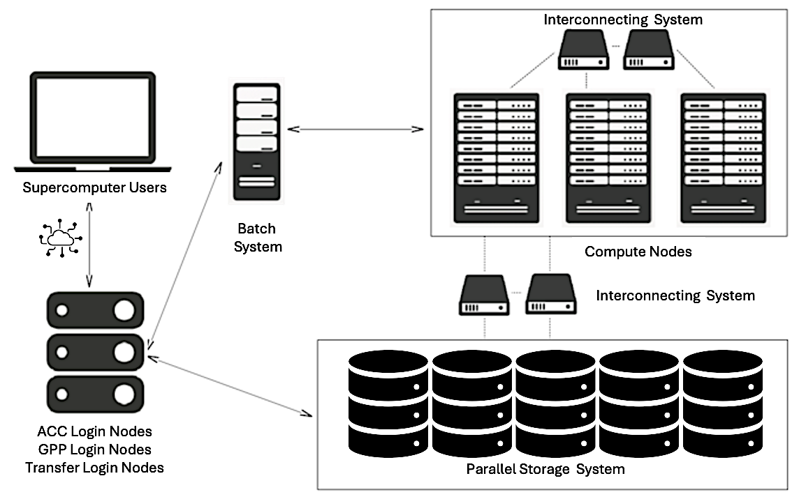
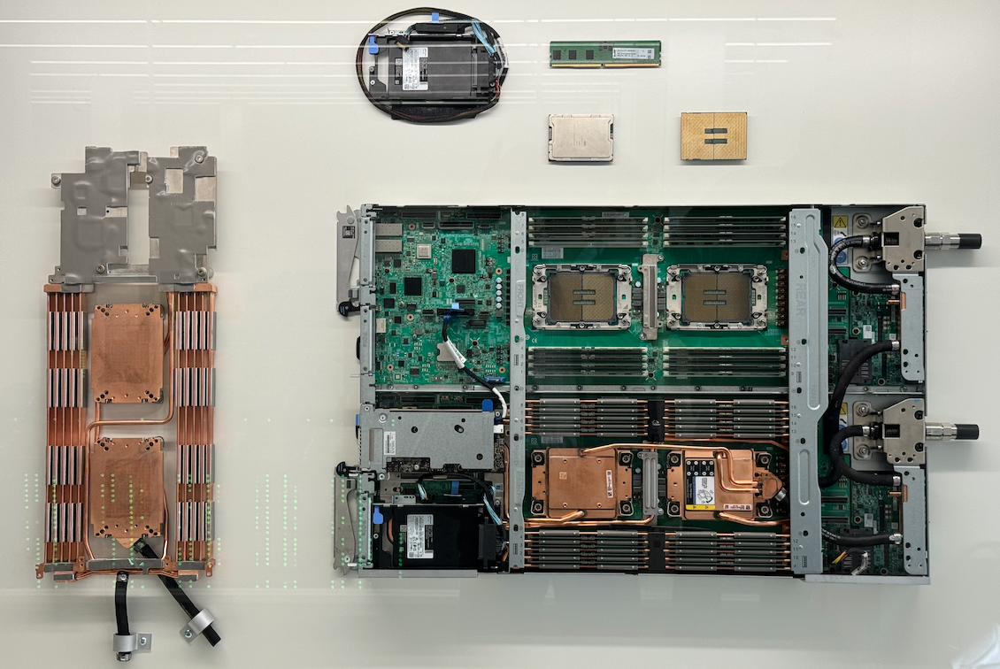
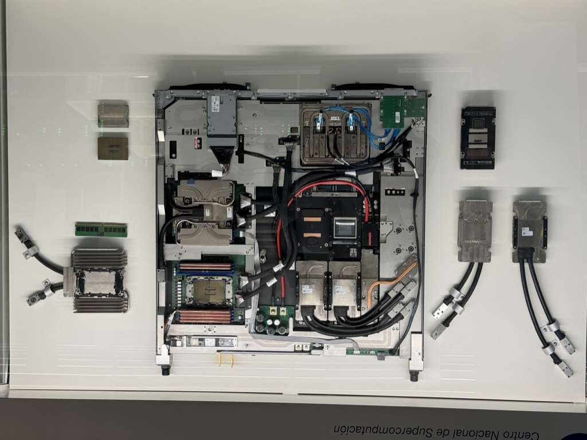
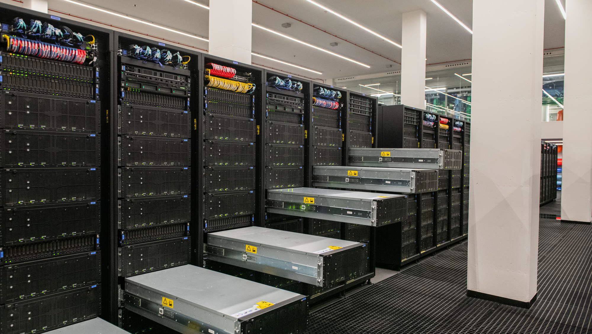
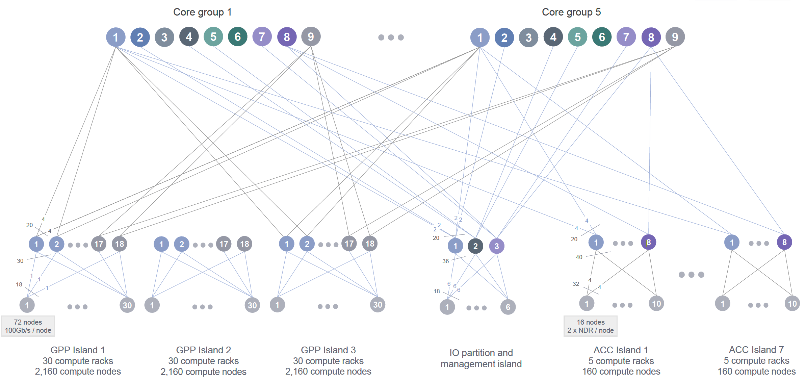
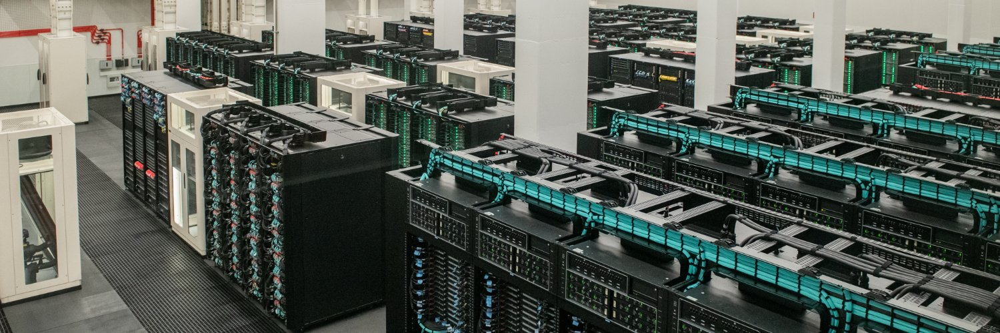
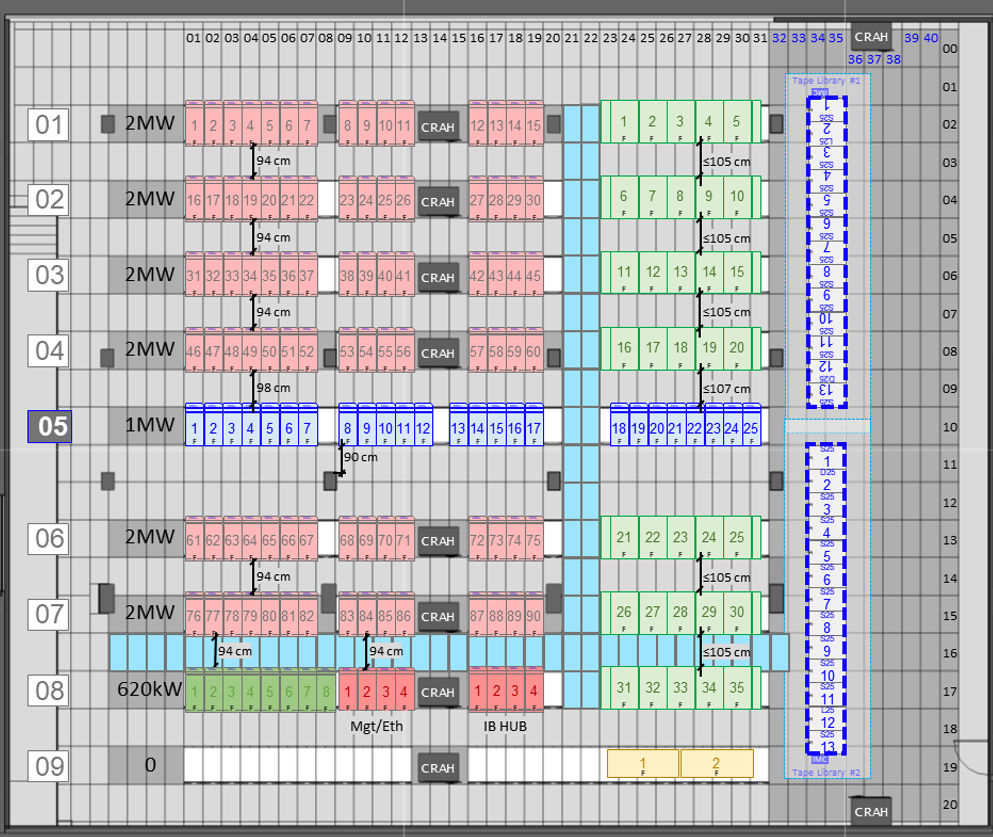

# Supercomputing Building Blocks

## System-Level Overview of a Supercomputer Architecture

Following the introductory chapter, we now turn our attention to the high-level architecture of a supercomputer. We begin by presenting the main building blocks of a complete supercomputing system from an abstract perspective, and then proceed to explore each component throughout the chapter.

A modern supercomputer composes more than just computer nodes. Figure 2.1 provides a generalized schematic of a system-level architecture that captures the essential components and interactions found in most HPC environments.

Users interact with supercomputers remotely, typically via secure shell (SSH) into login nodes, where they perform development tasks and submit jobs to the batch scheduler. These interactive login nodes support multiple users concurrently and are used for pre- and post-processing tasks such as code development, compilation, preparing job scripts, and launching jobs.

Figure 2.1 – General schematic of the main components and connections within a modern supercomputing environment.

In addition to login nodes, many systems also provide dedicated transfer nodes, which serve a similar purpose but are optimized specifically for high-throughput data transfer between the user’s local environment and the system’s central storage.

At the heart of the system are the compute nodes, which contain the hardware responsible for executing user workloads. These nodes are typically equipped with multi-core CPUs and accelerators such as GPUs or other specialized hardware. Compute nodes are not accessed directly by users like traditional desktops; instead, access is managed through a batch scheduling system.

Users prepare job scripts specifying the application to be run, the resources required (e.g., number of nodes, GPUs), the estimated runtime, and the paths for input and output files. Once submitted, the job enters a queue managed by the scheduler, which optimizes system utilization by allocating resources and launching jobs as they become available. Each job runs on the assigned nodes, ensuring access to the requested resources.

Although compute nodes may include local disks for temporary storage, the majority of application data resides in a centralized storage system, composed of high-capacity, high-throughput storage arrays. These systems offer parallel access to large datasets and are accessible from both compute and login nodes, enabling seamless data sharing across the HPC environment.

Efficient inter-node communication is a cornerstone of parallel computing. All nodes are interconnected through a high-speed network—typically InfiniBand or another low-latency interconnect—which ensures fast data exchange among distributed processes. Within a node, communication between CPUs, GPUs, and memory takes place over internal buses such as PCIe or NVLink, depending on the architecture.

In the following sections, we will explore each of these components in more detail.

## Compute Nodes

A compute node is the fundamental building block of any supercomputer. It is a highly optimized unit engineered to deliver maximum computational performance, energy efficiency, and scalability in a parallel, distributed computing environment.

### Main Components

Each node is a self-contained system that typically integrates high-core-count CPUs, large amounts of high-bandwidth memory, and, increasingly, dedicated accelerators such as GPUs.

#### Central Processing Units

The central processing unit (CPU) remains the primary engine of computation within a node. In HPC, CPUs are general-purpose processors capable of managing a broad range of tasks—from orchestration and system control to compute-intensive workloads. Modern compute nodes employ server-grade CPUs, such as the AMD EPYC or Intel Xeon families, designed for multi-threaded, sustained workloads.

These processors feature:

- Dozens to hundreds of physical cores per socket.

- Simultaneous multithreading (SMT) to allow each core to manage multiple threads.

- High-speed memory controllers to maximize data access efficiency.

- Multi-level cache hierarchies, including large L3 caches, to minimize latency.

- Support for vectorized instructions that boost throughput for floating-point operations

In multi-socket configurations, where several CPUs reside within a node, the system follows a Non-Uniform Memory Access (NUMA) architecture. Each CPU socket has its own directly attached memory banks, leading to variable memory access times depending on whether the data resides in local or remote memory—a factor that must be considered for performance optimization.

#### Memory and Memory Hierarchy

HPC applications are increasingly memory-bound, requiring substantial memory bandwidth and capacity. Compute nodes typically include 512 GB to 1 TB of RAM, using technologies like DDR4, DDR5, or High Bandwidth Memory (HBM). HBM, often found on GPUs, delivers significantly higher memory bandwidth, which is essential for large matrix or tensor operations.

Memory subsystems include hierarchical caches (L1, L2, L3) that enable rapid access to frequently used data. Additionally, many HPC applications benefit from remote memory access capabilities, such as Remote Direct Memory Access (RDMA), allowing efficient sharing of data across nodes.

Achieving optimal performance requires careful memory locality management—ensuring data remains as close as possible to the processing units that need it.

#### Accelerators

Hardware accelerators, particularly Graphics Processing Units (GPUs), have become essential components in modern supercomputing architectures. Unlike traditional CPUs, which consist of a small number of complex and general-purpose cores, GPUs are built around thousands of simpler, lightweight cores optimized for massive parallelism. They follow the Single Instruction, Multiple Data (SIMD) execution model, allowing them to process large amounts of data concurrently with high efficiency.

High-end GPUs, such as the NVIDIA H100, feature:

- Tens of thousands of CUDA cores capable of executing highly parallel workloads.

- Specialized Tensor Cores optimized for mixed-precision operations frequently used in AI and machine learning applications.

- Up to 80 GB of high-bandwidth memory (HBM), with 64 GB available in MareNostrum 5 nodes, directly attached to the device to reduce memory access latency.

- High-speed interconnects such as NVLink and PCIe Gen5, providing fast data exchange between GPUs and between GPUs and CPUs.

In addition to GPUs, modern supercomputers may incorporate a variety of other specialized accelerators designed to target specific computational or data movement challenges:

- FPGAs (Field-Programmable Gate Arrays): These are reconfigurable devices that allow developers to implement custom hardware logic tailored to specific algorithms. FPGAs are often used in applications where low-latency processing, fine-grained control over data paths, or specialized processing pipelines are critical, such as signal processing, real-time analytics, and certain scientific simulations.

- ASICs (Application-Specific Integrated Circuits): Unlike general-purpose processors, ASICs are custom-designed hardware components optimized for specific workloads as for example matrix operations, widely used in large-scale AI model training and inference tasks.

- DPUs (Data Processing Units): These accelerators are designed to offload data movement, network processing, and storage management tasks from the main CPUs. DPUs handle functions such as network packet processing, security, encryption, compression, and distributed storage management, improving overall system throughput and reducing CPU overhead in data-intensive workflows.

The integration of these diverse accelerators greatly enhances the versatility, energy efficiency, and performance of supercomputing nodes when addressing a wide range of workloads, from artificial intelligence and large-scale data analytics to scientific simulations and real-time processing tasks.

#### TPUs as Application-Specific Accelerators

While GPUs dominate modern supercomputing architectures due to their versatility and broad applicability to scientific workloads, another class of accelerators has emerged in recent years for specialized machine learning tasks: Tensor Processing Units (TPUs). Developed by Google, TPUs are highly specialized ASICs designed to maximize efficiency for deep learning workloads, particularly for the massive matrix multiplications and tensor operations that dominate neural network training and inference.

In contrast to GPUs, which are general-purpose accelerators capable of supporting a broad spectrum of parallel applications—including scientific and AI applications—TPUs are more narrowly optimized. Their architecture is streamlined for extremely high throughput in dense linear algebra operations, such as matrix-matrix multiplications, convolutional operations, and large-scale batched computations, while minimizing energy consumption and hardware complexity. Unlike GPUs, which balance flexibility and programmability, TPUs simplify the hardware by focusing almost exclusively on the tensor algebra structures characteristic of modern deep learning models.

Although TPUs have become widely adopted in Google datacenters and power many commercial cloud-based AI services, they currently play a limited role in traditional scientific supercomputing centers. Furthermore, as we do not have access to TPU-based systems for the hands-on practical exercises presented in this book, we will not explore TPUs in further detail. Nevertheless, it is important to recognize that TPUs represent a highly relevant alternative to GPUs for accelerating large-scale AI workloads, especially within hyperscale data center environments.

### MareNostrum 5 Computer Nodes

MareNostrum 5 is a pre-exascale EuroHPC supercomputer supplied by Bull SAS that combines Lenovo ThinkSystem SD650 V3 and Eviden BullSequana XH3000 architectures, providing two partitions with different technical characteristic regarding the computing capacities: General Purpose Partition (GPP) and Accelerated Partition (ACC). All nodes uses Red Hat Enterprise Server.

#### MareNostrum 5 GPP Nodes

The MareNostrum 5 *General Purpose Partition* (GPP), a general-purpose system, houses 6,408 nodes based on Intel Sapphire Rapids (4th Generation Intel Xeon Scalable Processors), along with an additional 72 nodes featuring Intel Sapphire Rapids HBM (High Bandwidth Memory). This configuration results in a total count of 726,880 processor cores and 1.75PB of main memory, There are 4 different node type (Table 2.1).

| **Node Type** | **Node Count** | **Cores per Node** | **Main Memory per Node** |
|:-------------:|:--------------:|:------------------:|:------------------------:|
|      GPP      |     6,192      |        112         |          256GB           |
|  GPP-HighMem  |      216       |        112         |         1,024GB          |
|   GPP-Data    |       10       |        112         |         2,048GB          |
|    GPP-HBM    |       72       |        112         |          128GB           |

Table 2.1 – Type of nodes of MN5 General Purpose Partition.

The majority are GPP nodes with 256 GB of DDR5 memory, while GPP-HighMem nodes offer expanded memory (1,024 GB) for memory-intensive workloads. A small set of GPP-Data nodes includes 2 TB of memory, suitable for large-scale data analytics. Finally, GPP-HBM nodes incorporate Intel Xeon Max CPUs with high-bandwidth HBM2 memory (128 GB total), optimized for workloads requiring fast memory access. All node types feature NVMe local storage and high-speed InfiniBand connectivity.

Figure 2.2 shows a real motherboard from MareNostrum 5, housing two general-purpose compute nodes. Several components have been intentionally removed and placed around the board to make the internal architecture more visible and easier to understand. The displayed motherboard can be seen in the hallway of the MareNostrum supercomputer, located in the Repsol building at the Barcelona Supercomputing Center (BSC).

At the center of the image, we see the main motherboard with two CPU sockets per node—one of them exposed to show the empty socket, while the corresponding processor has been placed above for display. This highlights how CPUs are physically connected to the board. The surrounding rows of DIMM slots are populated with DDR5 memory modules (two types are used: standard 16 GB and high-memory 64 GB).

On the left side, the large copper-colored assembly corresponds to the liquid-cooling heatsink that normally sits on top of the CPUs to dissipate heat during operation. Removing this structure allows for a clear view of the CPU area and memory layout.

Also visible on the mainboard are various PCIe connections, power distribution components. On the upper part of the display, several key components have been placed separately for educational clarity, including one Intel Xeon Platinum 8480+ processor (56 cores, 2 GHz), A DDR5 memory module.

This kind of motherboard includes local NVMe storage (960 GB) per node and shares a ConnectX-7 NDR200 InfiniBand interface that provides 100 Gb/s bandwidth per node.

Figure 2.2 – Disassembled dual-node motherboard from MareNostrum 5 General Purpose Partition.

#### MareNostrum 5 ACC Nodes

The MareNostrum 5 Accelerated Partition (ACC) comprises 1,120 nodes based on Intel Xeon Sapphire Rapids processors and NVIDIA Hopper GPUs. ACC nodes are mainly equipped with the following:

- 2x Intel Xeon Platinum 8460Y+ 40C 2.3GHz (80 cores per node)

- 4x NVIDIA Hopper H100 64GB HBM2

- 16x DIMM 32GB 4800MHz DDR5 (512GB main memory per node)

- 480GB NVMe local storage

- 4x ConnectX-7 NDR200 InfiniBand (800Gb/s bandwidth per node)

All nodes in MareNostrum 5 come with Hyper-Threading capability.

Figure 2.3 shows a real motherboard from the Accelerated Partition. This board integrates all the key components of a compute node that combines general-purpose CPUs and high performance GPUs. Several elements have been intentionally disassembled and placed around the board to improve visibility and understanding of the node’s architecture.

The board houses two Intel Xeon Platinum 8460Y+ processors (each with 40 cores, totaling 80 CPU cores per node), mounted near the center. Around them, multiple DDR5 DIMM slots provide 512 GB of main memory. On the right side of the image, one memory module and both CPUs are separately displayed, helping identify how these components are integrated into the system.

Dominating the central section of the board are the four NVIDIA H100 GPUs, each with 64 GB of HBM2e memory. These accelerators are positioned for optimal cooling and connected via high-bandwidth PCIe interfaces. Liquid cooling blocks cover the main processors and GPUs, with visible pipes showing the liquid loop connections. To the left, two cold plates and their connector tubing have been removed and shown separately to highlight the cooling system design.

Figure 2.3 – Real motherboard from a MareNostrum 5 Accelerated Compute Node.

Also visible are InfiniBand interconnects: each node is equipped with four ConnectX-7 NDR200 interfaces (CX7), supporting up to 800 Gb/s aggregate bandwidth for communication with other nodes. Also a NVMe local storage is visible at the bottom of the board.

This motherboard is also exhibited at the BSC building as an educational resource, helping visitors and students understand the structure and engineering behind accelerated nodes.

Figure 2.4 illustrates in greater detail how the components of the MareNostrum 5 ACC nodes are interconnected—logically and physically.

On the left, the logical architecture diagram shows the two Intel Xeon CPUs (SPR) at the top, each connected to the NVIDIA Hopper H100 GPUs through high-speed interconnects. These GPUs are also interconnected with one another, forming a hybrid topology optimized for intensive compute and data exchange (using NVLink introduced later in section 6.2). CX7 adapters are used for InfiniBand communication, and the NIC HSE provides Ethernet connectivity.

On the right, the physical architecture diagram maps the layout of these components on the board. It shows the position of the GPUs (labelled SXM5), the CPUs, and the power and communication interfaces. The water loop for direct liquid cooling is also shown, including water input and output ports—highlighting the importance of thermal regulation in such high-density nodes.

These diagrams complement the physical board in Figure 2.3 by offering both a functional and spatial view of the node’s architecture. Since the ACC nodes are central to many exercises and assignments in the course, we include them in greater detail to help the reader better understand the type of systems they will work with[^1].

Figure 2.4 – Logical (left) and physical (right) architecture diagrams of a MareNostrum 5 ACC node (Image source: BSC Operations Dep.).

#### Inside a Rack of Compute Nodes

While compute nodes are the core computational elements in a supercomputer, they are not deployed in isolation. Instead, they are installed into standardized enclosures known as *racks* , which provide the structural, electrical, and thermal backbone of the datacenter. Racks follow an industry-standard format, where physical height is measured in *rack units* (abbreviated as "U"). One rack unit (1U) corresponds to 1.75 inches (44.45 mm) in height.

Typical HPC racks have total heights of 42U or 48U, depending on the datacenter design and infrastructure. Each compute node, depending on its size and cooling requirements, occupies a certain number of rack units—commonly 1U or 2U—allowing system designers to optimize the balance between compute density, cooling efficiency, power delivery, and cabling management within the rack.

In MareNostrum 5, two main rack types are used:

- General Purpose Partition (GPP) racks host dual-socket compute nodes based on Intel Sapphire Rapids. Each chassis contains 12 nodes organized in six dual-node trays, with 6U height. Racks can accommodate up to 72 nodes and integrate high-bandwidth memory configurations. These racks use direct liquid cooling systems that dissipate heat through two separate loops: a hot water loop (35°C) extracted via cold plates and a cold water loop (17°C) through a rear-door heat exchanger.

- Accelerated Partition (ACC) racks are based on the BullSequana XH3000 architecture and are specifically designed to host heterogeneous nodes equipped with integrated accelerators, such as NVIDIA H100 GPUs. These racks incorporate advanced infrastructure elements, including internal hydraulic distribution systems, modular power distribution units, and dedicated heat exchangers for direct liquid cooling. Each ACC rack contains 36 compute nodes and is engineered for high-density deployments with efficient thermal management. The incoming water enters the system at approximately 17 °C and exits at 27 °C after absorbing the heat generated by the internal components.

Both rack types include Mellanox switches connected via high-speed InfiniBand links. Power distribution is managed through intelligent Power Distribution Units (PDUs) integrated into the datacenter's power provisioning systems. These PDUs support remote monitoring of energy consumption, report environmental parameters, and allow balancing of electrical loads.

In summary, each rack in a supercomputing facility such as MN5 represents a highly integrated modular unit that combines compute, networking, power, and cooling infrastructures. However, we will not delve further into the physical or engineering aspects of rack design, as these fall outside the intended scope of this book.

### Accessing MareNostrum 5 Resources

You can connect to MareNostrum 5 using the [public login nodes](https://www.bsc.es/supportkc/docs/MareNostrum5/intro/#public-login-nodes). Your BSC credentials will allow you to access both MN5 partitions, but you need to log in to different login nodes.

Once you are logged in either MN5 partition, you will find yourself in an interactive node where you can execute interactive jobs (small jobs) and submit execution jobs to the rest of the nodes of the partition chosen using the SLURM batch scheduling system ( it will be introduced next chapter).

You can connect to MareNostrum 5 using the following login nodes:

- MareNostrum 5 GPP:

  - glogin1.bsc.es

  - glogin2.bsc.es

- MareNostrum 5 ACC:

  - alogin1.bsc.es

  - alogin2.bsc.es

- Storage 5:

  - transfer1.bsc.es

  - transfer2.bsc.es

  - transfer3.bsc.es

  - transfer4.bsc.es

You must use Secure Shell (ssh) tool to login in or transfer files into the cluster to enable secure logins over an insecure network (BSC does not accept incoming connections from protocols like telnet, ftp, rlogin, rcp, or rsh commands). For example, using OpenSSH (available in Windows and Linux):

    $ ssh <username>@transfer1.bsc.es 
    $ ssh <username>@glogin1.bsc.es 
    $ ssh <username>@alogin1.bsc.es 

Once connected to the machine, you will receive a UNIX shell prompt and usually be in your home (\$HOME) directory. In this book, we assume that the student is not new to UNIX environments (see the *appendix* section titled Essential Linux Commands for more information if required).

The interactive login nodes are used only for editing, compiling, preparing, and submitting batch executions in the MareNostrum 5 supercomputer.

Task 2.1 – Log into MareNostrum 5

Before you can run any programs or submit jobs, you must first ensure that you have access to the login nodes of the MareNostrum 5 supercomputer. To do this, open a terminal on your local machine and connect to MareNostrum 5 using ssh with the credentials provided to you by the BSC support team. Once connected, determine your home directory by running the command echo \$HOME. This will display the absolute path to your personal working space on the system, where you can store your scripts, results, and any files related to your jobs.

Task 2.2 – Change Your Password

For security reasons, you are required to change your initial password the first time you log into MareNostrum 5. Once you are logged in to a login node, run the passwd command to set a new password. You will be prompted to enter your current password, followed by the new one twice for confirmation. The new password should become effective approximately five minutes after the change. Make sure to choose a strong and memorable password that complies with the system’s security policies.

Task 2.3 – (Optional) Enable Passwordless SSH Authentication

Although optional, setting up passwordless authentication using SSH public keys is a highly recommended and widely used practice in Unix environments. It allows you to connect to MareNostrum 5 without having to type your password every time, streamlining your workflow and improving both convenience and security.

If you are not already familiar with this procedure, refer to the *appendix* section titled SSH Public Key Authentication. where the steps are described in detail. In short, you will generate an SSH key pair on your local machine, then copy your public key to your remote MN5 account. From that point on, as long as your private key is available on your laptop, you will be able to connect without password prompts.

This setup is common in professional Linux and HPC environments and will make all future tasks easier to manage.

## Storage in Supercomputing

### Parallel File Systems in HPC

#### Introduction: The Need for Parallel File Systems

In HPC, storage is not simply a passive data repository but a critical component that must sustain extremely high throughput and serve massive parallelism. Unlike personal computing or enterprise environments, HPC workloads frequently involve thousands of compute nodes accessing shared datasets concurrently. Such workloads may include large-scale simulations, or training massive AI models, all requiring sustained access to shared files at high speed.

Traditional file systems quickly become bottlenecks under these conditions, struggling to handle the concurrency, volume, and data movement patterns common in HPC. This is why dedicated parallel file systems have been developed: to provide scalable, high performance shared storage capable of matching the demands of modern supercomputing.

#### Architectural Principles

Parallel file systems are architected from the ground up to support massive concurrent access to shared datasets. Instead of a simple client-server model, these systems distribute both metadata (information about file structure and location) and data blocks across multiple dedicated servers. This architecture allows thousands of compute nodes to read and write files simultaneously without overwhelming a central storage controller.

The key design goal is to maximize aggregate I/O bandwidth and minimize contention. Clients can read and write different portions of a file concurrently, spreading traffic across the storage backend. This enables supercomputers to sustain I/O rates in the range of tens or even hundreds of gigabytes per second, which is essential to keep pace with the compute power of modern HPC clusters. Additionally, advanced caching mechanisms on both the client and server sides are often used to reduce latency and improve metadata performance.

#### File Striping and Metadata Distribution

A core technique in parallel file systems is file striping. Instead of storing each file as a single continuous block on one disk, the file is split into multiple chunks (or stripes), which are distributed across multiple storage targets. When multiple clients access the file, they can operate on different stripes concurrently, greatly increasing overall throughput.

For example, if a large simulation outputs terabytes of checkpoint data, striping allows many disks to participate in writing that file in parallel. Similarly, during reads, multiple nodes can retrieve different parts of a dataset simultaneously, avoiding I/O bottlenecks.

In addition, distributed metadata servers help avoid the traditional bottleneck caused by centralized metadata management. Some parallel file systems allow administrators to scale metadata independently, balancing the system according to workload characteristics: for instance, workloads with billions of small files versus workloads dominated by a few massive files.

#### Main Parallel File Systems

Modern HPC centers rely on a small number of highly specialized parallel file systems, each with its own strengths and trade-offs:

- Lustre is one of the most widely adopted parallel file systems in large-scale scientific computing centers, including many Top500 supercomputers. It is open-source and highly scalable, capable of serving tens of thousands of clients simultaneously and managing multiple exabytes of data.

- BeeGFS (formerly FhGFS) was originally developed by the Fraunhofer Institute in Germany and has become increasingly popular in both academic and industrial HPC settings. While Lustre emphasizes extreme scalability for national-scale systems, BeeGFS focuses on ease of deployment, manageability, and excellent performance for smaller to mid-sized clusters.

- IBM Storage Scale (formerly GPFS – General Parallel File System) is a highly mature and enterprise-grade parallel file system. While Lustre and BeeGFS focus primarily on scientific computing, Storage Scale has found wide adoption in both HPC and enterprise cloud environments due to its advanced feature set. Because of this extensive feature set and high flexibility, IBM Storage Scale is widely deployed in complex environments such as MareNostrum 5.

#### Advanced Data Management Features

Beyond raw performance, modern parallel file systems increasingly incorporate advanced data management features that help administrators balance performance, reliability, and storage costs:

- Policy-based data placement allows automated control over where files are stored based on size, access patterns, or file age.

- Automated migration and replication ensure that frequently accessed data remains on fast storage tiers while rarely used data is safely archived.

- Snapshotting and cloning provide rapid file system backups and recovery options.

- Multi-cluster federation enables multiple supercomputers or datacenters to share storage resources seamlessly.

These advanced data management capabilities are powerful and essential in large-scale environments. However, their configuration and administration involve significant technical complexity, which falls beyond the scope of this book.

#### Storage Units and Scale in HPC

In supercomputing, storage capacity plays a crucial role alongside compute power. Just as we use FLOPS to measure computational throughput, storage systems are typically characterized by their capacity to hold vast volumes of data, as well as by the speed at which data can be accessed or written.

Given the extraordinary scale of data involved in HPC workloads it becomes essential to adopt standardized scientific prefixes to express storage sizes in a compact and meaningful way. In storage contexts, two systems of prefixes coexist: decimal (based on powers of ten) and binary (based on powers of two, typically used in operating systems). In practice, HPC documentation and most supercomputing centers, including this book, adopt the decimal notation to express storage capacities (unless otherwise specified).

| **Prefix** | **Symbol** | **Decimal Value** | **Bytes** |
|:--:|:--:|:--:|:--:|
| kilo | KB | 10³ | 1,000 |
| mega | MB | 10⁶ | 1,000,000 |
| giga | GB | 10⁹ | 1,000,000,000 |
| tera | TB | 10¹² | 1,000,000,000,000 |
| peta | PB | 10¹⁵ | 1,000,000,000,000,000 |
| exa | EB | 10¹⁸ | 1,000,000,000,000,000,000 |

Table 2.2 – Storage Units Commonly Used in HPC.

### Parallel File System in MareNostrum 5

MareNostrum 5 employs IBM Storage Scale (formerly GPFS – General Parallel File System) as its high performance parallel file system. As recommended by the BSC Operations Department, we will refer to this system simply as *GPFS* throughout the rest of this book. GPFS provides unified, scalable, and efficient data access across the entire supercomputer architecture.

The storage backend is built on IBM Elastic Storage System 3500 (ESS3500) appliances, which combine both flash-based and disk-based storage tiers to balance performance and capacity depending on workload requirements.

#### Two-Tier Storage Architecture: Performance and Capacity

The file system is internally organized into two major subsystems, optimized for different data access patterns:

- Performance Tier: This subsystem is designed for metadata and I/O-intensive workloads. It consists of 13 IBM ESS3500 units equipped with 312 NVMe flash drives, totaling approximately 2.8 PB of usable capacity. Aggregate peak I/O bandwidth is ~600 GB/s for read/write operations.

- Capacity Tier: This subsystem handles massive persistent data volumes. It is composed of 50 ESS3500 capacity modules. In total: 20,400 disks providing approximately 248 PB of usable capacity and up to ~1.6 TB/s read bandwidth.

#### File System Structure and Usage Areas

To support diverse usage scenarios, Storage Scale in MN5 defines multiple dedicated file system namespaces:

- /gpfs/apps: Hosts pre-installed applications and libraries accessible to all users. Capacity: ~535 TB.

- /gpfs/home: User home directories for source code, personal scripts, and small-scale data. Users automatically start here upon login. Capacity: ~306 TB. Running jobs directly from here is discouraged; preferable /gpfs/projects or /gpfs/scratch.

- /gpfs/projects: Project-specific shared data space for collaboration within research groups. Each group has its own subdirectory /gpfs/projects/\<GROUP\>. Capacity: ~22 PB.

- /gpfs/scratch: Temporary space for job runtime data and intermediate files. Group quotas are applied. Capacity: ~176 PB.

#### Additional Architectural Features

- Supports up to 7,000 concurrent clients, each using a local Storage Scale cache of 20 GB per compute node.

- Optimizes file I/O through distributed locking and round-robin striping across disks.

- Maximum file block size: 16 MB (sub-blocks used for small files to improve space efficiency).

- Policy-based data management enables automated file placement, migration, replication, and deletion according to administrator-defined rules.

#### Hierarchical Storage and Archiving

MareNostrum 5 integrates a hierarchical storage management layer for long-term archiving, combining:

- IBM TS4500 tape libraries with IBM Storage Archive software.

- ~400 PB of tape storage (20,100 x 20 TB cartridges).

- Automated data migration between disk and tape tiers based on policy rules.

Figure 2.5 – *View of the MareNostrum 5 storage racks showing part of the disk-based capacity tier. (Image courtesy of Operations Department, BSC).*

#### Local SSD Storage per Compute Node

In addition to global file systems, each compute node in MareNostrum 5 includes fast, node-local SSD storage used for temporary files during job execution:

- GPP nodes: 960 GB local SSD.

- ACC nodes: 480 GB local SSD.

This node-local storage, accessible via the \$TMPDIR environment variable, is ideal for high-speed temporary data during execution. Files are automatically deleted at job completion.

### Working with Files on MareNostrum 5

When working with MareNostrum 5, it’s important to understand the system’s network access model. The login nodes(e.g., alogin1, glogin1, transfer1) are the only entry points accessible from the outside. For security reasons, outbound internet connections from within the cluster are not allowed. In other words, once inside the system, you cannot connect back to external servers or download files from the internet.

#### Transfer Data

Access to the compute nodes is managed exclusively through the SLURM scheduler. You cannot run programs interactively on the compute nodes, nor use them for administrative tasks such as data transfer.

As a result, all file transfers between your local machine and MareNostrum 5 must be initiated from outside the cluster, typically from your laptop or workstation.

If you are working on a Linux or macOS system, you can use the scp command from any terminal. For example:

Copying data from MN5 to your laptop:

    $ scp -r <username>@transfer1.bsc.es:"MN5_SOURCE_dir" "mylaptop_DEST_dir"

Copying data from your laptop to MN5:

    $ scp -r "mylaptop_SOURCE_dir" <username>@transfer1.bsc.es:"MN5_DEST_dir"

The -r flag is needed for copying directories.

If you are using Windows, there are several ways to use scp:

- The easiest method is to install MobaXterm, which provides a full terminal and GUI-based file browser. You can open a terminal in MobaXterm and use the scp command exactly as shown above.

- Alternatively, if you have installed WSL (Windows Subsystem for Linux) and are using a Linux distribution inside it (e.g., Ubuntu), you can open a WSL terminal and run the same scp commands.

- A third option is using pscp, a command-line tool from the makers of PuTTY. To use it, download pscp.exe from the oficial PuTTY website and place it in your system PATH.

The detailed installation and configuration of these tools on Windows falls outside the scope of this course, due to the variety of Windows versions and available options. It is up to each student to choose and install the method that best fits their environment and preferences.

#### Mounting the Remote Filesystem 

For more convenient file access, you may choose to mount your remote MareNostrum home directory as if it were a local folder using sshfs. This approach allows you to browse, open, and edit files without repeatedly uploading or downloading them.

If you're on Linux or macOS, and have sshfs installed, you can mount your remote home directory like this:

    $ sshfs -o workaround=rename <username>@transfer1.bsc.es: :"MN5_SOURCE_dir" "mylaptop_dir"

Replace the paths with your actual user and target mount point.

This option is not mandatory, but experienced users find it extremely helpful for quick access and file editing without using scp.

Although sshfs is most commonly used on Linux and macOS, it can also be used on Windows through two main approaches. The first is using WinFsp together with SSHFS-Win, which is a native Windows solution that provides a graphical interface and integrates with Windows Explorer. Once installed, it allows users to mount SSH filesystems using GUI tools or command-line utilities such as sshfs-win. The second approach is through Windows Subsystem for Linux (WSL), which enables the installation of a Linux distribution (such as Ubuntu) inside Windows. Within this Linux environment, users can install and use the standard sshfs package, gaining a Unix-like experience that closely resembles working on a native Linux system. Setting up sshfs under Windows involves system-level changes and administrative permissions. Because this is a platform-specific configuration, the installation steps fall outside the scope of this book.

Task 2.4 – Transfer Files Using scp

To become familiar with the file transfer mechanism used on MareNostrum 5, try copying a file between your local machine and the supercomputer. This task is essential to ensure that you are able to move files across the different filesystems, a skill that will be required in many of the tasks that follow throughout the course.

Start by creating a simple test file on your laptop. You can use any method you prefer to generate a text file that contains a short message, for example, a line such as “Hello MN5!”. Then, use the scp command to transfer this file from your local machine to your personal home directory on MareNostrum 5. Once the file is transferred, connect to the supercomputer using SSH and verify that the file appears in your directory. You can check its content to confirm that the transfer was successful.

Next, repeat the operation in the opposite direction. From your local terminal, copy the same file from MareNostrum 5 back to a folder on your local machine. After completing both directions of transfer, you will have confirmed that your scp setup is working correctly and that you are ready to manage data between systems — a fundamental part of working in any HPC environment.

Task 2.5 – (Optional) Mount the MN5 Filesystem on Your Laptop

This approach can significantly simplify day-to-day operations by allowing you to browse, edit, and manage files directly from your usual environment, without repeatedly uploading or downloading them.

Setting up sshfs is not mandatory to follow the rest of this course, but users who complete it may find the convenience of working across filesystems especially helpful during later exercises.

## Interconnection Networks in Supercomputing

### Bandwidth and Latency Metrics in Supercomputing

As we analyze interconnection networks in supercomputing, it becomes necessary to introduce two fundamental metrics that characterize communication performance: *bandwidth* and *latency*. These metrics will appear repeatedly throughout the remainder of the book, especially as we explore real-world experiments involving parallel applications and distributed systems.

#### Bandwidth: Measuring Communication Throughput

Bandwidth refers to the maximum rate at which data can be transmitted across a communication channel per unit of time. In HPC, it is typically expressed in gigabits per second (Gb/s) or gigabytes per second (GB/s), depending on whether we refer to raw link capacity (hardware perspective) or effective data throughput (application perspective).

For consistency, we will adopt the following notation throughout the book:

| **Prefix** | **Meaning** | **Value** |
|:--:|:--:|:--:|
| Mb/s | megabits/second | 10⁶ bits/s |
| Gb/s | gigabits/second | 10⁹ bits/s |
| Tb/s | terabits/second | 10¹² bits/s |
| MB/s | megabytes/second | 10⁶ bytes/s |
| GB/s | gigabytes/second | 10⁹ bytes/s |
| TB/s | terabytes/second | 10¹² bytes/s |

Table 2.3 – Notation for bandwidth units adopted in this book. Bandwidth may be expressed either in bits per second (lowercase 'b') or bytes per second (uppercase 'B'), where 1 byte = 8 bits. Interconnect bandwidths are typically specified in bits per second (b/s), while storage and file system bandwidths often appear in bytes per second (B/s). For example, 100 Gb/s corresponds to 12.5 GB/s.

#### Latency: Measuring Communication Delay

Latency describes the time delay incurred when transmitting a message from the source to the destination across the network. It is usually measured in nanoseconds (ns, 1ns=10⁻⁹ seconds) or microseconds (μs, 1μs=10⁻⁶ seconds), depending on the granularity required. For example:

- Typical InfiniBand latencies: ~100 nanoseconds (10⁻7 seconds).

- Ethernet latencies: typically in the order of several microseconds (10⁻6 seconds).

- PCIe/NVLink intra-node latencies: can be as low as a few tens of nanoseconds ( few 10⁻8 seconds).

While bandwidth quantifies how much data can be transferred, latency measures how quickly communication can begin and complete. In parallel applications, particularly those involving many small messages or synchronization steps, latency often becomes the dominant factor limiting performance.

#### Latency Variability and Network Jitter

In addition to average latency, communication performance in parallel systems is also affected by latency variability, commonly referred to as *network jitter*. Jitter describes the fluctuation in communication delay over time, even when message sizes and communication paths remain unchanged.

In HPC and large-scale parallel applications, jitter can arise from transient congestion, routing variability, contention at network switches, or interference from other concurrent jobs. While average latency may appear acceptable, high jitter can introduce unpredictable delays that disrupt synchronization and collective communication patterns.

Jitter is particularly problematic for tightly synchronized parallel workloads, where all processes or accelerators must wait for the slowest communication event before proceeding. As a result, even small variations in latency can have a disproportionate impact on overall performance and scalability. This effect becomes more pronounced in collective communication operations, which are highly sensitive to the slowest communication path.

### Interconnection Networks in HPC Systems

In HPC, the interconnection network is one of the most critical architectural components. While the computational power of individual nodes is essential, the real strength of an HPC system emerges when thousands of nodes work together in parallel. To enable this, nodes must communicate frequently—sharing data, synchronizing computations, and coordinating tasks across the entire machine. As a result, the quality and performance of the interconnect directly influence the overall efficiency, scalability, and usability of the system.

An HPC interconnect is not just a way to transfer data; it is a low-latency, high-bandwidth communication fabric that enables distributed memory systems to behave as a coherent, tightly coupled parallel machine. The most common use cases for inter-node communication include:

- Exchanging boundary data in domain-decomposed simulations.

- Collective operations such as broadcast, reduce, and gather.

- Synchronization barriers and point-to-point signaling.

- Remote memory access in one-sided communication patterns.

Many of these aspects will be explored in more detail throughout this book.

Depending on the system design, HPC interconnects can adopt various topologies such as fat-tree, dragonfly, torus, or custom hybrid architectures. These topologies are engineered to balance performance, scalability, and cost, while minimizing contention and latency. A comprehensive treatment of these network topologies, however, falls outside the scope of this book.

#### **InfiniBand: The De Facto Standard in Modern HPC**

Modern supercomputers overwhelmingly use InfiniBand as their interconnect technology due to its low latency (as low as 100 ns), high throughput (up to 400 Gb/s or more), and hardware offloading features that reduce CPU load during communication. InfiniBand supports both message passing (e.g., MPI) and memory access (RDMA), making it well-suited for tightly coupled parallel applications.

InfiniBand networks rely on *Host Channel Adapters*  (HCA)  on each node, the network interface card (NIC) that connects each node and switches to route packets. Advanced features such as adaptive routing, congestion control, and hardware-based collectives enhance performance, especially under high load. The network is managed by a Subnet Manager, which discovers topology, assigns addresses, and configures routes. For fault tolerance, redundant subnet managers and multiple paths are typically deployed.

#### **Complementary Ethernet Network**

In parallel to the high performance interconnect, most HPC systems include a separate Ethernet network used for:

- User login and SSH access.

- Job scheduling and monitoring.

- File transfers and data staging.

- System management and orchestration.

This separation of concerns improves security and prevents interference between administrative and computational traffic.

### Interconnect Architecture in MareNostrum 5

The interconnection network in MareNostrum 5 (MN5) exemplifies a modern, hybrid network architecture that combines high performance InfiniBand with high-capacity Ethernet. It is designed to provide optimal communication performance across its thousands of compute nodes while maintaining a modular, manageable, and secure structure.

#### **Hybrid Network Design**

MN5 incorporates two logically and physically distinct networks:

- An InfiniBand network dedicated to high performance communication between compute nodes and storage systems.

- An Ethernet network used for login access, management services, and administrative operations.

This separation helps isolate traffic types and ensures that demanding computational workloads are not disrupted by control or user traffic.

#### **InfiniBand Network: Fabric for Performance**

All compute nodes in MN5 are connected via ConnectX-7 HCA, supporting InfiniBand NDR200 interconnects, offering 200 Gb/s per port.

The general-purpose nodes (GPP) typically include one interface per node, while the Accelerated Nodes (ACC) contain four ConnectX-7 NDR200 interfaces interfaces, totaling 800 Gb/s per node. This level of bandwidth is particularly critical for AI workloads and large-scale simulations running on GPU nodes.

The network uses NVIDIA ConnectX-7 adapters and a mix of SN3700C, SN4600V, and QM9790 InfiniBand switches to form a multi-tiered fat-tree topology, supporting scalable and redundant connections between racks.

Communication within and across partitions is governed by a Subnet Manager, which is replicated for fault tolerance. In the event of failure, the system maintains connectivity via redundant paths, although routing changes may be delayed until the Subnet Manager recovers or is restarted. This ensures high availability and stability even in the face of partial hardware failures.

Figure 2.6 presents a high-level schematic of the MareNostrum 5 InfiniBand interconnect. The system is organized into multiple functional partitions, each equipped with its own switching infrastructure and connected through a central routing core. The GPP partition is composed of three compute islands each containing 2,160 nodes, distributed across 30 racks with 72 nodes per rack. The ACC partition is subdivided into seven smaller islands, each housing 160 nodes arranged in 5 racks with 32 nodes per rack. Finally, a dedicated I/O and management partition hosts the nodes responsible for storage access, system administration, and other services.

In hierarchical interconnect topologies like the one used in MareNostrum 5, communication performance depends heavily on the relative network “proximity” of the nodes involved. Within each island nodes are interconnected through a localized switching fabric, enabling low-latency, high-bandwidth communication. However, communication between nodes located in different islands must traverse higher levels of the network hierarchy, such as the central routing core. This incurs additional latency and can lead to reduced effective bandwidth, especially under high contention. Consequently, intra-island communication is generally faster and more efficient than inter-island communication. For this reason, topology-aware job placement and communication strategies can significantly improve application performance by maximizing data locality and minimizing costly inter-island traffic.

Given the emphasis of this book on practical usage and performance optimization, understanding the structure of the interconnect—particularly in the ACC partition—is important. Many of the assignments and experiments conducted throughout this book will run on GPU-enabled ACC nodes, where inter-GPU and inter-node bandwidth becomes a key performance factor.

Figure 2.6 – High-level schematic of the MareNostrum 5 InfiniBand interconnect. The system is divided into partitions (GPP, ACC, and IO), each with its own switching infrastructure connected to a central routing core (Image source: BSC Operations Department).

Figure 2.7 – Ethernet network architecture in MareNostrum 5 structured around GPP,ACC, and IO partitions (Image source: BSC Operations Dep.).

#### **Ethernet Infrastructure: Control and Services**

Figure 2.7 presents the Ethernet network architecture in MareNostrum 5, which complements the high performance InfiniBand fabric with a robust Ethernet backbone through a scalable switching architecture based on NVIDIA switches. This network supports management traffic, storage access, service node communications, and external connectivity with the broader internet and institutional networks. The architecture is structured around partitions—IO, GPP, and ACC—with each connected through multiple layers of Ethernet switches.

The dual-network design of MareNostrum 5 reflects the dual requirements of modern supercomputing: delivering extreme computational performance while maintaining robust system control and manageability. The high-speed InfiniBand fabric ensures efficient large-scale data exchange for parallel applications, while the Ethernet backbone handles system services and user access. Redundancy at multiple levels contributes to fault tolerance and operational stability across diverse HPC workloads.

## Data Center Infrastructure

HPC systems rely not only on powerful nodes, networks, and storage, but also on the robust facilities that house them. Modern supercomputers reside in specialized data centers engineered to deliver massive power and cooling, with high reliability and efficiency. This section outlines general concepts of HPC data center design and then examines the specific infrastructure of the MareNostrum 5 data center at the Barcelona Supercomputing Center.

### General Concepts of HPC Data Centers

#### **Physical Layout and Zones**

An HPC data center is typically divided into functional zones, each tailored to a specific role. The heart of the facility is the compute area – rows of racks containing the compute nodes and storage devices. In the past, these racks followed traditional hot-aisle/cold-aisle configurations to manage airflow.

Today, they are built as self-contained enclosures optimized for liquid cooling. Surrounding the compute floor are critical support spaces: power conversion and distribution rooms (housing transformers, switchboards, and UPS systems), cooling infrastructure areas (chillers, cooling towers, pumps, and heat exchangers), and network and control rooms (for routers, switches, and system monitoring/control).

In a well-designed site, these zones are physically separated for safety and efficiency – for example, electrical equipment may be in a separate room or level from the moist cooling equipment, and both are isolated from the machine room where technicians work.

#### **Site Design Considerations**

HPC data centers demand meticulous facility engineering. Floors must support extreme weight (each rack can weigh over 1 ton, sometimes exceeding 2 tons), so structural reinforcement or raised floor systems are used.

Raised floors (or in some cases overhead cable trays) help route the maze of power cables and coolant pipes to the racks. The layout must accommodate adequate clearance and spacing between racks and rows to ensure good airflow (for air-cooled setups) or access to coolant distribution for liquid-cooled systems.

Fire protection is especially critical. Traditionally, inert gas fire suppression or dry chemical systems were preferred to avoid water near electronics. However, some modern data centers use water mist systems that release an ultra-fine spray to quench fire without flooding equipment (the fine droplets evaporate quickly, absorbing heat and reducing oxygen locally).

Physical security is tight: only authorized personnel can access critical areas, and surveillance and access controls are in place. Because most users access supercomputers remotely, these sites are designed for remote management – console access, monitoring sensors, and automation – reducing the need for frequent physical presence and allowing the data center to operate largely unattended day-to-day.

#### **Power Infrastructure**

Supplying continuous, clean power to an HPC system is a primary design challenge. Large supercomputers draw several megawatts of power – equivalent to thousands of homes – so the facility often has a dedicated high-voltage feed from the grid or even an on-site substation. Power enters at high voltage (e.g. tens of kV) and is stepped down via transformers to the distribution voltage used by the IT equipment (commonly around 400–480 V three-phase).

Within the data center, busbars or heavy-gauge cables distribute power to each row of racks, often in a redundant configuration (A/B feeds) so that each rack can draw from two independent power sources for reliability. Uninterruptible Power Supplies (UPS)  bridge short outages: banks of batteries or flywheels provide ride-through power for a few minutes. This covers the gap until backup generators start – usually diesel gensets or gas turbines that can take over in an extended outage.

HPC centers typically could have backup generators on-site with fuel for days of operation, arranged in redundancy ensuring power even if one generator fails. All critical power infrastructure is redundant, including duplicate feed lines, transformers, and UPS units, to avoid single points of failure. The entire power system is monitored and managed to balance loads and handle fault conditions without interrupting the supercomputer.

To gauge the efficiency of a data center’s power delivery and cooling, operators use Power Usage Effectiveness (PUE). PUE is defined as the ratio of total facility power divided by the power used by IT equipment alone. An ideal PUE would be 1.0 (meaning all power goes to computing, none to overhead), but real facilities historically averaged around 1.3 to 1.8. Modern HPC centers focus on energy efficiency and often achieve PUE values near 1.1 or better, meaning only ~10% overhead. This is accomplished by aggressive optimization of cooling and power distribution. Any HPC site will strive for the lowest possible PUE to minimize wasted electricity (both to reduce costs and to meet sustainability goals).

#### **Cooling Infrastructure**

Removing the enormous heat output of a supercomputer is equally as important as powering it. Air cooling alone becomes inefficient with dense CPUs and GPU racks. To handle this, HPC centers employ advanced cooling strategies:

- Rear-Door Heat Exchangers (RDHX): This hybrid approach places a water-cooled radiator on the back of each rack. As servers push hot air out, the air passes through the rear-door where chilled water absorbs much of the heat. RDHX can remove a large fraction of heat. This technique was used in previous generations of supercomputers to extend air cooling’s viability.

- Direct Liquid Cooling (DLC): Today, direct-to-chip liquid cooling is the mainstream choice for HPC systems. In a DLC setup, cold plates or microchannels are attached directly to the CPUs, GPUs, and other hot components inside each node. Water (water/glycol mixture) is piped through these plates to absorb heat at the source, then pumped out of the rack to dissipate the heat in external heat exchangers. DLC can remove \>90% of the heat from a node via liquid, leaving little to be handled by air. A key advantage is that “warm water” cooling becomes possible – the coolant entering the chips can be at relatively high temperature (30°C or more) and still sufficiently cool the electronics, given water’s high thermal conductivity. This means chillers are often unnecessary; heat can be rejected via cooling towers or dry coolers to the outside air. The facility must include pumps, piping, and heat exchangers dedicated to these liquid loops, as well as leak detection and drip containment for safety.

- Air cooled: To remove the residual heat that remains in the room, it is common to maintain traditional air treatment units for computer rooms that cool the air. Although it is simple, an attempt is made to minimize this cooling part since it is not as efficient as the other systems mentioned.

- Immersion Cooling: In immersion systems, entire servers or components are submerged in a tank of dielectric fluid (an insulating liquid). The fluid directly absorbs heat from components, sometimes aided by circulation (natural convection or pumps). Immersion can achieve excellent thermal performance and very low cooling overhead (and thus low PUE) since no air conditioning is needed. However, it comes with practical challenges: maintenance is more complex and retrofitting existing hardware can be difficult. As a result, immersion cooling remains relatively niche in HPC.

#### **Water Supply and Heat Reuse**

HPC cooling infrastructure often involves significant water use, especially when evaporative cooling towers are employed. Managing water efficiently is thus a priority. Many sites have both closed-loop systems (where coolant water recirculates in pipes, as in DLC loops) and open-loop systems (like cooling towers that evaporate some water to carry away heat). Water is filtered and treated (for example, through reverse osmosis and chemical dosing) before circulating through chillers or towers.

By reducing mineral content and conductivity of water, the cooling tower loops can be operated more effectively and water can be recirculated many times before discharge. Even so, some water is inevitably lost to evaporation or bleed-off to remove impurities; advanced facilities seek to reduce this by using dry coolers when ambient conditions permit or by capturing and reusing water. An option is waste heat reuse – leveraging the heat removed from an HPC system for some productive purpose, rather than simply dumping it to the atmosphere (e.g. can be piped into nearby buildings for water heating).

### MareNostrum 5 Data Center at BSC

As a concrete example, the MN5 supercomputer is housed in a state-of-the-art facility at BSC that exemplifies modern HPC infrastructure design (Figure 2.8). The site was engineered with future growth in mind for subsequent systems. The measured PUE of the MN5 facility at full load is around 1.08. This is achieved through an use of warm-water cooling and energy-aware design. Notably, BSC contracts for 100% renewable electricity to run MN5, aligning with sustainability goals.

#### **Architectural Layout**

Figure 2.9 schematically shows the arrangement of all racks in the MN5 compute room, as well as the positioning of cooling distribution units. Each rack is an enclosed cabinet containing either 32 or 72 servers, depending on the vendor-specific blade configuration (Bull/Sequana and Lenovo for MN5), and equipped with internal blade chassis and liquid cooling plumbing. The total compute room area is approximately 750 m². The racks are laid out in groups, with network and power cabling primarily routed under the raised floor, which covers the entire machine room.

As previously introduced, the MN5 machine is divided into distinct partitions, and the physical layout of the data center reflects this segmentation.

Figure 2.8 – General view of the MareNostrum 5 main machine room.

Figure 2.10, based on the same layout shown in Figure 2.9, highlights the main groups of racks and their functional assignments: areas A and B correspond to the GPP (General Purpose Partition) compute nodes with 90 racks; area C hosts the storage subsystem racks; areas D and E contain the ACC (Accelerated Partition) GPU nodes with 35 racks; and area F holds the tape library for archival storage.

The remaining unmarked racks correspond to I/O nodes, networking, login, and management nodes, as well as reserved space for future racks dedicated to emerging technologies under evaluation for potential hardware upgrades.

Figure 2.9 – Schematic layout of the MareNostrum 5 data center infrastructure (Image source: BSC Operations Department).

.

#### **Power Delivery**

The facility’s power system starts with five transformers that step down medium-voltage utility power (25 kV) to 420 V for distribution. The main switchboard feeds power into busbars that run overhead to the rows of racks. Power is delivered in a dual-feed topology, providing each rack with two independent sources. Inside the compute room, each rack is connected to Power Distribution Units (PDUs) that branch off the busbars.

For resiliency, MN5 uses an uninterruptible power supply  (UPS) system (with lithium-ion battery banks)  to sustain the machine for up to ~10 minutes, giving time for backup generators or grid restoration. Space used for batteries room, low voltage room, transformers and fire extinction is around 550 m2.

Figure 2.10 – Schematic layout of the MareNostrum 5 data center infrastructure indicating the main groups of racks (Image source: BSC Operations Department).

#### **Cooling System**

MareNostrum 5 employs an advanced warm-water cooling strategy, greatly reducing the need for traditional air conditioning. All compute nodes in both GPP and ACC partitions are direct liquid cooled – cold plates conduct heat from CPUs and GPUs to circulating water. The water entering the nodes is “warm” (approximately 30 °C supply temperature) and exits hotter (around 40 °C). This high-temperature coolant then flows through a set of large plate heat exchangers located in the facility. BSC has installed six heat exchangers with a combined capacity to transfer heat. In these units, the heat from the computer’s closed water loop is passed to a secondary cooling water circuit that connects to exterior cooling towers.

The cooling towers at MN5 are evaporative open-loop towers which expel heat to the atmosphere, cooling the water from roughly 38 °C down to 28 °C before it returns to the heat exchangers. The HPC cooling loop itself is a closed, treated water circuit (using a glycol mixture for freeze protection and corrosion inhibition) – it remains isolated from the outside water by the heat exchangers, preventing contamination. The warm-water approach allows 95%+ of the server heat to be captured by liquid. The few kilowatts of residual heat per rack (e.g. from power supplies or other components not liquid-cooled) are handled by room air cooling. Ten large CRAH (Computer Room Air Handler) units line the room to provide supplemental chilled air (as shown in the layout of Figure 2.9). These units blow cooled air into the raised floor plenum, which then rises through perforated tiles in front of racks as needed to keep ambient conditions in check. Because most heat is removed at the source by water, the compute room can operate at a relatively warm ambient temperature (often in the high 20s °C) without issue.

While the primary cooling for MN5 is chiller-less (using warm water and cooling towers), the facility also includes a chiller plant for lower-temperature needs. Certain equipment like storage systems, some network gear, or the air handling units may require cooler water. BSC’s setup has five chillers that can provide chilled water to feed, for example, the rear-door heat exchangers on some storage racks or the cooling coils of the CRAH units

#### 

#### **Monitoring and Safety**

The MN5 data center is overseen by a sophisticated Building Monitoring System (BMS) that integrates power, cooling, and security controls. The BMS provides real-time telemetry and has a redundant network of controllers for high reliability. Alarms from temperature sensors, pump status, water leak detectors, smoke detectors, etc., are all logged and can alert operators via a central console. The fire detection and suppression in the MN5 facility uses a combination of VESDA (for early smoke detection) and a water mist fire extinguishing system. The water mist system can rapidly douse a fire by dispersing micron-scale water droplets that cool flames and suppress smoke, all while minimizing risk to electrical equipment.

External Connectivity Differences: HPC vs. Cloud Data Centers

A significant architectural difference between HPC data centers like MN5 and public cloud facilities lies in the design and usage of external network connectivity. While cloud data centers are built to support massive outbound and inbound internet traffic—serving thousands or millions of distributed users and services—the connectivity model in HPC centers is much more controlled. In the case of MN5, only a small subset of front-end nodes (login nodes) are connected to the internet, providing access to authorized users for job submission, data transfer, and remote monitoring. The compute nodes themselves are fully isolated from the internet, residing in a secure, internal network optimized for high-speed interconnects and internal data movement. This design prioritizes security, performance, and stability for large-scale scientific workloads, in contrast to the always-online, multi-tenant architecture of cloud platforms.

## Key Takeaways from Chapter 2

- A supercomputer is much more than a large collection of processors. It is a carefully orchestrated system composed of compute nodes, storage hierarchies, high-speed interconnects, and supporting infrastructure, all designed to work in unison at massive scale.

- Compute nodes vary in architecture and capabilities depending on their intended use. MareNostrum 5 includes general-purpose nodes, memory-optimized variants, high-bandwidth memory nodes, and accelerated nodes equipped with GPUs, each contributing to a balanced and versatile system.

- The internal structure of a compute node reflects design trade-offs between processing power, memory bandwidth, and access latency. The NUMA layout and memory type (DDR5, HBM) play a critical role in application performance.

- In MareNostrum 5 the node-level storage is complemented by a multi-tiered shared file system built on IBM Storage Scale (GPFS). Users have access to persistent (/gpfs/home, /gpfs/projects) and temporary (/gpfs/scratch) spaces, enabling high-throughput workflows.

- Efficient communication between nodes is fundamental in HPC and AI workloads**.** InfiniBand networks arranged in fat-tree topologies provide low-latency, high-bandwidth connections essential for distributed computing.

- The physical infrastructure of a supercomputer is designed to handle extreme power consumption, weight, and thermal output. Modern liquid-cooled racks are engineered to maximize energy efficiency while minimizing environmental footprint.

[^1]: Underline topology of MN5 nodes. BSC official documentation. https://bsc.es/supportkc/docs/MareNostrum5
