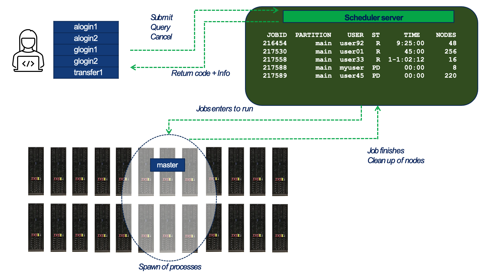
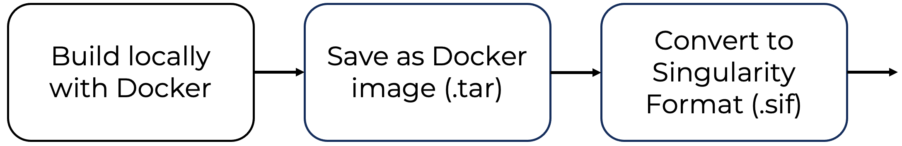

# Supercomputing Software Environment and Tools

## Base Software Stack

Supercomputing environments require a carefully orchestrated set of software components that enable the efficient, scalable, and reproducible execution of complex applications. The software stack in an HPC system extends from the operating system to workload managers, compilers, performance analysis tools, and environment configuration mechanisms. While most HPC installations share a broadly similar structure in their software stack, there is some variability in the specific software packages and versions deployed at each site. In this chapter, we will focus on the case of MareNostrum 5 as a representative example of a modern HPC installation designed to support traditional HPC applications.

### Foundational Software Stack

The foundational software environment deployed on MareNostrum 5 (MN5) is designed to support a broad spectrum of high performance computing workloads, from traditional simulation codes to AI applications. At its core, MN5 runs Red Hat Enterprise Linux 9.2 as the operating system, offering a stable and secure base for system operations.

The compiler suite includes both the Intel OneAPI HPC Toolkit and the NVIDIA SDK (formerly PGI), enabling users to build optimized applications for a variety of hardware architectures, including CPUs and GPUs. For numerical computations, MN5 provides well-established numerical libraries such as Intel MKL and those included in the NVIDIA SDK, ensuring high performance in linear algebra, FFTs, and other mathematical kernels.

To support application development and performance analysis, the system integrates a comprehensive set of debugging and profiling tools, including BSC’s in-house performance tools, ARM DDT for parallel debugging, NVIDIA’s profiling tools, and Intel VTune, which is part of the OneAPI toolkit. These tools assist developers in identifying performance bottlenecks and optimizing resource usage.

Resource allocation and job scheduling are managed by SLURM, the widely used open-source workload manager. While MN5 operates as a single SLURM cluster, it is internally partitioned to manage different types of jobs and hardware configurations.

Finally, MN5 incorporates EAR (Energy Aware Runtime), a system-level framework developed at BSC that monitors and dynamically optimizes energy consumption without compromising application performance.

Together, these software components form a robust and modular stack that supports scalable, efficient, and reproducible scientific computing on MN5.

### Environment Modules System

Managing software versions and dependencies across users and applications is a major challenge in multi-user HPC systems. MN5 uses the Environment Modules[^1] system to allow dynamic modification of a user's environment through the module command. Typically, users initialize their environment when they log in by setting environment information for every application they reference during the session.

Modules enable users to load specific versions of software packages (compilers, libraries, etc.) ensuring isolation and reproducibility. Modules can be invoked in two ways: by name alone or by name and version. Invoking them by name implies loading the default module version. This is usually the most recent version tested to be stable (recommended) or the only version available. Examples can be:

    $ module load intel
    $ module load gcc/11.2
    $ module load cuda/12.1
    $ module load python/3.10

The most important commands for modules are these:

- module list shows all the loaded modules

- module avail shows all the modules the user is able to load

- module purge removes all the loaded modules

- module load \<modulename\> loads the necessary environment variables for the selected modulefile

- module unload \<modulename\> removes all environment changes made by module load command

- module switch \<oldmodule\> \\newmodule\> unloads the first module and loads the second module

You can run module help anytime to check the command's usage and options[^2].

### Compiling and Running C Programs

C is a general-purpose programming language developed in the early 1970s and is still quite popular because it is so powerful for creating applications, operating systems, and utilities. Due to its simplicity, efficiency, and portability, C has influenced the development of many other modern programming languages. In this section we will introduce how to use it on the MareNostrum 5 supercomputer.

#### gcc Compilers

As you learned in previous courses, you always compile C programs to generate binary executables. On the MN5, you will find gcc (GNU Compiler Collection) readily available. It is the default compiler on most Linux distributions and is considered a foundational tool in the open-source ecosystem.

Below, you can see a "Hello World" program written in C:

    $ more hello.c
    #include <stdio.h>
    int main(){
        printf("Hello world!\n");
    }

It can be compiled with the gcc compiler:

    $ gcc hello.c -o hello

Then, it can be executed (in the login node) as:

    $ ./hello

Hello world!

#### Compiler Behavior and Optimization Flags

In high performance computing, understanding how compiler optimization flags affect execution time is essential for achieving maximum performance. In this section, we explore the impact of different optimization levels in gcc compiler, using a synthetic test program and a simple compilation script.

The C program test.c is a synthetic benchmark that performs a large number of floating-point operations on two static double-precision matrices. The key computational kernel performs an element-wise division across the matrices repeated many times to accumulate measurable runtime.

    /* Example from PATC 2024 course @ BSC*/

    #include <stdio.h>
    #include <sys/time.h>
    #include <time.h>
    #include <stdlib.h>

    #define SIZE 8000
    typedef double matrix[SIZE][SIZE];
    matrix m1, m2;
    struct timeval start_time, end_time;

    static void foo (void) {
      int i,j;
      for (i = 0;i < SIZE; ++i)
        for (j = 0; j < SIZE; ++j)
           m1[i][j] = 8.0/m2[i][j];             
    }

    void check_matrix() {
       int i, j;
       for(i=0;i<SIZE;i++) {
         for(j=0;j<SIZE;j++) {
           if(m1[i][j]!=3.2)
    	printf("Check failed\n");
    	exit(1);
           }
            //printf("\n");
         }
    }

    void print_times(){
       int total_usecs;
       float total_time;
       total_usecs = (end_time.tv_sec-start_time.tv_sec) * 1000000 +
             (end_time.tv_usec-start_time.tv_usec);
       printf(" %.2f mSec \n", ((float) total_usecs) / 1000.0);
       total_time = ((float) total_usecs) / 1000000.0;
    }

    int main () {
      int i,j;

       for(i=0;i<SIZE;i++) {
         for(j=0;j<SIZE;j++) {
    	m2[i][j]=2.5;
    	}
        }
       gettimeofday(&start_time, NULL);
        for (i = 0; i < 10; ++i) foo();

       gettimeofday(&end_time, NULL);
       print_times();
       check_matrix();
    }

If you find the example difficult to follow, you may want to review some relevant features of the C language covered in the *appendix C Language Basics*.

To measure runtime, the program uses the gettimeofday() system call to capture start and end timestamps. You can find a detailed explanation of this function in the *appendix Taking Time*, where we describe how it provides a high-resolution wall-clock measurement of elapsed time on MareNostrum 5.

The script compilation-gcc.sh automates the compilation and execution of the program using various optimization levels offered by the gcc compiler:

    gcc -O0 test.c -o test0
    echo "gcc -O0"
    ./test0

    gcc -O1 test.c -o test1
    echo "gcc -O1"
    ./test1

    gcc -O2 test.c -o test2
    echo "gcc -O2"
    ./test2

    gcc -O3 test.c -o test3
    echo "gcc -O3"
    ./test3

The -O flags control the compiler's level of optimization:

- -O0: No optimization (baseline for comparison).

- -O1, -O2, -O3: Increasing levels of optimization, enabling progressively more aggressive compiler transformations.

Running the script on a compute node of MareNostrum 5 produced the following output:

    ./compilation-gcc.sh

gcc -O0

19150.90 mSec

gcc -O1

10125.57 mSec

gcc -O2

10128.24 mSec

gcc -O3

436.28 mSec

Without any optimization, the program runs in its raw, unoptimized form and is more than 40 times slower than the best-performing case. This example clearly illustrates how crucial compiler optimizations are for achieving high performance.

#### icx Compiler

While gcc is preferred for its general-purpose capabilities and cross-platform compatibility, the icx compiler for C/C++ offers performance advantages on Intel processors due to its architecture-specific optimizations. The compiler icx is developed by Intel as part of its suite of development tools, providing advanced optimization features and support for the latest Intel architectures (including support for the instruction sets like AVX-512). This compiler enables different levels of optimizations using flags in the compilation process.

We now reproduce the same experiment as before, this time comparing different optimization levels for the icx compiler. This can be done using the compilation-icx.sh script, which automates both the compilation and execution of the program with various optimization flags supported by icx.

    icx -O0 test.c -o test0
    echo "icx -O0"
    ./test0

    icx -O1 test.c -o test1
    echo "icx -O1"
    ./test1

    icx -O2 test.c -o test2
    echo "icx -O2"
    ./test2

    icx -O3 test.c -o test3
    echo "icx -O3"
    ./test3

    icx -O3 -xhost test.c -o test4
    echo "icx -O3 -xhost "
    ./test4

The -O flags control the compiler's level of optimization, just as in gcc. In addition, this compiler provides the -xhost option, which instructs the compiler to generate code optimized for the host architecture, enabling the use of advanced vector instructions such as AVX-512 when supported.

AVX-512 (Advanced Vector Extensions 512) is a set of vector instructions developed by Intel that enables processing of 512-bit wide vector registers, allowing simultaneous operations on multiple data elements to accelerate data-parallel workloads. While primarily implemented in Intel processors, partial support has also been introduced in some AMD CPUs.

Running the script on a compute node of MareNostrum 5 produced the following output:

    $ module load intel
    $ ./compilation-icx.sh

icx -O0

17107.87 mSec

icx -O1

8347.91 mSec

icx -O2

8241.53 mSec

icx -O3

8417.59 mSec

icx -O3 -xhost

145.88 mSec

These results demonstrate the dramatic effect of compiler optimizations. Without optimization, the program runs unoptimized and is over 100 times slower than the best case. Moderate optimizations result in a roughly 2× speedup, but show little difference among themselves. The most notable improvement occurs with -O3 -xhost, which delivers a \>100× speedup. This suggests that vectorization and architecture-specific instructions (e.g., AVX512) are successfully applied. The -xhost enables the compiler to generate optimized code for the exact architecture in MN5.

This experiment illustrates two important lessons:

- Compiler flags matter—the default behavior may leave significant performance on the table.

- Architecture-aware compilation (-xhost) can unlock the full potential of the underlying hardware.

This type of microbenchmark, though simplified, is a powerful pedagogical tool to develop an intuition for the interplay between code structure, compiler behavior, and performance.

Task 3.1 – Compare icx and gcc Compiler Optimizations

To explore how compiler optimizations impact execution time in HPC environments, replicate the benchmark experiment using both the gcc and icx compilers on MareNostrum 5.

## Workload Management with SLURM

### The Essentials of SLURM

HPC environments are shared infrastructures where thousands of users may simultaneously submit jobs to powerful compute nodes. Manually allocating and controlling access to such resources would be impractical. This is where job schedulers become essential — and among them, SLURM (Simple Linux Utility for Resource Management) stands out as the most widely adopted workload manager in the supercomputing community.

#### What is SLURM?

Originally developed in 2002 at Lawrence Livermore National Laboratory, SLURM began as a lightweight resource manager for Linux clusters. Since then, it has evolved into a fully-fledged job scheduler, now comprising over 500,000 lines of C code. It is released as open source and follows a modular architecture, which makes it adaptable to a wide range of system sizes and configurations.

Today, SLURM is more accurately referred to as the SLURM Workload Manager. It orchestrates the execution of user jobs across compute resources in a scalable, efficient, and secure way. Its modularity is one of its defining strengths: SLURM supports around 100 plugins that extend its core functionality, including: Accounting plugins, MPI plugins, Topology plugins, Checkpoint plugins, Storage-related plugins for job accounting and system integration, etc. This flexibility makes SLURM suitable for everything from single-node jobs to massive multi-node simulations and AI training workloads.

At MareNostrum 5, SLURM is the central component that governs job execution. The system is shared by numerous research groups, and departments. To run code on compute nodes, users must submit a job to SLURM via a submission script. Jobs are then queued, prioritized, and executed according to the availability of resources, scheduling policy, and user entitlements.

This model offers key benefits:

- Controlled resource usage, including precise allocation of CPUs, GPUs, memory, and wall time.

- Fair job scheduling, enforced through priorities, usage quotas, and policies such as fairshare or time-limited queues.

- Monitoring and logging, including runtime status, errors, and execution history.

- Automation and reproducibility, as jobs are defined declaratively through scripts.

#### Core SLURM Commands

In essence, SLURM acts as the traffic controller of a supercomputer: it receives structured job descriptions and manages when and where those jobs are executed. Each submission script specifies the required resources and the commands to run. SLURM then takes care of the rest—coordinating access, tracking job progress, and ensuring that workloads are executed in a balanced and secure manner.

Once you have prepared your SLURM job script (see the next section for examples), you interact with the scheduler using these core commands.

Submit a job to the queue:

    $ sbatch <job_script>

> This returns a job identifier \<job_id\> and enqueues your job.
>
> List queued and running jobs:

    $ squeue

To see when pending jobs are expected to start, add the --start flag:

    $ squeue --start

When using the squeue command, SLURM displays the status of your submitted jobs along with relevant scheduling information. If a job is still waiting, it appears as PENDING (PD) — meaning it’s in the queue and awaiting resource allocation. Once scheduled and executing, the job transitions to RUNNING (R). Just before completing, it may briefly enter the COMPLETING (CG) state, indicating that most tasks in this job have finished but some are still finalizing. These are the most common job states you’ll encounter during typical usage.

Cancel a job by its \<job_id\>:

    $ scancel <job_id>

Get help on any SLURM command:

    $ man sbatch

Figure 3.1 – General workflow of job submission and execution in a SLURM-managed HPC environment. (source BSC Operations Dep.).

Figure 3.1 provides a high-level view of how users interact with SLURM and how jobs progress from submission to execution across the compute cluster:

1.  Users connect to one of the system’s login or transfer nodes and interact with the job scheduler through commands such as sbatch, squeue, and scancel. These commands are sent to the scheduler server, which manages the global job queue.

2.  The scheduler maintains a list of all submitted jobs and decides when and where each job should run. It applies policies such as job priorities, fair-share scheduling, and resource availability. Once a job is eligible to run, the scheduler selects the appropriate partition and set of compute nodes.

3.  The job is launched on the assigned nodes in the supercomputer. At this stage, one or more tasks are launched on the allocated nodes, according to the execution model defined by the application or runtime environment (e.g., MPI, Python, or deep learning frameworks). At this stage, the job environment is set up — including the loading of software modules or containers (explained in Section 3.4) if specified in the job script.

4.  After the job completes, SLURM releases the allocated resources and updates internal accounting records. The exit status and runtime statistics are returned to the user and stored for monitoring and reporting purposes.

#### Partitions and Queues

When submitting a job in SLURM, users must specify a queue (also referred to as a partition or a QoS — Quality of Service). Each queue is associated with a different purpose and has its own usage limits.

These limits may include: Maximum number of nodes or cores per job, maximum job duration (wall clock time), and maximum number of concurrent jobs per user or group.

Several queues are available on MareNostrum 5, and not all users have access to the same ones. Your access will depend on the specific course assigned to you account. To check which queues are available to you — along with their limits — use the following command:

    $ bsc_queues

This command provides a summary of all QoS you are allowed to use, showing constraints. Choosing the appropriate queue is critical to ensure your job is eligible for scheduling and to make the most efficient use of your project’s computing time.

For GPP partition, standard queues names and limits are as follows:

|    **QoS name**    | **Max. nodes** | **Max. cores** | **Wall clock time** |
|:------------------:|:--------------:|:--------------:|:-------------------:|
|    **gp_debug**    |       32       |     3,584      |         2h          |
| **gp_interactive** |       1        |       32       |         2h          |
|  **gp_training**   |       32       |      3584      |         24h         |

For ACC partition, standard queues names and limits are as follows:

| **QoS name** | **Max. nodes (cores)** | **Max. GPUs** | **Wall clock time** |
|:--:|:--:|:--:|:--:|
| **acc_debug** | 8 (640) | 32 | 2h |
| **acc_interactive** | 1 (40) | 4 | 2h |
| **acc_training** | 4 (320) | 16 | 24h |

#### Job Priority

SLURM is not only responsible for launching jobs—it also determines *when* each job should run. On a shared system like MareNostrum 5, where thousands of jobs may be submitted simultaneously by multiple users, efficient scheduling is critical to ensuring fair and effective resource use.

The order in which jobs are executed is governed by SLURM’s job prioritization mechanism. This mechanism takes into account several factors, combining them into a scheduling policy that balances performance, fairness, and system utilization. The most relevant factors include:

- Job size: Larger jobs—those that request more compute cores—are generally prioritized. This reflects the system’s optimization for large-scale computations, helping to improve overall throughput by allocating resources in bulk when available.

- Queue waiting time: The longer a job remains in the queue, the more priority it accumulates over time. This aging mechanism ensures that smaller or lower-priority jobs are not permanently blocked and will eventually run.

- Fair-share policy: SLURM implements a fair-share algorithm to ensure that no user or group monopolizes the system. Users or projects with fewer recent executions and lower accumulated compute hours are temporarily given higher scheduling priority. Conversely, groups with heavier recent usage may see their jobs wait longer, ensuring equitable access to compute resources over time.

This multi-factor approach is designed to maintain a fair distribution of computing time while also keeping the system efficiently utilized. Importantly, users do not need to manually set job priorities; the scheduler handles this transparently. However, understanding how prioritization works can help users interpret queue behavior and set realistic expectations for job start times—especially during periods of high demand.

Remember that you can use the squeue --start command to estimate when a pending job is expected to begin, based on the current scheduling policy and system load.

### Job Directives

Job submission script is a shell script, most commonly sh or bash. The first line in the script indicates it.

The script that defines a job must contain a series of directives to inform the batch queuing system about the characteristics of the job. These directives (also named flags) appear as comments in this text file that represent a job script and must conform to the *sbatch* syntaxes:

    #SBATCH --directive=value

Additionally, the job script may contain a set of commands to execute. You may find the most common directives below.

#### Mandatory job directives

Some directives are mandatory for any SLURM job description. Let's start by introducing these directives[^3].

Request the queue for the job is mandatory when submitting jobs in the current MareNostrum 5 configuration.

    #SBATCH --qos=<QoS_queue_name>

For example, the queue gp_debug is intended for small test executions in the GPP partition.

Sometimes, node reservations can be granted for executions where only a set of accounts can run jobs. Useful for courses as ours at UPC. You can set the reservation name where you will allocate your jobs using this directive:

    #SBATCH --reservation=<reservation_name>

Another mandatory parameter sets a wall clock time limit for the total runtime of the job:

    #SBATCH --time=<time>

You must set it to a value, DD-HH:MM:SS, greater than the real execution time for your application and smaller than the time limits granted to the user. Notice that your job will be killed after the time limit granted to the user has passed.

Each user on MareNostrum 5 is assigned a unique username along with one or more Unix group accounts that represent their associated research projects or institutions. These group accounts are not only used for file system permissions but also for resource accounting and scheduling purposes. When submitting a job to SLURM, it is mandatory to specify the corresponding project account using the following job script directive:

    #SBATCH --account <account>

This flag connects the job to a specific allocation of resources — CPU time, GPU hours, and storage — granted to your project. Without this declaration, the job will be rejected by the scheduler.

Behind the scenes, SLURM integrates with the Linux kernel’s control groups (cgroups) mechanism to enforce resource usage. Cgroups are a fundamental kernel feature that allows the system to limit, isolate, prioritize, and monitor resources for groups of processes. This is essential in a shared supercomputing environment.

The system will generate specific error messages if an attempt is made to submit a job without specifying a SLURM account, time, and/or queue (QoS).

Once your job script contains the appropriate SLURM directives, you are ready to submit it to the system. For instance, let’s run the compilation-gcc.sh program we introduced earlier — but now in batch mode, using SLURM managed resources.

You only need to create a simple SLURM script like the one below:

    #!/bin/bash

    #SBATCH --time <indicate the time> 
    #SBATCH --account <indicate the Unixgroup/Account>
    #SBATCH --qos <indicate the Queue>

    ./compilation-gcc.sh

Replace the placeholders \<...\> with the appropriate values based on your project and the queue you intend to use.

Once your script is ready, submit it using the sbatch command, check its status in the queue, and retrieve the output:

    $ sbatch compilation-gcc.slurm 
    Submitted batch job 21126902
    $ squeue
                 JOBID PARTITION     NAME       USER  ST       TIME  NODES NODELIST(REASON)
              21126902       gpp compilat <username>   R       0:01      1 gs05r2b08

Task 3.2 – Submit Your First SLURM Job (C Compilation)

Now that you have seen how a SLURM batch script is structured, it is time to submit your first job on MareNostrum 5 using the SLURM scheduler.

Create a SLURM submission script named compilation-icx.slurm that requests the appropriate resources and launches the compilation-icx.sh script introduced earlier in this chapter. Make sure to specify all mandatory directives, including the wall-clock time limit, project account, and queue (QoS). Also remember to load the Intel module using module load intel, as the icx compiler is not included in the default Linux environment (unlike gcc).

Once your submission script is ready, submit the job using the sbatch command and verify that it has entered the queue. When the job completes, check that a slurm-\<jobid\>.out file has been generated. This output file should contain the same compilation results and performance information you observed previously when running the script interactively.

This exercise marks your first practical interaction with the SLURM batch system and establishes the foundation for executing more complex workloads in subsequent chapters.

#### Running a Simple Python Script with SLURM 

At this point, we briefly pause the discussion of job directives to introduce a minimal example aimed at readers who may have come to this chapter primarily to learn how to execute Python code using SLURM, without prior experience in C programming or MPI. The goal of this example is simply to demonstrate how a Python script is executed on a compute node through the SLURM workload manager.

Consider the following Python program, which prints the name of the compute node on which it is executed:

    import platform

    # Get the node name (hostname)
    node_name = platform.node()

    print(f"Hello from node: {node_name}")

To run this script on MareNostrum 5 using SLURM, we create a simple batch submission script:

    #!/bin/bash
    #SBATCH --time=00:02:00          # Time limit
    #SBATCH --account=bsc31          # Project account
    #SBATCH --qos=gp_debug           # Queue (QoS)

    module load intel
    module load mkl
    module load python

    # srun ensures SLURM manages the process execution
    srun python hello_node.py

This job requests a short execution time and a small amount of resources, making it suitable for testing and development. The srun command is used to launch the Python process under SLURM’s control, ensuring that the execution takes place on the allocated compute node rather than on the login node.

When the job runs, the output will indicate the hostname of the compute node, confirming that the Python script is executing within the supercomputing environment. Although this example uses only a single process, the same structure applies to more complex workloads, including distributed training jobs, which will be introduced progressively in later chapters.

Task 3.3 – Submit Your First SLURM Job Running a Python Script

Now that you have seen how a simple Python script can be executed through SLURM, it is time to submit your first Python-based batch job on MareNostrum 5.

Create a SLURM submission script named submit_python.slurm that requests a short runtime, specifies your project account and an appropriate queue, and launches the hello_node.py script shown earlier in this section. Make sure to load the Python module required to run the script.

Once your submission script is ready, submit the job using the sbatch command and verify that it appears in the queue. When the job completes, check that a slurm-\<jobid\>.out file has been generated. This file should contain the output produced by the Python script, including the hostname of the compute node on which it was executed.

This exercise marks your first practical use of SLURM to execute a Python application on a supercomputer and serves as a foundation for running more complex Python-based workloads, including GPU-accelerated and distributed training jobs, later in this book.

#### Useful Job Directives

There are many more job directives available in SLURM that can help you fine-tune how your job is executed. One example is setting the working directory where the job should run — which can be different from the directory where the job was submitted.

This can be specified in either of the following equivalent forms:

    #SBATCH -D <pathname>

or

    #SBATCH --chdir=<pathname>

If no working directory is specified, the job will run in the directory from which it was submitted.

Both directive formats serve the same purpose, and you may encounter either form in different examples or documentations. Throughout this book, we will include both the short and long versions where appropriate, to help you become familiar with both styles without confusion. The same applies to the directives we have already seen, such as:

    #SBATCH --qos=<qos>      # or  
    #SBATCH -q <qos>  

    #SBATCH --account=<account>  # or  
    #SBATCH -A <account>  

    #SBATCH --time=<time>    # or  
    #SBATCH -t <time>  

It is often useful to define custom filenames for storing the standard output (stdout) and standard error (stderr) generated by your SLURM jobs, rather than relying on the default filenames provided by the system, which typically combine both streams into a single file (slurm-\<jobid\>.out). Using separate and descriptive filenames improves the organization of your experiments and makes it easier to track and analyze job results.

To specify the output and error log files, SLURM provides the following directives:

    #SBATCH --output=<filename>
    #SBATCH --error=<filename>

A helpful SLURM feature is the use of the %j placeholder, which automatically expands to the unique job ID assigned when the job is submitted. This allows your output and error files to be named dynamically per job execution.

As a convention in this book, we will adopt the following pattern:

    #SBATCH --output=<task_name>_%j.out
    #SBATCH --error=<task_name>_%j.err

If your cluster runs SLURM version 20.02 or later, you can also use the %x placeholder to automatically insert the job name specified with --job-name.

For example:

    #SBATCH --job-name=my_job_name
    #SBATCH --output=%x_%j.out
    #SBATCH --error=%x_%j.err

This will generate output and error files with the job name and job ID, such as my_job_name_12345.out and my_job_name_12345.err.

You can check the SLURM version using the command

    $ srun --version

### Computing Resource Allocation

To execute jobs efficiently on a supercomputer, it is crucial to understand how to request computing resources through SLURM job directives. This section introduces the key options to control the number of tasks, CPU cores, nodes, and other resource-related parameters.

#### Basic Resource Directives

At a minimum, SLURM needs to know how many tasks your job will launch and how many CPU cores each of those tasks should use. Based on this information, the system can determine how many compute nodes are required, depending on the hardware configuration of the selected partition. On MareNostrum 5, nodes in the GPP partition have 112 CPU cores, while nodes in the ACC partition have 80 CPU cores.

To request parallel resources, two key directives are used. First, you specify the number of independent tasks your job will run:

    #SBATCH --ntasks=<number>

or its short form:

    #SBATCH -n <number>

Then, you define how many CPU cores each task should use—typically required for multi-threaded applications:

    #SBATCH --cpus-per-task=<number> # or

    #SBATCH -c <number>

The total number of CPU cores allocated to your job will be the product of these two values: total_cores = ntasks × cpus-per-task. Understanding this calculation is essential for accurately requesting resources and avoiding unnecessary usage in a shared supercomputing environment.

If you need finer control over how resources are distributed across nodes or sockets, SLURM offers additional directives. To control how tasks are distributed within nodes:

    #SBATCH --ntasks-per-node=<number> 

To control how tasks are distributed across sockets:

    #SBATCH --ntasks-per-socket=<number> # or
    #SBATCH -s <number>

To explicitly request a number of nodes:

    #SBATCH --nodes=<number> # or
    #SBATCH -N <number>

To ensure your job has exclusive access to the allocated node(s), preventing other users from sharing them:

    #SBATCH --exclusive

Exclusivity applies implicitly to multi-node jobs. However, for single-node jobs, you must explicitly request it. Otherwise, your job may share the node with others if it doesn't occupy all the available cores.

Let’s clarify this with a couple of examples. Suppose you want to use just a small portion of a single node by requesting 2 tasks, each using 1 core. You can do so with the following directives:

    #SBATCH -N 1
    #SBATCH -n 1
    #SBATCH -c 2

This job will use only 2 out of the 112 available cores on a node in the GPP partition, leaving the remaining resources free to be shared with other users.

Now imagine you request the same number of tasks and cores, but across 2 nodes:

    #SBATCH -N 2
    #SBATCH -n 2
    #SBATCH -c 1

Even though your job still uses only 2 tasks and 2 cores in total, SLURM will allocate both nodes exclusively—one for each task. On MareNostrum 5's GPP partition, this means consuming all 224 cores (112 cores per node). This behavior occurs automatically when multiple nodes are requested, and it’s important to be aware of it, as it can significantly increase the total core-hours charged to your project.

#### Jobs with GPUs

To run jobs that require GPU acceleration on MareNostrum 5, you must submit them to the ACC Partition ACC, which is designed specifically for workloads that benefit from GPUs. Each ACC node provides 4 GPUs. To request GPUs within a SLURM batch script, use the directive:

    #SBATCH --gres=gpu:{1–4}

It’s important to note that MareNostrum 5 enforces a specific ratio between CPU and GPU resources (a system policy enforced by the administrators of MareNostrum 5). For every GPU you request, you must also allocate 20 CPU cores. This means a job requesting 1 GPU must also request 20 CPU cores, while a job needing 4 GPUs must request all 80 CPU cores on the node. You can distribute these resources using different combinations of --ntasks and --cpus-per-task based on the parallelism model of your application—be it MPI, or hybrid (programming models that we will see in the next part of the book).

For instance, a simple job requiring only a single GPU (and a single MPI task) would specify:

    #SBATCH --ntasks=1
    #SBATCH --cpus-per-task=20
    #SBATCH --gres=gpu:1

For a more demanding setup requiring eight GPUs (across two nodes), you could request eight (MPI) tasks, each bound to one GPU, as follows:

    #SBATCH --ntasks=8
    #SBATCH --cpus-per-task=20
    #SBATCH --gres=gpu:4

At first glance, it may seem inconsistent to request eight tasks while specifying four GPUs. However, the --gres=gpu:4 directive applies per node. In this case, SLURM allocates two ACC nodes, each providing four GPUs, resulting in a total of eight GPUs available to the job.

Choosing the best configuration depends on the characteristics of your application and how it handles parallelism.

#### Interactive Jobs

In some situations, you may want to run a program or debug a script interactively—that is, in real time—directly on a compute node. This contrasts with batch jobs, which are submitted and executed later through the queue system. Interactive jobs are particularly useful for development, quick testing, or debugging purposes.

To request an interactive session, you must use the salloc command. This command reserves the resources you specify and provides you with a shell on the allocated compute node, from which you can launch applications or commands directly.

The basic structure of the command is:

    salloc --account=<account> --qos=<qos> [other options]

Some commonly used options include:

- --account={account} or -A: Your Unix group account.

- --qos={qos} or -q: The queue to use (e.g., gp_interactive).

- --partition={name} or -p: Partition to run on (optional, depending on the system configuration).

- --time={time} or -t: Wall-clock time limit for the session (format: HH:MM:SS).

- --ntasks={number} or -n: Number of tasks to run.

- --cpus-per-task={number} or -c: Number of CPUs (cores) per task.

- --nodes={number} or -N: Number of compute nodes to request.

- --exclusive: Allocate nodes exclusively for your job.

- --x11: Enable X11 forwarding (for GUI applications, if supported).

- --job_name or -J : Job name.

To illustrate how interactive sessions can be requested, consider the following scenarios. Suppose you want to reserve a short session to test a program or script. You can request a 10-minute interactive session on the gp_interactive queue using one task and four CPU cores with the following command:

    salloc -A <account> -t 00:10:00 -n 1 -c 4 -q gp_interactive -J myjob

This will allocate the requested resources and open an interactive shell on a compute node.

If you need exclusive access to a full node—ensuring no other jobs share the same node—you can request it by adding the --exclusive flag.

You can also request nodes equipped with GPUs. For instance, to request 40 CPU cores (distributed as two tasks with 20 cores each) along with 2 GPUs on the acc_debug queue, use:

    salloc -A <account> -q acc_debug -n 2 -c 20 --gres=gpu:2

Once your request is granted, your terminal session will move directly into the allocated node. From there, you can run commands interactively, just as you would on your local system—but now using supercomputing resources. Don’t forget to exit the session once you're done to release the resources back to the system.

#### SLURM Environment Variables

When executing jobs under SLURM, a number of environment variables are automatically set and made available to your job script and the running processes. These variables provide essential information about the job configuration and the allocation granted by the scheduler. They are particularly useful when writing portable scripts for parallel jobs.

The most commonly used SLURM environment variables include:

| **Variable** | **Meaning** |
|----|----|
| SLURM_JOBID | The unique job identifier assigned at submission time. This value is also used in default output filenames (e.g., slurm-\<jobid\>.out). |
| SLURM_NPROCS | The total number of processes (tasks) allocated for the job. Equivalent to the value given by --ntasks. |
| SLURM_NNODES | The number of compute nodes assigned to run the job. This value can differ from --nodes if the scheduler optimizes the allocation. |
| SLURM_PROCID | The process rank or ID of the current task, ranging from 0 to SLURM_NPROCS-1. Frequently used in MPI jobs to identify the task's role. |
| SLURM_NODEID | The relative index of the node on which the current task is running, from 0 to SLURM_NNODES-1. |
| SLURM_LOCALID | The task’s local index within a node. Useful for binding threads or optimizing intra-node communication. |

These variables are automatically exported to all processes of your job and can be used within scripts or source code to guide runtime behavior.

To exemplify the use of SLURM environment variables in a simple but practical way, consider the following snippet:

    #!/bin/bash
    #SBATCH -t 00:10:00
    #SBATCH --account=<account>
    #SBATCH --qos=acc_debug

    echo "This is task $SLURM_JOBID on $(hostname) at $(date)"

This minimal script demonstrates how to access key runtime information using environment variables and basic Unix commands. The variable \$SLURM_JOBID automatically holds the unique identifier assigned to the job by the scheduler. The command hostname prints the name of the compute node where the job is running, while date provides the current timestamp.

When executed, this script produced the following output:

This is task 23120862 on as01r1b09 at Wed Des 31 23:59:59 CEST 2025

This kind of message is helpful for quickly verifying where and when a job ran, which can be particularly useful for debugging or logging purposes in larger parallel workflows.

And to conclude, although this section may seem dense and extensive, there is no need to memorize every detail. It is intended as a reference guide. In practice, all the essential aspects of SLURM job scripts introduced here will be revisited progressively throughout the upcoming chapters, each time in context and with practical examples. The goal here has been to provide a complete picture of the overall concepts.

#### Common SLURM Mistakes 

When starting to work with SLURM, several recurring mistakes can lead to inefficient resource usage, long queue times, or failed job submissions. Being aware of these pitfalls can save considerable time and frustration.

- Confusing jobs, tasks, and processes: A job is a scheduling unit submitted to SLURM. Tasks are the execution units launched by the scheduler and correspond to operating system processes. SLURM manages tasks, not application-level logic such as MPI ranks or threads.

- Assuming GPU requests are global: The directive --gres=gpu:\<N\> specifies the number of GPUs per node, not the total number of GPUs for the job. When multiple nodes are allocated, the total number of GPUs is the per-node request multiplied by the number of nodes.

- Requesting more nodes than necessary: Requesting multiple nodes implicitly allocates each node exclusively. Even small jobs can consume large amounts of resources if nodes are requested unnecessarily, increasing project usage and queue waiting times.

- Forgetting mandatory directives: Omitting required directives such as --account, --time, or --qos will cause the job to be rejected immediately by the scheduler. Always verify that these parameters are set correctly before submission.

- Running applications outside SLURM control: Executing programs directly on login nodes or without using srun inside a batch job bypasses SLURM’s resource management. Always use srun (or equivalent launchers) to ensure proper execution on allocated compute resources.

- Requesting GPUs without sufficient CPUs: On systems such as MareNostrum 5, GPU requests are tied to CPU allocation policies. Requesting GPUs without the required number of CPU cores will result in submission errors or suboptimal performance.

- Understanding and avoiding these common mistakes will help you use shared supercomputing resources efficiently and prepare you for more advanced workflows introduced later in this book.

## Getting Started with Docker Containers

Due to its relevance in current AI workflows, and even though it is not available on MareNostrum 5, we include a brief introduction to Docker to help students understand the fundamentals of container-based environments.

### Docker Basics

#### Docker Image

[Docker](https://www.docker.com/)[^4] is the world’s leading software container platform. Developers use Docker to eliminate work on local machine problems when collaborating on code with co-workers. Operators use Docker to run and manage apps side-by-side in isolated containers to get better compute density. Enterprises use Docker to build agile software delivery pipelines to ship new features faster, more securely, and with confidence for both Linux and Windows Server apps.

Available for both Linux and Windows-based apps, containerized software will always run the same, regardless of the environment. Containers isolate software from its surroundings, for example, differences between development and staging environments, and help reduce conflicts between teams running different software on the same infrastructure. The key benefit of Docker is that it allows us to package an application with all of its dependencies into a standardized unit for software development independent of the hosting Operating System.

A container image is a lightweight, standalone, executable package of a piece of software that includes everything needed to run it: code, runtime, system tools, system libraries, and settings.

#### Docker Hub

Docker Hub[^5] is essentially the official online repository where individuals and organizations can upload and share Docker container images. Remember that these containers are packaged versions of applications or services along with all the necessary parts they need to run, like the code, runtime, libraries, and settings. Docker Hub makes it easy for anyone to find and download these container images to use in their own projects or deployments.

Docker Hub isn’t just for downloading; it’s also a platform for sharing. Developers and companies can upload their own container images to Docker Hub, making them publicly available for others to use, or keep them private for their own use or for sharing within a specific group or organization.

#### 

#### Including a new Docker Image in Docker Hub

Including a new Docker image in Docker Hub involves a few straightforward steps. Here's a summary that describes the process:

1.  Start by creating an account on Docker Hub if you don't already have one. You'll need this account to upload (push) your images and manage them.

2.  Log in using the Docker CLI (Command Line Interface) by typing docker login and entering the Docker Hub credentials.

3.  Develop your Docker image locally on your machine. This involves creating a Dockerfile that specifies the base image, software, libraries, and other components your application needs, along with any necessary configurations and commands. Build your image using the docker build command.

4.  Once your image is built, you can push it to Docker Hub using the docker push command. This command uploads your image to Docker Hub, making it accessible based on the visibility settings you choose (public or private).

5.  With your image now hosted on Docker Hub, you can share it with others by providing them with the name of your image, e.g. jorditorresbcn/dl.

6.  They can then pull the image using docker pull and use it in their own Docker environments.

Docker Hub's documentation provides detailed guides and best practices for creating, managing, and sharing Docker images.

For this section, we will use a simple docker image created by the author and uploaded to the Docker Hub with the name jorditorresbcn/dl.

#### How to Install Docker containers in Your Platform?

Docker Desktop for Windows is the preferred Docker product for Windows 10 and 11 (Pro, Enterprise, or Education editions). It includes Docker Engine, Docker CLI (Command Line Interface) client, Docker Compose, Docker Content Trust, Kubernetes, and Credential Helper. Visit the Docker Desktop for Windows download page[^6]. After downloading, double-click the installer and follow the installation wizard's instructions.

Docker Desktop for Mac is designed for macOS 10.14 and newer versions. It provides an easy-to-install desktop application for building, sharing, and running Docker containers. Visit the Docker Desktop for Mac download page[^7]. Open the downloaded .dmg file and drag the Docker icon to your Applications folder to install.

The installation process for Docker on Linux distributions involves a series of command-line operations. Common Linux distributions include Ubuntu, CentOS, Debian, Fedora, and more. To get started with Docker Engine on Ubuntu, make sure you [meet the prerequisites](https://docs.docker.com/engine/install/ubuntu/#prerequisites)[^8], and then follow the [installation steps](https://docs.docker.com/engine/install/ubuntu/#installation-methods). For other Linux distributions, follow the specific instructions provided in the Docker documentation[^9].

Task 3.4 – **Install Docker in Your Platform**

In this task, you will install Docker on your own computer, depending on the operating system you use. Follow the steps outlined in the previous section for Windows, macOS, or Linux. Make sure to complete the installation successfully. Open a terminal or command prompt. Run the command docker --version to confirm that Docker is correctly installed.

Optionally, run docker run hello-world to test your installation with a sample container.

Reflect on the installation outcome. Did the installation work as expected on your platform? If not, identify the error encountered and its likely cause. If the installation was successful, determine where the Docker engine is running on your system and how much memory is allocated to it by default. This information will be useful in later tasks, where containerized execution and resource constraints become relevant.

#### How to Download a Docker Image?

The docker pull command is used to download a Docker image from a Docker Hub. When you execute this command, Docker looks for the specified image in the remote registry and downloads it to your local system. This allows you to then create and run containers from that image without needing to download it again.

Task 3.5 – Download Docker Image

In this task, you will download a pre-built Docker image from Docker Hub. This image contains a ready-to-use environment for deep learning experiments. Run the following command in your terminal:

docker pull jorditorresbcn/dl

Note: On macOS and Windows, make sure the Docker Desktop application is running before executing any docker command.

Reflect on the outcomes: Once the download is complete, use the command docker images to confirm that the image has been pulled correctly. Can you identify the image name, tag, and size? Why is it useful to reuse pre-built images instead of building one from scratch?

#### 

#### How to Run and Cancel a Docker Image?

To run the Docker image, use the command docker run \<options\> \<image-name\>. The \<options\> can be various parameters that control the container's behavior. For a basic run, this can be as simple as docker run \<image-name\>. If the image is not already present on your local machine (downloaded with docker pull), Docker will first pull it from Docker Hub.

For example, to run a container named test using the jorditorresbcn/dl image with the latest version, you would type:

    docker run --name test jorditorresbcn/dl:latest

You can use -it flag, which stands for "interactive terminal." It allows you to interact with the container through the terminal.

    docker run -it jorditorresbcn/dl:latest

Once the container is running, open a new terminal, list the running Docker containers and get the ID of the containers:

    docker ps

To stop a running Docker container, you will use the docker stop command followed by the name or ID of the container you wish to stop:

    docker stop <container_name_or_container_ID>

If the container does not stop with a docker stop command within a certain time frame (usually 10 seconds), you might need to use the docker kill command to force the container to stop.

Remember, stopping or killing a container does not remove it from your system. It simply stops the processes running in the container. You can restart the container later with docker start \<container_name_or_id\>, or you can remove it completely with docker rm \<container_name_or_id\> after it has been stopped.

Task 3.6 – Run Docker Image

Now that the image is downloaded, you will run it in interactive mode and explore its contents. Open a terminal and execute:

docker run -it jorditorresbcn/dl

This command launches the container and gives you access to an interactive Linux terminal inside the image. Once inside the container, identify the Linux distribution by running: cat /etc/os-release.

List the installed Python libraries using pip list.

Reflect on the outcomes: Why is it useful to know the base Linux distribution used in a container? Do you recognize any of the Python packages listed? What advantages does containerization offer when managing software environments for deep learning?

**Task 3.7 – Stop a Docker Container**

When you are done exploring the container, it’s good practice to stop it properly. If you are still inside the container, simply type exit

This command will terminate the interactive session and stop the container.

Reflect on the outcomes: Why is it important to stop containers you are no longer using? What could happen if you leave multiple containers running in the background?

### Launching a Jupyter Notebook Server Inside a Docker Container

To put into practice the knowledge just introduced about Docker, we propose launching a Jupyter Notebook service running on port 8888 as an example. For students who are not yet familiar with Jupyter Notebooks, we recommend reading the *appendix Jupyter Notebook Basics* before proceeding in order to understand this powerful pedagogical tool, which will be used several times throughout the book.

#### Run a Container that Maps Port 8888

Using the following docker command, let's run a container based on the previous image and map port 8888 of the container to port 8888 on our laptop. This mapping allows us to access the Jupyter Notebook from our local web browser:

    docker run -it -p 8888:8888 --name test jorditorresbcn/dl:latest

This command starts an interactive Docker container named test, using the latest version of the jorditorresbcn/dl image. It also maps port 8888 inside the container to port 8888 on your laptop (The -p option is used to publish the container's port to the host) , allowing you to access whatever service is running on that port inside the container, similar to how you would access a service running locally on your laptop.

Remember that a "port" is a numerical identifier in networking that is used to specify a specific process or service on a computer. Ports allow multiple networked services to run on a single device without interfering with each other, acting as endpoints in the network communication. This is often used for web applications to allow access to the service running inside the container from your laptop's web browser. Many web services inside containers listen to specific ports for incoming connections. By mapping a container's port to a port on your laptop, you can access the web service running inside the container using a web browser on your laptop (at http://localhost.8080).

Task 3.8 – Run Docker with Port Mapping

In this task, you will run the Docker image presented in this section with a port mapping, so that services running inside the container can be accessed from your local browser. Run the following command:

docker run -it -p 8888:8888 jorditorresbcn/dl

This command maps port 8888 inside the container to port 8888 on your laptop, allowing you to access services (e.g., Jupyter Notebook) from your browser at http://localhost:8888.

Reflect on the outcomes: What is the purpose of mapping ports between the container and your host system? Can you think of scenarios where this is especially useful?

#### 

#### Start a Jupyter Notebook Server

As detailed in the *appendix* *Jupyter Notebook Basics*, to start a Jupyter Notebook server we will run the following command inside our Docker container:

    jupyter notebook --ip=0.0.0.0 --allow-root

Let’s take a closer look at this command line. The command jupyter notebook is used to launch the Jupyter Notebook server. The option --ip=0.0.0.0 specifies the IP address of the network interface on which the server will listen for incoming connections. The address 0.0.0.0 is a special value that instructs the server to accept connections from any IP address.

Since the command does not explicitly set a port, the server will default to port 8888. If this port is already in use, Jupyter will automatically try the next available one, incrementing by one until it finds an open port.

The option --allow-root enables the server to be started by the root user, which is often necessary when running inside a container or certain Linux environments. Although Jupyter discourages running as root for security reasons, this flag overrides the restriction. It is particularly useful in Docker containers, where the default user is frequently root.

**Task 3.9 – Start the Jupyter Notebook Server**

Inside the running Docker container, start the Jupyter Notebook server by executing: jupyter notebook --ip=0.0.0.0 --port=8888 --no-browser .This will launch the notebook server and print a URL with a token in the terminal. Copy that URL and paste it into your browser on your host machine.

Note: You may see a message such as No web browser found: could not locate runnable browser. You can safely ignore this—Jupyter is running correctly in the container.

Reflect on the outcomes: Why does Jupyter need to run with --no-browser inside a container? Why do we use --ip=0.0.0.0 instead of localhost in this case?

**Task 3.10 – Create and Run a Test Notebook**

Open a new browser window (or a new tab) to show the Notebook Dashboard on localhost connecting to the URL of your Notebooks, by default http://127.0.0.1:8888 (http://localhost:8888). The password is dl.

Once the Jupyter Notebook interface is open in your browser, create a new Python notebook. In the first cell, type and run the following code:

print("Docker and Jupyter are working!") If the message appears as expected, you have successfully completed the setup and validated that Docker and Jupyter are running correctly inside the container.

Reflect on the ooutcomes: What are the advantages of running Jupyter inside a Docker container instead of directly on your host machine? What steps would you repeat to recreate this environment on a different computer?

## Containerization with Singularity

### Containers in Supercomputing

In addition to environment modules, another common method for configuring the software stack in HPC environments is through containers—particularly Singularity containers, which are supported on MareNostrum 5 and other supercomputing systems worldwide.

As scientific workflows and machine learning applications grow in complexity, so does the need for reproducibility, portability, and consistent software environments. Containers address these needs by packaging the complete software stack—operating system, libraries, dependencies, and tools—into a self-contained and portable unit.

This encapsulation allows researchers to deploy their applications across different systems without worrying about local configurations or missing dependencies.

#### Docker vs Singularity

Docker is the most widely used container platform in the software industry. It enables developers to build, share, and run applications in isolated environments. However, Docker was not designed with HPC in mind and presents several challenges in supercomputing contexts:

- It requires root privileges, which raises security concerns in shared multi-user systems.

- It was developed primarily for microservices and cloud-native applications, not for MPI-based, tightly coupled computations.

To overcome these limitations, the HPC community developed Singularity. This container runtime is specifically tailored for scientific workloads and HPC clusters. Originally developed as a unified project, Singularity evolved into two separate branches after version 3.8: SingularityCE (Community Edition) and Apptainer. While SingularityCE continued the version numbering with release 3.9, Apptainer restarted from version 1.0.0. At BSC, we rely on SingularityCE in our modules.

With Singularity, containers can be executed without root access, while maintaining direct access to GPUs, the host file system, and high-speed interconnects. Crucially, it supports execution of MPI-based applications across nodes, integrating seamlessly with SLURM and srun.

In summary, singularity has become the de facto standard for containerization in HPC, including at BSC.

#### Running Singularity

As we will require container usage later in this book, it is important to understand how to execute them on the MareNostrum 5 supercomputer. First, we need to load the Singularity module (at the time of writing, the latest available version is 3.11.5):

    $ module load SINGULARITY/3.11.5

The basic structure to run a Singularity container with GPU support is:

    $ singularity exec --nv image_name.sif python train.py

The .sif extension refers to Singularity Image Format, which is the default container image format used by Singularity. These .sif files are self-contained, immutable images that include all the necessary software and dependencies required to run an application inside the container.

MareNostrum 5 supports GPU passthrough via the --nv flag. In this context, GPU passthrough means that the containerized application is granted direct access to the physical GPU hardware of the host node. The --nv flag ensures that the necessary NVIDIA drivers and CUDA libraries are made available inside the container, allowing transparent execution of GPU-accelerated code as if it were running natively on the host system.

BSC also provides a convenient wrapper tool called bsc_singularity, available in all Singularity modules ≥ 3.0, which simplifies listing and launching containers built by the support team. It includes commands such as:

    $ bsc_singularity ls

    $ bsc_singularity exec <options> <container> <command>
    $ bsc_singularity shell <options> <container>

The wrapper bsc_singularity used on MareNostrum is just a convenience script that:

- Adds the --nv (GPU-support) flag automatically.

- Binds the usual HPC filesystems (/home, /scratch, …).

- Propagates environment variables related with proxy and CUDA, and sets an internal working directory.

On clusters that do not provide this helper, you can achieve the same behaviour with a plain Singularity invocation plus some of manual flags.

### Building Containers

There are several ways to create Singularity containers, depending on the origin of the base image or configuration:

- From the Singularity Library[^10]

- From Docker Hub[^11]

- From a Singularity definition file[^12]

- From a Docker image hosted on NVIDIA NGC[^13]

The most common method is using the singularity build command, which creates a container image based on one of these sources. However, this process may require root privileges and internet access, which are typically restricted on HPC systems. For this reason, BSC recommends building containers locally on personal machines and transferring the resulting images to MareNostrum 5.

In practice, many researchers prefer to build their images using Docker and later convert them to Singularity format (.sif) for execution on supercomputers. This hybrid approach allows developers to benefit from the flexibility and tooling of Docker during development, while ensuring compatibility with HPC environments using Singularity.

In the following example, we will guide you through a practical workflow for building a Singularity container for TensorFlow. We will begin with a Docker image from NVIDIA’s NGC (NVIDIA GPU Cloud) Registry, customize it with additional dependencies, export it as a Docker archive, and finally convert it to a .sif file for deployment on MareNostrum 5. This three-step procedure is summarized in Figure 3.2.

This container will be used in Chapter 10 to run GPU-accelerated training jobs.

Figure 3.2 – Workflow for creating a Singularity container starting from a Docker image. The process involves building the image locally, saving it as a .tar archive, and converting it to Singularity format (.sif) for execution on HPC systems.

#### Step 1: Building the Docker Image

In this first step, we create a custom Docker image based on a TensorFlow container from NVIDIA’s NGC (NVIDIA GPU Cloud) Registry. These images are specifically optimized for deep learning workloads and are configured to take full advantage of GPU resources in HPC environments. By starting from an NGC TensorFlow base image, we ensure that our container includes both the necessary dependencies for deep learning and NVIDIA’s performance enhancements for GPU execution—requirements that will be essential in Chapter 10.

To build the image, we will perform several tasks on a local machine, so it is necessary to have Docker installed and running. Docker is used here to generate the container that will later be converted to Singularity format. Because Docker provides a mature and flexible environment for container development, it is ideal for this initial phase.

If you do not yet have an NVIDIA NGC account, you will need to create one at <https://ngc.nvidia.com>. Once registered, go to your account settings and generate an API key. This key is needed to authenticate with the NGC registry from the command line.

To configure access and authenticate with NGC via Docker, use the following commands (replace \<your-api-key\> with the key you generated):

    $ ngc config set
    $ docker login nvcr.io --<username> '$oauthtoken' --password '<your-api-key>'

This will store your credentials and enable access to pull Docker images from NGC.

Below is the Dockerfile used to build the image. It starts from the NGC TensorFlow base, then installs two commonly used Python libraries—NumPy and Pandas—and copies the project files into the container's working directory.

    ARG BASE_TAG=23.03-tf2-py3
    FROM nvcr.io/nvidia/tensorflow:$BASE_TAG

    COPY . /workspace/MN5-Distributed-TensorFlow
    RUN pip install numpy
    RUN pip install pandas

To build the Docker image, navigate to the directory containing this Dockerfile and execute:

    docker build -t mn5-tf -f Dockerfile .

This command creates a Docker image named mn5-tf, which includes all the components required for the practical exercises of Chapter 9.

During the build process, you should see output similar to the following:

    [+] Building 2141.7s (11/11) FINISHED                   
     => [internal] load build definition from Dockerfile          0.0s
    .
    .
    .

     => [2/4] COPY . /workspace/MN5-Distributed-TensorFlow        0.1s
     => [3/4] RUN pip install numpy                               2.3s
     => [4/4] RUN pip install pandas                              1.8s
     => exporting to image                                        0.1s
     => => exporting layers                                       0.0s
     => => writing image sha256:2d88decsdsc56b3fc825a4e594a5d0    0.0s
     => => naming to docker.io/library/mn5-tf                     0.0s

Once the process completes, the Docker image is ready for the next step: exporting and transferring it to MareNostrum 5.

#### Step 2: Compressing and Transferring the Docker Image to MareNostrum5

After building the Docker image on your local machine, the next step is to prepare it for deployment on MareNostrum 5. Docker images are not directly usable on HPC systems such as MareNostrum, so we must export the image as a .tar archive and transfer it to the cluster.

First, confirm that the Docker image was successfully built by listing your local images:

    $ docker images

You should see output similar to the following:

REPOSITORY TAG IMAGE ID CREATED SIZE

mn5-tf latest 2d88de4f8f58 2 minutes ago 15.9GB

Once confirmed, export the image to a .tar file using the docker save command:

    $ docker save mn5-tf -o MN5-NGC-TensorFlow-23.03.tar

This command creates a file named MN5-NGC-TensorFlow-23.03.tar containing the full Docker image[^14]. While this process does not compress the image per se, it packages it into a portable archive that can be transferred to the supercomputer.

To transfer the archive to MareNostrum 5, you can use a secure copy command such as scp (or sshfs), targeting the BSC transfer node. Replace \<user\> and \<path\> with your BSC credentials and desired destination path:

    $ scp MN5-NGC-TensorFlow-23.03.tar <username>@transfer1.bsc.es:<path>

Depending on your local network bandwidth and the image size (typically several gigabytes), this transfer may take a few minutes. Once completed, you will be ready to convert the image to Singularity format directly on MareNostrum 5.

#### Step 3: Converting the Docker Image to a Singularity Container

Once the .tar archive has been transferred to MareNostrum 5, the final step is to convert it into a Singularity image file (.sif) for use in the HPC environment.

First, log in to MareNostrum 5 and allocate an interactive session with sufficient resources using salloc. This ensures you can perform the container build directly on a compute node:

    salloc -q gp_debug -A <username> --exclusive

This command requests access to a node in the gp_debug queue. The --exclusive flag ensures no other users share the node during your session, which is important for operations that involve heavy I/O or large memory use.

Once inside the interactive session, load the Singularity module:

    module load singularity

You are now ready to build the Singularity container from the Docker archive using the following command:

    singularity build MN5-NGC-TensorFlow-23.03.sif \
        docker-archive://<path>/MN5-NGC-TensorFlow-23.03.tar

This command reads the Docker image from the .tar archive and converts it into a Singularity image file (.sif). The resulting file, MN5-NGC-TensorFlow-23.03.sif, contains all dependencies and environment configurations defined in your original Dockerfile, now encapsulated in a format suitable for execution on MareNostrum 5.

Once the .sif image is created, you can run it with GPU support using the --nv flag, which enables passthrough access to NVIDIA GPUs:

    module load singularity

    SINGULARITY_CONTAINER=<path>/MN5-NGC-TensorFlow-23.03.sif
    singularity exec --nv $SINGULARITY_CONTAINER python my-program.py

This approach ensures that your training scripts will execute within a consistent software environment, leveraging the GPU capabilities of the supercomputer while avoiding root privileges or internet access on the cluster.

This three-step workflow allows you to build a containerized environment locally and execute it efficiently on MareNostrum 5:

- Build the Docker image locally: Create your custom image using a Dockerfile based on an NGC base image. Add any required dependencies and verify that the image works as expected on your machine.

- Export and transfer the Docker image: Save the image as a .tar archive using docker save, and transfer it to MareNostrum 5 via scp or another SSH-based method.

- Convert the image to Singularity format: On MareNostrum 5, use an interactive session to load the Singularity module and convert the .tar archive into a .sif image with singularity build. Use singularity exec --nv to run your program with GPU support.

This workflow is sufficient for our purposes in this book and prepares you to work with containers in real HPC environments.

In the following chapters, we will shift our focus from the foundational layers of system configuration and resource management to the execution of real-world deep learning workflows on MareNostrum 5. The tools introduced in this chapter—environment modules, SLURM, and containerization technologies like Singularity are not merely administrative conveniences; they play a pivotal role in enabling reproducible, portable, and scalable AI workloads in supercomputing environments.

In Parts IV and V, we will see how these tools come together in practice, as we design and execute end-to-end training pipelines for neural networks on one of Europe’s most powerful supercomputers. Containerization, in particular, allows us to encapsulate software environments and dependencies in a consistent manner, ensuring that experiments run reliably across heterogeneous hardware and over time.

These skills are not only essential for students working with MareNostrum 5, but also for researchers and practitioners aiming to conduct efficient, large-scale AI experimentation in real HPC settings.

With these foundations in place, we are now ready to explore how to scale deep learning workloads across multiple GPUs and nodes, leveraging the full computational power of MareNostrum 5.

## Key Takeaway from Chapter 3

- A modern HPC system relies on a modular software stack that spans from the operating system to compilers, libraries, and performance tools, enabling efficient and reproducible execution of complex workloads.

- MareNostrum 5 runs Red Hat Enterprise Linux and provides multiple compiler (Intel OneAPI, NVIDIA SDK, GCC) and high performance libraries (e.g., Intel MKL, CUDA) tailored to both CPU and GPU workloads.

- Environment Modules allow users to dynamically configure their software environment, ensuring version isolation, compatibility, and reproducibility across applications.

- Compiler optimization flags have a dramatic effect on performance. Architecture-aware compilation (e.g., -xhost in icx) can yield over 100× speedups, emphasizing the importance of tuning compilation for HPC architectures.

- SLURM is the core workload manager in MN5, handling job submission, scheduling, prioritization, and resource allocation in a multi-user environment.

- Interactive sessions with salloc are useful for debugging and quick testing, while batch scripts are used for reproducible, large-scale runs.

- SLURM environment variables provide runtime metadata that can be used in scripts or code to control behavior dynamically.

- Docker enables the creation of portable, self-contained development environments, ideal for local experimentation and deep learning workflows.

- Singularity is the standard container runtime for HPC, allowing secure execution of containerized applications with native access to GPUs and interconnects, without requiring root privileges.

- A practical workflow involves building Docker images locally, exporting them as .tar archives, transferring them to MN5, and converting them to .sif format for execution with Singularity.

[^1]: <http://modules.sourceforge.net/>

[^2]: Each MareNostrum 5 partition have dedicated directories for module files: /apps/GPP/modulefiles and /apps/ACC/modulefiles respectively.

[^3]: MareNostrum 5 Support Knowledge Center: https://www.bsc.es/supportkc/docs/MareNostrum5/slurm/

[^4]: https://www.docker.com

[^5]: https://hub.docker.com

[^6]: https://docs.docker.com/desktop/install/windows-install/

[^7]: https://docs.docker.com/desktop/install/mac-install/

[^8]: https://docs.docker.com/engine/install/ubuntu/

[^9]: https://docs.docker.com/engine/install/

[^10]: https://www.bsc.es/supportkc/docs-utilities/singularity/

[^11]: https://hub.docker.com

[^12]: https://docs.sylabs.io/guides/3.5/admin-guide/configfiles.html

[^13]: https://catalog.ngc.nvidia.com/containers

[^14]: To perform this compression, it is important to ensure sufficient disk space in Docker Desktop to create the .tar file.
