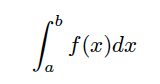
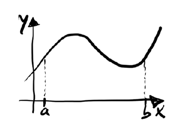
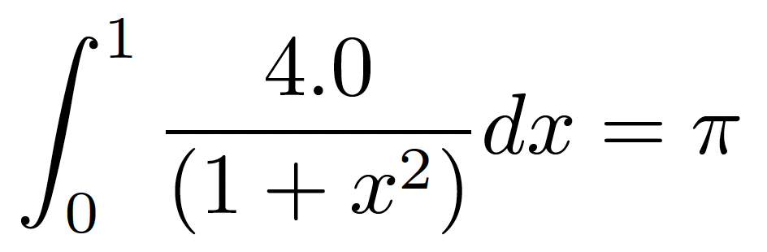
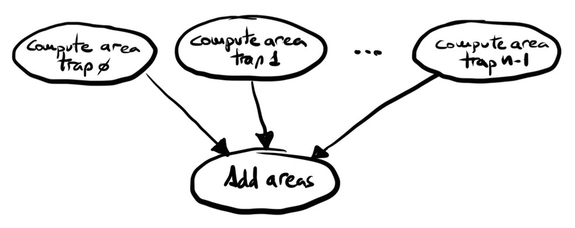
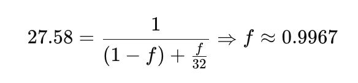

# 4. Launching and Structuring Parallel Programs 

* TOC
{:toc}

## Foundations of Parallel Execution on Supercomputers

To run parallel programs on a supercomputer, we need both a mechanism to launch them and a model to express parallelism. This section introduces the job launcher srun—used consistently throughout the book—and explains the motivation behind traditional parallel programming models like MPI. These foundations are essential for understanding how parallel workloads are executed efficiently at scale.

### How We Launch Parallel Jobs in This Book

Once SLURM allocates resources to a job, it does not dictate how those resources should be used. SLURM’s responsibility is limited to managing the reservation of compute nodes, CPUs, GPUs, and wall time. It is up to the user or the application to decide how to launch parallel execution within the allocated environment.

#### mpirun

There are several ways to launch parallel jobs in SLURM, depending on the type of parallelism, the execution framework used, and whether the job runs on a single node or across multiple nodes.

In the HPC community, mpirun is still widely used to launch MPI parallel scientific programs, particularly because it works in environments without a workload manager like SLURM. For this reason, we will retain its use in certain examples so that students become familiar with it and have the opportunity to use it in practice.

The mpirun command is used to launch parallel applications in an MPI environment. It starts multiple instances of the target program, typically one per process, across the available compute resources. For a multi-node run, mpirun determines the list of nodes where the application should execute and uses mechanisms like SSH (or equivalent methods) to remotely launch the program on each node. It ensures that all processes are started with the appropriate environment and communication setup, enabling them to work together as part of a distributed parallel execution.

Some MPI implementations also provide the mpiexec command, which is, in practice, usually synonymous with mpirun. In this book, we will refer exclusively to mpirun for simplicity, as both commands are functionally equivalent in most environments.

#### srun

However, when working within a SLURM-managed environment, the most appropriate and consistent method is to use SLURM’s native launcher, srun, tightly integrated with SLURM’s accounting and resource management infrastructure. In short,  srun performs the same role as mpirun when used inside a SLURM job, launching parallel tasks across the allocated nodes.

A basic  srun invocation follows the structure:

    srun [options] <executable> [arguments]

Useful argument options include --ntasks to specify the number of parallel tasks, --cpus-per-task to set the number of CPU cores per task (for multithreaded programs), and --nodes to define how many nodes to allocate. For example:

    srun -n4 -c8 ./my_app

This launches 4 parallel tasks of my_app, each using 8 CPU cores. The advantage of  srun lies in its automatic handling of environment variables, task distribution, and logging—all integrated with SLURM’s internal scheduling logic.

As we will see throughout the examples in this book, it is often unnecessary to specify additional arguments to  srun, since it automatically inherits the parameters defined by the *\#SBATCH* directives in the SLURM job script.

#### Parallel Job Launching Strategy in this Book

In this book, most parallel executions on MareNostrum 5 will use srun to launch the main execution step of the job. This approach ensures proper resource management, seamless integration with SLURM, and compatibility with both multi-GPU and multi-node workloads. However, we will include an example using mpirun to familiarize students with its usage.

However, some frameworks such as TensorFlow with *MirroredStrategy* do not require the use of srun. In this book, we will not use srun in such cases, since training is performed across multiple GPUs within a single node. TensorFlow automatically replicates the model on each available GPU (or on those explicitly specified).

Moreover, as we will see, all these Deep Learning frameworks benefit from being executed as containerized applications using Singularity, which was introduced in the previous chapter.

The table 4.1 provides a concise overview of how parallel programs are launched across different environments covered in this book. It serves as a high-level guide to the execution strategies associated with each programming model or framework, helping students establish a clear conceptual map before progressively exploring the technical details presented in later chapters.

<table style="width:80%;">
<colgroup>
<col style="width: 18%" />
<col style="width: 17%" />
<col style="width: 31%" />
<col style="width: 12%" />
</colgroup>
<thead>
<tr>
<th style="text-align: center;"><strong>Programming Model / Framework</strong></th>
<th style="text-align: center;"><strong>Parallelization Scope</strong></th>
<th style="text-align: center;"><strong>Launch Strategy Adopted in This Book</strong></th>
<th style="text-align: center;"><strong>Book Chapter</strong></th>
</tr>
</thead>
<tbody>
<tr>
<td style="text-align: center;">MPI</td>
<td style="text-align: left;">multi-node</td>
<td>
srun -n N ./my-mpi-app

mpirun -np N ./my-mpi-app
</td>
<td>Chapter 4</td>
</tr>
<tr>
<td style="text-align: center;">CUDA</td>
<td style="text-align: left;">single-GPU</td>
<td>srun ./my-cuda-app</td>
<td>Chapter 5</td>
</tr>
<tr>
<td style="text-align: center;">MPI + CUDA</td>
<td style="text-align: left;">
multi-node

multi-GPU
</td>
<td>mpirun -np N ./cuda-mpi-app</td>
<td>Chapter 6</td>
</tr>
<tr>
<td style="text-align: center;">TensorFlow (MirroredStrategy)</td>
<td style="text-align: left;">
single-node

multi-GPU
</td>
<td>singularity exec python script.py</td>
<td>Chapter 10</td>
</tr>
<tr>
<td style="text-align: center;">PyTorch (torchrun)</td>
<td style="text-align: left;">
multi-node,

multi-GPU
</td>
<td style="text-align: left;">srun singularity exec torchrun ...</td>
<td style="text-align: left;">
Chapter 11

Chapter 12

Chapter 15
</td>
</tr>
</tbody>
</table>

*Table 4.1 – Summary of Launch Methods by Programming Model and Corresponding Book Chapters.*

### Why Parallel Programming Models Matter

While we have seen how to launch parallel jobs, an equally important question remains: how do we define and structure the work so that it can be executed in parallel?

#### Divide to Conquer: The Origins of Parallel Programming

Supercomputing has always revolved around a fundamental idea: dividing the work to achieve more, in less time. Since the early days of supercomputing, this principle has driven the development of parallel programming models that specify how work is parallelized—models that have become deeply established in the HPC community, such as MPI for distributed-memory systems and OpenMP for shared-memory systems.

These programming models did not emerge arbitrarily; they were the result of decades of research and practical need to harness the computing power of emerging parallel architectures. In the early stages of HPC, supercomputers were built using clusters of processors that either shared memory or communicated over a network. Efficiently coordinating computations in these systems required abstractions that could express parallelism while hiding the low-level complexity of hardware communication and synchronization.

#### The Rise and Dominance of MPI

MPI  (Message Passing Interface), formalized in the 1990s, became the de facto standard for distributed-memory systems. It provided a portable, high performance model that allowed programs to scale across thousands of processors by explicitly managing communication between them.

This model shaped generations of supercomputing applications and was essential to the success of early simulations in physics, chemistry, climate modeling, and other scientific domains. Their dominance was also reflected in the hardware architectures of the time, which were largely homogeneous and CPU-based—designed with this programming paradigms in mind.

That is why we present it in detail in this chapter: not only has it been the dominant model in parallel programming for many years, but it also serves as a practical foundation for understanding and experimenting with how to harness the parallelism of supercomputers such as the MareNostrum series. In fact, MPI was already the main tool for extracting the full potential of MareNostrum 1 more than two decades ago. Long live MPI!

#### Transition to Heterogeneous Computing

In recent years, we have witnessed a major shift from traditional homogeneous compute nodes—based solely on general-purpose CPUs—to modern heterogeneous systems, where CPUs are augmented with specialized hardware accelerators such as GPUs. This transition is not only architectural but also deeply affects the way we program and optimize applications.

Programming models have expanded. It is no longer enough to understand how to distribute work across cores or nodes; we must now also know how to offload computations to GPU accelerators, manage memory hierarchies across devices, and coordinate execution in distributed GPU environments.

#### The Role of NCCL and Hybrid Models

While MPI remains a key technology for scientific applications and is still widely used in traditional HPC environments, in the context of neural network training, MPI has been largely replaced by specialized communication libraries such as NCCL (NVIDIA Collective Communication Library), which are optimized for modern hardware—especially GPUs—and high-speed interconnects such as Mellanox, used in systems like MareNostrum 5.

NCCL outperforms MPI in collective GPU operations, which are crucial for modern AI workloads, and enables highly efficient communication between GPUs—even across multiple nodes when supported by the hardware. For this reason, NCCL is the default backend used by PyTorch. We will introduce NCCL in the CUDA chapter.

#### Why MPI Still Matters

MPI remains useful in supercomputing environments where NCCL may not be available by default, or when using launchers like mpirun that are integrated into the supercomputing environment to manage traditional distributed jobs.

More importantly, MPI is still highly relevant in traditional scientific simulations, where workloads are distributed across compute nodes. Domains such as computational fluid dynamics, climate modeling, particle physics, astrophysics, and finite element methods continue to rely heavily on MPI. These applications often combine MPI for inter-node communication with CUDA for intra-node parallelism. For this reason, in this book we will introduce the MPI programming model and its integration with CUDA.

#### What About OpenMP?

While MPI remains useful in many supercomputing environments—including some dedicated to AI workloads—other traditional programming models, such as OpenMP (Open Multi-Processing), are still widely used in the broader HPC community, particularly for scientific simulations on shared-memory systems. OpenMP is a standardized API that enables parallelism in C, C++, and Fortran programs through compiler directives, runtime library routines, and environment variables. It is designed for multi-core CPU architectures, making it straightforward to parallelize loops, define parallel regions, and manage synchronization using a simple and incremental programming model.

Despite its relevance, OpenMP is generally absent from the software stacks used in large-scale AI applications, which typically run on distributed memory systems with GPU acceleration. As such, OpenMP will not be covered in this book. However, we mention it here because of its foundational role in traditional HPC applications, where it continues to serve as an important tool for exploiting on-node CPU parallelism efficiently.

## Getting Started with MPI

In a distributed-memory system, each process runs in its own address space and does not share memory with others. This architecture allows for excellent scalability, as each compute node brings its own memory, local storage, and bandwidth. As a result, distributed memory parallelism enables systems to grow by simply adding more nodes, with each processor able to rapidly access its local resources without interference from others.

However, this scalability comes at a cost. The programmer must manage many of the low-level details involved in inter-process communication. Shared data structures, commonly used in global memory models, can be difficult to map onto a distributed-memory system, where each process has a private memory space.

To enable cooperation among processes in such systems, explicit communication is required through the exchange of messages. Under this paradigm, one process must call a send function while another calls a corresponding receive function. The Message Passing Interface (MPI) provides a standardized and portable way to implement this communication. MPI is not a programming language, but rather a library of functions that can be called from C, C++, or Fortran. It is the *de facto* standard for writing high performance and portable parallel applications on distributed-memory architectures.

### MPI Hello World

Let us begin with a simple MPI program where each process prints its identity:

    #include <stdio.h>
    #include <mpi.h>

    int main (int argc, char **argv) {
            int rank, size;
            MPI_Init(NULL, NULL);
            MPI_Comm_rank(MPI_COMM_WORLD, &rank);
            MPI_Comm_size(MPI_COMM_WORLD, &size);

            printf("I am %d of %d\n", rank, size);

            MPI_Finalize();
            return 0;
    }

Before discussing the details, let’s compile and run this code with the Intel's MPI compiler mpiicx that combines the Intel C/C++ compiler (icx) with automatic support for MPI. In practice, mpiicx is a *wrapper*, meaning it internally invokes icx while automatically adding all the necessary flags to compile MPI programs, such as include paths and MPI libraries. It is part of the Intel oneAPI MPI toolkit:

    module load oneapi/2023.2.0

    mpiicx mpi_helloworld.c  -o mpi_helloworld

### mpirun Launcher

After compiling the MPI program using the mpiicx wrapper, as shown in the previous subsection, the next step is to launch the executable in a way that properly initiates and coordinates multiple parallel processes.

In many computing environments, the standard tool for launching MPI applications is called mpirun. This command is part of most MPI implementations—including Intel MPI, Open MPI, and MPICH—and serves to start multiple instances of the compiled binary, one for each MPI process. Internally, it manages process spawning, assigns unique identifiers (ranks) to each process, and establishes communication among them.

This tool is particularly useful in private clusters or local machines where no workload manager (like SLURM) is present. In such environments, mpirun is the most common and portable way to execute MPI applications.

Let us revisit the simple mpi_helloworld example. After compiling it with Intel’s MPI compiler we can launch the program using mpirun, specifying the number of processes (e.g., 4 GPUs availables in a login node of MN5):

    mpirun -np 4 ./mpi_helloworld

When executed, the following output is typically produced (in arbitrary order):

I am 2 of 4

I am 3 of 4

I am 0 of 4

I am 1 of 4

Each MPI process executes the same program independently, but with a different rank (from 0 to 3), which is obtained via MPI_Comm_rank. The total number of processes, retrieved via MPI_Comm_size, is also made available to each process. These two values are fundamental in writing parallel logic using MPI.

In this example, no SLURM or external job scheduler is used. The command mpirun -np 4 directly handles the parallel execution on the current node. This reflects a common use case in development environments, research labs with private clusters where full job scheduling infrastructure may not be available.

In next sections, we will compare this to launching MPI programs within SLURM-managed systems like MareNostrum 5 using srun, which integrates more tightly with resource scheduling and monitoring.

### srun Launcher

In SLURM-managed systems such as MareNostrum 5, the preferred method for launching parallel MPI applications is not mpirun, but rather SLURM’s native launcher: srun. This tool is tightly integrated with SLURM’s job scheduling, resource allocation, and accounting infrastructure. It is specifically designed to respect the resource constraints defined in a batch script and to coordinate the execution of tasks according to the system’s scheduler.

To illustrate this, let us revisit the same mpi_helloworld example introduced earlier. This time, however, we will execute it from within a SLURM batch script that launches the program twice: once with mpirun, and once with srun.

    #!/bin/bash
    #SBATCH -J mpi_helloworld
    #SBATCH -t 00:15
    #SBATCH -o %x_%J.out
    #SBATCH -e %xo_%J.err
    #SBATCH --ntasks=4 
    #SBATCH --cpus-per-task=1
    #SBATCH --exclusive
    #SBATCH --account <account>
    #SBATCH --qos gp_debug

    module load oneapi/2023.2.0

    echo "mpirun ./mpi_helloworld:"
    mpirun ./mpi_helloworld

    echo "srun ./mpi_helloworld"
    srun ./mpi_helloworld

When this script is submitted using sbatch, the following output is produced (the order of lines may vary):

mpirun ./mpi_helloworld:

I am 2 of 4

I am 1 of 4

I am 3 of 4

I am 0 of 4

srun ./mpi_helloworld

I am 3 of 4

I am 0 of 4

I am 2 of 4

I am 1 of 4

As we can see, the program has been executed twice—once using srun and once using mpirun—both of which are valid ways to launch MPI executions. Let us now analyze one of these runs.

What happens under the hood? Each MPI process executes the same code independently. As a result, each prints its rank, a unique identifier ranging from 0 to N-1, where N is the total number of processes. This information is provided by the MPI functions MPI_Comm_rank and MPI_Comm_size.

In this case, the SLURM directive \#SBATCH --ntasks=4 requests four parallel tasks from the scheduler. When using srun, SLURM ensures that exactly four MPI processes are launched, one per task, on the allocated nodes. The output confirms this behavior, showing four messages—each from a different rank—indicating that all processes have executed correctly.

It is important to note that the order in which the output lines appear is not guaranteed. Since all processes write to standard output asynchronously, the actual print order can vary from run to run. This is expected behavior in parallel execution and will be explored further in later sections.

From this point on, we will consistently use srun to launch MPI applications in SLURM-based environments, as it provides tighter integration with the scheduler, more consistent behavior, and fewer potential conflicts related to resource management. However, since mpirun remains widely used in research labs with private clusters—where job schedulers like SLURM may not be present—we include an example in Chapter 6 demonstrating how mpirun works seamlessly in such contexts. This ensures that students are exposed to both launch methods and understand their applicability in different environments.

>**Task 4.1 – Compile and run your first MPI program**
>
>Compile and execute the basic MPI Hello World example using the mpiicx compiler. Use the SLURM script provided to launch 4 MPI tasks. Examine the output and confirm that each process prints its rank and the total number of processes.

Continuing with srun as our launcher, a natural question arises: how are MPI processes distributed across multiple nodes? For example, if we want to run a job with a total of 16 MPI tasks distributed evenly across 4 nodes—4 tasks per node—we can achieve this using the following SLURM directives:

    #SBATCH --ntasks=16             # Total number of MPI tasks
    #SBATCH --nodes=4              # Number of nodes to allocate
    #SBATCH --ntasks-per-node=4    # Number of tasks per node

Let's examine the result using the following C code, which prints the host name of each process:

    #include <stdio.h>
    #include <mpi.h>
    #include <unistd.h> //  for gethostname

    int main (int argc, char **argv) {
     int rank, size;
     MPI_Init(NULL, NULL);
     MPI_Comm_rank(MPI_COMM_WORLD, &rank);
     MPI_Comm_size(MPI_COMM_WORLD, &size);

     char hostname[256];
     gethostname(hostname, sizeof(hostname));
     printf("I am %d of %d running on %s\n", rank, size, hostname);

     MPI_Finalize();
     return 0;
    }

We now need to compile the program on the login node:

    module load oneapi/2023.2.0
    mpiicx -o mpi_helloworld4x4 mpi_helloworld4x4.c 

The corresponding SLURM batch script to execute it is as follows:

    #!/bin/bash
    #SBATCH -J mpi_helloworld_4x4
    #SBATCH -t 00:15
    #SBATCH -o %x_%J.out
    #SBATCH -e %x_%J.err
    #SBATCH --ntasks=16            # Total number of MPI tasks
    #SBATCH --nodes=4              # Number of nodes to allocate
    #SBATCH --ntasks-per-node=4    # Number of tasks per node
    #SBATCH --cpus-per-task=1
    #SBATCH --exclusive
    #SBATCH --account <account>
    #SBATCH --qos gp_debug

    srun ./mpi_helloworld4x4

The output is:

I am 1 of 16 running on gs26r2b52

I am 2 of 16 running on gs26r2b52

I am 3 of 16 running on gs26r2b52

I am 0 of 16 running on gs26r2b52

I am 12 of 16 running on gs26r2b72

I am 4 of 16 running on gs26r2b62

I am 8 of 16 running on gs26r2b70

I am 5 of 16 running on gs26r2b62

I am 13 of 16 running on gs26r2b72

I am 6 of 16 running on gs26r2b62

I am 14 of 16 running on gs26r2b72

I am 7 of 16 running on gs26r2b62

I am 15 of 16 running on gs26r2b72

I am 9 of 16 running on gs26r2b70

I am 10 of 16 running on gs26r2b70

I am 11 of 16 running on gs26r2b70

By printing the host name of each process, we can verify that the processes were indeed distributed among four distinct nodes: gs26r2b52, gs26r2b62, gs26r2b70, and gs26r2b72. This not only confirms that SLURM respected our --ntasks-per-node=4 directive, but also gives students a concrete view of how tasks are physically mapped to nodes in a real HPC system.

>**Task 4.2 – Observe node distribution using hostnames**
>
>Modify the Hello World program to print the hostname ( gethostname()). Then, rerun the job with --ntasks=16 and --nodes=2 to distribute 16 MPI tasks over 2 nodes. Use --ntasks-per-node=8 to enforce the distribution. Verify by analyzing the standard output that the results are correct and that the execution took place across two different nodes, as expected. Run the program using both srun and mpirun.
>
>Note: As we have seen, both srun and mpirun are valid and functional options, each with its own specific characteristics.

### Key MPI Concepts

Without going too much into detail just yet, let’s take one step further beyond our initial Hello World example and introduce the foundational concepts behind any MPI program. These core ideas are essential to understanding how parallel programs communicate and coordinate their work in a distributed-memory environment.

#### SPMD Programming Model

MPI follows the Single Program, Multiple Data (SPMD) model. This means that all processes execute the same program, but each one may take a different control path depending on its unique identifier—called its rank.

In practice, this approach simplifies development and deployment: instead of compiling and running a different binary for each process, we compile a single program, and run it across multiple processes. These processes can then use conditionals (such as if statements) to behave differently based on their rank (normally process 0 performs a fundamentally different task than the other processes).

#### Initialization and Finalization

Every MPI program must begin and end with two crucial function calls:

    MPI_Init(NULL, NULL);      // Initializes the MPI environment
    MPI_Finalize();            // Cleans up MPI resources before exit

The call to MPI_Init performs all necessary setup to enable message passing and process coordination. Conversely, MPI_Finalize signals that the program is done using MPI, and resources can be released.

These two calls act as the entry and exit points of the MPI world. Any MPI-related function used outside this region is undefined behavior.

#### Communicators and Ranks

When a parallel MPI program starts, all participating processes are grouped into a default communicator called MPI_COMM_WORLD. This communicator is essentially a handle to a group of processes that can communicate with each other.

Each process within a communicator is assigned a unique rank, an integer ranging from 0 to size-1, where size is the total number of processes in the group.

The following two calls are typically made after MPI_Init:

    int rank, size;
    MPI_Comm_rank(MPI_COMM_WORLD, &rank);  // Gets the process's rank
    MPI_Comm_size(MPI_COMM_WORLD, &size);  // Gets the total number of processes

These two values allow each process to know how many other processes it can communicate with and decide what part of the work to do based on its rank.

#### Point-to-Point Communication

At the heart of MPI is the ability to send and receive messages between processes. The two most basic functions for this are:

    MPI_Send(...);   
    MPI_Recv(...);   

MPI_Send(...) is used to send data from one process to another and MPI_Recv(...) is used to receive data that another process has sent. Both functions must agree on the amount and type of data, as well as the source and destination ranks. For communication to succeed, there must be a matching pair: a send issued by one process and a corresponding receive issued by the other. Message matching in MPI is strict: for a message to be received, there must be a matching send with the same communicator, tag, and sender/receiver ranks. If a MPI_Recv is posted but no matching MPI_Send exists, the receiving process will block indefinitely.

#### Example: Basic Point-to-Point Communication

Let’s look at a simple example that illustrates point-to-point communication using MPI_Send and MPI_Recv. The code uses stdio.h, string.h and need to add mpi.h header file, that contains prototypes of MPI functions, macro definitions, type definitions, etc, for compiling a MPI program.

    #include <stdio.h>
    #include <string.h>
    #include <mpi.h>

    int main(int argc, char* argv[]) {
        int rank, size;
        char message[100];

        MPI_Init(&argc, &argv);
        MPI_Comm_rank(MPI_COMM_WORLD, &rank);
        MPI_Comm_size(MPI_COMM_WORLD, &size);

        if (rank != 0) {
            // All processes except 0 send a message to process 0
            sprintf(message, "Greetings from process %d!", rank);
            MPI_Send(message, strlen(message) + 1, MPI_CHAR, 0, 0, MPI_COMM_WORLD);
        } else {
            // Process 0 receives messages from all other processes
            for (int source = 1; source < size; source++) {
                MPI_Recv(message, 100, MPI_CHAR, source, 0, MPI_COMM_WORLD, MPI_STATUS_IGNORE);
                printf("Process 0 received: %s\n", message);
            }
        }

        MPI_Finalize();
        return 0;
    }

If we run the program with 8 tasks specified in the corresponding SLURM flag, we get the following output:

Process 0 received: Greetings from process 1!

Process 0 received: Greetings from process 2!

Process 0 received: Greetings from process 3!

Process 0 received: Greetings from process 4!

Process 0 received: Greetings from process 5!

Process 0 received: Greetings from process 6!

Process 0 received: Greetings from process 7!

What happens here?

- Each non-zero process constructs a greeting message and sends it to process 0.

- Process 0 enters a loop and receives one message from each of the other processes in order, because the source argument in the MPI_Recv call explicitly specifies which rank the message is expected from. As a result, due to MPI_Rcv always blocks until a matching message is received, messages are received sequentially in increasing rank order.

- All MPI_Send and MPI_Recv operations use the default communicator MPI_COMM_WORLD, meaning that all communication takes place within the group of all processes launched in the MPI job.

The courses supported by this book do not go into further detail on topics such as the specific arguments of MPI function calls. Readers interested in a deeper understanding can refer to the official documentation provided by the MPI Forum[^1] or the Open MPI[^2] project.

>**Task 4.3 – Point-to-point communication**
>
>Compile and run the MPI program using MPI_Send and MPI_Recv where all worker processes send a greeting to process 0. Create 16 tasks. Confirm that process 0 receives the messages in rank order.

## Case Study: Parallelizing the Trapezoidal Rule Example

To illustrate how MPI can be used for real computation, we present a parallel version of the trapezoidal rule, a well-known method for approximating definite integrals[^3]:

The trapezoidal rule works by approximating the area under the graph of the function *f(x)*, bounded by the curve itself, two vertical lines at *x = a* and *x = b*, and the x-axis, as illustrated in Figure 4.1.

*Figure 4.1 – The area under the curve to be estimated.*

The basic idea is to divide the interval on the x-axis into n equal subintervals as shown in Figure 4.2.

*Figure 4.2 – The approximation of the area using trapezoids.*

Then we can approximate the area lying between the graph and each subinterval by a trapezoid whose base is the subinterval. Without going into the details of the mathematical formulation[^4], the pseudo-code that perform this computation might look as follows:

    /* Input: a, b, n */
    h = (b - a)/n;
    approx = (f(a) + f(b))/2.0;
    for (i = 0; i \<= n - 1; i++) {
    x_i = a + i \* h;
    approx += f(x_i);
    }
    approx = h \* approx;

### Serial Implementation

As an example, let us begin with a sequential version of the algorithm to estimate the value of π using the trapezoidal rule. We approximate:

This is a classical integral known to converge to the value of π. Below is the C implementation:

    #include <stdio.h>

    double f(double x) {
        return 4.0 / (1.0 + x * x);
    }

    double trapezoidal_rule(double a, double b, int n) {
        double h = (b - a) / n;
        double sum = (f(a) + f(b)) / 2.0;

        for (int i = 1; i < n; i++) {
            sum += f(a + i * h);
        }

        return sum * h;
    }

    int main() {
        int n = 1000000;
        double a = 0.0, b = 1.0;
        double pi = trapezoidal_rule(a, b, n);
        printf("Estimated PI = %.16f\n", pi);
        return 0;
    }

If we compile and run the program, we obtain the following result:

    $ module load intel
    $ icx -O3 pi_seq.c -o pi_seq
    $ ./pi_seq

Estimated PI = 3.1415926535895844

>**Task 4.4 – Write and Run The Sequential Program That Estimate π**
>
>Use a standard C compiler and verify that the estimated value of π is printed to the terminal.
>
>This simple test ensures that your code is working before proceeding to the parallel MPI version.

### MPI Parallel Version

Now let us move on to the parallel version of the trapezoidal rule algorithm. To parallelize the computation, we begin by partitioning the problem into independent tasks , following the approach previously described. Each process will be responsible for computing the area corresponding to a subset of the total trapezoids.

Typically, each process performs its computation independently, and then a designated process (usually process 0) gathers the partial results and sums them to obtain the final estimate of the integral.

This approach follows a classic parallel reduction pattern: distribute the work, perform local computation in parallel, and then combine the results through a reduction operation. The communication involved is straightforward—each process sends its local result to the root process, which aggregates the values to produce the final output (Figure 4.3).

Since the number of trapezoids n is typically much larger than the number of processes (as increasing n improves the accuracy of the estimate), we divide the interval \[a, b\] evenly into p subintervals, where p is the number of processes. Each process is then responsible for computing the area under n/p trapezoids.

*Figure 4.3 – Task division and communication flow of the parallel version.*

#### MPI Parallel Implementation 

We now implement this using MPI, where each process computes a partial result over its subinterval:

    #include <stdio.h>
    #include <mpi.h>

    double f(double x) {
        return 4.0 / (1.0 + x * x);
    }

    double local_trap(double a, double b, int local_n) {
        double h = (b - a) / local_n;
        double sum = (f(a) + f(b)) / 2.0;

        for (int i = 1; i < local_n; i++) {
            sum += f(a + i * h);
        }

        return sum * h;
    }

    int main(int argc, char** argv) {
        int rank, size, n;
        double a = 0.0, b = 1.0;
        double local_a, local_b, h;
        int local_n;
        double local_result, total_result;

        MPI_Init(&argc, &argv);
        MPI_Comm_rank(MPI_COMM_WORLD, &rank);
        MPI_Comm_size(MPI_COMM_WORLD, &size);

        // Ensuring that n is divisible by the number of MPI processes
        n = 1000000;
        n = (n / size) * size; 

        h = (b - a) / n;
        local_n = n / size;
        local_a = a + rank * local_n * h;
        local_b = local_a + local_n * h;

        local_result = local_trap(local_a, local_b, local_n);

        if (rank == 0) {
            total_result = local_result;
            for (int source = 1; source < size; source++) {
                double temp;
                MPI_Recv(&temp, 1, MPI_DOUBLE, source, 0, MPI_COMM_WORLD, MPI_STATUS_IGNORE);
                total_result += temp;
            }
            printf("Estimated PI = %.16f\n", total_result);
        } else {
            MPI_Send(&local_result, 1, MPI_DOUBLE, 0, 0, MPI_COMM_WORLD);
        }

        MPI_Finalize();
        return 0;
    } 

#### And we compile it as follows: 

    module load oneapi/2023.2.0
    mpiicx pi_mpi.c -o pi_mpi

#### SLURM Job Script 

For this example, the corresponding SLURM batch script that we couls use is as follows:

    #!/bin/bash
    #SBATCH --job-name=pi_mpi
    #SBATCH --output=%x_%j.out
    #SBATCH --error=%x_%j.err
    #SBATCH --ntasks=8
    #SBATCH --cpus-per-task=1
    #SBATCH --time=00:05:00
    #SBATCH --exclusive
    #SBATCH --account=<account>
    #SBATCH --qos=gp_debug

    srun ./pi_mpi

>**Task 4.5 – Write and Run the Parallel MPI Code to Estimate the Value of π**
>
>Execute the parallel version using 16 processes with SLURM, and verify that the estimated value of π is correct, as this will serve as the basis for the following tasks.

#### Result Analysis

Now that we have the parallel version of the algorithm and we know how to measure execution time using the gettimeofday system call, we can analyze how the algorithm behaves with different amounts of resources—in other words, we ask ourselves: how does it scale with varying numbers of parallel processes?

All the code required to perform this experiment is available in the book’s GitHub repository under the file pi_mpi_scaling.slurm, which is also listed below.

We take this opportunity to illustrate how, by using optional arguments of srun, it is possible to reduce the number of resources effectively used, even if more have been allocated to the job. Of course, in the case of long-running executions, this would be considered bad practice, as it would lead to resource underutilization and waste.

This SLURM script requests 64 CPU cores and performs multiple executions within the same job, each using a different number of MPI processes. This setup allows us to systematically evaluate the scalability of the parallel implementation.

#### Compile it as follows: 

    module load oneapi/2023.2.0

    icx -O3 pi_seq_timed.c -o pi_seq_timed
    mpiicx -O3 pi_mpi_timed.c -o pi_mpi_timed

And the SLURM script:

    #!/bin/bash
    #SBATCH --job-name=pi_scaling
    #SBATCH --output=%x_%j.out
    #SBATCH --error=%x_%j.err
    #SBATCH --ntasks=64     
    #SBATCH --cpus-per-task=1
    #SBATCH --time=00:15:00
    #SBATCH --exclusive
    #SBATCH --account=<account>
    #SBATCH --qos=gp_debug

    ./pi_seq_timed

    for P in 2 4 8 16 32 64
    do
      echo ""
      srun --ntasks=$P ./pi_mpi_timed
    done

The files pi_mpi_timed.c and pi_seq_timed.c are the same as the previous versions, but now include the necessary code to measure execution time using the gettimeofday system call.

If we examine the results, we can clearly see that the parallel version provides significant performance improvements as the number of processes increases. The results are summarized in the Table 4.2.

We can observe that up to 32 processes, the efficiency remains reasonable; however, beyond that point, it drops significantly. In fact, the execution time with 64 processes is even higher than with 32, indicating diminishing returns. This raises the question: is the program's limited parallelism the cause?

*Note: For illustrative purposes, we have shown results from a single execution. However, keep in mind that execution times may vary between runs due to factors such as system load or hardware noise. In real performance studies, it is good practice to perform multiple runs and report average values.*

| **Processes** | **Time (ms)** | **Speedup** | **Efficiency (%)** |
|:-------------:|:-------------:|:-----------:|:------------------:|
|      seq      |    4430.33    |    1.00     |       100.0%       |
|       2       |    2394.17    |    1.85     |       92.4%        |
|       4       |    1198.30    |    3.70     |       92.6%        |
|       8       |    601.04     |    7.37     |       92.1%        |
|      16       |    308.02     |    14.38    |       89.9%        |
|      32       |    160.61     |    27.58    |       86.2%        |
|      64       |    216.27     |    20.49    |       32.0%        |

*Table 4.2 – Execution time, speedup, and parallel efficiency of the trapezoidal rule algorithm for different numbers of processes.*

#### Amdahl’s Law

What does Amdahl’s Law tell us in this case? Taking the best observed case (with 32 processes and a measured speedup of 27.58), we can apply the formula to estimate the serial fraction of the code. By rearranging Amdahl’s Law:

The calculation reveals that 99.67% of the program is parallelizable, which aligns with what we intuitively expected. The remaining 0.33% is sequential, and according to Amdahl’s Law, this limits the theoretical maximum speedup to 1 / 0.0033 ≈ 303×. In practice, however, performance saturates much earlier due to communication overhead or resource contention. A deeper analysis using profiling tools would be necessary to understand the exact reasons behind this behavior, but that is beyond the scope of this course.

#### Gustafson’s Law

Continuing with the example, let us now explore what we can infer by applying Gustafson’s Law, which states that if we increase the problem size proportionally with the number of processes, we should achieve better scalability. To test this, we can evaluate how performance behaves when the problem size grows according to the formula n = 2³² × P.

The code, an MPI implementation where *n* is proportional to the number of processes, is shown below:

    #include <stdio.h>
    #include <sys/time.h>
    #include <mpi.h>
    #include <stdint.h>

    double f(double x) {
        return 4.0 / (1.0 + x * x);
    }

    double local_trap(double a, double b, uint64_t local_n) {
        double h = (b - a) / local_n;
        double sum = (f(a) + f(b)) / 2.0;
        for (uint64_t i = 1; i < local_n; i++) {
            sum += f(a + i * h);
        }
        return sum * h;
    }

    int main(int argc, char** argv) {
        int rank, size;
        struct timeval start, end;

        MPI_Init(&argc, &argv);
        MPI_Comm_rank(MPI_COMM_WORLD, &rank);
        MPI_Comm_size(MPI_COMM_WORLD, &size);

        uint64_t base_n = 4294967296ULL; // 2^32
        uint64_t n = base_n * size;

        double a = 0.0, b = 1.0;
        double local_a, local_b, h;
        uint64_t local_n = n / size;
        double local_result, total_result;

        h = (b - a) / n;
        local_a = a + rank * local_n * h;
        local_b = local_a + local_n * h;

        if (rank == 0) gettimeofday(&start, NULL);

        local_result = local_trap(local_a, local_b, local_n);

        if (rank == 0) {
            total_result = local_result;
            for (int source = 1; source < size; source++) {
                double temp;
                MPI_Recv(&temp, 1, MPI_DOUBLE, source, 0, MPI_COMM_WORLD, MPI_STATUS_IGNORE);
                total_result += temp;
            }
            gettimeofday(&end, NULL);
            double elapsed = (end.tv_sec - start.tv_sec) * 1000.0 +
                             (end.tv_usec - start.tv_usec) / 1000.0;
            printf("Estimated PI = %.16f\n", total_result);
            printf("Parallel execution time with %d processes and n = %llu: %.2f ms\n", 
                    size, n, elapsed);
        } else {
            MPI_Send(&local_result, 1, MPI_DOUBLE, 0, 0, MPI_COMM_WORLD);
        }

        MPI_Finalize();
        return 0;
    }

Let us focus on the highlighted part, where the base value is multiplied by the variable size, which precisely indicates the number of parallel processes involved in the current execution.

After compiling it using the following commands:

    module load oneapi/2023.2.0
    mpiicx -O3 pi_mpi_scaled_n.c -o pi_mpi_scaled_n

The experiments can be launched using the following SLURM batch script:

    #!/bin/bash
    #SBATCH --job-name=pi_scaling_variable_n
    #SBATCH --output=%x_%j.out
    #SBATCH --error=%x_%j.err
    #SBATCH --ntasks=64
    #SBATCH --cpus-per-task=1
    #SBATCH --time=00:30:00
    #SBATCH --exclusive
    #SBATCH --account=<account>
    #SBATCH --qos=gp_debug

    for P in 2 4 8 16 32 64
    do
      echo ""
      echo "=== RUNNING WITH $P PROCESSES ==="
      srun --ntasks=$P ./pi_mpi_scaled_n
    done

The results obtained from the execution are summarized in the table 4.3.

Based on the results shown, we observe that the execution time remains approximately constant while the total amount of work increases proportionally to the number of processes. This behavior aligns with the central hypothesis of Gustafson’s Law: *If we increase the problem size with the number of processors, we can obtain linear speedup while maintaining constant wall-clock time.*

| **Processes** |     **n**      | **Time (ms)** |
|:-------------:|:--------------:|:-------------:|
|       2       | 233 |    4221.51    |
|       4       | 234 |    4217.39    |
|       8       | 235 |    4215.08    |
|      16       | 236 |    4217.19    |
|      32       | 237 |    4216.99    |
|      64       | 238 |    4219.10    |

*Table 4.3 – Execution time (in milliseconds) of the parallel trapezoidal rule algorithm for estimating π with increasing numbers of MPI processes.*

This experiment serves as a clear illustration of why Gustafson proposed an alternative perspective to Amdahl’s Law—one that is often more realistic in scientific computing scenarios where the workload grows with the available computational resources. This is precisely what has happened in the field of artificial intelligence, where increased computational capacity has enabled the training of increasingly larger models.

Additionally, we observe that the estimation of π remains numerically stable across all configurations, and in fact, slightly improves as the value of n increases.

>**Task 4.6 – Analysis using Gustafson’s Law to estimate the value of π**
>
>Run the parallel version of the program that estimates the value of π using up to 128 processes, and analyze the results according to Gustafson’s Law, following the same methodology presented earlier in this chapter.

### Handling I/O in MPI Programs

An important and often overlooked aspect of MPI programming is how input and output (I/O) are handled in parallel applications.

Standard output (stdout) is accessible by all processes. This means that if multiple processes write to stdout at the same time (e.g., via printf), the output may appear interleaved or unordered.

Standard input (stdin), on the other hand, is typically restricted to process 0. Most MPI implementations do not support reading input from multiple processes simultaneously.

For example, if the value of n were provided interactively by the user, we would need to distribute it manually using point-to-point communication:

    void get_input(int* n_p, int my_rank, int comm_sz) {
        if (my_rank == 0) {
            printf("Enter number of intervals: ");
            scanf("%d", n_p);

            for (int dest = 1; dest < comm_sz; dest++) {
                MPI_Send(n_p, 1, MPI_INT, dest, 0, MPI_COMM_WORLD);
            }
        } else {
            MPI_Recv(n_p, 1, MPI_INT, 0, 0, MPI_COMM_WORLD, MPI_STATUS_IGNORE);
        }
    }

This simple function ensures that all processes receive the same input value, regardless of the fact that only process 0 actually performs the scanf call. Fortunately, this code can be simplified using the MPI_Bcast call, which makes the implementation clearer. We will discuss this in the following section.

### Barrier Synchronization

In parallel programming, sometimes it is necessary to ensure that all processes reach a certain point in the execution before any of them can proceed. For instance, if you want to measure the duration of a particular operation or algorithm in parallel, it is crucial to ensure that all processes start and end the timing region at the same time. This kind of global synchronization is known as a barrier, and MPI provides a simple but effective function to implement it:

    int MPI_Barrier(MPI_Comm comm);

When a process calls MPI_Barrier, it blocks until all processes in the specified communicator have also called the same function. Only once every process has reached the barrier does the program continue beyond that point. This makes MPI_Barrier an essential tool for coordinating different phases of a parallel computation.

Placing a barrier before and after the timed section help eliminate discrepancies caused by unsynchronized starts or ends, yielding more accurate and meaningful performance data. Although barriers are useful, they should be used with care. Overusing them can reduce performance by forcing idle waiting.

## Collective Communication Primitives

While point-to-point communication provides fine-grained control over message exchanges, many parallel algorithms involve global communication patterns that are difficult to express using only MPI_Send and MPI_Recv. To address this, MPI provides a rich set of collective operations that not only simplify programming and code maintenance, but are also highly optimized in most implementations. This is precisely the goal of MPI collective operations: to simplify and optimize communication patterns that are common in parallel programming.

Collective operations in MPI are designed such that all processes within a communicator participate. These operations must be called by all processes in the communicator; otherwise, the program may deadlock or crash.

Let us now review the most important collective operations. As we will see later on, these communication patterns have also inspired the design of libraries such as NCCL.

### Broadcast

As we saw earlier, when process 0 reads the number of intervals as input, it must send it to all other processes, since they do not have access to standard input. For this purpose, MPI provides a convenient collective operation:

    int MPI_Bcast(void *buffer, int count, MPI_Datatype datatype, int root, MPI_Comm comm);

The MPI_Bcast function broadcasts data from one process (the root) to all other processes in the communicator. Here is the same get_input function we discussed earlier, now rewritten using MPI_Bcast:

    void get_input(int* n_p, int my_rank) {
        if (my_rank == 0) {
            printf("Enter number of intervals: ");
            scanf("%d", n_p);
        }
        MPI_Bcast(n_p, 1, MPI_INT, 0, MPI_COMM_WORLD);
    }

This approach is both more elegant and more efficient than using multiple MPI_Send and MPI_Recv calls.

### Reduction Operations

Let us now revisit the idea of computing a global sum of partial results produced by each process in the previous example. Previously, we implemented this manually using explicit point-to-point communication. Let us revisit the piece of code that performed this reduction:

    if (rank == 0) {
        total_result = local_result;
        for (int source = 1; source < size; source++) {
            double temp;
            MPI_Recv(&temp, 1, MPI_DOUBLE, source, 0, MPI_COMM_WORLD, MPI_STATUS_IGNORE);
            total_result += temp;
        }
    } else {
        MPI_Send(&local_result, 1, MPI_DOUBLE, 0, 0, MPI_COMM_WORLD);
    }

This code works, but it can be replaced by a much simpler and more efficient collective call:

    MPI_Reduce(&local_result, &total_result, 1, MPI_DOUBLE, MPI_SUM, 0, MPI_COMM_WORLD);

The function MPI_Reduce combines values from all processes using a specified operation (such as MPI_SUM, MPI_MAX, or MPI_MIN) and returns the result to a designated root process.

If instead we want all processes to receive the final result, we can use:

    MPI_Allreduce(&local_result, &total_result, 1, MPI_DOUBLE, MPI_SUM, MPI_COMM_WORLD);

This version performs the same reduction but distributes the result to every process, not just the root.

After understanding MPI_Bcast, MPI_Reduce, and MPI_Allreduce, we are ready to explore more advanced collective communication patterns. These operations are essential in parallel applications that require data distribution, result aggregation.

### Scatter and Gather

#### MPI_Scatter

In many parallel applications, it is common to divide a large dataset among multiple processes, allow each process to work independently on its portion, and then collect the results. MPI provides two collective operations that are ideal for this pattern: MPI_Scatter and MPI_Gather.

The MPI_Scatter function is used to distribute data from one process (typically the root) to all other processes in the communicator. Conceptually, it splits a buffer on the root process into equally sized chunks and sends each chunk to a different process, including itself. The function has the following signature:

    int MPI_Scatter(const void *sendbuf, int sendcount, MPI_Datatype sendtype,
                    void *recvbuf, int recvcount, MPI_Datatype recvtype,
                    int root, MPI_Comm comm);

In a typical use case, such as dividing a large array into smaller segments, only the root process needs to provide a valid sendbuf containing the full dataset. Each process, including the root, will receive a portion of this data in its recvbuf. This operation is particularly useful for tasks such as distributing image tiles, rows of a matrix, or segments of a vector.

Once each process has completed its part of the computation, we often want to collect the results into a single array on the root process. For this, MPI offers the complementary operation MPI_Gather, which assembles data from all processes into a buffer on the root. Its function signature is:

    int MPI_Gather(const void *sendbuf, int sendcount, MPI_Datatype sendtype,
                   void *recvbuf, int recvcount, MPI_Datatype recvtype,
                   int root, MPI_Comm comm);

Each process sends data from its sendbuf, and the root process collects all these pieces into its recvbuf, forming a single aggregated result. As with MPI_Scatter, only the root process needs to allocate and initialize the receive buffer.

To illustrate how these two operations work together in a typical data-parallel workflow, we include in the book’s GitHub repository an example program that performs a parallel vector sum. In this example, a vector is distributed from the root process to all others using MPI_Scatter. Each process increments its local elements by one. Finally, the updated data is gathered back on the root process using MPI_Gather.

The corresponding SLURM job script is also provided so the example can be executed directly in a cluster environment. This simple yet representative program demonstrates the power and clarity that collective communication primitives bring to parallel programming with MPI.

>**Task 4.7 – Experimenting with Scatter and Gather**
>
>Take the example provided in the book’s GitHub repository and run it. Once you have verified that it executes correctly, modify the code to test different vector sizes. Analyze how the size of the vector influences the program’s speedup, efficiency, and scalability.

### Advanced Patterns

Beyond the basic collective operations, MPI offers more advanced communication patterns that combine the functionality of simpler routines into a single call. These operations are highly useful in more complex parallel algorithms where data needs to be both shared and reorganized efficiently among all processes. Let us examine three particularly powerful operations: MPI_Allgather, MPI_Alltoall, and MPI_Reduce_scatter.

The MPI_Allgather function allows all processes to gather contributions from every other process, so that each one ends up with the complete dataset. It can be viewed as a combination of MPI_Gather followed by a broadcast, but performed in a single collective call and without centralizing the data at the root. Its prototype is:

    int MPI_Allgather(const void *sendbuf, int sendcount, MPI_Datatype sendtype,
                      void *recvbuf, int recvcount, MPI_Datatype recvtype,
                      MPI_Comm comm);

A typical use case for MPI_Allgather arises when each process holds a distinct portion of data that must be made available to all others. For example, if each process computes local statistics or intermediate values and all processes need access to the complete set for further computation, MPI_Allgather provides a clean and efficient solution.

For more general data exchange scenarios, MPI provides MPI_Alltoall, where every process sends a distinct message to each other process and also receives one from each. This results in a complete data exchange pattern where the output of each process may depend on inputs from all others. Its function signature is:

    int MPI_Alltoall(const void *sendbuf, int sendcount, MPI_Datatype sendtype,
                     void *recvbuf, int recvcount, MPI_Datatype recvtype,
                     MPI_Comm comm);

This operation is essential in algorithms that require global data reshuffling, such as parallel sorting, domain decomposition in simulations, or transposing a matrix distributed by rows. Because of its flexibility, MPI_Alltoall is considered the most general redistribution primitive in MPI, and it is heavily optimized in most implementations.

Finally, the MPI_Reduce_scatter function combines two operations in one: it first performs a global reduction across all processes and then distributes distinct segments of the reduced result back to them. This is particularly efficient when each process only needs a part of the global result, eliminating the need for a separate MPI_Reduce followed by a MPI_Scatter. The function is declared as:

    int MPI_Reduce_scatter(const void *sendbuf, void *recvbuf, const int *recvcounts,
                           MPI_Datatype datatype, MPI_Op op, MPI_Comm comm);

This operation is useful in algorithms such as distributed dot products, where each process contributes partial sums and only needs its share of the final result. It is also effective in large-scale simulations where localized data needs to be extracted from a globally aggregated computation.

Each of these advanced patterns illustrates how MPI provides high-level communication tools that match the needs of scalable parallel applications. These primitives not only reduce code complexity but also take advantage of optimized implementations under the hood to improve performance and scalability.

In summary, collective communication operations in MPI greatly simplify common patterns of data movement and synchronization. Using them instead of point-to-point communication enhances performance, improves code readability, and increases portability. While a deeper exploration of all available collective routines is beyond the scope of the courses supported by this book, the reader now has a solid foundation to continue learning independently. As previously noted, those interested in further details are encouraged to consult the official documentation provided by the MPI Forum[^5] or the Open MPI[^6] project.

## All-Reduce as a Fundamental Pattern in Distributed DL

In the previous sections of this chapter, we introduced collective communication primitives—such as broadcast, reduction, scatter, and gather—as core abstractions provided by MPI for coordinating parallel processes. At this point, these primitives may appear as general-purpose tools for parallel programming, applicable to a wide range of scientific and engineering applications.

In this section, we deliberately move one step ahead of the narrative of this book. We introduce the All-Reduce operation as a *fundamental communication pattern* that will play a central role in later chapters, particularly those devoted to distributed deep learning. While the full relevance of this pattern may not become entirely clear until we study distributed training frameworks in detail, this is the appropriate place to establish its conceptual foundations.

### From Collective Primitives to a Dominant Pattern

Conceptually, an All-Reduce operation can be understood as the composition of two collective primitives already discussed.

1.  A *reduction*, in which values distributed across multiple processes are combined using an associative operation (such as sum or average).

2.  A *broadcast*, in which the result of the reduction is made available to all participating processes.

Figure 4.4 provides a schematic view of this decomposition, illustrating how an All-Reduce operation can be understood as a reduction phase followed by a broadcast phase. The figure emphasizes the semantic outcome of the operation: although the data is initially distributed across processes, the final reduced value becomes identical and locally available on all participating processes.

*Figure 4.4 – All-Reduce as a composition of collective operations. Conceptual illustration showing that the semantic All-Reduce operation is equivalent to a reduction followed by a broadcast, independently of the underlying implementation strategy.*

Unlike a simple reduction, where only a designated root process receives the final result, an All-Reduce ensures that *every process obtains the reduced value*. This seemingly small distinction has profound implications for parallel algorithms and, as we will see, for the scalability of modern machine learning workloads.

At the level of MPI, All-Reduce is exposed as a standard collective operation. However, it is important to emphasize that *All-Reduce should be viewed primarily as a communication pattern rather than as a specific API call or implementation*. Different libraries and runtimes may implement this pattern using different algorithms—such as ring-based, tree-based, or hierarchical strategies—but the underlying semantic intent remains the same.

### Why All-Reduce Matters for Deep Learning

The relevance of All-Reduce becomes apparent when considering *data model parallel training* of neural networks (introduced in Chapter 10). In this paradigm, multiple replicas of the same model are trained in parallel, each processing a different subset of the input data. After each training step, all replicas must agree on a consistent set of model parameters before proceeding to the next iteration.

This synchronization step is typically achieved by aggregating gradients computed independently by each replica. Each process contributes its local gradients, these gradients are combined (usually via summation or averaging), and the resulting aggregated gradients are redistributed to all processes. This is precisely the semantic behavior of an All-Reduce operation.

As a result, *gradient aggregation in data model parallel training is an instance of the All-Reduce communication pattern*. This observation allows us to reason about distributed deep learning training using the same conceptual tools developed for parallel programming, bridging the gap between traditional HPC models and modern machine learning systems.

### Cost, Scalability, and Performance Implications

Although All-Reduce is conceptually simple, its performance characteristics often determine the scalability limits of distributed training. As the number of processes or devices increases, the cost of communication can grow to dominate the overall execution time, even when computation scales efficiently.

Several factors influence the performance of All-Reduce operations:

- *Message size*, which in deep learning corresponds to the total size of model gradients.

- *Interconnect bandwidth and latency*, particularly critical when operating across multiple GPUs or nodes.

- *Algorithmic strategy*, such as ring-based versus tree-based reductions.

- *Overlap of communication and computation*, which can partially hide communication costs but is not always achievable.

Because All-Reduce is invoked repeatedly—often once per training iteration—it becomes a first-order performance concern rather than a secondary optimization. In large-scale training scenarios, inefficient All-Reduce implementations can severely limit parallel efficiency and lead to diminishing returns when adding more computational resources.

### From MPI to Specialized Communication Libraries

While MPI provides a portable and expressive interface for collective communication, deep learning workloads have driven the development of specialized communication libraries optimized for accelerator-based systems. In later chapters, we will study how libraries such as NCCL implement highly optimized versions of All-Reduce tailored to GPU architectures and high-bandwidth interconnects.

Importantly, these libraries do not introduce new communication semantics; instead, they provide *hardware-aware implementations of the same All-Reduce pattern* introduced here. Understanding All-Reduce at this abstract level therefore enables a smoother transition from MPI-based reasoning to modern deep learning frameworks.

#### Looking Ahead

Throughout the remainder of this book, All-Reduce will repeatedly reappear under different guises: as a primitive in communication libraries, as a core operation in distributed training frameworks, and as a key factor in scalability analysis. By establishing it here as a fundamental communication pattern, we aim to provide a unifying conceptual thread that connects parallel programming models with large-scale machine learning systems.

Readers are encouraged to keep this abstraction in mind as we move forward. While implementations, APIs, and hardware platforms may change, the underlying communication patterns—and their performance implications—remain remarkably consistent.

## Key Takeaways from Chapter 4 

- Parallel execution on supercomputers requires both a programming model to express parallelism (such as MPI) and a mechanism to launch computations (such as srun). This chapter established the conceptual and practical foundations needed to execute parallel applications efficiently in HPC environments.

- SLURM handles the allocation of computing resources, but it is up to the user or application to initiate parallel execution. While mpirun remains common in private clusters or legacy systems, srun is the recommended and consistent launcher on supercomputers like MareNostrum 5.

- Throughout this book, we adopt srun to launch all parallel programs—whether using MPI, CUDA, or high-level frameworks such as PyTorch and TensorFlow. This ensures consistent integration with SLURM for resource mapping, scheduling, and traceability.

- MPI (Message Passing Interface) is the dominant programming model for distributed-memory systems. It supports explicit communication between processes and follows the SPMD paradigm, in which each process runs the same program but may follow different control paths depending on its rank.

- You implemented and executed several MPI programs—from a basic "Hello World" to a parallel approximation of π using the trapezoidal rule—gaining hands-on experience with communication and synchronization.

- You analyzed performance results using both Amdahl’s Law and Gustafson’s Law, gaining insight into the theoretical and practical limits of scalability, speedup, and parallel efficiency in real-world applications.

- You learned about collective communication primitives such as MPI_Bcast, MPI_Reduce, MPI_Gather, and MPI_Scatter, which simplify common parallel patterns and are optimized for performance. You also encountered more advanced collectives like MPI_Allgather, MPI_Alltoall, and MPI_Reduce_scatter that support scalable communication needs.

- You were introduced to the All-Reduce operation as a fundamental communication pattern, which plays a central role in data-parallel deep learning by enabling gradient aggregation and strongly influencing the scalability and performance of distributed training workloads.

- You explored how MPI applications handle standard I/O, synchronization (e.g., with MPI_Barrier), and typical communication patterns—key aspects for writing correct and efficient distributed-memory programs.

- The foundations developed in this chapter will serve as a valuable reference when we explore hybrid programming models that combine MPI with CUDA or AI frameworks in later chapters.

[^1]: https://www.mpi-forum.org/

[^2]: https://docs.open-mpi.org/en/v5.0.x/

[^3]: https://en.wikipedia.org/wiki/Trapezoidal_rule

[^4]: Torres, J. (2016). Understanding Supercomputing: With MareNostrum Supercomputer in Barcelona (WATCH THIS SPACE collection – Book 3). Barcelona. ISBN: 978-1-365-37682-5.

[^5]: https://www.mpi-forum.org/

[^6]: https://docs.open-mpi.org/en/v5.0.x/
