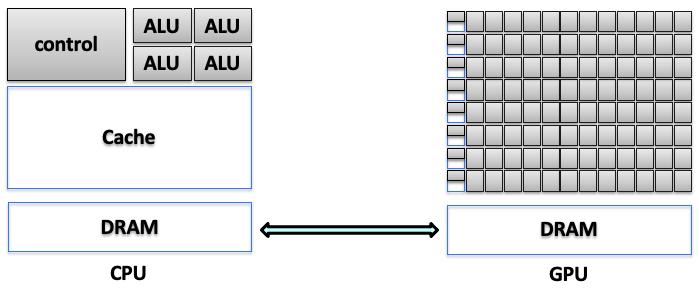
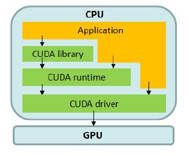
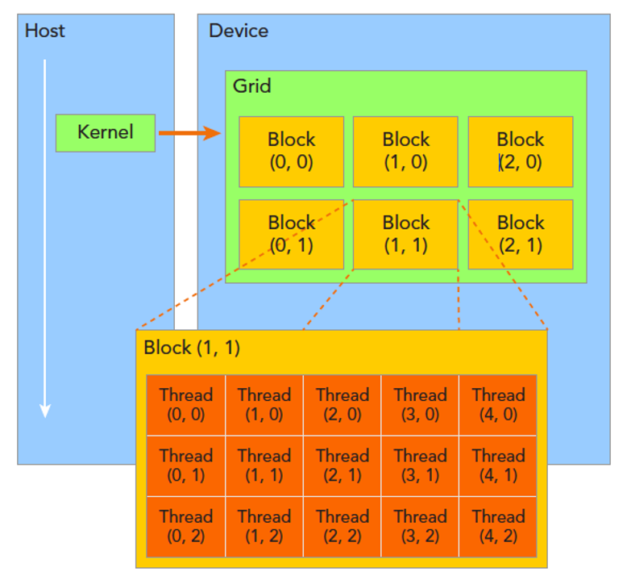
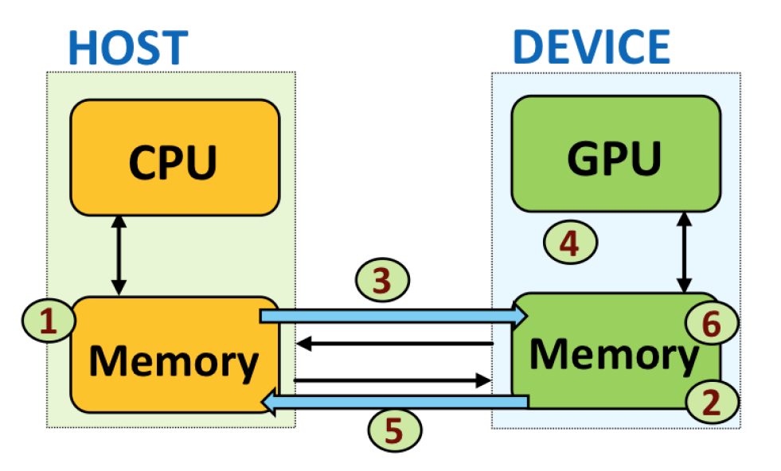
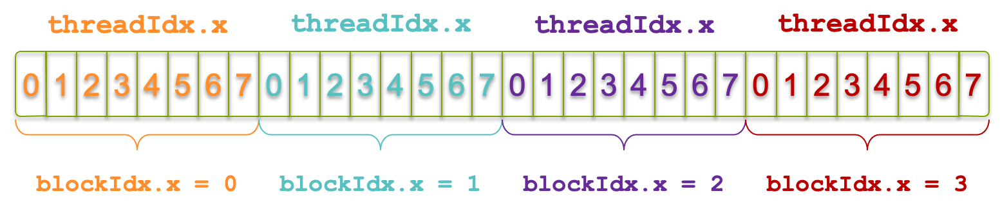
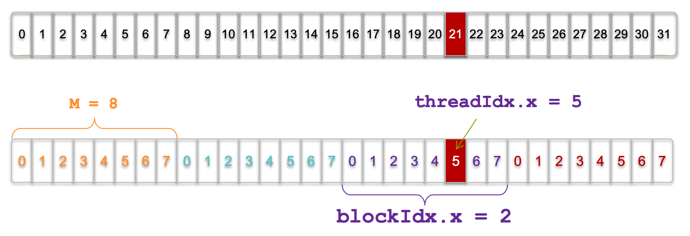
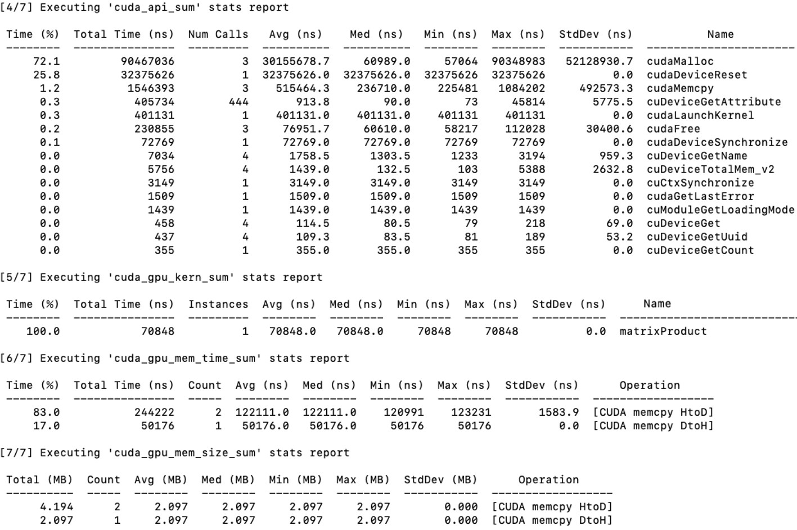
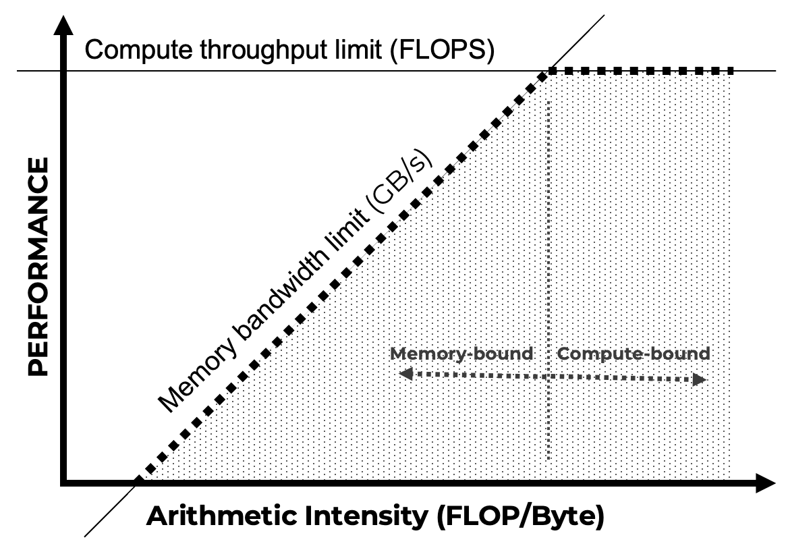

# 5. GPU Programming and CUDA 

* TOC
{:toc}

The previous chapter introduced MPI as a foundational model for distributed-memory parallelism. Through explicit communication, synchronization, and process coordination, MPI exposes the fundamental challenges of scaling computation across multiple nodes. At this level, parallelism is expressed in terms of independent processes that cooperate to solve a larger problem.

In this chapter, we shift focus to a different—but complementary—form of parallelism: hardware acceleration through GPUs. While MPI addresses how work is distributed across the system, CUDA addresses how computation is executed *within* a device. The unit of parallelism changes dramatically, moving from a small number of heavyweight processes to thousands of lightweight threads executing concurrently.

This transition also marks a change in perspective for the programmer. In MPI, performance is shaped primarily by decomposition strategies and communication patterns. In CUDA, performance depends on how computation is mapped onto the GPU’s execution model, memory hierarchy, and concurrency mechanisms. The programmer must reason not only about parallelism, but about how the hardware actually executes instructions.

Importantly, this is not a replacement of one model by another. Modern AI workloads routinely combine both approaches: distributed execution across nodes using MPI-like mechanisms, and accelerated computation within each node using GPUs. Understanding CUDA therefore complements, rather than supersedes, the distributed perspective developed so far.

The goal of the chapter is not to optimize or maximize performance, but to establish a clear mental model of GPU execution. By learning how threads, blocks, and kernels are organized and executed, the reader will acquire the conceptual foundation needed to reason about GPU acceleration before addressing performance, scalability, and integration into larger systems.

## Foundations of GPU Acceleration and CUDA Programming

As discussed in previous chapters, modern supercomputing systems increasingly rely on specialized processors known as accelerators to boost performance and efficiency. Among these, Graphics Processing Units (GPUs) have become the most widespread and influential.

### Accelerators in Supercomputing

#### Origin and Evolution of GPU Accelerators

The emergence of GPUs in high performance computing traces back to their origins in the graphics industry. In 1999, NVIDIA introduced the first Graphics Processing Unit (GPU), specifically designed to accelerate the generation of three-dimensional (3D) scenes in real-time graphics rendering.

These early GPUs were equipped with large numbers of parallel processing units, tailored to the intensive computational demands of 3D graphics. Since rendering is inherently parallel—each fragment or region of a scene can be processed independently—GPUs were designed with the following features:

- A high number of independent floating-point units (FPUs)

- Hardware-level support for executing thousands of threads concurrently

- High memory bandwidth to sustain data throughput to active threads

Initially, these processors were optimized for single-precision arithmetic, sufficient for visual applications. However, as demand for computational accuracy grew in scientific and engineering fields, GPU vendors introduced support for double-precision operations, paving the way for GPUs to evolve into general-purpose accelerators.

This transformation positioned GPUs as central components in supercomputing infrastructures, where they are now extensively used to accelerate machine learning workloads. Neural network training, in particular, relies heavily on linear algebra operations—such as matrix multiplications and convolutions—which map exceptionally well to the parallel architecture of GPUs. The primary goals of GPU integration into AI and HPC workloads include:

- Maximizing computational throughput, by executing large volumes of operations in parallel.

- Minimizing execution time and energy consumption, leveraging the energy efficiency of parallel hardware.

#### Host-Device Model

In the architecture of most HPC systems, GPUs act not as replacements for CPUs but as co-processors within a host-device model. In this paradigm:

- The CPU (host) governs the overall program flow, managing data and launching compute-intensive tasks to the GPU.

- The GPU (device) performs parallel computations, delegated from the host.

CPUs are designed for general-purpose workloads, offering complex control logic, large cache hierarchies, and high single-thread performance. Their architecture prioritizes low latency, handling diverse and often sequential tasks efficiently.

In contrast, GPUs are optimized for data-parallel workloads. They trade complex control mechanisms for massive numbers of simpler cores, organized into SIMD (Single Instruction, Multiple Data) units. Each GPU control unit manages multiple arithmetic logic units (ALUs), executing the same instruction across different data elements simultaneously.

Crucially, the host and device each have their own memory spaces, connected through high-speed interconnects like PCI Express (PCIe) or NVLink. This separation introduces several architectural considerations:

- Explicit memory management is required to transfer data between CPU and GPU.

- Synchronization must be handled carefully to avoid race conditions or data inconsistencies.

- Performance bottlenecks can arise from limited interconnect bandwidth or high transfer latency.

Figure 5.1 illustrates the functional split between CPU and GPU domains, highlighting the memory hierarchy and control responsibilities of each processor. While CPUs rely on deep cache systems and intricate control flows, GPUs consist of numerous lightweight cores designed for high-throughput execution. This distinction underscores the need for conscious data movement and careful coordination in heterogeneous systems.

*Figure 5.1 – Functional split between CPU and GPU domains, including separate memory hierarchies and control responsibilities (Adapted from Agustín Fernández –UPC).*

#### Power and Cooling Considerations

The integration of GPUs into HPC environments introduces critical power and thermal challenges. High-end GPUs—especially those targeting AI and HPC workloads—can draw several hundred watts under full utilization. When multiple GPUs are deployed within a single compute node, the resulting power demand increases significantly, necessitating robust power delivery infrastructure.

In parallel, thermal management becomes a central design constraint. GPUs operating continuously at high utilization generate substantial heat. Without effective cooling, performance may degrade due to thermal throttling, and hardware longevity may be compromised.

To address these challenges, system architects must incorporate advanced cooling solutions such as liquid cooling or directed airflow, design power delivery systems capable of supporting high-density GPU configurations, and optimize rack layouts and node densities to balance performance, power consumption, and reliability.

These factors not only influence node-level hardware design, but also affect data center-wide considerations, including energy efficiency, carbon footprint, and infrastructure cost.

As we discussed previously in Chapter 1, addressing these infrastructure challenges is central to the design and operation of any contemporary supercomputing facility. Furthermore, given the trajectory of increasing computational demands, power and thermal constraints are anticipated to become even more critical, as we will explore in detail in the final chapter dedicated to future trends in supercomputing.

#### Heterogeneous Computing

Rising computational demands and workload complexity have driven the widespread adoption of heterogeneous computing, where applications are partitioned across diverse processor types, most commonly combining CPUs and GPUs.

In this model, the application is structured into:

- Host code (executed on the CPU): Responsible for control flow, memory orchestration, and kernel launches.

- Device code (executed on the GPU): Handles data-parallel, compute-intensive sections through GPU kernels.

Figure 5.2 illustrates this collaboration. The CPU initializes execution, allocates memory, and triggers kernels that execute concurrently across thousands of GPU threads. After GPU processing, results are returned to the host for further stages or output.

*Figure 5.2 – Host/device division of work in a heterogeneous CUDA application (Image source: NVIDIA).*

The heterogeneous model significantly enhances performance by leveraging the complementary strengths of CPUs and GPUs. However, this approach inherently adds complexity to software development. Programmers must explicitly manage tasks such as dividing computational workloads appropriately, orchestrating data movements between the distinct memory spaces of CPU and GPU, and controlling execution flow across these processors. This complexity makes heterogeneous applications generally harder to design, debug, and optimize compared to homogeneous (CPU-only) ones.

A critical aspect of efficient GPU programming, therefore, is minimizing the overhead introduced by data transfers between the host and device. Developers must carefully consider both the latency and bandwidth constraints inherent to host-device communications to avoid performance bottlenecks.

Understanding the architectural distinctions between CPUs and GPUs further clarifies their complementary roles:

- CPUs are optimized primarily for low latency, designed to execute instructions rapidly with minimal delay. They achieve this by employing large caches, sophisticated branch prediction techniques, and out-of-order execution capabilities.

- GPUs, by contrast, are optimized for high throughput, prioritizing the execution of a vast number of instructions in parallel rather than focusing on the latency of single instructions. They achieve high throughput through the use of numerous simple processing cores arranged in large arithmetic logic unit (ALU) arrays, lightweight scheduling mechanisms, and hardware capabilities for rapid context switching among thousands of threads.

This fundamental architectural distinction guides heterogeneous programming practices. In essence, CPUs handle sequential and latency-sensitive operations, while GPUs excel in massively parallel and throughput-dominated computations.

### CUDA: A Programming Platform for GPUs

To support general-purpose GPU computing and simplify heterogeneous development, NVIDIA introduced CUDA (Compute Unified Device Architecture)—a comprehensive parallel computing platform and programming model designed to unlock GPU acceleration for a broad range of applications.

Rather than simply extending C/C++, CUDA provides a layered software ecosystem (see Figure 5.3) that allows developers to select their desired level of abstraction:

- CUDA Libraries: Pre-built, optimized implementations of common algorithms, offering near-peak performance while abstracting hardware complexity.

- CUDA Runtime API: Offers higher-level control over memory allocation, kernel launching, and synchronization, suited for most user applications.

- CUDA Driver API: A lower-level interface providing direct access to GPU resources for fine-grained performance tuning and systems-level integration.

This modular structure enables flexibility: entry-level developers can focus on productivity via libraries and runtime APIs, while expert users can delve into hardware-aware optimizations when needed.

By embedding CUDA into C/C++ workflows, developers can offload parallel workloads to the GPU without abandoning familiar programming paradigms.

*Figure 5.3 – CUDA software stack: libraries, runtime, and driver layers enabling host-device interaction (Image source: NVIDIA).*

### Core CUDA Libraries for Accelerated Computing

One of CUDA’s key strengths lies in its rich set of GPU-accelerated libraries, which provide highly optimized routines across multiple domains integrated under the hood, delivering high performance without exposing users to hardware-specific code.

#### Libraries for Deep Learning and AI

Widely used by frameworks like PyTorch, TensorFlow, JAX, and Hugging Face, these libraries support efficient neural network training and inference:

- cuDNN: Deep learning primitives for convolution, pooling, normalization, activations, RNNs, and transformers, frequently updated to exploit the latest GPU hardware.

- cuBLAS: High performance dense linear algebra routines, especially GEMM operations essential to neural networks.

- CUTLASS: A flexible, template-based library for creating custom matrix operations with operation fusion and modular design.

- NCCL: Enables fast collective communication (e.g., All-Reduce, Broadcast, AllGather) across multiple GPUs, optimized for NVLink, PCIe, and InfiniBand. While NCCL is part of the CUDA software ecosystem, its design principles, performance characteristics, and critical role in multi-node training are discussed in detail in Chapter 6.

#### Libraries for Other Domains

CUDA’s ecosystem supports additional computational areas:

- cuRAND: High performance random number generation

- cuSOLVER: Solvers for linear systems and matrix decompositions

- cuSPARSE: Efficient operations on sparse matrices

- cuFFT: Fast Fourier Transforms for signal and image processing

- NPP: NVIDIA Performance Primitives for image and video processing

- Thrust: STL-like C++ parallel algorithm library

- nvGRAPH: Graph analytics algorithms

- Video Codec SDK: Hardware-accelerated video encoding and decoding

These libraries are continually updated to leverage emerging features, including Tensor Cores, sparsity-aware execution, and low-precision arithmetic, ensuring forward compatibility and performance scaling.

#### Framework Integration and Developer Ecosystem

Modern deep learning frameworks abstract the details of CUDA programming, offering high-level APIs that automatically manage:

- GPU memory allocation and transfers

- Kernel execution and synchronization

- Multi-GPU deployment via distributed APIs (e.g., torch.distributed, tf.distribute)

NVIDIA supports this ecosystem with the Deep Learning SDK and NVIDIA GPU Cloud (NGC), providing pre-configured containers, inference engines, profiling tools, and platform-optimized libraries to facilitate development across research, enterprise, and edge deployments.

## Getting Started with CUDA: Threads, Kernels, and Memory 

In this section, we introduce the key concepts in CUDA: thread organization, memory management, and kernel launching.

Understanding and mastering these foundational ideas is essential for comprehend the core principles of CUDA and appreciating its potential in accelerating neural network training, as explored throughout the book.

### Hello World in CUDA

The CUDA platform allows developers to offload computations to the GPU, unlocking its massively parallel processing capabilities. By utilizing CUDA kernels—specialized functions that run on the GPU—we can execute tasks in parallel, significantly accelerating compute-intensive workloads. This makes CUDA a powerful tool for many scientific, engineering, and data processing applications.

Let us begin with a simple example: a classic "Hello World" program.

As introduced earlier, a typical CUDA program consists of serial code complemented by parallel code. The serial code is executed on the host CPU, while the parallel code runs on the device GPU. This division is structured as follows:

- The host code is compiled using standard C compilers.

- The device code is written using CUDA extensions.

- CUDA runtime libraries are added during the linking stage to enable kernel calls and explicit GPU device operations.

To compile and execute CUDA code, the appropriate CUDA environment must be loaded. On some systems, this is done automatically. On MareNostrum 5 (MN5), however, you must load the CUDA module manually:

    module load cuda

Once the environment is ready, the CUDA source file can be compiled using the nvcc compiler:

    nvcc <filename>.cu -o <filename>

Here, \<filename\> refers to the name of the CUDA source file. The nvcc compiler separates the source into host and device components: the device code is processed by the NVIDIA compiler, while the host code is handled by the system’s native C compiler (typically gcc). The -o flag specifies the name of the output executable, which can be run directly from the command line.

To verify which CUDA compiler you are using, the following command can be helpful:

    $ which nvcc

#### Hello world from CPU

Let’s start by printing a simple message from the CPU using a minimal CUDA program:

    // hello.cu
    #include <stdio.h>

    int main(void)
    {
        printf("Hello World from CPU\n");
    }

If you compile and execute this program from a login node, the output will be:

    $nvcc hello.cu -o hello
    $ ./hello

Hello World from CPU

Although this code is written in a .cu file and compiled with nvcc, it behaves like a regular C program and does not invoke any GPU functionality.

#### Hello world from GPU

The next example extends the previous one to include GPU execution. The following code launches a kernel on the GPU to print a message from each thread:

    // helloGPU.cu
    #include <stdio.h>

    __global__ void helloFromGPU(void)
    {
        printf("Hello World from GPU\n");
    }

    int main(void)
    {
        printf("Hello World from CPU\n");
        helloFromGPU<<<1, 3>>>();  // Launch 1 block with 3 threads
        cudaDeviceSynchronize();   // Ensure the kernel has finished executing
        return 0;
    }

This program contains a CUDA kernel (helloFromGPU) declared with the \_\_global\_\_ qualifier, indicating it will be executed on the device and can be called from the host. The kernel is launched from the host with the configuration \<\<\<1, 3\>\>\>, meaning one block composed of three threads.

It is important to note that CUDA kernel launches are asynchronous with respect to the host CPU. This means that launching a kernel does not automatically block the CPU until the GPU finishes execution. In this simple example, we explicitly call cudaDeviceSynchronize() to ensure that all GPU threads have completed before the program exits.

In larger applications, explicit synchronization is essential when results produced by the GPU are needed on the host, or when precise timing and profiling are required.

To compile and run this program:

    $ nvcc helloGPU.cu -o helloGPU
    $ ./helloGPU

Hello World from CPU

Hello World from GPU

Hello World from GPU

Hello World from GPU

You have now successfully executed your first CUDA program on a GPU.

This output reflects the behavior of the program as follows:

- The message "Hello World from CPU" is printed once by the main thread on the CPU.

- Then, the kernel helloFromGPU is launched with a configuration of one block containing three threads.

- Each of these threads executes the printf() statement independently on the GPU, resulting in three instances of "Hello World from GPU".

- The call to cudaDeviceReset() ensures proper cleanup of GPU resources before program termination.

We will explore the details of how this execution model works—including blocks, threads, and memory—in the following sections.

>**Task 5.1 – Your First Hello World in CUDA**
>
>Reproduce the results presented in this section. Doing so will help you verify that the CUDA environment is correctly set up and that you are able to compile and execute a basic CUDA program on your system.
>
>After verifying that your CUDA program executes correctly, answer the following questions:
>
>- Which parts of the program are executed on the host (CPU), and which parts are executed on the device (GPU)?
>
>- What exactly happens when the kernel is launched, and why does kernel execution not occur sequentially like a standard C function call?
>
>- Why is it necessary to explicitly manage memory transfers between host and device in this program?
>
>Your answers should focus on understanding the execution model rather than on code syntax or correctness.

#### Terminology Note: Tasks, Processes, and Threads

In this chapter, it is important to clearly distinguish between concepts used by the workload manager (SLURM) and those used by the CUDA programming model.

A SLURM task refers to a CPU-side process launched and managed by the scheduler. The number of tasks in a job is controlled by the --ntasks directive. Each task corresponds to one operating system process, which may be assigned one or more CPU cores.

In contrast, a CUDA thread is a lightweight execution unit that runs on the GPU. CUDA threads are created in large numbers when a kernel is launched and are organized into blocks and grids. These threads are managed entirely by the GPU hardware and are unrelated to SLURM tasks or CPU processes.

Throughout this chapter, the term task is used when referring to SLURM-managed CPU processes, while thread refers exclusively to GPU threads executing CUDA kernels.

### Threads Organization

In CUDA, a thread is the smallest unit of execution in the parallel computing model. Each thread performs a specific task or computation independently. One of the most powerful aspects of CUDA is its ability to launch a large number of threads that execute in parallel on a GPU, which typically contains hundreds or thousands of cores.

#### Blocks and Grids

CUDA organizes threads in a hierarchical structure composed of grids and blocks. A kernel launch spawns a grid of blocks, where each block contains a group of threads. All threads execute the same kernel code but operate on different data elements. CUDA provides intrinsic variables that allow each thread to identify its position in this structure, enabling them to work on the appropriate data subset.

This hierarchical model is illustrated in Figure 5.4, which shows a two-dimensional grid of blocks. Each block in turn contains a two-dimensional array of threads.

*Figure 5.4 – CUDA thread hierarchy: A 2D grid of 3×2 blocks, each block consisting of 5×3 threads  
(Image source: NVIDIA).*

The threads spawned by a single kernel launch collectively form a grid. Each block of threads in the grid can share local memory and synchronize execution, but threads from different blocks cannot communicate or synchronize with one another. In this way, CUDA enables scalable parallel execution, where different blocks can process different regions of a problem independently.

To allow threads to determine their location and access their specific portion of data, CUDA defines two key coordinate systems:

- The block index refers to a block’s position in the grid. It is specified in three dimensions and accessed inside the kernel using blockIdx.x, blockIdx.y, and blockIdx.z.

- The thread index refers to a thread’s position within its block. Like the block index, it is also specified in three dimensions and accessed using threadIdx.x, threadIdx.y, and threadIdx.z.

Each of these indices is stored in a CUDA-defined data structure of type uint3, which allows access via .x, .y, and .z components. These indices provide each thread with a unique identifier in the context of its block and the global grid, allowing fine-grained data parallelism.

#### Dimensions of Blocks and Grids

The dimensions of the grid and the thread blocks are represented by the built-in variables gridDim and blockDim. Both are of type dim3, a CUDA-defined vector type with three unsigned integer components (x, y, and z).

- blockDim specifies the number of threads per block in each dimension. For example, if blockDim.x = 3, blockDim.y = 5, and blockDim.z = 1, then each block contains a total of 3 × 5 × 1 = 15 threads.

- gridDim specifies the number of blocks in the grid along each dimension. For instance, gridDim.x = 2, gridDim.y = 3 would define a 2×3 grid of blocks.

Any dimension left unspecified in a dim3 declaration is initialized to 1 by default.

This flexible layout allows developers to tailor the thread configuration to the specific structure of their problem and hardware characteristics, which is crucial for achieving optimal performance on the GPU.

Here is a simple example that demonstrates how to configure a one-dimensional grid and block:

    int nElem = 6;
    dim3 block(3);
    dim3 grid((nElem + block.x - 1) / block.x);

In this code:

- The data size is defined as nElem = 6

- A one-dimensional block with 3 threads is defined using dim3 block(3)

- The number of required blocks is computed using the formula (nElem + block.x - 1) / block.x, which performs integer ceiling division to ensure full data coverage

This formula ensures that the number of blocks is sufficient to process all elements, even when the data size is not a perfect multiple of the block size. For example, if nElem = 7 and block.x = 3, then 3 blocks are needed to cover all 7 elements.

#### Accessing Grid and Block Information

CUDA exposes variables that enable programmers to access and use the grid and block configuration from both the host and the device sides.

On the host side, before launching a kernel, the programmer defines the grid and block dimensions and can inspect them using printf:

    printf("grid.x = %d grid.y = %d grid.z = %d\n", grid.x, grid.y, grid.z);
    printf("block.x = %d block.y = %d block.z = %d\n", block.x, block.y, block.z);

On the device side, within a kernel, each thread can access:

- threadIdx to get its position in the block

- blockIdx to get the block’s position in the grid

- blockDim and gridDim to know the size of each dimension

Here is an example that prints this information from the device:

    __global__ void checkIndex(void)
    {
        printf("threadIdx:(%d, %d, %d) blockIdx:(%d, %d, %d) 
               blockDim:(%d, %d, %d) gridDim:(%d, %d, %d)\n",
               threadIdx.x, threadIdx.y, threadIdx.z,
               blockIdx.x, blockIdx.y, blockIdx.z,
               blockDim.x, blockDim.y, blockDim.z,
               gridDim.x, gridDim.y, gridDim.z);
    }

This kernel prints the index information for each thread when launched.

Let us now see the full code that uses this kernel:

    #include <cuda_runtime.h>
    #include <stdio.h>
    /*
     * Display the dimensionality of a thread block and grid 
     * from the host and device.
     */

    int main(int argc, char **argv)
    {
        // define total data element
        int nElem = 6;

        // define grid and block structure
        dim3 block(3);
        dim3 grid((nElem + block.x - 1) / block.x);

        // check grid and block index from host side
        printf("\ncheck grid and block dimension from host side->\n grid.x=%d grid.y=%d grid.z=%d | block.x=%d block.y=%d block.z=%d\n", grid.x, grid.y, grid.z , block.x, block.y, block.z);

        // check grid and block dimension from the device side
        printf("\n check grid/block index from kernel side-->\n");
        checkIndex<<<grid, block>>>();

        // reset the device before you leave
        cudaDeviceReset();
        return 0;
    }

If you compile and run this program:

    $ nvcc checkIndex.cu -o checkIndex
    $ ./checkIndex

You will see output similar to:

check grid and block dimension from host side-\>

grid.x=2 grid.y=1 grid.z=1 \| block.x=3 block.y=1 block.z=1

check grid and block dimension from kernel side--\>

threadIdx:(0, 0, 0) blockIdx:(0, 0, 0) blockDim:(3, 1, 1) gridDim:(2, 1, 1)

threadIdx:(1, 0, 0) blockIdx:(0, 0, 0) blockDim:(3, 1, 1) gridDim:(2, 1, 1)

threadIdx:(2, 0, 0) blockIdx:(0, 0, 0) blockDim:(3, 1, 1) gridDim:(2, 1, 1)

threadIdx:(0, 0, 0) blockIdx:(1, 0, 0) blockDim:(3, 1, 1) gridDim:(2, 1, 1)

threadIdx:(1, 0, 0) blockIdx:(1, 0, 0) blockDim:(3, 1, 1) gridDim:(2, 1, 1)

threadIdx:(2, 0, 0) blockIdx:(1, 0, 0) blockDim:(3, 1, 1) gridDim:(2, 1, 1)

This output confirms the execution model: 2 blocks, each with 3 threads, totaling 6 threads. Each thread prints its unique identifiers, demonstrating how CUDA assigns thread and block indices.

>**Task 5.2 – Dimensionality of a Thread Block and Grid**
>
>1\. Write a CUDA program that prints the dimensionality of the thread block and grid from both the host and device sides.
>
>2\. Compile and execute the program interactively in your MN5 terminal.
>
>3\. Confirm that the output matches expectations, and that all thread indices are correctly reported.
>
>After experimenting with different block and grid dimensions, answer the following questions:
>
>- Why does CUDA require both a grid and a block hierarchy instead of a single flat index space?
>
>- How does changing the block dimensions affect the way threads are logically grouped, even if the total number of threads remains the same?
>
>- Which aspects of the program’s behavior change when block dimensions are modified, and which remain unchanged?
>
>Focus your answers on conceptual organization and execution structure rather than on performance considerations.

### Memory Management

In the CUDA programming model, memory management plays a fundamental role in enabling effective parallel computation. The model assumes a system architecture composed of two distinct components: the host (CPU) and the device (GPU). Each of these components operates within its own independent memory space.

A key principle of CUDA programming is that memory spaces for the host and device are separate. This separation requires that any data to be processed by the GPU must be explicitly transferred from the host to the device memory. Once computations are completed on the GPU, the results must be copied back to the host memory. This data exchange is essential to the CUDA execution flow and must be carefully managed to avoid performance bottlenecks.

Managing memory in this manner allows developers to fully exploit the computational power of GPUs while retaining the flexibility and control of the host environment. At the same time, it introduces complexity in terms of performance tuning. Efficient CUDA programs minimize unnecessary data transfers and overlap them with computation whenever possible. Though further optimization techniques are beyond the scope of this introductory hands-on, mastering memory management is essential for writing high performance CUDA code.

CUDA provides several functions to facilitate memory management between the host and device. These include:

- cudaMalloc: Allocates memory on the device. It takes the size of memory to be allocated as input and returns a pointer to the allocated space on the device.

- cudaFree: Frees memory previously allocated on the device using cudaMalloc.

- cudaMemcpy: Transfers data between the host and device memory. This function requires the destination pointer, the source pointer, the number of bytes to transfer, and the direction of transfer.

<!-- -->

    cudaError_t cudaMemcpy ( void* dst, const void* src, 
                             size_t count, cudaMemcpyKind kind )

The kind parameter specifies the direction of the transfer and can be one of the following:

- cudaMemcpyHostToHost

- cudaMemcpyHostToDevice

- cudaMemcpyDeviceToHost

- cudaMemcpyDeviceToDevice

This function is synchronous by default, meaning that the host blocks until the transfer is completed.

The following example illustrates a basic CUDA program that performs an integer addition on the GPU and demonstrates the memory management process:

    	#include <stdio.h>

    	// CUDA kernel function to add two numbers
    	__global__ void add(int *a, int *b, int *c) {
    	    *c = *a + *b;
    	printf("GPU: computed %d + %d = %d\n", *a, *b, *c);
    	}

    	int main(void) {
    		int a, b, c;	              // host copies of a, b, c
    		int *d_a, *d_b, *d_c;	     // device copies of a, b, c
    		int size = sizeof(int);
    		
    		// Allocate space for device copies of a, b, c
    		cudaMalloc((void **)&d_a, size);
    		cudaMalloc((void **)&d_b, size);
    		cudaMalloc((void **)&d_c, size);
    		// Setup input values
    		a = 2;
    		b = 7;

    		// Copy inputs to device
    		cudaMemcpy(d_a, &a, size, cudaMemcpyHostToDevice);
    		cudaMemcpy(d_b, &b, size, cudaMemcpyHostToDevice);

    		// Launch add() kernel on GPU
    		add<<<1,1>>>(d_a, d_b, d_c);

    		// Copy result back to host
    		cudaMemcpy(&c, d_c, size, cudaMemcpyDeviceToHost);

    		// Print the result on the host
    		printf("CPU: received result %d + %d = %d\n", a, b, c);

    		// Cleanup
    		cudaFree(d_a); 
    		cudaFree(d_b); 
    		cudaFree(d_c);

    		return 0;
    	}

The following output illustrates the kernel execution and memory transfers:

    $ nvcc add.cu -o add
    $ ./add

GPU: computed 2 + 7 = 9

CPU: received result 2 + 7 = 9

This example maps directly to the memory transfer steps shown in Figure 5.5:

- Host-side setup (Step 1): Host variables a and b are initialized in CPU memory.

- Device-side memory allocation (Step 2): Memory is allocated on the GPU for d_a, d_b, and d_c.

- Host-to-device memory transfer (Step 3): Input values are copied from CPU to GPU memory using cudaMemcpy.

- Kernel execution (Step 4): The kernel runs on the GPU, reading from device memory and storing the result in d_c.

- Device-to-host memory transfer (Step 5): The computed result is transferred back to host memory.

- Host-side result use (Step 6): The CPU prints the result.

*Figure 5.5 – Order of memory transfer steps in a typical CUDA program.*

This explicit memory management model is central to CUDA programming, ensuring clarity and control over data movement in heterogeneous systems.

>**Task 5.3 – Investigating Parallel Execution with Multiple Threads**
>
>Modify the previous CUDA program to launch the kernel with a configuration of 4 threads: add\<\<\<1, 4\>\>\>. Compile and execute the modified code.
>
>Observe the output. What do you notice about the printed results?  
>Even though the input data is the same, the kernel is now executed by 4 concurrent threads, all accessing and modifying the same memory location.
>
>Reflect on the following:
>
>- Why does each thread print the same operation and result?
>
>- What happens if multiple threads access the same memory position without coordination?
>
>In the next section, we will explore how to manage this type of parallel execution correctly using thread indexing and memory addressing techniques.
>
>After observing the output produced by multiple threads, reflect on the following:
>
>- Does the order in which thread outputs appear correspond to the order in which threads are defined in the code? Why or why not?
>
>- Can you infer from the output whether all threads are executed truly simultaneously? Explain your reasoning.
>
>- What guarantees does the CUDA programming model provide regarding correctness, despite the apparent lack of a fixed execution order?
>
>Your answers should focus on the logical execution model exposed by CUDA, not on assumptions about hardware scheduling.

#### Unified / Managed Memory

In the examples we have seen so far, data move along the traditional host-device path: you reserve a buffer on the GPU with cudaMalloc, copy the contents from the host to that buffer with cudaMemcpy, launch the kernel, copy the results back, and finally free the device memory. Beginning with CUDA 6, NVIDIA added Unified (or Managed) Memory, which lets you work with a single pointer that is simultaneously valid on the CPU and on the GPU. Behind the scenes, the runtime migrates 4-KB pages to whichever processor touches them first, using on-demand page migration and hardware page-fault support.

Conceptually, the difference between the two models is simple. In the classical workflow you execute the sequence *allocate → copy to device → run kernel → copy to host → free*. With Unified Memory the timeline shrinks to *allocate managed buffer → initialise it on the CPU → run the kernel → read the results on the CPU → free*. The copies disappear because the runtime moves pages only when they are actually accessed.

Here is a minimal code example that illustrates the idea:

    double* a;
    cudaMallocManaged(&a, N * sizeof(double));

    // … use a[] on the CPU …

    kernel<<<grid, block>>>(a);

    // … read a[] on the CPU again …

    cudaFree(a);

Unified Memory shines when you want to prototype quickly or when your data structures are irregular—linked lists, trees, graphs—because you no longer have to reason about which parts of each structure live where. You can even give the runtime a hint by calling cudaMemPrefetchAsync, pre-loading pages onto the GPU before a kernel starts or back onto the CPU once computation ends, hiding most of the migration latency.

For workloads with dense and predictable access patterns, manually managed memory still provides the most stable peak bandwidth and the lowest possible latency. On modern hardware, however, the performance gap has narrowed in some scenarios. With careful use of prefetching (cudaMemPrefetchAsync) and sufficient data reuse, Unified Memory can approach the performance of manually managed transfers. That said, this behavior is highly workload- and system-dependent, and Unified Memory should not be assumed to deliver near-optimal performance by default.

### Launching a CUDA Kernel

Launching a CUDA kernel is a core concept in CUDA programming that enables the execution of parallel computations on the GPU. A kernel is a special function written in CUDA C/C++ that is executed concurrently by many threads. These threads run in parallel, making it possible to process large data sets efficiently.

After defining the grid and block dimensions, a CUDA kernel is launched using the triple-chevron syntax:

    kernel_name <<<grid, block>>>(argument list);

Here, kernel_name is the name of the CUDA kernel function, argument_list includes the parameters passed to the kernel, grid indicates the number of blocks to launch, and block defines the number of threads within each block. This configuration determines the total number of threads executing the kernel and how they are arranged.

#### Mapping Threads to Array Elements 

When programming with CUDA, a critical aspect is assigning a unique index to each thread so that it can operate on a specific element of an array. CUDA provides a hierarchical organization:

- Threads are grouped into blocks

- Blocks are organized into a grid

Each thread has a local index within its block (threadIdx.x) and the block has an index within the grid (blockIdx.x). To compute a global index across all threads in the grid, we use:

    int index = threadIdx.x + blockIdx.x * blockDim.x;

This formula calculates the global thread index by combining the thread’s local ID with the block’s position and the number of threads per block (blockDim.x).

Assume we want to process an array of 32 elements using 4 blocks of 8 threads each. We launch the kernel as:

    kernel_name<<<4, 8>>>(...);

In this case:

- Each block contains 8 threads (with threadIdx.x from 0 to 7)

- The grid contains 4 blocks (with blockIdx.x from 0 to 3)

This results in 32 threads total, each operating on a unique array element.

Figure 5.6 shows this layout of blocks and threads across an array of 32 elements.

*Figure 5.6 – Grid of 4 blocks with 8 threads each, covering an array of 32 elements (Image source: NVIDIA).*

Let’s say we want to find out which thread operates on the 21st element of the array. Suppose we examine thread 5 in block 2. Applying the formula:

int index = threadIdx.x + blockIdx.x \* blockDim.x;

= 5 + 2 \* 8;

= 21;

Figure 5.7 illustrates this exact scenario. This indexing mechanism is fundamental in 1D grid and block configurations and ensures that each thread can independently process a data element.

*Figure 5.7 – Visualization of threads and blocks; thread with threadIdx.x = 5 in blockIdx.x = 2 (Image source NVIDIA).*

*Note: This example is adapted from an NVIDIA course attended in 2013. Despite its age, it remains a highly intuitive reference for understanding thread indexing.*

#### Add Two Vectors

As a practical example, let us add two vectors a and b element-wise and store the result in vector c. The \_\_global\_\_kernel function that performs the addition is defined as follows:

    __global__ void add(int *a, int *b, int *c, int n) {
        int index = threadIdx.x + blockIdx.x * blockDim.x;
        if (index < n)
            c[index] = a[index] + b[index];
    }

In order to launch add() kernel, we can use:

    add<<<N/THREADS_PER_BLOCK, THREADS_PER_BLOCK>>>(d_a, d_b, d_c, N);

This instructs CUDA to launch the add kernel with enough threads to process all elements. Each thread calculates its global index, verifies it’s within bounds, and performs the addition.

The complete example could look like this:

    #include <stdio.h>

    #define N 64 
    #define THREADS_PER_BLOCK 32 

    void init_vector(int n, int *V) {
        for (int i = 0; i < n; i++) {
             V[i]=i;
        }
    }

    void print_vector(int n, int *V) {
        for (int i = 0; i < n; i++) {
            printf("|%d", V[i]);
        }
        printf("\n");
    }

    __global__ void add(...) {
     ...
    }

    int main(void) {
        int *a, *b, *c;             // host copies of a, b, c
        int *d_a, *d_b, *d_c;       // device copies of a, b, c
        int size = N * sizeof(int);

        // Alloc space for device copies of a, b, c
        cudaMalloc((void **)&d_a, size);
        cudaMalloc((void **)&d_b, size);
        cudaMalloc((void **)&d_c, size);

        // Alloc space for host copies of a, b, c 
        a = (int *)malloc(size);
        b = (int *)malloc(size);
        c = (int *)malloc(size);

        init_vector(N,a);
        init_vector(N,b);

        printf("vector a:\n");
        print_vector(N, a);
        printf("vector b:\n");
        print_vector(N, b);

        // Copy inputs to device
        cudaMemcpy(d_a, a, size, cudaMemcpyHostToDevice);
        cudaMemcpy(d_b, b, size, cudaMemcpyHostToDevice);

    //    add<<< ... >>>(...);

        // Copy result back to the host
        cudaMemcpy(c, d_c, size, cudaMemcpyDeviceToHost);

        printf("vector c:\n");
        print_vector(N, c);

        // Cleanup
        free(a);
        free(b);
        free(c);
        cudaFree(d_a);
        cudaFree(d_b);
        cudaFree(d_c);
        return 0;
    }

This example reinforces core CUDA concepts such as memory transfers, kernel launching, and thread indexing. It is highly recommended that students review and experiment with this code.

#### Handling Arbitrary Vector Sizes in CUDA

In practice, the number of elements N is often not divisible by the block size. This can result in some threads accessing out-of-bounds memory.

A simple safeguard is to include a conditional check inside the kernel:

    if (index < n) {
        c[index] = a[index] + b[index];
    }

This ensures that threads only access valid elements.

When launching the kernel, we use:

    int blockSize = THREADS_PER_BLOCK;
    int gridSize = (N + blockSize - 1) / blockSize;
    add<<<gridSize, blockSize>>>(d_a, d_b, d_c, N);

This "ceiling division" guarantees enough threads are launched to cover all elements. This practice ensures:

- Safety: Prevents invalid memory access

- Simplicity: Involves minimal code

- Scalability: Works with any value of n

This technique is ubiquitous in CUDA programming.

>**Task 5.4 – Element-wise Vector Addition Using CUDA**
>
>Write a complete program that performs vector addition using the CUDA kernel described in this section. Initialize two input vectors on the host, allocate and copy them to the device, launch the kernel, and retrieve the result. Print the input and output vectors to verify correctness. Use an interactive terminal to run the code, as the execution is very short and well-suited for such sessions.
>
>After completing the vector addition kernel, reflect on the following:
>
>- How does the CUDA execution model replace the explicit loop used in the CPU version?
>
>- What is the logical relationship between a thread index and a vector element index?
>
>- Why is this mapping particularly well suited for GPU execution?
>
>Explain your answers in terms of data parallelism, not implementation details.

Although the examples in this chapter are written explicitly in CUDA C/C++, the concepts they illustrate extend far beyond low-level programming. Modern deep learning frameworks such as PyTorch, TensorFlow, and JAX rely heavily on CUDA under the hood: tensor operations are implemented using CUDA kernels, optimized libraries like cuBLAS and cuDNN, and the same execution and memory models introduced here. Understanding these foundations provides critical insight into how high-level AI frameworks map computations onto GPUs, and explains many performance behaviors that will be revisited in later chapters.

### Looking Ahead: Topics Beyond the Basics

In this section, we have introduced the foundational elements of GPU programming with CUDA: kernel launches, thread indexing, and memory management. These core concepts constitute the essential building blocks for any developer aiming to harness the computational capabilities of modern GPUs.

However, these are just the first steps into a broader and rapidly evolving programming model. As GPU-accelerated applications grow in complexity and scale, mastering these basic concepts is necessary—but not sufficient. CUDA development encompasses a wide array of advanced techniques and tools aimed at optimizing performance, improving portability, and supporting increasingly heterogeneous architectures.

While the details of these topics fall outside the scope of our courses, we believe it is important to provide a brief overview. Our goal is to offer students a glimpse of what lies ahead and to encourage further exploration. A good starting point is the official  *CUDA C++ Programming Guide*[^1] from NVIDIA, which offers comprehensive documentation and examples.

Below we summarize some of the most relevant advanced topics that students and professionals may encounter in real-world projects:

- Optimizing Memory Usage: CUDA offers various memory spaces, each with distinct performance characteristics. *Shared memory*, which is programmer-managed and resides on-chip, allows threads within the same block to cooperate and share data efficiently. It is especially useful for avoiding redundant accesses to global memory through tiling strategies. *Constant memory* and *texture memory* provide optimized caching mechanisms that improve performance for specific access patterns—particularly when many threads read the same values.

- Memory Coalescing and Alignment: For optimal performance, developers must ensure that threads within a warp access contiguous and properly aligned memory addresses. This enables *coalesced memory access*, where multiple memory requests are combined into a single transaction, significantly reducing latency and bandwidth consumption.

- Performance Tuning and Profiling: Achieving high performance requires a deep understanding of GPU execution. Techniques such as *loop unrolling*, *instruction-level parallelism*, and *fused multiply-add* instructions help extract more efficiency from the hardware. Tools like Nsight Compute**, **Nsight Systems, and the CUDA Profiling Tools Interface (CUPTI) provide insights into kernel performance and help identify bottlenecks. At the Barcelona Supercomputing Center (BSC), we also offer a trace translator for Nsight traces that enables their visualization using Paraver[^2], a highly flexible and powerful performance analysis tool.

- Portability and High-Level Programming Models: In addition to CUDA C++, developers can use directive-based models such as OpenACC or OpenMP offloading. These approaches simplify GPU programming, especially in large or legacy codebases, by allowing incremental parallelization with minimal code restructuring. They are also valuable in multidisciplinary teams where direct CUDA programming might not be feasible.

- The Evolving CUDA Ecosystem: With each new GPU generation, NVIDIA introduces architectural enhancements—ranging from new memory hierarchies to more powerful scheduling capabilities. The CUDA software stack evolves in parallel, offering updated libraries, debugging tools, and APIs that make it easier to write scalable and efficient GPU programs.

By being aware of this broader landscape, students can better appreciate the depth and versatility of CUDA, and are encouraged to continue building their knowledge beyond the basics presented in this chapter.

## Case study: Matrix Multiplication in CUDA 

This section presents a practical example of applying the key CUDA programming concepts introduced earlier in the chapter—kernel launches, thread indexing, memory management, and error handling—through the implementation of a parallel matrix multiplication.

### Handling Errors

CUDA API calls are often asynchronous, making it difficult to determine where an error originates. A widely used practice is to wrap CUDA calls with an error-handling macro and function to simplify debugging and provide meaningful diagnostics:

    #define err(format, ...) do { fprintf(stderr, format, ##__VA_ARGS__); exit(1); } while (0)

    inline void checkCuda(cudaError_t e) {
    	if (e != cudaSuccess) {
    		err("CUDA Error %d: %s\n", e, cudaGetErrorString(e));
    	}
    }

For example, a device memory copy can be protected using:

    checkCuda(cudaMemcpy(d_a, h_a, size, cudaMemcpyHostToDevice));

If the memory copy or a previous asynchronous operation has failed, the error will be caught and printed in a human-readable format before terminating the program. This approach is extremely useful for debugging CUDA programs.

### Managing Flattened Matrices

CUDA device memory is dynamically allocated and does not support direct two-dimensional indexing. For this reason, matrices are typically represented as one-dimensional (flattened) arrays. Accessing an element at row i and column j in a matrix of width N can be done as matrix\[i \* N + j\].

To compute the global thread coordinates in both  dimensions, we use:

    x = blockIdx.x * blockDim.x + threadIdx.x;
    y = blockIdx.y * blockDim.y + threadIdx.y;

#### CUDA Kernel

The CUDA kernel for matrix multiplication becomes:

    __global__ void matrixProduct(double *matrix_a, double *matrix_b, 
                                  double *matrix_c, int width) {
    	double sum = 0;
    	int row = threadIdx.y + blockDim.y * blockIdx.y;
    	int col = threadIdx.x + blockDim.x * blockIdx.x;
    	if (col < width && row < width) {
    		for (int k=0; k<width; k++) {
    			sum += matrix_a[row * width + k] * matrix_b[k * width + col];
    		}
    		matrix_c[row * width + col] = sum;
    	}
    }

Each thread computes one element of the result matrix C by performing the dot product of a row of A and a column of B.

#### Host Code

The main() function prepares and executes the matrix multiplication on the GPU. For simplicity, we use square matrices of size N × N.

    #include <cuda_runtime.h>
    #include <sys/time.h>
    #include <stdio.h>
    #include <stdlib.h>
    #include <time.h>

    #define N 512
    #define BLOCK_SIZE_DIM 16

    void initializeMatrices(double matrix_a[N][N], double matrix_b[N][N]) {
        srand(time(NULL));
        for (int i = 0; i < N; i++) {
            for (int j = 0; j < N; j++) {
                matrix_a[i][j] = rand() % 100;
                matrix_b[i][j] = rand() % 100;
            }
        }
    }

    void showResults(double matrix_a[N][N], double matrix_b[N][N], double matrix_c[N][N]) {
        printf("***** MATRIX A ***** \n");
        for (int i = 0; i < N; i++) {
            for (int j = 0; j < N; j++) {
                printf("%f%s", matrix_a[i][j], (j == N - 1) ? "\n" : ",");
            }
        }
        printf("***** MATRIX B ***** \n");
        for (int i = 0; i < N; i++) {
            for (int j = 0; j < N; j++) {
                printf("%f%s", matrix_b[i][j], (j == N - 1) ? "\n" : ",");
            }
        }
        printf("***** MATRIX C ***** \n");
        for (int i = 0; i < N; i++) {
            for (int j = 0; j < N; j++) {
                printf("%f%s", matrix_c[i][j], (j == N - 1) ? "\n" : ",");
            }
        }
    }

The main() function then calls the kernel:

    int main() {
        size_t size = N * N * sizeof(double);
        double h_a[N][N], h_b[N][N], h_c[N][N];
        double *d_a, *d_b, *d_c;

        initializeMatrices(h_a, h_b);

        // Allocate memory on device
        checkCuda(cudaMalloc((void **) &d_a, size));
        checkCuda(cudaMalloc((void **) &d_b, size));
        checkCuda(cudaMalloc((void **) &d_c, size));

        // Copy matrices to device
        checkCuda(cudaMemcpy(d_a, h_a, size, cudaMemcpyHostToDevice));
        checkCuda(cudaMemcpy(d_b, h_b, size, cudaMemcpyHostToDevice));

        // Define grid and block dimensions
        dim3 dimBlock(BLOCK_SIZE_DIM, BLOCK_SIZE_DIM);
        dim3 dimGrid((N + BLOCK_SIZE_DIM - 1) / BLOCK_SIZE_DIM, 
                     (N + BLOCK_SIZE_DIM - 1) / BLOCK_SIZE_DIM);

        // Launch kernel
        matrixProduct<<<dimGrid, dimBlock>>>(d_a, d_b, d_c, N);

        // Wait for completion and check errors
        checkCuda(cudaDeviceSynchronize());
        checkCuda(cudaGetLastError());

        // Copy result back to host
        checkCuda(cudaMemcpy(h_c, d_c, size, cudaMemcpyDeviceToHost));

        // Free device memory
        checkCuda(cudaFree(d_a));
        checkCuda(cudaFree(d_b));
        checkCuda(cudaFree(d_c));

        showResults(h_a, h_b, h_c);
        cudaDeviceReset();
        return 0;
    }

To keep the code readable and consistent, we adopt the following naming convention throughout this section:

- Host variables: prefix with h\_ (e.g., h_a, h_c)

- Device variables: prefix with d\_ (e.g., d_a, d_c)

We include the call to cudaDeviceSynchronize() immediately after launching the kernel to ensure that all GPU threads have completed their execution before we proceed to copy the result matrix back to the host. This is particularly important because CUDA kernel launches are asynchronous with respect to the host. Without this explicit synchronization, the program might attempt to transfer the result from device to host memory before the GPU computation has finished, leading to incomplete or incorrect data being copied.

>**Task 5.5 – Parallel Matrix Multiplication with CUDA**
>
>Write a program that performs the matrix product C = A × B for square matrices of size N = 4, parallelizing the computation using CUDA. Base your implementation on the example provided in this section. Your program should:
>
>- Initialize the matrices with random values.
>
>- Allocate memory on the GPU and copy the input matrices.
>
>- Launch the kernel using a two-dimensional grid and block configuration.
>
>- Copy the result matrix back to the host.
>
>- Print all three matrices for verification.
>
>Using a small matrix size allows you to easily verify correctness and debug your implementation. Once your program is working correctly for N = 4, you may increase the matrix size (e.g., N = 512) to explore performance behavior.
>
>For development and testing, this program can be executed in an interactive session on a compute node. Larger problem sizes and performance experiments should always be executed on compute nodes allocated through SLURM.
>
>After implementing and running the matrix multiplication kernel, reflect on the following:
>
>- How does the amount of computation performed by each thread compare to the vector addition case?
>
>- How many memory accesses does each thread perform, and how does this influence performance potential?
>
>- Why is matrix multiplication generally considered more computationally intensive than element-wise operations?
>
>Your answers should focus on the relationship between computation and memory access, not on specific optimization techniques.

### Allocating a GPU with SLURM

When running CUDA programs on an HPC cluster managed by SLURM—such as MareNostrum 5 (MN5)—it is essential to explicitly request GPU resources in your job submission script. CUDA applications, such as the matrix multiplication example in this chapter, require access to a GPU device in order to execute computations efficiently.

To request a GPU, SLURM provides the following directive:

    #SBATCH --gres=gpu:1

As introduced in Chapter 3, the --gres (generic resource) flag tells SLURM to allocate a specific number of GPU devices. In this case, gpu:1 reserves one GPU for your job. This guarantees that the task executing on the CPU will be granted exclusive access to a GPU during its execution.

In addition to requesting GPU resources, it is also important to define the number of tasks your job will launch:

    #SBATCH --ntasks=1

This directive specifies that the job will consist of a single task, that is, a single CPU-side process. The number of CPU cores assigned to this task is controlled independently using the --cpus-per-task directive. In typical CUDA applications, this host task is responsible for initializing the CUDA runtime, allocating device memory, launching kernels on the GPU, and transferring results back to host memory.

It is important to clarify that the --ntasks parameter refers to tasks (CPU-side processes)—not GPU threads. The GPU is used by the host process through the CUDA programming model, which allows compute-intensive tasks to be offloaded to the GPU.

*Note: As described in Section 3.2, MareNostrum 5 applies an administrator-defined CPU–GPU allocation policy. For every GPU requested, the job must allocate 20 CPU cores. Consequently, a job requesting 1 GPU must also request 20 CPU cores, while a job requesting 4 GPUs must allocate all 80 CPU cores on the node. You can express this allocation using different combinations of --ntasks and --cpus-per-task, depending on the parallelism model of your application.*

>**Task 5.6 – Running CUDA Jobs with SLURM**
>
>Repeat the matrix multiplication experiment from Task 5.5, but this time submit the program as a batch job using SLURM. Prepare a simple SLURM script that:
>
>- Requests one GPU with --gres=gpu:1
>
>- Launches a single task with --ntasks=1 and an appropriate value of --cpus-per-task to satisfy the CPU–GPU allocation policy (see previous Note).
>
>- Loads the necessary CUDA module (e.g., module load CUDA)
>
>- Executes the compiled CUDA program
>
>Running the job through SLURM is essential for preparing more realistic experiments. While previous tasks could be executed interactively on login nodes due to their small size, this approach prepares you for running more demanding CUDA workloads in a production HPC environment.
>
>After successfully running your CUDA program using SLURM, answer the following:
>
>- What role does the batch system play in granting access to GPU resources?
>
>- Which aspects of program execution are controlled by your CUDA code, and which are controlled by the job scheduler?
>
>- Why is it necessary to explicitly request GPUs in a supercomputing environment?
>
>Your answers should focus on execution context and resource management rather than on CUDA programming details.

## Measuring and Understanding GPU Performance

Once a CUDA kernel has been implemented and validated for correctness, the next step is to understand its performance behavior. In accelerator-based systems, achieving high performance is not only a matter of writing correct parallel code, but also of measuring execution costs, identifying dominant overheads, and interpreting how computation and data movement interact.

In this section, we move beyond functional correctness and focus on performance analysis. We begin by timing CUDA kernels and examining execution breakdowns using profiling tools available on MareNostrum 5. We then analyze how performance evolves as problem size increases, revealing the transition from memory-bound to compute-bound behavior. Finally, we introduce a simple but widely used performance mental model—based on arithmetic intensity and the roofline concept—that helps explain these observations in a hardware-agnostic way.

The goal is not to provide an exhaustive treatment of performance modeling, but to equip the reader with standard vocabulary and intuition that will be reused throughout the book when reasoning about GPU kernels, data pipelines, and distributed AI workloads.

### Timing the kernel

Starting with CUDA 5.0, NVIDIA introduced nvprof, a lightweight command-line profiling tool that allowed developers to obtain basic timing information for CUDA kernels, memory transfers, and API calls. Since CUDA 10.2, however, the original nvprof tool has been officially deprecated and replaced by the more comprehensive Nsight profiling suite.

Today, NVIDIA provides an nvprof-compatible mode through Nsight Systems (nsys). When invoking nsys nvprof \<application\> the profiling is performed by Nsight Systems, while preserving the output format and usage model of the original nvprof tool. This compatibility mode allows users to continue using a familiar, command-line-based workflow, while relying on the modern Nsight backend.

In this chapter, we intentionally use this nvprof-compatible mode provided by nsys. The reason is purely practical: Nsight Systems is installed by default as part of the CUDA toolkit on virtually all modern HPC systems—including MareNostrum 5—without requiring additional setup. This keeps the barrier to entry low and allows us to focus on fundamental profiling concepts rather than tooling complexity.

For an in-depth analysis of a single kernel, Nsight Compute **(**ncu**)** is recommended. Moreover, starting with PyTorch 1.12, torch.profiler offers a high-level wrapper around the CUPTI APIs and can export its results to TensorBoard or to an nsys-compatible NVTX trace file. A comprehensive treatment of these tools is beyond the scope of this book, although they are unquestionably valuable.

Learning the modern Nsight Systems and Nsight Compute profilers would certainly provide deeper insight, but doing so would require readers to (a) install sizeable GUI-centric tools on their local machines or gain remote X-forwarding access, and (b) invest additional time mastering two separate interfaces. That overhead lies outside the pedagogical scope of this book.

nvprof still produces the kernel timelines, memory-copy statistics and roof-line-style summaries we need to complete the exercises. You can access this mode fully functional with CUDA 12.x using the following command:

    $ nsys nvprof <application> [application_args]

*Note: If you already have Nsight Systems or Nsight Compute available, feel free to compare the richer visual reports they generate. In production code we recommend adopting the Nsight tools, but for the streamlined, command-line-only workflow of this chapter nvprof keeps the barrier to entry low while still illustrating the core profiling concepts.*

The goal of the following profiling exercise is not to produce statistically rigorous benchmarks, but to understand relative costs and performance trends across computation, memory transfers, and resource management. For this reason, a single execution per configuration is sufficient at this stage.

When run on our CUDA matrix multiplication example (multiplying two matrices of size 512×512), the profiler generates a detailed report. A sample output is shown in Figure 5.8, generated on a MareNostrum 5 node equipped with NVIDIA H100 GPUs.

Let’s break down the most relevant information of this report.

Cuda_api_sum section \[4/7\] lists all CUDA API calls executed by the host code, with their respective total time, number of calls, and statistical breakdowns: Here we find the time required for cudaMalloc: This function handles memory allocation on the device. In our case, it accounts for 72.1% of the total time spent in CUDA API calls, with a cumulative duration of 90,467,036 ns across three calls—each averaging slightly over 30 ms. This overhead is expected, as memory allocation on the GPU is a costly operation.

In the section \[5/7\]  titled cuda_gpu_kern_sum, the only kernel launched, matrixProduct, appears. It executed once and took 70848 ns.

The  \[6/7\] cuda_gpu_mem_time_sum section reports the time spent on memory transfers between host and device:

- CUDA memcpy HtoD (Host to Device): Involves two transfers totaling 244,222 ns, representing approximately 83% of the total memory transfer time. This corresponds to copying input vectors a and b from the host to the device.

- CUDA memcpy DtoH (Device to Host): Involves a single transfer of 50,176 ns, accounting for the remaining 17% of memory transfer time. This corresponds to copying the result vector c from the device back to the host.

*Figure 5.8 – Profiling output using nsys nvprof for the matrix multiplication program. The breakdown shows time spent in CUDA API calls, kernel execution, and memory operations.*

Memory size information from cuda_gpu_mem_size_sum confirms that each transfer involved ~2 MB, which corresponds to our 512×512 double-precision matrices.

From this report, it becomes clear that:

- Memory operations dominate the execution time. Transferring data to and from the GPU takes significantly more time than the computation itself.

- The matrix multiplication kernel (matrixProduct) is efficient, executing in under 100 microseconds. However, optimizing memory allocations and minimizing transfers can yield significant performance benefits—especially for large-scale problems.

This reinforces an important lesson in GPU programming: performance optimization is not just about accelerating kernels, but also about reducing overhead in data movement and resource allocation. We will analyze these results in greater detail in the next subsection.

*Note: Since the reported time units are extremely small (nanoseconds), obtaining representative measurements would typically require running the code multiple times and computing robust statistical metrics—such as averages or medians—to reduce the impact of variability across runs. However, for the pedagogical purpose of this book, a single execution is sufficient to demonstrate how execution times are measured and interpreted in a CUDA application.*

>**Task 5.7 – Profiling Matrix Multiplication on the GPU**
>
>Profile your CUDA matrix multiplication program for N = 1024 using nsys nvprof.
>
>Run the program as a batch job using SLURM on MareNostrum 5, ensuring that the profiling output is saved for later inspection.
>
>From the profiling report, focus exclusively on the following sections and metrics:
>
>1\. cuda_gpu_kern_sum
>
>- Identify the execution time of the matrixProduct kernel.
>
>- This represents the pure computation time on the GPU.
>
>2\. cuda_gpu_mem_time_sum
>
>- Record the total time spent in:
>
>\- cudaMemcpy (Host to Device)
>
>\- cudaMemcpy (Device to Host)
>
>- These values represent data movement overhead between CPU and GPU.
>
>3\. cuda_api_sum
>
>- Observe the cumulative time spent in cudaMalloc.
>
>- This reflects one-time setup overhead associated with GPU memory allocation.
>
>At this stage, ignore all other tables and metrics in the report.
>
>Based on these three values, answer the following questions:
>
>- Which component dominates the total execution time?
>
>- Is the kernel computation time larger or smaller than the combined memory transfer time?
>
>- How significant is the memory allocation overhead compared to kernel execution?
>
>This task is intended to help you build intuition about where time is spent in a GPU-accelerated application, rather than to produce highly precise benchmarks.
>
>After analyzing the profiling results, reflect on the following:
>
>- Which parts of the kernel execution dominate the total execution time?
>
>- Based on the profiler output, does the kernel appear to be limited more by computation or by memory accesses?
>
>- What information does the profiler provide, and what information does it not provide about performance bottlenecks?
>
>Focus on interpreting profiling data as evidence rather than as definitive explanations.

### Performance and Scalability Analysis Using  nvprof

This section aims to help explore how the matrix multiplication kernel behaves as the problem size increases and to analyze its performance using empirical measurements obtained through nsys nvprof.

By systematically varying the matrix size and observing the impact on execution time and memory transfers, we can gain insight into whether the kernel is compute-bound or memory-bound. Additionally, this approach lays the groundwork for introducing basic performance models and scalability laws.

We use the matrix multiplication kernel matrixProduct developed earlier in this chapter, compiled with nvcc and executed using SLURM with the directive --gres=gpu:1 to ensure a GPU is available.

We define matrix sizes of N = 64,128, 256, 512, 1024, and 2048. For each size, the application is profiled using:

    nsys nvprof ./matrixMulN

Where matrixMulN is the binary compiled for a matrix of size N × N. The kernel is launched with a block size of 16 × 16 threads and a grid dimension of (N + 15)/16 × (N + 15)/16.

Figure 5.9 presents the execution times in nanoseconds (Y-axis, shown on a logarithmic scale) plotted against matrix sizes (NxN) on the X-axis. The graph clearly illustrates how the execution time evolves for each of the key operations. Several insights can be drawn:

- Kernel MatMul (solid line): The kernel execution time increases rapidly with matrix size. This behavior is expected, as matrix multiplication is a compute-intensive operation whose algorithmic complexity grows cubically with the size of the matrix, although the observed execution time reflects the effects of parallel execution, memory hierarchy, and GPU occupancy.

- cudaMemcpy HtoD and DtoH (dashed and dotted lines): Data transfer times between the host and the device increase significantly for larger matrices, highlighting the impact of memory operations on overall performance.

- cudaMalloc (dash-dot line): Memory allocation times remain nearly constant regardless of matrix size. This confirms that allocation overhead is independent of data volume and mostly related to GPU resource management.

- 

*Figure 5.9 – Execution time of matrix multiplication and memory transfers across increasing matrix sizes (Log-Scale).*

By examining the point where kernel execution time overtakes memory transfer times—between N = 2048 and N = 4096—we observe a clear transition from a memory-bound regime to a compute-bound regime:

- For smaller matrices, memory transfer dominates the total execution time: the GPU spends more time waiting for data than performing calculations.

- For larger matrices, the kernel becomes the dominant component, keeping the GPU compute units busy and making memory access comparatively less critical.

>**Task 5.8 – Compute-Bound vs Memory-Bound**
>
>In this task, you will study how the performance of the matrix multiplication kernel evolves as the problem size increases.
>
>Implement and run the matrix multiplication program for the following matrix sizes: N = 256, 512, 1024, 2048, 4096 (or the largest size that fits comfortably within the allocated GPU memory).
>
>For each execution, use nsys nvprof and extract only the following metrics from the profiling report:
>
>- Kernel execution time:
>
>\- matrixProduct (from cuda_gpu_kern_sum)
>
>- Data transfer time:
>
>\- Total time spent in cudaMemcpy Host-to-Device
>
>\- Total time spent in cudaMemcpy Device-to-Host
>
>(from cuda_gpu_mem_time_sum)
>
>- Allocation overhead:
>
>\- Total time spent in cudaMalloc
>
>(from cuda_api_sum)
>
>Organize your results in a table with the following columns:
>
>N\|Kernel time\|HtoD memcpy time\|DtoH memcpy time\|cudaMalloc time
>
>Then, plot the execution times using a logarithmic Y-axis, grouping:
>
>- Kernel execution time (computation)
>
>- Total memory transfer time (HtoD + DtoH)
>
>- Allocation overhead
>
>Analyze the results and answer:
>
>- For which matrix sizes does memory transfer dominate execution time?
>
>- At what point does kernel computation become the dominant cost?
>
>- How does this transition relate to the computation-to-memory ratio of the workload?
>
>This experiment illustrates the transition from memory-bound to compute-bound behavior and provides empirical evidence for the performance principles discussed in this chapter.
>
>After classifying the kernel as compute-bound or memory-bound, answer the following:
>
>- Under what conditions could this classification change (e.g., different problem sizes or hardware)?
>
>- What types of optimizations would be relevant for a compute-bound kernel versus a memory-bound one, in principle?
>
>- Why is it important to identify the limiting factor before attempting any optimization?
>
>Your answers should emphasize reasoning and diagnosis rather than specific optimization techniques.

The profiling experiments in Tasks 5.7 and 5.8 illustrate *Foundational Performance Principle \#1: Amortization of Overheads*. In accelerated systems, raw computational performance alone does not guarantee speedup unless the costs of data movement, memory allocation, and execution setup are sufficiently amortized by sustained and repeated computation.

>**Task 5.9 – When Is GPU Acceleration Worth It?**
>
>Based on the profiling results obtained in Tasks 5.7 and 5.8, reflect on the conditions under which GPU acceleration becomes beneficial for an application.
>
>In your analysis, consider the following aspects:
>
>- Size of the workload per kernel launch: How does increasing the amount of data processed by a single kernel invocation affect the relative cost of memory transfers and kernel launch overhead?
>
>- Repeated execution: Many applications execute the same kernel many times in a loop. How does repeating the computation on similar data change the importance of one-time costs such as memory allocation?
>
>- Data residence on the GPU: How does keeping data in device memory across multiple kernel launches (instead of repeatedly copying it from the host) influence overall performance?
>
>- Short-lived versus long-running computations: Why might GPU acceleration be inefficient for small, isolated computations, yet highly effective for workloads that run for many iterations?
>
>Using the matrix multiplication experiments as a reference, explain how the balance between computation, data movement, and overhead determines whether GPU acceleration is worthwhile.
>
>Based on all experiments performed in this chapter, answer the following:
>
>- Which characteristics of a problem make it suitable for GPU acceleration?
>
>- Which factors can offset or negate the benefits of GPU execution, even if the kernel is parallelizable?
>
>- Why is GPU acceleration not universally beneficial for all workloads?
>
>Your answers should integrate observations from kernel structure, memory behavior, execution overheads, and the execution environment.

### Arithmetic Intensity and the Roofline Perspective

The transition observed in the previous experiments—from memory-bound to compute-bound behavior as matrix size increases—can be understood through a simple and widely used performance model, illustrated schematically in Figure 5.10.

A key concept is *arithmetic intensity*, defined as the ratio between the number of floating-point operations performed and the amount of data moved from memory (typically expressed as FLOPs per byte). Workloads with low arithmetic intensity perform relatively few computations per byte transferred and are therefore limited by memory bandwidth. In contrast, workloads with high arithmetic intensity reuse data extensively and are primarily limited by the peak computational throughput of the processor.

This idea is commonly captured by the *roofline model* (Figure 5.10), which describes performance as being bounded either by memory bandwidth or by peak compute capability, depending on arithmetic intensity. For a given hardware platform, low-intensity kernels lie in the bandwidth-bound region, while sufficiently compute-heavy kernels can reach the compute-bound region.

The matrix multiplication kernel studied in this chapter illustrates this transition clearly. For small matrices, the kernel performs too little computation relative to the cost of memory allocation and data transfers, resulting in memory-bound behavior. As matrix size increases, data reuse grows and arithmetic intensity increases, eventually allowing the kernel to cross the bandwidth roof and become compute-bound. This shift explains why GPU acceleration only becomes effective beyond a certain problem size.

The purpose of introducing these concepts at this stage is not to provide a formal or exhaustive treatment of performance modeling. Rather, the goal is to familiarize the reader with standard terminology—such as arithmetic intensity and roofline—that is widely used in the HPC and GPU computing literature.

*Figure 5.10 – Simplified roofline model illustrating the transition from bandwidth-bound to compute-bound performance as arithmetic intensity increases. The diagram provides an intuitive performance mental model rather than a quantitative prediction tool.*

## Foundational Performance Principle \#1 

The performance results observed so far reveal a recurring pattern that extends beyond the specific CUDA kernels analyzed in this chapter. As illustrated by the roofline perspective introduced in section 5.4, the effectiveness of GPU acceleration is not determined solely by peak computational capability, but by whether the useful computation is sufficient to offset the costs required to activate and sustain the accelerator.

### Amortization of Overheads

>**_Accelerated execution delivers performance benefits only when the computational workload is large enough to amortize fixed and variable overheads such as memory allocation, data movement, synchronization, and execution setup._**

For small problem sizes, total execution time is often dominated by non-compute costs, leading to low utilization and limited—or even negative—speedup. As problem size increases, useful computation progressively dominates overall execution time, allowing parallel hardware to be used effectively and efficiently.

While this principle applies broadly to parallel computing, it becomes especially critical in modern accelerator-based architectures, where setup and data movement costs are high relative to raw compute capability.

In this chapter, the principle manifests clearly in the matrix multiplication experiments. As discussed through the arithmetic intensity and roofline model, small matrices fail to amortize memory and setup overheads, whereas larger matrices exhibit sufficient data reuse and computational density for GPU acceleration to become effective. This provides a first-order criterion for determining when GPU acceleration is technically and economically justified.

This principle will reappear throughout the book—from CUDA kernels to collective communication, and distributed training—and serves as a recurring guideline for reasoning about performance, scalability, and resource efficiency in AI workloads.

It is important to note that overhead amortization applies primarily to fixed or infrequently paid costs; when inefficiencies arise from continuously underperforming stages, pipeline balance becomes the dominant performance concern that will be considered in principle \#3.

## Beyond GPUs: Tensor Processing Units (TPUs)

While GPUs and the CUDA programming model dominate current supercomputing platforms for AI, they are not the only architectural approach to accelerating machine learning workloads at scale. Over the past decade, several organizations have explored alternative accelerator designs tailored specifically to the computational patterns of deep learning. Among these, Google’s Tensor Processing Units (TPUs) represent the most mature and widely deployed example of a non-GPU AI accelerator operating at large scale.

TPUs were conceived with a fundamentally different design philosophy from general-purpose GPUs. Rather than aiming to support a broad range of workloads, TPUs are highly specialized accelerators optimized for dense linear algebra operations, particularly matrix multiplications and tensor contractions that dominate modern deep learning training and inference. This specialization allows TPUs to achieve high efficiency for specific AI workloads, often at lower energy cost per operation compared to more general architectures.

A defining characteristic of TPUs is their tight integration within a vertically co-designed hardware–software stack. In contrast to GPU-based systems—where hardware, programming models, communication libraries, and frameworks are often developed by different vendors—TPUs are designed alongside their compiler, runtime, and software ecosystem. This co-design approach enables aggressive optimizations across the entire stack, from hardware microarchitecture to graph-level transformations performed by the compiler.

From a programming perspective, TPUs rely heavily on ahead-of-time compilation and graph-based execution models. Instead of launching fine-grained kernels explicitly, as is common in CUDA programming, computations are expressed at a higher level and compiled into optimized execution plans. The compiler plays a central role in mapping tensor operations onto the underlying hardware, managing data movement, and orchestrating parallel execution. As a result, programmers typically exercise less explicit control over low-level execution details, trading flexibility for efficiency and scalability on well-structured workloads.

This contrast highlights an important architectural trade-off. GPU-based systems, combined with CUDA and explicit parallel programming models, offer a high degree of flexibility and fine-grained control. This makes them particularly well suited for heterogeneous HPC workloads, custom kernels, irregular computation patterns, and research-oriented development. TPUs, on the other hand, excel when workloads conform closely to the assumptions embedded in their design, enabling highly efficient execution for large-scale deep learning models with regular computation and communication patterns.

The emergence of TPUs and similar AI accelerators also underscores the growing importance of system-level considerations in AI computing. As discussed throughout this book, performance and scalability are no longer determined solely by peak computational throughput. Instead, they depend on a careful balance between compute, memory hierarchy, interconnect bandwidth, communication latency, and software efficiency. TPUs exemplify how co-design can be used to optimize this balance for a targeted class of applications.

It is important to emphasize that the rise of specialized AI accelerators does not diminish the central role of GPUs in supercomputing. GPUs remain the dominant platform in large-scale HPC systems due to their versatility, mature programming ecosystem, and ability to support a wide range of scientific and AI workloads. Rather than replacing GPUs, accelerators such as TPUs illustrate an ongoing trend toward architectural specialization, where different platforms coexist and serve different optimization points in the AI performance, efficiency, and cost landscape.

For practitioners and researchers in supercomputing, TPUs provide a valuable reference point for understanding alternative design choices and their implications. Studying such architectures reinforces a key lesson of modern AI systems: achieving scalable and efficient performance increasingly depends on holistic hardware–software co-design, rather than on isolated improvements in raw computational capability.

## Key Takeaways from Chapter 5

- GPUs are specialized processors designed for throughput-oriented, massively parallel workloads. Their adoption in high performance computing stems from their origins in graphics rendering and their architectural suitability for matrix-heavy computations such as linear algebra and neural network training.

- The host–device execution model is central to GPU programming: the CPU (host) manages control flow and memory orchestration, while the GPU (device) executes massively parallel kernels. Separate memory spaces require explicit data movement and careful synchronization.

- CUDA is NVIDIA’s parallel computing platform for GPU acceleration, providing a layered programming model that ranges from highly optimized libraries (e.g., cuBLAS, cuDNN) to low-level kernel programming via CUDA C/C++.

- A CUDA program executes GPU kernels launched from the host. Kernels run across thousands of threads organized hierarchically into blocks and grids, enabling scalable expression of data parallelism.

- Correct computation of thread indices using threadIdx, blockIdx, and blockDim is fundamental to mapping parallel threads onto array elements, vectors, and matrix tiles.

- CUDA memory management is explicit. Developers allocate device memory (cudaMalloc), transfer data (cudaMemcpy), and manage lifetimes manually. For small problem sizes, memory allocation and data transfers often dominate execution time, limiting achievable speedup.

- Unified (managed) memory simplifies development by abstracting explicit transfers, but performance-critical applications must still consider access patterns, migration overheads, and prefetching to achieve predictable performance.

- Practical CUDA examples—such as element-wise vector addition and matrix multiplication—demonstrate how kernel execution, memory transfers, indexing, and synchronization interact to determine overall performance.

- Profiling experiments reveal a key performance pattern: GPU kernels often transition from memory-bound to compute-bound behavior as problem size and data reuse increase. This transition explains why acceleration becomes effective only beyond a certain workload size.

- This behavior can be interpreted using the roofline performance model, which relates achievable performance to arithmetic intensity (FLOPs per byte) and distinguishes bandwidth-bound from compute-bound execution regimes. The roofline model provides a simple and widely used mental framework for reasoning about GPU performance.

- Foundational Performance Principle \#1 — Amortization of Overheads — formalizes this observation: accelerated execution is beneficial only when useful computation is sufficient to amortize fixed and variable costs such as memory allocation, data movement, and synchronization.

- Integration with SLURM via directives such as --gres=gpu:1 ensures correct GPU allocation on HPC systems like MareNostrum 5 and prepares the ground for running realistic, production-scale CUDA workloads.

- Finally, while GPUs dominate current HPC platforms, alternative accelerators such as TPUs illustrate the growing importance of hardware–software co-design and reinforce the role of system-level balance between computation, memory, and communication.

[^1]: https://docs.nvidia.com/cuda/cuda-c-programming-guide/

[^2]: https://tools.bsc.es
