# 6. Distributed GPU Programming 

* TOC
{:toc}

The previous chapter focused on understanding the CUDA programming model: how kernels are launched, how threads and blocks are organized, and how data is moved between host and device memory. At this stage, the primary objective was correctness—learning how to express parallel computation in a way that the GPU can execute.

In this chapter, the focus shifts from *how* a GPU program is written to *how* it behaves at runtime. Once correctness is established, performance becomes the central question. This transition requires a different way of thinking: programs are no longer evaluated solely by their functional output, but by how effectively they utilize the underlying hardware.

GPU performance is shaped by multiple interacting factors. Compute throughput, memory bandwidth, occupancy, instruction mix, and latency hiding all influence observed execution time. Optimizing one aspect often exposes limitations in another. As a result, performance analysis cannot rely on intuition alone; it requires measurement, interpretation, and an understanding of hardware constraints.

Importantly, there is no single definition of “fast” in GPU computing. A kernel may achieve high arithmetic throughput while being limited by memory access patterns, or it may be memory-efficient but underutilize compute resources. Understanding these seemingly contradictory behaviors is a central goal of this chapter.

The purpose of the following tasks and experiments is not to maximize performance, but to build intuition. By measuring execution times, analyzing metrics, and comparing different implementations, the reader will begin to recognize recurring performance patterns. These patterns form the foundation for later chapters, where GPU performance is considered as part of larger training pipelines and distributed systems.

Mastering GPU programming is a necessary step. Developing the ability to reason about GPU performance is what turns programming knowledge into system-level understanding.

In summary, training today’s AI models often requires not just one GPU, but several GPUs working in parallel—sometimes across multiple nodes. To support this scale, NVIDIA GPUs such as the H100 are equipped with high-speed memory systems and advanced interconnect technologies. In this chapter, we take a closer look at the hardware and software mechanisms that make efficient multi-GPU scaling possible, laying the foundation for the large-scale training workloads explored in Parts IV and V of this book.

## H100: A Platform for Parallel and Distributed Computation 

Far beyond being “just a faster GPU,” the H100 is a data center-grade processor specifically designed to support massive parallel execution, high-throughput memory access, and specialized computations. But above all, it is designed to enable distributed training runs of today’s AI models.

As introduced in Chapter 5, CUDA programs rely on a hierarchical execution model based on threads, warps, and streaming multiprocessors. Building on these concepts, we examine the internal architecture of the H100 (Figure 6.1) and explain how it executes thousands of threads in parallel, manages memory hierarchies, and integrates technologies such as Tensor Cores and NVLink to support multi-GPU communication.

To help frame the discussion that follows, it is useful to distinguish between two complementary perspectives on the H100 architecture.

From an intra-GPU perspective, already introduced in Chapter 5, the H100 can be seen as a massively parallel processor composed of multiple Streaming Multiprocessors (SMs), a deep memory hierarchy, and specialized execution units such as Tensor Cores. This view focuses on how a single GPU executes kernels efficiently.

From an inter-GPU perspective, which is the focus of this chapter, the H100 is designed as a communication-aware building block within a larger system. High-bandwidth interconnects such as NVLink and NVSwitch, together with communication libraries like NCCL, enable multiple GPUs to cooperate efficiently during large-scale training workloads.

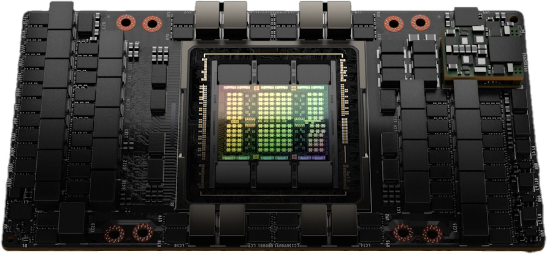

*Figure 6.1 – NVIDIA H100 GPU (Image source: NVIDIA GTC22 Whitepaper - Hopper*[^1]*).*

### Streaming Multiprocessors (SMs)

At the core of the H100 architecture are the Streaming Multiprocessors, or SMs. Each SM can be thought of as a self-contained computing unit capable of executing many threads in parallel, handling arithmetic operations, memory accesses, and specialized instructions.

Figure 6.2 shows a high-level architectural view of the full H100 GPU. This layout reveals how the chip integrates a total of 144 Streaming Multiprocessors (SMs), a significant increase over the 108 SMs found in its predecessor, the A100. This boost in parallel units directly translates into higher computational throughput. The central light blue region corresponds to the shared L2 cache, which provides fast access to data for all SMs and helps reduce traffic to external memory.

On the top edge, we find the PCI Express 5.0 Host Interface, which enables communication with the CPU, and the GigaThread Engine with Multi-Instance GPU control, which orchestrates kernel launches and resource partitioning across different SMs. On both sides are multiple HBM memory controllers that interface with high-bandwidth memory stacks. These allow the GPU to achieve extremely high memory throughput, a key requirement for training large AI models. At the bottom, we see a series of NVLink interfaces, which enable high-speed communication between GPUs in multi-GPU systems.

Figure 6.3 provides a more detailed functional view of an SM in the NVIDIA H100. It reveals that each SM is organized into four processing partitions, each with its own dispatch unit, L0 instruction cache, and dedicated register file that provides 16,384 registers of 32 bits each, totaling 65,536 registers per SM. This fast, low-latency memory is used to store thread-local variables and intermediate values during kernel execution. Since all active threads in a partition share the same register file, the number of registers used by each thread has a direct impact on the maximum number of concurrent threads the SM can host.

*Figure 6.2 – Floorplan of a Full H100 GPU (Image source: NVIDIA*[^2]*).*

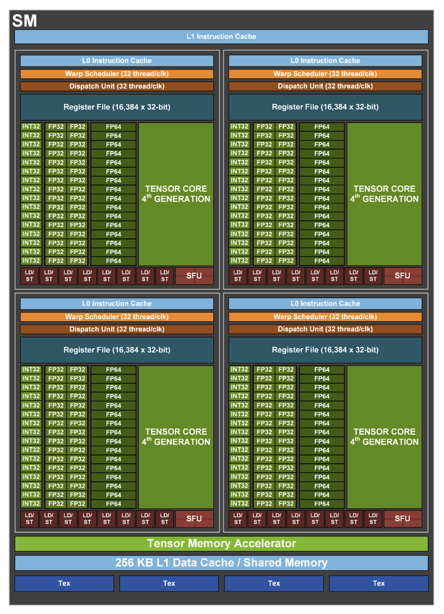

*Figure 6.3 – Functional view of a Streaming Multiprocessor (Image source: NVIDIA).*

These partitions of SM can schedule and execute instructions for independent warps (groups of 32 threads), allowing for high throughput and fine-grained control over thread execution. Instruction fetching is supported by a hierarchical cache system: the L0 instruction cache is private to each partition and enables very low-latency access to instructions, while the L1 instruction cache, shared across the SM, offers a larger storage space to reduce instruction stalls for active warps.

Each partition includes execution pipelines for different numerical formats as well as Special Function Units (SFUs) for executing complex mathematical functions such as trigonometric or exponential operations. Central to modern AI workloads are the fourth-generation Tensor Cores, present in each partition, which accelerate matrix operations in mixed-precision formats.

The LD/ST units access different types of GPU memory. They access the shared memory directly within the SM and, through the cache hierarchy and memory controllers, the global HBM2e memory outside the SM.

At the bottom of the diagram, we observe the shared memory and L1 data cache, unified into a 256 KB memory block, which enables efficient intra-block communication and caching. Just above that, the Tensor Memory Accelerator optimizes memory access for Tensor Core operations.

Finally, the Tex units, located at the base of the SM, provide specialized hardware for efficient access to structured data, such as textures and multidimensional arrays. Originally developed for graphics, these units can also be exploited in general-purpose GPU workloads to accelerate specific access patterns.

### Understanding the CUDA Execution Model: Threads, Warps and Blocks

CUDA programs follow a hierarchical execution model that abstracts the underlying hardware, making it easier to write scalable parallel code without needing deep knowledge of the GPU internals. This model organizes threads into groups that the GPU schedules and executes efficiently.

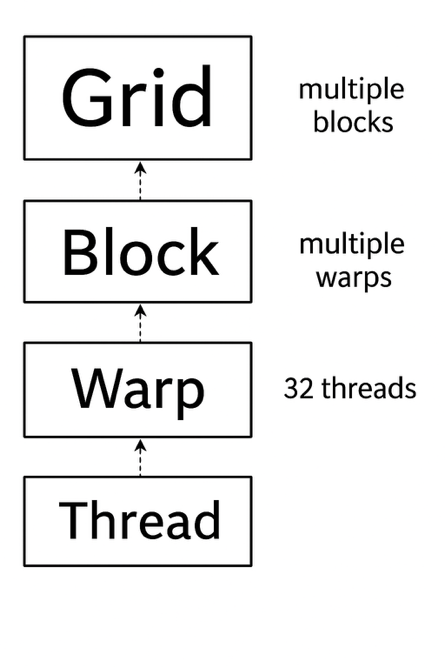

*Figure 6.4 – Thread execution hierarchy in CUDA.*

Figure 6.4 illustrates this hierarchy. At the highest level, a CUDA kernel is launched as a grid, which is composed of multiple blocks. Each block, in turn, contains multiple threads, which are the smallest units of execution. Internally, threads are grouped into fixed-size units called *warps*, each containing 32 threads. These warps are the entities actually scheduled and executed by the GPU hardware.

A warp is a group of 32 threads that execute instructions in hardware. Even though programmers write their code in terms of threads and blocks, the hardware always schedules entire warps. This means that even if only part of a warp is used (e.g., only 20 active threads), the full 32 threads are still reserved by the GPU. Because of this, thread configurations that align well with warp boundaries often result in better performance.

The warp schedulers in the SM pick which warps are ready to execute. If no warps in a block are ready, the SM remains idle. For this reason, well-designed CUDA programs aim to keep as many warps active as possible on each SM, maximizing hardware utilization.

In summary, the CUDA model provides two distinct levels of abstraction:

- Logical abstraction: grid, block, and thread. This hierarchy is programmer-controlled and allows fine-grained structuring of the solution.

- Hardware-level abstraction: the warp. Although developers don’t manage warps directly, the fact that execution always happens in groups of 32 threads has performance implications that should be understood. Ignoring warp behavior can degrade performance significantly.

#### How CUDA Blocks Are Assigned to SMs

When a kernel is launched, all the blocks in the grid are placed in a queue. These blocks are then distributed to available SMs for execution. Figure 6.5 shows how this distribution works on GPUs with different numbers of SMs.

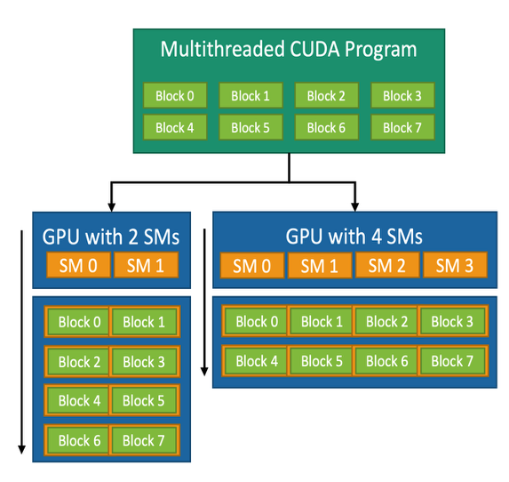

*Figure 6.5 – CUDA block-to-SM mapping model. A CUDA kernel consists of multiple thread blocks that are dynamically assigned to the available SMs. This allows the same kernel to adapt to different GPUs regardless of the number of SMs (Image source: NVIDIA).*

Each block is fully assigned to one SM. All warps within the block execute on that same SM. Threads within a block can share data using shared memory and can synchronize using barrier operations. This makes blocks natural units of work for tasks that require collaboration among threads, such as matrix multiplication or convolution operations.

This mechanism is managed automatically by the CUDA runtime. The number of SMs is not fixed in the code, so the same kernel can run on different GPUs, from small embedded devices to powerful accelerators like the H100. Developers only need to define how many blocks and threads per block to use; the system handles the distribution across SMs.

For instance, a CUDA kernel designed with eight blocks can run on a GPU with 2 SMs (each SM executes four blocks in succession) or on a GPU with 4 SMs (each SM executes two blocks). GPUs with more SMs will generally complete the task faster due to increased parallelism.

This execution hierarchy and its dynamic block–SM mapping are key to the flexibility of CUDA and its success in adapting to a wide range of computing platforms.

>**Task 6.1 – Reflecting on CUDA's Execution Model**
>
>We have explored how CUDA organizes the execution of threads through a hierarchical model of grids, blocks, warps, and threads. We have also seen how the CUDA runtime dynamically maps blocks to SMs, allowing programs to scale across different GPUs.
>
>Reflect on the advantages of this model and explain, in your own words, how each one is supported by the architecture and scheduling mechanisms discussed. The first one is scalability — why can the same CUDA program run efficiently on GPUs with different numbers of SMs? The second one is hardware abstraction — how does the CUDA execution model simplify programming by hiding the low-level scheduling details?
>
>After reflecting on the CUDA execution model, answer the following:
>
>- Which aspects of GPU execution are explicitly controlled by the programmer, and which are intentionally abstracted away?
>
>- Why is this separation essential for scalability across different GPU architectures?
>
>- How does this execution model influence the way performance should be analyzed?
>
>Focus on conceptual understanding rather than hardware-specific details.

### Tensor Cores: Accelerating Matrix Operations for AI

One of the defining innovations of modern NVIDIA GPUs is the introduction of Tensor Cores. These are specialized hardware units designed to accelerate the dense matrix operations that lie at the heart of neural network training and inference.

Unlike traditional CUDA cores, which execute scalar or vector operations, Tensor Cores treat matrices as first-class data types. They can perform complex operations such as matrix multiplication and fused multiply-accumulate in a single hardware instruction, drastically increasing computational throughput while reducing memory traffic.

A typical operation performed by a Tensor Core has the form:

**D = A × B + C**

Here, A, B, and C are small matrices (commonly 4×4 or 8×8), and the entire fused operation is executed in one step. This is especially useful for deep learning workloads, which are dominated by matrix multiplications in layers such as fully connected layers, convolutional layers, and transformer attention mechanisms (all of which are discussed in later chapters).

**How Tensor Cores Are Represented in the H100 GPU**

Figure 6.6 illustrates the conceptual organization of Tensor Cores in the H100 architecture, using FP16 (half-precision floating point). The three-dimensional blocks represent the Tensor Cores embedded within the GPU’s Streaming Multiprocessors (SMs), while the surrounding grids of dots symbolize input and output matrices.

These matrices are processed in parallel by the Tensor Cores, resulting in extremely fast execution of operations that would otherwise require multiple instructions and memory accesses. The diagram highlights the 3× increase in throughput achieved by the H100 compared to previous GPU generations for FP16 operations—made possible by architectural improvements that increase parallelism and maximize hardware utilization[^3].

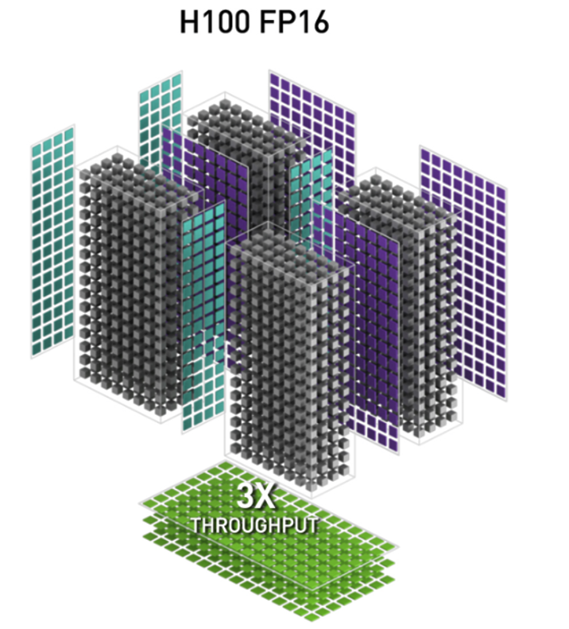

*Figure 6.6 – FP16 Tensor Operations in the H100 GPU Architecture. Conceptual diagram showing how Tensor Cores (3D blocks) process multiple input and output matrices (grids of dots) in parallel (Image source: NVIDIA).*

#### Precision Formats and Use Cases

The H100 introduces 4th-generation Tensor Cores, which support a wide range of precision formats. This flexibility allows developers to balance speed, accuracy, and memory usage depending on the task:

- FP64 (64-bit floating point): High-precision scientific computing.

- TF32 (TensorFloat-32): Combines FP32’s dynamic range with FP16’s performance.

- FP16 and BF16: Ideal for training deep neural networks with reduced memory footprint.

- INT8 and INT4: Optimized for fast inference on quantized models.

- FP8**:** Available in the H100 for cutting-edge AI workloads using custom training frameworks (FP8 increasingly used for inference and memory‑constrained training workflows).

This diversity of formats is key to adapting AI workloads to the desired trade-off between performance and numerical precision, and we will explore this trade-off in more depth throughout this book.

#### Using Tensor Cores: Implicit and Explicit Approaches

One of the major benefits of Tensor Cores is that developers don’t need to use them manually to benefit from their performance. Their usage can be implicit, through high-level libraries and frameworks, or explicit, by writing CUDA code that calls them directly.

Advanced users can access Tensor Cores directly using CUDA C++ and NVIDIA’s WMMA API (Warp Matrix Multiply-Accumulate), or via CUTLASS templates to define custom fused kernels. This allows more control over memory usage, tile sizes, and fusion strategies—but requires deeper understanding of CUDA programming.

However, most developers interact with Tensor Cores through mature software libraries. Many CUDA libraries are built to detect whether Tensor Cores are available and use them automatically when supported by the data type. Examples of important libraries include:

- cuBLAS: Automatically uses Tensor Cores for matrix operations such as GEMM (General Matrix-Matrix Multiplication) when operating on FP16, BF16, or TF32 inputs.

- cuDNN: Deep learning primitives (convolutions, activations, RNNs) are accelerated using Tensor Cores whenever precision allows.

- CUTLASS: A highly configurable C++ template library used to write custom kernels with Tensor Core support, often used in compiler backends or research code.

- NCCL: For multi-GPU training, uses Tensor Core-compatible instructions for collective operations when possible.

Popular AI frameworks such as PyTorch, TensorFlow, and JAX internally rely on these libraries. This means that training a neural network using standard code (e.g., in PyTorch) already makes use of Tensor Cores, as long as appropriate data types are selected.

>**Task 6.2 – Precision Trade-offs: True or False?**
>
>Modern GPUs support reduced-precision formats such as FP16 or BF16, which can be used instead of the traditional FP32 format in many computations. Choosing a lower precision is not just a technical detail—it is an engineering decision that can affect speed, memory usage, and the way numerical results behave. For each of the following statements, indicate whether it is True or False. In addition, write one sentence explaining your reasoning, based on what you have learned about reduced precision and Tensor Cores.
>
>1.  Using FP16 or BF16 can help a program run faster on GPUs that support Tensor Cores.
>
>2.  Switching from FP32 to FP16 always produces identical numerical results.
>
>3.  Reducing precision can lower the amount of memory required for computations.
>
>4.  All calculations in a GPU program must use the same precision format.
>
>5.  Developers can benefit from Tensor Cores without writing any specialized GPU code.
>
>For each statement, justify your answer by explicitly stating:
>
>- under which conditions the statement holds, and
>
>- under which conditions it may no longer be valid.
>
>Your justification should distinguish between numerical correctness, performance impact, and hardware support.

### HBM3: Ultra-Fast On-Board Memory

As previously introduced, the H100 GPU integrates High Bandwidth Memory version 3 (HBM3), a cutting-edge memory technology specifically designed to meet the extreme data throughput requirements of massively parallel workloads. HBM3 delivers significantly higher bandwidth and energy efficiency than traditional memory technologies.

Unlike standard memory architectures such as DDR5 or LPDDR, which are placed on DIMM modules connected via relatively narrow memory buses to the CPU socket, HBM3 stacks are physically integrated very close to the GPU die. This allows the memory to be connected through extremely wide interfaces—thousands of bits in parallel—running at lower clock speeds but delivering aggregate bandwidths far beyond what conventional memory can offer.

Each H100 includes up to 6 HBM3 stacks, providing a total memory bandwidth exceeding 3 terabytes per second. By comparison, a modern Intel Xeon CPU typically accesses DDR5 memory at bandwidths in the range of 100 to 300 gigabytes per second per socket, depending on the number of memory channels and frequency. This translates to a 10× to 30× increase in memory bandwidth when transitioning from CPU-attached DDR5 to GPU-attached HBM3, depending on the specific CPU configuration.

This architectural advantage is crucial for sustaining the high computational throughput of the H100 GPU. The vast bandwidth provided by HBM3 ensures that the thousands of threads running in parallel across the Streaming Multiprocessors (SMs) are continuously fed with data, preventing stalls during memory-intensive operations such as the matrix multiplications that dominate deep learning workloads. In addition to performance, HBM3 also offers excellent energy efficiency: it consumes significantly less power per bit transferred compared to traditional memory technologies. This characteristic is especially important in large-scale systems like MareNostrum 5, where thousands of compute nodes integrate both CPUs and GPUs, and where reducing energy consumption per operation becomes a key design objective for achieving sustainable performance at scale.

## High-Speed Communication for Multi-GPU Systems

### Inter-GPU Communication Challenges in Modern Supercomputing for AI

In supercomputing for AI, communication between GPUs is emerging as one of the most critical bottlenecks—both within a compute node and across multiple nodes. Efficient communication becomes essential to scale training workloads, especially for large deep learning models. A variety of technologies and software libraries have been developed to address this challenge, each operating at a different level of the distributed software stack:

- Hardware level: low-level interconnects between GPUs or nodes, such as NVLink, PCIe, and InfiniBand with RDMA and GPUDirect.

- Software level: communication libraries that leverage the underlying hardware mechanisms to perform efficient data exchange, such as CUDA-aware MPI and NCCL.

- User abstraction level: high-level frameworks like PyTorch or TensorFlow that encapsulate these libraries and provide simplified APIs for distributed training.

Figure 6.7 presents a layered architectural perspective of these components, summarizing the diverse technologies and libraries involved in distributed training to provide a global view of the landscape.

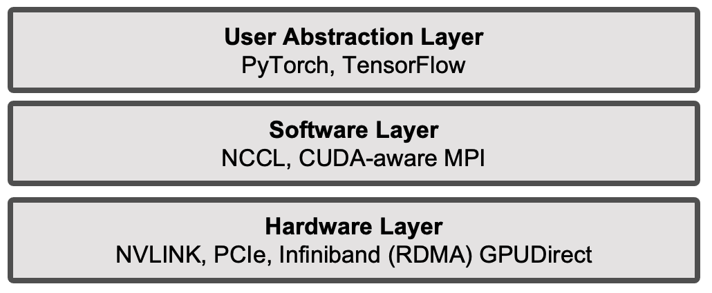

*Figure 6.7 – Layered abstraction of distributed training components.*

We will now introduce the technologies that operate at the hardware level. In the following sections of this chapter, we will present the software-layer technologies. In later chapters, once the fundamentals of deep learning have been established, we will progressively cover in detail the middleware at the software level and its interaction with the other layers, in a structured and practical way, using real-world examples and case studies.

### NVLink: Fast GPU-to-GPU Communication

In multi-GPU systems, it is often necessary for GPUs to exchange data directly—whether to share partial computations, synchronize model updates during training, or exchange intermediate results in scientific simulations. Although traditional PCI Express interfaces (which we will examine next) technically support GPU-to-GPU communication, their relatively limited bandwidth and higher latency often make them inadequate for the demands of multi-GPU workloads.

To address this bottleneck, NVIDIA developed NVLink, a high-speed, point-to-point interconnect designed specifically for direct GPU-to-GPU communication. NVLink allows GPUs to exchange data without involving the CPU or traversing system memory, thereby significantly reducing communication overhead and latency. Unlike the execution mechanisms discussed in Chapter 5, NVLink operates at the *inter-GPU level*, enabling fast data exchange between independent GPU devices.

In MN5, as illustrated earlier in Figure 2.4, each compute node contains four GPUs that are fully interconnected via NVLink, forming a direct high-bandwidth communication mesh. This setup enables efficient data sharing between GPUs, which is especially beneficial for deep learning and large-scale simulation workloads that require constant GPU-to-GPU interaction.

Each H100 GPU is equipped with up to 18 fourth-generation NVLink connections, each capable of delivering up to 50 GB/s per direction. When combined, this results in an aggregate bandwidth of up to 900 GB/s in one direction—or 1.8 TB/s full-duplex—between GPUs within the same node. This is several times higher than the total bandwidth offered by PCIe Gen 5 interfaces.

This architectural design offers three major advantages:

- Lower latency: Because data does not need to travel through the CPU or system memory, transfers are faster and more efficient.

- Higher bandwidth: NVLink enables up to 1.8 TB/s of bidirectional GPU-to-GPU bandwidth, far exceeding the capabilities of PCIe Gen 5 and supporting the data-intensive demands of modern AI workloads.

- Lower CPU overhead: NVLink frees the CPU from acting as a data relay, allowing it to focus on other parts of the application or system management.

In practical terms, this means that during distributed training of deep neural networks, gradients and activations can be exchanged between GPUs with minimal delay, improving the scalability of data-parallel workloads. The benefits of NVLink become even more pronounced in large models that require frequent synchronization, such as those seen in large language models (LLMs) and transformer architectures.

### PCI Express Gen 5: Faster CPU–GPU Communication

In modern computing systems, data exchange between the CPU (host) and the GPU (device) plays a crucial role in performance—especially in workloads that involve preprocessing on the CPU and compute-intensive execution on the GPU. The H100 GPU supports PCI Express (PCIe) Gen 5, the latest version of this ubiquitous communication interface.

Compared to the previous PCIe Gen 4 standard, PCIe Gen 5 doubles the available bandwidth. A full x16 slot now offers up to 64 GB/s in each direction, for a total bidirectional throughput of 128 GB/s. This substantial increase accelerates CPU-to-GPU and GPU-to-CPU data transfers, which are often performance bottlenecks in AI and HPC workloads.

Although PCIe remains a shared communication bus that also enables GPU-to-GPU communication, it is primarily the main bridge between CPU and GPU subsystems in most computing architectures.

### Networking for Distributed GPU Systems: RDMA and GPUDirect 

As introduced in Chapter 2, the interconnect technology used in modern supercomputers is overwhelmingly InfiniBand, due to its ultra-low latency, high bandwidth, and advanced hardware offloading features that reduce CPU overhead during communication. InfiniBand supports both traditional message passing (e.g., MPI) and Remote Direct Memory Access (RDMA), making it particularly suitable for tightly coupled parallel applications.

This is the case for the compute nodes in the ACC partition of MareNostrum 5, which are connected via InfiniBand using four NDR200 interfaces per node, offering an aggregate bandwidth of 800 Gb/s per node.

The communication protocol employed in this context is RDMA, a mechanism that enables one computer to directly access the memory of another over the network without involving the remote operating system or CPU. This is achieved through special hardware support on the network adapter, significantly reducing latency and CPU utilization. RDMA is especially effective for applications that require frequent low-latency data exchanges, such as distributed AI model training.

To further reduce communication latency in distributed training workloads, MPI can leverage a key NVIDIA technology: GPUDirect RDMA. This technology allows GPUs to exchange data directly across the network, bypassing both the host CPU and system memory (DRAM).

This direct memory path dramatically reduces communication overhead in multi-node workloads. Without GPUDirect RDMA, data must first be copied from GPU memory to host memory, then sent over the network, and finally copied back into GPU memory on the destination node. GPUDirect RDMA eliminates this multi-step process, enabling GPU-to-GPU transfers over the network with minimal CPU involvement.

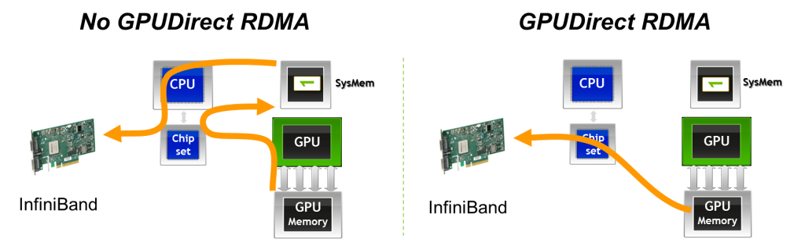

*Figure 6.8 – With GPUDirect RDMA, data can be transmitted directly from the GPU memory of one node to the GPU memory of another node, bypassing host memory and CPU intervention (Image Source: Jiri Kraus).*

In fact, NVIDIA GPUDirect is an umbrella term that encompasses several technologies aimed at improving high-bandwidth, low-latency communication with NVIDIA GPUs. In the context of MPI, GPUDirect technologies support all types of inter-rank communication: intra-node, inter-node, and RDMA-based inter-node communication. These mechanisms allow buffers located in GPU memory to be sent directly to a network adapter, avoiding staging through host memory, as illustrated in Figure 6.8.

Another important variant is GPUDirect Peer-to-Peer (P2P) transfers, which accelerate intra-node communication. With GPUDirect P2P, buffers can be directly copied between the memories of two GPUs within the same system, avoiding intermediate staging through system memory.

It is important to emphasize that RDMA should not be interpreted merely as a faster networking technology. Instead, RDMA effectively turns the interconnection network into an extension of the memory subsystem across nodes. As a consequence, the assumptions traditionally associated with best-effort networks no longer apply. RDMA-based communication only delivers its expected performance when the underlying network is lossless, non-blocking, and equipped with explicit congestion control mechanisms. Furthermore, sufficient buffering must be provisioned along the network fabric, with buffer requirements scaling proportionally to latency and bandwidth. When these conditions are not met, *the benefits of RDMA can quickly deteriorate*, and network behavior may become a dominant limiting factor in distributed GPU workloads.

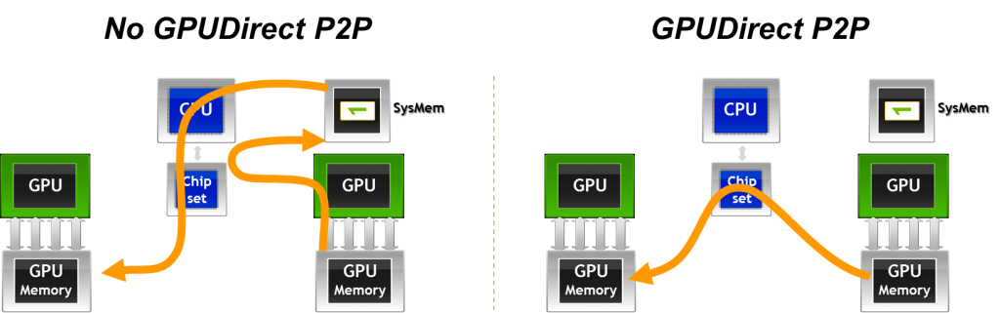

*Figure 6.9 – GPUDirect Peer-to-Peer (P2P) enables fast memory copies between GPUs on the same node by allowing direct GPU-to-GPU data transfers (Image source: Jiri Kraus).*

### Other Interconnect Technologies and Communication Protocols

For the sake of completeness, we briefly mention here additional technologies and protocols that play a role in inter-GPU and inter-node communication. While important, these topics go beyond the intended scope of this book and are not discussed in detail.

- NVSwitch extends NVLink connectivity to larger GPU topologies within a node, enabling fully-connected all-to-all communication across many GPUs. Unlike point-to-point NVLink connections, NVSwitch provides a crossbar fabric that allows any GPU to directly exchange data with any other GPU in the same system without routing through intermediate GPUs.

- SHARP (Scalable Hierarchical Aggregation and Reduction Protocol) is a technology integrated into certain InfiniBand switches that offloads collective operations (such as reductions) directly onto the network hardware. This reduces communication time for collective operations critical in distributed deep learning workloads.

- UCX (Unified Communication X) is a low-level communication framework designed for high performance data transfers across different interconnects, including InfiniBand, shared memory, and networked systems. UCX is widely used as a backend in CUDA-aware MPI implementations and other HPC communication libraries.

## Distributed Computing with CUDA-aware MPI

MPI (Message Passing Interface) is the standard API for exchanging data between distributed processes via messages, and it has long been the cornerstone of traditional HPC applications that scale across multi-node clusters. While originally designed for CPU-based communication, MPI is fully compatible with CUDA, which enables parallel computing on GPU-accelerated nodes.

There are several reasons to combine MPI and CUDA, leveraging the strengths of both distributed and device-level parallelism:

1.  To solve problems whose data size exceeds the memory capacity of a single GPU, necessitating distribution across multiple devices or nodes.

2.  To reduce total computation time for problems that would otherwise require impractically long runtimes on a single node, by distributing the workload efficiently across multiple nodes and GPUs.

3.  To accelerate an existing MPI-based CPU application by integrating GPU acceleration, thereby significantly improving performance.

4.  To scale a single-node, multi-GPU CUDA application to a multi-node environment, enabling broader scalability and performance gains in large-scale HPC workloads.

In such scenarios, CUDA-aware MPI libraries (such as Open MPI or MVAPICH2-GDR) can directly handle GPU memory buffers, avoiding the need to manually copy data between GPU and host memory. This seamless integration facilitates efficient data exchange between GPUs, both within and across nodes, and will be explored in more detail in the following section about the CUDA-aware MPI .

### CUDA-aware MPI

In the examples from Chapter 4, the MPI launcher srun was used to spawn multiple instances of an application across the nodes of a cluster. In traditional MPI usage, data exchanged between ranks must reside in host memory. When calling MPI_Send or MPI_Recv, the library expects pointers to system memory, as standard MPI implementations are not aware of GPU memory allocations.

However, when combining MPI with CUDA, the need often arises to communicate data that resides directly in GPU device memory. Without CUDA-aware support, this necessitates a manual staging process using cudaMemcpy calls to first copy data from device to host (on the sender) and then from host to device (on the receiver). The following code snippet illustrates this additional overhead:

    //MPI rank 0
    cudaMemcpy(s_buf_h,s_buf_d,size,cudaMemcpyDeviceToHost);
    MPI_Send(s_buf_h,size,MPI_CHAR,1,100,MPI_COMM_WORLD);

    //MPI rank 1
    MPI_Recv(r_buf_h,size,MPI_CHAR,0,100,MPI_COMM_WORLD, &status);
    cudaMemcpy(r_buf_d,r_buf_h,size,cudaMemcpyHostToDevice);

By contrast, CUDA-aware MPI implementations eliminate the need for staging. These libraries recognize when a pointer corresponds to GPU memory and handle the communication directly, enabling code like the following:

    //MPI rank 0
    MPI_Send(s_buf_d,size,MPI_CHAR,1,100,MPI_COMM_WORLD);

    //MPI rank n-1
    MPI_Recv(r_buf_d,size,MPI_CHAR,0,100,MPI_COMM_WORLD, &status);

This seamless support significantly simplifies programming and improves performance, particularly in GPU-dense systems.

### How does CUDA-aware MPI work?

To support communication from both host and device memory, a CUDA-aware MPI implementation must distinguish the memory type of each buffer involved in a communication call. This could be achieved by providing separate APIs or by passing explicit flags, but modern implementations avoid this complexity thanks to Unified Virtual Addressing (UVA)—a feature introduced in CUDA 4.0 (with CUDA 12.5 available as of May 2024).

UVA creates a single, unified virtual address space that spans host memory and all GPU device memories on a given node (Figure 6.10). This means that a pointer passed to MPI (or any other API) can be uniquely identified as referring to either host or device memory, without ambiguity. This feature is critical to the transparent functioning of CUDA-aware MPI.

Modern CUDA-aware MPI implementations also integrate GPUDirect RDMA, which enables direct data transfers between GPUs on different nodes via high-speed network fabrics such as InfiniBand. These transfers bypass both the host CPU and system memory, thanks to the capabilities of RDMA engines in modern NICs (e.g., Mellanox ConnectX adapters).

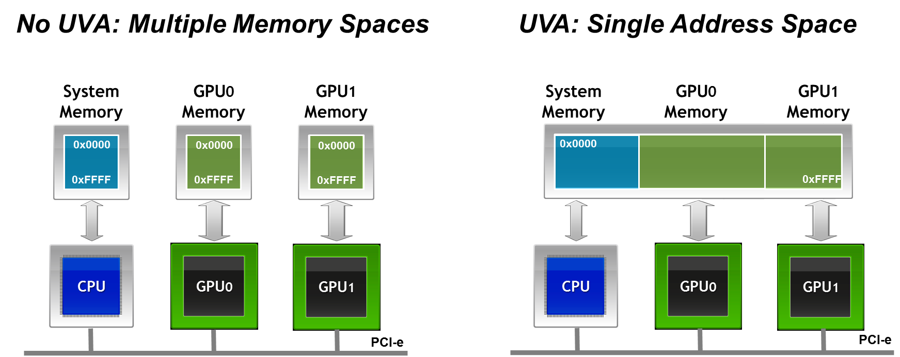

*Figure 6.10 – Unified Virtual Addressing (UVA) merges CPU and GPU address spaces into a single virtual memory map. This allows MPI libraries to distinguish between host and device buffers at runtime and enables seamless support for direct GPU communication (Image credit: Jiri Kraus).*

This direct GPU-to-GPU communication provides two key advantages in distributed computing environments:

- Lower latency and higher bandwidth, as memory transfers do not need to be staged through the CPU or DRAM.

- Reduced CPU overhead, freeing up system resources and improving scalability, particularly in large-scale training or simulation workloads.

Together, CUDA-aware MPI, Unified Virtual Addressing, and GPUDirect RDMA form a powerful stack that enables scalable and efficient parallel applications across GPU-accelerated HPC systems.

## NCCL: Collective Communication for GPUs

### Limitations of MPI for GPU-Accelerated Workloads

As discussed in the previous sections, MPI (Message Passing Interface) has long been the standard communication library for distributed computing in HPC environments. CUDA-aware MPI extends these capabilities to handle GPU memory buffers directly, but MPI was originally designed for general-purpose CPU-based communication and does not fully exploit the unique characteristics of GPU-accelerated deep learning workloads.

In data-parallel deep learning, collective operations such as All-Reduce are essential: after each GPU computes local gradients, these gradients must be aggregated across all GPUs before updating the shared model parameters. The performance of these collective operations directly impacts the scalability and training efficiency of large-scale neural networks.

### Design Principles of NCCL

To address these GPU-specific communication needs, NVIDIA developed NCCL (NVIDIA Collective Communication Library), a GPU-native collective communication library optimized for deep learning workloads. Unlike MPI, NCCL was designed from the ground up to take full advantage of GPU hardware characteristics and interconnect technologies such as NVLink, PCIe, InfiniBand, NVSwitch, and GPUDirect RDMA.

While CUDA kernels determine performance *within* a GPU, collective communication libraries such as NCCL determine scalability *across* GPUs.

NCCL offers several key features that make it particularly well suited for deep learning:

- GPU-native execution: NCCL operates directly on GPU memory buffers, avoiding staging data through host memory and fully leveraging high-bandwidth GPU interconnects.

- Integrated computation and communication: NCCL merges communication and reduction computations into unified GPU kernels. This design allows better overlap of computation and communication, reduces kernel launch overheads, and minimizes synchronization points compared to traditional MPI collectives.

- CUDA stream integration: NCCL operations accept CUDA stream arguments, enabling asynchronous execution and efficient overlap with model computations, which is crucial in large-scale distributed training pipelines.

- Topology awareness: NCCL automatically detects and adapts to the hardware interconnect topology. It selects optimal algorithms (such as ring, tree, or more advanced variants) based on the actual bandwidth and latency between GPU pairs, whether within a node or across nodes.

- Transparent multi-node support: While early versions of NCCL were limited to intra-node communication, NCCL 2.x introduced transparent multi-node support via GPUDirect RDMA. Although some CPU proxy threads are still required to manage NIC connections, the bulk of the data transfer remains fully device-to-device.

Because collective communication dominates parallel training, NCCL has become the de facto standard backend used by most modern deep learning frameworks. High-level libraries such as PyTorch DistributedDataParallel (DDP) or TensorFlow tf.distribute rely on NCCL under the hood for their collective operations when running on NVIDIA hardware.

The performance of NCCL-based collective communication is tightly coupled to the characteristics of the underlying interconnection network. While NCCL provides highly optimized implementations of collective operations such as All-Reduce and All-Gather, it does not abstract away network limitations. On the contrary, collective communication patterns tend to amplify network effects, including latency, jitter, and even minimal packet loss. As a result, the scalability and efficiency of distributed GPU training are often determined not by raw compute capability, but by the quality and design of the communication fabric.

Crucially, *NCCL is not a substitute for a well-designed network*. NCCL optimizes collective communication algorithms and their execution on GPUs, but it cannot compensate for insufficient bandwidth, high latency, network jitter, or unstable link behavior. In practice, NCCL tends to expose network weaknesses rather than hide them, because collective operations amplify the impact of the slowest communication path.

*NCCL does not replace MPI.* Rather, it complements it: NCCL specializes in high performance collective operations directly on GPU memory, while MPI remains the general-purpose communication layer responsible for process management, control flow, and non-collective communication.

From a system perspective, it is useful to think of MPI and NCCL as operating at different layers. MPI provides a flexible and general communication framework across processes and nodes, while NCCL acts as a highly optimized engine for a specific class of communication patterns—namely GPU-based collectives that dominate data-parallel training.

Although frameworks such as PyTorch DistributedDataParallel rely on NCCL for gradient aggregation, they still depend on MPI- or MPI-like mechanisms for process launch, coordination, and integration with the job scheduler.

We will revisit NCCL again in Chapter 12, where we will explore how these collective operations integrate into multi-GPU neural network training using real-world examples.

### Communication Constraints and Scalability Limits of Collective Operations

Collective communication operations exhibit fundamentally different scalability properties compared to point-to-point communication. In collectives such as All-Reduce, overall performance is dictated by the slowest participating rank and, ultimately, by the slowest packet in the communication path. This makes collective operations extremely sensitive to network latency, variability, and packet loss.

Even very small loss rates can have a disproportionate impact on performance, as retransmissions and synchronization stalls propagate across all participating GPUs. As system scale increases, these effects are amplified, often causing scaling efficiency to degrade well before computational resources are saturated. In practice, this explains why two clusters equipped with identical GPUs may exhibit radically different scaling behavior depending solely on the quality of their interconnect.

From an architectural perspective, sustaining efficient collective communication at scale requires non-blocking network topologies and carefully engineered buffering. The amount of buffering required within switches and network interfaces grows with the product of end-to-end latency and link bandwidth, imposing practical limits on network scalability and cost. These physical constraints highlight that scaling distributed GPU workloads is not simply a matter of adding more accelerators, but rather a system-level challenge where networking, topology, and hardware design play a central role.

This perspective explains many of the scalability pathologies observed in practice, where distributed training performance degrades unexpectedly despite abundant computational resources.

### Other Software Level Communication Libraries

Before closing this section, for completeness, it is worth briefly mentioning the software-level communication technology NVSHMEM (NVIDIA Shared Memory), which provides a partitioned global address space model for GPUs. This programming model allows for one-sided communication, where data transfers can be initiated by one GPU directly into the memory of another GPU without requiring synchronization or active participation from the remote side. As a result, NVSHMEM enables highly efficient and fine-grained data sharing between GPUs, reducing the need for explicit synchronization and minimizing CPU involvement.

NVSHMEM is particularly suited for irregular or fine-grained communication patterns, which can appear in certain scientific computing workloads, graph analytics, or tightly-coupled simulations where frequent small data exchanges occur. Unlike NCCL or CUDA-aware MPI, which primarily target collective or bulk data movement operations, NVSHMEM offers a more flexible low-level mechanism that can provide additional performance benefits when communication patterns do not map well to collectives.

Internally, NVSHMEM builds upon lower-level GPU interconnect technologies such as GPUDirect RDMA and relies on CUDA IPC (Inter-Process Communication) for intra-node memory access, enabling efficient transfers across both intra-node and inter-node GPU resources.

While its use in large-scale deep learning is still limited compared to NCCL or MPI-based approaches, NVSHMEM continues to gain traction in certain HPC domains where highly scalable, low-latency communication with minimal CPU intervention is critical.

Its inclusion here is intended to give the reader a broader perspective on the communication software stack in current HPC for AI, although a detailed discussion remains beyond the scope of this book. Further exploration of NVSHMEM can offer valuable insights for readers interested in emerging communication models for GPU-accelerated high performance computing.

## Case Study: Distributed GPU Computing

While NCCL dominates deep learning training, CUDA-aware MPI remains highly relevant for traditional scientific HPC applications.

Now that we understand how CUDA-aware MPI works, we can evaluate its performance in a real-world setting through a practical example: a distributed implementation of the Jacobi solver. The goal of this hands-on section is to familiarize students with these techniques using a representative scientific computing problem — the parallel Jacobi method — widely used in numerical simulations across science and engineering.

Although the Jacobi solver is not an AI workload, it exhibits communication and synchronization patterns that are fundamental to large-scale AI training. In particular, the need for frequent boundary exchanges, global synchronization points, and strict iteration ordering closely mirrors the behavior of gradient aggregation and parameter synchronization in data-parallel neural network training.

For this reason, Jacobi serves as a deliberately simple but powerful proxy: it allows us to study the performance impact of communication, domain decomposition, and GPU-aware message passing in isolation, without the additional complexity of deep learning frameworks.

We will begin with a brief overview of the algorithm, and then guide students through a series of tasks that will allow them to explore and measure the performance gains achievable when combining MPI and CUDA in a distributed GPU environment.

This case study makes explicit why MPI remains essential in large-scale systems: even when GPU-native collectives are available, distributed applications still require a general communication substrate to manage domain decomposition, synchronization, and execution flow.

This case study draws inspiration from a technical post[^4] by Jiri Kraus[^5], adapting the material for an educational and benchmarking context.

### Jacobi Algorithm

#### Sequential Jacobi Algorithm

The Jacobi iteration[^6] is a classical method for solving systems of linear equations iteratively. In this exercise, we use a simplified two-dimensional version of the algorithm. Students are not expected to understand every mathematical detail, but rather to focus on the computational patterns and how they translate into parallel code.

At each iteration, the Jacobi method updates each grid point based on the average of its four neighbors — left, right, above, and below — until convergence is reached. The main loop structure looks like this:

    While (not converged)
        Do Jacobi step:
        for (int iy = 1; iy < ny - 1; iy++)
            for (int ix = 1; ix < nx - 1; ix++)
                a_new[iy * nx + ix] = -0.25 *
                    (a[iy * nx + (ix + 1)] + a[iy * nx + ix - 1]
                     + a[(iy - 1) * nx + ix] + a[(iy + 1) * nx + ix]);

        Apply periodic boundary conditions

        Swap a_new and a
    Next iteration

The outer while loop controls the convergence. Inside, two nested for loops compute the new value at each interior point using a five-point stencil.

The core of the Jacobi method is performed within these two nested for loops, iterating over internal grid points of a 2D array. The outer loop (iy) iterates over the rows, and the inner loop (ix) iterates over the columns of the grid. For each internal grid point (ix, iy), a new value is calculated for the array a_new using the average of its neighboring points (left, right, above, and below) from the array a. Specifically, it assigns a_new\[iy \* nx + ix\] to -0.25 times the sum of the neighboring values, effectively averaging these points.

After the Jacobi step, periodic boundary conditions are applied. Periodic boundary conditions ensure that edge values wrap around, simulating a continuous domain. These conditions wrap the boundaries of the array, allowing values on the edges to interact with values on the opposite edges, simulating a continuous loop. The new values calculated in a_new are swapped with the old array a, preparing for the next iteration.

#### Parallel Jacobi Algorithm

To parallelize the algorithm across multiple GPUs, we must first partition the data. This is known as domain decomposition, a fundamental concept in distributed computing. The choice of decomposition affects both communication overhead and load balancing. Figure 6.11 illustrates three possible decomposition strategies[^7].

In this case study, we adopt the horizontal stripe[^8] decomposition for its simplicity. Each GPU processes a contiguous block of rows. After each iteration, GPUs exchange their boundary rows with neighboring processes. Specifically:

- Each GPU sends its last row to the process below.

- Each GPU receives the first row from the process above.

By treating the topmost process as the neighbor of the bottommost process (and vice versa), we naturally enforce periodic boundary conditions.

This setup enables all GPUs to collaboratively solve a single global problem, each contributing to its local portion of the domain and synchronizing through boundary communication.

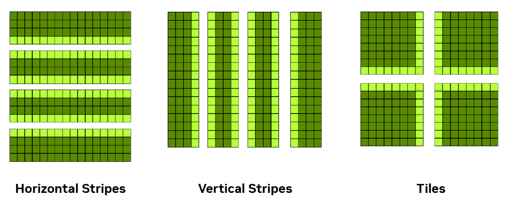

*Figure 6.11 – Common domain decomposition strategies for 2D arrays: horizontal stripes, vertical stripes, and tiles. Horizontal and vertical decompositions are easier to implement and reduce communication overhead. Tiled decompositions provide better load balancing but require more complex data exchange (Image source: Jiri Kraus NVIDIA).*

#### CUDA-aware MPI Jacobi Code

The full implementation, tailored for the ACC partition of MareNostrum 5, is available on the course's GitHub repository. Students are not expected to write the code from scratch, but rather to explore how the concepts covered earlier — especially CUDA-aware MPI — translate into a working program.

A few key implementation details are highlighted below:

- MPI_Sendrecv: Instead of using separate MPI_Send and MPI_Recv calls, this implementation relies on MPI_Sendrecv, which performs both operations in a single step. This reduces the risk of deadlocks and simplifies synchronization. It also improves performance by allowing for more efficient communication patterns between neighboring ranks.

- CUDA Kernel: The core of the computation is performed in the following CUDA kernel, which applies the Jacobi stencil to the portion of the grid assigned to each GPU. The kernel applies the Jacobi step only to the subset of rows assigned to the local process, excluding halo regions.

> 
>
>     __global__ void jacobi_kernel(...) {
>
>         int iy = blockIdx.y * blockDim.y + threadIdx.y + iy_start;
>
>         int ix = blockIdx.x * blockDim.x + threadIdx.x + 1;
>
>         real local_l2_norm = 0.0;
>
>         if (iy < iy_end && ix < (nx - 1)) {
>
>            a_new[iy * nx + ix]= 0.25 * (  a[iy * nx + ix + 1] 
>
>                                         + a[iy * nx + ix - 1] 
>
>                                         + a[(iy + 1) * nx + ix] 
>
>                                         + a[(iy - 1) * nx + ix]);
>
>             }
>
>         }

- Convergence Control and Benchmarking Setup: The main computational loop in the code uses the following structure to control convergence.

> 
>
>     while (l2_norm > tol && iter < iter_max)
>
> Here, the loop continues until the solution converges (i.e., the L2 norm of the update is below a given tolerance). For benchmarking purposes, however, the tolerance is set very low so that the loop runs for a fixed number of iterations (iter_max). This ensures consistent computational load across experiments and allows us to compare performance accurately.

### Running the Jacobi Code

The code used in this case study, which can be found on the book's GitHub repository, is essentially the same as the one presented in the ISC tutorial held last June. It is already prepared to report basic performance metrics such as serial execution time, parallel execution time, speedup, and efficiency for a given number of GPUs.

Take some time to get familiar with the GitHub repository, particularly the key files we briefly describe below.

#### Makefile

The project includes a Makefile, which allows for straightforward compilation by simply issuing the make command. Of particular interest for the experiments in this chapter are the three predefined build targets, each of which sets specific compiler flags for different optimization strategies:

- make optimized: Enables targeted optimizations for atomic operations on floating-point variables.

- make cub: Same as optimized, but also activates the HAVE_CUB macro to compile with support for the CUB library.

- make default: Compiles without any extra optimizations.

You are not expected to modify the Makefile at any point. Instead, you will select the appropriate build target depending on the experiment you are conducting.

#### jacobi.cu

The core source file, jacobi.cu, does not need to be modified. You will simply recompile it with different flags according to the target you choose for each experiment.

Once compiled, the program must be launched using mpirun, specifying both the number of processes (with the -np flag) and the following three arguments:

- -niter: Number of Jacobi iterations to perform (default: 1000)

- -nx: Size of the domain in the x direction (default: 16384)

- -ny: Size of the domain in the y direction (default: 16384)

If you look into the code, you’ll see that each execution performs two separate runs internally: the first simulates the problem using a single GPU, and the second uses the number of GPUs specified via -np. This setup allows the program to report, in one run, the serial time, parallel time, speedup, and efficiency — which are the key metrics we will analyze in this chapter.

#### SLURM script

To carry out the experiments, we will modify a simple SLURM script to collect the necessary data. For example, to evaluate the performance of solving a 16384×16384 problem using 4 GPUs, the following SLURM script can be used:

    #!/bin/bash
    #SBATCH --job-name=jacobi-4gpus
    #SBATCH -o %x_%J.out
    #SBATCH -e %x_%J.err
    #SBATCH --nodes=1
    #SBATCH --time=00:10:00
    #SBATCH --ntasks-per-node=4
    #SBATCH --cpus-per-task=1
    #SBATCH --gres=gpu:4
    #SBATCH --exclusive
    #SBATCH --account=<account>
    #SBATCH --qos=acc_debug

     
    module load nvidia-hpc-sdk/23.11-cuda11.8

    make clean
    make default

    mpirun -np 4 ./jacobi -niter 100000 -nx 16384 -ny 16384

It’s important to always load the necessary modules. In this example, we use the NVIDIA HPC SDK. The call to make clean ensures that any existing executables are removed, and the code is recompiled using the default configuration. While this compilation could be done outside the SLURM script — especially when the binary does not change — we include it here for clarity, ensuring each experiment is self-contained and reproducible.

As discussed in Chapter 4, we continue to use mpirun for compatibility with traditional numerical applications — a choice that remains relevant in many HPC environments.

#### Running Jacobi Solver with 4 GPUs

Once the SLURM script has been submitted, the execution for a grid size of 16384×16384 yields the following result, which can be found in the standard output file:

    16384x16384: 1 GPU:648.9119s, 4 GPUs:165.7268s, speedup:3.92, efficiency:97.89 

As we can see, for this problem size, the execution shows a significant performance improvement when using 4 GPUs (165.7268 seconds) compared to a single GPU (648.9119 seconds). The computed speedup of 3.92 is very close to the theoretical maximum (4), and the efficiency of 97.89% indicates excellent load distribution and efficient utilization of available resources.

>**Task 6.3 – Submit and Validate the First Performance Run**
>
>Download the necessary files from the course’s GitHub repository. Then, construct and submit the appropriate SLURM script to execute the Jacobi Solver for a problem size of 16384×16384 using 4 GPUs.
>
>After the job completes, check the standard error file (.err) to confirm that no execution errors occurred.
>
>If the job ran successfully, locate the performance metrics in the standard output file (.out) and verify that your results match the reference values provided above.
>
>After validating the execution, answer the following:
>
>- Which parts of the execution time are expected to remain constant across runs?
>
>- Which parts could vary, and why?
>
>- Why is it important to establish a baseline before attempting any optimization?
>
>Treat this run as a reference point, not as a performance target.

 

>**Task 6.4 – Understand the Metrics Collection**
>
>Now that you have obtained valid performance results, revisit the Jacobi source code and review how these metrics are collected.
>
>Notice that each execution internally runs two simulations: one using a single GPU and another using the number of GPUs specified via the -np argument.
>
>This design allows the program to compute speedup and efficiency automatically for each execution.
>
>If anything is unclear at this point, don’t hesitate to ask your instructor for guidance.
>
>After reviewing the collected metrics, reflect on the following:
>
>- Which metrics describe outcomes, and which describe causes?
>
>- What aspects of performance are not captured by these metrics?
>
>- Why can relying on a single metric be misleading?
>
>Focus on the interpretative role of metrics rather than their numerical values.

#### Optimizing the code using compilation flags

Optimizing CUDA code is essential to fully exploit the computational power of GPUs. Although we already observed good speedup and efficiency results in the previous section, one natural question arises: can performance still be improved?

The answer is yes. In this section, we explore simple ways to improve performance using nvcc compiler flags.

Some of the most effective optimizations involve passing fine-tuned options directly to the PTX assembler. PTX (Parallel Thread Execution) is NVIDIA’s intermediate assembly language used in CUDA programming. CUDA code is first compiled into PTX instructions, which provide an abstraction layer over the hardware, allowing for optimization across different GPU architectures. PTX instructions are then translated into device-specific machine code, enabling portability and high performance.

In our case study, the compilation flag -Xptxas --optimize-float-atomics allows PTX to optimize atomic operations on floating-point values. These operations are typically expensive, as they must be performed atomically across threads. Optimizing them reduces overhead and boosts parallel efficiency in workloads like ours, where multiple threads frequently update shared memory.

As previously discussed, the Makefile is already prepared for this experiment. Simply use:

    make optimized

within your SLURM script.

Recompiling the code with these flags and running the same workload as before (16384 × 16384 grid with 4 GPUs), we now obtain:

    16384 x16384 : 1 GPU: 191.3045 s, 4 GPUs : 50.8229 s, speedup : 3.76 , efficiency : 94.08%

Compared to the default configuration (648.9119 s with 1 GPU and 165.7168 s with 4 GPUs), this optimized version reduces execution time to less than one third — both for sequential and parallel execution. Although the speedup and efficiency values decrease slightly, this is expected: the speedup is now computed relative to a much faster baseline.

This experiment reinforces a key lesson: compiler flags can have a major impact on performance and should not be overlooked.

>**Task 6.5 – Explore the Effect of Optimized Compilation Flags**
>
>Compile the Jacobi solver using the make optimized target, which enables the -Xptxas --optimize-float-atomics flag.
>
>Run the program with the same configuration as before (grid size 16384 × 16384, using 4 GPUs), and obtain the performance metrics again.
>
>Compare the new results to those from the default build.
>
>After comparing different compilation configurations, answer:
>
>- Which performance improvements are consistent across runs, and which are marginal or unstable?
>
>- At what point does increased compilation complexity stop providing meaningful benefit?
>
>- Why might aggressive compiler optimizations be undesirable in some contexts?
>
>Your answers should distinguish between measurable gains and practical relevance.

#### Optimizing the code using the library CUB

Beyond compiler flags, the CUDA ecosystem offers a wide range of high performance libraries. One example is CUB (CUDA UnBound), a header-only library developed by NVIDIA that provides fast and efficient primitives for block-level parallelism.

To use CUB, we include the following header in the source code:

    #include <cub/block/block_reduce.cuh>

We then update the code to conditionally use CUB primitives by defining the macro HAVE_CUB. The Makefile already handles this, and we can compile the code with:

    make cub

Internally, the code uses conditional compilation to switch between standard CUDA atomics and CUB’s BlockReduce:

        if (calculate_norm) {
    #ifdef HAVE_CUB
            real block_l2_norm = BlockReduce(temp_storage).Sum(
                                 local_l2_norm);
            if (0 == threadIdx.y && 0 == threadIdx.x) 
                atomicAdd(l2_norm, block_l2_norm);
    #else
            atomicAdd(l2_norm, local_l2_norm);
    #endif  // HAVE_CUB
        }

The BlockReduce primitive efficiently performs sum reductions within a block using shared memory, reducing the need for global atomic operations. This approach minimizes contention and improves overall performance.

Let us now evaluate the results with this configuration:

    16384 x16384 : 1 GPU: 178.1372 s, 4 GPUs : 47.4510 s, speedup : 3.75 , efficiency : 93.85%

Compared to the previous experiment using only optimized atomic float operations, the CUB-based version delivers further improvements. The sequential execution time drops from 191.3045 s to 178.1372 s, and the parallel execution time drops from 50.8229 s to 47.4510 s. The speedup and efficiency values also increase slightly.

This confirms the value of high performance libraries like CUB in numerical codes. In many cases, these libraries provide better implementations of common operations than those written manually.

In short, this hands-on has shown how important it is to consider both compilation flags and external libraries when optimizing performance-critical GPU applications.

>**Task 6.6 – Evaluate the Impact of the CUB Library**
>
>Compile the code using the make cub target to enable the use of the CUB library via the -DHAVE_CUB macro.
>
>Run the Jacobi solver with the same problem size (16384 × 16384) and 4 GPUs, and measure the new execution metrics.
>
>Compare the results with those obtained from both the default and optimized builds.
>
>After evaluating the use of the CUB library, reflect on the following:
>
>- What types of operations benefit most from highly optimized library implementations?
>
>- Why can library-based solutions outperform custom code even when they implement the same algorithm?
>
>- What trade-offs are introduced when relying on external optimized libraries?
>
>Focus on abstraction, reuse, and performance portability rather than internal implementation details.

### Performance Benchmarking and Scalability Analysis

Once we have a well-optimized CUDA-aware MPI implementation of the Jacobi solver, it becomes essential to evaluate how performance scales when increasing the number of GPUs and to understand how problem size affects this scalability. This section explores both aspects through a systematic benchmarking campaign.

#### Benchmark Setup

We use three different grid sizes (8192², 16384², and 32768²), which allow us to simulate different levels of computational workload. For each size, we launch executions with 1, 2, 4, 8, 16, and 32 GPUs. The Jacobi code is compiled using the make cub target to benefit from both float-atomic optimizations and the use of the CUB library.

A SLURM script with a nested loop structure automates the experiment:

    make cub

    sizes=(32768 16384 8192)
    tasks=( 2 3 4 5 6 7 8 12 16 24 32)

    for size in "${sizes[@]}"; do
      for np in "${tasks[@]}"; do
        mpirun -np $np ./jacobi -niter 100000 -nx $size -ny $size
      done
    done

The output captures the serial and parallel execution times, along with the calculated speedup and efficiency for each configuration.

#### Execution Time Results

The Figure 6.12 illustrates the execution time as a function of the number of GPUs for the three grid sizes.

| **GPUs** | **32768x32768** | **16384x16384** | **8192x8192** |
|:--------:|:---------------:|:---------------:|:-------------:|
|    1     |    735.2762     |    186.0001     |    47,8084    |
|    2     |    368.7384     |     94.8350     |    25,8286    |
|    4     |    186.6551     |     49.5587     |    14,9914    |
|    8     |     95.7559     |     26.6790     |    9,3924     |
|    16    |     50.1935     |     15.5745     |    6,6131     |
|    32    |     27.9415     |     10.1108     |    4,9353     |

*Table 6.1 – Execution time (in seconds) for three different problem sizes.*

We observe that:

- For the 32768x32768 problem, execution time decreases almost ideally with each GPU doubling.

- The 16384x16384 size scales well up to 8 GPUs but offers diminishing returns afterward.

- The 8192x8192 grid quickly hits a performance ceiling and benefits little beyond 4 GPUs.

#### Parallel Efficiency Trends

To assess how well the available resources are utilized, we plot the parallel efficiency across GPU counts (Figure 6.13).

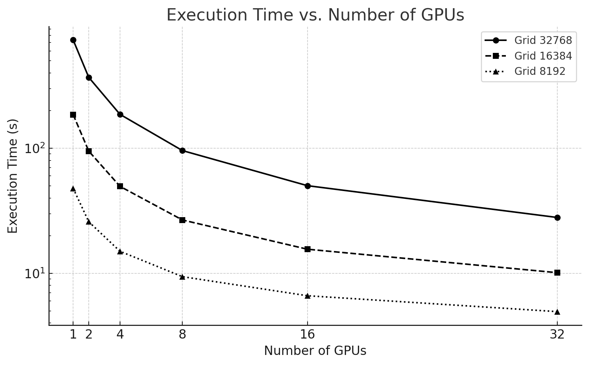

*Figure 6.12 – Execution time of the Jacobi solver using 1 to 32 GPUs for three different problem sizes.*

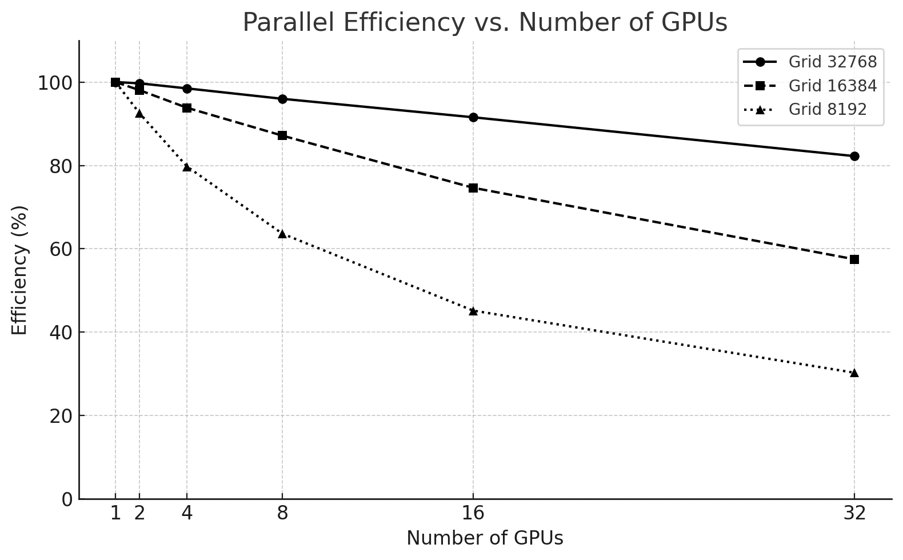

*Figure 6.13 – Parallel efficiency vs. number of GPUs for different problem sizes.*

Key takeaways:

- The 32768² case maintains over 90% efficiency up to 16 GPUs, only dropping to 83% at 32 GPUs.

- The 16384² size starts with excellent efficiency but drops to 57% at 32 GPUs.

- The 8192² problem is not suitable for high GPU counts, with efficiency falling below 40% from 8 GPUs onward.

#### Communication vs. Computation in the Jacobi Solver

Jacobi is a bandwidth-limited algorithm because, in each iteration, every GPU must exchange boundary rows (or columns) with its neighboring processes. This leads to the following key observations:

Although the computation per GPU is relatively simple — consisting only of local stencil updates on the assigned subdomain —

Communication must occur in every iteration and is required before the next iteration can begin.

As the domain is split across more GPUs, the amount of boundary data increases relative to the local work, leading to a higher communication-to-computation ratio. Let us illustrate this with two different problem sizes:

| **GPUs** | **Time (s)** | **Speedup** | **Efficiency (%)** |
|:--------:|:------------:|:-----------:|:------------------:|
|    1     |     47.8     |      1      |        100         |
|    2     |     25.8     |    ~1.85    |       ~92.5        |
|    4     |    14.99     |    ~3.2     |        ~80         |
|    8     |     9.39     |    ~5.1     |        ~64         |
|    16    |     6.61     |    ~7.2     |        ~45         |
|    32    |     4.93     |    ~9.7     |        ~30         |

*Table 6.2 – Speedup and Efficiency for a mesh size 8192x8192.*

| **GPUs** | **Time (s)** | **Speedup** | **Efficiency (%)** |
|:--------:|:------------:|:-----------:|:------------------:|
|    1     |    735.2     |      1      |        100         |
|    2     |    368.7     |    1.99     |        99.5        |
|    4     |    186.6     |    3.94     |        98.5        |
|    8     |     95.7     |    7.68     |         96         |
|    16    |     50.2     |    14.6     |         91         |
|    32    |     27.9     |    26.3     |        82.2        |

*Table 6.3 – Speedup and Efficiency for a mesh size 32768x32868.*

As we can see, for a mesh size 8192x8192 efficiency drops from ~92% with 2 GPUs to just ~30% with 32 GPUs. Why? Because for smaller meshes, the cost of communication dominates the total execution time, and the benefits of parallelism are quickly outweighed by the overhead.

For a mesh size of 32768×32768 the computational load is large enough to amortize the cost of communication, and the solver scales much more efficiently, even across 32 GPUs.

In communication-intensive problems like Jacobi, scaling efficiency depends heavily on the balance between communication and computation**.** When the problem size is too small or the number of GPUs too large, communication overhead outweighs the gains from parallel execution, leading to poor scalability.

#### Analysis and Recommendations

These results provide several practical insights:

- **Scalability depends on problem size**: Larger domains yield better speedups and higher efficiencies because the ratio of computation to communication is higher.

- **Resource efficiency must be monitored**: Requesting more GPUs than necessary can result in poor efficiency and wasted computational resources.

- **Optimal resource allocation varies**:

  - For 32768x32768, use up to 32 GPUs.

  - For 16384x16384, 8–16 GPUs is ideal.

  - For 8192x8192, stay within 4–8 GPUs.

- **Avoid over-parallelization**: Efficiency drops when the communication overhead outweighs the gains in computation. This is particularly relevant in bandwidth-limited problems like Jacobi.

- **CUB and compilation flags matter**: As seen earlier in the chapter, the performance improvement enabled by good compiler flags and libraries carries through all configurations and is key to maximizing scalability.

These benchmarking results offer a valuable lesson: performance tuning in HPC is not just about writing optimized code, but also about understanding when and how to use hardware resources effectively.

Although this case study is rooted in a classical numerical algorithm, the performance phenomena it exposes are directly relevant to modern AI workloads. Distributed training of neural networks relies on the same fundamental mechanisms: domain decomposition (data parallelism), repeated collective communication, synchronization across iterations, and sensitivity to network latency and bandwidth.

In this sense, the Jacobi solver provides a clean and controlled environment to observe how communication overhead, problem size, and GPU count interact—insights that transfer directly to understanding the scalability limits of data-parallel deep learning. The specific algorithm differs, but the performance constraints are fundamentally the same.

## Foundational Performance Principle \#2 

At this point, performance behavior can no longer be explained by algorithmic structure or hardware capabilities alone. The results observed throughout this chapter show that performance depends critically on how computation is expressed, compiled, and mapped onto the underlying architecture.

Up to this point in the chapter, we have repeatedly observed that performance changes dramatically even when the algorithm itself remains unchanged. Different communication libraries, different compiler flags, or different ways of mapping computation to hardware lead to radically different scalability outcomes for the same numerical method.

This leads us to a second Foundational Performance Principle, which emphasizes that performance emerges from the interaction between hardware and software, rather than from isolated optimizations.

### Hardware–Software Co-Design Matters

> **_High performance in modern supercomputing systems does not emerge from optimized code alone, but from the coordinated interaction between hardware capabilities, software abstractions, compilation strategies, optimized libraries, and hardware-supported communication mechanisms._**

The way computation is expressed and executed—through programming models, parallel execution strategies, compiler transformations, library calls, and communication paths—can fundamentally alter performance behavior. In this chapter alone, we have seen how compilation flags, the use of optimized libraries such as CUB, CUDA-aware MPI, and network-aware communication collectively influence scalability and efficiency, even though the underlying algorithm remains unchanged.

On modern accelerators, the effective use (or misuse) of specialized hardware features—such as optimized atomic operations, memory hierarchies, or direct device-to-device communication—can change performance by orders of magnitude. Systems that ignore these hardware–software interactions often remain functionally correct but inefficient, leaving a substantial fraction of available performance untapped.

This principle highlights that performance is an emergent property of hardware–software co-design, not the result of isolated tuning decisions. It will reappear throughout the book, particularly in the context of distributed training, collective communication, and large-scale AI workloads, where software abstractions and system architecture are tightly intertwined.

Unlike other performance principles, hardware–software co-design does not introduce new standalone metrics. Instead, it explains why familiar performance indicators behave the way they do. Achieved throughput relative to hardware peak, memory bandwidth utilization, kernel efficiency, or communication-to-computation ratios are all observable consequences of how well software abstractions align with the underlying hardware architecture.

>**Task 6.7 – Benchmarking the Impact of GPU Count and Problem Size**
>
>In this task, you will reproduce the scalability experiments shown earlier by running the optimized Jacobi solver using 1, 2, 4, 8, and 16 GPUs, and three different problem sizes: 8192×8192, 16384×16384, and 32768×32768.
>
>Your goal is to:
>
>- Modify your SLURM script to include a loop that automates execution over the different combinations of problem sizes and GPU counts.
>
>- Use make cub to compile the optimized code before launching your tests.
>
>- Collect the execution time for each combination from the output files.
>
>- Plot your own charts, One showing execution time vs. number of GPUs for each problem size and another showing speedup vs. number of GPUs for each problem size.
>
>- Analysis and recommendations from your data.
>
>Based on your benchmarking results, answer the following:
>
>- • How does problem size influence the effectiveness of adding more GPUs?
>
>- At what point do additional GPUs provide diminishing returns, and why?
>
>- Why is scaling behavior inseparable from workload characteristics?
>
>Your analysis should emphasize trends and regimes rather than absolute numbers.

## Key Takeaways from Chapter 6

- Modern AI workloads require multi-GPU execution, often across multiple nodes. GPUs such as the NVIDIA H100 are designed not only for high raw compute throughput, but for scalable parallelism, combining massive on-device compute, high-bandwidth memory, and dedicated interconnect technologies.

- The H100 architecture supports extreme intra-GPU parallelism, with 144 Streaming Multiprocessors (SMs), warp-level scheduling, hierarchical memory systems, and specialized units such as Tensor Cores. These architectural features—introduced in Chapter 5—remain fundamental building blocks even as execution scales across GPUs.

- CUDA’s execution model (grids, blocks, threads) provides a portable abstraction that maps efficiently onto GPU hardware. Understanding how warps are scheduled and how blocks are assigned to SMs is essential for both single-GPU performance and multi-GPU scalability.

- Tensor Cores enable orders-of-magnitude acceleration for matrix-dominated workloads. While they can be invoked explicitly via CUDA or CUTLASS, most AI practitioners benefit from them implicitly through optimized libraries such as cuBLAS and cuDNN, provided suitable precision formats (FP16, BF16) are used.

- Memory bandwidth and interconnects are as critical as compute. HBM3 on the H100 delivers multi-terabyte-per-second bandwidth to keep thousands of threads busy, while NVLink enables high-bandwidth, low-latency GPU-to-GPU communication within a node—capabilities that are essential for data-parallel AI workloads.

- PCIe Gen 5 complements but does not replace NVLink. It provides fast CPU–GPU transfers and supports system flexibility, but GPU-to-GPU communication performance relies primarily on dedicated interconnects.

- Scaling beyond a single node shifts the bottleneck from computation to communication. GPUDirect RDMA and CUDA-aware MPI allow GPUs to communicate directly across nodes, bypassing host memory and minimizing latency and overhead.

- NCCL is the de facto standard for collective communication in AI training. By operating directly on GPU memory, integrating computation and communication, and adapting to hardware topology (NVLink, PCIe, InfiniBand, NVSwitch), NCCL enables efficient data-parallel training at scale—but it cannot compensate for insufficient network bandwidth or high latency.

- Collective communication amplifies network effects. Latency, jitter, and packet loss directly impact scalability, making the quality of the interconnection fabric a decisive factor in large-scale AI systems.

- The Jacobi case study provides a controlled proxy for understanding AI scaling behavior. Although not an AI workload, it exposes the same fundamental performance phenomena: domain decomposition, halo exchange, synchronization, and the trade-off between computation and communication.

- Benchmarking confirms that scalability depends on problem size. Larger problems amortize communication overhead more effectively, while over-parallelization leads to diminishing returns and poor efficiency—an explicit manifestation of Foundational Performance Principle \#1: Amortization of Overheads.

- Performance emerges from hardware–software co-design. Compiler flags, optimized libraries (such as CUB), communication mechanisms, and hardware topology jointly determine performance, reinforcing Foundational Performance Principle \#2: Hardware–Software Co-Design Matters.

- Effective performance tuning is a system-level activity. It requires not only optimized kernels, but informed choices about GPU count, problem size, communication libraries, and network architecture.

[^1]: https://resources.nvidia.com/en-us-tensor-core/gtc22-whitepaper-hopper

[^2]: https://developer.nvidia.com/blog/nvidia-hopper-architecture-in-depth/

[^3]: https://developer.nvidia.com/blog/nvidia-hopper-architecture-in-depth/

[^4]: https://developer.nvidia.com/blog/introduction-cuda-aware-mpi/

[^5]: https://developer.nvidia.com/blog/author/jkraus/

[^6]: https://en.wikipedia.org/wiki/Jacobi_method

[^7]: https://github.com/FZJ-JSC/tutorial-multi-gpu

[^8]: Horizontal stripes are generally better for C programs because they take full advantage of C’s row-major memory layout, providing more efficient memory access and better cache performance.
