# Neural Networks: Concepts and First Steps

This chapter introduces neural networks from a systems-oriented perspective, combining conceptual foundations with a first hands-on experience.

We begin by placing modern neural networks in historical context, showing how advances in data, algorithms, and computing power have shaped today’s AI landscape. We then introduce the role of machine learning frameworks as the software interface between abstract models and high performance computing systems.

Building on this context, the chapter develops the fundamental building blocks of neural networks—artificial neurons, activation functions, and simple network architectures—before culminating in the practical training of a first neural network using TensorFlow.

In this book, TensorFlow is introduced first as a pedagogical vehicle. Its structured APIs and high-level abstractions make it well suited for developing intuition about neural network training, allowing the reader to focus on concepts rather than implementation details.

The choice of TensorFlow at this stage does not imply a preference for a particular framework, but reflects its effectiveness as an instructional tool for building foundational understanding.

By the end of the chapter, the reader will have progressed from high-level concepts to a concrete, executable model, establishing a foundation that will be extended and scaled in subsequent chapters.

This chapter is designed as an entry point for readers with a strong systems or HPC background who may be encountering deep learning frameworks for the first time. Readers already familiar with neural networks may skim this chapter or proceed directly to later chapters focused on scalability and performance.

## The Rise of AI and the Role of Supercomputing

Today, AI is often portrayed as a field driven by algorithmic genius and data abundance. While both are true, a third factor is often underappreciated: computational power. In fact, without exponential growth in computing performance, much of modern AI would have remained theoretical.

AI has been dreamed about since the 1950s, but it wasn't until recently that the hardware caught up to the ambition. Early symbolic AI systems were constrained by the computers of their era. Only with the advent of powerful processors, parallel architectures, and eventually supercomputers did AI begin to deliver on its promises. This is especially true for techniques like deep learning, which depend heavily on massive matrix operations and require high memory bandwidth and compute throughput.

### How Humans Created the First AI: The Knowledge Paradigm

#### Ancient Inspirations and Mechanical Reasoning

Artificial Intelligence is the outcome of countless human intelligences brought together over time. While the idea of creating intelligent machines has existed for centuries, it wasn't until the mid-20th century that scientists began to formulate clear visions and definitions of what AI could become.

The origins of intelligent machines can be traced back to ancient civilizations. Over 2,300 years ago, Aristotle suggested that human reasoning could be codified into rules. Centuries later, Ramon Llull, a polymath from Mallorca, envisioned a mechanical device called the "Ars Magna" capable of producing logical demonstrations using rotating wheels and predefined rules. Though rudimentary, it marked the first attempt to use logic in mechanical reasoning.

#### The Dawn of Computing and the First Algorithms

In 1837, English mathematician Charles Babbage proposed the Analytical Engine, a machine designed for complex calculations. While never fully built, it laid the groundwork for modern computing with concepts like memory, input/output, and a central processor. Ada Lovelace, a mathematician and writer, foresaw that such machines could go beyond arithmetic and even perform creative tasks. Her published notes included what is now considered the first algorithm.

An algorithm, in its essence, is a sequence of instructions given to a machine, covering all the possible scenarios it might face in a task. Much like a recipe, the machine follows these steps to reach a result. This type of computation defined the early development of AI.

#### Alan Turing and the Birth of Theoretical AI

One of AI's true pioneers was Alan Turing. Known widely for breaking the Enigma code during World War II, Turing was also a theoretical computer scientist. In 1936, he laid the foundations for theoretical computing by defining what could be computed algorithmically. In 1950, he published "Computing Machinery and Intelligence," proposing the now-famous Turing Test to evaluate machine intelligence. If a machine's responses were indistinguishable from a human's, it could be considered intelligent.

Although the Turing Test captivated philosophers and the public, it was less relevant within the AI research community, which focused more on practical utility than on imitation.

#### From Dartmouth to Symbolic AI

The coining of the term "Artificial Intelligence" is credited to John McCarthy in 1956 during a seminal conference at Dartmouth College, which gathered figures like Marvin Minsky and Claude Shannon. It aimed to unify efforts in cybernetics, automata theory, and information processing.

During the following decades, the progress of AI closely followed advances in computing. Digital computers became more powerful, and institutions began funding AI research. The 1970s saw the rise of symbolic AI and expert systems. These systems used human-coded rules to mimic reasoning—a paradigm known as knowledge-based AI. However, this golden age gave way to the first AI winter due to unmet expectations and the limited computational capabilities of the time.

#### Deep Blue: The Height of Knowledge-Based AI

In the 1980s, a resurgence in AI came through renewed interest in expert systems, particularly in commercial applications like medical diagnosis and circuit design. This era culminated in a landmark event: the victory of IBM's Deep Blue over world chess champion Garry Kasparov.

Deep Blue was a specialized expert system designed specifically to play chess. It incorporated handcrafted rules provided by chess masters, including Spanish grandmaster Miguel Illescas. Built with custom hardware, it could evaluate 200 million chess positions per second. After its initial defeat to Kasparov in 1996, an improved version won in 1997, marking AI's entry into public consciousness.

This victory, however, also illustrated the limitations of symbolic AI. Deep Blue was an incredibly narrow system. It could play chess but was useless for even the simplest of other tasks. Furthermore, its development required immense financial and human resources for a single application.

#### The Decline of Symbolic AI and the Need for a New Paradigm

This approach to AI, built on logic, inference rules, and symbolic reasoning, formed what we now call the knowledge paradigm. These systems relied on manually coded "if-then" rules, logical inference engines, and sometimes heuristic functions. While powerful for structured problems, they lacked flexibility and scalability.

By the early 2000s, symbolic AI had reached its limits, leading to a second AI winter. It wasn’t until the rise of new hardware, data abundance, and algorithmic advances that AI found its second wind—a transformation covered in the next section of this chapter.

### How AI Began Learning from Humans: The Data Paradigm

After initial progress using symbolic systems, Artificial Intelligence reached a standstill. Knowledge-based systems relied heavily on human engineers to explicitly encode expertise into algorithms. This made them costly, inflexible, and ultimately unable to leverage the vast reservoirs of latent knowledge present in raw data. A new paradigm was needed—one in which machines could learn directly from data rather than human-defined rules.

#### The Emergence of Data-Driven AI

The knowledge paradigm worked well when we could clearly specify rules and procedures. But many problems resist such formalization. For instance, how would you write precise instructions to detect cats in photos? Due to the vast variability in how cats appear—positions, lighting, angles—a symbolic system would fail to generalize.

The data paradigm reversed the approach: instead of programming the rules, we feed the AI many examples and let it learn the patterns. For instance, by labeling thousands of photos as either "cat" or "not cat," we allow the AI to discover for itself the distinguishing features of felines.

This shift marked the rise of machine learning, and more specifically, neural networks—a set of algorithms loosely inspired by how animal brains process information. We teach the AI *what* to do (e.g., classify cats), but not *how* to do it.

This approach traces back to the work of Frank Rosenblatt in the 1950s, who developed early models of neural networks based on biological neurons. His ideas laid the foundation for systems that could learn from data without explicit programming.

AI's most valuable capability became learning: the ability to extract and acquire knowledge from experience, even when humans couldn’t articulate it. Much like a child learns through examples and repetition, neural networks learn by identifying patterns in vast datasets.

#### The Three Pillars: Data, Algorithms, and Compute

By the early 2010s, all three drivers of AI evolution advanced in tandem:

- The rise of the internet and Web 2.0 created an explosion of user-generated data.

- Algorithmic innovations revived and improved neural network architectures.

- Computing power surged with the adoption of GPUs—hardware initially developed for gaming but perfectly suited for neural network training.

Unlike CPUs, GPUs could perform thousands of operations in parallel, enabling the training of deep neural networks at a feasible cost and time. This convergence reached a pivotal moment in 2012.

#### The 2012 Breakthrough: ImageNet and AlexNet

ImageNet was an annual visual recognition competition where AI systems were asked to classify over a million labeled images into 1,000 categories. Until 2012, traditional computer vision techniques dominated the leaderboard. That year, a team from the University of Toronto led by Geoffrey Hinton, Alex Krizhevsky, and Ilya Sutskever submitted a model called AlexNet—a deep neural network trained using two NVIDIA GPUs. Their model outperformed all others by a wide margin.

This moment marked the rebirth of neural networks and established data-driven AI as a practical and superior approach. From then on, GPUs became standard in AI labs worldwide, leading to breakthroughs in image recognition, speech understanding, and natural language processing.

The shift was transformative: AI systems no longer depended on human-coded knowledge, but instead derived it directly from data. Engineers built general-purpose algorithms that improved through experience, making them more adaptable and less reliant on human oversight.

#### A New Milestone: AlphaGo Defeats the Go Champion

Much like Deep Blue had symbolized the peak of symbolic AI, AlphaGo became the emblem of the data-driven paradigm.

Developed by DeepMind, AlphaGo learned from thousands of real human-played Go games. It also used reinforcement learning to optimize moves through self-play. In 2016, it famously defeated world champion Lee Sedol in a landmark victory.

The implications were global. In China, AlphaGo’s success was a wake-up call that spurred massive investment in AI as a matter of national strategic importance.

AlphaGo proved that data-driven AI could surpass human intelligence in domains previously thought immune to automation. The paradigm had changed for good.

### When AI Learned from Experience: The Reinforcement Paradigm

#### From Data to Discovery Through Interaction

Once artificial intelligence systems began learning from data, it was only a matter of time before researchers asked a new question: could machines learn by themselves, without being explicitly provided data? This led to a novel research avenue—reinforcement learning—a framework where AI systems learn through interaction and feedback, much like humans learning from experience.

The idea mirrors how a child learns about the world: by exploring, making mistakes, and adjusting behavior based on outcomes. Reinforcement learning captures this idea computationally: the AI is not told what to do, but must figure out how to act in order to achieve maximum reward.

#### Reinforcement Learning: Learning by Trial and Error

In reinforcement learning, the system interacts with its environment, testing different strategies and learning from success or failure. It doesn’t require labeled datasets. Instead, it learns what actions maximize reward over time through trial and error.

Consider chess. A self-learning AI would play both sides of the board repeatedly, gradually adjusting its strategies based on wins and losses. The goal is to learn to win—not by being told how, but by discovering effective strategies through repeated experience.

Researchers at DeepMind adopted this approach to build a general-purpose AI capable of learning to play chess, Go, and shogi (Japanese chess) from scratch. The system started with no prior knowledge beyond the rules. It improved by playing millions of games against itself, updating its neural network as it identified increasingly successful moves.

This self-play paradigm did away with curated data or expert demonstrations. But it came at a price: immense computational demand. Generating and evaluating millions of games required extraordinary hardware. Parallel accelerators, high performance computing clusters, and distributed architectures—hallmarks of supercomputing—became essential.

#### AlphaZero: A Machine That Taught Itself

The breakthrough came in 2018 when DeepMind announced AlphaZero, an AI that taught itself to master chess, shogi, and Go purely through reinforcement learning. Unlike AlphaGo, which was trained on human gameplay, AlphaZero learned exclusively from self-play.

It leveraged a powerful new type of hardware: Google’s custom Tensor Processing Units (TPUs), optimized for machine learning. These chips allowed AlphaZero to play and analyze games at massive scale.

Remarkably, AlphaZero developed a creative and unorthodox playing style, one not seen in traditional human strategies. It didn’t mimic grandmasters—it discovered its own insights, demonstrating that machines could generate knowledge beyond existing human expertise.

The success of AlphaZero wasn’t just about games. DeepMind had larger ambitions: to use general-purpose reinforcement learning systems to tackle complex real-world problems.

#### Beyond Games: Reinforcement Learning in the Real World

Why games? According to Oriol Vinyals  games offer a controlled, repeatable environment with clear objectives—ideal for testing ideas rapidly. But the aim has always been broader.

A striking example came in 2020 with AlphaFold, a breakthrough system inspired by reinforcement learning principles. AlphaFold predicted the 3D structure of proteins based solely on amino acid sequences—a long-standing challenge in biology. Traditional methods for determining protein folding were slow and computationally expensive, often taking years of supercomputer time.

AlphaFold changed that. It accurately predicted the structure of nearly all known proteins and made the results publicly accessible, accelerating research in drug discovery and disease treatment. This achievement marked a turning point in biomedical science and earned its creators global recognition.

#### Reinforcement Learning’s Role in AI’s Future

Reinforcement learning has proven itself not only in strategy games but also in life sciences, robotics, and even language models. It plays a central role in training systems like GPT, the model behind ChatGPT. OpenAI’s John Schulman, one of the creators of GPT, applied reinforcement learning techniques to fine-tune language models and align them with human preferences.

This paradigm shift—from data-driven learning to experience-driven learning—opened the door to a new kind of AI: systems that explore, adapt, and evolve through interaction. While we don’t yet know the limits of this technology, we do know it’s fueling the next wave of AI breakthroughs.

### When AI Began to Create: The Generative Paradigm

#### The Rise of Generative AI

The notion of creative machines took center stage when models like DALL·E and ChatGPT stunned the public by generating images, poems, code, and conversations from simple prompts. While creativity has long been considered a uniquely human trait, these systems challenged that assumption. Some see them as creative agents; others argue they are merely recombiners of human-generated data. What’s clear is that they introduced a new paradigm: generative AI.

#### From Text-to-Image to Text-to-Anything

In 2021, OpenAI released DALL·E, capable of generating images from text prompts. It was trained on millions of captioned images. Then came ChatGPT—a fine-tuned version of GPT-3—capable of engaging in surprisingly coherent and humanlike conversations. Within two months of its late-2022 launch, ChatGPT reached 100 million users, becoming the fastest-growing consumer app in history.

These models aren’t just novelties. They are shifting the way we produce content. From text to image to sound, the emergence of multimodal AI is transforming creativity across domains. Leading tech companies are now racing to develop even more powerful, domain-specific generative tools.

#### Building ChatGPT: Language Models at Scale

The foundation for ChatGPT was laid by the GPT series. Starting in 2018 with GPT-1 (117 million parameters), followed by GPT-2 (1.5 billion), GPT-3 (175 billion), and eventually GPT-4, OpenAI scaled up transformer-based models with ever-larger datasets and compute.

These models use a mechanism called attention to learn relationships between words in context. Their goal is simple yet powerful: to predict the next word in a sequence. By doing this billions of times during training, they effectively compress vast amounts of textual information into parameters.

The analogy to data compression is apt: just as a compressed file contains a representation of the original, a trained model encodes a statistical summary of its training corpus. During inference, the model decodes this compressed representation to generate plausible continuations.

#### Human Feedback, Reinforcement, and Adaptation

A crucial leap came with ChatGPT’s training: reinforcement learning from human feedback (RLHF)  . Instead of learning solely from internet text, the model was fine-tuned using preferences and corrections provided by human annotators. This made responses more helpful and less toxic—but also showed how dependent these models still are on human oversight.

Even GPT-4, which accepted both text and image inputs, suffered from hallucinations and biases. Training large generative models remains an iterative, human-in-the-loop process—despite their apparent autonomy.

#### Scaling Generative AI: The Brute Force Factor

Generative AI is inseparable from massive compute infrastructure. The transition from GPT-2 to GPT-3 required an exponential increase in compute. Systems like Google's multilingual translation model, with 600 billion parameters, needed the equivalent of 22 years of TPU time—shortened to four days using 2,048 TPU chips in parallel povered by a inmens supercomputer.

As computational needs double every few months, large-scale supercomputers have become essential. Such machines are purpose-built to train billion-parameter models on immense datasets. For example, Google’s PaLM (Pathways Language Model) with 540 billion parameters, its training used over 6,000 TPU chips across weeks of computation.

Models like Grok-3 from xAI (2025) and Gemini 2.5 Pro from Google DeepMind have pushed this brute-force paradigm to unprecedented heights. Grok-3, with a sparse mixture-of-experts (MoE) architecture totaling 1.8 trillion parameters, is estimated to have required over 5 × 10²⁶ FLOPs for training—making it the most compute-intensive model developed to date. It ran on a staggering 100,000 NVIDIA H100 GPUs. Meanwhile, Gemini 2.5 Pro utilized a more modest 128B MoE architecture and consumed 5.6 × 10²⁵ FLOPs. These examples reflect a growing trend: scaling generative AI now depends less on algorithmic breakthroughs and more on access to extreme-scale supercomputing. We will talk more about this in the last chapter of the book.

## ML Frameworks as the Software Interface to Supercomputing 

Modern machine learning systems are built on top of a rich software stack that connects high-level models with highly optimized computational infrastructure. In this book, we focus primarily on two frameworks—*TensorFlow* and *PyTorch*—which currently dominate both research and production environments. Before using them in practice, it is important to understand *what role these frameworks play* and *why they are central to modern AI systems*.

Rather than viewing TensorFlow and PyTorch as isolated programming tools, it is more accurate to see them as *middleware layers* that bridge the gap between abstract machine learning models and the underlying supercomputing hardware. They encapsulate decades of progress in numerical computing, parallel programming, and hardware acceleration, providing a unified interface through which complex AI workloads can be expressed and efficiently executed.

### From Numerical Libraries to Machine Learning Frameworks

At their core, machine learning computations are dominated by linear algebra operations: matrix–matrix multiplications, matrix–vector products, reductions, and element-wise transformations. These operations have long been the focus of high performance computing research and have traditionally been implemented in optimized numerical libraries such as BLAS and LAPACK.

As discussed in earlier chapters, these libraries were designed to extract maximum performance from evolving hardware architectures, from vector processors to multi-core CPUs and, more recently, GPUs and other accelerators. Modern machine learning frameworks build directly on these foundations. Rather than reimplementing numerical kernels from scratch, they rely on highly optimized backends—often provided by hardware vendors—to perform the most computationally intensive operations.

This layered approach allows frameworks to expose high-level abstractions while still achieving near–peak hardware performance, a key requirement for training and deploying large-scale neural networks.

### TensorFlow and PyTorch as De Facto Standards

One of the defining contributions of modern machine learning frameworks is the introduction of *higher-level abstractions* that hide much of the complexity of numerical computation and parallel execution. Instead of explicitly managing matrix operations, memory transfers, or synchronization, users describe models in terms of layers, loss functions, and optimization procedures.

Frameworks such as TensorFlow and PyTorch automatically translate these high-level descriptions into sequences of optimized low-level operations. This includes constructing computational graphs, performing automatic differentiation to compute gradients, and orchestrating execution across available hardware resources.

From a systems perspective, this abstraction significantly improves developer productivity while preserving performance. It allows researchers and engineers to focus on model design and experimentation without sacrificing access to advanced hardware capabilities.

Although many machine learning frameworks have been proposed over the years, TensorFlow and PyTorch have emerged as the de facto standards for modern AI development. Both support a wide range of models, hardware platforms, and execution modes, from single-device experimentation to large-scale distributed training on supercomputers.

TensorFlow was originally developed with a strong emphasis on production deployment and large-scale systems. Its design introduced the concept of computational graphs to represent machine learning workloads, enabling global optimization, efficient execution planning, and deployment across diverse environments. Over time, TensorFlow has evolved to support more flexible execution models while retaining its strengths in performance optimization and production readiness.

PyTorch, in contrast, emerged from the research community with a focus on flexibility, ease of use, and rapid experimentation. Its dynamic execution model allows computational graphs to be constructed and modified at runtime, closely aligning model definition with standard Python control flow. This approach has made PyTorch particularly attractive for research and prototyping, while continued development has expanded its capabilities for large-scale and production workloads.

Despite these differences, both frameworks serve the same fundamental role: translating high-level model descriptions into efficient sequences of numerical operations that can be executed on modern hardware accelerators.

In this book, we use these two frameworks as representative examples of the current state of the art. They provide a practical entry point for understanding how neural networks are expressed, trained, and scaled in real systems. Importantly, the concepts introduced through these frameworks—such as computational graphs, automatic differentiation, and data-parallel training—generalize beyond any specific software implementation.

### Connection to Supercomputing Systems

The relevance of TensorFlow and PyTorch to supercomputing becomes especially clear when considering their integration with parallel execution models and high performance communication libraries. Under the hood, these frameworks leverage technologies such as multi-threading, GPU acceleration, and collective communication to scale computations across multiple devices and nodes.

As we will see in later chapters, advanced features such as distributed training rely on the same principles introduced earlier in this book: parallel decomposition, efficient data movement, and synchronization across processes. In this sense, modern machine learning frameworks can be viewed as the latest evolution of high performance computing software, tailored to the specific demands of AI workloads.

By introducing TensorFlow and PyTorch at this point, we establish the software context for the neural network concepts that follow. These frameworks will serve as the practical foundation for the examples and experiments presented throughout the remainder of this book.

## An Artificial Neuron

In the previous section, we introduced modern machine learning frameworks as the software layer that connects abstract models with high performance computing infrastructure. These frameworks allow complex learning algorithms to be expressed concisely while relying on highly optimized numerical and parallel execution engines underneath.

To understand what these frameworks actually execute, we now shift our focus to the *fundamental computational building block of neural networks: the artificial neuron*. While real-world models consist of millions or even billions of such units, their behavior is rooted in a simple mathematical formulation.

An artificial neuron can be viewed as a parametric function that combines multiple input values through a weighted linear transformation followed by a nonlinear activation. This abstraction provides a compact and flexible way to model relationships between inputs and outputs, and it forms the basis for more complex network architectures introduced later in this chapter.

From a systems perspective, the importance of this simple model cannot be overstated. The linear transformations and element-wise operations that define an artificial neuron map directly onto the optimized numerical kernels and parallel execution mechanisms discussed earlier. Modern frameworks automatically translate these high-level mathematical descriptions into sequences of matrix operations that can be efficiently executed on CPUs, GPUs, and distributed systems.

With this connection in mind, we begin by introducing the mathematical structure of a single artificial neuron before progressively building toward multi-layer networks and practical training workflows.

### A Basic Deep Learning Example

To introduce the concept of neural networks, we will start with a hands-on example. In this section, we present the dataset we will use for our first neural network experiment: the MNIST dataset, which contains images of handwritten digits.

The MNIST dataset, which can be downloaded from the official MNIST database page, consists of grayscale images of handwritten digits. It includes 60,000 training examples and 10,000 test examples, making it ideal for a first approach to pattern recognition techniques without requiring excessive time in data preprocessing and formatting—two crucial and often expensive steps in data analysis, especially when working with images. This dataset only requires a few minor transformations, which we will describe shortly.

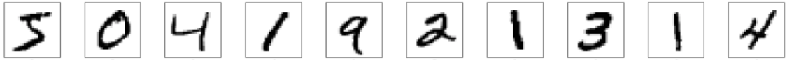

Figure 7.1 – Sample handwritten digits from the MNIST dataset.

The original images are in black and white, normalized to 20 × 20 pixels while preserving their aspect ratio. It’s important to note that the images contain grayscale levels due to the anti-aliasing technique used during normalization (i.e., reducing the resolution of the original images). These 20 × 20 images are then centered within a 28 × 28 pixel frame. This is done by computing the center of mass of the digit and translating the image so that this point aligns with the center of the 28 × 28 grid. A representative group of these images is shown in Figure 7.1.

Each image is represented internally as a matrix containing the intensity values of each of the 28 × 28 pixels, with values ranging from 0 to 255. For instance, Figure 7.2 shows the eighth image in the training set, and Figure 7.3 displays the corresponding matrix of pixel intensities.

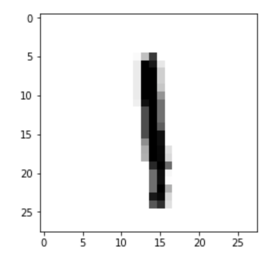

Figure 7.2 – The eighth sample from the MNIST training set.

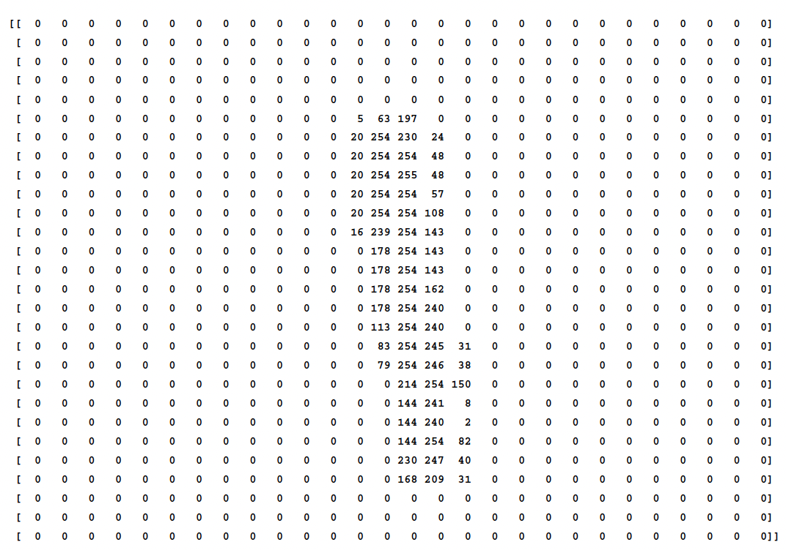

Figure 7.3 – Pixel intensity matrix of the 28 × 28 image in Figure 7.2, with values ranging from 0 to 255.

This is a classification task: given an input image, the model must classify it as one of the digits from 0 to 9. However, since the digits are handwritten, some ambiguity may arise. For example, the first image in the dataset might represent a 5—or perhaps a 3? This potential uncertainty is illustrated in Figure 7.4.

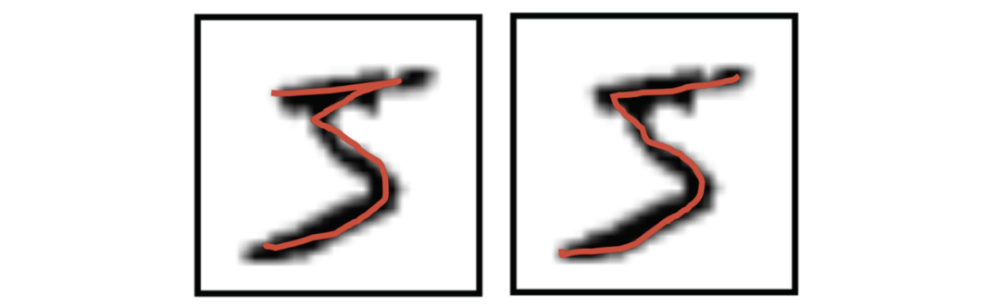

Figure 7.4 – The first digit in Figure 7.1 most likely represents a 5, but there is a reasonable chance it could be interpreted as a 3.

To account for this kind of uncertainty, we can design the neural network model to return a vector of 10 values instead of a single number. Each value represents the model’s predicted probability for a specific digit class. This approach enables the model to express uncertainty in its prediction. In the case of Figure 7.4, the model might assign a 70% probability to the digit being a 5 and a 30% probability to it being a 3. This is illustrated in Figure 7.5:

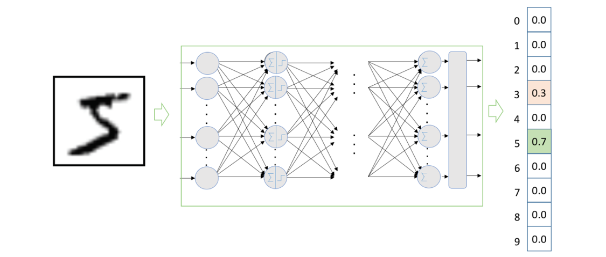

Figure 7.5 – The neural network we will design in this chapter returns a vector with 10 values. Each position indicates the predicted probability for the corresponding digit. This makes it possible to express some level of uncertainty in classification, such as in Figure 7.4, where the model assigns a 70% likelihood to the digit being a 5 and 30% to it being a 3.

To simplify the problem, we will transform each input image from its original two-dimensional form into a one-dimensional vector. Specifically, a 28 × 28 pixel matrix will be flattened into a 784-element vector (by concatenating the rows), which is the format expected by a fully connected neural network like the one we will build in this chapter.

Finally, we represent the label of each image as a vector of 10 elements using one-hot encoding. In this encoding, the position corresponding to the correct digit is set to 1, and all other positions are set to 0. For example, the digit 5 is encoded as \[0. 0. 0. 0. 0. 1. 0. 0. 0. 0.\].

### Introduction to Basic Terminology and Notation

Before proceeding, we will present a brief introduction to essential terminology (based on standard machine learning vocabulary), which will help us structure the concepts introduced in this chapter and provide a consistent framework for presenting the basics of deep learning gradually and effectively.

In the context of our working example, we will use the term sample (also called input, example, instance, or observation—depending on the author) to refer to one of the data points that make up the input dataset—in this case, one of the MNIST digit images. Each of these samples contains a set of characteristics (also referred to as attributes or variables), which in English are commonly called features.

The class label or simply label refers to what we are trying to predict with the model.

A model defines the relationship between the features and labels of a dataset. In the context of supervised learning, model development typically involves two distinct phases:

- Training phase: This is when the model is created or “learned” by exposing it to labeled data—samples for which both the input features and the corresponding labels are known. The model adjusts its internal parameters iteratively in order to learn the relationships between features and labels.

- Inference (or prediction) phase: This is when the trained model is used to make predictions on new, unseen samples for which the label is not known. The goal is to estimate the most likely label given the input features.

To keep notation both simple and effective, we will use some basic concepts from linear algebra. A straightforward way to express a model that defines a linear relationship between input features and output labels for a given sample is as follows:

y=wx+b

where:

- *y* is the label (or target) corresponding to a given input sample.

- *x* represents the features (or input variables) of the sample.

- *w* is the slope of the line, which we generally refer to as a weight. It is one of the two parameters that the model needs to learn during training in order to be used later during inference.

- *b* is called the bias. This is the second parameter that the model must learn, alongside the weights.

Although the simple model we have introduced so far considers only one input feature, in the general case, each input sample may contain multiple features. In that case, each feature is associated with its own weight, denoted as wi. For example, in a dataset where each input sample has three features (x1,x2,x3), the previous algebraic expression can be extended as follows:

y=w1x1+w2x2+w3x3+b

That is, the dot product (inner product) of the two vectors (w1,w2,w3) and (x1,x2,x3), followed by the addition of the bias term:

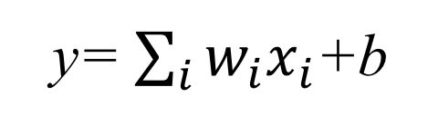

Following the standard algebraic notation used in machine learning—which will be helpful throughout the book to simplify explanations—we can express this equation as:

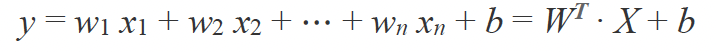

To make the formulation more concise, the bias term *b* is often incorporated into the weight vector as an additional parameter *w0*, assuming a fixed input feature x0=1 for each sample. This allows us to simplify the expression further as:

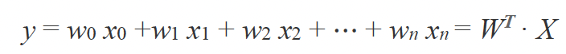

In our MNIST digit classification example, we can treat each pixel (or bit) as an input feature. Thus, the input vector x has n=784 features (since the image is 28 × 28 pixels), and *y* is the label assigned to the input sample, corresponding to a class between 0 and 9.

For now, we can think of the training phase of a model as the process of adjusting the weights *w* using the training samples, so that once the model is trained, it can correctly predict the output label when given new input data.

### Regression Algorithms

To build on what we introduced earlier, it is helpful to briefly review classical machine learning approaches to regression and classification, since these form the conceptual foundation for our later discussions on deep learning.

At a high level, regression algorithms aim to model the relationship between a set of input variables (called features) and an output variable, by minimizing a certain error metric known as the loss function—a concept we will explore in detail in the next chapter. This optimization is typically done through an iterative process, with the goal of producing predictions that are as accurate as possible.

We will focus on two main types of regression models:

- Linear regression, used when the output variable is continuous.

- Logistic regression, used when the output variable is discrete (i.e., a class label).

The key difference between them lies in the type of output they produce:

- Linear regression predicts real-valued outputs (e.g., house prices, temperatures).

- Logistic regression predicts probabilities for class membership, making it suitable for classification tasks.

Logistic regression is a supervised learning algorithm commonly used for classification problems. In our upcoming example, we will apply logistic regression to solve a binary classification task, where the goal is to determine which of two possible classes (0 or 1) an input sample belongs to.

### A Simple Artificial Neuron

To illustrate how a basic neuron works, let us consider a simple example. Imagine we have a set of points on a two-dimensional plane, where each point is labeled as either a "square" or a "circle" as shown in Figure 7.6.

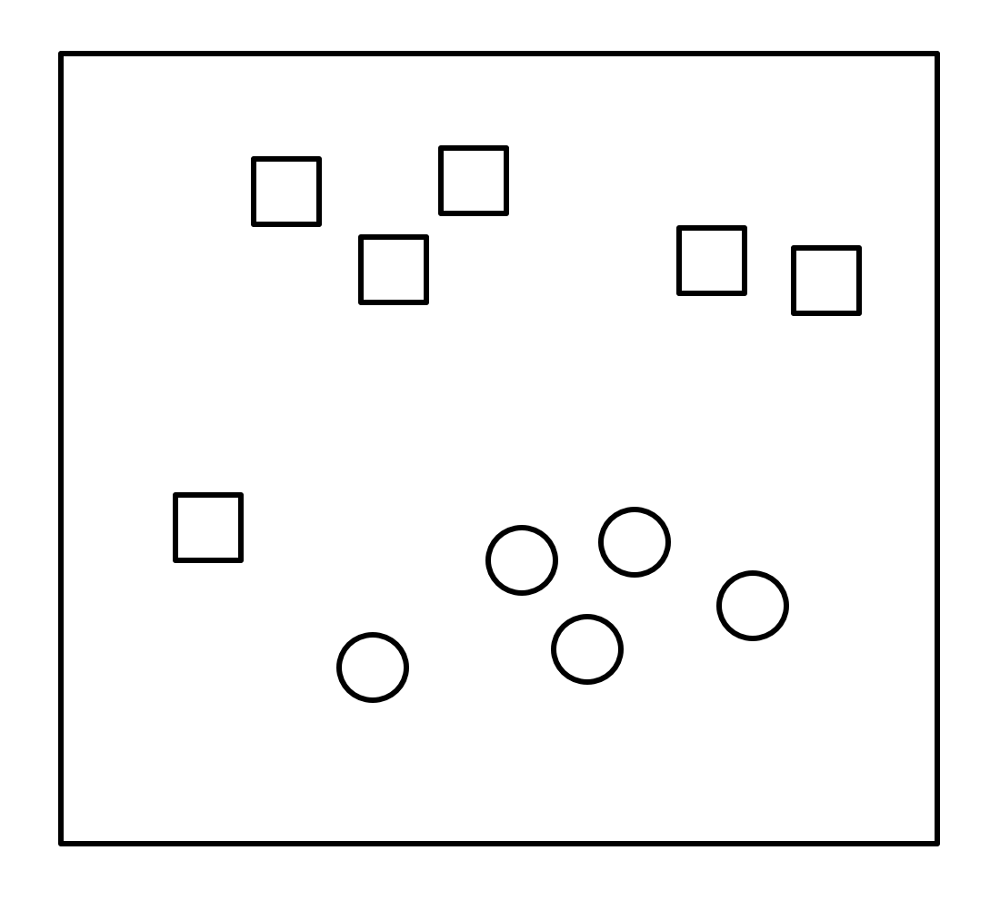

Figure 7.6 – Visual example of a 2D plane containing two types of labeled samples to be classified.

Now, given a new point "X", we want to determine which label it should receive (see Figure 7.7).

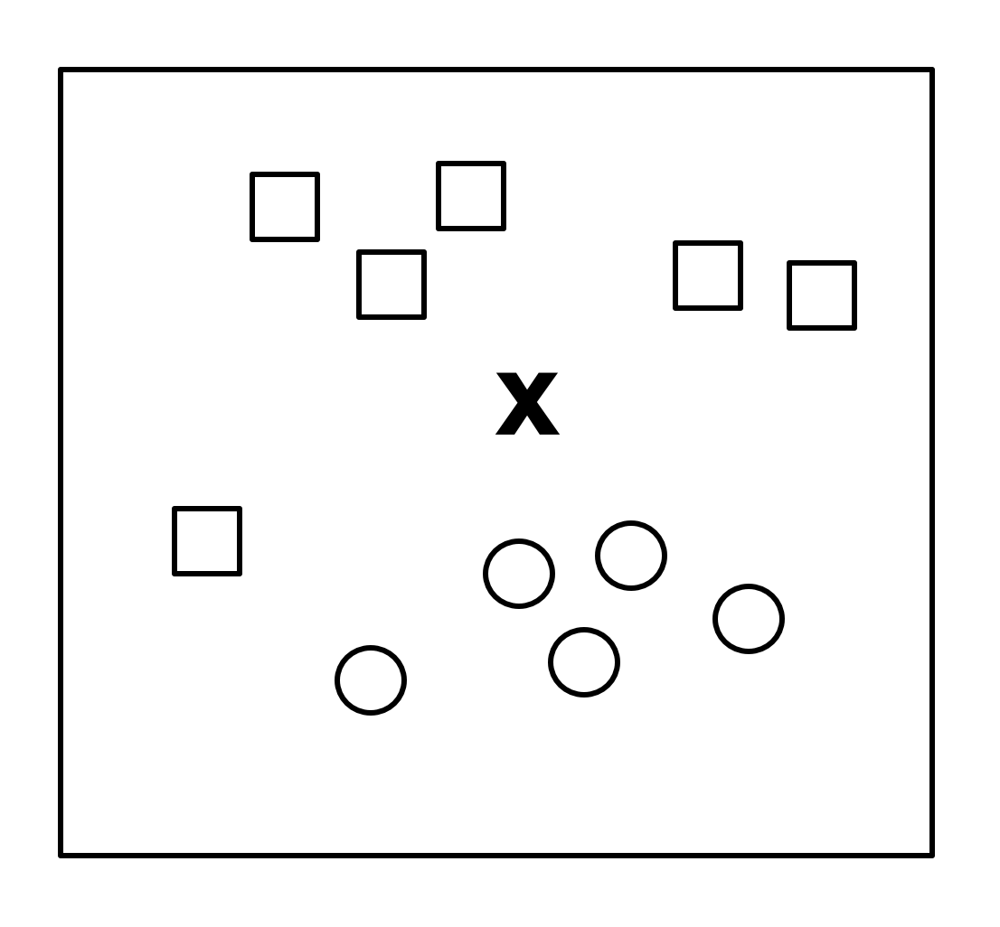

Figure 7.7 – Previous example with a new point to classify.

A common approach is to find a line that separates the two groups and use it as a classifier, as shown in Figure 7.8:

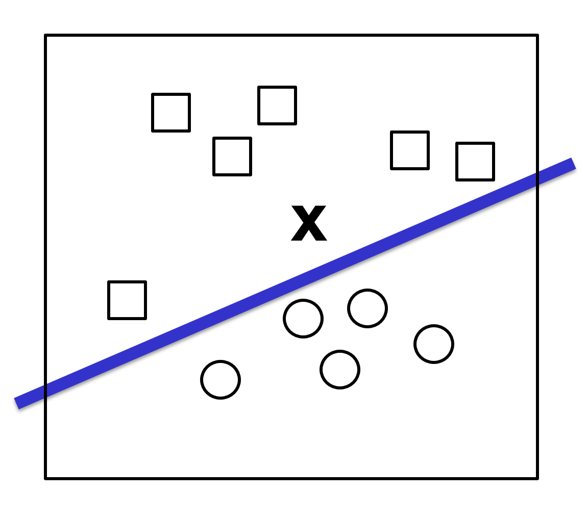

Figure 7.8 – Line acting as a classifier to decide which category to assign to the new point.

In this setup, the input data is represented as vectors of the form (x1,x2), indicating their coordinates in this two-dimensional space. The output of our function will be either 0 or 1, interpreted as being "above" or "below" the line, which determines whether the input should be classified as a square or a circle. As we’ve discussed, this is a case of regression, where the line (i.e., the classifier) can be defined algebraically as:

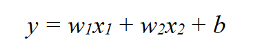

Following the notation introduced in the previous section, we can express this more compactly as:

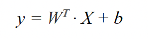

To classify a new input *X* in our 2D example, we need to learn a weight vector *W*=(w1,w2) of the same dimension as the input, along with a bias term *b*.

With these parameters now computed, we are ready to build an artificial neuron capable of classifying a new input element *X*. Essentially, the neuron applies the weight vector *W*—which has been learned during training—to the values of each input dimension of *X*, adds the bias term *b*, and passes the result through a non-linear function to produce an output of either 0 or 1. The function defined by this artificial neuron can be expressed in a more formal way as:

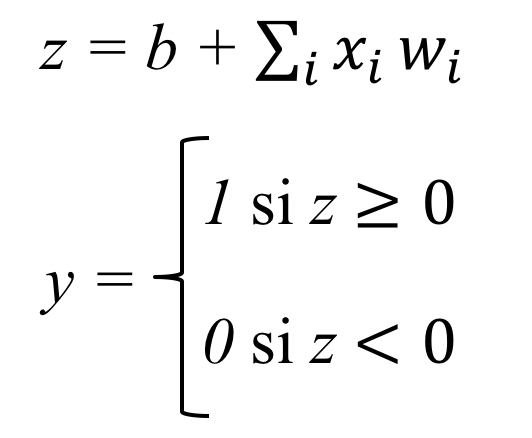

Although there are several possible functions (which we will refer to as *activation functions* and will study in detail in next chapter), for this example we will use a function known as the sigmoid function, which outputs a real-valued number between 0 and 1 for any input value:

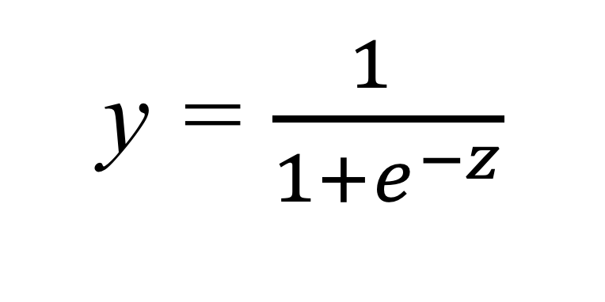

If we take a closer look at the formula, we notice that it always tends to output values close to either 0 or 1. If the input z is reasonably large and positive, then e−z becomes very small, and thus the output *y* approaches 1. Conversely, if z is large and negative, e−z becomes a large number, making the denominator large and the output *y* close to 0. Graphically, the sigmoid function exhibits the shape shown in Figure 7.9.

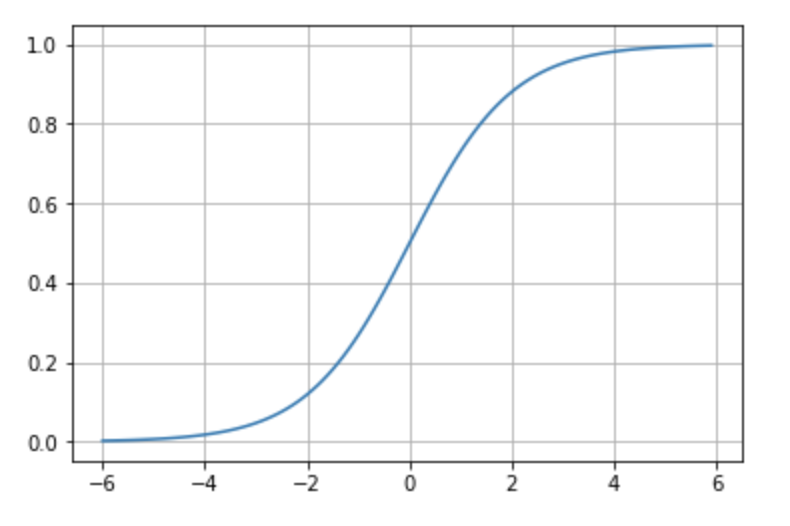

Figure 7.9 – The Sigmoid Activation Function.

Finally, we need to understand how the weights *W* and the bias *b* can be learned from the input data that already comes with labels.

In Chapter 8, we will present the formal procedure in detail, but for now, we can introduce an intuitive overview of the global learning process.

It is an iterative process over all input samples, where the model compares its predicted label for each element—whether “square” or “circle”—against the true label. Based on the error made in each prediction, the model updates the values of the parameters *W* and *b*, gradually reducing the prediction error as more examples pass through the model.

## Neural Networks

### HPC Perspective: Neural Networks as Large-Scale Numerical Computations

From a HPC perspective, neural networks are not fundamentally different from other large numerical workloads. At their core, they consist of repeated linear algebra operations—matrix multiplications, vector additions, and reductions—applied at massive scale.

What distinguishes modern neural networks is not the nature of the computations themselves, but their volume, regularity, and data movement patterns. Millions of parameters, large intermediate tensors, and repeated execution of the same kernels make neural network training particularly well suited for accelerator-based architectures such as GPUs.

This viewpoint is essential for understanding why concepts traditionally associated with HPC—such as memory bandwidth, parallelism, and communication overhead—play a decisive role in the performance of AI workloads.

### Perceptron

In the previous section, we introduced a logistic regression classification algorithm as an intuitive way to understand what an artificial neuron is. In fact, the first example of a neural network is known as the perceptron, invented many years ago by Frank Rosenblatt.

The perceptron is a classification algorithm equivalent to the one shown in the previous section—it is the simplest architecture a neural network can have—created in 1957 by Frank Rosenblatt and based on the work of neurophysiologist Warren McCulloch and mathematician Walter Pitts published in 1943. McCulloch and Pitts proposed a very simple model of an artificial neuron, inspired by a biological neuron, consisting of one or more binary inputs that could be either 'on' or 'off', and a binary output. The artificial neuron activates its output only when more than a certain number of its inputs are active.

The perceptron builds on an artificial neuron slightly different from the one proposed by McCulloch and Pitts, also referred to in the literature as a linear threshold unit. Inputs and outputs are now numbers (instead of binary activation states), and each input connection has an associated weight. Then, an activation function is applied, as we showed in the previous section. The general structure can be visually summarized as shown in Figure 7.10.

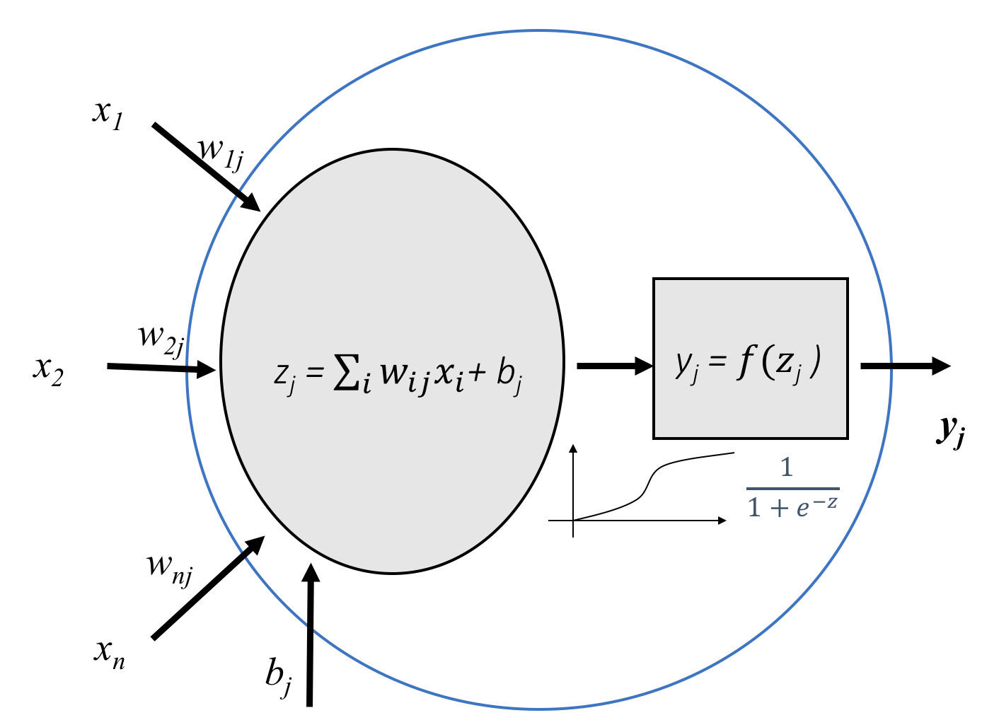

Figure 7.10 – General diagram of an artificial neuron that computes a weighted sum of its inputs and applies an activation function.

The perceptron is the simplest version of a neural network because it consists of a single layer containing one neuron. However, as we will see throughout the book, modern neural networks often consist of dozens of layers, with many neurons communicating with neurons from the previous layer to receive information, and in turn passing that information to the next layer.

As we’ll see in Chapter 8, there are several activation functions besides the sigmoid, each with different properties. For classifying handwritten digits, we’ll also introduce another activation function called softmax, which will be useful for building a minimal network capable of classifying into more than two classes. For now, think of softmax as a generalization of the sigmoid function that allows classification into more than two classes.

*Note – Logistic Regression vs. Perceptron: Despite its historical name, logistic regression is not a regression algorithm; it is used for classification. The model applies the logistic (sigmoid) activation to convert the weighted sum of inputs into a value between 0 and 1, which we interpret as the probability of class membership. By contrast, Rosenblatt’s original perceptron employs a hard step (threshold) activation that outputs exactly 0 or 1 and is not differentiable. Replacing that discontinuous step with the smooth sigmoid makes the neuron trainable with gradient-based methods and yields calibrated probabilities instead of binary decisions.*

### Multilayer Perceptron

As mentioned, a neural network is composed of multiple perceptrons like the one we just introduced. To make graphical representation easier, we can use a simplified form of the neuron shown in Figure 7.10, as depicted in Figure 7.11.

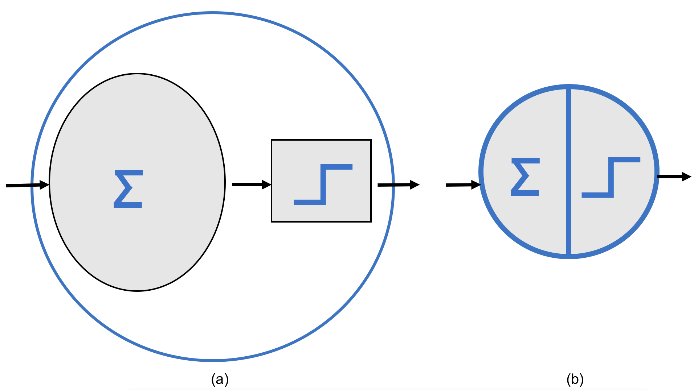

Figure 7.11 – (a) Simplified representation of an artificial neuron computing of Figure 7.10, a weighted sum and applying an activation function. (b) More compact visual representation of the two stages of an artificial neuron used in the following figures.

When all neurons in a layer are connected to all neurons in the previous layer (i.e., the input neurons), the layer is called a fully connected layer or dense layer. The inputs to the perceptrons are fed by special neurons known as input neurons, which simply emit whatever input value they receive. All input neurons form the input layer. As mentioned, a bias term b is also added as an additional fixed input of 1 (bias neuron, which always outputs 1). Following these notational conventions, we can represent a neural network with two input neurons and three output neurons as shown in Figure 7.12.

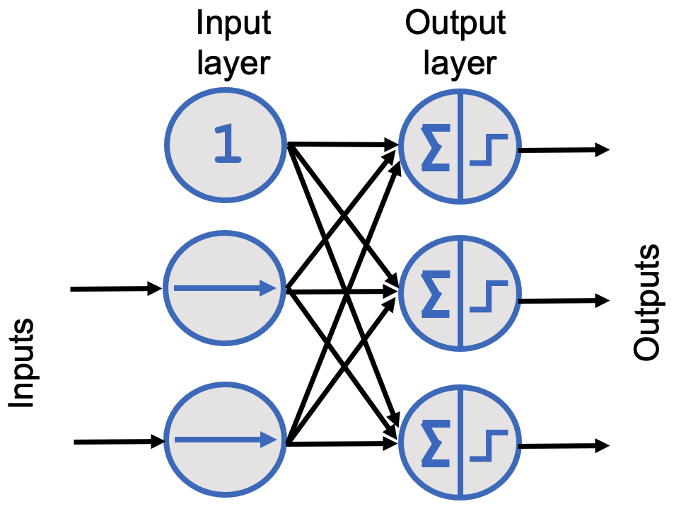

Figure 7.12 – Graphical representation of a neural network with two input neurons, a bias neuron, and three output neurons.

In the field, we refer to a multilayer perceptron (MLP) when we encounter neural networks that include an input layer, one or more hidden layers composed of perceptrons, and a final output layer. Now that we’ve provided a more detailed view of what a neural network is, we can clarify what we mean by Deep Learning. We use the term Deep Learning when the model consists of neural networks with multiple hidden layers. A visual representation is shown in Figure 7.13.

That said, the term Deep Learning is sometimes used for any scenario involving neural networks. The layers closest to the input layer are generally referred to as lower layers, while those closer to the output are upper layers. Except for the output layer, each layer typically includes a bias neuron, which is fully connected to the next layer, although these are often omitted from diagrams (see Figure 7.14).

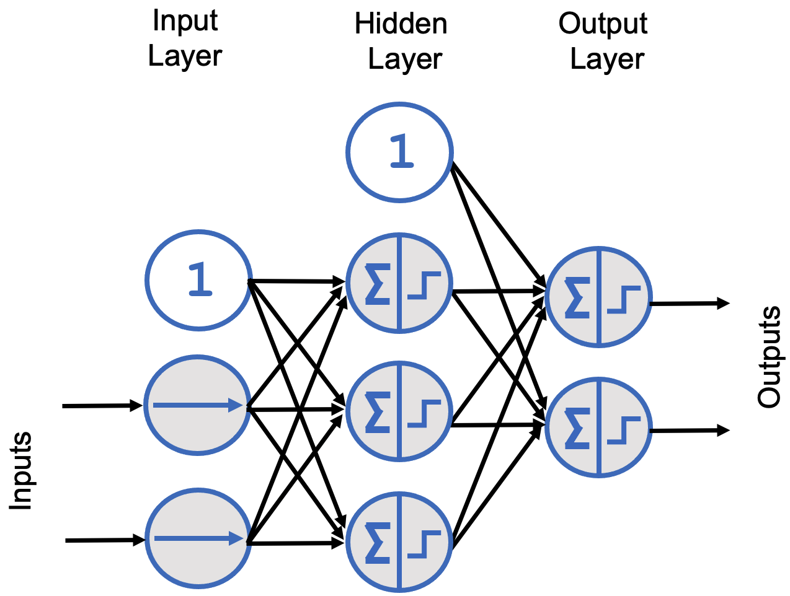

Figure 7.13 – Diagram of a multilayer perceptron with three input neurons, one hidden layer with four neurons, and one output layer with two neurons.

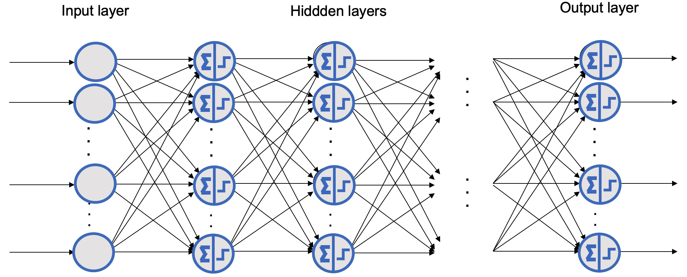

Figure 7.14 – Generic representation of a deep learning network with many hidden layers (bias neurons omitted).

### Multilayer Perceptron for Classification

MLPs are frequently used for classification tasks. For a binary classification problem, a single output neuron is sufficient, using a logistic sigmoid activation function as we have seen earlier: the output is a number between 0 and 1, which can be interpreted as the estimated probability of one of the two classes. The estimated probability of the other class is simply one minus the value returned by the neuron.

However, when we want to classify more than two classes—particularly when the classes are mutually exclusive, as in our digit classification case (digits from 0 to 9)—we need one output neuron per class. We must use the softmax activation function, which ensures that all estimated probabilities are between 0 and 1 and sum to 1 (a necessary condition for mutually exclusive classes). This is known as multi-class classification (see Figure 7.15), where the output of each neuron represents the estimated probability for its corresponding class.

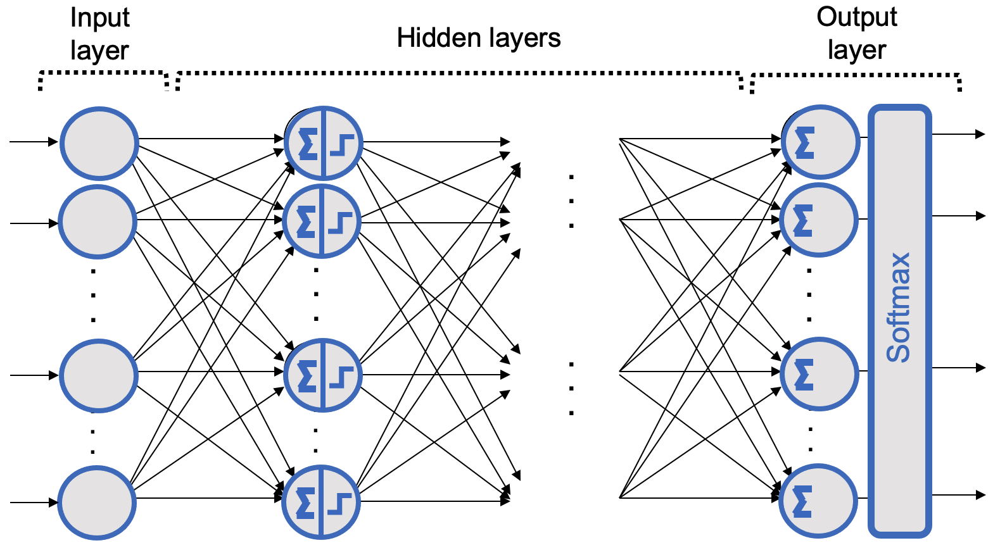

Figure 7.15 – General representation of a deep learning network with many hidden layers and a softmax output layer.

## The Softmax Activation Function

Visually, let us explain how we can solve the classification problem so that, given an input image, we obtain probabilities for it being each of the 10 possible digits. This way, we get a model that, for example, might predict that an image is a nine but only with 80% certainty due to an unclear bottom loop. It might think it is an eight with 5% probability and give a small chance to any other digit. Although we would consider the model’s prediction to be a 9, having this probability distribution gives us insight into how confident the model is—especially useful in tasks like handwriting recognition where ambiguity is common.

In our MNIST classification example, the output of the neural network will be a probability distribution over mutually exclusive labels—i.e., a 10-element vector where each element represents a digit's probability, and the total sums to 1. We achieve this using a softmax activation function at the output layer, in which each neuron's output depends on all others because their total must be 1.

But how does softmax work? Softmax is based on computing the 'evidence' that a given image belongs to a specific class and then converts this evidence into a probability over all classes.

To compute this evidence, one approach is to sum weighted pixel contributions. For now, we can think of a model as “something” that contains information to determine whether a number belongs to a given class. For example, assume we already have a trained model for digit zero. This model can be visualized as in Figure 7.16.

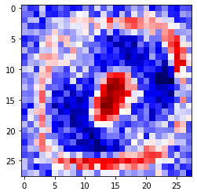

Figure 7.16 – 28x28 pixel matrix where red pixels (light gray in print) decrease the likelihood of being a zero, blue pixels (dark gray) increase it, and white pixels are neutral. This matrix corresponds to the parameter set learned for class zero by the output layer of the MNIST model. Figure 7.18 shows the numeric matrix.

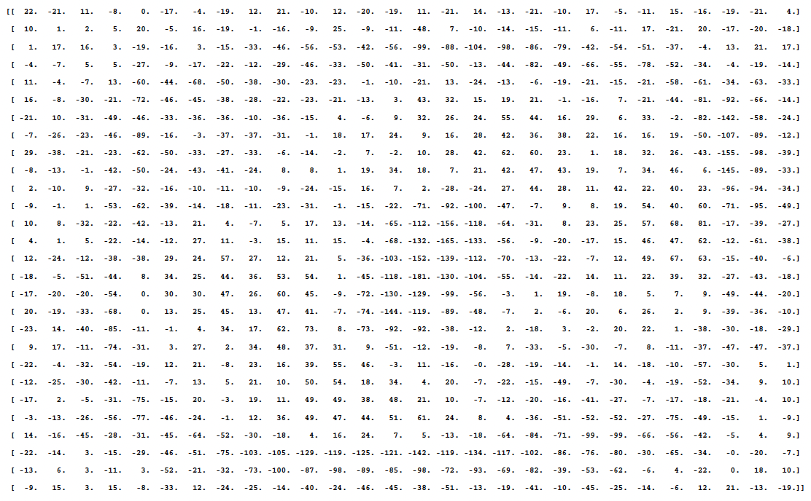

Figure 7.18 – Matrix of parameters corresponding to the category zero model.

In this case, we are looking at a 28 × 28 pixel matrix, where red pixels (or the lightest gray in the black-and-white edition of the book) represent negative weights (i.e., they reduce the evidence for belonging), while blue pixels (the darkest gray in the black-and-white edition) represent positive weights (i.e., they increase the evidence for belonging). White color represents a neutral value.

In fact, this is a visual representation (to facilitate the explanation) of the parameter matrix corresponding to the category zero model that the output layer has learned for the MNIST example. In Figure 7.18, you can see this matrix of numbers, and the reader can verify the match between the red and blue values. On the book’s GitHub repository, you will find the code used to generate this visual matrix from the learned parameters of the output layer for the MNIST case (in case the reader wishes to check how it was obtained and view the color images).

Now that we have the visual model, imagine placing a blank sheet on top and tracing a zero. In general, our stroke would fall over the blue area (recall that we are dealing with images that have been normalized to 20 × 20 pixels and then centered into a 28 × 28 image). It becomes quite evident that if our stroke passes over the red area, we are probably not writing a zero. Therefore, using a metric that adds when passing through the blue zone and subtracts when going through the red zone seems reasonable.

To confirm that this is a good metric, imagine now that we draw a three. It’s clear that the red center of the previous zero model will penalize the metric, since as shown in Figure 7.19, when writing a three we pass over red areas. However, if the reference model is the one for number 3 —as shown on the left side of Figure 7.19—, we can see that, in general, the different possible traces representing a three mostly remain in the blue area.

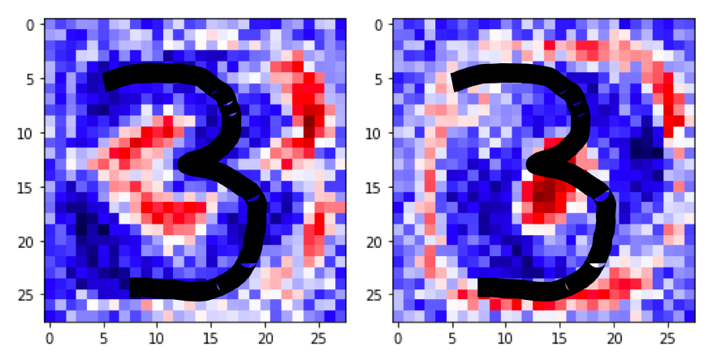

Figure 7.19 – Comparison of the overlap between the drawn number 3 and the models corresponding to the number 3 (left) and zero (right).

Once we’ve calculated the evidence for each of the 10 classes, these values must be converted into probabilities that sum to 1. To do this, softmax takes the exponential of the evidence values and then normalizes them so that their total is one, forming a probability distribution. The probability of belonging to class *i* is:

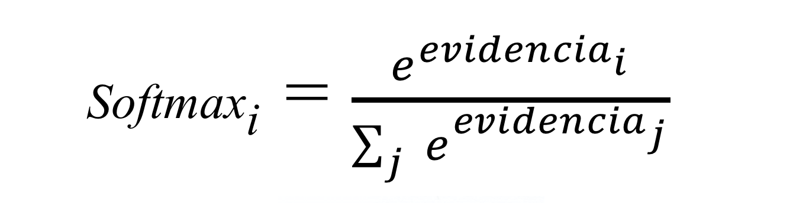

Intuitively, the effect achieved with exponentials is that one additional unit of evidence has a multiplying effect, while one unit less has the opposite effect. What makes this function interesting is that a good prediction will yield one entry in the output vector close to 1, while the remaining entries will be close to 0. In the case of weak predictions, several possible labels will have similar probabilities. In the next chapter, we will analyze this in more detail with a code example.

## Neural Networks with TensorFlow

At this point, all the conceptual pieces are in place. We have introduced the structure of neural networks, the role of activation functions, and the meaning of training and optimization at an abstract level.

We now move from concepts to execution. The goal of the following sections is not to introduce TensorFlow as a new subject, but to use it as a concrete vehicle to make the previously discussed ideas operational. The framework serves as an implementation medium through which neurons, layers, loss functions, and training loops become executable components of a real system.

We move on to a more practical level using the MNIST digit recognition example introduced in the previous section. We will begin by presenting the basic steps to train a neural network using the Keras API provided by the TensorFlow framework.

Keras is a high-level interface that simplifies the construction and training of neural networks, while TensorFlow is the underlying deep learning library that powers it. Although we will cover these tools in more detail in upcoming chapters, for now we will introduce a few essential concepts and commands.

We use Keras through the tf.keras submodule, which is the official high-level API bundled with TensorFlow. It provides a clean interface to build and train neural networks and is tightly integrated with TensorFlow’s execution engine.

### Loading Data with Keras

To make it easier for readers to get started with Deep Learning, Keras provides several preloaded datasets. One of them is the MNIST dataset, which is available as four NumPy arrays and can be loaded as follows:

    mnist = tf.keras.datasets.mnist

    (x_train, y_train), (x_test, y_test) = mnist.load_data()

x_train and y_train form the training set, while x_test and y_test contain the test set. The images are encoded as NumPy arrays, and their corresponding labels range from 0 to 9. Following the book's progressive learning strategy (we will defer validation set splitting until Chapter 9), for now we only consider the training and test sets.

To inspect the loaded values, we can display one of the MNIST training images (e.g., image 8 introduced earlier):

    import matplotlib.pyplot as plt
    plt.imshow(x_train[8], cmap=plt.cm.binary)

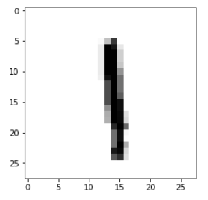

Figure 7.20 – Visualization of training sample number 8 from the MNIST dataset.

To view this label:

    print(y_train[8])

1

The output is 1, as expected. Let us apply the NumPy concepts to better understand our data. First, let us check the number of axes and dimensions in the x_train tensor[^1]:

    print(x_train.ndim) 

3

    print(x_train.shape) 

(60000, 28, 28)

    print(x_train.dtype) 

uint8

In summary, x_train is a 3D tensor of 8-bit integers: a vector of 60,000 2D matrices of size 28x28. Each matrix is a grayscale image with pixel values between 0 and 255.

Although this is a black-and-white case, color images usually have three dimensions: height, width, and color depth. Grayscale images like MNIST have a single channel, so they can be stored as 2D tensors. Typically, image tensors are 3D, where grayscale images include a singleton channel dimension (e.g., 1). For instance:

- 64 grayscale images of size 128x128: shape (64, 128, 128, 1)

- 64 RGB color images of the same size: shape (64, 128, 128, 3)

More generally, any dataset can be represented as tensors. For example, a video is a sequence of color frames and can be represented as a 5D tensor with shape (samples, frames, height, width, channels).

With data in tensor format, NumPy makes manipulation easy. For instance, selecting x_train\[8\] retrieves a specific image. To slice a subset of data, such as digits 1 through 99:

    my_slice = x_train [1:100:,:]
    print(my_slice.shape)

(99, 28, 28)

This is equivalent to:

    my_slice = x_train [1:100,0:28, 0:28]
    print(my_slice.shape)

(99, 28, 28)

To extract, say, the lower-right 14x14 pixels of all images:

    my_slice = x_train [:, 14:, 14:]
    print(my_slice.shape)

(60000, 14, 14)

To crop the central 14x14 patch:

    my_slice = x_train [:, 7:-7, 7:-7]
    print(my_slice.shape)

(60000, 14, 14)

### Input Data Preprocessing For a Neural Neuronal

Preprocessing data adapts it for more efficient training. Common steps in deep learning include vectorization, normalization, or feature extraction. Here, we focus on normalization.

MNIST images are uint8 with pixel values in \[0, 255\]. Neural networks perform better with input scaled to \[0, 1\] as float32:

    x_train = x_train.astype('float32')
    x_test = x_test.astype('float32')

    x_train /= 255
    x_test /= 255

This normalization improves training convergence by avoiding large input values compared to weights. Another common preprocessing step is reshaping the input without modifying the data. We transform the 2D 28x28 image matrix into a 1D vector of 784 values, wich serves as input to the network:

    x_train = x_train.reshape(60000, 784)
    x_test = x_test.reshape(10000, 784)

Verifying shapes:

    print(x_train.shape)
    print(x_test.shape)

(60000, 784)

(10000, 784)

We also convert labels (0 to 9) to one-hot encoded vectors of length 10. This is done using to_categorical from Keras:

    from tensorflow.keras.utils import to_categorical

Checking the transformation:

    print(y_test[0])

7

    print(y_train[0])

5

    print(y_train.shape)

(60000,)

    print(x_test.shape)

(10000, 784)

    y_train = to_categorical(y_train, num_classes=10)
    y_test = to_categorical(y_test, num_classes=10)

    print(y_test[0])

\[0. 0. 0. 0. 0. 0. 0. 1. 0. 0.\]

    print(y_train[0])

\[0. 0. 0. 0. 0. 1. 0. 0. 0. 0.\]

    print(y_train.shape)

(60000, 10)

    print(y_test.shape)

(10000, 10)

The data is now ready for use in our simple neural network model, which we will implement in the next section.

### Model Definition

The main data structure in Keras is the Sequential class, which allows for the creation of a basic neural network. Keras also provides an API that enables the implementation of more complex models as computation graphs, with multiple inputs, multiple outputs, and arbitrary connections. However, we will not cover this until Chapter 12.

In this case, our model in Keras is defined as a sequence of layers, with each one gradually distilling the input data to produce the desired output. Keras provides a variety of layer types, which can be easily added to the model.

The construction of our digit recognition model in Keras could be as follows:

    model = Sequential()
    model.add(Dense(10,activation='sigmoid',input_shape=(784,)))
    model.add(Dense(10, activation='softmax'))

Here, the neural network is defined as a sequential list of two fully connected (dense) layers, meaning each neuron in the first layer is connected to all neurons in the next layer. A visual representation of this configuration is shown in the figure below:

Figure 7.21 – Visual representation of a two-layer fully connected neural network with a softmax activation in the output layer.

In the code above, we explicitly specify the input shape using the input_shape argument in the first layer, indicating that our input data consists of 784 features (this corresponds to the flattened 28x28 pixel images). Internally, the tensor is defined as (None, 784), as we will see later.

One powerful feature of Keras is its ability to automatically infer the shapes of tensors between layers after the first one. This means we only need to specify this information for the first layer.

For each layer, we specify the number of units (neurons) and the activation function to be applied. In this example, the first layer uses the sigmoid activation function, and the second uses the softmax function with 10 units, representing the 10 possible digit classes. The output of the softmax layer is a probability distribution over the digit classes.

A very useful method provided by Keras to check the architecture of our model is summary():

    model.summary()

\_\_\_\_\_\_\_\_\_\_\_\_\_\_\_\_\_\_\_\_\_\_\_\_\_\_\_\_\_\_\_\_\_\_\_\_\_\_\_\_\_\_\_\_\_\_\_\_\_\_\_\_\_\_\_\_\_\_\_\_\_\_\_\_\_

Layer (type) Output Shape Param \#

=================================================================

dense_1 (Dense) (None, 10) 7850

\_\_\_\_\_\_\_\_\_\_\_\_\_\_\_\_\_\_\_\_\_\_\_\_\_\_\_\_\_\_\_\_\_\_\_\_\_\_\_\_\_\_\_\_\_\_\_\_\_\_\_\_\_\_\_\_\_\_\_\_\_\_\_\_\_

dense_2 (Dense) (None, 10) 110

=================================================================

Total params: 7,960

Trainable params: 7,960

Non-trainable params: 0

The summary() method shows all layers in the model, including the layer names (automatically generated unless explicitly named), their output shapes, and the number of parameters. The summary ends with the total number of parameters, split into trainable and non-trainable ones. In this simple example, all parameters are trainable.

We will analyze this output in more detail in later chapters, especially when dealing with larger networks. For now, we see that our model has a total of 7,960 parameters: 7,850 for the first layer and 110 for the second.

We can break this down: in the first dense layer, each of the 10 neurons requires 784 weights (one for each input pixel), totaling 10 x 784 = 7,840. Additionally, each neuron has a bias term, giving 10 more parameters for a total of 7,850.

In the second layer, each of the 10 output neurons connects to the 10 neurons of the previous layer, requiring 10 x 10 = 100 weights. Each output neuron also has a bias term, adding 10 more parameters for a total of 110.

The Keras documentation provides a comprehensive list of arguments available for the Dense layer. In this example, we use the most important ones: the number of units and the activation function. In Chapter 7, we will explore other activation functions beyond the sigmoid and softmax introduced here.

It is also common to define the weight initialization strategy through an argument in the Dense layer. Suitable initial values help the optimization converge more efficiently during training. These initialization options are also detailed in the Keras documentation.

### Learning Process Configuration

Once our Sequential model is defined, we need to configure its learning process using the compile() method. This method allows us to specify several key properties through its arguments.

The first argument is the loss function, which measures the discrepancy between the predicted outputs and the true labels of the training data. Another argument specifies the optimizer, which is the algorithm used to update the model's weights during training based on the loss. We will explore the roles of the loss function and optimizer in more detail in Chapter 6.

Finally, we specify a metric to monitor during training and testing. In this example, we will track accuracy, which is the fraction of correctly classified samples. The compile() method call for our model is:

    model.compile(loss="categorical_crossentropy", 
                  optimizer="sgd", 
                  metrics = ['accuracy'])

Here, the loss function is categorical_crossentropy, the optimizer is stochastic gradient descent (sgd), and the metric is accuracy.

### Training the Model

After defining and compiling our model, it is ready to be trained. We use the fit() method to train the model on the training data:

    model.fit(x_train, y_train, epochs=5)

The first two arguments specify the training data as NumPy arrays. The epochs parameter defines how many times the entire training dataset is passed through the model. (We will discuss this argument in more detail in Chapter 8.)

During training, the model uses the specified optimizer to iteratively update its parameters. At each iteration, the model computes the output for a batch of inputs, compares it with the expected output, calculates the loss, and updates the weights to reduce this loss. This process continues across all epochs.

This method is typically the most time-consuming step. Keras provides progress output during training (enabled by default with verbose=1), including timing estimates per epoch:

Epoch 1/5

60000/60000 \[===========\] - 4s 71us/sample - loss: 1.9272 - accuracy: 0.4613

Epoch 2/5

60000/60000 \[===========\] - 4s 68us/sample - loss: 1.3363 - accuracy: 0.7286

Epoch 3/5

60000/60000 \[===========\] - 4s 69us/sample - loss: 0.9975 - accuracy: 0.8066

Epoch 4/5

60000/60000 \[===========\] - 4s 68us/sample - loss: 0.7956 - accuracy: 0.8403

Epoch 5/5

60000/60000 \[===========\] - 4s 68us/sample - loss: 0.6688 - accuracy: 0.8588

10000/10000 \[==================\] - 0s 22us/step

This simple example allows students to build and train their first neural network. The fit() method supports many additional arguments that can significantly impact learning outcomes.

Moreover, this method returns a History object, which we omitted here for simplicity. The history attribute of this object logs loss and metric values across training epochs, and optionally for validation data if provided. In later chapters, we will discuss how to use this information to prevent overfitting and improve model performance.

### Model Evaluation

Now that the neural network has been trained, we can evaluate how well it performs on new test data using the evaluate() method. This method returns two values:

    test_loss, test_acc = model.evaluate(x_test, y_test)

These values indicate how well the model performs on previously unseen data (i.e., the data stored in x_test and y_test after calling mnist.load_data()). Let's focus on the accuracy:

    print('Test accuracy:', test_acc)

Test accuracy: 0.8661

The accuracy value tells us that the model correctly classifies approximately 90% of the previously unseen data.

While accuracy is a useful initial metric, it only considers the ratio of correct predictions to the total number of predictions. In some cases, this may not be enough—especially if certain types of errors (e.g., false positives vs. false negatives) have very different consequences.

A commonly used tool in machine learning for more detailed performance evaluation is the *confusion matrix*, a table that counts the predictions against the actual values. This matrix helps us visualize how well the model distinguishes between different classes and is particularly useful for identifying misclassifications.

For binary classification tasks, the confusion matrix takes the form indicated in Figure 7.22.

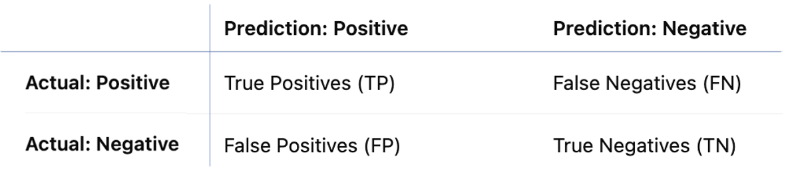

Figure 7.22 – Confusion matrix for binary classification.

The matrix reports the counts for:

- TP: Correctly predicted positives.

- TN: Correctly predicted negatives.

- FN: Actual positives incorrectly predicted as negatives.

- FP: Actual negatives incorrectly predicted as positives.

From the confusion matrix, accuracy can be calculated as:

Accuracy = (TP + TN) / (TP + FP + TN + FN)

However, accuracy alone can be misleading, especially when false positives and false negatives have different implications. For instance, in a model that predicts whether a mushroom is poisonous, a false negative (predicting it is edible when it's not) could be dangerous, whereas a false positive (predicting poisonous when it’s actually edible) has less severe consequences.

For this reason, another important metric is recall, which evaluates the model's ability to identify actual positives:

Recall = TP / (TP + FN)

This measures how many of the actual positive cases (e.g., poisonous mushrooms) were correctly identified by the model.

Various metrics can be derived from the confusion matrix depending on the application and the cost of different types of errors. These considerations are beyond the scope of this chapter but are essential in practice.

Now let’s examine the confusion matrix for our MNIST digit classifier, which handles 10 possible classes (digits from 0 to 9). Using the Scikit-Learn package, we can compute the confusion matrix for our model:

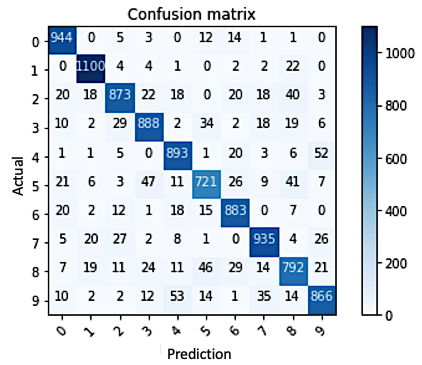

Figure 7.23 – Confusion matrix for the model applied to the MNIST digit classification task.

In this matrix, each row represents the true digit class (actual label), and each column represents the predicted digit class. The diagonal elements count correct predictions, while off-diagonal elements show misclassifications. The higher the diagonal values, the better the performance.

By summing the diagonal values and dividing by the total number of predictions, we obtain the same accuracy returned by the evaluate() method.

The source code used to generate this confusion matrix can be found in the book’s GitHub repository.

### Generating Predictions

Finally, we now reach the step where we use the trained model to predict which digits are represented in new images. For this, Keras provides the predict() method from a model that has already been trained.

To test this method, we can choose any element from the test set x_test, which we already have loaded. Let’s select element 11 from this dataset and see which class the model assigns to it.

Before that, let’s visualize the image so we can manually verify whether the model is making a correct prediction:

    plt.imshow(x_test[11], cmap=plt.cm.binary)

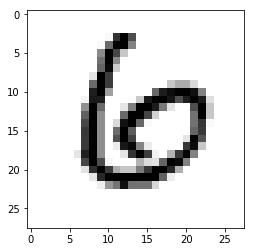

Figure 7.24 – Image of sample 11 from the MNIST test dataset.

As you can see, this is clearly the digit 6.

Now let’s check if the predict() method from our model correctly predicts the value we just identified. To do so, we execute the following line:

    predictions = model.predict(x_test)

Once the prediction vector is generated for the test dataset, we can determine the predicted class by using NumPy’s argmax() function. This returns the index of the highest value in the array. For element 11:

    np.argmax(predictions[11])

6

We can also print the full array of predicted probabilities:

    print(predictions[11])

\[0.06 0.01 0.17 0.01 0.05 0.04 0.54 0. 0.11 0.02\]

As expected, the model assigns the highest probability to class 6, which matches our manual observation.

Finally, we can confirm that the output vector is a valid probability distribution by checking that its values sum to 1:

    np.sum(predictions[11])

1.0

At this point, the reader has successfully created their first Keras model that classifies MNIST digits correctly about 90% of the time.

## Training Our First Neural Network 

In this section, we will train our first neural network using a complete practical example that brings together all the concepts covered so far in the chapter.

As explained in Section 3.3, it is entirely possible to run this example locally on your laptop using a Docker container that launches a Jupyter Notebook server. By executing a few simple commands, you can start the container, expose the appropriate port (typically 8888), and access the notebook interface from your browser. This setup is ideal for students who wish to work in a fully local and isolated environment, especially if they are already familiar with Docker workflows. The necessary steps and configuration details, including how to start the Jupyter server within the container and access it via localhost, are described in detail in Task 3.8 through Task 3.10.

However, to simplify the experience and avoid requiring any local installation, in this section we propose an alternative approach: using Google Colab, a free cloud-based platform that allows you to run Jupyter Notebooks directly in your browser. Colab offers many advantages for students, including instant setup, access to GPU and TPU acceleration, seamless integration with Google Drive, and a user-friendly interface that supports live code execution, Markdown, LaTeX, and even an AI assistant.

Therefore, while the notebook for this section can be run locally as shown in Section 3.3, for convenience and broader accessibility, we will guide you through executing it in Colab. If you are not yet familiar with Jupyter Notebooks or Google Colab, we recommend reviewing *appendix* *Jupyter Notebook Basics*, where we introduce these tools and explain how to use them step-by-step.

Task 7.1 – Set Up Your Google Colab Environment

Open your preferred web browser and go to [colab.research.google.com](https://colab.research.google.com).

Sign in using your Google account.

In the bottom-right corner, click "New Notebook" to create a new one.

To enable GPU acceleration:

- In the top menu, click Runtime

- Select Change runtime type

- In the Hardware accelerator dropdown, choose GPU

- Click Save

You now have a runtime environment with hardware acceleration enabled.

*Note: Free Colab accounts have usage limits for GPU access.*

*Tip: Don’t forget to explore the Gemini Assistant in the sidebar. It can help explain code, fix errors, or generate snippets on demand.*

We have created a notebook that replicates the complete example covered in this chapter. This notebook is hosted publicly on GitHub.

To open it in Colab, follow these steps:

- Navigate to <https://colab.research.google.com>

- Click on the **"**GitHub**"** tab

- In the search field, paste the following repository URL:

https://github.com/jorditorresBCN/supercomputing-for-ai

- Wait a few seconds for the available notebooks to appear.

- Click on:

PracticalIntroductionToDeepLearningBasics.ipynb

Colab will load the selected notebook in a new tab.

Figure 7.25 – Interface in Google Colab to open a notebook directly from a GitHub repository.

This notebook includes all the code, comments, and explanations from this chapter.

Task 7.2 – Execute the Provided Notebook Step-by-Step

Once the notebook is open:

- Read the markdown cells to understand each concept.

- Run each code cell by clicking the play button or pressing Shift + Enter.

- Observe the output and compare it to the expected results explained in class.

Take time to explore each section:

- Try changing the batch size, number of epochs, or optimizer.

- Modify the neural network architecture slightly and observe how the model’s accuracy changes.

This hands-on exploration will reinforce your understanding of the training process and model configuration.

Task 7.3 – Improve the Accuracy of Your Model

Now it's your turn to experiment:

- Adjust the number of neurons in each layer

- Add more dense layers or try dropout

- Replace sigmoid with relu or try tanh

- Replace SGD with the adam optimizer

- Normalize the data in different ways

After each modification, retrain the model and evaluate its performance. Try to document your results and describe the effects of your changes.

This first end-to-end training example completes the conceptual arc of the chapter. In the following chapters, we will revisit the same training process under increasingly demanding conditions, focusing on performance, scalability, and execution on parallel and distributed systems.

You now have a full working environment to experiment with deep learning models in Keras, supported by Colab’s cloud infrastructure.

In the next chapter, we will dive deeper into activation functions and loss functions, explaining how to choose them based on the problem at hand.

## Key Takeaways from Chapter 7

- In this chapter, we introduced how to build, train, and evaluate a neural network using Keras, the high-level API of TensorFlow.

- We worked with the MNIST dataset, a classic benchmark in machine learning, composed of handwritten digits.

- We presented the Sequential API, the simplest way to define a model in Keras, by stacking layers sequentially.

- The structure of the neural network was defined using the Dense layer, where we specified the number of neurons and activation functions (e.g., sigmoid, softmax).

- The model was compiled using the compile() method, where we set the loss function (categorical_crossentropy), the optimizer (sgd), and the evaluation metric (accuracy).

- The model was trained using fit(), and we discussed how the model adjusts its parameters to minimize the loss function across several epochs.

- We showed how to evaluate the model using evaluate() and interpret the results, including the limitations of accuracy as the only metric. We introduced the confusion matrix and the recall metric to provide a more nuanced view of model performance.

- We demonstrated how to use predict() to make predictions on new data and how to interpret the output probabilities.

- Finally, we suggest use Google Colab, a free cloud-based platform to run Python code with access to GPUs/TPUs. We showed how to open a notebook from GitHub and execute the code interactively using Jupyter Notebook interface in Colab.

- The reader has now successfully built and trained their first deep learning model in Keras, explored its performance, and experimented with a real coding environment, setting the foundation for more advanced chapters to come.

[^1]: A tensor is a generalization of vectors and matrices, and it’s the fundamental data structure in TensorFlow and PyTorch.
