# 8. Training Neural Networks: Basics, CNNs, and Deployment

* TOC
{:toc}


In this chapter, we take a brief theoretical detour to introduce some fundamental concepts about how a neural network is trained. This background will help us go deeper in the next chapters. We’ll take a gradual approach, starting with an intuitive overview of the learning process and then describing the key components in more detail.

If you find the theory too dense, feel free to skim this chapter. While understanding every detail is not essential to continue with the practical content, this chapter plays a crucial role in showing that training a neural network is not "magic"—it is built on basic mathematical principles.

## Understanding the Training Process

### Learning Process

#### A Global View

In the previous chapters, we explained that training a neural network—a model that maps an input (e.g., an image of a digit) to a label (the corresponding number)—is essentially about learning its parameters (weights and biases). These parameters are stored within each neuron of a layer. Learning means finding the right values for these parameters (see Figure 8.1).

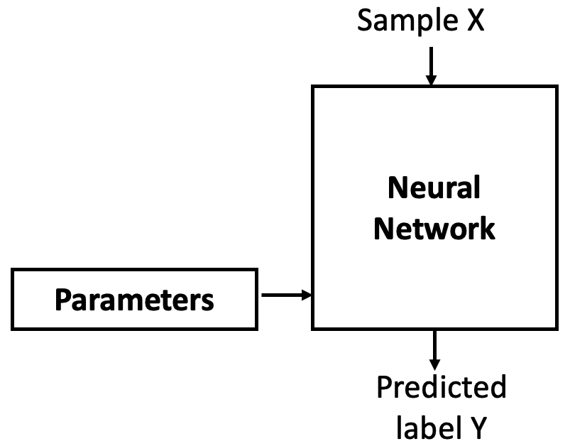

*Figure 8.1 – A neural network is parametrized by weights and biases that must be learned.*

These parameters are trainable, meaning they are initially assigned random values (we’ll discuss other initialization options later), and then gradually adjusted during training. The goal is to find values such that the network correctly maps inputs to their labels.

But modern neural networks often contain tens of millions of parameters. Changing one of them affects the entire system. So, how can we train such a complex model?

As Professor Jesús Labarta of the BSC reminds us: to control something, we first need to observe it. We control a neural network by measuring how far off its output is from what we expect. This is the job of the loss function, which compares the network's predicted label with the true label and computes an error (see Figure 8.2).

The trick is to use this error as feedback to adjust the parameters in a direction that reduces future errors. That adjustment is done by an optimizer (see Figure 8.3), which applies an algorithm called backpropagation to update the parameters.

Initially, with random parameters, the network performs poorly. But as it sees more data, the weights are slightly improved at each step, reducing the error over time. Repeating this process results in parameters that minimize the loss. Let’s now take a closer look at the step-by-step process.

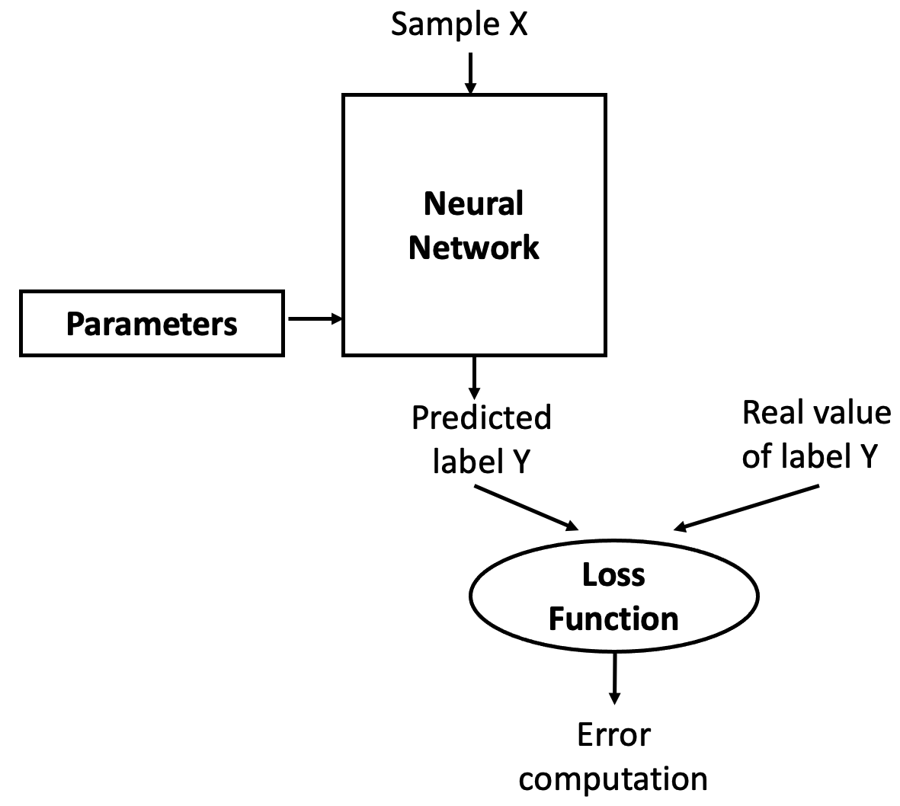

*Figure 8.2 – The loss function measures how well the model's predictions match the expected outputs.*

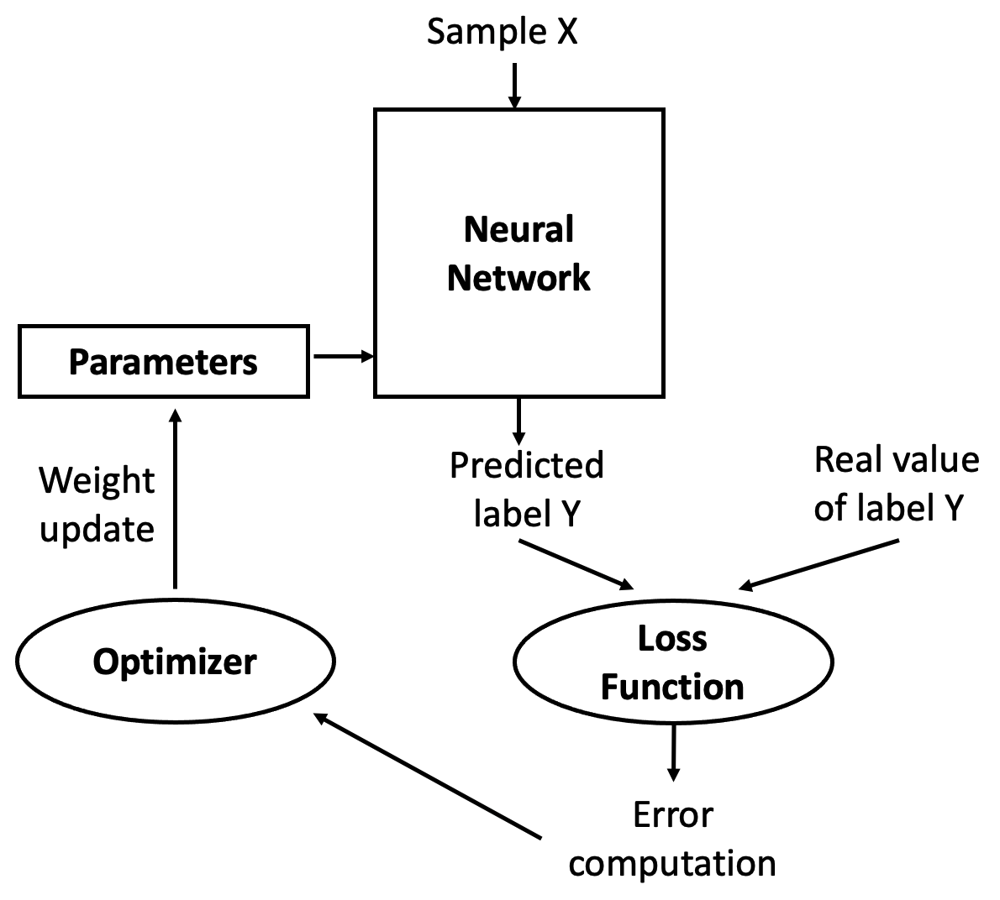

*Figure 8.3 – The optimizer uses the computed error to update the parameters.*

#### Iterative Training Process

Training a neural network is an iterative process of passing data forward and error signals backward through the network. The forward pass is called forward propagation; the backward pass is known as backpropagation.

In the forward propagation phase, training data is fed into the network, passing through each layer as neurons transform the data based on their parameters. Eventually, the final layer produces a prediction (label).

Next, the network computes the loss by comparing the prediction to the correct label. Since we are in a supervised learning setting, the correct label is known.

If the loss is high, the network needs to adjust its weights. This is done during backpropagation (see Figure 8.4), where the error is propagated backward through the layers, each neuron receiving a fraction of the total error signal based on its contribution.


*Figure 8.4 – A conceptual overview of the iterative learning process.*

Once the backward signal reaches each neuron, its weights can be updated in the right direction. This is where gradient descent comes in. The idea is to slightly change the weights in a way that reduces the loss for the next prediction. This is repeated over multiple iterations or epochs.

To summarize, the learning algorithm involves the following steps:

1.  Start with initial (usually random) parameter values (weights wᵢ and biases bᵢ).

2.  Take a batch of training examples and compute predictions via forward propagation.

3.  Compare predictions to true labels and compute the loss.

4.  Backpropagate the error to compute how each parameter contributed to the loss.

5.  Update the parameters using gradient descent.

6.  Repeat the process until the model achieves satisfactory performance.

These steps are visually summarized in Figure 8.5.


*Figure 8.5 – Key steps in the iterative training process.*

Training performance is governed by the slowest stage in this pipeline. Accelerating computation alone does not guarantee faster training if data delivery, memory access, or framework overhead becomes limiting.

This pipeline abstraction will serve as a recurring mental model in the following chapters, where we study how training behavior changes as hardware acceleration and parallel execution are introduced.

#### Backpropagation Components

As we saw above, backpropagation adjusts the network's weights and biases by applying the computed error. In Keras, this is configured via the compile() method. For example, in Chapter 5 we used:


    model.compile(loss='categorical_crossentropy',
                  optimizer='sgd',
                  metrics=['accuracy'])

This specifies a loss function, an optimizer, and evaluation metrics. These hyperparameters define the training behavior. We’ll now describe gradient descent before diving deeper into the loss and optimizer components.

### Gradient Descent

Gradient Descent is the core optimization method used in deep learning. It updates model parameters to minimize the loss. Because neural networks are differentiable, we can compute the gradient of the loss with respect to each parameter and adjust in the direction that reduces the loss.

#### Basic Idea

Think of it like a hiker descending a foggy mountain (Figure 8.6). Unable to see the valley, they feel the slope under their feet and take steps downhill. Gradient descent works the same way: it follows the negative gradient, which points in the direction of the steepest loss decrease.

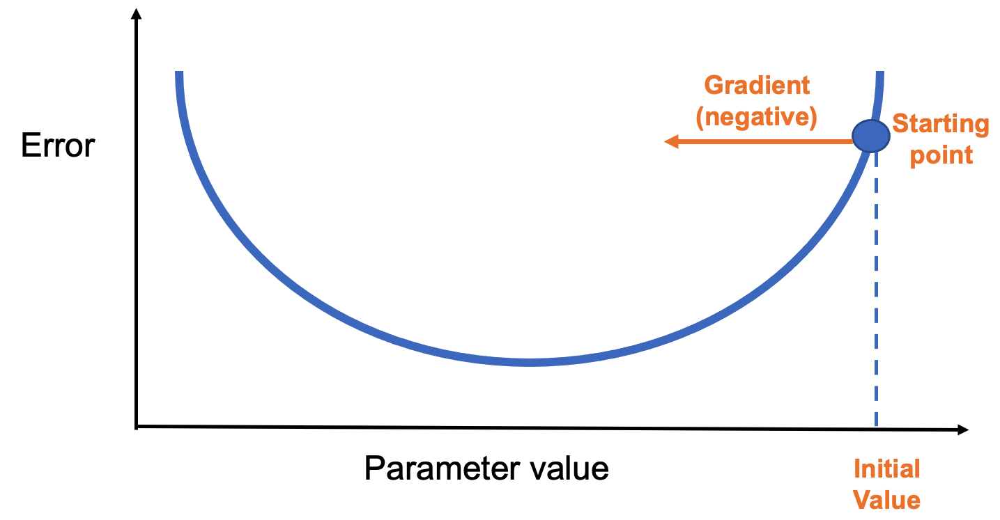

*Figure 8.6 – A simple loss curve showing the gradient direction from the starting point.*

Each step adjusts the parameter in the negative gradient direction(Figure 8.7). The step size is determined by a hyperparameter called the learning rate, which we’ll explore in the next chapter.

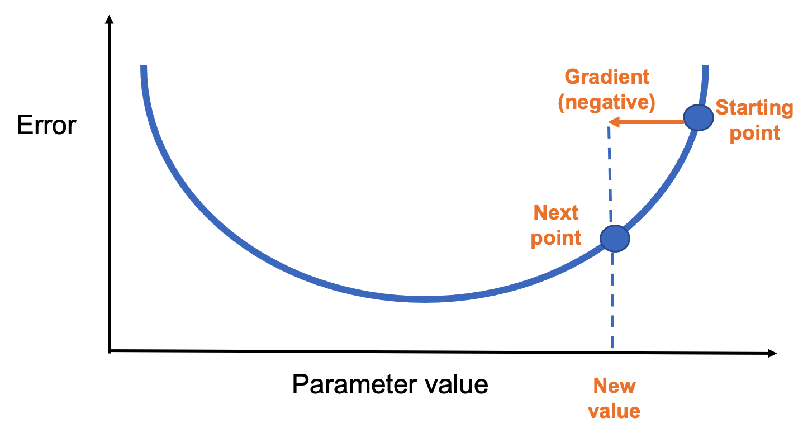

*Figure 8.7 – Gradient descent updates the parameter in the negative gradient direction.*

After enough steps, the process reaches a minimum of the loss function (Figure 8.8).

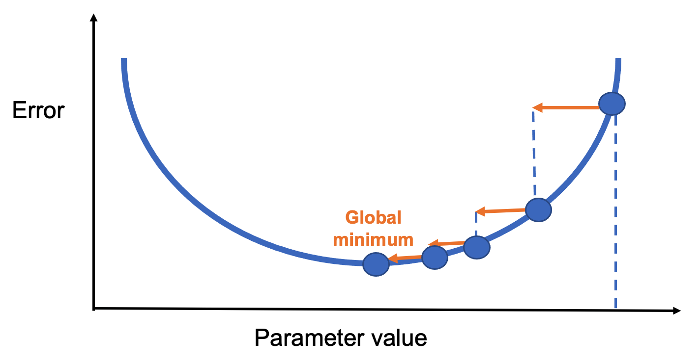

*Figure 8.8 – Convergence to a global minimum through iterative updates.*

#### Types of Gradient Descent

How often should we update the parameters? That depends on the batch size:

- Stochastic Gradient Descent (SGD): Updates after every single data point.

- Batch Gradient Descent: Updates after processing the entire dataset.

- Mini-Batch Gradient Descent: Updates after processing a small subset (mini-batch).

Mini-batch is the most commonly used method, balancing speed and accuracy. It also benefits from GPU efficiency.

In TensorFlow, this is easy to implement:


    model.fit(X_train, y_train, epochs=5, batch_size=100)

This runs 5 training epochs with batches of 100 samples.

#### Loss Functions

A loss function measures how well the model is doing during training. It’s essential for guiding the learning process. Keras provides many loss functions under tf.keras.losses, each suited to different problems:

- categorical_crossentropy: for multi-class classification with one-hot labels

- sparse_categorical_crossentropy: for multi-class with integer labels

- binary_crossentropy: for binary classification with sigmoid outputs

- mean_squared_error: for regression tasks

The loss function should match the output layer. For example, softmax + categorical_crossentropy is a standard combination for classification.

#### Optimizers

The optimizer defines how gradients are applied. In addition to SGD, Keras supports advanced optimizers like:

- RMSprop

- AdaGrad

- Adam

- Nadam

Each has advantages in different situations, and all have tunable hyperparameters. For example:


    from tensorflow.keras.optimizers import RMSprop
    my_optimizer = RMSprop(learning_rate=0.001)
    model.compile(optimizer=my_optimizer, loss='binary_crossentropy', metrics=['accuracy'])

Choosing the right optimizer can significantly impact training speed and model quality.

## Parameters and Hyperparameters in Neural Networks

In this section, we explore hyperparameters in greater depth. These are the variables that define the structure of a neural network or determine how it is trained. Hyperparameters are configured before the training process begins (i.e., before weights and biases are optimized), and selecting their values wisely is essential for building a good model.

The first half of the chapter presents the most common hyperparameters, which we’ll use throughout the rest of the book. The second half introduces the TensorFlow Playground, a visual tool we’ll use to experiment with the effects of hyperparameters.

Just like the previous chapter, this first part is somewhat theoretical. Nonetheless, I strongly recommend reading it, even if you don’t grasp every detail on the first pass.

### Model Parameterization

#### Why Hyperparameters Matter

If you built a neural network for digit recognition in Chapter 5 using the suggested hyperparameters, your model likely achieved around 90% accuracy. That’s an excellent result for a first model!

However, better accuracy is often achievable by adjusting certain hyperparameters. For example, replacing a sigmoid activation with a ReLU in the first layer can yield a 2% improvement with minimal computational cost:


    model.add(Dense(10, activation='relu', input_shape=(784,)))

You could also increase the number of training epochs, add more neurons per layer, or stack additional layers. These changes often improve accuracy but come with the tradeoff of longer training times. For instance, replacing a 10-neuron layer with 512 neurons:


    model.add(Dense(512, activation='relu', input_shape=(784,)))

Using the summary() method, you can confirm the parameter count increases significantly, and training takes longer. With this model, accuracy may reach 94%, and pushing to 20 epochs could raise it to 96%.

There are many such possibilities, which we’ll explore in upcoming chapters. For now, it's important to understand that finding the best configuration takes experience and experimentation.

#### Parameters vs. Hyperparameters

What’s the difference?

- Parameters are internal to the model (e.g., weights and biases). They are learned from the training data and used to make predictions after training.

- Hyperparameters are external settings defined by the programmer (e.g., activation functions, batch size). They are set before training and strongly influence performance.

Choosing optimal hyperparameters is difficult. The most common method is manual tuning—trial and error. That’s why deep learning is often described as more of an art than a science.

#### Hyperparameter Categories

Broadly, we can group hyperparameters into two types:

- Network structure: number of layers, number of neurons per layer, activation functions, weight initialization, etc.

- Learning algorithm: epochs, batch size, learning rate, momentum, etc.

This section focuses on the second group. We’ll explore structure-related hyperparameters later when we introduce convolutional and recurrent neural networks.

### Hyperparameters Related to the Learning Algorithm

#### Epochs

The number of epochs defines how many times the entire training dataset passes through the network. Too many epochs may lead to overfitting, where the model performs well on training data but poorly on validation or test data.

It may also trigger problems like vanishing gradients or exploding gradients, which occur during backpropagation when gradients become either too small or too large. Vanishing gradients make learning extremely slow because the weight updates become negligible, especially in deep networks. Exploding gradients, on the other hand, cause unstable updates, with weights growing uncontrollably and potentially leading to numerical overflow. Both issues can severely affect the training process and prevent the network from converging to a good solution.

Too few epochs might prevent the model from learning enough patterns from the training data. This situation is known as underfitting, and it occurs when the model is too simple or hasn't trained long enough to capture the underlying structure in the data. As a result, it performs poorly both on training and validation datasets.

On the other hand, training for too many epochs can lead to overfitting. In this case, the model becomes overly specialized to the training data, including noise and random fluctuations that do not generalize to new, unseen data. A classic symptom of overfitting is when training accuracy keeps improving, but validation accuracy starts to degrade. This means the model is memorizing the training data instead of learning general patterns.

To find the right number of epochs, practitioners often experiment by training the model and monitoring both training and validation performance. The goal is to stop training just before overfitting begins—when validation accuracy reaches its peak and starts to decline. This point indicates the model is learning meaningful patterns without yet becoming overly tailored to the training set.

#### Batch Size

As discussed earlier, training data is split into batches. In Keras, the batch_size argument in fit() defines how many samples are processed in each training iteration. The optimal size depends on your hardware (especially memory capacity).

#### Learning Rate and Decay

The gradient vector points in the direction and magnitude of the steepest increase in loss. Gradient descent algorithms multiply this by a learning rate (a scalar) to determine how far to step in the parameter space.

Example: with a gradient magnitude of 1.5 and a learning rate of 0.01, the next point is 0.015 away.

Choosing the right learning rate is critical. If it’s too large, the algorithm may overshoot the minimum and bounce around chaotically (Figure 8.9).

If it's too small, progress is slow and training takes much longer. A good rule of thumb: if the model fails to learn, try lowering the learning rate.

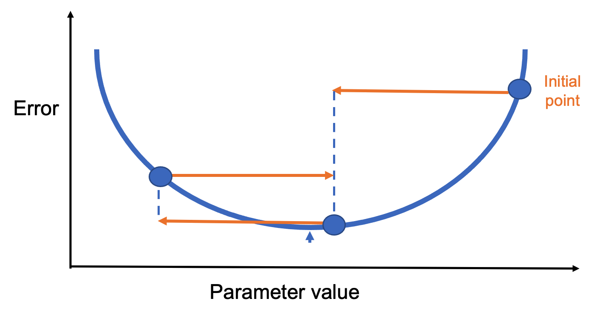

*Figure 8.9 – A too-large learning rate can prevent convergence.*

A more refined approach is to use learning rate decay—a gradual reduction in the learning rate as training progresses. This allows fast initial learning, followed by fine-tuning. The optimal learning rate may also depend on the optimizer. For instance:

- SGD: ~0.1

- Adam: 0.001 to 0.01

Experimentation is encouraged.

#### Momentum

Momentum helps the model maintain direction during training, especially in ravine-like landscapes. Imagine rolling a ball down a slope—it gradually builds speed and carries it forward, even through flat or bumpy sections.

Figure 8.10 shows a loss function with multiple local minima. Standard gradient descent might get stuck. Momentum allows the model to "jump over" small minima by factoring in past gradients.

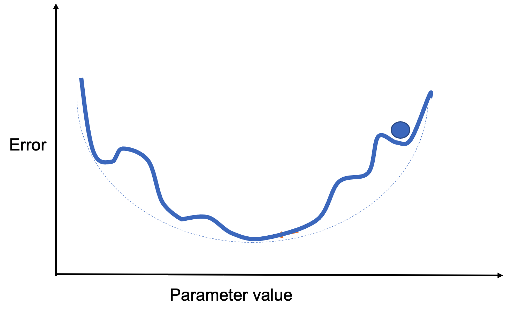

*Figure 8.10 – A loss surface with several local minima.*

Rather than averaging past steps equally, momentum applies a decay factor (a constant between 0 and 1) to weigh recent gradients more heavily. In practice, momentum-enhanced algorithms tend to perform better.

A variant, Nesterov momentum, slows updates near the solution for better convergence. In Keras:


    sgd = optimizers.SGD(lr=0.001, momentum=0.9, nesterov=True)

#### Weight Initialization

While not technically a hyperparameter, properly initializing the weights in a neural network is essential for successful training. Using small random values at the beginning helps break symmetry between neurons. If two neurons start with exactly the same weights, they will perform the same computations and update identically during training. As a result, they will learn redundant features and reduce the model’s expressive power.

Although initializing weights using a standard normal distribution is a common approach, it can lead to issues such as vanishing gradients (when gradients become too small to update weights effectively) or exploding gradients (when gradients grow too large, causing unstable updates). These problems are especially common in deep networks. To mitigate them, more refined initialization strategies have been developed that take into account the type of activation function used in the network. These heuristics help stabilize the training process and improve convergence.

### System-Level Implications: Hyperparameters as Resource Constraints

In practice, many hyperparameters in neural network training have direct system-level implications. Batch size, for example, is not only a learning parameter but also a primary determinant of memory usage and computational intensity.

Larger batch sizes increase arithmetic intensity and can improve hardware utilization, but they also increase memory pressure due to larger activation tensors. Similarly, learning rate scaling strategies are often constrained by how effectively the underlying system can sustain higher throughput.

From an HPC perspective, tuning hyperparameters is therefore not purely an algorithmic exercise—it is a form of resource management, balancing computation, memory capacity, and execution efficiency.

### Activation Functions

Activation functions control how the output of one neuron flows to the next layer. Here are some of the most common, all available in Keras:

- Linear: Identity function. Used in specific scenarios where no transformation is needed (Figure 8.11).

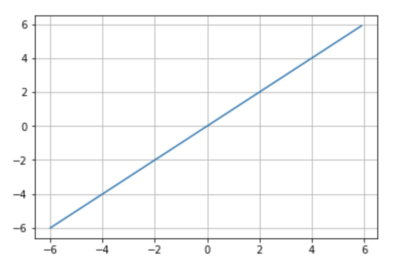

*Figure 8.11 – Linear activation function.*

- Sigmoid: Maps any value to a range between 0 and 1. Useful for probabilities and binary classification (Figure 8.12).


*Figure 8.12 – Sigmoid activation function.*

- Tanh: Similar to sigmoid but ranges from -1 to 1. Better suited for some networks due to centered output (Figure 8.13).

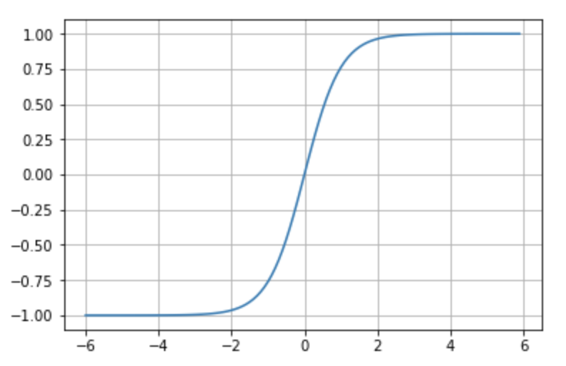

*Figure 8.13 – Tanh activation function.*

- Softmax: Converts outputs into a probability distribution over classes. Used in the output layer for multi-class classification.

- ReLU (Rectified Linear Unit): Outputs 0 for negative inputs and passes through positive inputs. Highly effective and widely used (Figure 8.14).

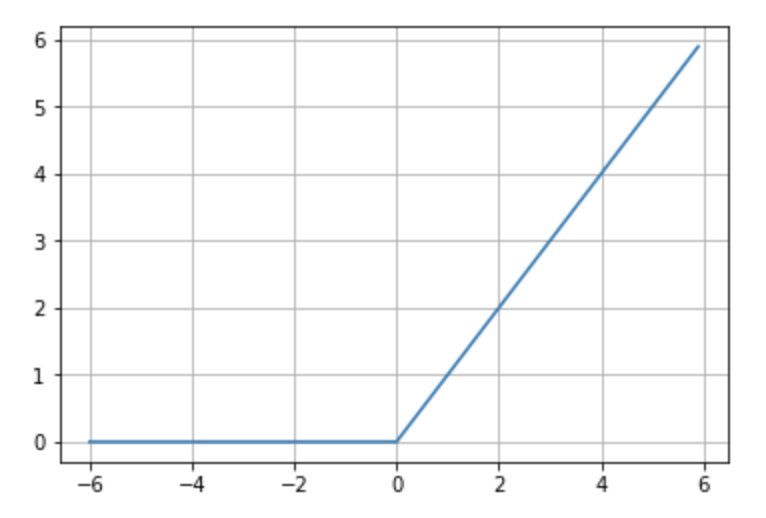

*Figure 8.14 – ReLU activation function.*

## Convolutional Neural Networks

### Introduction to Convolutional Neural Networks

We are now ready to introduce a new type of neural network architecture: Convolutional Neural Networks (CNNs). These networks are a cornerstone of computer vision and represent one of the many specialized architectures available today, which we will explore further in our hands-on sessions.

In this section, we will work through a step-by-step example to build our understanding of CNNs. Specifically, we will design a CNN to solve the digit recognition task from the MNIST dataset—already familiar from previous chapters. In the final section, we will revisit the Fashion-MNIST dataset to summarize the key ideas introduced in Part II of the book.

#### Overview

Convolutional Neural Networks (CNNs or ConvNets) are a class of neural networks that became immensely popular over the last decade due to their outstanding performance in image recognition tasks. While the basic structure of CNNs is similar to the fully connected neural networks introduced earlier—with learnable weights and biases—they differ by making an explicit assumption that the input data is image-based, allowing the architecture to encode spatial relationships within the data.

To build an intuitive understanding, consider how we recognize a human face: we identify parts such as eyes, ears, a nose, and a mouth, and then assess their relative positions. Even if one ear is hidden, we might still recognize the face if the other features are clearly visible. Similarly, CNNs classify images by detecting increasingly complex features, starting with simple lines and shapes and progressing to object-level abstractions.

This idea is often illustrated using the example in Figure 8.15, adapted from a well-known article by Andrew Ng’s group:


*Figure* 8.15 – A first convolutional layer learns basic elements such as edges. A second layer composes these into more complex patterns. Each layer progressively learns more abstract features.*

CNNs include two key types of layers: convolutional layers, which extract local features, and pooling layers, which reduce spatial resolution while retaining essential information. We’ll explain both through the MNIST digit classification example.

#### Convolution Operation

Unlike fully connected layers, which learn global patterns across the entire input space, convolutional layers focus on local patterns. They do so by sliding a small window—called a filter or kernel—over the input and applying a dot product at each location.

This approach offers several advantages:

- Parameter efficiency through weight sharing across the input.

- Translation invariance, enabling learned patterns to be recognized in different parts of the image.

- Spatial hierarchy learning, where deeper layers capture higher-level features.

CNNs typically operate on 3D input tensors, often called feature maps, with dimensions (height, width, channels). For grayscale images like MNIST digits, the depth (channel dimension) is 1.

In MNIST, the input size is 28×28. This becomes a 3D tensor with shape (28, 28, 1). A convolutional layer might apply a 5×5 filter across this input, sliding the window across the image. Each filter detects a specific pattern—like edges or textures—and produces a 2D activation map. This process is shown in Figure 8.16.

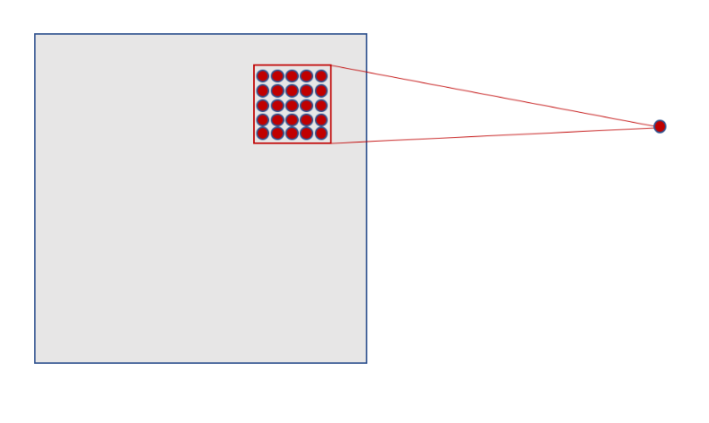

*Figure 8.16 – Each neuron in the hidden layer connects to a small 5×5 region in the input layer.*

As the filter slides across the input (stride = 1), it generates activations at each position. For a 28×28 input and 5×5 filter, this results in a 24×24 activation map, as shown in Figure 8.17.

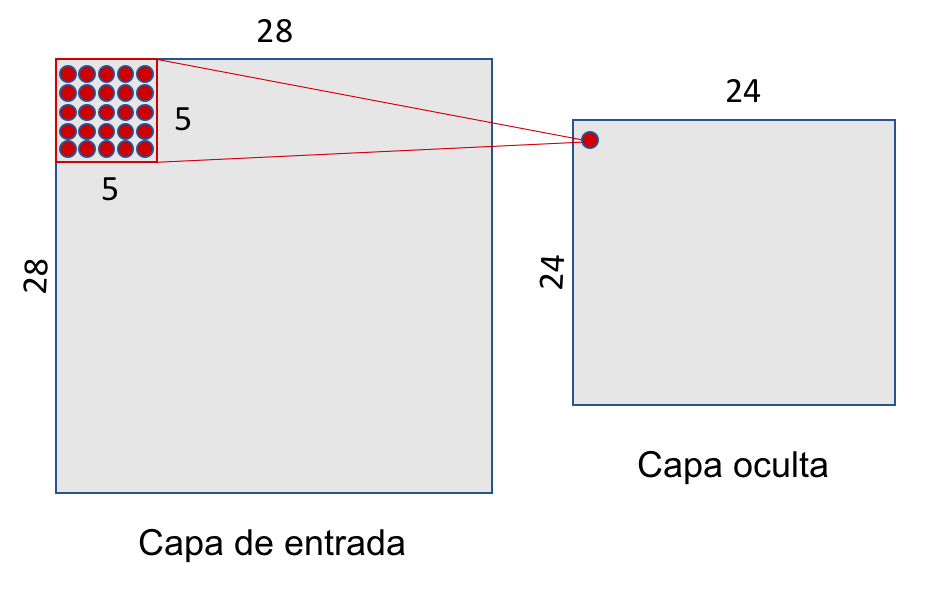

*Figure 8.17 – A 5×5 sliding window over a 28×28 input yields a 24×24 hidden layer.*

A single filter uses the same weights across the entire input, drastically reducing the number of parameters compared to fully connected layers. For example, using one 5×5 filter with one value results in 26 parameters instead of thousands.

In practice, we use multiple filters to capture different features. For instance, 32 filters produce a 3D tensor with shape (24, 24, 32), as illustrated in Figure 8.18.

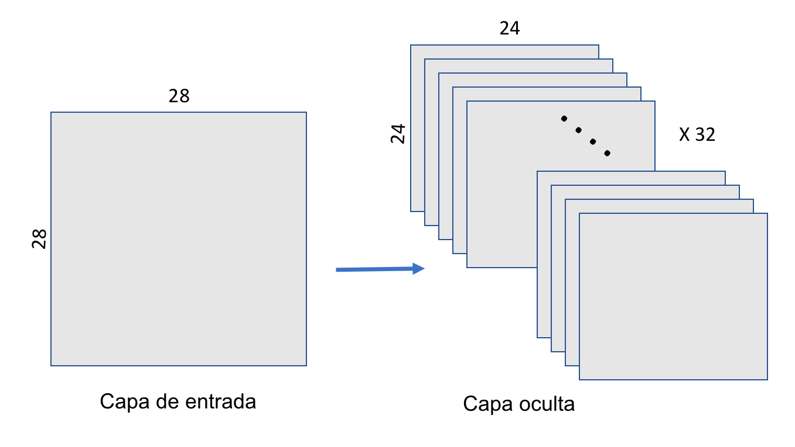

*Figure 8.18 – A convolutional layer applies 32 filters, producing a 3D output of shape (24, 24, 32).*

#### Pooling Operation

After convolution, CNNs typically apply pooling layers to reduce dimensionality and computation. The most common type is max-pooling, which downsamples each feature map by selecting the maximum value in non-overlapping windows.

In our MNIST example, we use a 2×2 max-pooling window. The result is a 12×12 activation map, as shown in Figure 8.19.

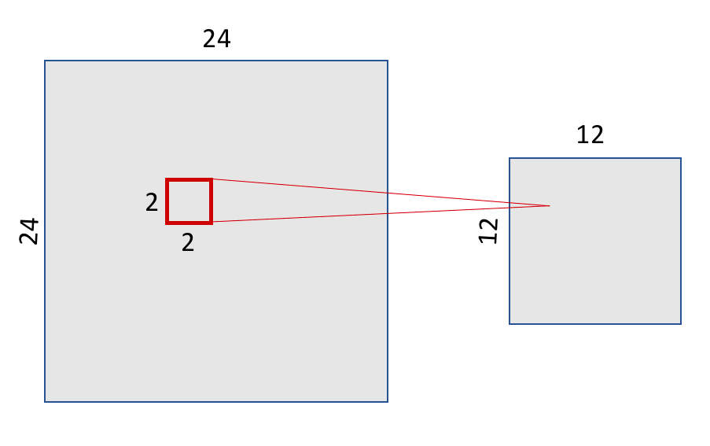

*Figure 8.19 – Max-pooling with a 2×2 window reduces the 24×24 feature map to 12×12.*

Pooling preserves the spatial structure of features. Figure 8.20 illustrates this by showing how a 7 remains recognizable even after downsampling.

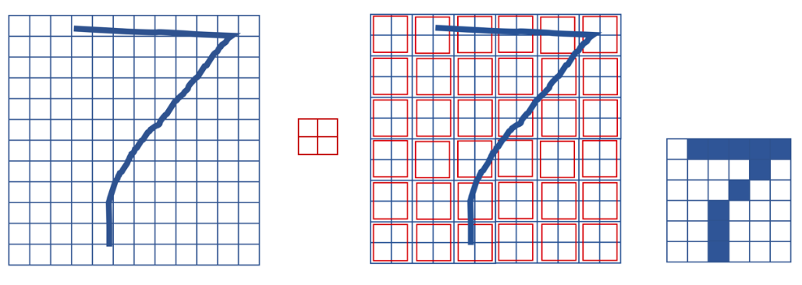

*Figure 8.20 – Max-pooling preserves spatial structure while reducing resolution.*

Each filter in the convolutional layer corresponds to a feature map, so the pooling layer will output the same number of channels. Figure 8.21 shows the pooling layer structure.

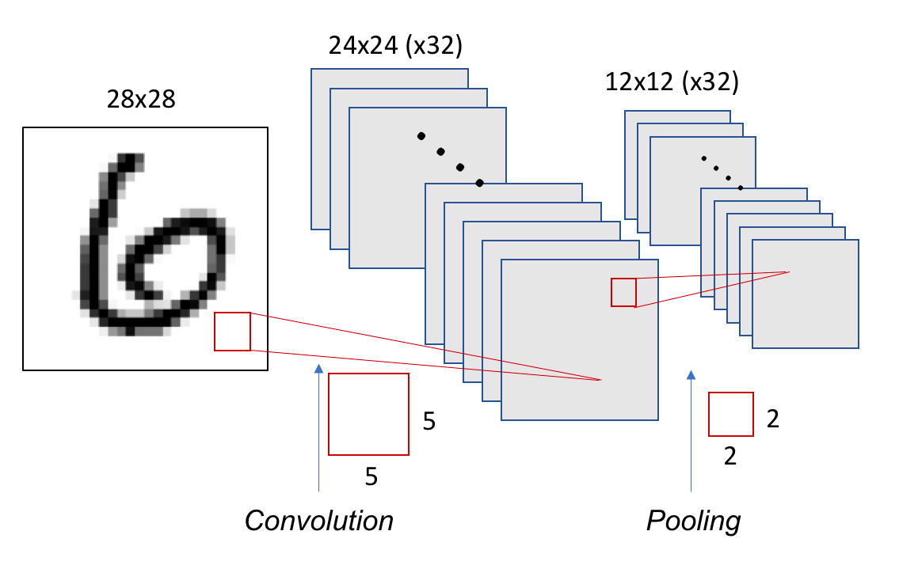

*Figure 8.21 – Each of the 32 filters from the convolutional layer produces a 12×12 map after pooling.*

### Building a Basic CNN in Keras

Let’s implement the CNN just described. We'll use a stride of 1 and no padding (i.e., no zero-padding around the image). The pooling window will


    from tensorflow.keras import Sequential
    from tensorflow.keras.layers import Conv2D
    from tensorflow.keras.layers import MaxPooling2D

    model = Sequential()
    model.add(Conv2D(32, (5, 5), activation='relu', 
          input_shape=(28, 28, 1)))
    model.add(MaxPooling2D((2, 2)))

This model contains 832 parameters: (32 filters) × (5×5 weights + 1 bias):


    model.summary()

Model: "sequential"

\_\_\_\_\_\_\_\_\_\_\_\_\_\_\_\_\_\_\_\_\_\_\_\_\_\_\_\_\_\_\_\_\_\_\_\_\_\_\_\_\_\_\_\_\_\_\_\_\_\_\_\_\_\_\_\_\_\_\_\_\_\_\_\_\_

Layer (type) Output Shape Param \#

=================================================================

conv2d (Conv2D) (None, 24, 24, 32) 832

\_\_\_\_\_\_\_\_\_\_\_\_\_\_\_\_\_\_\_\_\_\_\_\_\_\_\_\_\_\_\_\_\_\_\_\_\_\_\_\_\_\_\_\_\_\_\_\_\_\_\_\_\_\_\_\_\_\_\_\_\_\_\_\_\_

max_pooling2d (MaxPooling2D) (None, 12, 12, 32) 0

=================================================================

Total params: 832

Trainable params: 832

Non-trainable params: 0

We can deepen the model by stacking layers:


    model = Sequential()
    model.add(Conv2D(32, (5, 5), activation='relu', 
              input_shape=(28, 28, 1)))
    model.add(MaxPooling2D((2, 2)))
    model.add(Conv2D(64, (5, 5), activation='relu'))
    model.add(MaxPooling2D((2, 2)))
    model.summary()

The second Conv2D layer has 51,264 parameters, computed as: (5×5×32 + 1) × 64:

\_\_\_\_\_\_\_\_\_\_\_\_\_\_\_\_\_\_\_\_\_\_\_\_\_\_\_\_\_\_\_\_\_\_\_\_\_\_\_\_\_\_\_\_\_\_\_\_\_\_\_\_\_\_\_\_\_\_\_\_\_\_\_\_\_

Layer (type) Output Shape Param \#

=================================================================

conv2d_1 (Conv2D) (None, 24, 24, 32) 832

\_\_\_\_\_\_\_\_\_\_\_\_\_\_\_\_\_\_\_\_\_\_\_\_\_\_\_\_\_\_\_\_\_\_\_\_\_\_\_\_\_\_\_\_\_\_\_\_\_\_\_\_\_\_\_\_\_\_\_\_\_\_\_\_\_

max_pooling2d_1 (MaxPooling2 (None, 12, 12, 32) 0

\_\_\_\_\_\_\_\_\_\_\_\_\_\_\_\_\_\_\_\_\_\_\_\_\_\_\_\_\_\_\_\_\_\_\_\_\_\_\_\_\_\_\_\_\_\_\_\_\_\_\_\_\_\_\_\_\_\_\_\_\_\_\_\_\_

conv2d_2 (Conv2D) (None, 8, 8, 64) 51264

\_\_\_\_\_\_\_\_\_\_\_\_\_\_\_\_\_\_\_\_\_\_\_\_\_\_\_\_\_\_\_\_\_\_\_\_\_\_\_\_\_\_\_\_\_\_\_\_\_\_\_\_\_\_\_\_\_\_\_\_\_\_\_\_\_

max_pooling2d_2 (MaxPooling2 (None, 4, 4, 64) 0

=================================================================

Total params: 52,096

Trainable params: 52,096

Non-trainable params: 0

\_\_\_\_\_\_\_\_\_\_\_\_\_\_\_\_\_\_\_\_\_\_\_\_\_\_\_\_\_\_\_\_\_\_\_\_\_\_\_\_\_\_\_\_\_\_\_\_\_\_\_\_\_\_\_\_\_\_\_\_\_\_\_\_\_

To classify the result, we flatten the 3D output (4×4×64 = 1024) and add a softmax classifier:


    from tensorflow.keras.layers import Dense, Flatten

    model.add(Flatten())
    model.add(Dense(10, activation='softmax'))

Full model:


    from tensorflow.keras import Sequential
    from tensorflow.keras.layers import Conv2D, MaxPooling2D, Dense, Flatten

    model = Sequential()
    model.add(Conv2D(32, (5, 5), activation='relu', input_shape=(28, 28, 1)))
    model.add(MaxPooling2D((2, 2)))
    model.add(Conv2D(64, (5, 5), activation='relu'))
    model.add(MaxPooling2D((2, 2)))
    model.add(Flatten())
    model.add(Dense(10, activation='softmax'))
    model.summary()

Summary:

- Parameters: 62,346

- Output shape: 10 (for 10 digits)

\_\_\_\_\_\_\_\_\_\_\_\_\_\_\_\_\_\_\_\_\_\_\_\_\_\_\_\_\_\_\_\_\_\_\_\_\_\_\_\_\_\_\_\_\_\_\_\_\_\_\_\_\_\_\_\_\_\_\_\_\_\_\_\_\_

Layer (type) Output Shape Param \#

=================================================================

conv2d_1 (Conv2D) (None, 24, 24, 32) 832

\_\_\_\_\_\_\_\_\_\_\_\_\_\_\_\_\_\_\_\_\_\_\_\_\_\_\_\_\_\_\_\_\_\_\_\_\_\_\_\_\_\_\_\_\_\_\_\_\_\_\_\_\_\_\_\_\_\_\_\_\_\_\_\_\_

max_pooling2d_1 (MaxPooling2 (None, 12, 12, 32) 0

\_\_\_\_\_\_\_\_\_\_\_\_\_\_\_\_\_\_\_\_\_\_\_\_\_\_\_\_\_\_\_\_\_\_\_\_\_\_\_\_\_\_\_\_\_\_\_\_\_\_\_\_\_\_\_\_\_\_\_\_\_\_\_\_\_

conv2d_2 (Conv2D) (None, 8, 8, 64) 51264

\_\_\_\_\_\_\_\_\_\_\_\_\_\_\_\_\_\_\_\_\_\_\_\_\_\_\_\_\_\_\_\_\_\_\_\_\_\_\_\_\_\_\_\_\_\_\_\_\_\_\_\_\_\_\_\_\_\_\_\_\_\_\_\_\_

max_pooling2d_2 (MaxPooling2 (None, 4, 4, 64) 0

\_\_\_\_\_\_\_\_\_\_\_\_\_\_\_\_\_\_\_\_\_\_\_\_\_\_\_\_\_\_\_\_\_\_\_\_\_\_\_\_\_\_\_\_\_\_\_\_\_\_\_\_\_\_\_\_\_\_\_\_\_\_\_\_\_

flatten_1 (Flatten) (None, 1024) 0

\_\_\_\_\_\_\_\_\_\_\_\_\_\_\_\_\_\_\_\_\_\_\_\_\_\_\_\_\_\_\_\_\_\_\_\_\_\_\_\_\_\_\_\_\_\_\_\_\_\_\_\_\_\_\_\_\_\_\_\_\_\_\_\_\_

dense_1 (Dense) (None, 10) 10250

=================================================================

Total params: 62,346

Trainable params: 62,346

Non-trainable params: 0

\_\_\_\_\_\_\_\_\_\_\_\_\_\_\_\_\_\_\_\_\_\_\_\_\_\_\_\_\_\_\_\_\_\_\_\_\_\_\_\_\_\_\_\_\_\_\_\_\_\_\_\_\_\_\_\_\_\_\_\_\_\_\_\_\_

The shape of tensors throughout the network is visualized in Figure 8.22.

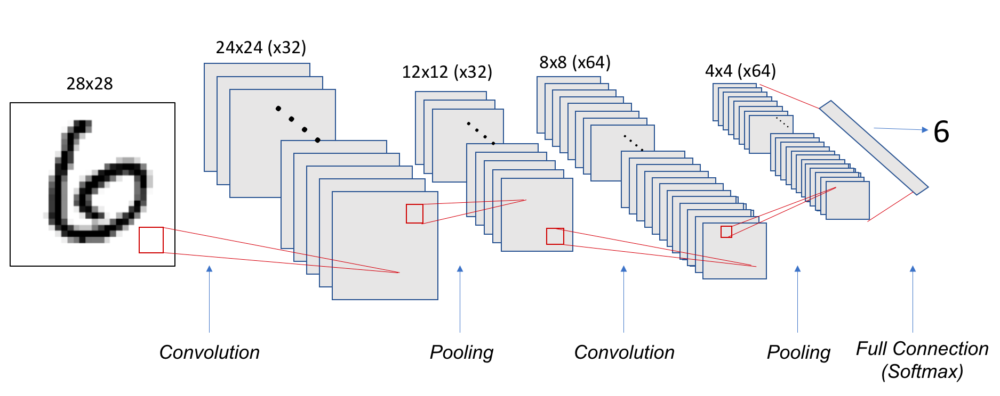

*Figure 8.22 – Tensor shapes in the convolutional and pooling layers of our CNN example.*

#### Training and Evaluating the Model

We now prepare the data and train the CNN. Key difference: we reshape input to (28, 28, 1) instead of flattening.


    from tensorflow.keras.utils import to_categorical

    mnist = tf.keras.datasets.mnist
    (train_images, train_labels), (test_images, test_labels)   
          = mnist.load_data()

    train_images = train_images.reshape((60000, 28, 28, 1))
    train_images = train_images.astype('float32') / 255

    test_images = test_images.reshape((10000, 28, 28, 1))
    test_images = test_images.astype('float32') / 255

    train_labels = to_categorical(train_labels)
    test_labels = to_categorical(test_labels)


    model.compile(loss='categorical_crossentropy',
                  optimizer='sgd',
                  metrics=['accuracy'])

    model.fit(train_images, train_labels,
              batch_size=100,
              epochs=5,
              verbose=1)

    test_loss, test_acc = model.evaluate(test_images, test_labels)

    print('Test accuracy:', test_acc)

Test accuracy: 0.9704

The model trains more slowly than a fully connected model, even with only two Conv2D layers and five epochs. This highlights the need for GPU acceleration when working with deeper CNNs and larger datasets.

### Coding Convolutional Neural Network

The code below summarizes the complete CNN pipeline, and can be executed in the same Colab notebook used earlier.


    from tensorflow.keras import Sequential
    from tensorflow.keras.layers import Conv2D
    from tensorflow.keras.layers import MaxPooling2D
    from tensorflow.keras.layers import Dense
    from tensorflow.keras.layers import Flatten

    model = Sequential()
    model.add(Conv2D(32, (5, 5), activation='relu', input_shape=(28, 28, 1)))
    model.add(MaxPooling2D((2, 2)))
    model.add(Conv2D(64, (5, 5), activation='relu'))
    model.add(MaxPooling2D((2, 2)))

    from tensorflow.keras.layers import Dense
    from tensorflow.keras.layers import Flatten

    model.add(Flatten())
    model.add(Dense(10, activation='softmax'))
    model.summary()
    from tensorflow.keras.utils import to_categorical

    #mnist = tf.keras.datasets.mnist(train_images, train_labels), (test_images, test_labels) = mnist.load_data()

    mnist = tf.keras.datasets.mnist
    (train_images, train_labels), (test_images, test_labels) = mnist.load_data()

    print (train_images.shape)
    print (train_labels.shape)
    train_images = train_images.reshape((60000, 28, 28, 1))
    train_images = train_images.astype('float32') / 255

    test_images = test_images.reshape((10000, 28, 28, 1))
    test_images = test_images.astype('float32') / 255

    train_labels = to_categorical(train_labels)
    test_labels = to_categorical(test_labels)

    model.compile(loss='categorical_crossentropy',
                  optimizer='sgd',
                  metrics=['accuracy'])
    model.fit(train_images, train_labels, batch_size=100, epochs=5, verbose=1)
    test_loss, test_acc = model.evaluate(test_images, test_labels)
    print('Test accuracy:', test_acc)

<br>

>**Task 8.1 — Improving a Basic CNN Model**
>
>In this task, you will design, train, and evaluate an improved convolutional neural network based on the baseline CNN introduced in this section.
>
>Starting from the reference architecture (two convolutional layers followed by pooling and a softmax classifier), modify the model to improve its performance on the MNIST dataset. You are free to introduce architectural changes, provided that they remain consistent with the concepts presented so far.
>
>Possible modifications include, but are not limited to:
>
>• Adding additional convolutional layers.
>
>• Changing the number of filters per layer.
>
>• Modifying kernel sizes.
>
>• Introducing dropout or batch normalization layers.
>
>• Adjusting the optimizer or learning rate.
>
>Train your modified model under the same conditions as the baseline (dataset, number of epochs, and evaluation procedure) to ensure a fair comparison.
>
>In your analysis, address the following points:
>
>• Describe the architectural changes you introduced and explain the motivation behind them.
>
>• Compare the test accuracy of your model with that of the baseline CNN.
>
>• Discuss how the number of parameters and the depth of the network changed.
>
>• Comment on any observable differences in training time or convergence behavior.
>
>This task is not about achieving the highest possible accuracy. Its goal is to help you develop intuition about how architectural choices in convolutional networks affect model capacity, computational cost, and training behavior. These considerations will become increasingly important in later chapters, where performance, scalability, and hardware constraints play a central role.

## Training Our First Neural Network on MN5

Before we move on to more sophisticated setups, it's worth understanding how a basic Python script behaves when executed on a high performance computing (HPC) platform like MareNostrum 5 (MN5). While training deep learning models typically requires compute nodes and parallelism, this section serves as a gentle introduction to the MN5 environment.

*Note: Login nodes are intended for light tasks such as editing, compiling, or job submission. Although long executions are strictly prohibited here, for pedagogical purposes we will run a simple script once interactively to get familiar with the environment.*

#### Step 1: Preparing the Script

We’ll start by saving our convolutional model (used previously with MNIST) as a Python script (.py format) rather than a Jupyter notebook (.ipynb). You can export a .py version directly from your notebook and use scp to transfer it from your laptop to the MN5 login node.

The script structure is straightforward:


    import tensorflow as tf 
    from tensorflow import keras
    import numpy as np
    import matplotlib.pyplot as plt
    print(tf.__version__)

    from tensorflow.keras import Sequential
    from tensorflow.keras.layers import ...
    .
    .
    .

    model = Sequential()
    model.add(...)
    .
    .
    .

    from keras.utils import to_categorical
    mnist = tf.keras.datasets.mnist
    (train_images, train_labels), (test_images, test_labels) = mnist.load_data()
    train_images = ...
    test_images = ...
    train_labels = to_categorical(train_labels)
    test_labels = to_categorical(test_labels)

    model.compile(...)
    model.fit(...)
    test_loss, test_acc = model.evaluate(...)

    print(´Test accuracy:’, test_acc)

*Important: Marenostrum 5 does not have direct access to external internet resources. Therefore, we have already preloaded the MNIST dataset onto the GPFS filesystem, under the path /gpfs/scratch/\<group\>/mnist.npz.*

To use it:


    mnist = tf.keras.datasets.mnist
    (train_images, train_labels), (test_images, test_labels) = 
                                   mnist.load_data(path='/gpfs/scratch/<group>/mnist.npz')

Assume your script is saved as MNIST.py. This will be your first standalone executable deep learning training script on Marenstrum 5.

>**Task 8.2 — Exporting the Python Script**
>
>In this task, you will prepare your convolutional neural network code for execution on the MareNostrum 5 supercomputer by converting it from a Jupyter Notebook into a standalone Python script.
>
>Proceed as follows:
>
>1\. Export the Jupyter Notebook used in the previous section as a Python script (.py).
>
>2\. Review the generated script and ensure that all required imports, model definitions, and training steps are included.
>
>3\. Use scp to transfer the .py file from your local machine to your home directory on MN5.
>
>The resulting script should follow a standard deep learning training structure:
>
>• Import required libraries.
>
>• Define the CNN model.
>
>• Load and preprocess the MNIST dataset.
>
>• Compile the model.
>
>• Train the model.
>
>• Evaluate and report final accuracy.
>
>Important: MareNostrum 5 does not allow direct access to external internet resources from compute nodes. For this reason, the MNIST dataset has already been preloaded on the GPFS filesystem under the path:
>
>/gpfs/scratch/\<group\>/mnist.npz
>
>Ensure that your script explicitly loads the dataset from this location using the path argument of tf.keras.datasets.mnist.load_data().
>
>Assume that your final script is named MNIST.py. This file will be used unchanged in the following tasks.

#### Running the Script Interactively

To execute this file, load the proper software environment using Singularity. For this course, we rely on the pre-built container *MN5-NGC-TensorFlow-23.03.sif*.


    module load singularity

    SINGULARITY_CONTAINER=/gpfs/scratch/<group>/MN5-NGC-TensorFlow-23.03.sif
    singularity exec $SINGULARITY_CONTAINER python MNIST.py

Although this runs on a login node (just once), it will let you see the training progress printed to standard output, and TensorFlow's initialization messages to standard error.

>**Task 8.3 — Running Your First Natural Network on a Login Node**
>
>In this task, you will execute your MNIST training script interactively on a MareNostrum 5 login node. The objective is not performance, but to become familiar with how a standalone deep learning script behaves in the HPC environment.
>
>Proceed as follows:
>
>1\. Log in to MN5 and move to the directory containing MNIST.py.
>
>2\. Load the Singularity module.
>
>3\. Execute the script using the provided TensorFlow container.
>
>Although login nodes are not intended for long or compute-intensive executions, running the script once interactively allows you to:
>
>• Observe TensorFlow initialization messages.
>
>• Verify that the software environment is correctly configured.
>
>• See training progress printed to standard output.
>
>During execution, pay attention to:
>
>• Messages related to device detection (CPU/GPU visibility).
>
>• The reported time per training epoch.
>
>• Any warnings or informational messages printed by TensorFlow.
>
>After execution:
>
>• Save the standard output and error logs.
>
>• Filter out non-essential diagnostic messages.
>
>• Prepare a brief summary describing what you observed during execution.
>
>This task serves as a controlled warm-up before moving to scheduled execution on compute nodes using the batch system.

#### Submitting the Script via SLURM

After this warm-up run, let’s do things the proper way: use SLURM, the batch scheduler of MN5, to submit your job to the compute nodes.

Here is a sample MNIST.slurm job script:


    #!/bin/bash
    #SBATCH --chdir .
    #SBATCH --job-name=MNIST      
    #SBATCH --output=%x.%j.out     
    #SBATCH --error=%x.%j.err      
    #SBATCH --nodes 1                   
    #SBATCH --ntasks-per-node 1         
    #SBATCH --cpus-per-task 20          
    #SBATCH --time 00:15:00             
    #SBATCH --account <group>          
    #SBATCH --qos acc_debug             
               
    #SBATCH --gres gpu:1 


    module purge
    module load singularity

    SINGULARITY_CONTAINER=/gpfs/scratch/<group> /MN5-NGC-TensorFlow-23.03.sif
    singularity exec $SINGULARITY_CONTAINER python MNIST.py

This script requests:

- 1 node with 1 GPU

- 20 CPU cores

- A 15-minute runtime limit

- Debug queue for accelerated workloads

You may adapt the script as needed and submit it using:


    sbatch MNIST.slurm

>**Task 8.4 — Submitting Your First GPU Deep Learning Job with SLURM**
>
>In this task, you will execute the same MNIST training script as a batch job on a GPU compute node using SLURM, the workload manager of MareNostrum 5.
>
>Using the provided MNIST.slurm script as a reference:
>
>1\. Review the requested resources, including node count, CPU cores, GPU allocation, and time limit.
>
>2\. Adapt the script if necessary to match your account and group configuration.
>
>3\. Submit the job using sbatch.
>
>Once the job has completed:
>
>• Inspect the SLURM output and error files.
>
>• Verify that the job ran on a GPU-enabled node.
>
>• Confirm that TensorFlow detected and used the GPU during training.
>
>Summarize your observations, focusing on:
>
>• Differences between interactive execution on a login node and batch execution on a compute node.
>
>• The role of SLURM in allocating and managing hardware resources.
>
>• Why batch execution is the standard approach for deep learning workloads on supercomputers.
>
>From this point onward, all training experiments in this book will rely on batch submission and explicit resource allocation.

### System Perspective: Preparing for Parallel Execution

Although the experiments in this chapter focus on single-device training, the system-level behaviors observed here directly influence parallel and distributed execution. Memory usage, data pipeline efficiency, and computation granularity all affect how well training scales when additional hardware resources are introduced.

Understanding these effects at small scale is essential. Parallel training does not eliminate system constraints; it amplifies them. Inefficiencies that are negligible on a single device can become dominant bottlenecks when computation is accelerated or replicated across multiple GPUs.

This observation motivates the transition to the next chapter, where we examine how training behavior changes as parallel resources are introduced and performance becomes a primary concern.

## Pretrained Networks and Transfer Learning

As we wrap up this more theoretical part of the book, it is essential to introduce one of the most powerful and transformative ideas in modern deep learning: Transfer Learning. This concept has reshaped the way we approach training deep neural networks, especially when data or computational resources are limited.

### What is Transfer Learning?

Traditionally, training a deep neural network from scratch requires vast amounts of labeled data and considerable computational power. This is often impractical or even impossible for many real-world problems, particularly in smaller domains or research settings. Transfer Learning addresses this challenge by reusing a model that has already been trained on a large dataset for a different but related task.

The core idea is that the early layers of deep networks, especially convolutional neural networks (CNNs), learn generic features such as edges, textures, and simple shapes—components common to many vision problems. These learned features can then be repurposed for new tasks by keeping most of the network unchanged and only modifying or retraining a few final layers for the new classification problem.

This is especially useful when the original dataset used to train the network was large and diverse (such as ImageNet), enabling the pretrained model to act as a general visual feature extractor. Instead of starting from zero, we stand on the shoulders of models that have already learned a rich set of features.

Transfer learning isn’t just relevant in image processing. It is a cornerstone of modern approaches to natural language processing (NLP). Most current applications using Large Language Models (LLMs), such as ChatGPT or BERT-based architectures, are based on this principle. These models are trained on enormous corpora by major organizations and later fine-tuned on smaller, task-specific datasets by individual users or institutions. This reuse of powerful pretrained models saves time, energy, and resources, and is now the standard rather than the exception.

In short, Transfer Learning allows us to reuse knowledge—learned weights and parameters—from a network trained on a generic task and adapt it to a more specific one with significantly less data and computational effort.

### Named Architectures and Pretrained Networks

Over the years, the deep learning community has identified and refined certain architectures that consistently perform well across a wide range of tasks. These architectures—such as VGG, ResNet, Inception, DenseNet, or MobileNet—have become well-known standards. Each of them was originally proposed in a high-impact research paper and has proven its value in terms of performance and efficiency.

These "named" networks are often available as ready-to-use modules in major deep learning libraries like TensorFlow and PyTorch. Even better, they often come with pretrained weights on datasets like ImageNet, offering us a turnkey solution for high performance models.

Let’s illustrate this with a canonical example: the VGG16 architecture.

We can build it manually using Keras, specifying each layer explicitly:


    from keras.models import Sequential
    from keras.layers import Dense, Activation, Dropout, Flatten
    from keras.layers import Conv2D
    from keras.layers import MaxPooling2D

    input_shape = (224, 224, 3)

    model = Sequential()
    model.add(Conv2D(64, (3, 3), input_shape=input_shape, 
                     padding='same',activation='relu'))
    model.add(Conv2D(64, (3, 3), activation='relu', padding='same'))
    model.add(MaxPooling2D(pool_size=(2, 2), strides=(2, 2)))

    model.add(Conv2D(128, (3, 3), activation='relu', padding='same'))
    model.add(Conv2D(128, (3, 3), activation='relu', padding='same',))
    model.add(MaxPooling2D(pool_size=(2, 2), strides=(2, 2)))

    model.add(Conv2D(256, (3, 3), activation='relu', padding='same',))
    model.add(Conv2D(256, (3, 3), activation='relu', padding='same',))
    model.add(Conv2D(256, (3, 3), activation='relu', padding='same',))
    model.add(MaxPooling2D(pool_size=(2, 2), strides=(2, 2)))

    model.add(Conv2D(512, (3, 3), activation='relu', padding='same',))
    model.add(Conv2D(512, (3, 3), activation='relu', padding='same',))
    model.add(Conv2D(512, (3, 3), activation='relu', padding='same',))
    model.add(MaxPooling2D(pool_size=(2, 2), strides=(2, 2)))

    model.add(Conv2D(512, (3, 3), activation='relu', padding='same',))
    model.add(Conv2D(512, (3, 3), activation='relu', padding='same',))
    model.add(Conv2D(512, (3, 3), activation='relu', padding='same',))
    model.add(MaxPooling2D(pool_size=(2, 2), strides=(2, 2)))

    model.add(Flatten())
    model.add(Dense(4096, activation='relu'))
    model.add(Dense(4096, activation='relu'))
    model.add(Dense(1000, activation='softmax'))

If we execute model.summary(), we’ll see the complete tensor shape transitions between layers and the total number of parameters, which amounts to over 138 million:

\_\_\_\_\_\_\_\_\_\_\_\_\_\_\_\_\_\_\_\_\_\_\_\_\_\_\_\_\_\_\_\_\_\_\_\_\_\_\_\_\_\_\_\_\_\_\_\_\_\_\_\_\_\_\_\_\_\_\_\_\_\_\_\_\_

Layer (type) Output Shape Param \#

=================================================================

conv2d_1 (Conv2D) (None, 224, 224, 64) 1792

\_\_\_\_\_\_\_\_\_\_\_\_\_\_\_\_\_\_\_\_\_\_\_\_\_\_\_\_\_\_\_\_\_\_\_\_\_\_\_\_\_\_\_\_\_\_\_\_\_\_\_\_\_\_\_\_\_\_\_\_\_\_\_\_\_

conv2d_2 (Conv2D) (None, 224, 224, 64) 36928

\_\_\_\_\_\_\_\_\_\_\_\_\_\_\_\_\_\_\_\_\_\_\_\_\_\_\_\_\_\_\_\_\_\_\_\_\_\_\_\_\_\_\_\_\_\_\_\_\_\_\_\_\_\_\_\_\_\_\_\_\_\_\_\_\_

max_pooling2d_1 (MaxPooling2 (None, 112, 112, 64) 0

\_\_\_\_\_\_\_\_\_\_\_\_\_\_\_\_\_\_\_\_\_\_\_\_\_\_\_\_\_\_\_\_\_\_\_\_\_\_\_\_\_\_\_\_\_\_\_\_\_\_\_\_\_\_\_\_\_\_\_\_\_\_\_\_\_

conv2d_3 (Conv2D) (None, 112, 112, 128) 73856

\_\_\_\_\_\_\_\_\_\_\_\_\_\_\_\_\_\_\_\_\_\_\_\_\_\_\_\_\_\_\_\_\_\_\_\_\_\_\_\_\_\_\_\_\_\_\_\_\_\_\_\_\_\_\_\_\_\_\_\_\_\_\_\_\_

conv2d_4 (Conv2D) (None, 112, 112, 128) 147584

\_\_\_\_\_\_\_\_\_\_\_\_\_\_\_\_\_\_\_\_\_\_\_\_\_\_\_\_\_\_\_\_\_\_\_\_\_\_\_\_\_\_\_\_\_\_\_\_\_\_\_\_\_\_\_\_\_\_\_\_\_\_\_\_\_

max_pooling2d_2 (MaxPooling2 (None, 56, 56, 128) 0

\_\_\_\_\_\_\_\_\_\_\_\_\_\_\_\_\_\_\_\_\_\_\_\_\_\_\_\_\_\_\_\_\_\_\_\_\_\_\_\_\_\_\_\_\_\_\_\_\_\_\_\_\_\_\_\_\_\_\_\_\_\_\_\_\_

conv2d_5 (Conv2D) (None, 56, 56, 256) 295168

\_\_\_\_\_\_\_\_\_\_\_\_\_\_\_\_\_\_\_\_\_\_\_\_\_\_\_\_\_\_\_\_\_\_\_\_\_\_\_\_\_\_\_\_\_\_\_\_\_\_\_\_\_\_\_\_\_\_\_\_\_\_\_\_\_

conv2d_6 (Conv2D) (None, 56, 56, 256) 590080

\_\_\_\_\_\_\_\_\_\_\_\_\_\_\_\_\_\_\_\_\_\_\_\_\_\_\_\_\_\_\_\_\_\_\_\_\_\_\_\_\_\_\_\_\_\_\_\_\_\_\_\_\_\_\_\_\_\_\_\_\_\_\_\_\_

conv2d_7 (Conv2D) (None, 56, 56, 256) 590080

\_\_\_\_\_\_\_\_\_\_\_\_\_\_\_\_\_\_\_\_\_\_\_\_\_\_\_\_\_\_\_\_\_\_\_\_\_\_\_\_\_\_\_\_\_\_\_\_\_\_\_\_\_\_\_\_\_\_\_\_\_\_\_\_\_

max_pooling2d_3 (MaxPooling2 (None, 28, 28, 256) 0

\_\_\_\_\_\_\_\_\_\_\_\_\_\_\_\_\_\_\_\_\_\_\_\_\_\_\_\_\_\_\_\_\_\_\_\_\_\_\_\_\_\_\_\_\_\_\_\_\_\_\_\_\_\_\_\_\_\_\_\_\_\_\_\_\_

conv2d_8 (Conv2D) (None, 28, 28, 512) 1180160

\_\_\_\_\_\_\_\_\_\_\_\_\_\_\_\_\_\_\_\_\_\_\_\_\_\_\_\_\_\_\_\_\_\_\_\_\_\_\_\_\_\_\_\_\_\_\_\_\_\_\_\_\_\_\_\_\_\_\_\_\_\_\_\_\_

conv2d_9 (Conv2D) (None, 28, 28, 512) 2359808

\_\_\_\_\_\_\_\_\_\_\_\_\_\_\_\_\_\_\_\_\_\_\_\_\_\_\_\_\_\_\_\_\_\_\_\_\_\_\_\_\_\_\_\_\_\_\_\_\_\_\_\_\_\_\_\_\_\_\_\_\_\_\_\_\_

conv2d_10 (Conv2D) (None, 28, 28, 512) 2359808

\_\_\_\_\_\_\_\_\_\_\_\_\_\_\_\_\_\_\_\_\_\_\_\_\_\_\_\_\_\_\_\_\_\_\_\_\_\_\_\_\_\_\_\_\_\_\_\_\_\_\_\_\_\_\_\_\_\_\_\_\_\_\_\_\_

max_pooling2d_4 (MaxPooling2 (None, 14, 14, 512) 0

\_\_\_\_\_\_\_\_\_\_\_\_\_\_\_\_\_\_\_\_\_\_\_\_\_\_\_\_\_\_\_\_\_\_\_\_\_\_\_\_\_\_\_\_\_\_\_\_\_\_\_\_\_\_\_\_\_\_\_\_\_\_\_\_\_

conv2d_11 (Conv2D) (None, 14, 14, 512) 2359808

\_\_\_\_\_\_\_\_\_\_\_\_\_\_\_\_\_\_\_\_\_\_\_\_\_\_\_\_\_\_\_\_\_\_\_\_\_\_\_\_\_\_\_\_\_\_\_\_\_\_\_\_\_\_\_\_\_\_\_\_\_\_\_\_\_

conv2d_12 (Conv2D) (None, 14, 14, 512) 2359808

\_\_\_\_\_\_\_\_\_\_\_\_\_\_\_\_\_\_\_\_\_\_\_\_\_\_\_\_\_\_\_\_\_\_\_\_\_\_\_\_\_\_\_\_\_\_\_\_\_\_\_\_\_\_\_\_\_\_\_\_\_\_\_\_\_

conv2d_13 (Conv2D) (None, 14, 14, 512) 2359808

\_\_\_\_\_\_\_\_\_\_\_\_\_\_\_\_\_\_\_\_\_\_\_\_\_\_\_\_\_\_\_\_\_\_\_\_\_\_\_\_\_\_\_\_\_\_\_\_\_\_\_\_\_\_\_\_\_\_\_\_\_\_\_\_\_

max_pooling2d_5 (MaxPooling2 (None, 7, 7, 512) 0

\_\_\_\_\_\_\_\_\_\_\_\_\_\_\_\_\_\_\_\_\_\_\_\_\_\_\_\_\_\_\_\_\_\_\_\_\_\_\_\_\_\_\_\_\_\_\_\_\_\_\_\_\_\_\_\_\_\_\_\_\_\_\_\_\_

flatten_1 (Flatten) (None, 25088) 0

\_\_\_\_\_\_\_\_\_\_\_\_\_\_\_\_\_\_\_\_\_\_\_\_\_\_\_\_\_\_\_\_\_\_\_\_\_\_\_\_\_\_\_\_\_\_\_\_\_\_\_\_\_\_\_\_\_\_\_\_\_\_\_\_\_

dense_1 (Dense) (None, 4096) 102764544

\_\_\_\_\_\_\_\_\_\_\_\_\_\_\_\_\_\_\_\_\_\_\_\_\_\_\_\_\_\_\_\_\_\_\_\_\_\_\_\_\_\_\_\_\_\_\_\_\_\_\_\_\_\_\_\_\_\_\_\_\_\_\_\_\_

dense_2 (Dense) (None, 4096) 16781312

\_\_\_\_\_\_\_\_\_\_\_\_\_\_\_\_\_\_\_\_\_\_\_\_\_\_\_\_\_\_\_\_\_\_\_\_\_\_\_\_\_\_\_\_\_\_\_\_\_\_\_\_\_\_\_\_\_\_\_\_\_\_\_\_\_

dense_3 (Dense) (None, 1000) 4097000

=================================================================

Total params: 138,357,544

Trainable params: 138,357,544

Non-trainable params: 0

\_\_\_\_\_\_\_\_\_\_\_\_\_\_\_\_\_\_\_\_\_\_\_\_\_\_\_\_\_\_\_\_\_\_\_\_\_\_\_\_\_\_\_\_\_\_\_\_\_\_\_\_\_\_\_\_\_\_\_\_\_\_\_\_\_

Now compare this to the Keras built-in version:


    from keras.applications import VGG16

    model = VGG16(weights='imagenet')

You’ll get exactly the same architecture, with all 138 million parameters already initialized from a model trained on ImageNet.


    model.summary()

\_\_\_\_\_\_\_\_\_\_\_\_\_\_\_\_\_\_\_\_\_\_\_\_\_\_\_\_\_\_\_\_\_\_\_\_\_\_\_\_\_\_\_\_\_\_\_\_\_\_\_\_\_\_\_\_\_\_\_\_\_\_\_\_\_

Layer (type) Output Shape Param \#

=================================================================

input_1 (InputLayer) (None, 224, 224, 3) 0

\_\_\_\_\_\_\_\_\_\_\_\_\_\_\_\_\_\_\_\_\_\_\_\_\_\_\_\_\_\_\_\_\_\_\_\_\_\_\_\_\_\_\_\_\_\_\_\_\_\_\_\_\_\_\_\_\_\_\_\_\_\_\_\_\_

block1_conv1 (Conv2D) (None, 224, 224, 64) 1792

\_\_\_\_\_\_\_\_\_\_\_\_\_\_\_\_\_\_\_\_\_\_\_\_\_\_\_\_\_\_\_\_\_\_\_\_\_\_\_\_\_\_\_\_\_\_\_\_\_\_\_\_\_\_\_\_\_\_\_\_\_\_\_\_\_

block1_conv2 (Conv2D) (None, 224, 224, 64) 36928

\_\_\_\_\_\_\_\_\_\_\_\_\_\_\_\_\_\_\_\_\_\_\_\_\_\_\_\_\_\_\_\_\_\_\_\_\_\_\_\_\_\_\_\_\_\_\_\_\_\_\_\_\_\_\_\_\_\_\_\_\_\_\_\_\_

block1_pool (MaxPooling2D) (None, 112, 112, 64) 0

\_\_\_\_\_\_\_\_\_\_\_\_\_\_\_\_\_\_\_\_\_\_\_\_\_\_\_\_\_\_\_\_\_\_\_\_\_\_\_\_\_\_\_\_\_\_\_\_\_\_\_\_\_\_\_\_\_\_\_\_\_\_\_\_\_

block2_conv1 (Conv2D) (None, 112, 112, 128) 73856

\_\_\_\_\_\_\_\_\_\_\_\_\_\_\_\_\_\_\_\_\_\_\_\_\_\_\_\_\_\_\_\_\_\_\_\_\_\_\_\_\_\_\_\_\_\_\_\_\_\_\_\_\_\_\_\_\_\_\_\_\_\_\_\_\_

block2_conv2 (Conv2D) (None, 112, 112, 128) 147584

\_\_\_\_\_\_\_\_\_\_\_\_\_\_\_\_\_\_\_\_\_\_\_\_\_\_\_\_\_\_\_\_\_\_\_\_\_\_\_\_\_\_\_\_\_\_\_\_\_\_\_\_\_\_\_\_\_\_\_\_\_\_\_\_\_

block2_pool (MaxPooling2D) (None, 56, 56, 128) 0

\_\_\_\_\_\_\_\_\_\_\_\_\_\_\_\_\_\_\_\_\_\_\_\_\_\_\_\_\_\_\_\_\_\_\_\_\_\_\_\_\_\_\_\_\_\_\_\_\_\_\_\_\_\_\_\_\_\_\_\_\_\_\_\_\_

block3_conv1 (Conv2D) (None, 56, 56, 256) 295168

\_\_\_\_\_\_\_\_\_\_\_\_\_\_\_\_\_\_\_\_\_\_\_\_\_\_\_\_\_\_\_\_\_\_\_\_\_\_\_\_\_\_\_\_\_\_\_\_\_\_\_\_\_\_\_\_\_\_\_\_\_\_\_\_\_

block3_conv2 (Conv2D) (None, 56, 56, 256) 590080

\_\_\_\_\_\_\_\_\_\_\_\_\_\_\_\_\_\_\_\_\_\_\_\_\_\_\_\_\_\_\_\_\_\_\_\_\_\_\_\_\_\_\_\_\_\_\_\_\_\_\_\_\_\_\_\_\_\_\_\_\_\_\_\_\_

block3_conv3 (Conv2D) (None, 56, 56, 256) 590080

\_\_\_\_\_\_\_\_\_\_\_\_\_\_\_\_\_\_\_\_\_\_\_\_\_\_\_\_\_\_\_\_\_\_\_\_\_\_\_\_\_\_\_\_\_\_\_\_\_\_\_\_\_\_\_\_\_\_\_\_\_\_\_\_\_

block3_pool (MaxPooling2D) (None, 28, 28, 256) 0

\_\_\_\_\_\_\_\_\_\_\_\_\_\_\_\_\_\_\_\_\_\_\_\_\_\_\_\_\_\_\_\_\_\_\_\_\_\_\_\_\_\_\_\_\_\_\_\_\_\_\_\_\_\_\_\_\_\_\_\_\_\_\_\_\_

block4_conv1 (Conv2D) (None, 28, 28, 512) 1180160

\_\_\_\_\_\_\_\_\_\_\_\_\_\_\_\_\_\_\_\_\_\_\_\_\_\_\_\_\_\_\_\_\_\_\_\_\_\_\_\_\_\_\_\_\_\_\_\_\_\_\_\_\_\_\_\_\_\_\_\_\_\_\_\_\_

block4_conv2 (Conv2D) (None, 28, 28, 512) 2359808

\_\_\_\_\_\_\_\_\_\_\_\_\_\_\_\_\_\_\_\_\_\_\_\_\_\_\_\_\_\_\_\_\_\_\_\_\_\_\_\_\_\_\_\_\_\_\_\_\_\_\_\_\_\_\_\_\_\_\_\_\_\_\_\_\_

block4_conv3 (Conv2D) (None, 28, 28, 512) 2359808

\_\_\_\_\_\_\_\_\_\_\_\_\_\_\_\_\_\_\_\_\_\_\_\_\_\_\_\_\_\_\_\_\_\_\_\_\_\_\_\_\_\_\_\_\_\_\_\_\_\_\_\_\_\_\_\_\_\_\_\_\_\_\_\_\_

block4_pool (MaxPooling2D) (None, 14, 14, 512) 0

\_\_\_\_\_\_\_\_\_\_\_\_\_\_\_\_\_\_\_\_\_\_\_\_\_\_\_\_\_\_\_\_\_\_\_\_\_\_\_\_\_\_\_\_\_\_\_\_\_\_\_\_\_\_\_\_\_\_\_\_\_\_\_\_\_

block5_conv1 (Conv2D) (None, 14, 14, 512) 2359808

\_\_\_\_\_\_\_\_\_\_\_\_\_\_\_\_\_\_\_\_\_\_\_\_\_\_\_\_\_\_\_\_\_\_\_\_\_\_\_\_\_\_\_\_\_\_\_\_\_\_\_\_\_\_\_\_\_\_\_\_\_\_\_\_\_

block5_conv2 (Conv2D) (None, 14, 14, 512) 2359808

\_\_\_\_\_\_\_\_\_\_\_\_\_\_\_\_\_\_\_\_\_\_\_\_\_\_\_\_\_\_\_\_\_\_\_\_\_\_\_\_\_\_\_\_\_\_\_\_\_\_\_\_\_\_\_\_\_\_\_\_\_\_\_\_\_

block5_conv3 (Conv2D) (None, 14, 14, 512) 2359808

\_\_\_\_\_\_\_\_\_\_\_\_\_\_\_\_\_\_\_\_\_\_\_\_\_\_\_\_\_\_\_\_\_\_\_\_\_\_\_\_\_\_\_\_\_\_\_\_\_\_\_\_\_\_\_\_\_\_\_\_\_\_\_\_\_

block5_pool (MaxPooling2D) (None, 7, 7, 512) 0

\_\_\_\_\_\_\_\_\_\_\_\_\_\_\_\_\_\_\_\_\_\_\_\_\_\_\_\_\_\_\_\_\_\_\_\_\_\_\_\_\_\_\_\_\_\_\_\_\_\_\_\_\_\_\_\_\_\_\_\_\_\_\_\_\_

flatten (Flatten) (None, 25088) 0

\_\_\_\_\_\_\_\_\_\_\_\_\_\_\_\_\_\_\_\_\_\_\_\_\_\_\_\_\_\_\_\_\_\_\_\_\_\_\_\_\_\_\_\_\_\_\_\_\_\_\_\_\_\_\_\_\_\_\_\_\_\_\_\_\_

fc1 (Dense) (None, 4096) 102764544

\_\_\_\_\_\_\_\_\_\_\_\_\_\_\_\_\_\_\_\_\_\_\_\_\_\_\_\_\_\_\_\_\_\_\_\_\_\_\_\_\_\_\_\_\_\_\_\_\_\_\_\_\_\_\_\_\_\_\_\_\_\_\_\_\_

fc2 (Dense) (None, 4096) 16781312

\_\_\_\_\_\_\_\_\_\_\_\_\_\_\_\_\_\_\_\_\_\_\_\_\_\_\_\_\_\_\_\_\_\_\_\_\_\_\_\_\_\_\_\_\_\_\_\_\_\_\_\_\_\_\_\_\_\_\_\_\_\_\_\_\_

predictions (Dense) (None, 1000) 4097000

=================================================================

Total params: 138,357,544

Trainable params: 138,357,544

Non-trainable params: 0

\_\_\_\_\_\_\_\_\_\_\_\_\_\_\_\_\_\_\_\_\_\_\_\_\_\_\_\_\_\_\_\_\_\_\_\_\_\_\_\_\_\_\_\_\_\_\_\_\_\_\_\_\_\_\_\_\_\_\_\_\_\_\_\_\_

This not only saves us from manually defining each layer, but gives us a pretrained, high-quality model immediately ready for inference or fine-tuning.

This kind of reuse is essential in modern machine learning workflows. It is common to freeze the early layers (those responsible for general feature extraction) and only retrain the final ones for your specific task. In Keras, this is as simple as:


    for layer in model.layers[:-4]:
        layer.trainable = False
       

### A Catalog of Pretrained Models

Keras offers a wide catalog of pretrained models through keras.applications, including lightweight architectures for mobile devices and more advanced networks for high performance environments. The table below gives an overview of their size and number of parameters:

| **Model Name**    | **Size** | **Parameters** |
|-------------------|---------:|---------------:|
| Xception          |    88 MB |     22 910 480 |
| VGG16             |   528 MB |    138 357 544 |
| VGG19             |   549 MB |    143 667 240 |
| ResNet50          |    98 MB |     25 636 712 |
| ResNet101         |   171 MB |     44 707 176 |
| ResNet152         |   232 MB |     60 419 944 |
| ResNet50V2        |    98 MB |     25 613 800 |
| ResNet101V2       |   171 MB |     44 675 560 |
| ResNet152V2       |   232 MB |     60 380 648 |
| InceptionV3       |    92 MB |     23 851 784 |
| InceptionResNetV2 |   215 MB |     55 873 736 |
| MobileNet         |    16 MB |      4 253 864 |
| MobileNetV2       |    14 MB |      3 538 984 |
| DenseNet121       |    33 MB |      8 062 504 |
| DenseNet169       |    57 MB |     14 307 880 |
| DenseNet201       |    80 MB |     20 242 984 |
| NASNetMobile      |    23 MB |      5 326 716 |
| NASNetLarge       |   343 MB |     88 949 818 |

*Table 8.1 – Overview of selected pretrained convolutional neural network architectures available in keras.applications.*

The table reports model size on disk and total number of parameters, highlighting the wide range of architectural scales available for transfer learning, from lightweight mobile models to large, high-capacity networks.

Each of these models has been thoroughly tested and documented. You can find further details—including usage examples, pretrained weights, and performance benchmarks—on the Keras Applications website.

In summary, Transfer Learning is a foundational concept that you will use repeatedly throughout this book and beyond. Whether working with images, text, or audio, the ability to start from a pretrained model gives you a substantial head start, allowing you to focus your efforts on the unique aspects of your task rather than reinventing the wheel. As we move into more practical chapters, we’ll see how this principle applies in various scenarios, from classifying images with CNNs to fine-tuning large language models in supercomputing environments.

### A Basic Transfer Learning Example

Before introducing the hands-on task on transfer learning, it is useful to examine a very simple—but representative—example that illustrates what *reusing a pretrained network* actually entails in practice.

So far in this chapter, all convolutional networks were trained from scratch using the MNIST dataset. In those cases, the network architecture and the dataset were designed to match each other naturally: grayscale images of size 28×28 were processed by a small CNN explicitly built for that format.

Pretrained networks, however, are different. They are trained on large, standardized datasets—most commonly ImageNet—and therefore expect inputs with specific characteristics. This mismatch between *our data* and *the model’s expectations* is the first concrete challenge of transfer learning.

To make this explicit, we will reuse the MNIST dataset together with a pretrained convolutional network designed for natural images: MobileNetV2.

#### Why MobileNet?

MobileNet is a lightweight convolutional architecture originally designed for efficiency. Despite its compact size, it is trained on ImageNet and therefore learns rich visual features. This makes it a convenient candidate for illustrating transfer learning without introducing excessive computational cost.

However, MobileNet expects:

- RGB images (3 channels)

- A minimum input resolution (typically 96×96 or larger)

- Data normalized according to ImageNet conventions

MNIST, by contrast, consists of:

- Grayscale images (1 channel)

- Very small resolution (28×28)

- Simple handwritten digits

Bridging this gap is part of the essence of the example.

#### Adapting MNIST to a Pretrained CNN

Rather than modifying the pretrained model, we adapt the dataset to match the model’s expected input format. This involves three simple transformations:

1.  *Resizing*: MNIST images are resized from 28×28 to a larger resolution compatible with MobileNet.

2.  *Channel expansion*: Since MobileNet expects RGB images, the single grayscale channel is replicated three times.

3.  *Normalization*: Images are scaled to floating-point values in the expected range.

The following code illustrates this preprocessing step in the simplest possible way:


    import tensorflow as tf

    def preprocess_mnist(image, label):
        image = tf.expand_dims(image, axis=-1)          # (28,28,1)
        image = tf.image.resize(image, (96, 96))        # resize
        image = tf.image.grayscale_to_rgb(image)        # (96,96,3)
        image = tf.cast(image, tf.float32) / 255.0
        return image, label

This transformation does not make MNIST “look like ImageNet.” Instead, it ensures that the *tensor shapes* and *data layout* are compatible with the pretrained network. From a system and execution perspective, this distinction is important: we are adapting the data pipeline, not the model architecture.

#### Reusing the Pretrained Network

Once the input format is compatible, we can load a pretrained MobileNet model and reuse it as a fixed feature extractor. In line with the spirit of this chapter, we keep the configuration intentionally simple.


    base_model = tf.keras.applications.MobileNetV2(
        input_shape=(96, 96, 3),
        include_top=False,
        weights='imagenet'
    )

    base_model.trainable = False

By freezing the pretrained layers, we avoid retraining the full network. Only a small classification head is added on top:


    model = tf.keras.Sequential([
        base_model,
        tf.keras.layers.GlobalAveragePooling2D(),
        tf.keras.layers.Dense(10, activation='softmax')
    ])

At this point, the model combines:

- A large pretrained convolutional backbone

- A lightweight task-specific classifier

This structure is characteristic of transfer learning workflows and will reappear later in the book in much more complex settings.

#### Inspecting the Model Structure

Once the model is defined, a first useful step is to inspect its structure using the model.summary() method. This provides a concise overview of how the pretrained network and the newly added layers are combined, as well as how many parameters are involved in each part of the model.

The resulting summary is shown below:

Model: "sequential"

\_\_\_\_\_\_\_\_\_\_\_\_\_\_\_\_\_\_\_\_\_\_\_\_\_\_\_\_\_\_\_\_\_\_\_\_\_\_\_\_\_\_\_\_\_\_\_\_\_\_\_\_\_\_\_\_\_\_\_\_\_\_\_\_\_\_\_\_\_\_\_\_

Layer (type) Output Shape Param \#

========================================================================

mobilenetv2_1.00_96 (Functional) (None, 3, 3, 1280) 2,257,984

global_average_pooling2d (None, 1280) 0

dense (Dense) (None, 10) 12,810

========================================================================

Total params: 2,270,794

Trainable params: 12,810

Non-trainable params: 2,257,984

\_\_\_\_\_\_\_\_\_\_\_\_\_\_\_\_\_\_\_\_\_\_\_\_\_\_\_\_\_\_\_\_\_\_\_\_\_\_\_\_\_\_\_\_\_\_\_\_\_\_\_\_\_\_\_\_\_\_\_\_\_\_\_\_\_\_\_\_\_\_\_\_

Several important observations can be made from this summary.

The first layer corresponds to the pretrained MobileNetV2 backbone. Since we set include_top=False, the original ImageNet classification head has been removed, and the network now outputs a compact spatial feature map of shape (3, 3, 1280). This means that, for each input image, MobileNet produces 1,280 high-level feature channels over a small spatial grid.

Crucially, this layer contains 2,257,984 parameters, all of which are marked as *non-trainable*. These parameters come from the original ImageNet training and remain frozen during our experiment. From a practical perspective, this allows us to reuse a very large and expressive model without paying the computational cost of retraining it.

The next layer, GlobalAveragePooling2D, performs a simple but important operation. Instead of flattening the entire (3 × 3 × 1280) tensor into a long vector, it averages each feature channel across the spatial dimensions. The result is a vector of length 1,280, with no additional parameters. This operation significantly reduces the dimensionality while preserving the semantic meaning of the extracted features.

Finally, the Dense layer maps these 1,280 features to 10 output classes, corresponding to the digits in MNIST. This layer contains "only" 12,810 trainable parameters, computed as:

``` math
1280 \times 10 + 10
```
These are the only parameters that will be updated during training.

This asymmetry is the defining characteristic of transfer learning: the vast majority of the model’s capacity resides in the pretrained backbone, while only a small, task-specific head is trained for the new problem.

#### Compiling the Model

Before training, the model must be compiled. As in previous sections, we keep the configuration intentionally simple:


    model.compile(
        optimizer='adam',
        loss='sparse_categorical_crossentropy',
        metrics=['accuracy']
    )

We use the Adam optimizer for convenience, as it provides stable convergence without requiring extensive tuning. The sparse_categorical_crossentropy loss is appropriate because MNIST labels are provided as integers rather than one-hot vectors.

At this stage, there is nothing specific to transfer learning in the compilation step. The key difference lies in which parameters are trainable, not in how the optimization is configured.

#### Training the Model

We now train the model for a small number of epochs:


    model.fit(train_ds, epochs=2)

Epoch 1/2

938/938 ━━━━━━━ 398s 418ms/step - accuracy: 0.8607 - loss: 0.4650

Epoch 2/2

938/938 ━━━━━━━ 382s 407ms/step - accuracy: 0.9641 - loss: 0.1139

Even with only two epochs, the model quickly reaches a reasonable level of accuracy. This is noteworthy when compared to the earlier CNNs trained from scratch. Here, the network benefits from the rich visual representations learned during ImageNet training, even though the target task—handwritten digit recognition—is quite different.

From a computational standpoint, training is also efficient. Only a small fraction of the model’s parameters are updated, which reduces both computation time and memory traffic. This efficiency becomes increasingly important as models grow larger, a point we will revisit later in the book.

#### Evaluating the Model

Finally, we evaluate the trained model on the test dataset:


    test_loss, test_acc = model.evaluate(test_ds)
    print("Test accuracy:", test_acc)

Test accuracy: 0.9656000137329102

Despite the simplicity of the setup and the mismatch between ImageNet images and MNIST digits, the model achieves solid performance. This reinforces a central idea of transfer learning: pretrained models often capture general-purpose features that can be effectively reused across tasks, even when the domains are not perfectly aligned.

#### Why This Example Matters

This example is intentionally minimal. We do not fine-tune the pretrained layers, we do not apply advanced data augmentation, and we do not optimize hyperparameters. The goal is not to achieve the best possible accuracy, but to make the mechanics of transfer learning explicit and concrete.

From a systems perspective, this example also highlights several themes that will become increasingly important in later chapters:

- Large pretrained models dramatically increase the number of parameters involved in training.

- Freezing layers shifts the computational cost away from backpropagation and parameter updates.

- Input preprocessing becomes a first-class concern, as data must be adapted to standardized model interfaces.

These considerations will resurface when we move to larger datasets, more complex architectures, and parallel execution on supercomputing platforms.

In the next task, we turn this conceptual example into a hands-on exercise. You will train a pretrained model on MNIST yourself, observe its behavior, and reflect on the trade-offs introduced by transfer learning in practice.

.

>**Task 8.5 — Warm-Up Transfer Learning Experiment on MN5**
>
>In this task, you will perform a minimal transfer learning experiment using a pretrained convolutional neural network, reusing the MNIST dataset already available on MareNostrum 5.
>
>The objective is not to maximize accuracy, but to gain first-hand experience with:
>
>• Loading a pretrained model.
>
>• Freezing part of the network.
>
>• Fine-tuning a small classification head.
>
>• Executing the workflow on an HPC system using a batch job.
>
>This task serves as a practical bridge between conceptual transfer learning and the system-oriented chapters that follow.
>
>Proceed as follows:
>
>1\. Select a pretrained convolutional model from keras.applications (e.g., ResNet50 or MobileNetV2).
>
>2\. Load the model with pretrained ImageNet weights, excluding the final classification layers (include_top=False).
>
>3\. Adapt the input pipeline so that MNIST images are:
>
>• resized to match the expected input resolution of the selected model,
>
>• converted from grayscale to three channels if required.
>
>4\. Freeze all convolutional layers of the pretrained model.
>
>5\. Add a small classification head consisting of:
>
>• a flatten or global pooling layer,
>
>• a dense layer with softmax activation for 10 classes.
>
>6\. Compile the model and train it for a small number of epochs (e.g., 2–3).
>
>7\. Execute the training as a batch job on MN5 using a single GPU.
>
>Use the same MNIST dataset already stored on GPFS. No external data downloads are allowed.
>
>After completing the run, answer the following questions:
>
>• How does training time compare to training a CNN from scratch?
>
>• Which parts of the model were trainable, and which were frozen?
>
>• Why is transfer learning particularly attractive when computational resources are limited?
>
>You are not expected to achieve high accuracy. The goal is to understand the workflow and observe how pretrained models change the training dynamics and system behavior.
>
>This task concludes the introductory part of the book by demonstrating how modern deep learning workflows reuse large pretrained models while operating under real system constraints.

At this stage, the reader has gained practical experience training neural networks and has been exposed to the system-level constraints that shape performance, even in single-device settings.

In the next chapter, we shift perspective. Rather than introducing new learning concepts, we adopt a different programming model that makes execution, data movement, and performance behavior more explicit. This transition reflects a change of emphasis—from learning how to train models to understanding how training workloads execute on modern computing systems.

## Key Takeaways from Chapter 8

- Training a neural network means learning the right values for its parameters (weights and biases) so it can map inputs to outputs effectively. These parameters are adjusted during training to minimize a loss function that quantifies the prediction error.

- The loss function plays a central role in learning by guiding how the model updates its parameters. For classification problems, categorical cross-entropy is commonly used, measuring how well the predicted probability distribution matches the true labels.

- Gradient descent is the core optimization algorithm used to minimize the loss function. The algorithm computes gradients of the loss with respect to the model's parameters and updates them in the direction that reduces the loss.

- Backpropagation enables efficient gradient computation through the chain rule. This procedure is applied layer by layer from the output layer back to the input, distributing the gradient across all trainable parameters.

- Key hyperparameters such as learning rate, batch size, and number of epochs determine training dynamics. These must be tuned to balance convergence speed, stability, and generalization.

- Transfer learning leverages pre-trained models to solve new tasks with limited data. This approach reduces training time and often improves performance by reusing learned representations from similar domains.

- The reader has completed their first hands-on deep learning training experience, running real code on MareNostrum 5 and observing the full training workflow in practice.
