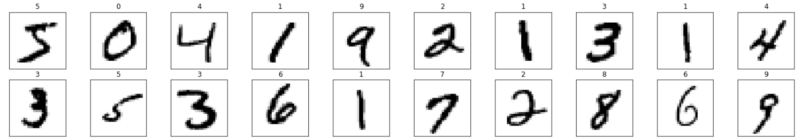
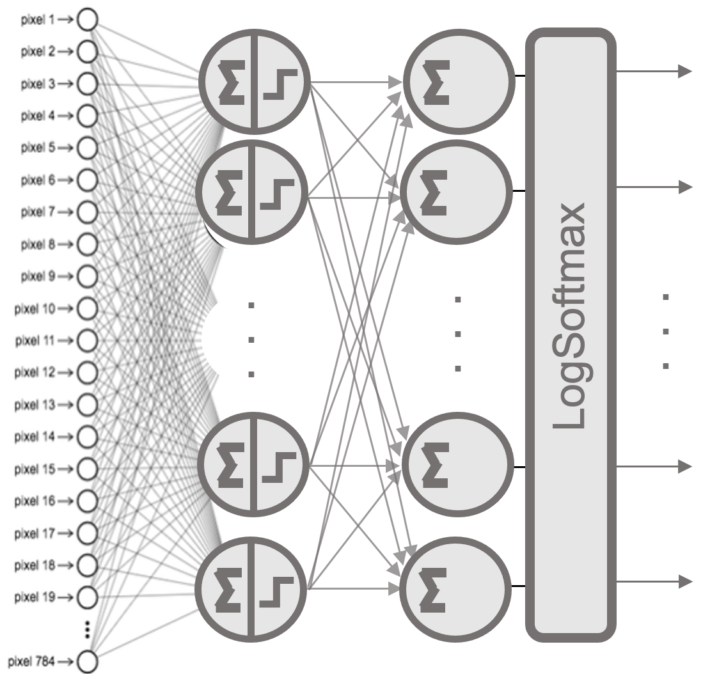
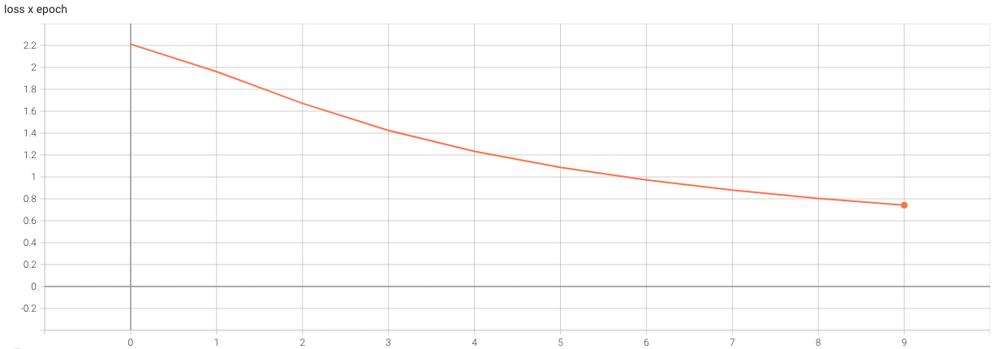
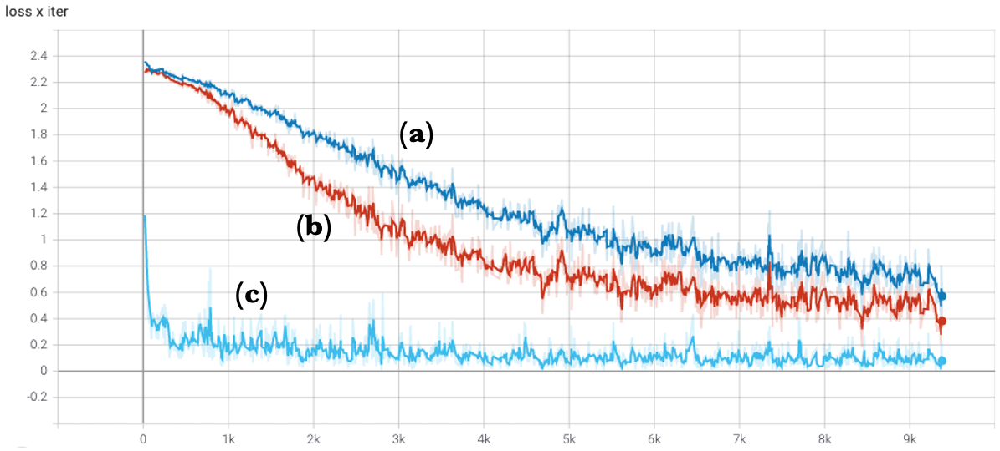
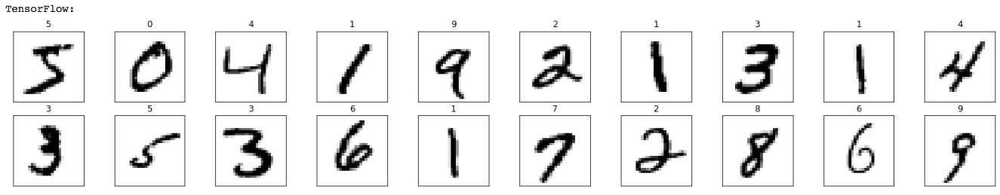
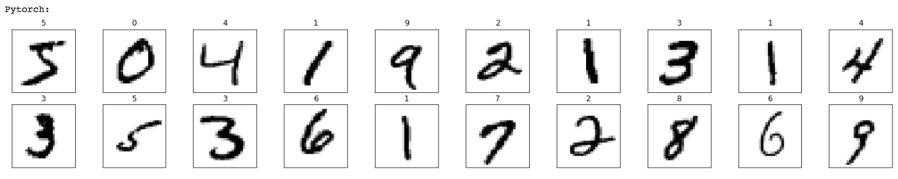

# Getting Started with PyTorch

* TOC
{:toc}

In this chapter, we introduce the essential concepts of the PyTorch library needed to implement the neural networks used throughout the deep reinforcement learning chapters.

While TensorFlow was used in previous chapters to introduce neural network concepts and training workflows, this chapter adopts PyTorch as the primary framework.

PyTorch exposes a programming model that aligns naturally with systems-level reasoning. Its imperative execution style, explicit control flow, and close integration with low-level libraries make it particularly well suited for analyzing performance, understanding execution behavior, and scaling training across multiple devices.

The transition to PyTorch does not represent a change in underlying principles. Both frameworks rely on the same computational kernels, hardware accelerators, and communication libraries. What changes is the level of visibility and control afforded to the user—an aspect that becomes increasingly important as we move toward parallel and distributed execution.

Together with TensorFlow, PyTorch remains one of the leading open-source libraries for deep learning. While TensorFlow initially dominated in industry thanks to early maturity and strong deployment tools, PyTorch has emerged as the preferred framework in both research and production due to its dynamic computation graph, Pythonic design, and active community support. Its flexibility and ease of use make it ideal for rapid prototyping and experimentation.

Another framework gaining traction in research is JAX, developed by Google. It offers NumPy-like syntax with automatic differentiation, and just in-time compilation, and GPU/TPU acceleration. However, its adoption in large-scale HPC or distributed environments remains limited compared to PyTorch and TensorFlow.

While this chapter focuses on PyTorch, a final comparison with TensorFlow is provided to help readers familiar with both ecosystems.

## Introduction to PyTorch

This section introduces the PyTorch elements relevant to understanding the rest of the book. PyTorch is not just a library but a growing ecosystem of libraries and tools. If you're looking to deepen your knowledge, the official PyTorch tutorials are the best starting point.

### What is PyTorch?

At its core, PyTorch is a Python-based library designed to support the implementation of neural networks. Two main components make it especially valuable for deep learning:

- Tensors: PyTorch provides a powerful multi-dimensional array structure called a tensor, which supports GPU execution and gradient tracking. While NumPy also supports multi-dimensional arrays, it lacks built-in support for gradients and GPU acceleration—both critical for training neural networks.

- Automatic Differentiation: PyTorch includes a package called autograd that automates the computation of gradients via backpropagation. While backpropagation is easy to implement manually in small two-layer networks, it becomes intractable for deep architectures. The autograd system greatly simplifies this.

### Core Components of PyTorch

PyTorch is built for fast and flexible experimentation, with a Python frontend backed by a high performance C++ backend.

Key modules in the frontend include:

- torch.nn: for defining and training neural networks

- torch.optim: for optimization algorithms used during training

- torch.Tensor: the primary data structure used throughout the library

Tensors in PyTorch are characterized by:

- rank (number of dimensions)

- shape (size along each dimension)

- type (data type of the elements)

Importantly, tensors can track gradients for learning purposes, which we’ll see in action later.

Although we won’t go into the C++ backend, note that recent versions have greatly improved its performance.

Additionally, PyTorch includes domain-specific libraries like:

- torchvision for image data

- torchtext for text

- torchaudio for audio

In this chapter, we’ll use torchvision. In environments like Google Colab, both torch and torchvision come pre-installed.

### Tensors in PyTorch

Let’s now review some basic operations with PyTorch tensors that will help us understand upcoming code examples.

    import torch 
    a = torch.randn(2, 3)
    print(a)

tensor(\[\[ 1.1049, 0.2676, -0.4528\],

\[ 0.0105, -0.5095, 0.7777\]\])

This generates a 2×3 tensor of random values. We can inspect its shape and rank:

    print(a.size())
    print(a.dim())

torch.Size(\[2, 3\])

2

Tensors also have a data type (dtype):

    matrix=torch.zeros([2, 4], dtype=torch.int32)
    print(matrix)

tensor(\[\[0, 0, 0, 0\],

\[0, 0, 0, 0\]\], dtype=torch.int32)

    print(matrix.dtype)

torch.int32

You can create tensors with various constructors:

    b = torch.zeros(2, 3)
    print(b)

tensor(\[\[0., 0., 0.\],

\[0., 0., 0.\]\])

    c = torch.ones(2, 3)
    print(c)

tensor(\[\[1., 1., 1.\],

\[1., 1., 1.\]\])

An element of a tensor can be accessed using its index (which starts at 0):

    c[0, 0] = 222 
    print(c)

tensor(\[\[222., 1., 1.\],

\[ 1., 1., 1.\]\])

Tensors support indexing and slicing like NumPy::

    x = torch.Tensor([[1,2,3,4], [5,6,7,8], [9,10,11,12]]) 
    print(x)

tensor(\[\[ 1., 2., 3., 4.\],

\[ 5., 6., 7., 8.\],

\[ 9., 10., 11., 12.\]\])

    print(“x column 1: “, x[:, 1])
    print(“x row 0: “, x[0, :])
    print(“x rows 0,1 & cols 1,2: \n”, x[0:2, 1:3])

x column 1: tensor(\[ 2., 6., 10.\])

x row 0: tensor(\[1., 2., 3., 4.\])

x rows 0,1 & cols 1,2:

tensor(\[\[2., 3.\],

\[6., 7.\]\])

PyTorch tensors can be seamlessly converted to and from NumPy arrays:

    x = np.array([[1,2], [3,4], [5,6]])
    print(x)

\[\[1 2\]

\[3 4\]

\[5 6\]\]

    y = torch.from_numpy(x)
    print(y)

tensor(\[\[1, 2\],

\[3, 4\],

\[5, 6\]\])

    z = y.numpy()
    print(z)

\[\[1. 2.\]

\[3. 4.\]

\[5. 6.\]\]

You can also reshape tensors using .view():

    one_d = torch.arange(0,16)
    print(one_d)
    two_d = one_d.view(4,4)
    print(two_d)
    print(two_d.size())

tensor(\[ 0, 1, 2, 3, 4, 5, 6, 7, 8, 9, 10, 11, 12, 13, 14, 15\])

tensor(\[\[ 0, 1, 2, 3\],

\[ 4, 5, 6, 7\],

\[ 8, 9, 10, 11\],

\[12, 13, 14, 15\]\])

torch.Size(\[4, 4\])

## Neural Networks Programming in PyTorch

After our brief introduction to PyTorch’s essential components, we now turn to a concrete example: implementing a neural network model to classify handwritten digits, as introduced in the previous chapter.

Recall that we defined a model that takes an input image and outputs a 10-element vector, where each value represents the probability that the image corresponds to one of the ten possible digits.

To guide the implementation, we will follow a standard sequence of steps commonly used when building a neural network in PyTorch:

1.  Import required libraries

2.  Load the dataset

3.  Preprocess the data

4.  Define the model architecture

5.  Specify the loss function and optimizer

6.  Train the model

7.  Evaluate the model

### Importing Required Libraries

To begin, we import the necessary packages. For our example, we use torch, torchvision, numpy, and matplotlib. We also define some training hyperparameters introduced earlier:

    import torch 
    import torchvision

    import numpy as np 
    import matplotlib.pyplot as plt 

    EPOCH = 10 
    BATCH_SIZE = 64

### Loading the Dataset

We use the MNIST dataset, previously introduced, and load it using torchvision.datasets.MNIST. To facilitate data handling during training, we wrap it in a DataLoader[^1]:

    xy_trainPT = torchvision.datasets.MNIST(root='./data',
                 train=True, download=True,
                 transform=torchvision.transforms.Compose(
                 [torchvision.transforms.ToTensor()]))

    xy_trainPT_loader = torch.utils.data.DataLoader(
                        xy_trainPT, batch_size=BATCH_SIZE)

Each batch contains data samples (images) and their corresponding labels. The BATCH_SIZE argument determines how many samples are processed at each parameter update. To visually inspect the dataset, we can display a few samples using matplotlib:

    fig = plt.figure(figsize=(25, 4)) 
    for idx in np.arange(20):
       image, label = xy_trainPT[idx]
       ax = fig.add_subplot(2, 20/2, idx+1, xticks=[], yticks=[])
       ax.imshow(torch.squeeze(image, dim = 0).numpy(),
                 cmap=plt.cm.binary)
       ax.set_title(str(label))

### Data Preprocessing

As explained previously, each input image must be flattened from a 2D matrix (28×28 pixels) into a 1D vector (784 values) before being passed to a fully connected layer. Here’s how to perform this transformation:

    image, _ = xy_trainPT[0] 
    print(image.size())
    image_flatten = image.view(image.shape[0], -1)
    print(image_flatten.size())

torch.Size(\[1, 28, 28\])

torch.Size(\[1, 784\])

While this transformation is simple in this case, keep in mind that preprocessing is often one of the most time-consuming steps in real-world deep learning projects.

### Defining a Neural Network Model in PyTorch

As noted earlier, the torch.nn module provides high-level APIs to define and train neural networks. Although you can create models as custom Python classes by subclassing nn.Module, here we’ll use the more concise torch.nn.Sequential class to build a basic feedforward neural network.

Below is the implementation of a simple digit classification network:

    modelPT= torch.nn.Sequential(            
             torch.nn.Linear(784, 10),
             torch.nn.Sigmoid(), 
             torch.nn.Linear(10, 10), 
             torch.nn.LogSoftmax(dim=1) 
             )

This defines a two-layer dense network. The first layer maps the 784 input features to 10 neurons using the Sigmoid activation function. The second layer also contains 10 neurons and applies a LogSoftmax activation.

Why LogSoftmax? PyTorch offers a nn.CrossEntropyLoss function that combines LogSoftmax and negative log-likelihood in a single numerically stable operation. To avoid redundant operations and improve stability, it’s common to use LogSoftmax as the final layer when working with this loss function (since NLLLoss expects log probabilities as input).

Let’s break down the data flow:

- The input image (a 784-dimensional vector) is passed to all 10 neurons of the first layer.

- Each of those 10 outputs is passed to each neuron in the second layer (fully connected).

- The second layer applies the LogSoftmax function to produce a 10-element output vector representing the log probabilities of each digit class.

_Figure 9.1 – Two-layer fully connected architecture._

## Configuring Neural Network Training in PyTorch

After defining the model architecture, we need to specify the following elements to enable training:

- A loss function that measures how well the model performs

- An optimizer that updates the model’s parameters to minimize the loss

- A training loop that iterates over the dataset and performs the updates

### Loss Funtion

Since we are solving a multi-class classification problem (digits 0 to 9), the appropriate loss function is cross-entropy. PyTorch provides nn.NLLLoss() for negative log-likelihood loss, which must be combined with a LogSoftmax output layer, as seen earlier:

    loss_fn = torch.nn.NLLLoss()

If instead we used nn.CrossEntropyLoss(), it would be preferable to remove the LogSoftmax from the model definition, as CrossEntropyLoss applies it internally for numerical stability.

### Optimizer

To train the model, we must define an optimization algorithm that updates the parameters to reduce the loss. The most common method is Stochastic Gradient Descent (SGD). In PyTorch, we create the optimizer and link it to the model's parameters:

    optimizer = torch.optim.SGD(modelPT.parameters(), lr=0.01)

The lr argument specifies the learning rate, which controls the size of the parameter updates.

### Backpropagation and Automatic Differentiation

In neural networks, training typically involves computing gradients of composite functions. This means chaining the derivative of the loss function with the derivatives of each layer using the chain rule. Solving these equations manually is not practical, especially for deep networks. Instead, we rely on automatic differentiation to compute the gradient of the loss with respect to each parameter.

In PyTorch, this is handled by the autograd package. It allows you to compute gradients with just a few lines of code. Internally, it constructs a computational graph that tracks all tensor operations with requires_grad=True.

In simple terms, autograd enables automatic gradient computation for all tensors that make up the neural network. For a tensor x where gradients are needed, you declare:

x.requires_grad = True

After computing the loss and calling loss.backward(), the corresponding gradient is stored in x.grad.

Although this mechanism may seem abstract at first, it is straightforward in practice—as you’ll see in the next section.

## Training a Neural Networks in PyTorch

Once we have defined our model and configured the learning method by selecting the loss function and optimizer, the next step is to implement the training loop. This loop iterates over the entire dataset, enabling the optimizer to adjust the model's parameters iteratively.

### Training Loop

Let’s analyze a typical training loop through the following numbered code snippet:

    1: for e in range(EPOCHS):
          running_loss = 0
    2:    for images, labels in xy_trainPT_loader:
    3:        images = images.view(images.shape[0], -1)
    4:        output = modelPT(images)
    5:        loss = criterion(output, labels)
    6:        loss.backward()
    7:        optimizer.step()
    8:        optimizer.zero_grad()
              running_loss += loss.item()
          print(“Epoch {} — Training loss: {}”.format(e, 
                       running_loss/len(xy_trainPT_loader)))

Let’s walk through each line:

- Line 1: The training loop iterates over the dataset for a number of epochs as specified by the variable EPOCHS. Each epoch processes the entire dataset once.

- Line 2: As discussed earlier, the dataset is divided into batches. Each batch contains a set of training samples and their corresponding labels, both stored as tensors. The batch size was set earlier when defining the DataLoader.

- Line 3: Before feeding the data into the model, we flatten each 2D image (28×28 pixels) into a 1D vector (784 values).

- Line 4: The model receives the batch of flattened images and returns a tensor of predictions.

- Line 5: These predictions are passed, together with the true labels, to the loss function, which computes the error for this batch.

- Line 6: We perform backpropagation by calling loss.backward(), which computes the gradient of the error with respect to the model's parameters.

- Line 7: The optimizer updates the model parameters using the previously computed gradients with optimizer.step().

- Line 8: Finally, we reset the gradients to zero with optimizer.zero_grad(), which is essential to prevent unwanted accumulation from previous iterations.

### Monitoring the Training Process

In addition to these essential steps, we include a few lines to track how training is progressing over time. We accumulate the loss across the entire epoch:

    running_loss += loss.item() 

At the end of each epoch, we print the average loss:

    print(“Epoch {} — Training loss: {}”.format(e, 
                 running_loss/len(xy_trainPT_loader)))

This gives us a clear view of the model's learning curve over time:

Epoch 0 - Training loss: 2.1718929242223566

Epoch 1 - Training loss: 1.8569046410162058

Epoch 2 - Training loss: 1.5453973913243584

Epoch 3 - Training loss: 1.3019552348392096

Epoch 4 - Training loss: 1.1217457493230987

Epoch 5 - Training loss: 0.9856107622575658

Epoch 6 - Training loss: 0.8806948681502963

Epoch 7 - Training loss: 0.7991796776112209

Epoch 8 - Training loss: 0.7351558134118631

Epoch 9 - Training loss: 0.6839512853162375

As seen above, the training loss gradually decreases across epochs, indicating that the model is improving its predictions by minimizing the error.

The loss evolution across epochs is visualized in Figure 9.2, showing how the model becomes more accurate as training progresses.

In Figure 9.3, we compare how different hyperparameter choices affect learning performance. For example, increasing the number of neurons in the first layer (from 10 to 32) leads to better results, and replacing the SGD optimizer with Adam improves convergence speed.

These types of experiments illustrate how modifying architectural or optimization settings can influence training behavior—a fundamental aspect of practical deep learning.

_Figure 9.2 – Evolution of the loss across epochs during the training loop._

_Figure 9.3 – Comparison of how the loss decreases per iteration for different hyperparameter configurations: (a) original neural network, (b) network with 32 neurons in the first layer, and (c) using the Adam optimizer instead of SGD._
 

### Model Evaluation in PyTorch

Once the model is trained, we usually want to evaluate its generalization performance on previously unseen data. This is standard practice in machine learning to ensure that the model hasn’t simply memorized the training set.

The following code evaluates the model using the test split of the MNIST dataset:

    xy_testPT = torchvision.datasets.MNIST(root='./data', 
                train=False, download=True, 
                transform=torchvision.transforms.
                Compose([torchvision.transforms.ToTensor()]))
    xy_test_loaderPT = torch.utils.data.DataLoader(xy_testPT)
    correct_count, all_count = 0, 0

    for images, labels in xy_test_loaderPT:
      for i in range(len(labels)):
        img = images[i].view(1, 784)
        logps = modelPT(img)
        ps = torch.exp(logps)
        probab = list(ps.detach().numpy()[0])
        pred_label = probab.index(max(probab))
        true_label = labels.numpy()[i]
        if true_label == pred_label:
            correct_count += 1
        all_count += 1
    print("\nAccuracy of the model =", (correct_count/all_count))         

This evaluation loop is conceptually similar to the training loop. However, instead of computing and updating gradients, we compute the predicted label and compare it to the ground truth. The result:

Accuracy of the model = 0.8657

This means that the model correctly classifies 86.57% of the previously unseen test samples, which is a solid result for such a simple architecture.

##  TensorFlow versus PyTorch

In this section, our goal is to offer a quick and practical demonstration—accompanied by a ready-to-run .ipynb notebook—that shows how both frameworks are entirely equivalent when it comes to programming neural networks.

A common question from students and practitioners is: *Which is the best framework for building a neural network: TensorFlow or PyTorch?*

My answer is simple: Don't worry—just get started. It doesn’t really matter which one you choose. What matters most is starting. Let’s go!

The essential steps involved in building and training a neural network are the same across both frameworks and are part of the standard Machine Learning workflow:

- Import the required libraries

- Load and preprocess the data

- Define the model

- Define the optimizer and the loss function

- Train the model

- Evaluate the model

Let’s now see how these steps are implemented in both PyTorch and TensorFlow (using the Keras API), by building a neural network that classifies handwritten digits.

### Import Required Libraries

Both frameworks require us to import the necessary Python libraries and define some key training hyperparameters:

    import numpy as np 
    import matplotlib.pyplot as plt 

    epochs = 10 
    batch_size=64

To use TensorFlow, we import:

    import tensorflow as tf

Whereas for PyTorch, we import:

    import torch 
    import torchvision

### Loading and Preprocessing the Data

In TensorFlow, loading and preparing the MNIST dataset can be done in just a few lines:

    (x_trainTF_, y_trainTF_), _ = tf.keras.datasets.mnist.load_data() 
    x_trainTF = x_trainTF_.reshape(60000, 784).astype('float32')/255 
    y_trainTF = tf.keras.utils.to_categorical(y_trainTF_,num_classes=10)

In PyTorch, the equivalent can be achieved using the torchvision API:

    xy_trainPT = torchvision.datasets.MNIST(
        root='./data', 
        train=True, 
        download=True,
        transform=torchvision.transforms.Compose([
            torchvision.transforms.ToTensor()
        ])
    ) 
    xy_trainPT_loader = torch.utils.data.DataLoader(xy_trainPT, batch_size=batch_size)

To confirm that both frameworks are loading the same data, we can visualize a few training images using matplotlib:

    print("TensorFlow:")
    fig = plt.figure(figsize=(25, 4))
    for idx in np.arange(20):
        ax = fig.add_subplot(2, 10, idx+1, xticks=[], yticks=[])
        ax.imshow(x_trainTF_[idx], cmap=plt.cm.binary)
        ax.set_title(str(y_trainTF_[idx]))

    print("PyTorch:")
    fig = plt.figure(figsize=(25, 4)) 
    for idx in np.arange(20):
        ax = fig.add_subplot(2, 10, idx+1, xticks=[], yticks=[])
        image, label = xy_trainPT [idx]
        ax.imshow(torch.squeeze(image, dim = 0).numpy(), cmap=plt.cm.binary)	
        ax.set_title(str(label))

### Defining the Model

Model definition is conceptually similar in both frameworks.

In TensorFlow, we use the Keras Sequential API:

    modelTF = tf.keras.Sequential([ 
        tf.keras.layers.Dense(10,activation='sigmoid',input_shape=(784,)), 
        tf.keras.layers.Dense(10,activation='softmax') 
    ])

In PyTorch, we use the nn.Sequential class:

    modelPT= torch.nn.Sequential(   
          torch.nn.Linear(784,10),
          torch.nn.Sigmoid(), 
          torch.nn.Linear(10,10), 
          torch.nn.LogSoftmax(dim=1) 
          )

### Defining the Optimizer and the Loss Function

In both frameworks, this step is straightforward.

In TensorFlow:

    modelTF.compile( 
           loss="categorical_crossentropy",     
           optimizer=tf.optimizers.SGD(learning_rate=0.01), 
           metrics = ['accuracy'] 
           )

In PyTorch:

    criterion = torch.nn.NLLLoss() 
    optimizer = torch.optim.SGD(modelPT.parameters(), lr=0.01)

### Training the Model

Here we find the most notable difference. In TensorFlow, training is abstracted behind the fit() method:

    _ = modelTF.fit(x_trainTF, y_trainTF, epochs=epochs, batch_size=batch_size, verbose = 0)

In PyTorch, we must explicitly write the training loop:

    for e in range(epochs):
        for images, labels in xy_trainPT_loader:
            images = images.view(images.shape[0], -1)
            loss = criterion(modelPT(images), labels)
            loss.backward()
            optimizer.step()
            optimizer.zero_grad()

This difference reflects a core design philosophy: TensorFlow/Keras offers simplicity and automation, while PyTorch favors transparency and control—making it ideal for research and customization.

### Evaluating the Model

The same distinction appears during evaluation.

In TensorFlow:

    _, (x_testTF, y_testTF) = tf.keras.datasets.mnist.load_data()
    x_testTF = x_testTF.reshape(10000, 784).astype('float32') / 255
    y_testTF = tf.keras.utils.to_categorical(y_testTF, num_classes=10)

    _, test_accTF = modelTF.evaluate(x_testTF, y_testTF)
    print("\nTensorFlow model Accuracy =", test_accTF)

In PyTorch, we need to define the evaluation loop manually:

    xy_testPT = torchvision.datasets.MNIST(
        root="./data",
        train=False,
        download=True,
        transform=torchvision.transforms.ToTensor()
    )
    xy_test_loaderPT = torch.utils.data.DataLoader(xy_testPT)

    correct_count, all_count = 0, 0
    for images, labels in xy_test_loaderPT:
        for i in range(len(labels)):
            img = images[i].view(1, 784)
            logps = modelPT(img)
            ps = torch.exp(logps)
            probab = list(ps.detach().numpy()[0])
            pred_label = probab.index(max(probab))
            true_label = labels.numpy()[i]
            if true_label == pred_label:
                correct_count += 1
            all_count += 1

    print("\nPyTorch model Accuracy =", (correct_count / all_count))

This simple experiment confirms that implementing a neural network in PyTorch or TensorFlow involves the same conceptual steps. The differences reside primarily in the level of abstraction provided by each framework and the extent to which the programmer needs to manage details explicitly.

Over the past few years, both frameworks have evolved by adopting each other’s best practices, steadily converging in design and capabilities. There is no definitive “right” choice—any knowledge you gain in one is readily applicable to the other.

To use a familiar analogy: choosing between PyTorch and TensorFlow is like choosing between C++ and Java to learn programming. It depends on your goals, context, and available resources. While preferences may vary, what truly matters is learning how to program. In the same spirit, mastering the fundamental principles of deep learning is far more important than the choice of syntax or API. Once those foundations are in place, switching tools becomes trivial.

Moreover, from a performance perspective, both frameworks ultimately rely on the same low-level libraries to exploit the hardware—such as cuDNN, cuBLAS, or NCCL —regardless of whether you're using PyTorch or TensorFlow. As discussed in earlier chapters (and as we will continue to see), the efficiency of deep learning workloads depends less on the high-level framework and more on how well it leverages these shared hardware-optimized components.

Another practical consideration for working across frameworks is the possibility of model export and interoperability. The Open Neural Network Exchange (ONNX) format was developed precisely for this purpose. It allows you to export models trained in PyTorch and run them using inference engines optimized for different environments—including TensorFlow, Caffe2, or runtime libraries like ONNX Runtime or TensorRT. This becomes especially useful in deployment scenarios where teams may train with one framework but deploy in another, or need to optimize for inference on specific hardware accelerators. PyTorch includes built-in support for exporting to ONNX via torch.onnx.export(), making it a practical option for mixed environments or production pipelines.

With these foundational skills in PyTorch, you're now ready to explore more advanced topics such as distributed training, model optimization, and deployment.
>
>**Task 9.1 – Observing the Equivalence Between TensorFlow and PyTorch**
>
>In this task, you will explore the practical equivalence between TensorFlow and PyTorch by running and slightly modifying an existing reference notebook.
>
>Rather than writing a neural network from scratch again, the objective here is to observe, execute, and experiment with two implementations of the same model—one in TensorFlow and one in PyTorch—and confirm that both frameworks follow the same learning workflow.
>
>What you are asked to do:
>
>- Download the provided Jupyter notebook from the book’s GitHub repository.
>
>- Open and execute the notebook in Google Colab.
>
>- Run both implementations:The TensorFlow (Keras) version and the PyTorch version.
>
>Verify that:
>
>- The data used is the same (MNIST)
>
>- The model structure is conceptually equivalent
>
>- The training process follows the same logical steps
>
>- The final accuracy is comparable in both cases
>
>After running the notebook successfully, perform one or two small modifications, such as:
>
>- Changing the number of epochs
>
>- Modifying the batch size
>
>- Replacing the optimizer (e.g., SGD → Adam)
>
>Observe how these changes affect both implementations in a similar way.
>
>By completing this task, you should be able to:
>
>- Recognize that TensorFlow and PyTorch implement the same fundamental training pipeline.
>
>- Understand that the main difference lies in the level of abstraction, not in the underlying learning process
>
>- Gain confidence that knowledge acquired in one framework transfers naturally to the other
>
>At this stage, the goal is not mastery of any specific API, but rather conceptual fluency. This perspective will be essential as we move toward more advanced topics, where execution behavior, performance, and parallelism—not syntax—become the primary concerns.
 

### Framework-Agnostic Insight: Different APIs, Same Execution Stack

Although TensorFlow and PyTorch expose different programming models, their execution stacks are remarkably similar. High-level model definitions are ultimately translated into low-level kernels executed on CPUs and GPUs, relying on the same numerical libraries and communication backends.

As a result, many performance characteristics—such as sensitivity to batch size, memory bandwidth limitations, and communication overhead—are largely independent of the chosen framework. In practice, these factors are dictated by the underlying hardware and system configuration rather than by the high-level API used to express the model.

For this reason, in the following part of the book we will analyze these performance-related aspects in depth using a single framework, primarily PyTorch. This choice is made for clarity and consistency, not because the conclusions are framework-specific. The insights gained—regarding batch size selection, memory pressure, data movement, and scalability limits—apply equally to TensorFlow-based workloads, as they ultimately execute on the same hardware and software substrates.

Understanding this separation between programming interface and execution substrate is essential for reasoning about performance and scalability in modern AI systems.

## The Distributed DL Software Ecosystem: A Conceptual Overview

Training modern deep learning models efficiently increasingly requires parallel execution across multiple GPUs. While previous sections focused on TensorFlow and PyTorch as primary programming frameworks, scalable training in practice relies on a broader ecosystem of software layers and abstractions.

This section provides a high-level conceptual overview of the distributed deep learning software ecosystem. Its purpose is not to explain how to use specific frameworks or APIs, but to help the reader understand how different classes of tools fit together, what problems they address, and why multiple solutions coexist. Detailed execution models, performance analysis, and implementation mechanisms are intentionally deferred to later chapters.

In this sense, this section serves as a map of the territory. It establishes common terminology and conceptual boundaries that will be revisited and explored in depth in Part IV, where parallel and distributed training become the central focus.

Throughout this book, the terms parallel training and multi-GPU training primarily refer to synchronous data parallelism within a single node. Distributed training across multiple nodes, as well as more advanced forms of parallelism, will be introduced only after the foundational performance concepts have been established.

### Communication as a Central Challenge

As discussed in earlier chapters, scaling deep learning training beyond a single GPU introduces non-trivial communication challenges. During training, multiple devices must exchange gradients, synchronize parameters, or coordinate execution depending on the chosen parallelization strategy. As model size and GPU count increase, communication overhead can quickly become a dominant factor limiting scalability.

A recurring theme throughout this book is that performance in distributed training is not determined by hardware capabilities alone. Instead, it emerges from the interaction between three complementary layers, previously introduced in Figure 6.7:

- The *Hardware layer*, including high-bandwidth interconnects such as NVLink, PCIe Gen 5, InfiniBand, and technologies like GPUDirect.

- The *Software communication layer*, composed of libraries such as NCCL and CUDA-aware MPI that expose efficient collective communication primitives.

- The *User abstraction layer*, consisting of high-level frameworks that orchestrate parallel execution while hiding most of the low-level complexity.

The hardware and communication layers have already been introduced in earlier chapters. The remainder of this section focuses on the user abstraction layer, which is where most practitioners encounter distributed training in practice.

### Frameworks Used in This Book

For pedagogical clarity and coherence, this book deliberately focuses on a limited set of frameworks that expose distributed training concepts in a transparent and instructive way.

TensorFlow and PyTorch are the two primary deep learning frameworks used throughout the book. TensorFlow is employed in Chapter 10 to introduce neural network training and basic forms of parallelism using high-level distribution strategies. PyTorch becomes the main vehicle for subsequent chapters, particularly those focused on performance analysis and distributed training using Distributed Data Parallel (DDP).

In addition, the book makes explicit use of the Hugging Face ecosystem in the context of large language models. In later chapters, the Hugging Face Trainer API is used to fine-tune and scale transformer-based models. Although the Trainer exposes a high-level interface, it relies internally on PyTorch, DDP, and communication libraries such as NCCL.

Closely related is Hugging Face Accelerate, which simplifies the configuration and launch of training jobs across single-GPU, multi-GPU, and multi-node environments. Accelerate abstracts backend selection and process orchestration, allowing the same training script to scale across different systems with minimal modification. In this book, Accelerate is treated as a convenience layer rather than a new execution model: the underlying distributed concepts remain grounded in PyTorch.

By focusing on TensorFlow, PyTorch, and Hugging Face tools, the reader is exposed to a representative subset of the software stack currently used in both research and production environments, without overwhelming detail.

### Frameworks Introduced for Awareness

Beyond the frameworks explicitly used in this book, several other tools play an important role in the distributed deep learning ecosystem and are worth knowing for contextual understanding.

*Horovod*, originally developed at Uber, provides a unified interface for distributed training across TensorFlow and PyTorch using an MPI-style execution model. It relies on NCCL for GPU communication and integrates naturally with HPC environments where MPI is already a core component. Although its adoption has declined as native framework solutions have matured, Horovod remains relevant in multi-framework and legacy HPC settings.

*JAX* represents a distinct design philosophy centered on functional programming, composability, and compilation through XLA. It is widely used in research environments and is closely associated with TPU-based infrastructures. While JAX supports powerful parallelization mechanisms, it is not covered in this book due to its different programming model and its limited alignment with GPU-centric HPC systems.

*DeepSpeed*, developed by Microsoft, is an advanced optimization library designed to enable large-scale model training on GPU clusters. Its most distinctive contribution is Zero Redundancy Optimization (ZeRO), a family of techniques that partitions optimizer states, gradients, and model parameters across GPUs. By reducing redundant memory replication, ZeRO enables training of models that would otherwise exceed per-GPU memory limits.

In addition to memory optimization, DeepSpeed supports mixed-precision training, activation checkpointing, fused kernels, pipeline parallelism, and advanced scheduling strategies. These capabilities make it a widely adopted solution for training very large models, particularly transformer-based architectures.

Despite its power, DeepSpeed introduces additional configuration complexity and requires a deeper understanding of memory and parallelization trade-offs. For this reason, it is not used directly in the hands-on chapters of this book, which prioritize conceptual clarity and pedagogical transparency. Nevertheless, DeepSpeed serves as an important reference point for understanding how modern systems push beyond standard data-parallel training.

### Extreme-Scale Training: From Distributed to Industrial AI

At very large scale, training state-of-the-art language models requires a qualitative shift in software architecture and parallelization strategy. This shift goes beyond conventional data parallelism and enters the domain of industrial-scale AI training.

Frameworks such as Megatron-LM and NVIDIA NeMo exemplify this extreme-scale stack. Megatron-LM is a specialized framework designed for training large transformer-based models using model parallelism. Rather than replicating entire models across GPUs, it distributes computation and parameters across devices using techniques such as tensor parallelism, pipeline parallelism, and hybrid combinations with data parallelism.

Megatron-LM is tightly integrated with PyTorch and optimized for NVIDIA hardware and high-bandwidth interconnects. It has been used to train some of the largest GPT-style models to date, often at scales involving hundreds or thousands of GPUs.

NVIDIA NeMo builds on these techniques to provide an industrial-grade framework for training, fine-tuning, and deploying large language models. NeMo emphasizes repeatable performance, scalability, and tight integration with NVIDIA’s optimized software stack, including NCCL, cuBLAS, and TensorRT-based inference components.

In this ecosystem, a clear distinction emerges. Frameworks such as TensorFlow, PyTorch, and Hugging Face democratize distributed training by lowering the barrier to entry. Extreme-scale frameworks such as Megatron-LM and NeMo industrialize it, prioritizing maximum performance, scalability, and operational robustness.

Understanding this distinction helps explain why multiple distributed training frameworks coexist and why not all solutions target the same use cases. This book focuses on the former category, while acknowledging the architectural principles that underpin the latter.

This overview concludes the conceptual introduction to the distributed deep learning ecosystem. At this stage, the reader is not expected to master any specific framework or parallelization strategy. The goal has been to establish a shared vocabulary and to clarify why multiple tools and abstractions coexist in modern AI systems.

In the following chapters, we move from this static map to dynamic behavior. Rather than cataloging frameworks, we will study how training workloads actually execute on real hardware, how performance evolves as parallel resources are introduced, and which system-level trade-offs emerge in practice.

This transition marks a shift from understanding what is possible to understanding what is efficient.

## Key Takeaways from Chapter 9

- The PyTorch library is one of the leading frameworks for implementing deep learning models. It is widely adopted in both academia and industry due to its flexibility, and strong community support.

- PyTorch provides tensors as its core data structure, analogous to NumPy arrays but with GPU support and automatic gradient tracking—two essential features for training neural networks efficiently.

- The autograd module in PyTorch enables automatic differentiation. By recording operations in a computation graph, it allows gradients to be computed with just a few lines of code, significantly simplifying the backpropagation process.

- Neural networks in PyTorch are typically defined using the torch.nn module. Models can be composed sequentially with nn.Sequential or more flexibly with custom subclasses of nn.Module.

- The training process in PyTorch requires defining a loss function and an optimizer. During training, batches of input data are passed through the model, the loss is computed, gradients are backpropagated, and the model parameters are updated accordingly.

- PyTorch requires explicit implementation of the training and evaluation loops. While this adds verbosity compared to frameworks like Keras, it offers full transparency and control—particularly beneficial for debugging and research.

- The MNIST example shows how PyTorch and TensorFlow follow the same high-level workflow: load and preprocess data, define the model, specify the optimizer and loss function, train the model, and evaluate its performance.

- For deployment flexibility, PyTorch supports exporting models to the ONNX format, enabling interoperability across frameworks and compatibility with inference engines like TensorFlow, ONNX Runtime, or TensorRT.

- Although the APIs differ, both frameworks ultimately rely on the same low-level, hardware-optimized libraries (e.g., cuDNN, cuBLAS, NCCL), meaning there is no difference in performance potential at the machine level.

- Beyond TensorFlow and PyTorch, modern deep learning training relies on a broader software ecosystem, where high-level frameworks, communication libraries, and hardware interconnects interact to enable scalable multi-GPU execution.

[^1]: PyTorch separates data handling from model logic through the Dataset and Dataloader abstractions.
