# Introduction to Parallel Training of Neural Networks

This chapter marks the transition from single-device training to parallel and distributed execution of neural networks. It introduces the main forms of parallelism used in deep learning and illustrates their impact through practical experiments.

Readers interested primarily in scalable training and performance analysis may begin here, even if earlier chapters are only partially covered. This chapter provides sufficient context to serve as an effective starting point for courses focused on parallel deep learning, as it teaches readers how to reason about training parallelism—distinguishing between absolute speedup, scaling efficiency, and the impact of model size.

##  From Writing Code to Reasoning About Systems 

The way software is produced is undergoing a fundamental transformation. Generative tools can now produce training scripts, orchestration logic, configuration files, and even distributed launchers with minimal human effort. End-to-end pipelines that once required significant engineering investment can be assembled quickly and appear, at first glance, to function correctly.

What these tools do not produce is understanding. They do not explain why a system behaves the way it does, which components dominate execution time, where synchronization costs are paid, or how performance changes as scale increases. They do not provide cost models, nor do they build intuition about scalability limits or efficiency trade-offs. As a result, the center of gravity of engineering effort has shifted. Writing code is no longer the hard part. Reasoning about execution has become the primary challenge.

This shift is especially consequential in the context of parallel and distributed training. Modern frameworks make it straightforward to launch workloads on multiple GPUs or nodes. A training job that runs successfully on one accelerator can often be extended to several with minimal code changes. This apparent ease creates a powerful illusion: that scalability is a property of code rather than a property of systems.

This book refers to this phenomenon as the *illusion of scalability*. It is the belief that because a workload runs correctly on *N* GPUs, it will scale efficiently to *2N* or *4N*. In practice, scalability is constrained by factors that are largely invisible at the code level: synchronization frequency, communication patterns, collective operations, memory contention, and load imbalance. As scale increases, these factors interact in non-linear ways, often producing diminishing returns long before hardware limits are reached.

The illusion is reinforced by the fact that correctness and scalability are orthogonal properties. A distributed training job may converge, produce valid results, and yet be fundamentally inefficient. Communication overheads may dominate computation, accelerators may remain idle while waiting for data or synchronization, and additional resources may contribute little to overall throughput. These behaviors are not programming errors; they are system-level effects that only become visible through measurement and analysis.

A related consequence of this new development model is cost blindness. When the cost of creating software drops, waste becomes harder to perceive. Inefficiencies that would have been unacceptable in a manually engineered system can remain hidden behind layers of abstraction. GPUs can absorb a surprising amount of inefficiency before performance degradation becomes obvious. In cloud-based or shared infrastructures, the first clear signal of a poor design choice is often not a failed run, but an unexpectedly large bill.

Performance failures in modern AI systems are therefore frequently discovered not through debugging, but through invoices.

For this reason, the purpose of the chapters that follow is not to teach parallelism as a collection of techniques or APIs. The goal is to develop the ability to reason about execution behavior, scalability limits, and cost before scaling decisions become irreversible. Parallel training is treated here not as an implementation detail, but as a systems problem whose outcomes depend on informed judgment, measurement, and an explicit understanding of trade-offs.

##  Motivation and Scope

The previous chapter provided a high-level view of the software ecosystem that supports distributed deep learning, outlining the main frameworks and abstractions used in practice. We now shift focus from the ecosystem itself to the behavior of training workloads when executed on parallel hardware.

This chapter marks the reader’s first systematic encounter with parallel training from a performance perspective. Its purpose is not to maximize performance, nor to explore advanced optimization techniques, but to build intuition about how training workloads behave when computation is spread across multiple processing units.

In the previous part of the book, the reader learned how to build, train, and evaluate deep learning models using modern frameworks. In particular, Chapter 7 introduced the fundamental concepts of deep learning using TensorFlow as the primary vehicle, allowing readers without prior background to focus on core ideas such as layers, loss functions, optimization, and training loops. Chapter 9 later presented PyTorch, highlighting its programming model and showing that, despite syntactic differences, both frameworks rely on the same underlying computational principles and software libraries.

This chapter marks a conceptual transition. From this point onward, the focus is no longer on *how to train a neural network*, but on *how efficiently that training can be executed on real computing systems*. As models grow larger and datasets increase in size, performance becomes a first-class concern. Training time, resource utilization, scalability, and energy efficiency are no longer secondary aspects but central design constraints.

The emphasis here is intentionaly pedagogical. Rather than presenting an exhaustive or highly optimized solution, we rely on simple, reproducible experiments to expose the fundamental trade-offs that arise when training is parallelized. By observing how execution time evolves when moving from CPUs to GPUs, and from one GPU to multiple GPUs, the reader develops an intuitive understanding of where parallel training helps—and where it introduces new overheads.

All experiments in this chapter are executed within a single node and rely on synchronous data parallelism. This constrained setting allows us to observe the essential mechanisms of parallel training—replication, synchronization, and communication—without the additional complexity of multi-node execution.

TensorFlow is deliberately used in this chapter as the reference framework. This choice is not meant to promote TensorFlow over other alternatives, but rather to preserve pedagogical continuity with Chapter 7 and to reinforce an important message: *performance optimization principles in deep learning are largely independent of the specific framework used*. Whether the user works with TensorFlow, PyTorch, or any other modern deep learning middleware, the underlying execution stack is essentially the same. Operations are ultimately executed through CUDA kernels, rely on libraries such as cuDNN and NCCL, and are scheduled on CPUs and GPUs following similar execution and communication patterns.

Although many of the experiments in this book are executed on the MareNostrum 5 supercomputer, the discussion in this chapter is intentionally kept general. MareNostrum 5 serves as a realistic and representative example of a modern HPC system, but the optimization principles presented here apply equally to other GPU clusters, cloud-based platforms, and even single multi-GPU workstations. When system-specific details are relevant, they are explicitly identified as such.

By the end of this chapter, the reader should not expect to have achieved optimal scaling. Instead, the goal is to have acquired a solid mental model of parallel training behavior, which will serve as a necessary foundation for the efficiency-focused and large-scale distributed experiments developed in the following chapters.

At this stage, it is tempting to assume that parallel training is primarily a matter of applying the right abstractions and increasing available resources. Modern frameworks reinforce this intuition by making multi-GPU execution appear almost effortless. The experiments in this chapter deliberately challenge that assumption. They are designed to expose the illusion of scalability introduced in Section 10.1: the belief that correctness and scalability naturally go hand in hand.

##  Comparing CPU and GPU Performance

Before introducing multi-GPU training, we first establish a simple and reproducible baseline that allows us to observe the impact of hardware acceleration. The goal of this section is not to obtain a state-of-the-art model, nor to perform a rigorous benchmarking study. Instead, we aim to answer a practical question: *What changes in training time when we run the* same *training script on a CPU versus on a GPU?*

To keep the experiment approachable, we use a compact image classification task and a standard convolutional network architecture. We run the training workload in two sequential configurations:

- A CPU-only execution, which serves as a reference point for execution time on general-purpose processors.

- A single-GPU execution, using the same code and hyperparameters, which establishes the baseline for the multi-GPU experiments developed later in this chapter.

This CPU vs GPU comparison is intentionally simplified. We do not attempt to optimize the input pipeline, tune hyperparameters, or ensure methodological fairness across multiple model variants. The objective is purely to build intuition: a GPU can dramatically reduce per-step latency, but accelerating a single device is only the first step toward scalable parallel training.

### Training Data: CIFAR10

The training experiments in this chapter are based on the CIFAR-10 dataset, a well-known benchmark in image classification. CIFAR-10 consists of 60,000 color images of size 32×32 pixels, evenly distributed across 10 classes. The dataset is compact, easy to load, and widely supported by deep learning frameworks, which makes it particularly suitable for instructional purposes.

CIFAR-10 is intentionally chosen here for its simplicity rather than its realism. Its small image size and limited number of classes allow training runs to complete quickly, enabling students to focus on execution behavior instead of long-running experiments. This is especially important in a first encounter with multi-GPU training on a shared supercomputing system.

It is important to note that CIFAR-10 does not reflect the data characteristics of modern large-scale training workloads. In real-world scenarios, datasets are typically much larger, input pipelines are more complex, and data loading often becomes a critical performance bottleneck. These aspects are deliberately ignored at this stage and will be addressed in later chapters.

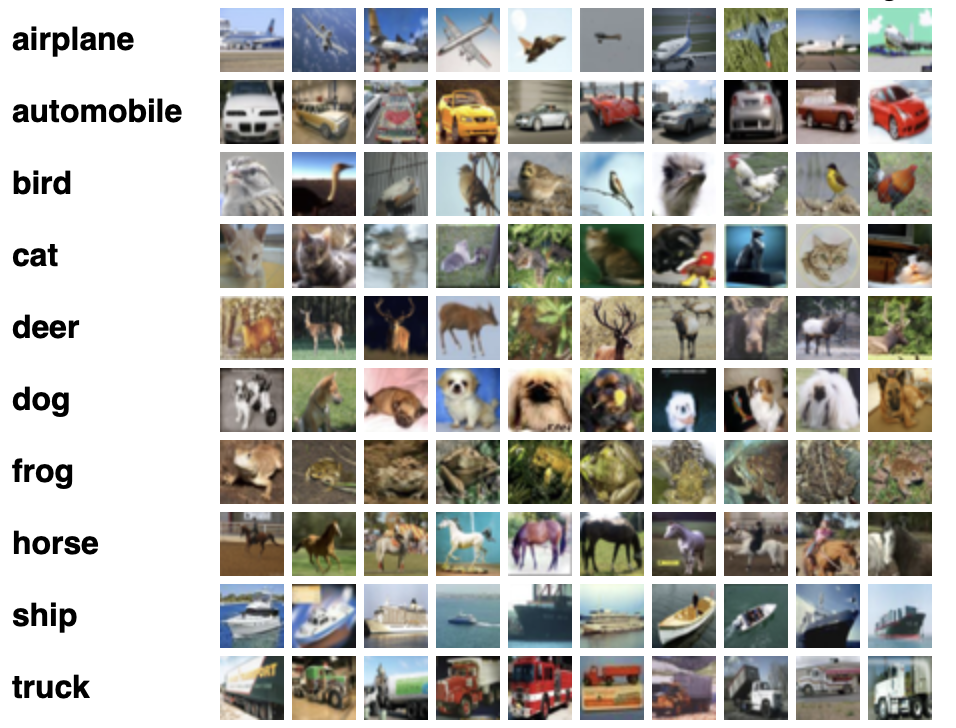

Figure 10.1 – CIFAR-10 classes and sample images. Each row shows ten representative examples per class (Image source: Alex Krizhevsky[^1]).

By using CIFAR-10, we isolate the effects of computation and synchronization during training, which aligns with the educational goal of this chapter: building intuition about how parallel execution behaves before introducing more realistic and demanding workloads.

CIFAR-10 was compiled by Alex Krizhevsky, Vinod Nair, and Geoffrey Hinton in the paper "Learning Multiple Layers of Features from Tiny Images "(2009). The dataset is divided as follows:

- Training set: 50,000 images split across five data batches (10,000 images each)

- Test set: 10,000 images, comprising exactly 1,000 images per class

Training batches contain images in random order, and some may have more instances of a given class than others. However, across all five training batches, each class is evenly represented with exactly 5,000 images.

The directory structure of the CIFAR-10 dataset used in this exercise is as follows:

       ├── cifar-10-batches-py
           ├── batches.meta
           ├── data_batch_1
           ├── data_batch_2
           ├── data_batch_3
           ├── data_batch_4
           ├── data_batch_5
           └── test_batch

To allow longer training durations for performance comparison purposes, all images in CIFAR-10 have been resized to 128×128 pixels.

This resizing increases computational cost and thereby emphasizes the performance differences between hardware platforms.

Note that resizing CIFAR-10 images from their original 32×32 resolution to 128×128 also modifies the input dimensions expected by the model.

While architectures like ResNet can adapt to varying input sizes, this change may slightly affect the final accuracy.

We emphasize that the 128×128 resolution is chosen solely to create a heavier training workload and is not a requirement of the ResNet architecture.

We provide a custom function, load_data(), available in the accompanying GitHub repository for this book.

This function handles the loading, resizing, and formatting of the dataset into TensorFlow-compatible training and testing datasets.

### Model architectures: ResNet

For the training experiments in this chapter, we rely on convolutional neural networks from the ResNet family. Residual Networks are a well-established class of architectures that introduce skip connections to facilitate the training of deep models. Their widespread adoption and standardized implementations make them a natural choice for instructional examples.

We focus on two variants: ResNet50V2 and ResNet152V2. These models share the same architectural principles but differ significantly in depth and computational cost. ResNet50V2 represents a relatively lightweight model, while ResNet152V2 introduces substantially more layers and parameters, resulting in higher computation per training step.

The purpose of using two model sizes is not to compare accuracy or to identify the “best” architecture. Instead, it allows us to observe how model complexity influences the behavior of parallel training. In particular, larger models tend to perform more computation per batch, which can partially mask communication overheads when multiple GPUs are used.

At this stage, we do not attempt to control all experimental variables rigorously. Batch sizes, execution configurations, and training duration are selected to keep the examples simple and executable within a teaching environment. The goal is to expose qualitative trends rather than to produce definitive performance conclusions.

A more systematic and performance-oriented treatment of model scaling will be introduced later in the book, once the reader has gained practical experience with the mechanics of parallel training.

As mentioned, ResNet architectures are widely used in image recognition tasks due to their robust performance and training stability. For this chapter, we will use ResNet50V2, an enhanced variant of the original ResNet50 architecture.

These models (ResNet50V2 an enhanced variant of the original ResNet50 architecture in this code example) is available via the tf.keras.applications module and can be instantiated as follows:

    tf.keras.applications.ResNet50V2(
        include_top=True,
        weights="imagenet",
        input_tensor=None,
        input_shape=None,
        pooling=None,
        classes=1000,
        classifier_activation="softmax",
    )

Parameter Highlights:

- include_top: Include the final classification layer.

- weights: Use pre-trained ImageNet weights or initialize randomly (None).

- input_shape: Required if include_top=False; otherwise, defaults to (224, 224, 3).

- pooling: Specifies global pooling when include_top=False.

- classes: Number of classes (10 for CIFAR-10).

- classifier_activation: Activation function for final layer; None returns logits.

Since our focus is on performance rather than accuracy, we use weights=None to avoid downloading pretrained weights.

Task 10.1 – Task Setup and File Structure

In this task, you will prepare the working environment required for all the experiments in this chapter. Before running any training jobs, it is important to ensure that the necessary scripts and utilities are correctly organized in your home directory on MareNostrum 5.

The CIFAR-10 dataset is already available in a shared filesystem on MN5 and must not be copied. Your instructor will provide the exact path to this dataset. Verify that you can access it and take note of its location, as it will be referenced by the training scripts.

Next, copy the following directory and files from the book’s GitHub repository into your \$HOME directory on MN5:

> 
>
>     /Chapter10
>
>     ├── ResNet50_seq.py
>
>     ├── ResNet50_seq.CPU.slurm
>
>     ├── ResNet50_seq.GPU.slurm
>
>     ├── ResNet50.py
>
>     ├── ResNet50.slurm
>
>     └── cifar-utils
>
>         └── cifar.py

Before proceeding, briefly inspect the contents of these files to familiarize yourself with their purpose. In particular, identify which scripts correspond to sequential execution and which are intended for multi-GPU training, as well as how the CIFAR-10 dataset is loaded.

This initial setup will be reused throughout the chapter. Ensuring that your environment is correctly configured at this stage will help you focus on understanding the behavior of parallel training in the subsequent tasks, without being distracted by file or path-related issues.

This is a preparatory task intended solely for environment setup; please do not include it in the final deliverables.

### Baseline Code: Sequential Training on CPU and GPU

All experiments in this section are based on the same training script, which is executed sequentially either on the CPU or on a single GPU. No changes are made to the model definition, loss function, optimizer, or training loop between these two configurations. The only difference lies in the hardware device on which the computation is performed.

This approach is intentional. By keeping the code identical, we isolate the effect of hardware acceleration and avoid introducing confounding factors related to algorithmic or implementation changes. The resulting execution times provide a clear and intuitive comparison between general-purpose processors and GPU-based acceleration.

The CPU execution serves as a reference point, highlighting the limitations of sequential training for compute-intensive workloads. The single-GPU execution, in contrast, demonstrates how specialized accelerators can significantly reduce per-step latency and overall training time, even without any form of parallelism across devices.

It is important to emphasize that the single-GPU configuration established here is not an endpoint, but a baseline. All multi-GPU experiments presented later in this chapter build directly on this setup. Before attempting to scale across multiple GPUs, it is essential to understand the performance characteristics of a single accelerated device.

Once this baseline is established, we are ready to introduce data-parallel training across multiple GPUs using TensorFlow’s high-level abstractions.

#### Python Script

In our exercice we begin by training a ResNet50V2 classifier on CIFAR-10 in a sequential manner to establish a performance baseline. The following Python script (ResNet50_seq.py) performs this training:

    import tensorflow as tf
    from tensorflow.keras import layers
    from tensorflow.keras import models
    import numpy as np
    import argparse
    import time
    import sys

    sys.path.append('/gpfs/<path>/cifar-utils')
    from cifar import load_cifar

    parser = argparse.ArgumentParser()
    parser.add_argument('--epochs', type=int, default=5)
    parser.add_argument('--batch_size', type=int, default=2048)
    args = parser.parse_args()

    batch_size = args.batch_size
    epochs = args.epochs

    train_ds, test_ds = load_cifar(batch_size)

    model = tf.keras.applications.resnet_v2.ResNet50V2(    
            include_top=True, 
            weights=None, 
            input_shape=(128, 128, 3), classes=10)

    opt = tf.keras.optimizers.SGD(0.01)
    model.compile(loss='sparse_categorical_crossentropy',
                  optimizer=opt,
                  metrics=['accuracy'])
    model.fit(train_ds, epochs=epochs, verbose=2)

Task 10.2 – Code Review and Execution Flow

Carefully examine the sequential training script provided (ResNet50_seq.py) to understand how a standard single-GPU training workflow is implemented in TensorFlow.

As you read the code, focus on the following aspects:

- How the CIFAR-10 dataset is loaded and prepared for training.

- How the ResNet50V2 model is instantiated and configured.

- How the training loop is defined, including the choice of optimizer, loss function, and batch size.

At this stage, you are not expected to modify the code or optimize any parameters. The goal is to develop a clear mental model of the execution flow of a conventional training script, identifying where computation happens and how data moves through the system.

This understanding will be essential in the next tasks, where the same structure will be extended to support multi-GPU execution. Being able to recognize what remains unchanged—and what must be adapted—will help you better appreciate the impact of parallel training abstractions.

If any part of the script is unclear, consult the instructor before proceeding.

This is a zero-measurement setup task; please do not include it in the final deliverables.

#### Slurm Script to Train on CPU 

To determine how long it takes to train a model on a CPU, we can use the following SLURM script (ResNet50_seq.CPU.slurm) designed to run the ResNet50_seq.py code using only a CPU:

    #!/bin/bash
    #SBATCH --chdir .
    #SBATCH --job-name=ResNet50_seq_CPU      
    #SBATCH --output=%x.%j.out     
    #SBATCH --error=%x.%j.err      
    #SBATCH --nodes 1                   
    #SBATCH --ntasks-per-node 1         
    #SBATCH --cpus-per-task 20          
    #SBATCH --time 01:15:00             
    #SBATCH --account <account>            
    #SBATCH --qos acc_debug             

    module purge
    module load singularity

    SINGULARITY_CONTAINER=/gpfs/<path>/MN5-NGC-TensorFlow-23.03.sif
    singularity exec $SINGULARITY_CONTAINER python ResNet50_seq.py --epochs 1 --batch_size 256

For this chapter, we use the Singularity container MN5-NGC-TensorFlow-23.03.sif, which was introduced and built earlier in Section 3.4. This container provides a consistent and ready-to-use TensorFlow environment, making it well suited for the hands-on experiments presented here. While it is not specifically tuned for MareNostrum 5, it is more than sufficient for the exploratory and instructional nature of this chapter.

Running the script shows that each training epoch takes approximately 220 seconds to complete:

Epoch 1/2

196/196 - 220s - loss: 2.0373 - accuracy: 0.2538 - 220s/epoch - 1s/step

Epoch 2/2

196/196 - 215s - loss: 1.7401 - accuracy: 0.3598 - 215s/epoch - 1s/step

Task 10.3 – Training on CPU: Establishing a Baseline

In this task, you will execute the training script in a CPU-only configuration to establish a performance baseline for subsequent comparisons.

Review the provided SLURM script for CPU execution and make any necessary adjustments to ensure it runs correctly in your environment. Submit the job and inspect the standard output generated by SLURM.

Once steady-state execution is reached, identify the time required to complete one training epoch. Record this value carefully, as it will serve as the reference point for all subsequent CPU, single-GPU, and multi-GPU performance analyses.

At this stage:

- Do not attempt to optimize performance.

- Do not modify the training configuration.

The goal is not to achieve good performance, but to define a baseline.

Then, reflect briefly:

- Why is establishing a baseline essential before analyzing acceleration or parallel scaling?

- What conclusions would be impossible to draw without this reference point?

Summarize your answer in one short slide, clearly stating the role of the CPU baseline in performance analysis.

#### Slurm Script to Train on a Single CPU 

To run the same training on a GPU node, use this updated SLURM script (ResNet50_seq.GPU.slurm):

    ...
    #SBATCH --gres=gpu:1
    ...
    singularity exec --nv $SINGULARITY_CONTAINER python ResNet50_seq.py \
        --epochs 1 --batch_size 256

Adding the --nv flag ensures GPU access from within the Singularity container.

Task 10.4 – Single-GPU Training: CPU vs GPU Execution Time

In this task, you will run the same training script using a single GPU and measure its execution time.

Review the SLURM script configured for GPU execution and submit the job. Once the run has completed, identify the steady-state time required to complete one training epoch.

Compare this value with the CPU baseline obtained in Task 10.3. Focus on the magnitude of the performance difference, ignoring accuracy or convergence behavior.

In your analysis:

- Quantify the speedup obtained when moving from CPU to a single GPU.

- Explain why GPUs provide such a significant advantage for deep learning workloads, considering aspects such as massive parallelism, memory bandwidth, and hardware specialization.

Then, make an explicit distinction:

- Why is the transition from CPU to GPU an example of acceleration, rather than parallel scaling?

Summarize your conclusions in a single slide, clearly distinguishing between acceleration through specialized hardware and scaling through parallel execution

Execution times on a GPU should drop dramatically, down to ~24 seconds per epoch:

Epoch 1/2

196/196 - 24s - loss: 2.0245 - accuracy: 0.2561 - 24s/epoch - 121ms/step

Epoch 2/2

196/196 - 14s - loss: 1.7091 - accuracy: 0.3712 - 14s/epoch - 73ms/step

This demonstrates nearly a 10x speedup compared to the CPU run, clearly showcasing the advantage of GPU acceleration for training deep networks.

*Note. Training accuracy remains low in this experiment due to the small number of epochs and the absence of pretraining. This is expected and sufficient for the purpose of this task, which is to highlight differences in execution time between configurations rather than to assess model quality. More extensive training, hyperparameter tuning, and data augmentation will be addressed in later chapters.*

It is also important to note that the first training epoch typically incurs additional overhead due to framework initialization, memory allocation, and data pipeline setup. For this reason, we do not analyze it in detail and instead focus on the second epoch when comparing performance.

These observations provide a concrete illustration of *Foundational Performance Principle \#1*, introduced in Chapter 5. GPU acceleration becomes effective only when the computational workload is sufficiently large to amortize fixed overheads such as initialization, data movement, and execution setup. Once this condition is met, computation dominates execution time and the performance advantages of specialized accelerators become clearly visible.

While the performance gap between CPU and GPU execution is clear, these results should not be interpreted as evidence that parallelism alone guarantees efficient scaling. At small scales, overheads are often hidden by large performance differentials. As scale increases, these hidden costs become dominant.

##  Accelerate Training with Parallelism in TensorFlow

With a single-GPU baseline established, we now take the first step toward parallel training. In this section, we introduce data-parallel execution across multiple GPUs using TensorFlow’s high-level abstraction mechanisms.

TensorFlow provides built-in support for parallel training through *distribution strategies*. These strategies allow the same training script to be executed concurrently on multiple devices, while the framework automatically manages data distribution, gradient aggregation, and parameter updates. From the user’s perspective, this significantly lowers the barrier to entry for multi-GPU training.

In this chapter, we focus on MirroredStrategy, which is designed for synchronous data-parallel training on multiple GPUs within a single node. Each GPU maintains a local copy of the model and processes a different subset of the input data. At the end of each training step, gradients are synchronized across devices to ensure that all model replicas remain consistent.

The key pedagogical value of this approach lies in its simplicity. By introducing parallelism through a minimal set of code changes, we can observe the immediate effects of scaling from one GPU to several GPUs. At the same time, this simplicity makes the underlying trade-offs more visible: increasing the number of GPUs reduces computation time per epoch, but introduces additional coordination and synchronization overheads.

At this stage, we do not attempt to optimize or fine-tune the parallel execution. The goal is to observe and understand the basic behavior of multi-GPU training before addressing more advanced performance considerations in subsequent chapters.

### Types of Parallelism 

Training neural networks efficiently on modern hardware requires exploiting parallelism. As models and datasets grow, a single processing device quickly becomes insufficient, making parallel and distributed execution a necessity rather than an optimization.

#### Fundamental paradigms

At a high level, two fundamental paradigms are used to parallelize neural network training: *data parallelism* and *model parallelism*. While both aim to reduce training time by leveraging multiple devices, they do so in conceptually different ways, as illustrated in Figure 10.2.

In *model parallelism*, different parts of the neural network are placed on different GPUs. Each device is responsible for executing a subset of the model, and data flows sequentially across GPUs as it propagates through the network. This approach is particularly useful when a model is too large to fit entirely in the memory of a single GPU.

In *data parallelism*, the entire model is replicated on each GPU. The training dataset is divided into disjoint subsets, and each device processes a different batch of data in parallel. After each training step, gradients are synchronized across GPUs to ensure that all model replicas remain consistent.

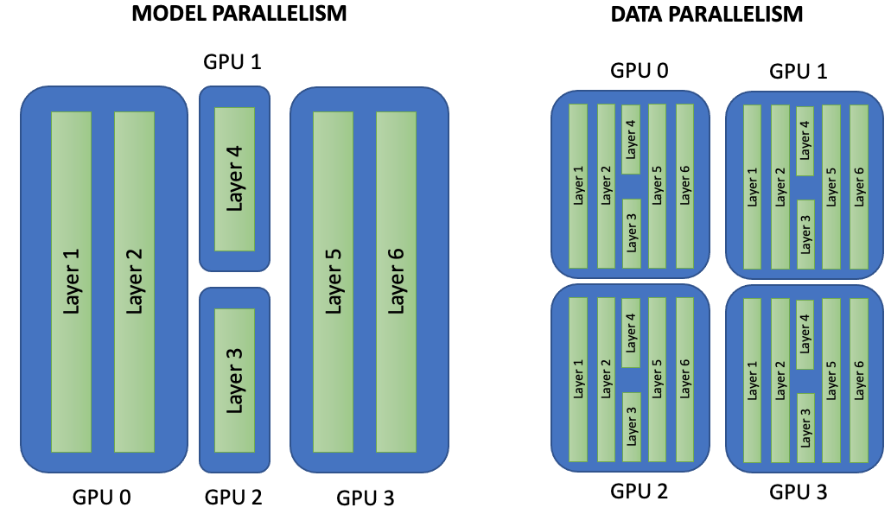

Figure 10.2 – Model Parallelism vs Data Parallelism. In model parallelism (left), each GPU holds a different portion of the model and data flows through the GPUs sequentially. In data parallelism (right), the entire model is replicated on each GPU, and each device trains on a different subset of the data. After each batch, gradients are synchronized across devices.

While both approaches are widely used in practice, this chapter focuses exclusively on *data parallelism*. Data parallelism is the most common and accessible method for scaling training across multiple GPUs, especially within a single node. It also aligns naturally with the high-level abstractions provided by modern deep learning frameworks such as TensorFlow.

The experiments presented in this chapter are designed to illustrate how data parallelism behaves in practice: how training time evolves as GPUs are added, and how synchronization overheads begin to appear. Model parallelism and more advanced combinations of parallelization strategies are intentionally left out at this stage.

#### Beyond Data and Model Parallelism

Beyond these two fundamental paradigms, a rich set of complementary techniques has emerged to support large-scale training, particularly for state-of-the-art models.

*Gradient accumulation* allows large effective batch sizes by splitting a logical batch into multiple smaller micro-batches and accumulating gradients before performing an optimizer step. This technique is especially useful when GPU memory is limited.

*Optimizer state sharding*, such as the ZeRO (Zero Redundancy Optimizer) approach, distributes model parameters, gradients, and optimizer states across GPUs, significantly reducing memory usage and enabling the training of larger models.

Other strategies include *tensor parallelism*, which distributes computation within individual layers, *pipeline parallelism*, which splits layers across devices and overlaps computation with communication, and *sequence parallelism*, which is particularly relevant for models processing long input sequences.

These techniques form the foundation of highly scalable frameworks such as DeepSpeed and Megatron-LM, which are commonly used to train large language models across hundreds or thousands of GPUs. While their implementation is beyond the scope of this chapter, being aware of their existence helps place data parallelism in the broader landscape of modern AI training.

### Parallel Training with TensorFlow

TensorFlow provides high-level abstractions that make parallel training accessible with minimal changes to sequential code. In this chapter, we use the tf.distribute API to introduce synchronous data-parallel training across multiple GPUs.

#### A First Look at TensorFlow MirroredStrategy 

Our focus is on tf.distribute.MirroredStrategy, a widely used strategy designed for training on multiple GPUs within a single node. With MirroredStrategy, the model is replicated on each GPU, and each replica processes a different subset of the input data. During training, gradients computed independently on each device are synchronized to ensure that all replicas remain consistent.

This approach allows us to scale training across multiple GPUs without modifying the core training logic. From the user’s perspective, parallelism is largely transparent, making MirroredStrategy an ideal entry point for understanding multi-GPU execution.

Assuming we are working on a machine with more than one GPU, we can instantiate a MirroredStrategy as follows:

    mirrored_strategy = tf.distribute.MirroredStrategy()

This will create a MirroredStrategy instance that uses all GPUs visible to TensorFlow. To list the available GPU devices, we can run:

    devices = tf.config.experimental.list_physical_devices(“GPU”)

To limit training to a subset of GPUs, we can explicitly specify which ones to use[^2]:

    mirrored_strategy = tf.distribute.MirroredStrategy(devices=["/gpu:0", "/gpu:1"])

We must then define and compile the model within the scope of the strategy. This ensures that all variables are correctly mirrored across devices:

    with mirrored_strategy.scope():
         model = tf.keras.applications.resnet_v2.ResNet50V2(
                 include_top=True, weights=None, 
                 input_shape=(128, 128, 3), classes=10)
      

         opt = tf.keras.optimizers.SGD(learning_rate)
     
         model.compile(loss='sparse_categorical_crossentropy', 
                       optimizer=opt, metrics=['accuracy'])

By building the model inside the strategy scope, TensorFlow creates distributed variables instead of regular ones. These distributed variables are automatically kept in sync. It is essential that variable creation (i.e., model construction and compilation) occurs within the strategy scope.

At this stage, it is sufficient to understand that all model construction and compilation must occur within the strategy scope. The internal mechanisms that enforce synchronization will be explored in later chapters.

Once the model is built and compiled, the training itself can proceed as usual outside the scope:

    dataset = load_data(batch_size)
    model.fit(dataset, epochs=5, verbose=2)

#### **Synchronous Data-Parallel Execution**

Figure 10.3 illustrates the execution model of synchronous data parallelism. Each GPU performs forward and backward passes independently on its assigned data. Gradients are then aggregated—typically through an All-Reduce operation—and used to update a shared set of model variables, ensuring consistency across replicas.

When using MirroredStrategy, training follows a synchronous execution model. Each GPU maintains a local replica of the model and computes gradients independently on its portion of the data. At the end of each training step, gradients are aggregated and applied uniformly, ensuring that all model replicas evolve identically.

This synchronization step introduces coordination overhead, which grows as more GPUs are added. At the same time, parallel execution reduces computation time per epoch. Observing the balance between these two effects is one of the main learning objectives of this chapter.

#### Batch Size and Learning Rate Considerations

When training neural networks, memory is required not only to store the model parameters but also to hold intermediate data and mini-batches during the forward and backward passes. This means we must be careful with the batch size to avoid out-of-memory (OOM) errors, especially when working with GPUs.

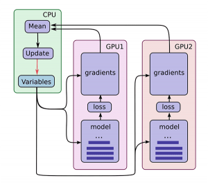

Figure 10.3 – Parallel training using TensorFlow's MirroredStrategy. Each GPU independently computes forward and backward passes on a partition of the input data. Gradients are then aggregated (e.g., via All-Reduce), and updates are applied to a shared set of model variables, typically managed on the CPU. This synchronous data parallelism ensures consistency across model replicas (Image source: Jonathan Hui[^3]).

The batch_size defines how many samples are processed in each training step. In practice, we try to use the largest value that fits in memory to maximize throughput. Determining the optimal batch size typically involves empirical testing—incrementing the value until a memory error occurs. For simplicity in this introductory exercise, we fix the batch size to 2048 for single-GPU experiments.

*Note that all batch-size figures in this chapter assume an NVIDIA H100 SXM5 accelerator with 64 GB of HBM. On cards with less memory start with a smaller batch size (e.g. 1,024 on an A100 40 GB or ~512 on a consumer RTX 4090 24 GB) and scale up experimentally.*

When using MirroredStrategy with multiple GPUs, TensorFlow splits the specified batch_size evenly across replicas. As a result, the value we pass to the training script should reflect the global batch size, that is, the per-GPU batch size multiplied by the number of GPUs. When scaling across GPUs, the global batch size typically increases proportionally.

For example, the following configuration choices are pragmatic heuristics intended to keep behavior comparable across runs. They should not be interpreted as universally optimal settings.

    python ResNet50.py -- epochs 5 -- batch_size 2048 -- n_gpus 1
    python ResNet50.py -- epochs 5 -- batch_size 4096 -- n_gpus 2
    python ResNet50.py -- epochs 5 -- batch_size 8192 -- n_gpus 4

In each case, the effective batch size per GPU remains the same, ensuring consistent training behavior. It is a common heuristic that the learning rate scale with the number of GPUs. This helps maintain the convergence dynamics when increasing batch size. In code, this adjustment is done as follows:

    learning_rate = learning_rate_base * number_of_gpus
    opt = tf.keras.optimizers.SGD(learning_rate)

#### Parallel Performance Measurement

In this hands-on exercise, we use epoch time as a simple and practical metric to evaluate the computation time of distributed training. The value in seconds, provided by Keras's fit() method, is accurate enough for comparative analysis.

To avoid initialization overheads, we discard the first epoch—which includes setup tasks like model instantiation and data pipeline warm-up. This way, the measured performance better reflects steady-state execution.

For more rigorous benchmarking, we would need to break down the process into data loading, forward pass, loss evaluation, backpropagation[^4], and optimizer update time. However, this level of analysis is beyond the scope of this introductory exercise.

#### Clarifying Throughput Metrics

As we have seen, in the context of HPC, the term *throughput* can have multiple meanings. It most commonly refers to the number of useful operations completed per unit of time, reflecting how effectively a supercomputer utilizes its computational resources — that is, the amount of work done per unit of time.

Throughput is a particularly insightful metric, as it provides a broader perspective on how effectively the system processes data over time, beyond individual epoch durations. It essentially reflects the system’s ability to "get the job done" at scale.

In the context of this chapter, the unit of work will be the number of training images processed per second.

However, we need to distinguish between two situations, and we report two common throughput metrics to evaluate parallel training performance:

- Global Throughput refers to the total number of training images processed per second across all GPUs. For example, if 4 GPUs process 2,000 images per second together, the global throughput is 2,000 images/sec.

- Per-GPU Throughput divides the global throughput by the number of GPUs. It reflects the efficiency of each device and is useful for analyzing scaling behavior.

We will revisit these concepts in more detail in future chapters, especially when analyzing the impact of optimization techniques, input pipeline design, or when the unit of work changes — for example, to tokens per second in the case of large language models (LLMs).

### Exploring the Parallelization of the Training Step with MirroredStrategy

In this section, we will demonstrate how to parallelize the training step of a convolutional neural network using the MirroredStrategy API from TensorFlow, using 1, 2, and 4 GPUs.

#### Parallelizing ResNet50 Training with TensorFlow

In this experiment we parallelize the training of a ResNet50V2 model using TensorFlow’s tf.distribute.MirroredStrategy. The workload runs on the CIFAR-10 dataset and is executed on a single compute node of MareNostrum 5, using 1, 2, and 4 GPUs.

To keep the workflow practical, we use a small Python script (ResNet50.py) that accepts three parameters: the number of GPUs to use, the global batch size, and the number of epochs. The core idea is that the same training script can run either sequentially (single GPU) or in synchronous data-parallel mode (multiple GPUs), with only a small amount of additional configuration.

The following excerpt shows the key elements of the implementation: selecting the visible devices, creating a MirroredStrategy instance, and building/compiling the model inside the strategy scope.

    import tensorflow as tf 
    from tensorflow.keras import layers 
    from tensorflow.keras import models
    import numpy as np

    import argparse
    import time
    import sys

    sys.path.append('/gpfs/<path>/cifar-utils')
    from cifar import load_cifar
    parser = argparse.ArgumentParser()
    parser.add_argument(' -- epochs', type=int, default=5)
    parser.add_argument(' -- batch_size', type=int, default=2048)
    parser.add_argument(' -- n_gpus', type=int, default=1)
    args = parser.parse_args()
    batch_size = args.batch_size
    epochs = args.epochs
    n_gpus = args.n_gpus
    train_ds, test_ds = load_cifar(batch_size)
    device_type = 'GPU'
    devices = tf.config.experimental.list_physical_devices(
              device_type)
    devices_names = [d.name.split(“e:”)[1] for d in devices]
    strategy = tf.distribute.MirroredStrategy(
               devices=devices_names[:n_gpus])
    with strategy.scope():
         model = tf.keras.applications.resnet_v2.ResNet50V2(
                 include_top=True, weights=None,
                 input_shape=(128, 128, 3), classes=10)
         opt = tf.keras.optimizers.SGD(0.01*n_gpus)
         model.compile(loss=’sparse_categorical_crossentropy’, 
                       optimizer=opt, metrics=[‘accuracy’])
    model.fit(train_ds, epochs=epochs, verbose=2)

For simplicity, we keep the per-GPU batch size approximately constant by scaling the global batch size with the number of GPUs. We also apply the common heuristic of scaling the learning rate linearly with the number of GPUs. These choices are not presented as universally optimal; they are pragmatic settings that help keep behavior comparable across runs in this introductory exercise.

#### SLURM Script for Running the Experiments

The following SLURM script (ResNet50.slurm) allocates a single node with four GPUs and runs the same training program three times, using 1, 2, and 4 GPUs. Each run uses a corresponding global batch size so that the per-GPU batch size remains approximately constant.

    #!/bin/bash
    #SBATCH --chdir .
    #SBATCH --job-name=ResNet50    
    #SBATCH --output=%x.%j.out     
    #SBATCH --error=%x.%j.err     
    #SBATCH --nodes 1                   
    #SBATCH --ntasks-per-node 1                    
    #SBATCH --gres gpu:4           
    #SBATCH --cpus-per-task 80          
    #SBATCH --time 01:15:00           
    #SBATCH --account <account>       
    #SBATCH --qos acc_debug     

    nvidia-smi

    module purge
    module load singularity

    SINGULARITY_CONTAINER=/gpfs/<path>/MN5-NGC-TensorFlow-23.03.sif

    singularity exec --nv $SINGULARITY_CONTAINER \
      python ResNet50.py --epochs 5 --batch_size 2048 --n_gpus 1

    singularity exec --nv $SINGULARITY_CONTAINER \
      python ResNet50.py --epochs 5 --batch_size 4096 --n_gpus 2

    singularity exec --nv $SINGULARITY_CONTAINER \
      python ResNet50.py --epochs 5 --batch_size 8192 --n_gpus 4

Our goal here is not to maximize accuracy or perform a statistically rigorous benchmark. Instead, we run only a small number of epochs to obtain a clear, resource-conscious comparison of execution behavior across GPU counts. For a production-quality performance study, we would typically run longer experiments, repeat trials, and report averages with variability; this level of rigor is intentionally out of scope for this warm-up chapter.

*Note: for clarity, we launch the three configurations sequentially from a single SLURM job. This is acceptable for small illustrative runs, but in real production environments it is usually better to submit separate jobs per configuration to avoid reserving idle GPUs.*

#### Observations and Analysis

By executing the previous SLURM script, we obtain the following result:

+---------------------------------------------------------------------------------------+

\| NVIDIA-SMI 535.86.10 Driver Version: 535.86.10 CUDA Version: 12.2 \|

\|-----------------------------------------+----------------------+----------------------+

\| GPU Name Persistence-M \| Bus-Id Disp.A \| Volatile Uncorr. ECC \|

\| Fan Temp Perf Pwr:Usage/Cap \| Memory-Usage \| GPU-Util Compute M. \|

\| \| \| MIG M. \|

\|=========================================+======================+======================\|

\| 0 NVIDIA H100 On \| 00000000:1B:00.0 Off \| 0 \|

\| N/A 41C P0 121W / 700W \| 2MiB / 65247MiB \| 0% Default \|

\| \| \| Disabled \|

+-----------------------------------------+----------------------+----------------------+

\| 1 NVIDIA H100 On \| 00000000:2C:00.0 Off \| 0 \|

\| N/A 39C P0 120W / 700W \| 2MiB / 65247MiB \| 0% Default \|

\| \| \| Disabled \|

+-----------------------------------------+----------------------+----------------------+

\| 2 NVIDIA H100 On \| 00000000:9D:00.0 Off \| 0 \|

\| N/A 40C P0 121W / 700W \| 2MiB / 65247MiB \| 0% Default \|

\| \| \| Disabled \|

+-----------------------------------------+----------------------+----------------------+

\| 3 NVIDIA H100 On \| 00000000:AD:00.0 Off \| 0 \|

\| N/A 40C P0 125W / 700W \| 2MiB / 65247MiB \| 0% Default \|

\| \| \| Disabled \|

+-----------------------------------------+----------------------+----------------------+

+---------------------------------------------------------------------------------------+

\| Processes: \|

\| GPU GI CI PID Type Process name GPU Memory \|

\| ID ID Usage \|

\|=======================================================================================\|

\| No running processes found \|

+---------------------------------------------------------------------------------------+

Model ResNet50 1 GPUs

-----------------------

Batch_size: 2048

Num_replicas: 1

Epoch 1/2

25/25 - 29s - loss: 2.2484 - accuracy: 0.1629 - 29s/epoch - 1s/step

Epoch 2/2

25/25 - 14s - loss: 2.1255 - accuracy: 0.2195 - 14s/epoch - 544ms/step

Model ResNet50 2 GPUs

-----------------------

Batch_size: 4096

Num_replicas: 2

Epoch 1/2

13/13 - 31s - loss: 2.2603 - accuracy: 0.1494 - 31s/epoch - 2s/step

Epoch 2/2

13/13 - 8s - loss: 2.1533 - accuracy: 0.2064 - 8s/epoch - 623ms/step

Model ResNet50 4 GPUs

-----------------------

Batch_size: 8192

Num_replicas: 4

Epoch 1/2

7/7 - 47s - loss: 2.2741 - accuracy: 0.1514 - 47s/epoch - 7s/step

Epoch 2/2

7/7 - 5s - loss: 2.1481 - accuracy: 0.2160 - 5s/epoch - 768ms/step

*Note: if you print nvidia-smi in the SLURM script, it will often show 0% utilization in the log because the command is executed after the training run has completed. To inspect utilization during training, nvidia-smi must be sampled while the program is running (for example, by running it periodically in another terminal session, or using monitoring tools provided by the system).*

*Note: The loss and accuracy values shown in the logs are included only because they are part of the default Keras output. In this chapter, we do not interpret these metrics; our focus is on execution time and throughput.*

To summarize steady-state behavior, we report the time of the second epoch for each configuration. The first epoch typically includes additional overheads such as memory allocation and framework initialization, and this effect tends to become more visible as the number of GPUs increases.

Using the same training script under three GPU configurations (1, 2, and 4 GPUs), we obtain the following epoch times:

- 1 GPU: 14 seconds per epoch

- 2 GPUs: 8 seconds per epoch

- 4 GPUs: 5 seconds per epoch

Figure 10.4 visualizes these results.

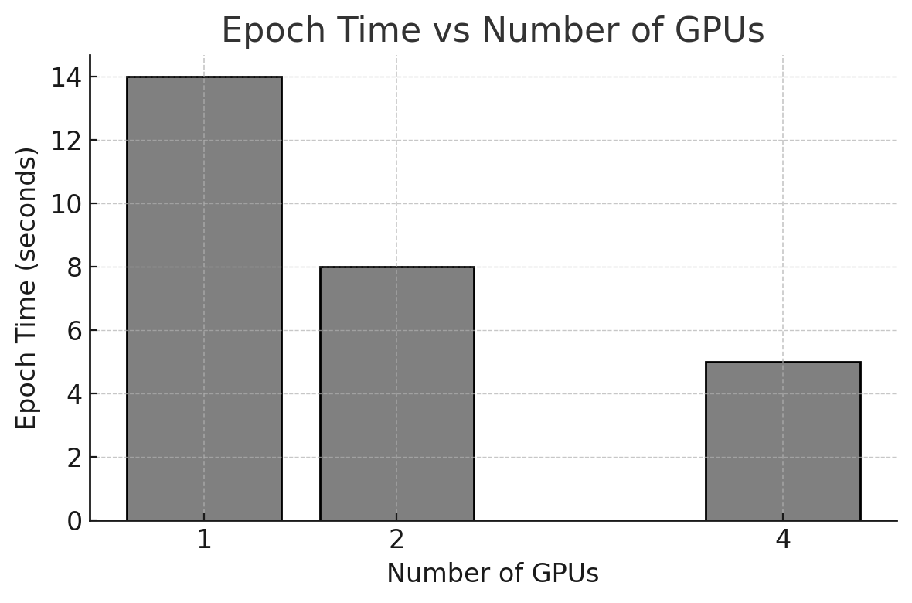

Figure 10.4 – Epoch time (in seconds) for training ResNet50 with 1, 2, and 4 GPUs using MirroredStrategy.

*Note: We have chosen to report the time of the second epoch, as it more accurately reflects the steady-state training performance. The first epoch typically includes additional overhead related to initialization and memory allocation, and this overhead becomes more pronounced as the number of GPUs increases. We will explore this behavior in greater detail in upcoming chapters.*

*Note: For clarity, we limit the analysis to 1, 2, and 4 GPUs. Power-of-two configurations are commonly used in scalability studies and will be explored more systematically later in the book.*

#### Global Throughput

In addition to epoch time, we compute *global throughput* in images per second. In this chapter, the unit of work is the number of training images processed. Global throughput measures the total processing rate across all GPUs, providing a system-level view of how much work the node sustains as we increase the number of devices.

Figure 10.5 shows that throughput increases as more GPUs are used, although scaling is not perfectly linear. This is expected in practice: parallel execution provides more compute capacity, but also introduces synchronization and coordination costs that grow with the number of replicas.

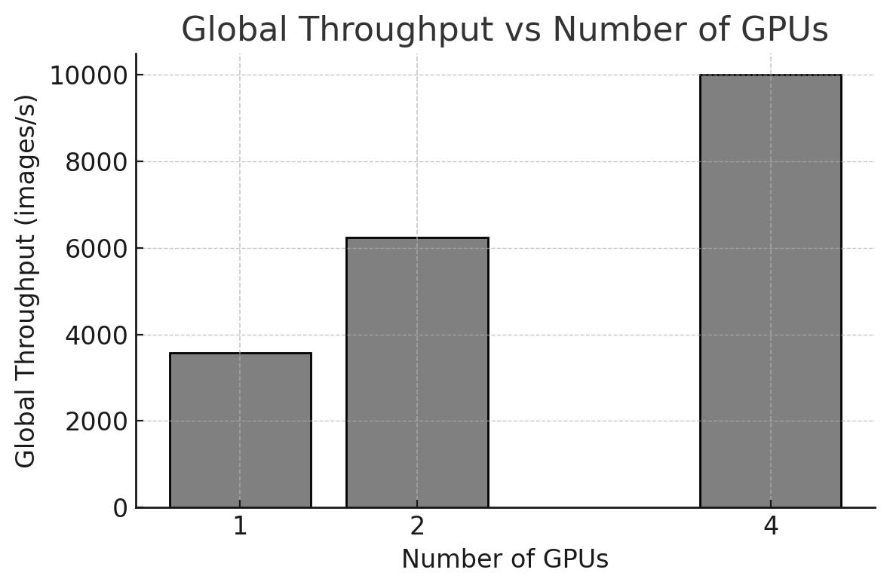

Figure 10.5 – Training throughput (images/second) versus number of GPUs. Throughput increases with more GPUs, but scaling is not perfectly linear.

These results clearly demonstrate the benefits of using data parallelism through TensorFlow’s MirroredStrategy. However, the observed gains are not linear, and this provides a good opportunity to discuss important scalability considerations.

#### Speedup and Efficiency

Using the results from our executions, we derive the speedup and efficiency metrics shown in Table 10.1.

| **GPUs** | **Time (s)** | **Speedup** | **Efficiency (%)** |
|:--------:|:------------:|:-----------:|:------------------:|
|    1     |      14      |    1.00     |       100.0        |
|    2     |      8       |    1.75     |        87.5        |
|    4     |      5       |    2.80     |        70.0        |

Table 10.1 **–** Execution time, speedup, and efficiency for training with 1, 2, and 4 GPUs. Efficiency is computed as speedup divided by the number of GPUs, expressed as a percentage.

Figures 10.6 and 10.7 illustrate speedup and efficiency. As expected, performance improves when more GPUs are used, but with diminishing returns. Moving from 1 to 2 GPUs provides a speedup close to ideal, while scaling to 4 GPUs yields a speedup of 2.8× rather than the ideal 4×.

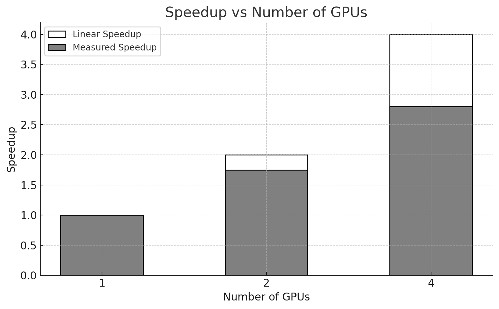

Figure 10.6 **–** Comparison between measured speedup and ideal linear speedup as the number of GPUs increases. The gap between bars highlights the sublinear scaling.

At this introductory stage, we do not attempt to attribute the gap to a single root cause. In practice, several effects often contribute to sublinear scaling in synchronous data-parallel training, including:

- Synchronization overhead: gradients must be aggregated across GPUs at each step, introducing latency that increases with the number of devices.

- Input pipeline limitations: data loading and preprocessing on the CPU side may fail to keep up as training becomes faster, reducing GPU utilization.

- Fixed per-epoch costs: some overheads (framework bookkeeping, initialization effects, Python-level overheads, etc.) do not scale down proportionally and become more visible as epoch time decreases.

This experiment provides an early preview of a key performance principle: accelerating the compute phase alone is insufficient if other stages of the training pipeline cannot sustain the increased processing rate. In later chapters, we will develop *Foundational Performance Principle \#3* (Balanced Pipelines Enable Sustained Performance) in a more systematic way, and show how to identify and mitigate such bottlenecks in practice.

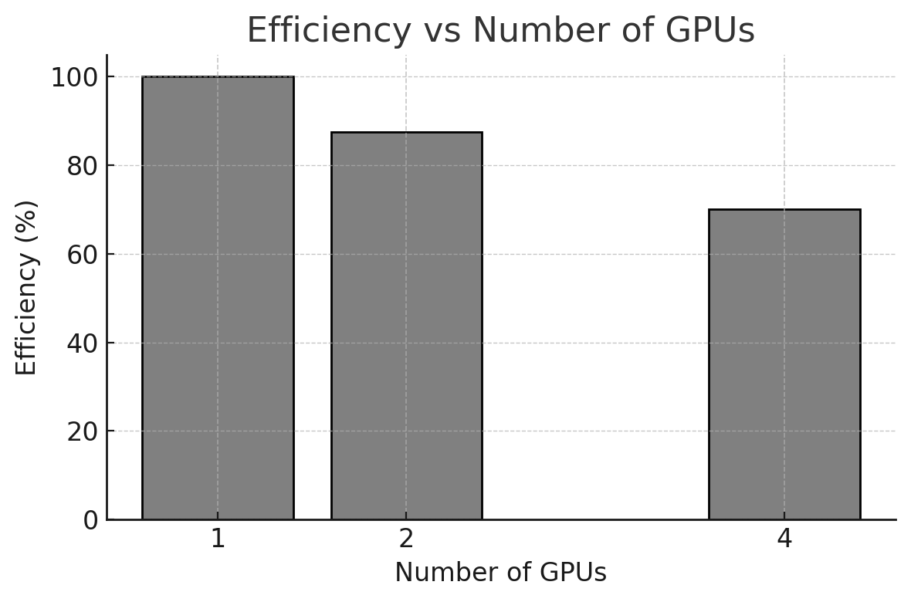

Figure 10.7 **–** Measured parallel efficiency for different numbers of GPUs. Efficiency decreases with more GPUs.

One of the main conclusions from this experiment is that performance scaling with additional GPUs is not linear. Doubling or quadrupling the number of GPUs does not necessarily result in a twofold or fourfold speedup. This observation is crucial when evaluating whether the added complexity and cost of using more GPUs is justified by the performance gains obtained.

In our example, using two GPUs achieved a parallel efficiency close to 88%, indicating that the computational resources were well utilized. However, when scaling to four GPUs, the efficiency dropped to around 70%. This decline highlights the growing influence of overheads such as synchronization costs and communication latency between devices.

The simplicity of the code changes required to enable parallel execution can be misleading. While the framework abstracts away much of the complexity, it does not eliminate synchronization costs, communication overheads, or inefficiencies introduced by the execution model. This is a concrete manifestation of the illusion of scalability: the system runs correctly, but its efficiency must still be demonstrated empirically.

### Memory Requirements: Why Batch Size is Constrained by GPU Capacity

Batch size is one of the most influential parameters in data-parallel training. In this chapter we scale the *global* batch size with the number of GPUs to keep the per-GPU batch size approximately constant. This simple choice helps make runs more comparable and typically improves hardware utilization.

A deeper discussion of batch size—including its interaction with convergence, memory limits, and throughput—belongs to performance-oriented chapters. We introduce the concept here only to highlight its importance and to prepare the reader for the more systematic tuning performed later in the book.

Batch size is not only a performance parameter; it is also one of the main drivers of GPU memory consumption during training. When a training run fails with an out-of-memory (OOM) error, the batch size is often the first variable that must be reduced. Understanding *why* this happens is essential for interpreting the practical limits of the experiments in this chapter.

A useful mental model is to separate GPU memory into two categories:

- *Model-dependent memory (mostly constant with batch size)*: parameters, gradients, and optimizer state.

- *Batch-dependent memory (grows with batch size)*: activations and intermediate tensors created during the forward pass and required for backpropagation.

The dominant term that increases with the batch size is typically *activation memory*. During training, the framework must retain intermediate outputs of multiple layers in order to compute gradients during the backward pass. As the number of samples processed per step increases, the number and size of these stored tensors increase accordingly. This is why batch size often scales until it reaches a hard memory limit, even when the model parameters themselves are relatively small.

In our single-node experiments with TensorFlow’s MirroredStrategy, memory behavior has an additional practical implication. The value passed as batch_size in the script corresponds to the *global batch size*, which is split across the available GPUs. As a result, keeping the *per-GPU batch size* approximately constant tends to keep the *per-GPU activation footprint* approximately constant as well. This is one reason why scaling the global batch size with the number of GPUs is a convenient pedagogical choice in this chapter: it helps maintain comparable memory pressure across configurations while we focus on execution time and scaling behavior.

Nevertheless, memory constraints remain highly dependent on model characteristics. Deeper networks (such as ResNet152V2) not only require more computation per training step but also tend to retain more intermediate activations, increasing memory pressure. Input resolution matters as well: resizing CIFAR-10 images from $`32 \times 32\ `$to $`128 \times 128`$ increases the size of many feature maps and therefore increases activation memory. These effects directly influence the maximum feasible per-GPU batch size and explain why a configuration that works for one model may fail for another.

When memory becomes the limiting factor, practitioners typically rely on a few standard techniques to increase the effective batch size without exceeding GPU capacity:

- *Mixed precision training* (e.g., BF16), which reduces the size of activations and often improves throughput.

- *Gradient accumulation*, which simulates a larger batch by splitting it into multiple micro-batches processed sequentially before an optimizer update.

- *Activation checkpointing*, which trades extra computation for lower activation memory by recomputing selected forward activations during backpropagation.

We do not apply these techniques in this introductory chapter, since the goal is to build intuition about parallel execution rather than to maximize performance. However, the experiments presented here should already make one point clear: *batch size is constrained by memory, and memory constraints shape the practical space of performance experiments*. In later chapters, we will revisit these trade-offs more systematically and show how memory-aware techniques enable both higher throughput and larger-scale training.

#### Closing Remarks

A key takeaway from this experiment is that multi-GPU scaling is not automatically linear. Even within a single node, observed speedup depends on the balance between computation and the overheads introduced by synchronization, coordination, and the supporting input pipeline.

At this point, the goal is simply to recognize these effects and begin developing intuition. Subsequent chapters will revisit the same questions with a more rigorous methodology and a stronger focus on performance analysis and optimization.

Task 10.5 – Analyze the Impact of GPU Parallelism

In this task, you will reproduce the multi-GPU training experiment using the provided ResNet50.py script and the corresponding SLURM batch job on the MareNostrum 5 supercomputer.

Run the training using 1, 2, and 4 GPUs, adjusting the global batch size and learning rate as described earlier in this chapter. Once steady-state execution is reached, collect the following metrics:

- epoch time,

- global training throughput (images per second),

- speedup relative to the single-GPU baseline,

- parallel efficiency.

Perform the following analyses:

- Plot epoch time as a function of the number of GPUs.

- Compute and visualize global throughput.

- Calculate speedup and parallel efficiency, and represent them graphically.

Then, analyze your results:

- How does training throughput evolve as additional GPUs are introduced?

- Is the observed speedup close to ideal linear scaling?

- How does parallel efficiency change as the number of GPUs increases?

Finally, make an explicit judgment:

- Is adding more GPUs always beneficial from a performance-efficiency perspective?

- Under what conditions does increased throughput come at the cost of reduced efficiency?

Summarize your conclusions in one slide, clearly distinguishing between absolute performance gains and scaling efficiency.

##  Impact of Model Size on Parallel Training

In the previous section we studied how training time evolves as we scale the same workload from 1 to multiple GPUs using synchronous data parallelism. We now extend that intuition by asking a closely related question: how does *model size* influence multi-GPU behavior?

To explore this effect, we compare two architectures from the same family but with very different computational cost: ResNet50V2 and ResNet152V2. Both models are trained on the same dataset (50,000 training images) and executed using the same approach as before: MirroredStrategy on a single node, with 1, 2, and 4 GPUs.

The goal of this section is not to tune hyperparameters or optimize accuracy. Instead, we use these two models as a controlled contrast to highlight a key idea: larger models tend to perform more computation per training step, which can improve scaling efficiency by amortizing synchronization overheads.

### Case Study: ResNet152

Model size has a direct impact on resource requirements (memory footprint, compute per step, and training time). ResNet152V2 is substantially deeper than ResNet50V2 and involves significantly more computation per batch. This makes it a useful case study to observe how increased model complexity interacts with synchronous multi-GPU execution.

As in the previous experiments, we intentionally omit extensive hyperparameter exploration. Doing so would require longer training runs, multiple trials, and a more rigorous methodology. Here, the objective remains observational: we measure steady-state epoch time and derived metrics to understand how scaling behavior changes with model size.

To keep the workflow simple, we reuse the same code structure introduced earlier. Thanks to the modular design of Keras model definitions, switching from ResNet50V2 to ResNet152V2 requires only replacing the model constructor in the script, while keeping the rest of the training code unchanged.

We report epoch time as provided by Keras and focus on the second epoch to approximate steady-state behavior, discarding the first epoch due to initialization and memory allocation overheads.

### Parallelization of the ResNet152V2 Neural Network

We now repeat the same training procedure with ResNet152V2 using three configurations: 1 GPU, 2 GPUs, and 4 GPUs.

On an NVIDIA H100 SXM5 GPU (64 GB HBM), the following global batch sizes were feasible in our environment: 1,024 (1 GPU), 2,048 (2 GPUs), and 4,096 (4 GPUs). On GPUs with smaller memory capacity (for example, an A100 40 GB or an RTX 4090 24 GB), these values will typically need to be reduced. In practice, batch size should be increased empirically until approaching the out-of-memory limit, while keeping per-GPU batch size comparable across GPU counts.

The training logs below show the measured epoch times (second epoch) for each configuration.

Model ResNet152 1 GPUs

-----------------------

Batch_size: 1024

Num_replicas: 1

Epoch 1/2

49/49 - 63s - loss: 2.2454 - accuracy: 0.1583 - 63s/epoch - 1s/step

Epoch 2/2

49/49 - 33s - loss: 2.1264 - accuracy: 0.2140 - 33s/epoch - 668ms/step

Model ResNet152 2 GPUs

-----------------------

Batch_size: 2048

Num_replicas: 2

Epoch 1/2

25/25 - 76s - loss: 2.2705 - accuracy: 0.1471 - 76s/epoch - 3s/step

Epoch 2/2

25/25 - 18s - loss: 2.1383 - accuracy: 0.2072 - 18s/epoch - 718ms/step

Model ResNet152 4 GPUs

-----------------------

Batch_size: 4096

Num_replicas: 4

Epoch 1/2

13/13 - 126s - loss: 2.3283 - accuracy: 0.1462 - 126s/epoch - 10s/step

Epoch 2/2

13/13 - 10s - loss: 2.2006 - accuracy: 0.1844 - 10s/epoch - 773ms/step

From these runs we obtain the following steady-state epoch durations:

- 1 GPU: 33 seconds

- 2 GPUs: 18 seconds

- 4 GPUs: 10 seconds

Figure 10.8 shows how epoch time decreases as more GPUs are used, although the reduction is not perfectly linear.

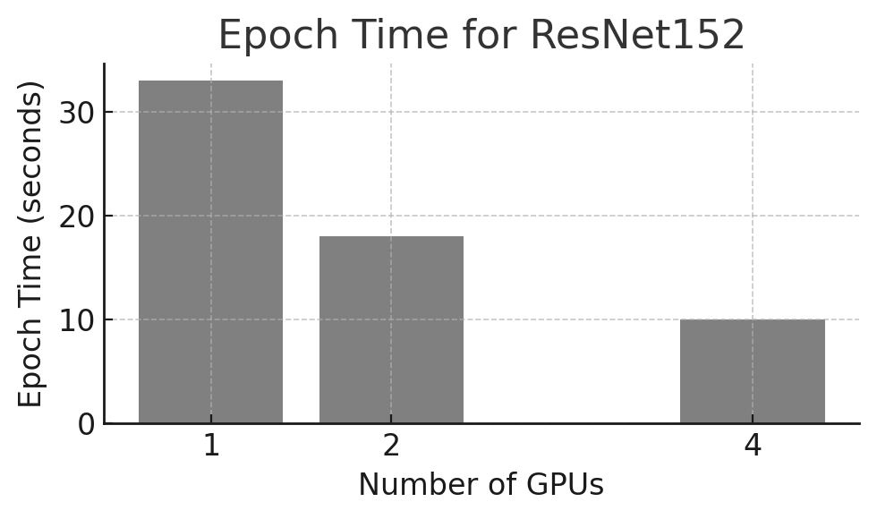

Figure 10.8 **–** Epoch time (seconds) for training ResNet152V2 using 1, 2, and 4 GPUs.

We also compute global throughput in images per second, shown in Figure 10.9. As expected, throughput increases with GPU count, but scaling is not ideal due to synchronization and other overheads that become more visible as execution time decreases.

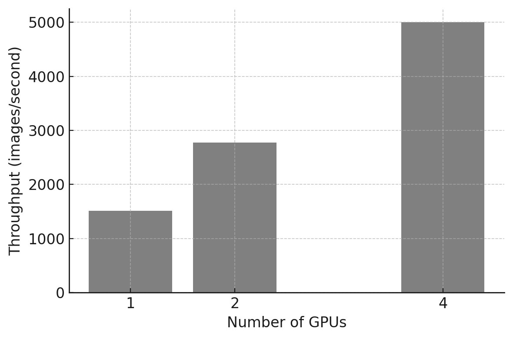

Figure 10.9 **–** Training throughput (images/second) versus number of GPUs.

Using the same measurements, Table 10.2 reports speedup and parallel efficiency, with Figures 10.10 and 10.11 visualizing these two metrics.

| **GPUs** | **Time (s)** | **Speedup** | **Efficiency (%)** |
|:--------:|:------------:|:-----------:|:------------------:|
|    1     |      33      |    1.00     |       100.0        |
|    2     |      18      |    1.83     |        91.5        |
|    4     |      10      |    3.30     |        82.5        |

Table 10.2 **–** Execution time, speedup, and efficiency for training with 1, 2, and 4 GPUs using ResNet152.

Figures 10.10 and 10.11 provide a visual representation of the speedup and efficiency, respectively.

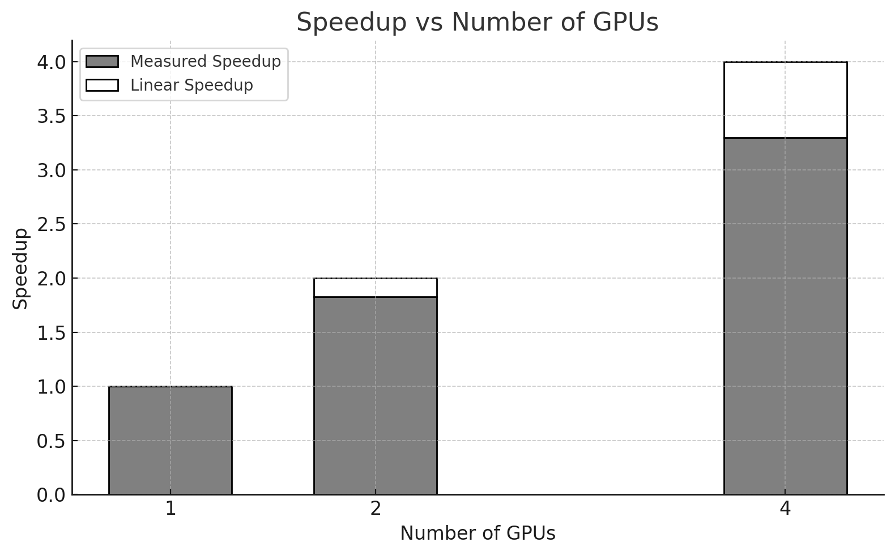

Figure 10.10 **–** Comparison between measured speedup and ideal linear speedup as the number of GPUs increases for ResNet152.

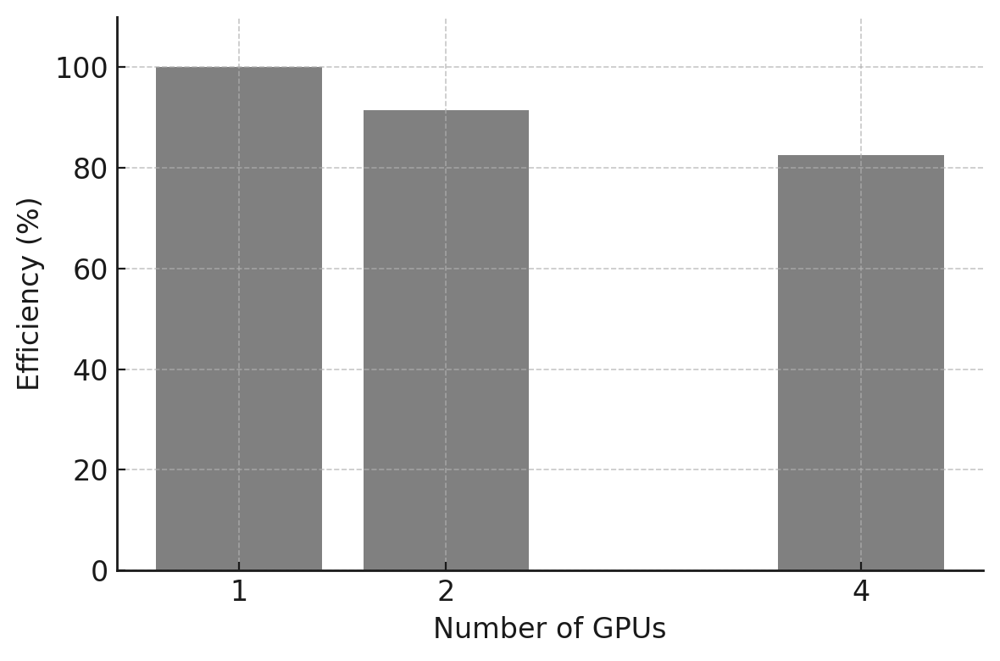

Figure 10.11 **–** Measured parallel efficiency for different numbers of GPUs for ResNet152.

Task 10.6 – Parallelizing a Larger Model: ResNet152

In this task, you will extend the previous multi-GPU experiment to a deeper and more computationally intensive model: ResNet152V2.

Starting from the ResNet50V2 setup, create a new training script and corresponding SLURM batch file, modifying only what is strictly necessary to instantiate and train the ResNet152V2 model. Run the training using 1, 2, and 4 GPUs, adjusting the global batch size to fit within GPU memory constraints.

For each configuration, collect the following steady-state metrics:

- epoch time (excluding initialization overhead),

- global training throughput,

- speedup relative to the single-GPU execution,

- parallel efficiency.

Perform the same analysis as in Task 10.5, and compare the results obtained for ResNet152V2 with those of ResNet50V2.

In your comparison:

- How does increasing model complexity affect absolute training time?

- Does the larger model exhibit better or worse scaling efficiency?

- How does the ratio between computation and communication influence the observed behavior?

Summarize your conclusions in a single slide, explaining why larger models often scale more efficiently despite being slower in absolute terms

### 

### Comparing ResNet50 vs ResNet152V2 

We now compare both case studies side by side. The purpose is not to claim that one model is “better” than the other, but to highlight how model complexity affects training behavior across multiple GPUs.

#### Epoch Time

Figure 10.12 shows that ResNet152V2 requires substantially more time per epoch than ResNet50V2, as expected from its higher computational cost.

Figure 10.12 **–** Epoch time per model as a function of the number of GPUs.

#### Global Training Throughput

Figure 10.13 compares global throughput for both models. ResNet50V2 achieves higher throughput in all configurations because it performs less computation per image, allowing the system to process more images per seconde.

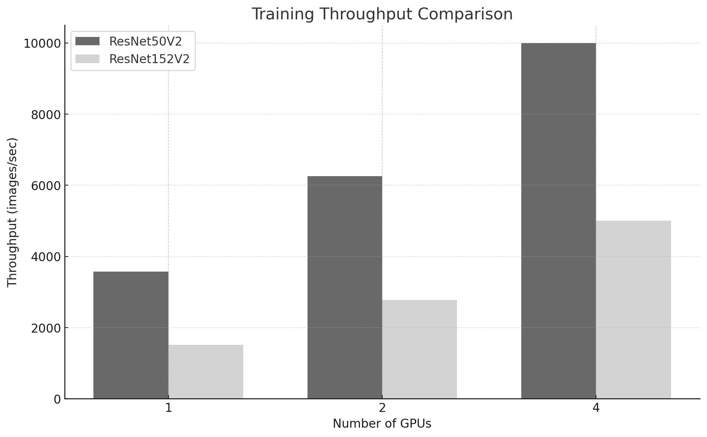

Figure 10.13 **–** Training throughput comparison for ResNet50V2 and ResNet152V2.

#### Speedup

Figure 10.14 shows speedup relative to the single-GPU baseline for each model. Both models benefit from additional GPUs, with the larger model typically achieving slightly higher speedup because its compute-intensive workload reduces the relative impact of synchronization overheads.

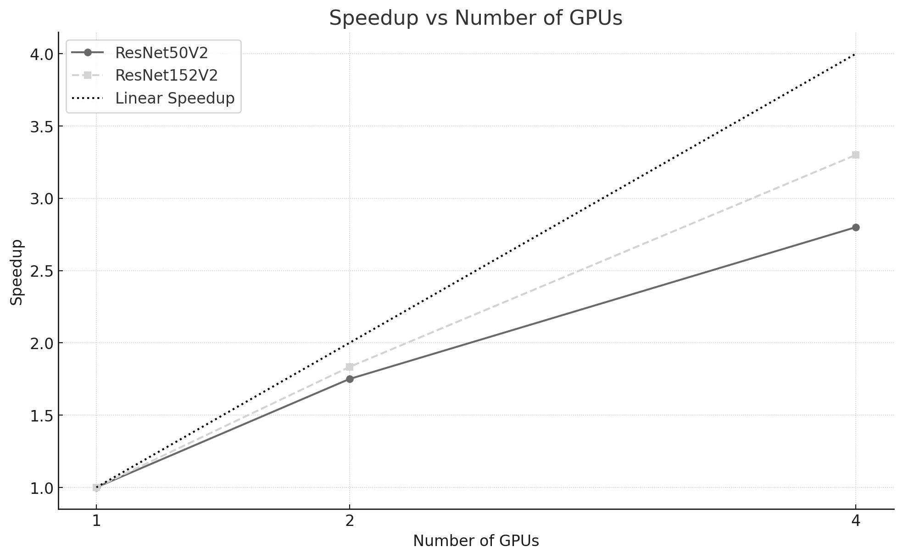

Figure 10.14 **–** Speedup achieved by each model as a function of the number of GPUs. The dashed line represents ideal linear speedup.

#### Parallel Efficiency

Figure 10.15 compares parallel efficiency across GPU counts. ResNet152V2 sustains higher efficiency as the number of GPUs increases, which is consistent with a higher compute-to-communication ratio: more computation per step helps amortize the fixed coordination costs introduced by synchronous training.

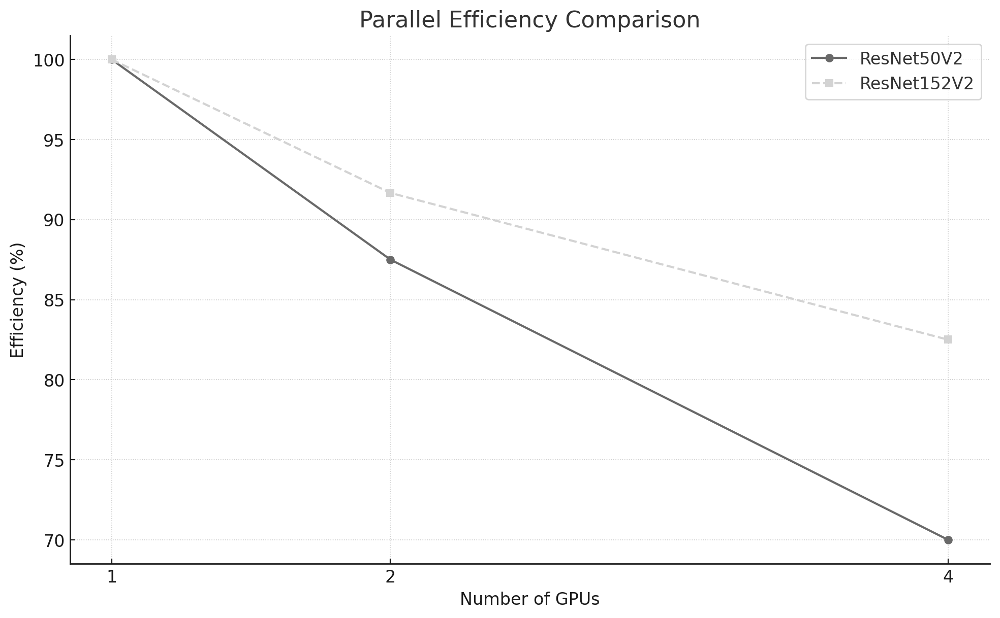

Figure 10.15 **–** Parallel efficiency for each model. ResNet152V2 sustains higher efficiency, indicating better scaling behavior with increasing GPU counts.

Task 10.7 – Comparing Parallel Training Performance Across Model Sizes

In this task, you will perform a comparative analysis of parallel training behavior across two models of different complexity: ResNet50V2 and ResNet152V2.

Using the results obtained in the previous tasks, reproduce the combined plots presented in Figures 10.12–10.15, including:

- epoch time versus number of GPUs,

- global training throughput,

- speedup relative to the single-GPU baseline,

- parallel efficiency.

Ensure that both models are represented in each plot to enable direct comparison.

Present your conclusions as a short slide deck including:

*Slide 1 — Absolute Performance*

- Why is ResNet152V2 consistently slower than ResNet50V2?

*Slide 2 — Scaling Behavior*

- Why does ResNet50V2 achieve higher absolute throughput?

- Why does ResNet152V2 often show better parallel efficiency?

*Slide 3 — Generalization*

- How does model size influence the balance between computation and synchronization overhead?

- Under what conditions would you expect multi-GPU parallelism to be most effective?

Avoid chronological descriptions. Focus on extracting general rules that apply beyond these specific experiments

#### **Looking Ahead**

The single-node experiments in this chapter provide a first practical intuition about multi-GPU training: parallelism reduces computation time, but introduces synchronization overheads that limit ideal scaling. In the following chapters, the same principles will reappear in more demanding settings. Input pipelines will become more prominent, communication will extend beyond a single node, and performance will increasingly depend on careful hardware–software co-design.

The results in this chapter illustrate a recurring pattern: parallel execution is easy to enable, but difficult to reason about. Correct execution should therefore be treated as a starting point for analysis, not as evidence of effective scaling.

In Chapter 11 we shift the focus to optimizing single-GPU training in PyTorch. In Chapter 12 we revisit scaling using multi-node execution with Distributed Data Parallel (DDP), where interconnect characteristics and communication patterns become central to performance.

##  Key Takeaways from Chapter 10

- This chapter introduced the fundamental concepts of parallel training for neural networks through a set of controlled and reproducible experiments. Rather than focusing on performance optimization, the emphasis was placed on developing intuition about how training workloads behave as parallel resources are introduced.

- The comparison between CPU and GPU execution highlighted the decisive role of hardware acceleration in modern deep learning, reinforcing the idea that specialized architectures are essential to sustain the computational demands of neural network training.

- By extending training from a single GPU to multiple GPUs using synchronous data parallelism, we observed that parallel execution does not automatically translate into proportional speedup. While additional GPUs reduce computation time per training step, they also introduce synchronization and communication overheads that limit scalability.

- These observations revisit Foundational Performance Principle \#1—introduced in Chapter 5—from the perspective of deep learning training: acceleration becomes effective only when the computational workload is large enough to amortize fixed overheads. They also revisit Foundational Performance Principle \#2—introduced in Chapter 6—showing how performance emerges from the interaction between framework-level software abstractions and the capabilities of the underlying hardware.

- The use of TensorFlow’s MirroredStrategy demonstrated how modern frameworks can significantly lower the entry barrier to parallel training, enabling users to explore multi-GPU execution with minimal code changes. At the same time, this abstraction makes it clear that simplicity at the programming level does not eliminate fundamental system-level constraints.

- Finally, the experiments showed that model size plays a critical role in parallel training behavior. Larger models tend to mask communication overheads more effectively, while smaller models expose synchronization costs more clearly—an observation that will reappear in more advanced scaling scenarios.

- This chapter establishes the conceptual foundation for the next stages of the book. Chapter 11 will focus on improving efficiency within a single node by addressing data pipelines, precision, and execution overheads, while Chapter 12 will extend parallel training to fully distributed environments using PyTorch and Distributed Data Parallel.

[^1]: https://www.cs.toronto.edu/~kriz/cifar.html

[^2]: Newer versions of TensorFlow (2.10+) have improved the distributed training API, making it easier to use. For our case of multi-GPU training on a single node, tf.distribute.MirroredStrategy remains the recommended option, but it is now even simpler to use with Keras. For example, to list available devices, we can directly use tf.config.list_physical_devices('GPU')

[^3]: https://jhui.github.io/2017/03/07/TensorFlow-GPU/

[^4]: https://arxiv.org/pdf/1909.02061
