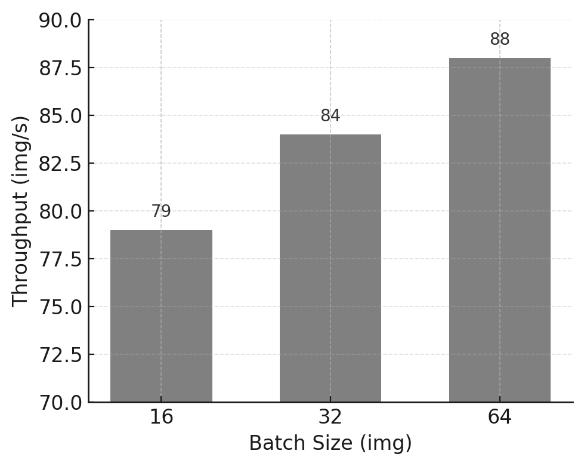
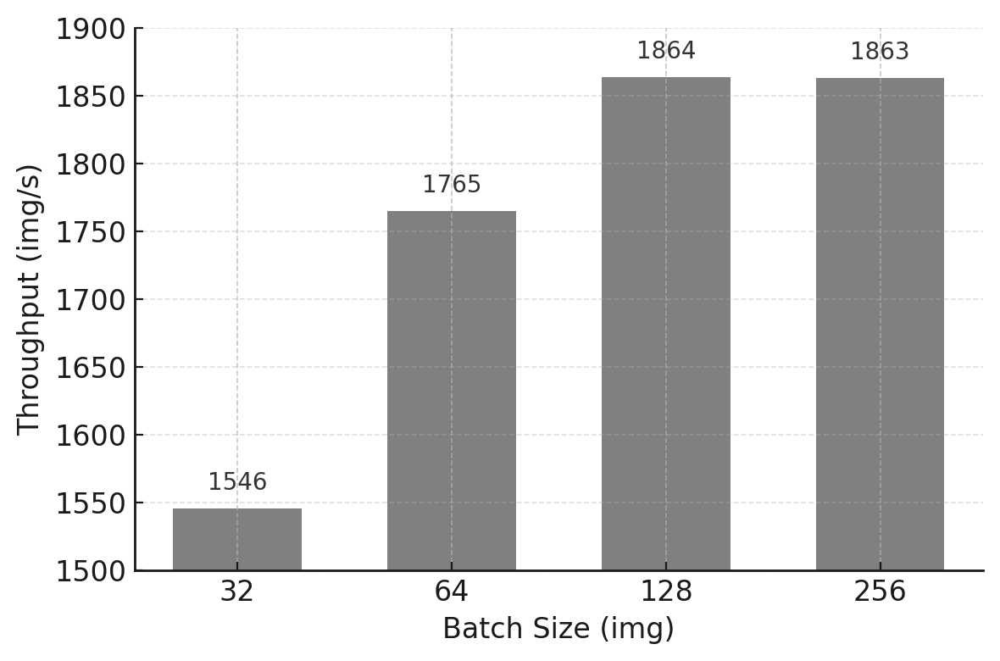
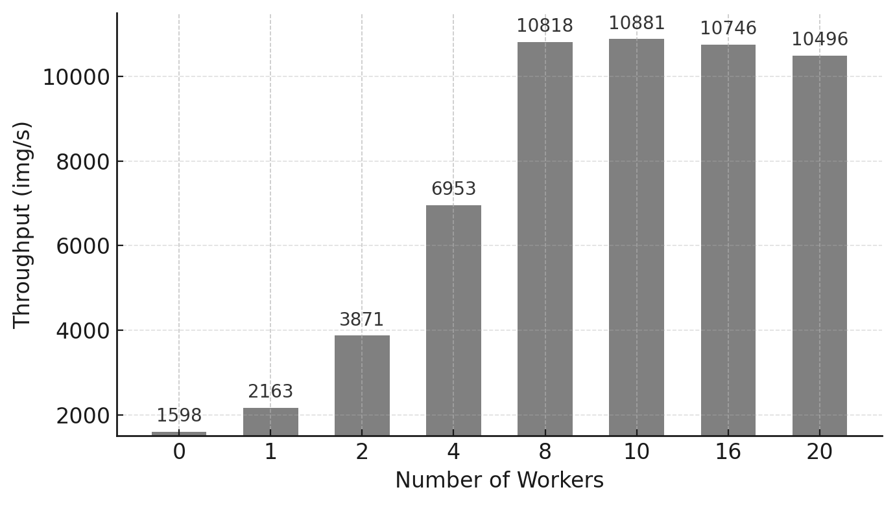
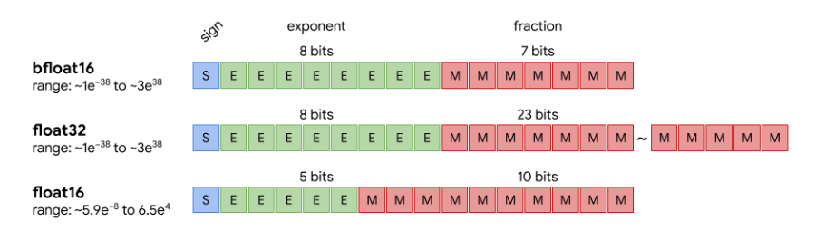

# Practical Guide to Efficient Training with PyTorch

After exploring parallel training strategies using TensorFlow, we now turn our attention to PyTorch, the deep learning framework most widely adopted in academic research and cutting-edge AI development.

##  Introduction

This chapter is not about applying isolated performance optimizations. Its goal is to help the reader develop a systematic way of reasoning about training performance on modern GPU-based systems.

Throughout the chapter, performance is analyzed using a pipeline perspective, where a training iteration is composed of multiple stages such as data loading, data transfer, GPU computation, and runtime overhead.

At any given point, overall throughput is determined by the slowest stage of this pipeline, commonly referred to as the bottleneck.

The practical tasks in this chapter are intentionally structured to expose different bottlenecks and to show how performance optimizations shift the limiting factor from one stage to another.

Rather than searching for a single “best configuration,” the objective is to understand:

- *why a given optimization is effective,*

- *under which conditions it matters,*

- *and when it becomes irrelevant.*

By the end of this chapter, the reader should be able to analyze training performance as a reasoning process based on *bottlenecks, balance, amortization, and latency hiding*, rather than as a collection of independent tuning tricks.

In practice, many inefficient training pipelines remain in production not because they fail, but because their cost is not immediately visible. When software creation is cheap and hardware is powerful, inefficiencies can persist unnoticed. This chapter addresses that form of cost blindness by making performance behavior explicit through measurement.

##  Illustrative Case Study

This chapter is structured around a concrete and reproducible case study that serves as a controlled experimental laboratory for exploring training performance in PyTorch. Rather than focusing on model accuracy or algorithmic innovation, the objective of this case study is to observe, measure, and reason about the behavior of real training workloads under different configurations.

To achieve this, we deliberately constrain the scope of the experiments while preserving the structural characteristics of realistic image classification tasks. The datasets, models, and training code introduced in this section form the foundation for all subsequent experiments in this chapter, and their careful design is essential to ensure meaningful and interpretable performance results.

### Custom Datasets

To support systematic experimentation, we created two custom datasets derived from ImageNet, with all images resized to a fixed resolution of 224×224 pixels. This choice preserves the memory access patterns and computational characteristics of common computer vision workloads, while allowing us to control execution time and resource usage.

The two datasets differ in size and are intentionally designed to support different experimental goals.

#### tiny-224

The tiny-224 dataset is a reduced version of ImageNet containing 500 images per class across 200 classes, for a total of approximately 100,000 images. It is sufficiently large to exhibit stable training behavior and meaningful throughput measurements, while remaining manageable in terms of runtime on academic supercomputing infrastructures.

This dataset is primarily used in experiments where steady-state performance and scalability trends are of interest.

#### micro-224

For rapid experimentation, debugging, and pipeline analysis, we introduce a smaller dataset named micro-224, containing roughly one-eighth the number of samples of tiny-224. Its reduced size makes it ideal for short training runs where the goal is to isolate performance effects rather than to train a high-quality model.

In particular, micro-224 is used extensively to expose pipeline inefficiencies and to validate configuration changes before moving to heavier workloads.

#### **Dataset Folder Structure**

Both datasets follow a standard folder-based organization commonly used in image classification tasks:

    /Chapters.11-12
    └── datasets
        ├── micro-224
        │   ├── train
        │   └── val
        └── tiny-224
            ├── train
            └── val

The datasets are distributed as a compressed archive named Chapters.11-12.tar.gz, which is provided by the instructor. After extraction using:

    tar -xzf Chapters.11-12.tar.gz

the datasets are ready for immediate use in the hands-on experiments.

### Models: ViT and Lightweight Custom Model

In addition to varying dataset size, this chapter deliberately employs two different neural network models with contrasting computational characteristics. This dual-model approach enables controlled experiments in which performance bottlenecks can be isolated and studied systematically.

#### Vision Transformer (ViT)

The primary model used in this chapter is the Vision Transformer (ViT), a modern architecture that applies transformer-based sequence modeling to image classification. Images are split into fixed-size patches (e.g., 16×16 pixels), flattened, and treated as tokens in a sequence, in a manner analogous to natural language processing models.

In our experiments, we use the ViT-H/14 variant (with 14×14 patch size and "H" indicating the large model configuration), which contains approximately 600 million parameters. This makes it representative of contemporary large-scale deep learning models, including those used in large language models, while remaining tractable for hands-on experimentation on a supercomputer.

The model is obtained from the Hugging Face Hub (introduced in Chapter 13) and instantiated via the transformers library. Although a detailed architectural description is beyond the scope of this book, ViT-H/14 is well suited for exploring advanced performance techniques such as mixed precision, compilation, and data parallelism.

#### Custom Lightweight Model (custom_model)

To complement the heavyweight ViT model, we also introduce a lightweight, synthetic neural network designed specifically for performance analysis. This model is a configurable multilayer perceptron (MLP) implemented in PyTorch as a subclass of torch.nn.Module.

The model internally flattens the image input and processes it through a sequence of fully connected (Linear) layers and ReLU activations, concluding with a classification output layer of n_classes neurons.

By avoiding architectural complexity, this model allows us to isolate and study aspects such as data loading efficiency, CPU–GPU interaction, and pipeline balance without being dominated by GPU computation.

Despite its simplicity, the model remains nontrivial, with approximately 400 million parameters. In serial execution, it achieves an epoch time of roughly 0.40 seconds, compared to approximately 1.63 seconds for ViT-H/14, providing a useful contrast in computational intensity.

The implementation is provided in the file custom_model.py in the accompanying GitHub repository.

    from typing import List
    import torch.nn as nn

    class MyCustomModel(nn.Module):
        def __init__(
            self,
            n_classes: int = 200,
            resolution: int = 64,
            intermidiate_dimensions: List[int] = [8192, 4096, 2048, 1024, 512, 256, 128, 64],
        ):
            super().__init__()
            self.n_classes = n_classes
            self.resolution = resolution
            self.intermidiate_dimensions = intermidiate_dimensions

            # Build model
            layer_dims = [resolution * resolution] + intermidiate_dimensions + [n_classes]
            layers = []
            for input_dim, output_dim in zip(layer_dims[:-1], layer_dims[1:]):
                layers.append(nn.Linear(in_features=input_dim, out_features=output_dim))
                if output_dim != n_classes:
                    layers.append(nn.ReLU())

            self.model = nn.ModuleList(layers)

        def forward(self, x):
            for layer in self.model:
                x = layer(x)
            return x

### Code Walkthrough: The train.py Script

All experiments in this chapter are driven by a single, configurable training script named train.py, available in the public GitHub repository of this book. The script is designed to support controlled and reproducible experimentation, allowing individual parameters to be modified while keeping the overall execution structure constant.

The script enables the user to vary:

- Model selection: custom model or ViT-H/14

- Dataset choice

- Batch size

- Precision mode: fp32, fp16, or bf16

- Optimizer: SGD, Adam, or AdamW (although this is not the focus of this chapter)

- Optional compilation via torch.compile

The script is typically launched through a SLURM batch job, reinforcing good HPC practice and ensuring that all experiments are executed under controlled resource allocation.

Rather than reproducing the full code here, we highlight its key structural components and their role in performance analysis.

#### **Library Imports and Configuration**

    import os
    import time
    import torch
    from sklearn.metrics import accuracy_score
    from torch import autocast
    from torch.nn import CrossEntropyLoss
    from torch.optim import SGD, Adam, AdamW
    from torch.utils.data import DataLoader
    from torchvision.models import resnet, vision_transformer

This section imports standard libraries (os, time), the core PyTorch modules, and additional components such as autocast (used for mixed precision), predefined models, optimizers, and the accuracy metric from sklearn.

#### **Main Function Setup**

    def main(args):
        device = torch.device("cuda" if torch.cuda.is_available() else "cpu")
        use_amp = True if args.mixed_precision else False

The script defines a main() function that initializes the computing device, defaulting to GPU if available. It also sets whether automatic mixed precision (AMP) should be used, based on the user's arguments.

#### **Dataset and DataLoader Construction**

    train_ds = DatasetFolder(...)
    valid_ds = DatasetFolder(...)

    train_dl = DataLoader(...)
    valid_dl = DataLoader(...)

The datasets are constructed by reading images from disk using a folder-based structure. The DataLoader objects wrap the datasets to provide efficient batching, parallelism (num_workers), and shuffling.

In PyTorch, the Dataset handles data access and preprocessing, while the DataLoader orchestrates the delivery of mini-batches to the model. Together, these components optimize the input pipeline to minimize idle GPU time and ensure continuous data flow during training—an aspect we explore in depth later in this chapter.

#### **Model Instantiation**

    if args.model_name == "custom":
        model = MyCustomModel(...)
    else:
        model = vision_transformer.vit_h_14(...)

Depending on the argument passed at runtime, the script builds either a custom MLP model (defined in custom_model.py) or the ViT-H/14 model from torchvision.models.vision_transformer. In both cases, the model is instantiated with the appropriate number of output classes.

#### **Compilation, Device Setup and Optimizer**

    model.to(device)
    if args.compile:
        model = torch.compile(model, mode="reduce-overhead")
    optimizer = ...
    criterion = CrossEntropyLoss()

The model is moved to the selected device (usually GPU). If compilation is requested, torch.compile() is used to enable JIT optimization, potentially accelerating execution. The optimizer is instantiated based on user selection, and the loss function used is cross-entropy, which is appropriate for multi-class classification problems.

#### **Training Loop**

    for epoch in range(1, args.num_epochs + 1):
        model.train()
        for iteration, (inputs, labels) in enumerate(train_dl):
            ...

The core of the training logic is contained within a loop over epochs and iterations. In each iteration:

- Data is transferred to the GPU.

- A forward pass is executed, potentially within an autocast context for mixed precision.

- The loss is computed and used to perform backpropagation.

- The optimizer updates the model’s parameters.

- Logging is performed every few iterations, depending on the iteration_logging setting.

This structure allows for systematic experimentation and easy monitoring of training progress.

#### **Validation Loop** 

    if epoch % args.epochs_eval == 0 or epoch == args.num_epochs:
        model.eval()
        with torch.no_grad():
            ...

A basic validation step is included to monitor model accuracy. Evaluation is triggered periodically (every epochs_eval epochs) or at the final epoch. During evaluation, the model is switched to evaluation mode with model.eval() (which disables dropout and batch normalization), and gradient computations are disabled using torch.no_grad() to improve efficiency.

Although validation techniques are not covered in depth in earlier chapters, we include here a minimal self-contained approach that computes prediction accuracy using sklearn.metrics.accuracy_score.

#### **Final Logging and Reporting**

    full_training_time = time.time() - ft0
    report = report_memory()
    log("Training finished!")
    log(f"Training throughput: ...")
    log(report)

Once training is complete, total wall-clock time is calculated, average throughput is reported, and memory usage is logged using a helper function. These metrics are essential for analyzing the performance of different configurations, especially in HPC environments.

These measurements also highlight an important methodological point: meaningful performance comparisons require steady-state behavior. Initial iterations often include one-time costs such as memory allocation, kernel compilation, or runtime setup. Excluding these effects is essential to correctly reason about throughput and to assess whether optimizations genuinely reduce recurring overheads.

#### Supporting Modules: utils.py and dataset.py

The training script is complemented by two support modules, which promote modularity and clarity:

- utils.py contains reusable functions for logging, memory usage reporting, and argument parsing. The get_args() function gathers training configurations such as model type, batch size, and precision mode, while unified logging ensures consistent output formatting across experiments.

- dataset.py defines dataset handling logic. It includes the custom DatasetFolder class, which organizes image files by class and returns image-label pairs. It also provides two collator functions:

  - MyCustomCollator, used for grayscale input in the custom MLP model.

  - RGBCollator, used for RGB inputs required by models like ViT and ResNet.

Both collators handle preprocessing tasks like resizing and tensor conversion, enabling efficient batch assembly before feeding the data into the model.

Together, these modules abstract low-level functionality, keeping train.py focused on high-level training logic while still being flexible enough to support varied experimental needs.

##  Setting up for Experiment Execution

To keep this hands-on chapter focused on platform performance rather than algorithmic accuracy, the exercises are designed so that all training runs can be configured by modifying only the SLURM job scripts. In practice, this means that the hyperparameters and execution settings used in each experiment are passed as command-line arguments, allowing students to reproduce the full set of experiments without editing the Python source code.

This approach supports an essential HPC practice: controlled experimentation. By keeping the training code constant and varying a small set of parameters, we can attribute observed performance changes to specific causes and compare results across runs in a reproducible way. Students are, of course, free to modify the Python scripts if they wish; all code is available in the GitHub repository accompanying this book.

### Python code outputs

To facilitate experimentation and reliable result tracking, the training script is instrumented to print key configuration details and performance metrics to standard output during execution. A typical example is shown below:

    Current hostname: as01r3b19
    INFO - ############# Config #############
    INFO - ### mixed_precision: None
    INFO - ### batch_size: 32
    INFO - ### eval_batch_size: 32
    INFO - ### num_workers: 0
    INFO - ### num_epochs: 5
    INFO - ### epochs_eval: 5
    INFO - ### iteration_logging: 500
    INFO - ### model_name: vit
    INFO - ### intermidiate_dimensions: None
    INFO - ### pretrained: False
    INFO - ### compile: False
    INFO - ### optimizer: adamw
    INFO - ### learning_rate: 0.0005
    INFO - ### dataset: /gpfs/<path>/datasets/micro-224
    INFO - ### resolution: 224
    INFO - ### Device: cuda
    INFO - ### AMP Enabled: False
    INFO - ### Total number of parameters 631021000
    INFO - ### Total training samples (batches): 12480 (390)
    INFO - ### Total validation samples (batches): 9984 (312)
    INFO - ##################################
    INFO - [EPOCH: 1] Starting training loop...
    INFO - [EPOCH: 1] Training throughput: 78.153 imgs/s
    	   .
               .
               .
    INFO - [EPOCH: 5] Accuracy: 0.031
    INFO - Training finished!
    INFO - Complete training Time: 826 s 
    INFO - Training throughput:    344 imgs/s
    INFO - GPU memory reserved:    28 GB

The first part of the output confirms the configuration passed to the script, making it easy to verify that the SLURM job file was correctly set up. During training, throughput is reported periodically, and at the end of the run the script prints three essential metrics:

- Complete training time: total wall-clock time for the entire training process.

- Training throughput: average number of images processed per second during training.

- GPU reserved memory: amount of GPU memory reserved by PyTorch’s caching allocator.

Note that *reserved* memory is not necessarily equal to the memory actively used by tensors (*allocated* memory). PyTorch may reserve additional memory to reduce fragmentation and speed up future allocations. For consistent comparisons, the key point is to measure the same metric across runs.

It is common practice to exclude the first epoch when computing average throughput. Initial epochs often include one-time overheads such as model initialization, memory allocation, and (in some experiments) compilation-related setup. For this reason, subsequent experiments should treat throughput measured after the warm-up phase as the primary performance indicator.

### SLURM Job Submission Scripts

As mentioned above, the experimentation process in this chapter is controlled by modifying the SLURM batch script, without requiring changes to the Python training code. This section highlights the structure of the job file and explains how it enables systematic parameter sweeps.

#### Job Directives 

    #SBATCH --job-name NumWorkers
    #SBATCH --chdir .
    #SBATCH --output ./results/R-%x.%j.out
    #SBATCH --error ./results/R-%x.%j.err

These directives provide SLURM with basic information about the job:

- --job-name: Assigns a human-readable name to the job (NumWorkers) for easier identification.

- --chdir: Sets the working directory where the job will execute.

- --output and --error: Redirect standard output and error streams to files located in the ./results folder. The %x and %j placeholders automatically insert the job name and job ID, respectively.

#### Resource Allocation

    #SBATCH --nodes 1                   
    #SBATCH --ntasks-per-node 1         
    #SBATCH --gres gpu:1                
    #SBATCH --cpus-per-task 20          
    #SBATCH --time 02:00:00      
    #SBATCH --account <account>
    #SBATCH --qos acc_debug
    #SBATCH --exclusive

This block defines how computational resources are allocated:

- --nodes=1: requests one compute node.

- --ntasks-per-node=1: allocates a single task; here, this corresponds to one invocation of one training process.

- --gres=gpu:1: reserves one GPU for this task.

- --cpus-per-task=20: allocates 20 CPU cores to the task, useful especially for multi-threaded data loading.

- --time=02:00:00: sets a maximum runtime of 2 hours.

- --account and --qos: specify the user project and queue.

- --exclusive: ensures the node is not shared with other jobs.

#### Environment Setup

    module purge
    module load singularity

These commands reset the environment and load Singularity, which is used to run the training code inside a container.

#### Experiment Configuration Variables

    MODEL=custom             # --model_name: custom | vit 

    DS=./datasets/tiny-224   # --dataset: tiny-224 | micro-224
    EPOCHS=5                 # --num_epochs
    BS=10                    # --batch_size & --eval_batch_size
    NW=0                     # --num_workers
    OPTIM=sgd                # --optimizer 
    LOG_ITER=500             # --iteration_logging
    EPOCHS_EVAL_FREQ=5       # --epochs_eval

These shell variables define the training configuration and will be passed as arguments to the Python script. Their purpose is summarized below:

- MODEL: model to be used, either custom or vit.

- DS: path to the training dataset, such as micro-224 or tiny-224.

- EPOCHS: number of training epochs (always set to 5 for these experiments).

- BS: batch size for both training and validation phases.

- NW: number of DataLoader workers in PyTorch.

- OPTIM: optimizer to be used. Options include sgd, adam, or adamw, though for consistency in this chapter we default to sgd.

- LOG_ITER: controls how often training metrics are logged.

- EPOCHS_EVAL_FREQ: frequency at which validation is performed, in number of epochs.

Additionally, optional arguments for mixed precision and model compilation can be easily enabled later, as shown below:

    # To enable when required
    #    --mixed_precision bf16 \  # bf16 or fp16 and default fp32
    #    --compile \

#### Command Assembly

    PYTHON_FILE=./train.py
    PYTHON_ARGS="--model_name $MODEL \
                 --dataset $DS \
                 --num_epochs $EPOCHS \
                 --batch_size $BS \
                 --eval_batch_size $BS \
                 --num_workers $NW \
                 --optimizer $OPTIM \
                 --iteration_logging $LOG_ITER \
                 --epochs_eval $EPOCHS_EVAL_FREQ \
                "
    export CMD="python3 $PYTHON_FILE $PYTHON_ARGS"

This segment constructs the Python command dynamically, using the variables previously defined. By exporting the entire command string into CMD, it can be executed later inside the container runtime using bash -c. This indirection ensures that environment variables are expanded at runtime, not prematurely by the shell.

#### Container Configuration

    SINGULARITY_CONTAINER=/gpfs/apps/MN5/ACC/SINGULARITY/SRC/images/nvidiaPytorch24.07
    SINGULARITY_ARGS=" --nv  $SINGULARITY_CONTAINER"

Here, we specify the container image to be used for training. The --nv flag is critical, as it allows the container to access the host system’s NVIDIA drivers and GPU devices. We use an official container from NVIDIA’s NGC catalog, preloaded with PyTorch, CUDA, cuDNN, and NCCL, ensuring compatibility and performance.

The container is built using Singularity from an NGC Docker image. In MareNostrum, essential directories such as /home, /scratch, and /projects are automatically mounted into the container, making it straightforward to access input datasets and save results.

#### Job Launch with srun and Singularity

    SRUN_ARGS="--cpus-per-task $SLURM_CPUS_PER_TASK --jobid $SLURM_JOB_ID"
    srun $SRUN_ARGS bsc_singularity exec  $SINGULARITY_ARGS bash -c "$CMD"

This final part launches the job:

- srun: Executes the job within the SLURM environment, allocating the resources specified earlier.

- bsc_singularity exec: A site-specific wrapper used at MareNostrum to execute commands inside a Singularity container.

- bash -c "\$CMD": Runs the Python training command inside the container. Using bash -c ensures that shell variables such as \$CMD are expanded correctly at the time of execution.

This modular and containerized setup provides full control over experimental parameters while maintaining consistency across different runs.

### Experimental Hygiene Checklist

Before interpreting performance results, it is essential to ensure that experiments are conducted under controlled and comparable conditions. This includes using identical training code, varying only one parameter at a time, accounting for warm-up effects, and reporting consistent metrics across runs. Adhering to these basic principles is a prerequisite for meaningful performance analysis in HPC environments.

##  Tuning the Maximum Batch Size Hyperparameter

### Motivation: Why Does Batch Size Matter?

Batch size is one of the most influential hyperparameters in deep learning training, but its impact extends well beyond model convergence or optimization dynamics. From a systems perspective, batch size acts as a pressure knob that simultaneously stresses GPU memory capacity, computational throughput, and the balance of the training pipeline.

On GPU-based systems, increasing the batch size often improves throughput by allowing the accelerator to process more data per iteration. Larger batches help amortize fixed per-iteration costs—such as kernel launches, synchronization points, and memory access overheads—over a greater number of samples, pushing the GPU closer to its peak efficiency.

At the same time, batch size directly determines memory consumption. Activations, gradients, and intermediate tensors scale approximately linearly with batch size, and once GPU memory capacity is exceeded, training fails with an out-of-memory (OOM) error. For this reason, identifying the maximum viable batch size—the largest batch that fits in memory—is a fundamental step in performance analysis.

Importantly, batch size should not be viewed solely as a machine learning hyperparameter. In practice, it serves as a diagnostic tool that reveals the physical limits of the hardware before more advanced optimizations are attempted.

### Methodology: Empirical Search

To determine the maximum viable batch size, we perform a sequence of short training runs in which the batch size is progressively doubled, starting from a conservative value. This empirical approach reflects common practice in real-world training workflows, where theoretical memory models are often insufficient to capture framework overheads and runtime behavior.

To keep execution times manageable while preserving realistic memory and compute characteristics, we use the micro-224 dataset and the Vision Transformer (ViT) model. ViT architectures are particularly suitable for this experiment due to their high memory footprint, making memory limits observable even on high-end GPUs.

The experiment is automated by modifying only the batch size parameter in the SLURM submission script and launching separate runs with batch sizes of 16, 32, 64, and 128. Training is considered successful if the run completes without errors. Once a run terminates with a CUDA out-of-memory error, the previous batch size is identified as the maximum viable value.

A typical OOM error reported in the standard error log appears as follows:

    torch.OutOfMemoryError: CUDA out of memory. Tried to allocate 482.00 MiB. GPU 0 has a total capacity of 63.43 GiB of which 117.50 MiB is free. Including non-PyTorch memory, this process has 63.30 GiB memory in use. Of the allocated memory 62.35 GiB is allocated by PyTorch, and 298.30 MiB is reserved by PyTorch but unallocated.

This message confirms that the physical memory limit of the GPU has been reached and serves as a clear stopping criterion.

### Experimental Results

Table 11.1 summarizes the training time, throughput, and GPU memory usage observed for each batch size when training the ViT model on the micro-224 dataset.

| **Batch Size (img)** | **Complete Training Time(s)** | **Throughput (img/s)** | **Memory (GB)** |
|:--:|:--:|:--:|:--:|
| **16** | 901 | 79 | 14 |
| **32** | 764 | 84 | 24 |
| **64** | 731 | 88 | 46 |
| **128** | \- | \- | OOM |

Table 11.1 – Maximum batch size experiment for ViT on the micro-224 dataset.

Figure 11.1 – Training throughput vs batch size for the ViT model on micro-224.

As expected, throughput increases significantly when moving from batch size 16 to 64, reflecting better GPU utilization and amortization of fixed overheads. Attempting to train with batch size 128 fails due to insufficient GPU memory, establishing batch size 64 as the practical upper bound for this configuration.

This behavior can also be interpreted through the roofline model introduced in Chapter 5. Increasing the batch size improves data reuse across computations, effectively increasing arithmetic intensity. As a result, the workload moves away from a bandwidth- or overhead-limited regime and closer to a compute-bound regime, where the GPU’s peak throughput can be more effectively utilized. In this sense, batch size acts not only as a memory constraint, but also as a mechanism for shifting the execution point toward a more favorable region of the roofline.

Memory usage exhibits near-linear scaling with batch size, a common behavior in feedforward architectures such as Vision Transformers. This observation provides a useful heuristic for estimating feasible batch sizes in future experiments.

More broadly, this experiment illustrates an important performance lesson: batch size exposes the physical constraints of the system. Before applying advanced optimizations or scaling to multiple GPUs, it is essential to understand where these limits lie and how close the workload operates to them.

**Note to students for Tasks 11.1-11.7**

Tasks 11.1-11.7 are designed to assess not only your ability to run experiments, but your ability to reason about performance using concepts such as pipelines, bottlenecks, balance, and amortization.

Task 11.1 – Find the Maximum Viable Batch Size

Run the ViT model on the micro-224 dataset using different batch sizes.

For each batch size, report:

- total training time,

- training throughput (images/s),

- GPU memory usage.

Identify the maximum viable batch size, defined as the largest batch size that can be executed without running out of GPU memory.

In your analysis:

- Describe how training throughput evolves as batch size increases.

- Explain the observed behavior in terms of amortization of per-iteration overheads and GPU memory constraints.

- Clearly state why the batch size limit is a hardware-imposed constraint rather than a modeling choice.

Then, critically evaluate the result:

- Is the maximum viable batch size necessarily the best choice for maximizing training throughput? Justify your answer.

- At the point where the out-of-memory error occurs, which system resource is the limiting factor: compute capability, memory capacity, or memory bandwidth?

Summarize your conclusions in a single slide, clearly distinguishing between:

- the batch size that maximizes hardware utilization, and

- the batch size that merely reaches the memory limit.

These earlier experiments reinforce a key performance lesson that recurs throughout this book: GPU acceleration becomes advantageous only when the computational workload is sufficiently large to amortize data transfer, memory allocation, and setup overheads. Just as small CUDA kernels fail to benefit from GPU acceleration due to memory and launch overheads, small or poorly fed training batches prevent GPUs from reaching high utilization.

These results demonstrate that increasing batch size beyond a certain point provides diminishing or even negative returns. Without explicit measurement, such inefficiencies are easy to miss. This is a common manifestation of cost blindness: resources are consumed without proportional gains in throughput or efficiency.

After identifying the maximum viable batch size imposed by GPU memory constraints, we now shift focus from memory limitations to *pipeline balance*.

In the next task, the model is intentionally simplified so that GPU computation becomes relatively inexpensive. This allows us to observe what happens when increasing batch size no longer improves throughput.

This transition highlights a key idea: once memory constraints are removed, other stages of the pipeline may become the dominant bottleneck.

##  Efficient Data Handling: Preventing DataLoader Bottleneck

In many training workloads, model computation is not the only—or even the primary—factor determining overall performance. Data loading, preprocessing, and host-side operations can significantly limit throughput, particularly when the model itself is lightweight or highly optimized.

From a system perspective, neural network training can be viewed as a pipeline composed of multiple stages, typically involving CPU-based data preparation and GPU-based computation. These stages may partially overlap, but the overall training speed is ultimately constrained by the slowest stage in the pipeline. When one stage becomes sufficiently fast, previously hidden costs may emerge and dominate execution time.

Although the symptoms may resemble overhead-related inefficiencies, *the dominant issue in this section is not the amortization of fixed per-iteration costs, but an imbalance in the training pipeline*: data preparation on the CPU cannot keep up with GPU computation, and the accelerator becomes intermittently idle.

In this section, we deliberately use a lightweight model to expose the impact of data handling on training performance. This controlled scenario allows us to observe how insufficient data pipeline parallelism leads to GPU underutilization, and how adjusting data loading parameters can restore balance and improve sustained throughput.

### Observing the Bottleneck with a Lightweight Model

The PyTorch DataLoader plays a key role in this aspect: it manages access to the dataset and provides minibatches to the training loop. This allows us to process large datasets incrementally—one minibatch at a time—rather than loading the entire dataset into memory.

Beyond serving batches, the DataLoader offers additional functionality such as shuffling data, applying transformations, and, crucially, parallelizing data loading and preprocessing through the num_workers parameter. Each worker is a separate subprocess that loads and transforms samples in parallel, leveraging available CPU cores.

Increasing num_workers does not make the model faster per se; it ensures that data preparation overheads are hidden behind computation. This scenario is referred to as a DataLoader bottleneck, and it can severely hinder training performance, even on powerful GPUs.

To illustrate this phenomenon in a controlled and manageable way for our lab environment, we switch to a smaller custom model (available as custom_model.py), which can be selected with the MODEL=custom argument in the SLURM script. This model is deliberately chosen for being lightweight in compute, so we can clearly observe the limitations introduced by data loading. We use the micro-224 dataset.

We conduct experiments by running multiple training sessions using different batch sizes—up to 256 images per batch—to assess how throughput scales. Since the custom model is small, GPU memory is not a constraint in this case, allowing us to explore how the throughput behaves under increasing batch sizes without running into out-of-memory (OOM) errors.

To connect the concepts discussed so far with concrete evidence, the following table presents the results of running the same training job with increasing batch sizes:

| **Batch Size (img)** | **Complete Training Time(s)** | **Throughput (img/s)** | **Memory (GB)** |
|:--:|:--:|:--:|:--:|
| **32** | 1204 | 1546 | 3 |
| **64** | 289 | 1765 | 3 |
| **128** | 270 | 1864 | 3 |
| **256** | 269 | 1863 | 3 |

Table 11.2 – Experiment 2 results using the custom model and the tiny-224 dataset: training time, throughput, and memory usage for different batch sizes.

Figure 11.2 – Throughput performance across increasing batch sizes using the custom model on the tiny-224 dataset.

Although memory is not an issue in this case (we remain well within the 64 GB available on the H100 GPU), throughput improvements start to plateau at batch sizes beyond 128. This indicates that the GPU is no longer the bottleneck. In fact, if you connect to a compute node (or even run this on the login node for convenience) and execute nvidia-smi, you will observe that GPU utilization remains unexpectedly low despite using a large batch size.

From a functional perspective, the training job behaves correctly. From a systems perspective, however, it is highly inefficient. This gap between correctness and efficiency is precisely why performance cannot be inferred from code alone, and why measurement is indispensable.

What is causing this underutilization? The answer lies in the CPU-side operations. The GPU is left waiting because the CPU is busy reading images from disk, decoding JPEG files, converting them into tensors, and finally transforming them from RGB to grayscale. All these transformations must be applied one image at a time, and they become the dominant cost when the model is lightweight and fast. For large batch sizes, the time needed to assemble a batch exceeds the time the model takes to process it, meaning that the data pipeline becomes the bottleneck.

The results obtained with the lightweight model reveal a characteristic performance pattern: despite increasing the batch size and observing minimal GPU memory usage, overall throughput quickly saturates and GPU utilization remains low. This behavior indicates that model computation is no longer the dominant cost.

Instead, the training process becomes data-bound. The GPU frequently waits for input batches to be prepared on the host, leaving significant portions of its computational capacity unused. In this regime, further increasing batch size or GPU-side optimizations provides little benefit, as the bottleneck lies upstream in the pipeline.

Task 11.2 – Investigating the DataLoader Bottleneck with a Lightweight Model

Run the lightweight (custom) model on the tiny-224 dataset using increasing batch sizes.

Report:

- training throughput,

- GPU memory usage,

- any available evidence of GPU utilization (if measured).

Analyze the results and:

- Identify whether a throughput plateau appears as batch size increases.

- Determine whether the training process is compute-bound or input-bound.

- Explain the observed behavior from a training pipeline perspective, explicitly identifying which stage becomes the bottleneck and why.

Then, reason about alternative interventions:

- Which stage of the training pipeline is the dominant bottleneck in this experiment?

- Would increasing GPU compute capability (for example, using a faster GPU or adding more GPUs) improve overall training throughput? Justify your answer.

Your explanation should clearly distinguish:

- observable symptoms (e.g., throughput plateau, low GPU utilization), and

- underlying causes (e.g., DataLoader and input pipeline limitations).

Summarize your diagnosis in a single slide, clearly stating:

- what limits performance in this experiment, and

- which types of optimizations would be ineffective under these conditions.

Having identified a DataLoader bottleneck with a lightweight model, the next logical step is to explore how this bottleneck can be mitigated.

The following task focuses on increasing parallelism in the CPU-side data pipeline by varying the number of DataLoader workers.

This experiment demonstrates how performance improves when the *pipeline becomes more balanced*—and why this improvement eventually saturates due to overhead and resource contention.

### Increasing num_workers to Unlock Performance

To mitigate this bottleneck, parallelism must be introduced in the data loading stage itself. In PyTorch, this is achieved by increasing the number of worker processes responsible for loading and preprocessing data batches. By doing so, data preparation can be overlapped with GPU computation, effectively hiding part of the data loading latency and improving pipeline balance.

From a performance principles perspective, this should be understood as a pipeline balancing and latency-hiding strategy rather than an overhead reduction mechanism, since the goal is to prevent the input stage from throttling sustained end-to-end throughput.

As seen in the previous experiment, when training a small neural network such as the custom model provided in this hands-on, the training throughput quickly saturates despite increasing the batch size. This saturation is not due to the model or memory limitations, but rather to a bottleneck in the data loading pipeline. Specifically, the GPU often remains idle, waiting for data batches to be prepared by the CPU. In such scenarios, PyTorch offers a simple yet powerful solution: the num_workers argument in the DataLoader.

In this context, increasing num_workers does not accelerate model computation itself. Instead, it restores balance to the training pipeline by ensuring that data preparation progresses in parallel with GPU execution. Only when these stages advance at comparable rates can sustained performance be achieved.

It is worth noting that, while this optimization significantly improves performance, *it does not constitute hardware–software co-design*: the GPU execution model remains unchanged, and the gains arise purely from better pipeline balance on the host side.

The num_workers parameter allows us to define how many subprocesses are used to load and preprocess data in parallel. By default, and in our previous experiments, num_workers was set to 0, meaning that all data loading was executed in the main process, one batch at a time. This leads to synchronous training, where the model must wait for each batch to be loaded before continuing. The effect of this is particularly pronounced when using a small model (like our custom feedforward network) that processes data very quickly but remains underutilized due to slow input feeding.

To assess the impact of num_workers, we repeated the training with the same batch size (256), progressively increasing the number of workers from 0 to 20. As the table below shows, the difference is remarkable: throughput increases more than 5×, with the optimal performance reached between 8 and 10 workers. Beyond this point, improvements plateau, indicating that the DataLoader is no longer the dominant bottleneck.

| **Number of Workers** | **Complete Training Time(s)** | **Throughput (img/s)** | **Memory (GB)** |
|:--:|:--:|:--:|:--:|
| **0** | 1192 | 1598 | 3 |
| **1** | 237 | 2163 | 3 |
| **2** | 128 | 3871 | 3 |
| **4** | 72 | 6953 | 3 |
| **8** | 47 | 10818 | 3 |
| **10** | 46 | 10881 | 3 |
| **16** | 47 | 10746 | 3 |
| **20** | 48 | 10496 | 3 |

Table 11.3 – Impact of increasing num_workers on training throughput (batch size 256, custom model, tiny-224 dataset).

Figure 11.3 – Training throughput as a function of num_workers. Substantial gains are observed up to 8 workers.

The results are visually summarized in the figure below. We can clearly observe how throughput improves significantly up to 8–10 workers, after which it stabilizes. This indicates that the DataLoader is no longer limiting the training speed, and additional workers provide diminishing returns.

This experiment emphasizes the importance of properly tuning num_workers, especially in computer vision workloads, where each input image often requires expensive preprocessing (e.g., decoding JPEG files, format conversions, transformations). In contrast, text-based applications generally have lighter preprocessing, and the impact of num_workers may be less significant. Although in this case the model is intentionally small, and the bottleneck remains visible, the lesson is clear: ignoring the DataLoader configuration can severely limit training performance—even on the most powerful GPUs.

In summary, the lesson is that as the number of data loader workers increases, throughput improves significantly up to a certain point, reflecting a better overlap between data preparation and GPU computation. Beyond this point, however, performance gains diminish and may even reverse due to increased contention for CPU resources, memory bandwidth, or scheduling overheads.

This behavior highlights an important principle: adding parallelism indiscriminately does not guarantee higher performance. Optimal performance is achieved when the different stages of the training pipeline are balanced, rather than when any single stage is maximized in isolation.

Task 11.3 – Optimizing DataLoaders

Using the lightweight model and a fixed large batch size, repeat the experiment on the tiny-224 dataset while varying the number of DataLoader workers.

For each value of num_workers, report:

- training throughput,

- GPU memory usage.

Present the results using tables and plots.

Then answer explicitly:

1.  Do your results match the behavior discussed earlier in this chapter?

2.  How does training throughput evolve as num_workers increases?

3.  Is there a point where adding more workers no longer improves performance? Identify it.

4.  What value (or range of values) of num_workers would you recommend for future experiments, and why?

In your explanation, explicitly reason in terms of:

- training pipeline balance,

- parallelism versus overhead,

- CPU resource contention.

Finally, go beyond the immediate bottleneck:

- How do you know that increasing num_workers further is no longer beneficial?

- Which system resource becomes the next limiting factor once the DataLoader bottleneck is mitigated?

Summarize your conclusions in a single slide, clearly stating:

- when DataLoader parallelism is effective, and

- why parallelizing beyond that point leads to diminishing returns.

If you have been following the exercises, you have just traversed a clean conceptual arc: from realizing that memory limits do not equate to optimality (Task 11.1), to identifying a clear bottleneck (11.2), and finally relieving it only to uncover the next one (11.3). This is the essence of HPC thinking applied to Deep Learning: bottlenecks are rarely eliminated; they are merely shifted. With this mindset, you are perfectly prepared for Task 11.4, where we will see how a heavier model can make these issues vanish simply through amortization.

The effectiveness of data loading parallelism is inherently workload-dependent. When model computation dominates execution time, data loading latency may be naturally hidden by GPU processing, reducing the impact of additional data loader workers. To illustrate this contrast, we now revisit the same analysis using a heavier model.

### Returning to ViT: When DataLoader Parallelism Is Hidden

Now that we’ve observed how a lightweight model like our custom feedforward network is highly sensitive to DataLoader configuration, let’s return to the Vision Transformer (ViT) model, which will serve as our baseline for the following tasks. As before, we will use the micro-224 dataset to ensure short and manageable training times in the lab environment.

To complete our investigation, we conducted another set of experiments, this time fixing the batch size to 64 and varying the number of DataLoader workers. Table 11.4 summarizes the results.

As shown in the table, increasing the number of workers has minimal effect on throughput. This behavior is explained by the fact that the time required to prepare batches of 64 images is efficiently hidden behind the compute operations of the ViT model. While the GPU is busy processing a batch, the next one is loaded in parallel by the CPU, effectively overlapping computation and I/O.

This scenario is ideal: the GPU remains saturated with work, and the DataLoader operates just fast enough to keep it fed. Although the speed of data loading is still important, the bottleneck is no longer present. Therefore, the training speed does not significantly benefit from additional workers beyond a certain point.

Here, the same principle applies in reverse. Because the computational workload of the ViT model is sufficiently large, data loading overheads are naturally hidden behind computation. The pipeline remains balanced without aggressive tuning, and additional parallelism on the input side yields little benefit.

For the sake of consistency across experiments and to reflect best practices, we will set num_workers = 10 as the default value for all remaining tasks in this chapter.

By repeating the DataLoader experiment with a heavier model, we intentionally change the performance regime. In this new scenario, GPU computation dominates the iteration time, and data loading latency becomes hidden.

This comparison emphasizes that the *effectiveness of an optimization depends on the current bottleneck*, not on the optimization itself.

| **Number of Workers** | **Complete Training Time(s)** | **Throughput (img/s)** | **Memory (GB)** |
|:--:|:--:|:--:|:--:|
| **0** | 824 | 88 | 46 |
| **1** | 701 | 95 | 46 |
| **2** | 701 | 92 | 46 |
| **4** | 701 | 91 | 46 |
| **8** | 702 | 91 | 46 |
| **10** | 702 | 91 | 46 |
| **16** | 702 | 91 | 46 |
| **20** | 703 | 91 | 46 |

Table 11.4 – Impact of num_workers on training performance for the ViT model (batch size 64, micro-224 dataset).

Task 11.4 – Confirming DataLoader Efficiency with ViT

Repeat the num_workers experiment from Task 11.3 using the ViT model on the micro-224 dataset.

For each configuration, report:

- training throughput,

- GPU memory usage.

Then analyze the results by explicitly contrasting them with those obtained for the lightweight model:

- Compare how training throughput evolves with increasing num_workers in both cases.

- Explain why increasing num_workers has a significant effect for the lightweight model but little or no effect when training ViT.

In your explanation:

- Identify the dominant bottleneck when training ViT.

- Explain how latency hiding and longer per-iteration computation change the relevance of DataLoader parallelism.

Explicitly relate your observations to the amortization of overheads principle:

- Why does the same input pipeline overhead become negligible in this case?

- Under what conditions should you expect DataLoader tuning to have little impact on performance?

Summarize your conclusions in a single slide, clearly stating:

- when DataLoader optimization is critical, and

- when it is effectively hidden by computation.

By this point, a key realization should have settled in: bottlenecks are dynamic—they move, and under the right conditions, they disappear. Grasping this nuance is the defining difference between someone who simply uses deep learning frameworks and an engineer capable of designing HPC systems for AI.

Taken together, these experiments demonstrate that training performance is governed by the balance between data handling and computation. Optimizing a single component in isolation merely shifts the bottleneck elsewhere. Sustained performance emerges only when all stages of the training pipeline are aligned in terms of throughput.

This system-level perspective is essential when reasoning about training efficiency. Before applying advanced optimizations or scaling to multiple GPUs, it is crucial to ensure that the underlying pipeline is well balanced. Otherwise, additional computational resources may remain underutilized, leading to disappointing returns.

##  Foundational Performance Principle \#3

Despite careful optimization of the model and the use of powerful accelerators, the measured throughput no longer scales as expected. GPU utilization drops, not because computation is inefficient, but because the accelerator frequently waits for input data.

This behavior reveals a broader performance pattern that cannot be explained at the level of individual kernels or model computation alone. It motivates the introduction of the third Foundational Performance Principle.

### Balanced Pipelines Enable Sustained Performance

High performance in modern AI systems is determined not by the speed of individual components, but by the balance of the entire execution pipeline. Efficient training requires coordinated progress across computation, data movement, data preparation, and host–device interaction.

In practice, inefficient data input pipelines—such as slow data loading, insufficient parallel preprocessing, or poor coordination between CPUs and accelerators—can leave powerful GPUs idle even when the model itself is computationally efficient. Accelerating a single stage of the workflow is insufficient if other stages remain bottlenecks.

*This principle complements overhead amortization* by shifting the focus from reducing the relative cost of fixed expenses to ensuring that no continuously active stage—data preparation, transfers, or host–device coordination—limits sustained end-to-end throughput. It explains why optimizing data pipelines, overlapping computation with data transfers, and ensuring balanced CPU–GPU cooperation are essential to achieving sustained performance in real-world AI workloads and will remain central when we later consider multi-GPU and multi-node training.

##  Mixed Precision and Tensor Cores

So far, we have improved training throughput by tuning execution parameters such as batch size and data loading parallelism, focusing primarily on balancing the training pipeline. In this section, we explore a more fundamental class of optimization—one that directly exploits the numerical and architectural features of modern GPUs.

Mixed precision training is not merely a software-level optimization. It is a hardware-aware design choice that aligns numerical representations with the capabilities of the underlying accelerator. When applied appropriately, it can simultaneously increase throughput and reduce memory consumption, and therefore unlock configurations that were previously infeasible due to memory constraints.

###  Understanding Floating-Point Formats

In deep learning workloads, model parameters, activations, and gradients are represented using floating-point numbers. The choice of numerical format determines not only memory footprint, but also computational throughput and numerical stability.

PyTorch supports several floating-point formats, but three are particularly relevant for GPU-accelerated training:

- float32 (fp32) is the default in PyTorch. It uses 32 bits and offers high numerical precision, making it a safe and robust choice. However, it consumes more memory and is computationally heavier.

- float16 (fp16) uses only 16 bits, enabling faster computation and larger batch sizes. The trade-off is reduced precision and a smaller dynamic range, which can cause instability in some models.

- bfloat16 (bf16) also uses 16 bits, but with the same 8-bit exponent as fp32 and fewer fraction bits. This makes it more stable than fp16 while still benefiting from the speed and memory savings of 16-bit formats.

Figure 11.4 compares the internal structure of these formats and highlights the key trade-offs between precision, dynamic range, and performance.

Figure 11.4 – Visual comparison of bfloat16, float32, and float16. While fp16 sacrifices both exponent and fraction precision, bfloat16 keeps the 8-bit exponent (like fp32) and reduces only the mantissa, preserving a similar dynamic range with reduced precision (Image source: Pragmatic.ml[^1]).

### Mixed Precision Training with AMP

Mixed precision training combines lower-precision arithmetic (fp16 or bf16) for compute-intensive operations—such as matrix multiplications—with higher-precision accumulation where needed to preserve numerical accuracy. This approach is particularly effective on modern GPUs such as the NVIDIA H100, which include Tensor Cores specifically designed to accelerate low-precision matrix operations.

In this experiment, mixed precision is controlled via a command-line argument (--mixed_precision), which can be set to fp16, bf16, or omitted to default to fp32. In the training script (train.py), the forward pass is wrapped inside a with autocast(...) block, making the use of mixed precision explicit yet minimally intrusive.

The practical benefits of AMP include:

- Increased throughput through the use of Tensor Cores.

- Reduced memory consumption, enabling larger batch sizes.

- Minimal impact on model accuracy, particularly when using bf16.

### 

### Experimental Results

We evaluated the impact of mixed precision by training the ViT model on the micro-224 dataset using different numerical formats. Table 11.5 summarizes the observed throughput and memory usage.

| **Precision** | **Batch Size (img)** | **Throughput (img/s)** | **Memory (GB)** |
|:-------------:|:--------------------:|:----------------------:|:---------------:|
|   **fp32**    |        **64**        |           92           |       46        |
|   **fp32**    |       **128**        |           \-           |       OOM       |
|   **fp16**    |        **64**        |          182           |       27        |
|   **fp16**    |       **128**        |          190           |       50        |
|   **bf16**    |        **64**        |          186           |       27        |
|   **bf16**    |       **128**        |          196           |       50        |

Table 11.5 – Performance comparison across precision modes for ViT on micro-224.

Switching from fp32 to bf16 nearly doubles throughput, significantly reduces memory usage, and enables training with larger batch sizes. These gains are primarily driven by the activation of Tensor Cores, which deliver much higher throughput for low-precision matrix operations than standard floating-point units.

From a performance perspective, mixed precision effectively raises the compute ceiling of the GPU by routing key operations—most notably large matrix multiplications—through hardware units that deliver substantially higher throughput at lower precision. This is why the same model and dataset can move from being limited by general-purpose execution efficiency to being primarily constrained by how well the workload exploits these specialized high-throughput paths.

This behavior is a textbook example of hardware–software co-design: performance improves dramatically not because the algorithm changes, but because numerical formats and execution paths are explicitly chosen to match specialized hardware units available on the GPU.

More importantly, these results illustrate a broader performance principle: the largest performance improvements arise when software abstractions are explicitly aligned with hardware design. Tensor Cores provide no benefit unless numerical formats, libraries, and execution frameworks are chosen to exploit them.

Improvements of this magnitude illustrate both the power and the risk of modern accelerators. Hardware can compensate for poor software choices up to a point, masking inefficiencies that resurface at larger scales or higher costs. Without a clear mental model of execution behavior, such gains may encourage premature or unjustified scaling.

For the remaining experiments in this chapter, we use a batch size of 128 and bf16 precision, which provides the best balance between performance, memory efficiency, and numerical stability on the target hardware. Readers interested in further details are encouraged to consult the official PyTorch AMP documentation[^2].

Task 11.5 – Enable Mixed Precision with ViT + micro-224

Run the ViT model on the micro-224 dataset using three precision modes: FP32, FP16, and BF16.

For each configuration, report:

- training throughput,

- GPU memory usage,

- the largest batch size that can be executed without running out of memory.

Analyze the results and:

- Explain how mixed precision affects both memory footprint and training throughput.

- Discuss why mixed precision can increase throughput even when the training algorithm itself remains unchanged.

- Identify which hardware features are being exploited when using FP16 or BF16, and how this relates to modern GPU architectures.

Compare FP16 and BF16 explicitly:

- Comment on any observed performance differences between FP16 and BF16.

- Discuss why BF16 is often preferred in practice despite offering similar throughput to FP16.

Summarize your conclusions in a single slide, clearly stating:

- why mixed precision is an example of hardware–software co-design, and

- under what conditions enabling mixed precision is most beneficial.

By now, it is clear that performance is not a static attribute of the model, but an emergent property of the interaction between model, framework, and hardware. This insight sets the stage for torch.compile(). The reader is now ready to understand why, without altering the model architecture or the hardware specs, torch.compile() achieves speedups simply by restructuring execution—a classic application of hardware-software co-design principles.

##  Torch Compile

Modern deep learning frameworks increasingly rely on compilation techniques to optimize model execution. In PyTorch, torch.compile() enables just-in-time (JIT) compilation of the training step, allowing the framework to fuse operations, reduce overheads, and generate more efficient execution graphs tailored to the target hardware. From a co-design perspective, compilation acts as a mediator between high-level software abstractions and low-level hardware execution, reshaping the program so that it better fits the architectural constraints and capabilities of the target GPU.

Unlike previous optimizations explored in this chapter, compilation-based approaches introduce a non-negligible upfront cost. The compilation process is typically triggered during the first iterations of training and may significantly increase their execution time. As a result, the benefits of compilation depend not only on the achievable speedup, but also on the duration and structure of the training workload.

In this section, we evaluate torch.compile() from a system-level perspective, focusing on the trade-off between initial overhead and sustained throughput. This analysis reinforces the importance of amortization when reasoning about performance optimizations.

The impact of JIT on throughput is clearly visible in Table 11.6.

| **JIT** | **Precision** | **Batch Size (img)** | **Throughput (img/s)** |
|:-------:|:-------------:|:--------------------:|:----------------------:|
|   No    |     bf16      |         128          |          172           |
|   Yes   |     bf16      |         128          |          265           |

Table 11.6 – Performance of ViT + micro-224 with and without torch.compile(). Compilation nearly doubles the throughput at batch size 128 using bf16 precision.

The experimental results show a substantial increase in steady-state throughput when torch.compile() is enabled, confirming its effectiveness at optimizing the execution of the training step, nearly 1.5× speedup was achieved. However, the total training time is only marginally reduced in small experiments, as the compilation overhead incurred during the first iteration offsets part of the subsequent gains.

This behavior illustrates a key performance trade-off: optimizations with high upfront costs require sufficient execution time to amortize their overhead. In short training runs or exploratory experiments with a small number of epochs, the benefits of compilation may be limited, whereas in long-running production jobs the same optimization can yield significant overall savings.

From a practical standpoint, compilation-based optimizations are most beneficial when training workloads are stable, repetitive, and long-lived. In contrast, during rapid prototyping, debugging, or hyperparameter exploration, the added latency of compilation may outweigh its advantages.

This observation extends beyond torch.compile(). Many advanced optimization techniques—such as kernel fusion, graph rewriting, or specialized execution engines—follow a similar pattern: they trade flexibility and startup cost for higher sustained performance. Understanding when such trade-offs are favorable is an essential skill for performance-aware practitioners.

Ultimately, torch.compile() exemplifies an important class of optimizations that reward careful workload analysis. Its effectiveness depends not only on the potential speedup, but also on how well the training pipeline is balanced and how long the optimized execution is sustained. As with other performance techniques, compilation should be applied deliberately, guided by measurement and system-level reasoning rather than by default.

Task 11.6 – Reproducing the Effect of torch.compile()

Using the ViT model with mixed precision and a large batch size, measure training performance with and without torch.compile() enabled.

For each configuration, report:

- training throughput,

- GPU memory usage,

- total training time.

Analyze the results and:

- Quantify the performance improvement obtained when torch.compile() is enabled.

- Explain which parts of the training pipeline are affected by compilation.

- Describe why the first training iterations are slower when compilation is enabled.

Then, reason about the temporal trade-off:

- How is the compilation overhead amortized over the course of training?

- Under what conditions does enabling torch.compile() lead to a net performance benefit?

- In which scenarios (e.g., short runs, debugging sessions, rapid prototyping) might torch.compile() not be worth enabling?

Summarize your conclusions in a single slide, clearly stating:

- when torch.compile() should be enabled, and

- when its overhead outweighs its benefits.

#### Kernel Fusion as an Example of Compiler-Level Optimization

Some of the performance gains observed when enabling compilation or specialized kernels stem from low-level optimizations that are largely invisible to the user. One representative example is kernel fusion.

Kernel fusion is a low-level optimization technique that combines multiple GPU operations into a single kernel execution.  
Instead of launching separate kernels for each operation—each involving reads from and writes to global memory—the fused kernel loads data once, performs a sequence of operations using fast on-chip resources such as registers and shared memory, and writes back only the final result.

By reducing memory traffic and kernel launch overheads, kernel fusion can significantly improve performance, especially in workloads dominated by memory access rather than computation. In modern deep learning frameworks, kernel fusion is often applied automatically by compilers or runtime systems, rather than explicitly programmed by users.

Through this task, the reader uncovers a counter-intuitive truth: maximizing throughput does not always minimize time-to-solution (time to finish the experiment). Optimizations must be weighed against convergence needs. This holistic view—evaluating the entire training context rather than just a single metric—is what separates systems engineering from standard framework usage.

Task 11.7 – Report your Conclusions

Provide a concise and structured synthesis of all previous tasks in this chapter.

Your conclusions must be presented as a short slide deck (not as a written report) and should include the following slides:

*Slide 1 — Bottleneck Identification*

- Identify the dominant bottleneck observed in each experimental scenario.

- Clearly distinguish between symptoms (e.g., low GPU utilization, throughput plateau) and underlying causes.

*Slide 2 — Effective Optimizations*

- For each identified bottleneck, state which optimization proved most effective.

- Briefly explain how the optimization shifted, reduced, or removed the bottleneck.

*Slide 3 — Prioritization and Transferability*

- Rank the applied optimizations by their impact on performance.

- State which optimization you would apply first when starting a new training job on a similar system, and justify your choice.

Avoid listing experiments chronologically.

Instead, reconstruct the reasoning process that leads from bottleneck identification to informed optimization decisions.

The experiments in this chapter illustrate that effective performance optimization is a sequential reasoning process.

Each optimization:

- targets a specific bottleneck,

- improves performance until that bottleneck is removed,

- and often reveals a new limiting factor.

To reason about performance systematically, it is useful to view training as a pipeline composed of multiple stages. A single training iteration can be decomposed into:

- dataset access and I/O,

- CPU-side decoding and preprocessing,

- data transfer from host to device,

- GPU forward pass,

- GPU backward pass,

- optimizer step,

- and framework or runtime overhead (such as kernel launches and Python dispatch).

Overall throughput is determined by the slowest stage in this pipeline. Improving any other stage will have little or no effect until the current bottleneck is addressed.

This perspective explains why the same optimization can be highly effective in one scenario and largely irrelevant in another. There is no universally optimal configuration. Instead, performance depends on the interaction between:

- the model,

- the dataset,

- the hardware,

- and the current balance of the training pipeline.

The key takeaway is therefore not the numerical results themselves, but the *mental framework* used to obtain them.

By learning to reason in terms of *pipelines, bottlenecks, balance, amortization, and latency hiding*, the reader gains a transferable skill that applies beyond this chapter—to multi-GPU training (Chapter 12) and large language models (Chapter 15).

Throughout this chapter, performance improvements are achieved not by adding complexity, but by making inefficiencies visible. The experiments reinforce a central idea of this book: when code is easy to generate, performance must be earned through measurement, reasoning, and disciplined skepticism.

##  Key Takeaways from Chapter 11

- Training performance is a system-level property that emerges from the interaction of data loading, preprocessing, model computation, memory movement, and hardware utilization.

- Efficient training should be understood as a pipeline spanning CPU and GPU stages; overall throughput is constrained by the slowest stage, not by the fastest component.

- Batch size is not only a machine learning hyperparameter—it is a diagnostic knob that exposes memory limits and helps amortize fixed per-iteration overheads.

- Data loading can become the dominant bottleneck in lightweight or highly optimized models; tuning num_workers improves performance by overlapping data preparation with GPU computation, but benefits plateau once the pipeline is balanced.

- Sustained performance requires balanced pipelines: optimizing a single stage in isolation typically shifts the bottleneck elsewhere rather than eliminating it.

- Mixed precision is a hardware-aware optimization: major speedups occur when numerical formats and frameworks align with accelerator features such as Tensor Cores, often improving both throughput and memory footprint.

- Compilation-based optimizations such as torch.compile() can significantly increase steady-state throughput but introduce upfront costs; their value depends on amortization over long and stable workloads.

- Meaningful performance comparisons require controlled experimentation: vary one parameter at a time, account for warm-up effects, and report consistent metrics across runs.

- The mindset developed in this chapter—observe, measure, diagnose, restore balance, then optimize—is a prerequisite for effective multi-GPU scaling and for the architecture-dependent optimizations explored later in the book.

- Finally, in this chapter we presented the Foundational Performance Principle \#3 Balanced Pipelines Enable Sustained Performance

[^1]: https://www.pragmatic.ml/a-survey-of-methods-for-model-compression-in-nlp/

[^2]: <https://pytorch.org/docs/stable/amp.html>
