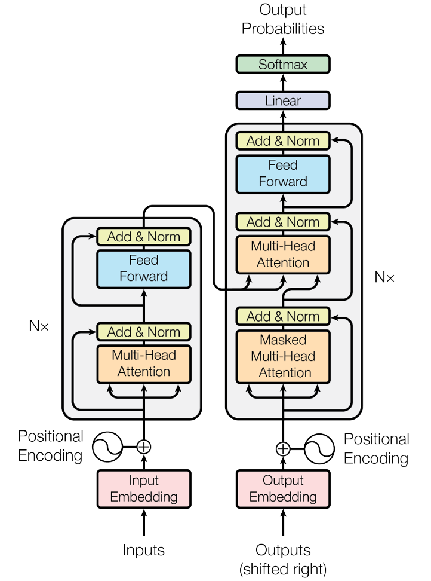
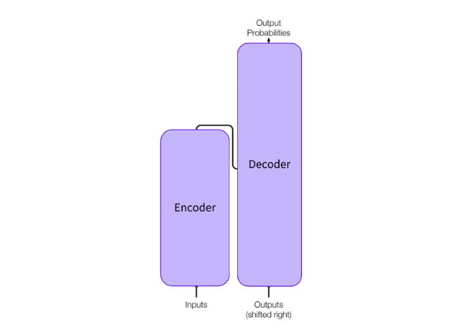
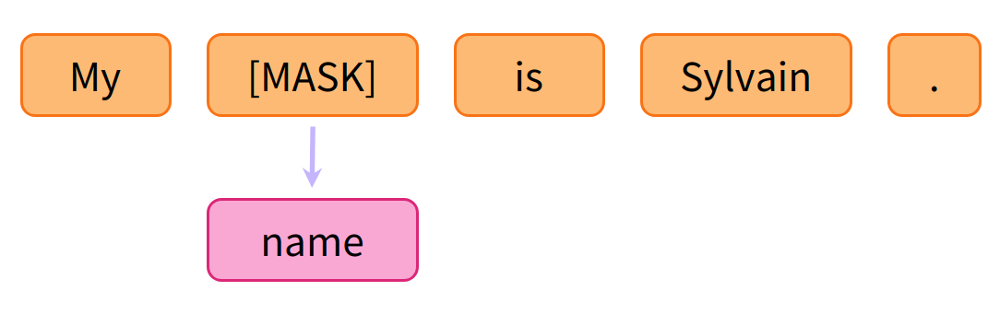
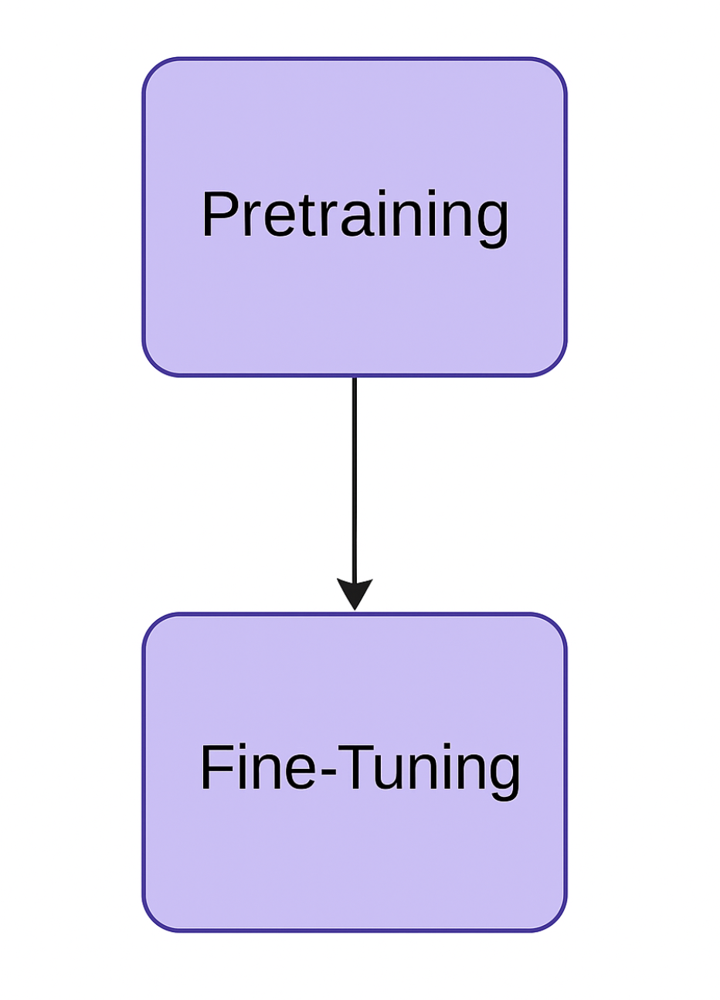
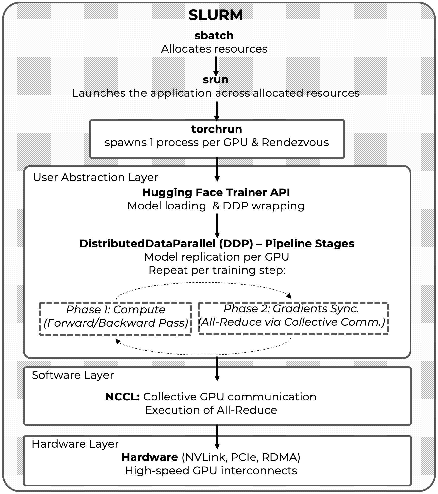

# 13. Introduction to Large Language Models

* TOC
{:toc}

This chapter introduces the core ideas behind Large Language Models (LLM) and explains why their development and training are inherently tied to large-scale computing infrastructures.

It can serve as an entry point for readers with prior experience in AI development who wish to understand LLMs from a systems and performance perspective. Earlier chapters may be consulted as needed for background on parallel execution and distributed training.

Large Language Models (LLMs) have emerged as one of the most transformative technologies in artificial intelligence (AI), reshaping entire fields—from natural language processing to scientific discovery. These developments are advancing at an extraordinary pace, often faster than researchers and practitioners can fully absorb their implications.

This chapter, which is entirely theoretical and descriptive, aims to provide a concise overview of the most relevant LLM concepts needed to follow the next two chapters, which are more practical in nature. Readers who already have a solid background in LLMs may choose to skip this chapter and proceed directly to the following ones.

##  The Evolution of LLMs and the Central Role of Supercomputing

### A New Era of Artificial Intelligence Powered by Large Language Models

In recent years, LLMs have become central actors in the field of artificial intelligence, driving applications capable of engaging in dialogue, answering complex questions, and even generating code. This revolution has been enabled by a convergence of breakthroughs: algorithmic innovations (especially the Transformer architecture), the availability of vast amounts of training data, and—decisively—the rise of large-scale supercomputing. In fact, access to massive compute capacity has been a key enabler for training increasingly large and complex models.

In this section, we will explore the recent evolution of LLMs through four major stages: large-scale pretraining, post-training and alignment, advanced inference, and the emerging frontier of autonomous agents. For each stage, we will highlight the key techniques, capabilities, computational challenges, and the central role of supercomputing.

### Large-Scale Pretraining: Building the Foundation with Data and Compute

#### The Rise of Foundational Models

The first stage in the evolution of LLMs was marked by large-scale pretraining on massive collections of unlabeled text. Through self-supervised learning (e.g., next-word prediction), models such as GPT and BERT learned statistical patterns in language at an unprecedented scale. A crucial breakthrough was the adoption of the Transformer architecture, introduced by Google in 2017, which enabled the efficient scaling of deep and wide models by exploiting computational parallelism. The resulting foundational models captured general linguistic knowledge from enormous corpora (Internet, digital libraries, etc.), serving as versatile bases for many downstream tasks.

#### Supercomputing as the Enabler of Scale

Scaling these models to new sizes brought enormous computational challenges. For example, GPT-3 (OpenAI, 2020) demonstrated that increasing a model to 175 billion parameters enabled remarkable few-shot learning capabilities. However, training such a model is extremely time-consuming and resource-intensive. The solution was to leverage massively parallel supercomputers. OpenAI, in collaboration with Microsoft, built a dedicated supercomputer with approximately 10,000 NVIDIA V100 GPUs to train GPT-3 in a feasible timeframe, at a compute cost of several million dollars.

Thanks to this infrastructure, full model training was completed in about one month using thousands of GPUs in parallel—an undertaking that would be impossible without distributed supercomputing at scale. Moreover, software innovations were required to orchestrate this level of hardware, employing data parallelism and model parallelism to distribute the workload across many compute nodes.

#### The Exponential Growth of Model Scale

Over the past decade, model sizes have grown exponentially, often by at least one order of magnitude per year, far outpacing the growth of GPU memory capacity. To handle such massive models, research labs have increasingly relied on clusters of accelerators (GPUs or TPUs) working in parallel. As previously mentioned, in section 7.1, the training of models like Google’s PaLM exemplifies this shift—coordinating thousands of TPU chips to support unprecedented scale.

This not only demonstrated the massive computational scale required, but also revealed that larger models and datasets unlock new emergent capabilities: as scale increases, models achieve better performance on diverse tasks and exhibit abilities previously absent. In summary, the pretraining phase demonstrated that with sufficient data and compute (enabled by modern supercomputers), it is possible to build general-purpose language models with impressive comprehension and generation capabilities.

### Post-Training and Alignment: Teaching Models to Follow Human Instructions

#### From Raw Models to Aligned Assistants

Training a massive model is only the beginning. The next phase involved post-training, where models are fine-tuned for specific purposes and, critically, aligned to human preferences and values. Techniques such as instruction tuning and reinforcement learning from human feedback (RLHF) became central. Rather than relying solely on generic Internet text, companies began refining these models with curated high-quality datasets—such as question-answer pairs or ideal human-written instructions—to teach models how to follow prompts usefully and safely.

#### RLHF and the Emergence of ChatGPT

A pivotal example was InstructGPT (OpenAI, 2022), where GPT-3 was fine-tuned to follow human instructions reliably and safely. This involved an initial supervised fine-tuning phase, followed by RLHF. The RLHF process trains a reward model reflecting human preferences (e.g., which responses are more helpful), and then uses reinforcement learning to optimize the LLM to maximize this reward—essentially teaching the model to "please" human evaluators.

This alignment dramatically improved response quality and safety. The practical outcome was ChatGPT, launched at the end of 2022, which surprised the public with its ability to conduct coherent conversations, follow detailed instructions, and avoid many problematic behaviors learned from raw Internet text.

#### Supercomputing Enabling Fast Iteration in Alignment

Post-training introduced its own computational challenges. Although generally less demanding than pretraining, fine-tuning massive models still requires significant compute resources. RLHF, in particular, is computationally complex: it involves repeatedly sampling responses, scoring them with a reward model, and updating the main model through reinforcement learning loops. Hyperparameter tuning is delicate, and human feedback data is expensive to collect.

Supercomputing infrastructure has been crucial for accelerating these experiments, allowing multiple RLHF iterations without requiring weeks for each cycle. Thanks to powerful GPU/TPU clusters, companies like OpenAI and DeepMind have been able to fine-tune models with tens or hundreds of billions of parameters, demonstrating that scaling alignment techniques also yields significant benefits.

### Advanced Inference: Real-Time Deployment at Global Scale

#### Beyond Simple Question-Answering

Once pretrained and aligned, the focus shifted to efficient deployment—advanced inference strategies that maximize model capabilities during real-world usage. Two key techniques emerged: prompt engineering and tool integration.

Surprisingly, prompt formulation can unlock latent reasoning abilities. Chain-of-thought prompting, for example, asks models to "think step by step," enabling them to solve complex math or logic problems much more effectively. In Google’s PaLM model, combining its massive scale with chain-of-thought prompts achieved unprecedented reasoning performance, solving 58% of school-level math problems with just a few examples in the prompt.

Similarly, in-context learning allows the same model to handle many tasks simply by providing examples directly in the prompt, effectively turning LLMs into "all-purpose engines" without modifying their internal weights.

#### Augmenting Inference with External Tools

Another class of inference techniques integrates external knowledge sources or tools. Since models contain only static knowledge up to their training cutoff, retrieval-augmented generation allows them to query up-to-date information (e.g., web search, databases) and condition their responses accordingly. LLMs can also invoke external tools during inference: for example, running calculators, accessing APIs, or executing code to verify solutions.

These extended capabilities have vastly broadened the practical applications of LLMs, allowing them to operate as highly versatile assistants.

#### The Supercomputing Backbone of Inference Infrastructure

However, deploying advanced inference at global scale introduces tremendous computational challenges. A model with hundreds of billions of parameters requires tens of gigabytes of memory and thousands of operations for each output. Serving millions of users simultaneously, as occurred after ChatGPT's release, demands massive infrastructure.

Again, supercomputing has been essential. Microsoft deployed tens of thousands of GPUs across roughly 60 global data centers to sustain ChatGPT’s inference load. In effect, global LLM inference runs on cloud supercomputers similar to those used for training.

The operational cost of maintaining ChatGPT (based on GPT-3.5) reaches several million dollars per day due to hardware and energy consumption. This has driven extensive optimization efforts: weight quantization, hardware-specialized compilation, and even specialized smaller models for particular tasks to offload work from the main model. Nevertheless, for high-demand applications, full-scale LLMs still require the raw power of supercomputing to deliver real-time answers worldwide.

### Autonomous Agents: The Emerging Frontier of LLM Applications

#### From Chatbots to Autonomous Problem Solvers

After achieving highly capable conversational models, the next frontier has been endowing LLMs with greater autonomy. Thus emerged LLM-powered agents: systems that leverage language models to plan and execute sequences of actions toward high-level user goals. These agents represent a shift from passive text generators to proactive AI systems capable of interacting with software—and even the physical world—with minimal human intervention.

For example, given a task like "create and launch a website," an agent may decompose the goal into subtasks, consult the LLM for decisions, invoke external tools (APIs, search engines, code execution), and iterate until completion. Auto-GPT (2023), an open-source project connecting instances of GPT-4, demonstrated that LLM-powered agents can self-manage multi-step projects, generating and debugging entire websites autonomously.

#### Key Technologies: Memory, Tool Use, and Reasoning Loops

Enabling these agents requires several key capabilities: persistent working memory, multiple chained LLM invocations, and seamless tool integration. The ReAct (Reason + Act) framework, for instance, interleaves internal reasoning (generating plans) with external actions (executing commands), allowing LLMs to close the perception-action loop and behave like conversational executive agents.

These agents can autonomously search for information, write and execute code, self-correct mistakes, and coordinate specialized sub-agents—approaching the vision of intelligent digital assistants that manage entire projects on behalf of users.

#### The Rising Compute Demands of LLM Agents

However, autonomous agents significantly amplify compute demands. A single user request may trigger dozens of LLM calls as the agent iteratively plans and acts. This can consume far more computational power than a simple ChatGPT interaction lasting seconds.

Scaling these agents requires robust distributed architectures, where supercomputing expertise becomes indispensable. Each active agent may occupy a slice of a supercomputer for minutes or hours. Coordinating multiple model instances and services further amplifies system complexity.

#### Supercomputing: The Dual Role in Agent Development and Deployment

Supercomputing plays a double role here. On one hand, it enables the development and training of more advanced models, including multimodal LLMs capable of processing text, images, and audio. On the other hand, supercomputers serve as the runtime substrate for these agents, at least while their underlying models remain enormous.

As NVIDIA’s CEO Jensen Huang highlighted at GTC Paris 2025, the coming wave of AI will center on autonomous agents able to perceive, reason, plan, and act. This will likely require even more specialized data centers optimized for hosting AI agents 24/7 on next-generation accelerators designed for dynamic inference workloads.

In short, LLM agents represent the cutting edge of AI evolution, dramatically expanding what artificial intelligence can achieve autonomously—and supercomputing remains at the heart of this new frontier.

### Supercomputing as the Silent Engine Behind LLM Progress

In summary, large language models have made astonishing progress in just a few years: from large-scale pretraining that built their general knowledge, to post-training alignment that made them safe and useful, to inference innovations that unlocked complex reasoning capabilities, and finally to the rise of autonomous agents that hint at intelligent systems capable of independent action.

At every stage, supercomputing has been the silent but essential engine that enabled unprecedented scale and complexity. Looking ahead, the synergy between LLM research and advanced computing infrastructure will continue to expand the boundaries of what is possible in artificial intelligence.

##  The Anatomy of Large Language Models

In this section, we introduce the essential technical foundations that define Large Language Models (LLMs), assuming a basic familiarity with core neural network concepts. For those without a background in Deep Learning, a light, selective reading may help grasp the general intuition behind the models we will explore in the following chapters. However, this book does not aim to provide a comprehensive treatment of the architectural, conceptual, or learning paradigms behind LLMs. Instead, the objective is to offer just enough context to interpret their computational demands and understand why supercomputing plays a central role in making them possible.

Understanding their internal structure is crucial not only for appreciating their capabilities but also for grasping why training and deploying them at scale requires cutting-edge supercomputing infrastructure.

### Transformers: The Foundation of Modern LLMs 

The turning point that allowed today’s large language models to exist was the arrival of the *Transformer* architecture, first described by Vaswani and colleagues in 2017 in the paper *Attention Is All You Need.* [^1] Earlier language systems relied on recurrent networks that processed words one after another. Because each step in a recurrent network depended on the previous one, the model could not be parallelised across many GPUs very efficiently, and information about words that occurred far apart in a sentence tended to fade as it travelled through the network. These two limitations—poor parallelism and difficulty with long-range context—became major obstacles once researchers began training on web-scale corpora.

The Transformer addresses both problems by abandoning recurrence altogether. Instead of passing information sequentially, it presents the entire sentence—or any sequence of tokens—to the network at once. Inside the model, every token is allowed to “look at” every other token in a single operation called *self-attention*. During self-attention the model assigns a numerical weight to each pair of tokens, measuring how relevant one is to the other for the task at hand. Because this calculation involves only matrix operations, all tokens can be processed simultaneously on modern accelerator hardware, achieving the level of parallel throughput that supercomputers like MareNostrum 5 excel at providing.

Although self-attention is flexible, it has no built-in sense of word order. The Transformer solves this by adding a small positional signal to every token’s vector representation before attention begins. In effect, each word carries with it a tag that encodes whether it appears first, second, third, and so on, allowing the network to distinguish between sequences such as “the cat sat” and “sat the cat.”

Once self-attention has blended information from the entire sequence—each word “looking at” every other word and deciding how much each one matters—the model refines every token with a short, two-layer feed-forward network applied independently at every position. Think of it as a quick polish: after every token has absorbed the global context, this tiny network acts only on that token’s own vector, adding non-linear transformations that make the representation more expressive without mixing in further information from neighbouring words. The Transformer repeats this two-step routine—global mixing via attention, followed by individual fine-tuning—inside every layer, and wraps the whole block in residual connections and layer normalisation. These engineering conveniences keep gradients flowing smoothly, so the model can stack hundreds of such layers while still training reliably.

The complete Transformer is obtained simply by repeating this basic block many times. In practice, modern language models may contain dozens or hundreds of layers, each one discovering relationships at a slightly higher level of abstraction than the layer below. Because all layers share the same highly parallel attention mechanism, training can be spread across thousands of GPUs, making the transformer architecture perfectly suited to the clusters like ACC partition of MareNostrum 5.

*Figure 13.1 – Original Transformer Architecture ([Source](https://arxiv.org/pdf/1706.03762.pdf):* Vaswani et al. Attention Is All You Need).

This architectural shift—from sequential recurrence to parallel attention—not only improved language understanding but also unlocked unprecedented scalability on modern hardware accelerators.

For tasks such as translation or text generation, the original paper combined two Transformer stacks in series: an *encoder* that reads the input sequence and a *decoder* that produces the output one token at a time. Later language models often retain only the decoder portion, but the underlying principles remain identical. Everything depends on letting tokens communicate freely through attention and on doing so in a way that exploits the modern supercomputers.

Figure 13.1 shows the canonical encoder–decoder diagram reproduced from the 2017 paper. A reader need not memorise every box in the illustration to follow the rest of this book; it is enough to remember that a Transformer layer (1) lets each word attend to every other word, (2) adjusts the resulting representations with a small neural network, and (3) repeats this pattern many times while keeping computation fully parallel. With that mental model in place, the remarkable scaling curves of large language models, and the supercomputers that power them, become much easier to understand.

### Transformer Variants: Encoder, Decoder, and Encoder–Decoder

While all large language models today are built upon the Transformer architecture, different tasks call for slightly different configurations. The original Transformer proposed by Vaswani et al. consisted of two separate stacks: an encoder that read an input sequence and a decoder that generated an output sequence one token at a time. This dual structure proved especially effective for tasks like machine translation, where the model needed to map a sentence in one language to a corresponding sentence in another.

Over time, researchers discovered that for many applications, only one half of this architecture was necessary. This gave rise to several Transformer variants, each adapted to a different kind of problem.

Encoder-only models retain just the first half of the Transformer stack—the encoder. These models, such as BERT or RoBERTa, are designed for understanding tasks like classification, sentence similarity, or question answering. During training, they see the entire input sequence at once, which allows them to build rich contextual embeddings for every word. However, because they do not include a decoder, they are not suited for generating long stretches of text.

Decoder-only models, by contrast, discard the encoder and keep only the second half. Models like GPT, LLaMA, Falcon, and MPT fall into this category. These models are trained to predict the next token in a sequence, one step at a time. They are ideal for generative tasks such as writing dialogue, generating code, composing summaries, or answering questions. Because they work autoregressively—producing one token after another based only on what has come before—they are naturally suited for applications where text must be generated from scratch.

Encoder–decoder models, also called sequence-to-sequence models, preserve the full original architecture. The encoder reads an input (such as a prompt or a passage), and the decoder produces a corresponding output. Models like T5, BART, and FLAN-T5 use this setup for tasks such as summarization, translation, or closed-book question answering. These models combine the strengths of both sides: deep understanding of the input and fluent generation of output.

In this book, we will focus primarily on decoder-only models. These are the engines behind most of today’s generative AI systems, and they are the type of model you will use in the practical experiments later on. The principles of attention and parallel computation remain the same across all Transformer variants, but decoder-only models simplify many of the engineering challenges involved in scaling and deployment.

Figure 13.2 provides a simplified visual comparison of the encoder–decoder structure, showing how information flows between the two components. Decoder-only models, which are the focus here, correspond to just the right-hand block in this diagram.

*Figure 13.2 – Encoder vs Decoder blocks (Image source: Hugging Face).*

### What Is a Language Model?

At its core, a language model is a system that assigns probabilities to sequences of words. It learns to estimate how likely each word is to appear, given the words that came before. This might sound like a narrow technical task, but it turns out that when a model gets very good at predicting what comes next in language, it begins to pick up an extraordinary range of knowledge—about grammar, common sense, world facts, and even reasoning.

To see how this works, imagine the simple phrase: *The cat sat on the \_\_*. A person fluent in English would expect a word like *mat* to follow, and would be much less likely to guess *carburetor*. A good language model makes the same kind of judgment. It has learned from reading billions of sentences that *mat* is a highly likely continuation, while other completions are improbable. It does this by observing patterns across vast datasets and generalising from them.

Modern language models use the Transformer architecture we’ve already explored. They process inputs as sequences of tokens—these may be words, word pieces, or even characters—and try to predict either a missing token or the next token in the sequence, depending on how they are trained. Despite the simplicity of the task, large models trained on enough data begin to exhibit surprisingly rich behaviours. They can summarise documents, answer questions, translate text, generate computer code, and follow instructions, all without being explicitly programmed for any of those things.

There are two main strategies for training such models. One is called *autoregressive language modelling*. In this setup, the model is trained to predict the next token, given all the previous ones. This is the approach used by GPT, LLaMA, and other decoder-only models. The training data consists of plain text, and the model is taught, token by token, to guess what comes next. This method is naturally suited to generating text, since it mimics the process of writing one word at a time.

The other strategy is *masked language modelling*, where some tokens in the input are hidden, or “masked,” and the model is trained to guess the missing ones. This forces the model to look at both the left and right context, making it better at understanding complete sentences or paragraphs.

This idea is illustrated in Figure 13.3. The process revolves around strategically masking some of the input tokens—such as the word “name” in the example—selected at random. The model is then challenged to predict the missing token based on the surrounding context. Because the model itself knows which token was masked, it can learn from its own prediction errors. This simple yet powerful mechanism forces the model to develop a deep understanding of linguistic structure, semantics, and the relationships between words.

*Figure 13.3 – Example of masked language modelling. The model hides one word from the input and learns to predict it using the remaining context (Image source:Hugging Face).*

BERT and similar encoder-only models are trained in this way. While masked modelling is not as well suited to text generation, it is highly effective for tasks that require deep understanding, such as classification or question answering.

Some models combine ideas from both strategies. For example, span corruption masks entire chunks of text instead of single words, and permutation-based models alter the order of input tokens. These techniques help the model learn more flexible and robust representations, especially over longer contexts.

No matter which method is used, the result is the same: the model becomes a powerful statistical engine capable of capturing the structure of human language in a form that can be used for a wide range of tasks.

### Transfer Learning: The Two-Stage Training Paradigm

Building a language model from scratch requires enormous amounts of text and computing power. But once a model has been trained on a broad dataset—say, a snapshot of the entire public internet—it becomes a kind of general-purpose language engine. This makes it possible to reuse the same model across many tasks, a process known as *transfer learning*, the same concept you’ve already encountered in earlier chapters in the context of neural networks.

Transfer learning in language models typically happens in two stages. The first is *pretraining*. Here, the model learns from vast, unlabelled datasets using self-supervised methods such as autoregressive or masked language modelling. No human annotations are needed—the model simply reads text and tries to predict tokens, thousands of times per second. Over time, it acquires a general sense of how language works, how concepts relate to one another, and how information is structured. It also learns latent knowledge about the world, even if no one explicitly tells it what is true or false.

The second stage is *fine-tuning*. In this phase, the pretrained model is adapted to a specific task or domain. This might involve a smaller, curated dataset—such as customer support conversations, coding, legal documents, or biomedical papers. Fine-tuning adjusts the model’s weights slightly so that it performs better on the new task while still retaining its broad capabilities. Because the model already knows so much, only a small amount of additional data is needed, and training can be done much more efficiently (See Figure 13.4 for a visual overview of this two-step training process).

*Figure 13.4 – The two-stage training process of modern language models. In the first phase, pretraining, the model learns general language patterns from vast unlabelled data. In the second phase, fine-tuning, it is adapted to perform a specific task more effectively using much smaller, curated datasets.*

In recent years, researchers have developed more advanced techniques to make fine-tuning even more effective. One such method is *instruction tuning*, where the model is trained to follow natural-language commands, such as “summarise this paragraph” or “translate this sentence into Spanish.” Another is *reinforcement learning from human feedback* (RLHF) , in which the model generates multiple outputs and receives human guidance about which ones are preferred. This process helps align the model’s behaviour with human expectations, improving safety, politeness, and usefulness.

Other forms of adaptation include *domain-specific tuning*, where the model is exposed to a narrow field of expertise, and *in-context learning*, where the model is shown a few examples of a task inside the prompt itself, without changing its weights at all.

Together, these techniques turn large language models into flexible tools that can be adapted to a wide range of real-world applications. Thanks to transfer learning, we no longer need to train a new model from scratch for every task. We can simply start with a powerful pretrained backbone and tune it as needed, reducing both the cost and the time required to bring intelligent systems into production.

This two-stage paradigm—pretraining once, fine-tuning many times—has been one of the key enablers of the generative AI revolution, allowing organizations to adapt powerful general-purpose models to specific use cases with a fraction of the original cost.

### The Attention Mechanism: How Transformers Understand Context

The self-attention mechanism is at the heart of how Transformers process language. It's the key innovation that lets these models understand the relationships between words, no matter how far apart they are in a sentence or paragraph. Unlike older neural network architectures that struggled to keep track of long-term dependencies, self-attention gives the model a way to dynamically decide which parts of the input are most relevant at each step.

#### The Core Intuition Behind Attention

Imagine you're reading a sentence like: *"The animal didn't cross the street because it was too tired."* What does *it* refer to? You need to look back at *The animal* to resolve that. The same challenge applies to a LLM trying to understand text.

Self-attention addresses this by giving each word (or more precisely, each token) the ability to "look at" every other token in the sequence. At every layer of a Transformer, the model computes, for each token, a weighted combination of all the other tokens. The weight reflects how important each of the other tokens is when interpreting the current one.

This means the model can:

- Focus on relevant context to resolve ambiguity (e.g., "bank" as a riverbank or a financial institution).

- Track long-range dependencies across sentences (e.g., resolving pronouns).

- Handle inputs of varying length while maintaining global coherence.

#### Introducing Queries, Keys, and Values (Q, K, V)

To make this attention process work, the model transforms each token into three separate vectors:

- Query (Q): Encodes what the token is looking for. You can think of this as the "question" the token asks the rest of the sequence.

- Key (K): Encodes what each token has to offer. It's like the "label" on the box.

- Value (V): Contains the actual information the token holds—the contents of the box.

Let’s use a metaphor. Imagine you are at a party trying to find people who can help you plan a trip to Barcelona. You (the current *token*) go around asking (*Query*) what others know. Each person has a name tag (*Key*) and a set of facts they know (*Value*). You compare your question against everyone’s name tag to find who might be most helpful. Then, you gather information from the most relevant ones, paying more attention to those with better matches.

#### The Attention Calculation Step-by-Step

Here’s how attention mechanism works behind the scenes:

1.  Linear Projections: Each input token is passed through three different weight matrices to produce its Query, Key, and Value vectors. Party metaphor: Each person (token) writes three things on their badge: their question (Query), their expertise (Key), and what they actually know (Value). The model learns how to generate these vectors during training.

2.  Dot-Product Scoring: For a given token, the model computes the dot product between its Query and the Keys of all other tokens. This gives a score for each pair. Party metaphor: You go around the room comparing your question to everyone’s expertise label. The better the match, the higher the score. This helps you determine who is most relevant to talk to.

3.  Scaling: The similarity scores are divided by the square root of the dimension of the Key vectors. This step stabilizes training by preventing excessively large values. Party metaphor: To avoid overemphasizing minor differences between people, you temper the comparisons—like ensuring no one dominates the conversation just because their name tag is overly descriptive.

4.  Softmax Normalization: The scaled scores are turned into probabilities using the softmax function. This ensures the attention weights sum to one. Party metaphor: You translate your preference scores into a distribution of attention. People with better matches get more of your focus, but everyone gets a chance to speak.

5.  Weighted Sum: The final representation for the token is computed as a weighted sum of all Value vectors, based on the attention weights. Party metaphor*:* You gather advice from everyone, weighting their input based on how useful you found them. The result is your updated perspective—infused with context from the whole room.

The result is a new vector for each token that reflects not only its original meaning, but also a context-aware synthesis of what it "heard" from the other tokens.

One of the intuitive ways to understand what’s happening inside a Transformer is through attention visualizations, often rendered as heatmaps. These heatmaps display how much focus—or attention—each token gives to every other token in the input sequence. In these diagrams, each row corresponds to a specific token being processed, and each column represents a potential token it could attend to. The darker the cell, the stronger the attention weight from the token in that row to the token in that column. This means the model is “paying more attention” to that particular token when computing the current one’s representation.

These visualizations also serve as interpretability tools, helping researchers and engineers debug model behavior, detect spurious correlations, and understand model failures.

#### Why Use Multiple Heads?

Instead of doing all this with a single set of Q, K, V vectors, Transformers use what's called multi-head attention. Multiple attention heads run in parallel, each with its own set of weight matrices. This allows each head to focus on different kinds of relationships:

- One head might track short-range syntactic structure (like noun-verb agreement).

- Another might focus on semantic roles (like who did what to whom).

- Others might look for longer-term dependencies or thematic consistency.

*Party metaphor:* It's like having several versions of yourself at the party, each asking slightly different questions and paying attention to different kinds of people in the party. One version seek out tips on Catalan cuisine, another might be interested in modernist architecture in Barcelona, and a third might explore the region’s rich cultural heritage. At the end, you combine all their findings into one comprehensive and insightful travel plan, drawing on multiple perspectives. At the end of the process, the outputs from all heads are concatenated and passed through another linear layer, giving a multi-faceted view of the context.

In summary, the Transformer architecture—driven by its powerful attention mechanism and highly parallelizable design—forms the technical backbone of today’s large language models. From the careful interplay of Queries, Keys, and Values to the ensemble dynamics of multi-head attention, we’ve seen how these models are able to capture complex patterns in language and context. Understanding these inner mechanics not only demystifies how LLMs operate but also highlights why they are so computationally demanding—especially when scaled to billions of parameters and trillions of training tokens. With this foundation in place, we are ready to explore how such models are actually trained, fine-tuned, and deployed using modern tools. Before, in the next section, we turn our attention to the Hugging Face framework, which has become the de facto standard for building and experimenting with Transformer-based models in both research and industry.

##  Hugging Face Framework

In recent years, Hugging Face has become one of the most influential actors in the AI ecosystem, particularly for researchers, developers, and students working with LLMs. What began as a library for natural language processing has rapidly evolved into a full-fledged ecosystem that bridges the gap between cutting-edge research and practical deployment.

This section introduces Hugging Face not merely as a toolset, but as an enabler of reproducible and scalable experimentation in AI. Its value lies in lowering the barriers to entry for those who want to work with LLMs without needing massive infrastructure or deep engineering expertise. Thanks to Hugging Face, it is now possible to access, fine-tune, and deploy powerful language models with just a few lines of code—on anything from a personal laptop to a high performance supercomputing cluster.

The Hugging Face ecosystem provides an integrated platform that includes:

- Open access to thousands of pretrained models from both academia and industry.

- Standardized datasets and benchmarks for evaluation.

- Unified APIs for training, inference, and deployment.

- Scalable tools for distributed computing and hardware acceleration.

- Cloud-based services for production-level hosting and model sharing.

Rather than focusing solely on algorithmic innovation, Hugging Face has prioritized usability, transparency, and community collaboration. It has become a central hub for applied AI research, and a foundational tool for anyone wishing to build or experiment with LLMs.

In what follows, we will explore why Hugging Face matters, its key components—including the Model Hub, transformers, datasets, and accelerate libraries—and how it will serve as the core interface for our experiments throughout the rest of this book.

### Why Hugging Face Matters for LLMs

The recent success of Large Language Models has come at a steep computational cost. Training a model with billions of parameters requires vast amounts of data, compute, engineering expertise, and infrastructure—resources that remain out of reach for most academic labs, independent developers, and even many companies.

Hugging Face has emerged as a critical enabler in this context**,** offering a set of tools and services that make it possible to *use* LLMs without having to *train them from scratch*. More importantly, it democratizes access to state-of-the-art models by lowering technical, financial, and logistical barriers. The ecosystem plays five key roles in making LLMs broadly accessible and usable:

#### 1. Access to Pretrained Models

Hugging Face provides ready-to-use models trained by both open-source communities and industrial research teams. These include widely used architectures such as BERT, GPT, T5, and LLaMA, covering a wide range of languages, domains, and use cases.

Rather than building everything from zero, users can download and use these pretrained models immediately—whether for inference, fine-tuning, or experimentation.

#### 2. Unified APIs for Inference, Training, and Deployment

The Hugging Face libraries expose intuitive Python APIs that wrap complex engineering pipelines into simple abstractions. This allows users to:

- Load models with a single line of code.

- Run inference locally or in the cloud.

- Fine-tune models on custom datasets.

- Export models for deployment.

For students and researchers, this means they can focus on *the task at hand*—not on wiring together tokenizers, model weights, and distributed training setups manually.

#### 3. Open Model Hub and Transparent Model Sharing

At the core of the Hugging Face platform is the Model Hub: a collaborative repository that hosts thousands of models with:

- Downloadable weights and configuration files.

- Clear metadata[^2] (e.g., licenses, datasets used, performance metrics).

- Documentation and usage examples.

- Version control and reproducibility support.

This open and searchable hub has become the *de facto registry* for pretrained Transformer models in both academia and industry.

#### 4. Standardization and Interoperability

Hugging Face has established community-wide conventions for how models, datasets, and pipelines should be structured to ensure that:

- Models can be reused across projects without extensive re-engineering.

- Experiments are more easily reproduced and compared.

- Code written for one architecture can often be transferred to another with minimal changes.

As a result, the ecosystem promotes good software practices and accelerates collaborative research.

#### 5. Hardware Scaling and HPC Integration

Crucially, Hugging Face does not stop at easy use. It also supports scaling to high performance computing environments, thanks to libraries such as accelerate, DeepSpeed integration, and compatibility with distributed training frameworks.

This makes it possible to:

- Train or fine-tune models on multiple GPUs or compute nodes.

- Exploit mixed-precision training and memory-efficient techniques.

- Deploy pipelines on infrastructure like MareNostrum 5 with minimal changes to user code.

In summary, Hugging Face has become a *gateway to modern LLM research and development*. It enables students to experiment with state-of-the-art models, researchers to publish reproducible results, and developers to build and deploy intelligent applications—all while lowering the complexity typically associated with such tasks.

In the following section, we will explore the core components of this ecosystem and how they fit into the practical workflows we will build throughout the book.

### Core Components of the Hugging Face Ecosystem

Below we break down the five pillars that make Hugging Face more than just a Python package. Together, they form a coherent workflow that spans from data acquisition all the way to production deployment on large‑scale infrastructure.

#### 1. The Model Hub

The Hugging Face Model Hub is a centralized repository that currently hosts:

- Transformer-based models (BERT, GPT, T5, LLaMA, Mistral, etc.).

- Multimodal models (e.g., Flamingo, CLIP, Whisper, etc.).

- Domain-specific models (biomedical, legal, multilingual, etc.).

- Community-contributed checkpoints.

Each repository follows a predictable structure—config files, tokenizer, weights, README, sample notebooks—making it trivial to reproduce results or branch off new experiments.

#### 2. Transformers Library

The Hugging Face transformers Python library provides a unified API to load, train, fine-tune, and deploy pretrained models. Key features include:

- Simplified model loading (from_pretrained() function).

- Unified interfaces across architectures.

- Automatic downloading of model weights and tokenizers.

- Support for both PyTorch and TensorFlow backends.

- Extensive documentation and tutorials.

For example, a full text generation pipeline can be initialized with just a few lines of code:

    from transformers import AutoTokenizer, AutoModelForCausalLM

    tokenizer = AutoTokenizer.from_pretrained("gpt2")
    model = AutoModelForCausalLM.from_pretrained("gpt2")

    inputs = tokenizer("Once upon a time", return_tensors="pt")
    outputs = model.generate(**inputs)
    print(tokenizer.decode(outputs[0]))

#### 3. datasets Library

This complementary library provides standardized access to a large catalog of open-source NLP datasets, preformatted for easy integration into model pipelines.

- Download, split, preprocess, and shuffle datasets with minimal code.

- Supports common formats (JSON, CSV, Parquet, streaming datasets).

- Facilitates reproducibility by version-controlling datasets.

Example usage:

    from datasets import load_dataset

    dataset = load_dataset("wikitext", "wikitext-103-raw-v1")

#### 4. accelerate Library

Training on multiple GPUs—or across multiple nodes—usually requires non-trivial setup and configuration around tools like torchrun. The accelerate library, developed by Hugging Face, compresses much of this complexity into a few simple commands, making distributed training far more accessible.

accelerate is a lightweight, device-agnostic Python library that abstracts away many of the low-level details involved in scaling PyTorch training scripts. It supports CPUs, single GPUs, multi-GPU machines, and even distributed systems in HPC environments. Its main design goal is to enable portability and simplicity without sacrificing compatibility with common frameworks such as transformers, datasets, and diffusers.

Some of its key features include:

- Automatic device placement and mixed precision (FP16/BF16) management.

- Simple YAML-based configuration files that translate to multi-node launches, whether on SLURM, MPI, or bare metal clusters.

- Native support for DeepSpeed ZeRO, Fully Sharded Data Parallel (FSDP), and gradient accumulation.

- Seamless integration with Hugging Face’s training APIs and transformers.Trainer.

After configuring your environment with:

    accelerate config

you can launch a training script with:

    accelerate launch train.py

This command performs several steps under the hood:

- Initializes the distributed process group.

- Wraps the model, optimizer, and dataloaders with the appropriate distributed training constructs.

- Manages gradient accumulation and synchronization transparently.

- Enables mixed precision training with a simple --mixed_precision flag.

For example, to launch a multi-GPU training job with BF16 support on an HPC node:

    accelerate launch --multi_gpu --mixed_precision=bf16 train.py

Once configured, this setup can be reused across multiple runs and environments, adapting automatically to the available hardware. The configuration is stored in a local YAML file, typically in .../huggingface/accelerate, and includes options such as:

- Number of processes (e.g., GPUs)

- Type of mixed precision (fp16, bf16, or none)

- Whether DeepSpeed is used

- Preferred backend (e.g., NCCL)

For HPC users, accelerate launch can be embedded in a Slurm script just like torchrun, and offers additional automation layers. However, for the purposes of this book—and to align with the standard software stack deployed in MareNostrum 5—we will continue using torchrun as the default launcher for PyTorch-based distributed training. This choice reflects the maturity and robustness of the PyTorch DDP ecosystem and ensures compatibility with existing modules, environments, and monitoring tools already available in the system.

That said, readers are encouraged to explore accelerate in their own workflows, particularly when aiming to unify scripts across cloud, desktop, and HPC platforms with minimal changes.

#### 5. Inference API and Endpoints

Hugging Face offers cloud-hosted inference endpoints that allow developers to deploy models at scale via simple REST APIs, removing the burden of infrastructure management.

- Useful for production deployment and real-time applications.

- Supports hardware-accelerated backends.

- Integrated monitoring, autoscaling, and usage tracking.

From an educational perspective, together, these components form a vertically integrated stack: datasets feeds clean corpora to transformers models, which can be trained at scale via accelerate, stored and versioned on the Model Hub, and finally served in production through hosted inference services. In short, Hugging Face provides the glue that connects research insight to real‑world deployment while remaining compatible with both local GPUs and supercomputers.

### Hugging Face Trainer API: Simplifying Distributed Training

One of the most practical components of the Hugging Face ecosystem is the Trainer class, which provides a high-level abstraction for executing training workflows with Transformer models. This API encapsulates critical components such as the training loop, gradient computation, evaluation, checkpointing, device placement, and even distributed initialization.

Using Trainer significantly reduces code complexity and allows students and researchers to focus on modeling decisions, dataset design, and evaluation strategies—rather than the intricacies of distributed computing. This abstraction is especially valuable in educational or prototyping contexts, where rapid experimentation with minimal setup is the main objective.

#### What Does Trainer Abstract?

Table 13.1 compares the typical PyTorch DDP workflow introduced in Chapter 12 with its equivalent using the Hugging Face Trainer class. This level of abstraction allows users to bypass much of the boilerplate code while retaining full distributed training capabilities.

When advanced customization is needed, Trainer can be subclassed. Alternatively, one can always revert to using DDP directly for full control. However, for most deep learning workflows—especially those involving Transformers or pretrained models—Trainer provides a powerful, extensible interface that greatly enhances usability.

To better appreciate the simplicity offered by Hugging Face’s Trainer API, let us examine how common distributed training components are handled manually using PyTorch's DistributedDataParallel (DDP) and how they are simplified when using Trainer.

<table style="width:83%;">
<colgroup>
<col style="width: 19%" />
<col style="width: 37%" />
<col style="width: 26%" />
</colgroup>
<thead>
<tr>
<th style="text-align: center;"><strong>Functionality</strong></th>
<th style="text-align: center;"><strong>DDP</strong></th>
<th style="text-align: center;"><strong>HF Trainer</strong></th>
</tr>
</thead>
<tbody>
<tr>
<td style="text-align: center;">DDP Initialization</td>
<td>dist.init_process_group("nccl") 
torch.cuda.set_device(LOCAL_RANK)</td>
<td style="text-align: center;">Handled automatically via torchrun and managed internally by Trainer</td>
</tr>
<tr>
<td style="text-align: center;">Device Placement</td>
<td>device = torch.device("cuda", LOCAL_RANK)</td>
<td style="text-align: center;">Implicit; Trainer manages device placement</td>
</tr>
<tr>
<td style="text-align: center;">Wrapping with DDP</td>
<td>model = DDP(model, device_ids=[LOCAL_RANK])</td>
<td style="text-align: center;">Not required; handled internally by Trainer</td>
</tr>
<tr>
<td style="text-align: center;">Dataset + Sampler</td>
<td>DistributedSampler(...) 
DataLoader(..., sampler=sampler)</td>
<td style="text-align: center;">Trainer constructs distributed loaders automatically</td>
</tr>
<tr>
<td style="text-align: center;">Training Loop</td>
<td>for epoch in range(...) 
loss.backward() 
optimizer.step()</td>
<td style="text-align: center;">Handled automatically via torchrun and managed internally by Trainer</td>
</tr>
</tbody>
</table>

Table 13.1 – Functionality Comparison: PyTorch DDP vs Hugging Face Trainer.

For instance, the manual DDP initialization in train_ddp.py requires explicit code to configure the process group and assign devices:

    from torch.distributed import init_process_group
    init_process_group(backend="nccl")
    world_size = int(os.environ["WORLD_SIZE"])
    rank = int(os.environ["RANK"])
    device_id = rank % torch.cuda.device_count()

In contrast, when using Trainer, no initialization code is needed. The environment is automatically configured by torchrun, and Trainer uses this information internally via the accelerate library.

Similarly, device placement is handled manually in DDP as follows:

    device_id = rank % torch.cuda.device_count()
    model.to(device_id)

With Trainer, there is no need to specify or move the model to the correct device. The following is sufficient:

    trainer = Trainer(model=model, ...)

Trainer automatically detects the appropriate GPU for each process launched by torchrun and places the model accordingly.

When using DDP directly, the model must be explicitly wrapped with DistributedDataParallel:

    model = DDP(model, device_ids=[device_id])

Again, this step is fully abstracted by Trainer. Internally, it wraps the model with DDP when it detects multiple processes, using accelerate.

Dataset preparation also requires extra work with DDP to ensure each process receives a unique data shard:

    train_sampler = DistributedSampler(train_ds, num_replicas=world_size, rank=rank)
    train_dl = DataLoader(train_ds, sampler=train_sampler, ...)

This is handled automatically by Trainer, which builds a distributed sampler internally when it detects a multi-process environment:

    trainer = Trainer(train_dataset=DummyDataset(...), ...)

Perhaps the most striking simplification is in the training loop itself. With DDP, the user must implement every step explicitly:

    for inputs, labels in train_dl:
        optimizer.zero_grad()
        with autocast(...):
            outputs = model(inputs)
            loss = criterion(outputs, labels)
        loss.backward()
        optimizer.step()

With Trainer, the full training loop, including automatic mixed precision (AMP), logging, gradient accumulation, and evaluation, is reduced to a single line:

    trainer.train()

As we can see, Hugging Face’s Trainer drastically reduces the complexity of writing distributed training code. While the manual DDP approach offers maximum flexibility and visibility—ideal for low-level debugging or research infrastructure—the Trainer API provides a powerful abstraction that simplifies workflows without sacrificing performance. This is particularly beneficial when using torchrun in managed environments such as SLURM-based supercomputers.

### Extending the Canonical Distributed Training Execution Model

In Figure 12.1, we introduced the canonical execution pipeline for distributed training in PyTorch, highlighting how SLURM, torchrun, DistributedDataParallel (DDP), and NCCL interact to orchestrate computation and gradient synchronization across GPUs. That figure focused deliberately on the core execution mechanics that determine performance and scalability.

When using the Hugging Face Trainer API, this underlying execution model does not change. Instead, several responsibilities are lifted to a higher level of abstraction. Figure 13.5 builds directly on Figure 12.1 by extending the layered architecture to include the Trainer as the primary user-facing entry point for distributed LLM training.

In this updated view, the Hugging Face Trainer sits above torchrun and automatically adapts to the distributed environment established by the launcher. It configures device placement, initializes PyTorch DistributedDataParallel under the hood, and delegates all performance-critical communication to NCCL, which continues to operate directly on the hardware interconnects.

Although the Trainer is internally built on top of the accelerate library, launching distributed jobs with torchrun remains sufficient—and often preferable—in SLURM-managed HPC environments. For this reason, torchrun is the launcher adopted throughout this book.

*Figure 13.5 – Updated layered architecture and execution flow for distributed LLM training with the Hugging Face Trainer API. The figure extends the canonical DDP execution pipeline introduced in Figure 12.1 by incorporating the Trainer as the user-facing abstraction, while preserving the underlying roles of torchrun, NCCL, and the hardware interconnect. This full-stack view serves as a recurring reference for understanding scalability, coordination, and performance throughout the remainder of the book.*
 
 

Figure 13.5 therefore provides a unified full-stack reference model, connecting high-level training code to the underlying distributed execution pipeline. This figure will be reused in subsequent chapters to reason about scalability, coordination overheads, and the interaction between user abstractions and system-level components.

In the next Chapter 14, we will apply this execution model in a complete end-to-end LLM workflow. In Chapter 15, we will then examine how performance optimizations operate at different layers of the stack illustrated in Figure 13.5 when running on a production supercomputing platform such as MareNostrum 5.

##  Key Takeaways from Chapter 13

- Large Language Models (LLMs) have revolutionized AI thanks to the combination of the Transformer architecture, large datasets, and supercomputing.

- Pretraining on massive unlabeled text with self-supervised learning creates general-purpose language models.

- Supercomputers are essential to train large models like GPT-3 or PaLM, which require thousands of GPUs and enormous compute power.

- Post-training and alignment techniques such as instruction tuning and RLHF help models follow human instructions safely and usefully.

- Deploying LLMs at global scale involves advanced inference strategies like prompt engineering, tool use, and retrieval-augmented generation.

- Inference at scale also depends on supercomputing, as serving billions of tokens daily requires massive infrastructure and optimization.

- The new frontier of LLMs involves autonomous agents that plan and act using tools, memory, and reasoning loops with minimal human input.

- Autonomous agents dramatically increase compute requirements, reinforcing the need for distributed supercomputing systems.

- The Transformer architecture enables parallelism and long-range context handling through self-attention and multi-head mechanisms.

- Decoder-only Transformer models (e.g., GPT, LLaMA) dominate generative AI applications and are the main focus of this book.

- LLMs are trained through a two-stage process: pretraining on general data and fine-tuning on specific tasks or domains.

- Hugging Face provides an accessible and standardized ecosystem for working with LLMs, from training to deployment.

- Its key tools—Model Hub, transformers, datasets, accelerate, and inference endpoints—allow scalable experimentation on any infrastructure.

- Hugging Face enables students and researchers to experiment with powerful models without building them from scratch or managing complex systems.

- The Hugging Face Trainer API abstracts away much of the complexity of distributed training—such as the training loop, gradient computation, device placement, DDP wrapping, and data loading—allowing users to focus on modeling and experimentation rather than low-level orchestration.

- When Hugging Face Trainer API is combined with torchrun, Trainer enables robust, scalable training that integrates seamlessly with SLURM-managed environments, making it the preferred approach adopted throughout this book.

[^1]: https://arxiv.org/pdf/1706.03762.pdf

[^2]: Hugging Face explicitly tags each model with its associated license, which is critical for understanding how it can be used. Open licenses like Apache 2.0 allow for unrestricted use, while more restrictive ones, such as Meta’s custom LLaMA licenses, limit commercial applications and redistribution.
