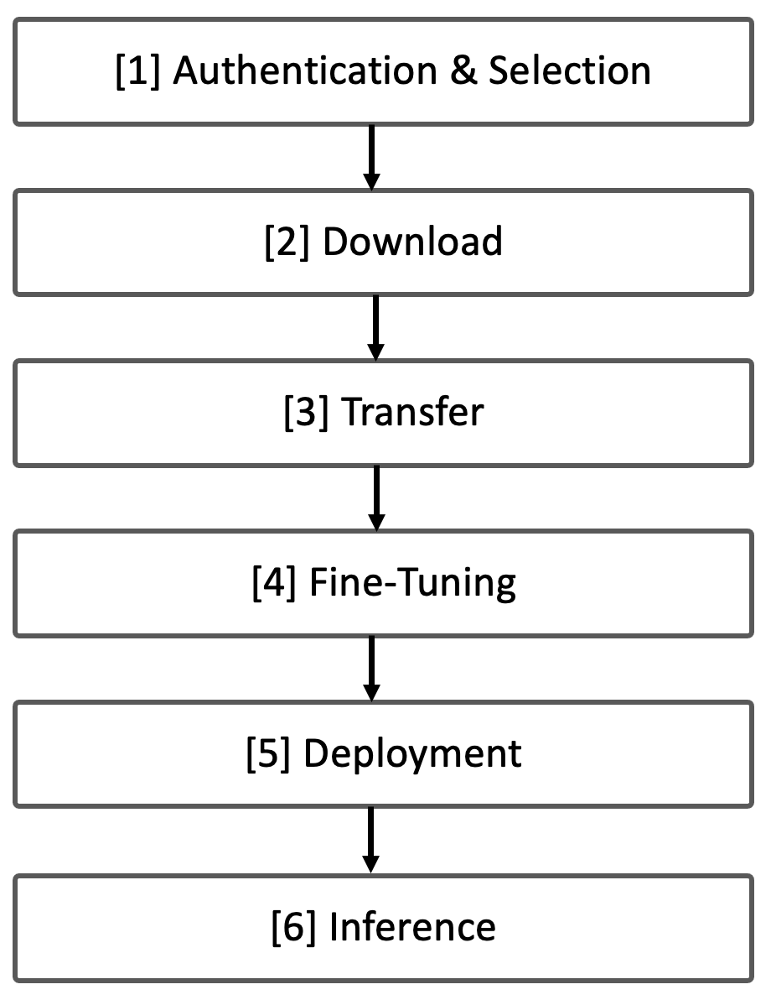

# 14. End-to-End Large Language Models Workflow

* TOC
{:toc}

After the brief conceptual overview of LLMs and the Hugging Face ecosystem in the previous chapter, we now move on to a hands-on, end-to-end example showing how to use real-world LLMs. This chapter presents a complete workflow—from model access and download, to fine-tuning and inference—illustrated through executable examples in both Google Colab and the MareNostrum 5 supercomputer.

Although we will work with reduced-size models and small datasets (due to the limitations of Colab and for pedagogical clarity), the same concepts and tools apply to large-scale training and deployment pipelines.

##  Understanding the LLM Workflow

Large Language Models (LLMs) go through several well-defined phases throughout their lifecycle. These phases form a logical workflow that guides users from the initial download of a pre-trained model to its use in real applications. In the context of research and high performance computing, understanding this end-to-end pipeline is essential for efficient experimentation and reproducibility.

We can break down the workflow into six key stages:

#### \[1\] Authentication and Model Selection

Before using models or datasets from the Hugging Face Hub, users must authenticate using an access token and, in some cases, explicitly request permission to access gated resources (e.g., Meta’s OPT or LLaMA models). Choosing the right model architecture is also critical and should align with the downstream task and available compute resources.

#### \[2\] Model and Dataset Download

Once authenticated, users can download pre-trained models and datasets using the Hugging Face Python API or CLI tools. These resources are typically stored in local directories and include all necessary configuration, tokenizer, and weight files to enable offline usage and reproducibility.

#### \[3\] Transfer to Supercomputing Environment

Due to network restrictions in most HPC systems, direct downloads from online repositories are not allowed. Instead, models and datasets must be transferred manually via tools like scp to the internal file system of the supercomputer (e.g., GPFS in MareNostrum 5). This step ensures that all resources are locally accessible for training or inference jobs.

#### \[4\] Fine-Tuning the Model

Fine-tuning involves adapting the pre-trained model to a specific dataset or task. This is where most of the computational effort lies and where supercomputing resources provide a clear advantage. The process typically includes loading the model and tokenizer, preprocessing the dataset, defining training arguments, and executing the training loop.

#### \[5\] Deployment for Inference

Once trained or fine-tuned, the model must be made available for inference. In this book, we focus on manual, transparent deployment as a pedagogical exercise: loading the model from a directory and using it to generate text from input prompts. In production scenarios, however, deployment is often handled by inference engines or REST-based services optimized for throughput and latency.

#### \[6\] Inference and Application

Inference is the final stage—where the trained model generates predictions for new inputs. It is the most user-visible part of the workflow and often the bottleneck in real-time systems. Even though this book focuses primarily on training, understanding the basic mechanics of inference is essential, especially in high performance environments where profiling and optimization can lead to significant efficiency gains.

In practice, the throughput of transformer-based inference is frequently memory-bound. During autoregressive decoding, each generated token requires repeated reads and writes to the key–value (KV) cache, which grows with both model size and sequence length and places sustained pressure on memory bandwidth.

In roofline terms, large-scale LLM inference often operates in the memory-bound region, primarily due to frequent accesses to the key–value cache during decoding. Techniques such as batching, speculative decoding, or kernel fusion aim to increase arithmetic intensity by amortizing memory accesses over more computation. Understanding inference performance through this lens clarifies why memory bandwidth, rather than raw compute capability, is frequently the dominant bottleneck.

Figure 14.1 provides an overview of the complete end-to-end workflow for large language models, highlighting how inference fits into the broader lifecycle that spans model access, fine-tuning, and deployment.

*Figure 14.1 – Overview of the End-to-End Workflow for Large Language Models.*

In the next sections, we will implement this workflow using real tools and code examples. We begin with authentication, model access, and basic inference on Google Colab, followed by model transfer and execution on MareNostrum 5.

##  Authentication and Downloading Models with Hugging Face

### 12.2.1 Authenticating in Hugging Face

Before downloading models or datasets from the Hugging Face Hub, users must authenticate using a secure access token. These tokens serve as digital credentials that grant permission to access gated resources such as licensed models (e.g., OPT or LLaMA), as well as to use APIs programmatically.

#### Access Tokens

In modern cloud-based environments—ranging from platforms like Hugging Face and GitHub to large-scale infrastructure providers like Google Cloud or AWS—secure access to resources such as models, datasets, and repositories is a foundational requirement. Rather than relying on traditional username and password combinations, these systems increasingly use access tokens to authenticate and authorize users.

An access token is a unique string of characters that serves as a personal digital key. It allows an authenticated user—or even an application acting on behalf of a user—to securely access remote services or repositories. Unlike passwords, which are manually entered and difficult to scope or revoke, tokens can be generated with specific roles (such as read-only or read-write), have defined expiration dates, and can be easily managed or rotated. This makes them ideal for programmatic workflows, especially in research or high performance computing contexts where automation and reproducibility are essential.

Access tokens are part of a broader landscape of authentication methods. While SSH keys are widely used for secure remote login in supercomputing environments, and OAuth 2.0 enables delegated logins across platforms (e.g., "Sign in with Google"), access tokens strike a balance between security, granularity, and convenience. Unlike API keys, which are static and offer limited control, access tokens can carry identity-specific metadata and enforce fine-grained permissions. This flexibility makes them the preferred method for modern APIs, including the Hugging Face Hub, where users often need to securely download gated models or push updates to shared repositories.

#### Hugging Face Access Tokens

A Hugging Face access token is a secure, user-specific credential that allows you to authenticate with the Hugging Face Hub. Tokens are especially important when you want to use the huggingface_hub Python API or huggingface-cli to donwload models or datasets.

How to Obtain an Hugging Face Access Token:

1.  Visit [<u>https://huggingface.co</u>](https://huggingface.co/).

2.  Log in to your account (or create one).

3.  Navigate to Settings → Access Tokens.

4.  Click New token, assign a name (e.g., MN5-training), and choose a Read role, it is sufficient for downloading models and datasets.

5.  Copy the generated token and store it securely.

These tokens act as personal keys, giving your local machine permission to interact with Hugging Face resources on your behalf. It is important to remember that Tokens are sensitive information and should be kept private. Never share access tokens publicly or include them in public repositories.

There are two main ways to authenticate and use your token: from the terminal (via CLI) or within Python code.

#### Authenticating from CLI

If you plan to use the CLI (Command Line Interface), install the tool and authenticate:

    $ pip install -U "huggingface_hub[cli]"
    $ huggingface-cli login

The command will prompt you to paste your access token, which will be saved securely in your system’s keyring.

#### Authenticating in Python Code

You can also authenticate programmatically within a script:

    from huggingface_hub import login

    # Replace 'YOUR_TOKEN' with your real token string
    login(token='YOUR_TOKEN')

This will store your credentials so once authenticated, future calls to the API (such as model download) will work without re-authentication.

>**Task 14.1 – Obtain Your Hugging Face Access Token**
>
>Before you can download gated models or datasets from Hugging Face, you must authenticate using a personal access token. In this task, you'll generate one from your Hugging Face account and prepare to use it both in CLI (Command Line Interface) and Python environments.

### Downloading from Hugging Face

#### Request Permission to Access Licensed Models

Some models—such as Meta’s OPT or the LLaMA family—require users to explicitly agree to license terms before they can be downloaded. This is part of Hugging Face’s access control system for gated repositories.

The acces a model like facebook/opt-1.3b, is an open-source model, but access is gated — you must first agree to Meta’s license terms. To gain access:

1.  Visit the model’s page: https://huggingface.co/facebook/opt-1.3b.

2.  Log in with your Hugging Face account.

3.  Click “Agree and access repository”. Approval is usually instant.

4.  Once approved and authenticated via token, you can download the model using Python or the CLI.

#### Download via Python (Recommended for Scripts)

    from huggingface_hub import snapshot_download, login

    # Authenticate
    login(token="YOUR_TOKEN")

    snapshot_download(
    		repo_id="facebook/opt-1.3b", 
    		repo_type="model", 
    		local_dir="./opt-1.3b"
    )

This script downloads the full model repository to a local directory.

#### Download via CLI

You can use the command line interface (CLI) to fetch all relevant files and store them in the specified directory:

    huggingface-cli download facebook/opt-1.3b \
    	--local-dir ./facebook-opt-1.3b \
    	--repo-type model

This will create a local directory containing files like:

    config.json
    pytorch_model.bin
    tokenizer_config.json
    vocab.json
    ...

These are required to load the model later with PyTorch or TensorFlow.

##  LLM "Hello World" in Google Colab

Before running fine-tuning or inference tasks on a high performance computing platform, it is often helpful to validate your workflow on a local or cloud-based prototyping environment. Google Colab provides a free, accessible platform to test key components such as tokenizers, datasets, and model loading procedures. In this section, we will implement a complete "Hello World" example using Hugging Face and Colab.

Due to the limited resources available in the free version of Colab, we will work with a small-scale model—a language model with fewer parameters, restricted batch sizes, and limited dataset size. While this environment is not suited for large-scale training, it is sufficient for understanding the key steps of inference and basic fine-tuning with LLMs.

### Inference with a Pretrained Model

#### Installing the Required Libraries

Begin by installing the necessary libraries:

    $ pip install transformers datasets torch

and importing:

    from transformers import AutoModelForCausalLM, AutoTokenizer, TrainingArguments, Trainer

    import torch

#### Authenticating and Loading the Model

First you need to log in to your Hugging Face account to access this gated model. To get your Hugging Face token, (1) go to your Hugging Face profile page, (2) click on "Settings", (3) go to the "Access Tokens" tab, (4) create a new token with "read" access (or higher if needed), and (5) copy the token value in the code:

    from huggingface_hub import login # Import login function

    # Login to Hugging Face - replace 'YOUR_TOKEN' with your actual token
    login(token='YOUR_TOKEN')

Next, load the model and tokenizer:

    model_name = "facebook/opt-1.3b" 

    model = AutoModelForCausalLM.from_pretrained(model_name)
    tokenizer = AutoTokenizer.from_pretrained(model_name)

#### Using the Model for Inference: Generating Text

Now, let's generate a response to a question. First we will define a helper function to tokenize the input prompt and generate a response:

    def generate_text(prompt, max_length=100):
        inputs = tokenizer(prompt, return_tensors="pt").to(model.device)
        output = model.generate(**inputs, max_length=max_length)
        return tokenizer.decode(output[0], skip_special_tokens=True)

Use the function with a sample input:

    prompt = "What are the applications of quantum computing?"
    print(generate_text(prompt))

The model will generate an answer based on its pre-trained knowledge. The output may look like this:

    What are the applications of quantum computing?
    Quantum computing is a new technology that is being developed .....

This demonstrates the basic inference capability of the model using its pretrained knowledge.

### Fine-tuning a model With a Toy Dataset

Fine-tuning a pretrained model allows us to adapt it to a specific domain or task. In this section, we will fine-tune the facebook/opt-1.3b model on a small subset (10%) of the WikiText-2 dataset using Hugging Face's Trainer API introduced in Chapter 13.

In this example, we use WikiText, a well-known benchmark dataset for language modeling released by Salesforce. It contains carefully curated Wikipedia articles with preserved sentence structure and long-range dependencies. Among the available configurations, we will use wikitext-2-raw-v1, which contains raw unprocessed text suitable for causal language modeling.

#### Step 1: Define Training Arguments

We begin by configuring the training process:

    training_args = TrainingArguments(
        output_dir="./results",
        per_device_train_batch_size=4,  # Lower batch size to avoid OOM errors
        num_train_epochs=1,
        report_to="none",
    )

#### Step 2: Load and Subset the Training Dataset

We will fine-tune the model on Wikitext-2, a dataset containing text from Wikipedia (using only 10%). In our Colab environment, We load a small portion of WikiText-2 for demonstration purposes:

    from datasets import load_dataset

    dataset = load_dataset("wikitext", "wikitext-2-raw-v1", split="train[:10%]") 

We do this because Colab environments have limited storage and memory, and using the full dataset would exceed those constraints. This command specifically loads:

- A single configuration: wikitext-2-raw-v1

- A single data split: train

- Only a fraction of the data: the first 10%

This subset is sufficient for demonstration and benchmarking purposes while keeping the data size manageable. It allows us to focus on testing and validating the training workflow without overwhelming the limited computational resources of the Colab.

#### Step 3: Tokenizing the Dataset

Convert the raw text into tokenized sequences the model can process:

    # Add padding token to the tokenizer
    tokenizer.pad_token = tokenizer.eos_token

    # Define the tokenizer function with a fixed max_length
    def tokenize_function(examples):
        encoding = tokenizer(
            examples["text"], 
            padding="max_length", 
            truncation=True, 
            max_length=512 
        )
        encoding["labels"] = encoding["input_ids"].copy()  # Assign labels, 
                            # Required for causal LM fine-tuning
        return encoding
    tokenized_datasets = dataset.map(tokenize_function, batched=True)

#### Step 4: Fine-Tuning (train) the Model

Set up the Trainer and run the fine-tuning loop:

    from transformers import Trainer

    # Define the Trainer
    trainer = Trainer(
        model=model,                      # Model to fine-tune
        args=training_args,               # Training arguments
        train_dataset=tokenized_datasets  # Tokenized training dataset
    )

    trainer.train()

After training, the model will have updated weights reflecting the patterns learned from the toy dataset.

This "Hello World" example allows us to verify that:

- The model loads correctly from Hugging Face.

- The tokenizer works as expected.

- The dataset is compatible and can be preprocessed.

- Basic inference and fine-tuning code execute without errors.

Such testing in Colab is a practical first step before running training jobs at scale in an HPC environment like MareNostrum 5.

>**Task 14.2 – Download and Run the Hello World in Google Colab**
>
>Run the "Hello World" example on Google Colab. Install the required packages, authenticate with your access token, download the model facebook/opt-1.3b, and test both inference and toy fine-tuning using the WikiText-2 dataset. This exercise helps validate the full workflow on a small scale.

##  Preparing Models and Datasets for Supercomputing

In this section, we focus exclusively on preparing the necessary resources—both model and dataset—for execution on the MareNostrum 5 (MN5) supercomputer. The goal is not yet to train the model at scale, but rather to complete a minimal setup that enables training and inference in an HPC environment.

### Download and Transfer of the Model

Due to the network restrictions typically enforced on supercomputers, it is not possible to download models or datasets directly from the Hugging Face Hub using tools like huggingface-cli. Instead, all resources must first be downloaded to a local machine and then manually transferred to MN5’s internal file system.

#### Step 1: Authenticate and Download Locally

From your local machine, authenticate with Hugging Face:

    huggingface-cli login

Once authenticated, then download the model repository locally:

    huggingface-cli download facebook/opt-1.3b \
    	--local-dir ./facebook-opt-1.3b \
    	--repo-type model

This command downloads the full contents of the facebook/opt-1.3b model repository to the directory facebook-opt-1.3b/.

After a successful download, the directory should contain the following files:

    facebook-opt-1.3b/
    ├── LICENSE.md
    ├── README.md
    ├── config.json
    ├── flax_model.msgpack
    ├── generation_config.json
    ├── merges.txt
    ├── pytorch_model.bin
    ├── special_tokens_map.json
    ├── tf_model.h5
    ├── tokenizer_config.json
    ├── validation-code.py
    └── vocab.json

These are the essential components of the model hosted on the Hugging Face Model Hub. Several formats are included to support different frameworks. For PyTorch, the file pytorch_model.bin is the one used during training and inference. Configuration files such as config.json and vocab.json are required to load the model from the local directory using the Hugging Face from_pretrained() methods..

#### Step 2: Transfer to MareNostrum 5

To make the model accessible on MN5, use scp to copy the directory to your project’s working directory on the supercomputer:

    scp -r ./opt-1.3b <username>@transfer1.bsc.es:<MN5-dir>/facebook-opt-1.3b

Replace \<username\> with your MN5 username and \<MN5-dir\> with the path to your GPFS project directory.

### Download and Transfer of the Dataset

To run any training tasks on MN5, the dataset must also be transferred manually, as direct download is similarly restricted (we must first download the dataset locally and then manually transfer it to the GPFS file system).

#### Step 1: Download Locally with huggingface-cli

Authenticate again if necessary:

    huggingface-cli login

Download the dataset to your local machine:

    huggingface-cli download "Salesforce/wikitext" \
    	--local-dir "./data" \
    	--repo-type dataset

This command creates a ./data directory containing all required files for the dataset, including metadata and JSON files for each split.

>**Task 14.3 – Download the Model and Dataset Locally Using huggingface-cli**
>
>On your local machine, use the CLI to authenticate and download both the model and dataset you used in Colab. Make sure the model (facebook/opt-1.3b) and dataset (Salesforce/wikitext) are stored in organized directories for later transfer.

#### Step 2: Transfer to MareNostrum 5

Use scp to upload the dataset to MN5:

    scp -r ./data <username>@transfer1.bsc.es:<MN5-dir>/data

Once transferred, the dataset can be accessed directly from your training or inference scripts running on MN5, by pointing the Hugging Face datasets API to the local directory path.

>**Task 14.4 – Transfer the Model and Dataset to MareNostrum 5**
>
>Use the scp command to securely transfer the downloaded model and dataset from your local machine to MareNostrum 5. Ensure you know your user account and the path to your GPFS working directory. Validate that all files are in place after the transfer.

##  LLM "Hello World" on MareNostrum 5

Once the model and dataset have been successfully transferred to MareNostrum 5, we can now execute the same “Hello World” example as we did in Google Colab—this time running on a GPU within a high performance computing environment.

This practical demonstration serves two purposes:

- To validate that the Hugging Face workflow (tokenizer, model, and dataset) integrates correctly in a supercomputing environment.

- To give students a transparent, step-by-step example of how inference and fine-tuning are structured when working on HPC systems using torchrun and SLURM job schedulers.

Although this example still runs on a single GPU and uses a toy dataset, it represents a crucial milestone: moving from prototyping to scalable infrastructure.

### Python Script for Inference and Fine-Tuning

Below is a complete Python script that performs two tasks:

- Generates text from a prompt using a pre-trained LLM.

- Fine-tunes the model on a small portion of the WikiText-2 dataset.

This script uses argparse to define two input arguments: the model path and the dataset path, allowing us to reuse the same code for multiple environments and directories.

    import torch
    import argparse
    from transformers import AutoModelForCausalLM, AutoTokenizer, Trainer, TrainingArguments
        
    def generate_text(model_path: str,prompt, max_length=100):
        tokenizer = AutoTokenizer.from_pretrained(model_path)
        model = AutoModelForCausalLM.from_pretrained(
              model_path,    
              torch_dtype=torch.bfloat16
        ).to(torch.device("cuda"))

        inputs = tokenizer(prompt, return_tensors="pt").to(model.device)
        output = model.generate(**inputs, max_length=max_length)
        return tokenizer.decode(output[0], skip_special_tokens=True)

    def main():
        parser = argparse.ArgumentParser() 
        parser.add_argument("--model_path", type=str, required=True, 
            help="Path to the model directory.")
        parser.add_argument("--data_path", type=str, required=True, 
            help="Path to the data directory.")
        args = parser.parse_args()

        # Example text generation
        prompt = "What are the applications of quantum computing?"
        print("\nGenerated Text:")
        print(generate_text(args.model_path,prompt))

        from datasets import load_dataset

        dataset = load_dataset(
            path=args.data_path, 
            name="wikitext-2-raw-v1",
            split="train[:10%]"
        )

        tokenizer = AutoTokenizer.from_pretrained(args.model_path)
        tokenizer.pad_token = tokenizer.eos_token

        def tokenize_function(examples):
            encoding = tokenizer(
                examples["text"],
                padding="max_length",
                truncation=True,
                max_length=512
            )
            encoding["labels"] = encoding["input_ids"].copy()  
            # Assign labels, required to avoid training errors for this example
            return encoding

        tokenized_datasets = dataset.map(tokenize_function, batched=True)

        # Define Trainer
        model = AutoModelForCausalLM.from_pretrained(
            args.model_path, 
            torch_dtype=torch.bfloat16
        ).to(torch.device("cuda"))

        training_args = TrainingArguments(
            output_dir="./results",
            per_device_train_batch_size=4,
            num_train_epochs=1,
            report_to="none",
        )
        
        trainer = Trainer(
            model=model,
            args=training_args,
            train_dataset=tokenized_datasets,
        )

        print("Starting fine-tuning...")
        trainer.train()
        print("Fine-tuning complete!")

    if __name__ == "__main__":
        main()

This script provides a minimal reproducible example of LLM usage on MN5. Once working, it can be adapted for larger models, datasets, and distributed configurations.

### SLURM Script and Explanation 

To launch the Python script on MareNostrum 5, we use SLURM with a configuration optimized for single-node, single-GPU execution. Although we do not require torchrun for single-GPU inference, we include it here to maintain consistency with the multi-GPU workflows used in later chapters.

    #!/bin/bash

    #SBATCH --job-name LLM_HelloWorld

    #SBATCH --chdir .
    #SBATCH --output ./results/R-%x.%j.out # local directory
    #SBATCH --error ./results/R-%x.%j.err # local directory

    #SBATCH --nodes=1
    #SBATCH --ntasks-per-node=1
    #SBATCH --gres=gpu:1
    #SBATCH --cpus-per-task=80
    #SBATCH --time=00:29:59

    #SBATCH --account <account>
    #SBATCH --qos acc_debug
    #SBATCH --exclusive

    module purge
    module load singularity

    # Execution of script
    SRUN_ARGS=" \
        --cpus-per-task $SLURM_CPUS_PER_TASK \
        --jobid $SLURM_JOB_ID \
        "

    export WANDB_DISABLED="1"
    export TORCH_NCCL_ASYNC_ERROR_HANDLING=1
    export PYTORCH_CUDA_ALLOC_CONF=expandable_segments:True
    MASTER_ADDR=$(scontrol show hostnames $SLURM_JOB_NODELIST | head -n 1)
    MASTER_PORT=6000
    export ACCELERATE_MIXED_PRECISION="no"

    MODEL_PATH="/gpfs/<path>/facebook-opt-1.3b"
    DATA_PATH="/gpfs/<path>/data"

    srun $SRUN_ARGS bsc_singularity exec --nv \
      /gpfs/apps/MN5/ACC/SINGULARITY/SRC/images/nvidiaPytorch24.07_bis.sif 
      torchrun --nproc_per_node 1 --nnodes $SLURM_NNODES --node_rank $SLURM_PROCID \
               --rdzv_endpoint $MASTER_ADDR:$MASTER_PORT --rdzv_backend c10d \
               --max_restarts 0 --tee 3  \
      HelloWorld.py --model_path $MODEL_PATH --data_path $DATA_PATH

MODEL_PATH and DATA_PATH should match the paths where you transferred model and dataset in section 14.4.

We have intentionally used torchrun even for single-GPU execution, to keep the interface consistent with later examples where distributed training will be introduced.

>**Task 14.5 – Run the Inference and Fine-Tuning Script on MN5**
>
>Run the provided HelloWorld.py script on MareNostrum 5 using SLURM and torchrun. Ensure the paths to the model and dataset match your project directory. Observe the generated output and confirm the fine-tuning process completes without errors.
 

>**Task 14.6 – Compare Execution in Colab vs MN5**
>
>Reflect on your experience running the same "Hello World" pipeline on Google Colab and MareNostrum 5. Prepare a short comparative table describing differences in execution, configuration, performance, and flexibility between the two environments.

### Remarks on Simplified Inference

This example performs basic, manual inference and fine-tuning, which is ideal for teaching and testing, but is not representative of how inference is deployed at scale in production.

For simple inference, it would be more straightforward to run:

    python HelloWorld.py --model_path ... --data_path ...

However, real-world LLM serving scenarios typically rely on specialized inference engines such as:

- vLLM – for fast and memory-efficient decoding.

- Triton Inference Server – for robust multi-model serving.

- DeepSpeed-MII – for low-latency inference on large transformer models.

This example gives us a transparent, end-to-end view of an LLM workflow—from authentication and download, to testing in Colab, and finally execution on MareNostrum 5. While basic in terms of scope, it sets a solid foundation for deeper experiments in distributed fine-tuning and performance optimization. In the next chapter, we will scale up training across multiple GPUs and explore the parallelism strategies needed to efficiently fine-tune large models on supercomputers.

##  Key Takeaways from Chapter 14

- This chapter introduced a complete, hands-on end-to-end workflow for working with Large Language Models (LLMs), from initial model access to final inference.

- We identified six key stages in the LLM lifecycle: Authentication and Selection → Download → Transfer → Fine-Tuning → Deployment → Inference.

- Inference performance in large language models is often limited by memory bandwidth rather than raw compute throughput, due to repeated accesses to the key–value cache during decoding. Recognizing this constraint is essential for understanding why inference optimization techniques focus on batching, cache reuse, and memory-efficient execution strategies.

- You learned how to authenticate with the Hugging Face Hub and access gated models using secure access tokens, either from the command line interface or within Python scripts.

- You practiced downloading models and datasets using huggingface-cli and the snapshot_download() function, ensuring local storage of all necessary configuration and weight files.

- Due to HPC restrictions, you performed a manual transfer of models and datasets from a local machine to MareNostrum 5 using scp, adapting to the architecture of production-grade systems.

- A “Hello World” example was implemented in Google Colab to validate model loading, tokenization, inference, and fine-tuning workflows using small datasets and reduced model sizes.

- You replicated this Hello World in MareNostrum 5, gaining experience with running PyTorch-based Hugging Face workflows in a supercomputing environment, including use of torchrun and SLURM job scripts.

- The chapter emphasized transparent deployment and inference by manually loading models and generating predictions—ideal for experimentation and debugging in educational and research settings.

- Although basic in scope, the chapter laid the groundwork for scaling LLM workloads. It showed how to validate all components in a prototyping environment before transitioning to distributed fine-tuning on supercomputers.
