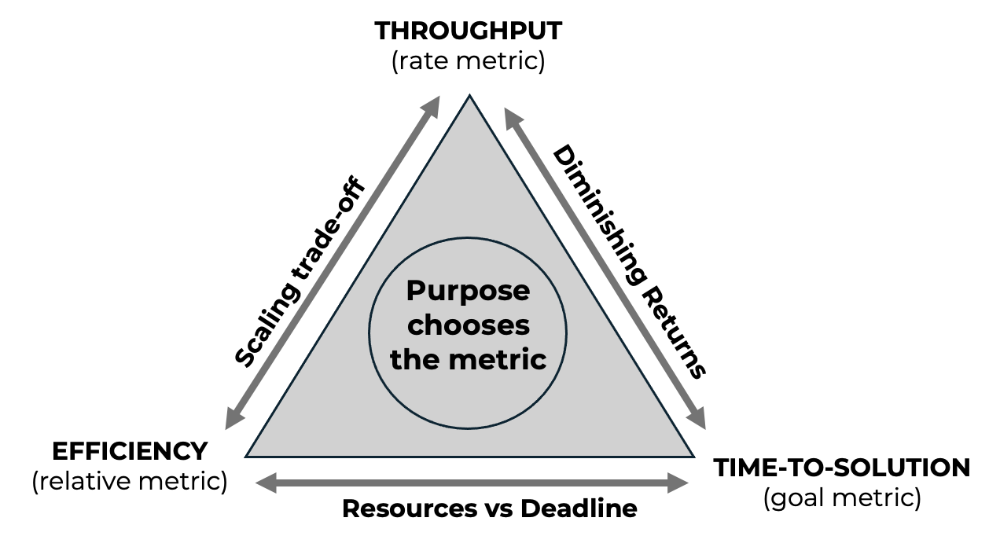

# 16. Cross-Cutting Pattern in Supercomputing for AI

* TOC
{:toc}
 
At this stage of the book, the reader has been exposed to a wide range of performance phenomena, optimization techniques, and scaling behaviors across multiple abstraction layers. Many of these concepts have been introduced incrementally, grounded in concrete experiments and practical case studies rather than as abstract theory.

This chapter represents a deliberate change of perspective. Instead of introducing new mechanisms or tools, it steps back and revisits the material covered so far from a system-level viewpoint. The goal is to make explicit a set of recurring patterns that cut across models, frameworks, and hardware generations, and that repeatedly shape observed performance behavior in supercomputing for AI.

In this sense, the chapter serves both as a synthesis and as a self-assessment. Readers who find that the patterns discussed here resonate naturally with their prior observations have likely internalized the core performance reasoning developed throughout the book. Conversely, if certain patterns feel opaque or difficult to connect to earlier chapters, this is a useful signal to revisit specific experiments or analyses before proceeding further.

This reflective role is intentional. Developing judgment in performance engineering is not about memorizing techniques, but about recognizing familiar system behaviors in new contexts. The patterns presented in this chapter provide a final integrative pass over the book’s core ideas, linking detailed measurements to high-level reasoning and preparing the ground for the forward-looking discussion that follows.

##  Purpose and Scope of This Chapter

Throughout this book, a wide range of techniques, tools, and execution strategies have been introduced to address the challenges of training and scaling artificial intelligence workloads on modern supercomputing platforms. These techniques span multiple abstraction layers, from hardware architecture and programming models to data pipelines, distributed training frameworks, and large language model optimization.

While these topics are presented in a logical progression, many of the underlying principles reappear across chapters, often in different technical forms. The same fundamental tensions—between computation and communication, memory and throughput, performance and cost—surface repeatedly, even as the specific technologies change. This chapter makes those recurring principles explicit.

The goal of this chapter is not to introduce new methods or to extend the technical scope of the book. Instead, it aims to distill a set of cross-cutting patterns that emerge naturally from the experiments, analyses, and case studies presented in earlier chapters. These patterns are independent of any particular framework, model architecture, or hardware generation. They represent structural properties of complex computational systems for AI.

By revisiting familiar material through the lens of these patterns, this chapter provides a unifying perspective on topics such as performance optimization, scalability, and cost–efficiency. Readers are encouraged to view the previous chapters not as isolated technical lessons, but as concrete manifestations of more general system-level behaviors.

This perspective is especially important in a field where tools and best practices evolve rapidly. While specific optimizations may become obsolete, the ability to recognize dominant bottlenecks, reason about overheads, interpret performance metrics correctly, and make informed trade-offs remains essential. These skills form the foundation of sound judgment in supercomputing for AI, and they are the primary focus of the discussion that follows.

The discussion that follows is organized around six cross-cutting patterns that recur throughout the book. These patterns address the inevitability and movement of bottlenecks, the role of overhead amortization in scalability, the distinction between competing performance metrics, the relationship between workload size and scaling behavior, the hidden costs of optimization, and the central role of cost as a first-class constraint.

Each pattern captures a structural property of supercomputing for AI systems that remains valid beyond specific models, frameworks, or hardware generations. While their concrete manifestations may change as technology evolves, the underlying behaviors they describe persist. Together, they form a compact framework for interpreting performance results and for guiding informed decision-making in complex AI training systems.

##  Pattern 1 — Bottlenecks Are Inevitable, and They Move

One of the most persistent misconceptions in performance optimization is the belief that bottlenecks can be eliminated. In practice, bottlenecks are not removed; they are displaced. This pattern appears repeatedly throughout the book and is fundamental to understanding both optimization and scalability in supercomputing for AI.

At any given point in the execution of a training workload, overall performance is constrained by the slowest component of the system. This may be the compute capability of the processor, memory bandwidth, data movement, synchronization overhead, or even seemingly secondary elements such as input preprocessing or logging. Optimizing one component does not make the system bottleneck-free; it merely shifts the limiting factor elsewhere.

This behavior becomes evident early in the book. In introductory experiments, training workloads are often limited by CPU execution, prompting the transition to GPU acceleration. Once computation is offloaded to the GPU, the bottleneck frequently moves to data loading, as seen in experiments where lightweight models fail to fully utilize GPU resources due to insufficient input pipeline throughput. Further optimization of the data pipeline may then expose new limitations, such as kernel launch overheads or memory bandwidth constraints.

As the system evolves, the same pattern continues to manifest at higher levels. When moving from single-GPU to multi-GPU execution, computation is no longer the dominant limitation for many workloads. Instead, communication and synchronization overheads emerge as the primary bottlenecks. Gradient all-reduction, parameter synchronization, and coordination costs increasingly dominate execution time as more devices are added. The system scales, but only until these overheads outweigh the benefits of additional parallelism.

Importantly, the movement of bottlenecks is not a sign of failure. On the contrary, it is often an indication that an optimization has been successful. When a data loader becomes the bottleneck, it implies that computation is fast enough to expose inefficiencies in the input pipeline. When communication dominates distributed training, it implies that computation has been effectively parallelized. Each new bottleneck reveals where the system can be improved next—or where further improvement may no longer be worthwhile.

This pattern also explains why optimizations that appear highly effective in isolation may deliver diminishing returns when combined. Techniques such as mixed precision, or specialized attention mechanisms can significantly accelerate specific parts of the workload. However, once their targeted bottleneck is alleviated, additional gains are limited by other components that were previously hidden. The overall performance improvement is therefore bounded by the next slowest stage in the execution pipeline.

Recognizing this pattern is essential for developing sound judgment in supercomputing for AI. Rather than asking whether a given optimization “works”, the more meaningful question is which bottleneck it addresses and what bottleneck it will expose next. This perspective discourages indiscriminate optimization and encourages a systematic approach: measure, identify the dominant constraint, apply a targeted optimization, and reassess.

Ultimately, performance tuning is an iterative process of bottleneck management. Systems do not converge toward a state without constraints; they evolve toward different limiting factors as workloads, hardware, and execution strategies change. Understanding that bottlenecks are inevitable—and learning to anticipate their movement—provides a stable mental model that remains valid across architectures, frameworks, and generations of AI models.

##  Pattern 2 — Amortization of Overheads Defines Scalability

Scalability is often discussed in terms of parallelism: adding more workers, increasing the number of GPUs, or distributing computation across nodes. However, parallelism alone does not guarantee scalability. The decisive factor is not how much work can be parallelized, but how effectively fixed and weakly scalable overheads can be amortized over that work.

Every training workload includes costs that do not scale proportionally with the amount of computation. Some of these costs are incurred once per run, such as initialization, graph compilation, memory allocation, or dataset indexing. Others recur at each iteration or epoch, including synchronization, communication, logging, and validation. These overheads may be negligible when the computational workload is large, but they become dominant as the amount of useful work per iteration decreases.

This pattern becomes apparent when comparing small and large workloads. Lightweight models or small datasets often exhibit poor scaling behavior, even when parallelized correctly. The reason is not an inherent limitation of the hardware or the training framework, but the inability to amortize overheads effectively. When each training step performs relatively little computation, fixed costs represent a large fraction of the total execution time. Adding more resources reduces computation time, but leaves overheads largely unchanged, leading to diminishing returns.

Conversely, larger models and datasets tend to scale more favorably. In these cases, the computational workload per iteration is substantial, allowing overheads to be spread across more operations. Communication costs, synchronization barriers, and framework-level coordination become proportionally smaller, even if their absolute cost remains constant. This is why deeper models or longer sequences often exhibit better parallel efficiency despite being slower in absolute terms.

The same principle explains the behavior of optimizations that introduce additional upfront costs. Techniques such as just-in-time compilation or kernel specialization often increase the execution time of initial iterations. If the training run is short, these costs may never be recovered, resulting in worse overall performance. If the run is long enough, however, the initial overhead is amortized over many iterations, and the optimization becomes beneficial. Scalability, in this sense, is inseparable from workload duration and repetition.

Amortization also plays a central role in distributed training. Communication and synchronization overheads are unavoidable in synchronous data-parallel execution. Their impact depends not only on network bandwidth or latency, but on how much computation is performed between synchronization points. Larger batch sizes, more complex models, and increased arithmetic intensity all contribute to better amortization of these costs, improving scaling behavior without changing the communication mechanisms themselves.

Understanding scalability through the lens of amortization helps avoid simplistic interpretations of performance results. Poor scaling does not necessarily indicate inefficient implementation, just as good scaling does not automatically imply an optimal system. Both outcomes reflect the balance between useful computation and unavoidable overheads under specific workload conditions.

From a practical perspective, this pattern encourages a shift in focus. Instead of asking how to eliminate overheads—which is rarely possible—the more productive question is how to structure workloads so that overheads matter less. This may involve increasing problem size, batching work more aggressively, or accepting longer execution times in exchange for higher overall efficiency.

Scalability, therefore, is not an intrinsic property of a system in isolation. It emerges from the interaction between workload characteristics, execution strategy, and overhead amortization. Recognizing this relationship is essential for interpreting scaling results correctly and for making informed decisions about when additional parallelism is likely to be effective.

##  Pattern 3 — Throughput, Efficiency, and Time-to-Solution

Performance analysis in supercomputing for AI often relies on a small set of quantitative metrics. Among these, throughput, parallel efficiency, and time-to-solution are the most commonly reported. Although closely related, these metrics capture fundamentally different aspects of system behavior. Confusing them—or treating one as a proxy for the others—can lead to incorrect conclusions and poor engineering decisions.

Throughput measures the rate at which useful work is performed, typically expressed as samples, images, or tokens processed per second. It is a local metric: it describes how fast the system operates at a given scale. Throughput is particularly useful for comparing configurations under identical conditions and for identifying performance regressions. However, it does not capture how much work remains to be done, nor how resource usage scales as the system grows.

Parallel efficiency, by contrast, is a relative metric. It measures how effectively additional resources contribute to performance improvements, usually by comparing observed speedup to ideal linear scaling. Efficiency answers the question of how well resources are being utilized, not how fast the system is in absolute terms. High efficiency indicates that added resources are doing proportionally useful work, but it says nothing about whether the resulting execution time is acceptable or cost-effective.

Time-to-solution focuses on a different objective altogether: how long it takes to complete a given task. This metric aligns most closely with real-world goals, such as meeting training deadlines or iterating rapidly on model development. Time-to-solution integrates all aspects of execution, including overheads, inefficiencies, and initialization costs. A configuration with modest throughput or low efficiency may still be optimal if it minimizes total execution time.

This relationship is summarized schematically in Figure 16.1, which highlights how throughput, efficiency, and time-to-solution represent competing but complementary performance objectives.

These distinctions become critical when interpreting scaling experiments. It is common to observe throughput increasing steadily as more GPUs are added, while time-to-solution improves only marginally beyond a certain point. In such cases, throughput suggests continued gains, but time-to-solution reveals diminishing returns. In this context, diminishing returns refer not to a slowdown in throughput, but to a progressively weaker impact of additional resources on the overall time-to-solution. Parallel efficiency typically declines in this regime, reflecting the growing impact of overheads and synchronization costs.

Focusing on a single metric obscures these trade-offs. Optimizing for throughput alone may encourage aggressive scaling that reduces efficiency and increases cost without meaningful reductions in execution time. Optimizing for efficiency may favor smaller configurations that underutilize available resources and prolong time-to-solution. Optimizing exclusively for time-to-solution may justify configurations that are inefficient or expensive, depending on the context.

The appropriate metric depends on purpose. In exploratory research or interactive development, minimizing time-to-solution is often the primary objective. In shared or resource-constrained environments, efficiency and fair usage may take precedence. In production or large-scale training runs, throughput and cost per unit of work may be the dominant concerns. None of these objectives is universally correct; each reflects a different operational constraint.

This pattern highlights the importance of explicit intent in performance analysis. Metrics do not merely describe system behavior; they encode priorities. Selecting a metric implicitly defines what “good performance” means in a given context. Without making this choice explicit, performance results are easily misinterpreted or misused.

Recognizing that throughput, efficiency, and time-to-solution are distinct—and often competing—metrics enables more nuanced reasoning about system behavior. Rather than asking which configuration is fastest or most efficient in absolute terms, the more meaningful question becomes which configuration best serves a clearly defined goal. This shift from metric maximization to goal alignment is a key step toward sound judgment in supercomputing for AI.

_Figure 16.1 — Relationship between throughput, parallel efficiency, and time-to-solution. These metrics capture different—and often competing—performance objectives. No single metric is universally optimal; the appropriate choice depends on the purpose of scaling and the constraints of the execution context._

##  Pattern 4 — Bigger Workloads Scale Better (But Cost More)

A recurring observation throughout the book is that larger workloads tend to scale more effectively than smaller ones. Deeper models, longer sequences, and larger datasets often exhibit higher parallel efficiency and more favorable scaling behavior. While this may appear counterintuitive—larger problems are, by definition, slower—it reflects a fundamental property of parallel systems rather than an anomaly.

The key reason lies in the ratio between useful computation and unavoidable overheads. As workloads grow, the amount of computation performed per iteration increases, while many sources of overhead remain constant or grow more slowly. Communication, synchronization, and orchestration costs may increase in absolute terms, but they represent a smaller fraction of total execution time. This improves amortization and leads to better scalability, even though absolute training time increases.

This pattern is evident when comparing small and large models. Lightweight architectures often struggle to scale beyond a small number of GPUs because the computation per device is insufficient to hide communication and synchronization costs. In contrast, larger models perform enough computation per iteration to keep devices busy, allowing distributed execution to achieve higher efficiency. The system appears to scale better not because it is faster, but because overheads matter less relative to computation.

A similar effect occurs with dataset size. Training on small datasets limits the number of iterations and the amount of work performed per epoch, making fixed costs more prominent. Larger datasets extend training duration and increase total computation, providing more opportunities to amortize initialization, compilation, and synchronization overheads. As a result, scaling behavior improves, even if the overall cost of training rises.

This relationship highlights an important trade-off. While larger workloads scale better, they also consume more resources and incur higher absolute costs. Improved scalability does not imply improved efficiency in economic terms. A configuration that scales efficiently across many GPUs may still be a poor choice if the additional cost does not align with the intended objective, such as faster iteration or reduced experimentation time.

Misinterpreting this pattern can lead to erroneous conclusions. It is tempting to view good scaling behavior as evidence that a workload is well suited for large-scale execution. In reality, scalability must be evaluated in context. A large model that scales efficiently may still be inappropriate for a given task if its training cost outweighs its benefits. Conversely, a smaller model with poor scaling characteristics may be the better choice when resources are limited or rapid iteration is required.

This pattern also reinforces the importance of separating technical scalability from practical utility. Systems are often optimized to demonstrate strong scaling behavior on large workloads, but real-world constraints—such as budget, availability, and time-to-solution—ultimately determine whether such scaling is justified. Bigger workloads provide a more favorable environment for parallel execution, but they also raise the stakes of every optimization decision.

Understanding that larger workloads scale better, but at a higher cost, helps frame scalability results correctly. It shifts the focus from celebrating efficient scaling to evaluating whether that efficiency translates into meaningful advantages for the task at hand. This distinction is essential when moving from performance analysis to decision-making in supercomputing for AI.

##  Pattern 5 — Optimization Has a Cost Beyond Performance

Performance optimizations are often presented as unqualified improvements: techniques that make training faster, more efficient, or more scalable. In practice, every optimization carries costs that extend beyond raw performance metrics. These costs are not always visible in benchmark results, but they play a decisive role in real-world systems and long-lived projects.

Some costs are technical. Advanced optimizations frequently increase system complexity, introducing additional dependencies, custom kernels, or nonstandard execution paths. While these changes may improve performance under specific conditions, they can reduce portability across hardware platforms, complicate deployment, and increase the effort required to maintain or debug the system. What appears as a simple configuration change in a controlled experiment may translate into significant operational overhead in production or shared environments.

Other costs are cognitive. Each optimization adds to the conceptual burden placed on developers and users of the system. Understanding when an optimization applies, how it interacts with other components, and how to diagnose failures requires expertise. As the number of optimizations grows, so does the risk of misconfiguration and misinterpretation of results. This is particularly relevant in educational and collaborative settings, where clarity and reproducibility are often more valuable than marginal performance gains.

There are also opportunity costs. Time spent integrating, tuning, and validating complex optimizations is time not spent on model development, experimentation, or analysis. For short training runs or exploratory work, these costs may outweigh any performance benefits. Optimizations that require significant upfront effort are most effective when their benefits can be amortized over long executions or repeated runs.

This pattern is evident in several case studies throughout the book. Techniques such as mixed precision offer a favorable balance between performance gains and complexity, making them widely applicable. In contrast, more specialized optimizations—such as custom attention kernels—can deliver impressive speedups, but only under specific workload characteristics and hardware configurations. Their value depends not only on how much they accelerate execution, but on how often and how reliably they can be applied.

Ignoring these broader costs can lead to over-optimization. Systems become fragile, difficult to reason about, and tightly coupled to particular software or hardware stacks. In such cases, performance improvements come at the expense of flexibility and robustness. This trade-off is rarely captured in performance charts, yet it strongly influences the long-term viability of a solution.

A more balanced approach treats optimization as a selective process rather than an accumulation of techniques. Instead of asking which optimizations are available, the more relevant question is which optimizations are justified given the workload, the execution environment, and the intended lifespan of the system. Often, the most effective decision is to stop optimizing once the dominant constraints have shifted to factors that cannot be addressed cheaply or reliably.

Recognizing that optimization has costs beyond performance encourages restraint and prioritization. It shifts the focus from maximizing metrics to managing complexity, effort, and risk. This perspective is essential for transitioning from experimental performance tuning to sustainable engineering practice in supercomputing for AI.

##  Pattern 6 — Cost Is a First-Class Constraint, Not an Afterthought

In many performance discussions, cost is introduced late, if at all. Systems are first optimized for speed, scalability, or efficiency, and only afterward is cost considered as a secondary concern. In real-world supercomputing for AI, this ordering is often reversed. Cost is not a byproduct of technical decisions; it is a primary constraint that shapes them from the beginning.

Cost manifests in multiple forms. Direct financial cost, such as GPU hours or node allocations, is the most visible. However, indirect costs—engineering effort, system complexity, maintenance, and opportunity cost—are equally influential. Decisions that appear optimal from a purely technical standpoint may become unjustifiable once these broader costs are accounted for.

This pattern becomes especially clear when scaling large models. Adding more GPUs almost always increases throughput, but it rarely reduces cost proportionally. Beyond a certain point, improvements in time-to-solution are marginal, while resource consumption continues to grow. The result is a regime in which additional scale accelerates execution but degrades cost-efficiency. Recognizing this transition is essential for responsible system design.

Cost considerations also influence which optimizations to implement. Techniques that deliver modest speedups at the expense of significant complexity may be attractive in benchmark-driven contexts, but impractical in shared environments or long-term projects. Conversely, optimizations that offer predictable gains with minimal integration effort—such as changes in precision or batch size—often provide the best return on investment, even if they do not maximize absolute performance.

Importantly, cost is inseparable from purpose. The same configuration may be entirely appropriate in one context and unacceptable in another. For time-critical workloads, higher cost may be justified to achieve faster results. For exploratory research or routine retraining, it may be just the opposite. Treating cost as a first-class constraint forces these priorities to be stated explicitly, rather than inferred implicitly from performance metrics alone.

This perspective also clarifies why there is rarely a single “best” configuration. Optimality depends on constraints that extend beyond the technical system, including budget, availability, and organizational goals. Performance analysis that ignores these factors risks producing solutions that are impressive in isolation but ineffective in practice.

By integrating cost considerations throughout the optimization and scaling process, system designers move from reactive tuning to deliberate decision-making. Instead of asking how much performance can be extracted from a system, the more meaningful question becomes how much performance is worth paying for. This shift in perspective marks the transition from performance experimentation to engineering judgment.

At this point, it is useful to make explicit how the patterns discussed in this chapter relate to the Foundational Performance Principles introduced earlier in the book. Table 16.1 summarizes this relationship, highlighting the dominant diagnostic lens associated with each pattern and the typical actions that follow from applying it.

| **Pattern** | **Primary diagnostic lens** | **Secondary lenses** | **Typical symptom** | **Typical next action** |
|----|----|----|----|----|
| Pattern 1 — Bottlenecks Are Inevitable, and They Move | Balanced Pipelines | Amortization of Overheads | One component is saturated while others remain idle (e.g., GPUs waiting for data or synchronization). | Measure pipeline stages, identify the dominant bottleneck, and rebalance the workflow rather than optimizing blindly. |
| Pattern 2 — Amortization of Overheads Defines Scalability | Amortization of Overheads | Balanced Pipelines | Poor scaling despite correct parallelization; diminishing returns as resources increase. | Increase useful work per iteration (larger batches, larger models, longer runs) or accept limited scalability. |
| Pattern 3 — Throughput, Efficiency, and Time-to-Solution Are Not the Same Thing | Scale Must Serve Purpose | Balanced Pipelines | Conflicting conclusions depending on which metric is emphasized (e.g., high throughput but poor efficiency). | Explicitly define the objective (time, efficiency, cost) and select metrics aligned with that purpose. |
| Pattern 4 — Bigger Workloads Scale Better (But Cost More) | Amortization of Overheads | Scale Must Serve Purpose | Large models or datasets show better scaling but incur much higher total cost. | Evaluate whether improved scalability justifies increased resource consumption and execution cost. |
| Pattern 5 — Optimization Has a Cost Beyond Performance | Hardware–Software Co-Design | Scale Must Serve Purpose | Performance improves, but system becomes fragile, complex, or difficult to maintain. | Prefer optimizations with favorable cost–benefit trade-offs; avoid unnecessary specialization. |
| Pattern 6 — Cost Is a First-Class Constraint, Not an Afterthought | Scale Must Serve Purpose | Hardware–Software Co-Design | Additional resources improve performance but degrade cost-efficiency. | Align scale with explicit objectives and constraints; stop scaling when marginal gains no longer justify the cost. |

_Table 16.1 — Relationship between cross-cutting patterns and the Foundational Performance Principles. Each pattern highlights a dominant diagnostic lens while often activating additional principles simultaneously. The table summarizes typical symptoms observed in practice and the corresponding actions that follow from applying the appropriate lens._
 
 

While Table 16.1 provides a conceptual mapping, practitioners often encounter performance issues in the form of concrete symptoms rather than abstract principles. Table 16.2 therefore presents a diagnostic cheat sheet that links common observed behaviors to likely underlying constraints and appropriate next steps.

| **Observed behavior** | **Likely dominant constraint** | **Relevant pattern / lens** | **What to measure next** | **Typical decision or action** |
|----|----|----|----|----|
| GPU utilization is low while CPUs are busy | Input pipeline imbalance (data loading / preprocessing) | Pattern 1 — Bottlenecks Move (Balanced Pipelines) | DataLoader time, CPU utilization, I/O throughput | Optimize data loading, increase num_workers, overlap I/O and compute. |
| Throughput plateaus as batch size increases | Memory bandwidth or pipeline saturation | Pattern 1, Pattern 2 (Amortization) | GPU memory bandwidth, kernel execution timeline | Stop increasing batch size; optimize kernels or accept the limit. |
| Scaling to more GPUs increases throughput but barely reduces training time | Overhead-dominated regime | Pattern 2, Pattern 3 (Amortization, Purpose) | Breakdown of iteration time (compute vs sync vs overhead) | Reconsider scale; focus on time-to-solution rather than throughput. |
| Parallel efficiency drops sharply with additional GPUs | Communication and synchronization overheads | Pattern 1, Pattern 4 (Balanced Pipelines) | Gradient synchronization time, network utilization | Reduce GPU count, increase workload per GPU, or change parallel strategy. |
| First iterations are significantly slower than steady state | Compilation or initialization overhead | Pattern 2 (Amortization) | Time per iteration over epochs | Enable optimization only for long runs; amortize warm-up costs. |
| Performance improves but system becomes complex or fragile | Excessive specialization | Pattern 5 (Hardware–Software Co-Design) | Debug effort, portability issues, maintenance cost | Prefer simpler optimizations with predictable benefits. |
| Larger models scale better than smaller ones | Better amortization of overheads | Pattern 4 (Amortization) | Compute-to-communication ratio | Accept higher cost only if scaling benefits align with goals. |
| Best-performing configuration is also the most expensive | Cost–performance misalignment | Pattern 6 (Scale Must Serve Purpose) | Cost per epoch / cost per experiment | Choose configuration aligned with budget and objective, not peak performance. |
| Conflicting conclusions depending on the chosen metric | Metric–purpose mismatch | Pattern 3 (Scale Must Serve Purpose) | Compare throughput, efficiency, and time-to-solution | Explicitly define the primary objective and re-evaluate results. |

_Table 16.2 — Diagnostic cheat sheet linking observed performance behaviors to underlying constraints and corrective actions.The table provides a practical guide for interpreting common performance symptoms by identifying the dominant constraint, the relevant cross-cutting pattern, and the next diagnostic or decision step._

##  From Patterns to Judgment

The patterns discussed in this chapter are not independent observations, nor are they specific to a particular model, framework, or hardware platform. Together, they describe a coherent way of reasoning about AI workloads as complex computational systems. Their value lies not in predicting exact performance outcomes, but in guiding decisions when outcomes are uncertain, constraints are competing, and trade-offs are unavoidable.

Viewed in isolation, many of the techniques presented throughout this book can appear deceptively simple. Increasing batch size, enabling mixed precision, activating specialized kernels, or scaling across multiple GPUs are often reduced to configuration choices. However, the patterns revealed across chapters show that these choices are rarely neutral. Each decision reshapes the system, exposes new bottlenecks, alters cost dynamics, and changes the meaning of performance metrics.

Developing judgment in supercomputing for AI means learning to recognize these interactions. It involves understanding not only what a system can do, but what it should do under given constraints. This distinction becomes increasingly important as systems grow in scale and complexity. At small scales, inefficiencies are often tolerable. At large scales, they compound rapidly, transforming minor design choices into significant costs.

The progression from execution to interpretation, and from interpretation to decision-making, mirrors the evolution of expertise in the field. Beginners focus on making systems run. Intermediate practitioners focus on making them faster. Experienced engineers and researchers focus on making them *appropriate*. Appropriateness, in this context, is defined not by maximal performance, but by alignment with purpose, resources, and long-term sustainability.

These patterns also highlight why transferable understanding matters more than familiarity with specific tools. Frameworks evolve, hardware architectures change, and optimization techniques are replaced or refined. What remains constant is the need to reason about bottlenecks, overheads, metrics, scalability, and cost. These patterns reflect the same four diagnostic lenses introduced earlier in the book, now observed at full system scale rather than in isolation.

Ultimately, judgment in supercomputing for AI emerges from the ability to integrate measurement with interpretation, and interpretation with intent. The goal is not to eliminate constraints, but to navigate them consciously. This mindset transforms performance analysis from a reactive exercise into a strategic one, grounded in an understanding of system behavior rather than in isolated benchmarks.

The remainder of this book looks forward, exploring emerging trends and future directions in AI and supercomputing. The patterns summarized here provide a stable foundation for that discussion. They serve as a reminder that while tools and techniques may change, the principles governing complex systems—and the judgment required to work with them—endure.

Taken together, these patterns reflect a deeper shift in where engineering effort and risk now reside. As the marginal cost of writing code collapses, performance becomes the scarce resource. The difficulty is no longer in making systems run, but in making them run *well*: efficiently, scalably, and with an explicit understanding of cost.

In this context, the patterns presented in this chapter are not optimization guidelines, but safeguards against a new class of failure. They exist to counteract the illusion of scalability, to expose cost blindness, and to prevent decisions that are correct at the code level but unsound at the system level. Performance, in this sense, is no longer a secondary concern or a late-stage refinement. It is the primary constraint that determines whether modern AI workloads are viable, sustainable, and economically defensible.

Developing judgment, therefore, means learning to recognize when performance—not correctness—is the limiting factor. This is the skill that connects all layers of the book, from low-level execution to large-scale training workflows, and it is the reason why supercomputing remains central in the era of generative AI.

##  Key Takeaways from Chapter 16

- Performance behavior in supercomputing for AI is governed by recurring system-level patterns, not by isolated techniques. The same structural constraints reappear across models, frameworks, and hardware generations, even as their technical manifestations change.

- Bottlenecks are inevitable and dynamic. Optimization does not eliminate constraints; it displaces them. Effective performance tuning requires continuous measurement and reassessment rather than one-time fixes.

- Scalability is fundamentally about amortizing overheads. Fixed and weakly scalable costs —such as synchronization, communication, and initialization— define when parallelism is effective and when it yields diminishing returns.

- Throughput, parallel efficiency, and time-to-solution capture different objectives and should not be conflated. No single metric is universally optimal. The appropriate metric depends on the purpose of scaling and the constraints of the execution context.

- Larger workloads tend to scale better, but at a higher absolute cost. Improved scalability does not imply improved cost-effectiveness. Technical scalability must always be evaluated in light of resource consumption and intended goals.

- Optimization carries costs beyond raw performance gains. Increased complexity, reduced portability, cognitive overhead, and maintenance effort are integral parts of optimization decisions and must be weighed explicitly.

- Cost is a first-class constraint in real-world AI supercomputing. Scaling decisions that ignore cost risk producing solutions that are impressive in benchmarks but unjustifiable in practice.

- The Foundational Performance Principles operate simultaneously at full system scale. The cross-cutting patterns presented in this chapter reflect the same diagnostic lenses introduced earlier in the book, now applied to complex, end-to-end AI training systems.

- Judgment emerges from aligning measurement, interpretation, and purpose. Mature performance engineering is not about maximizing metrics, but about making informed decisions under competing constraints.
