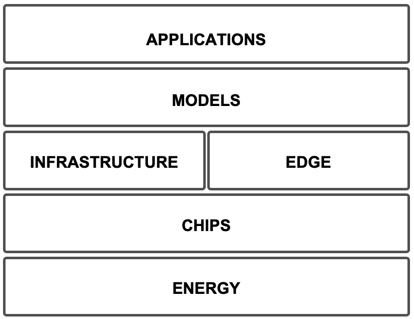

# Looking Forward: Supercomputing and AI Futures

This final chapter steps back from the detailed technical material developed throughout the book and adopts a forward-looking perspective. Its goal is not to predict the future of artificial intelligence or supercomputing, nor to introduce new technical mechanisms, but to help reinterpret and connect what you have already learned within a broader technological context that increasingly extends beyond software and algorithms into physical, economic, and systemic constraints.

Throughout this book, we have explored how modern AI systems are trained, scaled, and optimized on high performance computing platforms. Implicitly, these discussions have traversed multiple layers of a complex technological stack—from physical hardware constraints to high-level learning paradigms. In this chapter, we make that structure explicit and use it as a lens for reflection rather than as a rigid taxonomy or a prescriptive model.

To organize the diverse themes discussed here, we adopt a simple conceptual perspective that helps structure the technological landscape of contemporary AI systems. Rather than proposing a standardized or widely accepted framework, one useful way to make sense of these developments i n a manner that is intentionally pragmatic rather than exhaustive is to think in terms of a small number of interrelated layers: *Energy, Chips, Infrastructure, Edge, Models, and Applications*. Each layer introduces its own constraints, opportunities, and research questions, and progress at one layer often reshapes what is possible at the others. Importantly, these layers should not be read as isolated compartments: in practice, their boundaries are increasingly blurred, particularly between infrastructure, models, and applications as well as between centralized and decentralized execution environments.

Figure 17.1 provides a conceptual map of this layered view and shows how the topics discussed in this chapter align with each layer. The sections that follow explore a selection of emerging trends within this framework. Some focus on foundational constraints, such as energy availability or hardware evolution; others examine how new learning paradigms and deployment models are redefining the boundary between training, inference, and application across cloud, supercomputing, and edge environments.

Together, these sections offer a structured way to think about the future of AI and supercomputing, and to connect the technical skills developed in earlier chapters with the broader system-level challenges that lie ahead. These topics are intentionally open-ended. They are meant to stimulate reflection, discussion, and further exploration—inviting you not only to understand current systems, but also to imagine how the next generation of AI infrastructures may be designed, operated, and used under real-world constraints of energy, cost, scale, and purpose.

Figure 17.1 – A system-level view of artificial intelligence, organizing the forward-looking topics of Chapter 17.

From the perspective of this book, many of the trends discussed in this chapter can be read as system-scale reappearances of the Foundational Performance Principles introduced earlier. The goal is not to “apply the principles” mechanically, but to use them as a lens for recognizing recurring constraints as the scope expands. The underlying logic of performance remains recognizable, while the dominant bottlenecks move upward in scale: overheads become infrastructure overheads, co-design expands from kernels to facilities, balanced pipelines become end-to-end learning and deployment loops, and scaling becomes inseparable from purpose, cost, and sustainability.

##  Energy: The New Bottleneck

Throughout the previous chapters of this book, performance optimization has been framed largely in terms of computational efficiency: increasing FLOPS utilization, improving memory bandwidth, reducing communication overhead, and scaling workloads across CPUs and GPUs. In all these cases, the limiting factors remained internal to the computing system itself. Today, however, the dominant constraint is increasingly external to the machine: energy.

This shift reinforces the logic behind Foundational Performance Principle \#4 (Scale Must Serve Purpose). At the scale of modern AI, the limiting question is no longer only “how fast can we run?” but “what level of scale is justified under energy, cost, and sustainability constraints?” In this regime, efficiency must be interpreted as value delivered per unit of energy and infrastructure—not simply higher utilization of compute units.

This shift marks a qualitative change: optimization is no longer confined to architectural or algorithmic choices, but is constrained by resources that lie outside the boundaries of the computing system. When we speak about energy as a bottleneck, we are not referring to electricity alone. Energy acts as the visible interface of a broader material system—one that includes *raw materials**, construction, water, cooling infrastructure, land use, and global supply chains.*

Several public projections, including U.S. government analyses, suggest that electricity demand from data centers in the United States could double by 2028 under high-growth scenarios. This growth is unprecedented in terms of infrastructure requirements and raises fundamental questions about sustainability, regulation, and long-term feasibility. As a result, energy availability has emerged as a first-order design constraint for AI systems—on par with hardware architecture, software efficiency, and algorithmic design.

Crucially, these constraints are tightly coupled. Power can, in principle, be generated; but cooling requires water, chips require rare and energy-intensive materials, and data centers require vast quantities of steel, concrete, and land. In practice, energy constraints cannot be separated from the material footprint of computation.

Furthermore, energy is not only a physical constraint, but also a financial one: it commits AI infrastructures to long-term operational costs that must be sustained throughout the lifetime of rapidly depreciating hardware. AI data centers are increasingly financed and planned like long-lived energy infrastructure, while the computational hardware they host depreciates on timescales closer to consumer electronics. This mismatch introduces a fundamental tension between capital investment, operating costs, and technological obsolescence.

In response, the technology industry is exploring a range of energy strategies. These include on-site power generation using solar arrays and microgrids, grid-interactive UPS  systems capable of returning energy during peak demand, and—more controversially—the development of small modular nuclear reactors (SMRs) . GE Vernova and Hitachi, for example, have signed early-stage agreements to deploy SMRs in Canada by 2029, with similar initiatives under study in Finland and Sweden.

Despite this interest, SMRs remain a medium- to long-term prospect. Although companies such as Oracle and Microsoft have signed memoranda of understanding with SMR vendors, no reactors are currently operational for data center use, and first deployments are not expected before 2027. Most experts anticipate that large-scale adoption of nuclear-powered data centers will not occur before the mid-2030s, due to regulatory approval processes, construction timelines, and integration challenges.

In the near term, many large AI data center projects are expected to rely heavily on dispatchable generation (often natural-gas-based), simply because it can be deployed quickly at scale. Regardless of the specific energy mix, the direction is clear: what once appeared primarily as a software and hardware scaling problem—limited by GPUs, memory capacity, or interconnect bandwidth—now extends into civil engineering, energy policy, geopolitics, and long-term infrastructure planning.

The limiting factor is no longer how fast we can compute, but how sustainably we can supply, finance, and operate the physical systems that computation depends on. For HPC and AI practitioners, energy thus becomes a boundary condition that reshapes not only how systems are built, but also how their economic viability is evaluated over time. Efficiency, in this context, is no longer measured solely in FLOPS per second, but in useful intelligence delivered per unit of energy, material, and cost.

Task 17.1 — Powering the Future of AI

This task explores energy as a first-order constraint in large-scale AI and supercomputing infrastructures.

*Descriptive component*

Investigate the energy strategies currently being proposed or deployed to support large-scale AI data centers. Focus on concrete, real-world initiatives such as solar microgrids, battery storage systems , gas turbines, or small modular nuclear reactors (SMRs). For each approach, describe its basic operating principles, deployment scale, and current level of maturity. Identify at least one major organization or company pursuing each strategy.

*Critical component*

Assess the feasibility and limitations of these energy solutions. Consider factors such as deployment timelines, regulatory barriers, environmental impact, scalability, and long-term sustainability. Which solutions appear viable in the short term, and which are realistically medium- or long-term options? What trade-offs do they introduce?

*HPC connection*

Reflect on how energy constraints alter the traditional performance-centric view of HPC discussed in earlier chapters. How does the emergence of energy as an external bottleneck influence system design choices, workload scheduling, performance metrics, and optimization priorities in supercomputing for AI? In what sense does energy redefine what “efficient” computing means at scale?

Prepare a presentation of your findings following the format guidelines used in class, and be ready to present and discuss your conclusions.

##  Chips: Quantum and Heterogeneous Accelerators

Quantum computing is often presented as a potential breakthrough capable of overcoming the scaling limits of classical computation. In theory, quantum processors promise exponential speedups for very specific classes of problems, particularly in areas such as linear algebra, combinatorial optimization, and physical simulation. From the perspective of AI and supercomputing, however, it is essential to frame this promise correctly: the relevance of quantum computing today is primarily architectural rather than algorithmic for general-purpose AI. 

In this sense, quantum computing should be understood not as a replacement for existing accelerators, but as a potential contributor to a broader strategy of heterogeneity.

This section revisits Foundational Performance Principle \#2 (Hardware–Software Co-Design Matters) at architectural scale. As systems become more heterogeneous, performance depends less on any single device and more on the software stack’s ability to express, schedule, and orchestrate computation across different hardware capabilities and communication paths. The practical challenge is therefore not only raw compute, but programmability and integration: making diverse accelerators participate in measurable, end-to-end speedups.

At the Barcelona Supercomputing Center, Spain’s first public quantum computer—developed entirely with European technology—is being integrated into the MareNostrum 5 infrastructure. This system is modest in scale, consisting of two chips with only a small number of qubits and operating at cryogenic temperatures. Its importance does not lie in raw performance, but in its role as an experimental platform for hybrid workflows that combine classical HPC systems with quantum coprocessors.

For a general audience, two core quantum concepts are sufficient to understand both the promise and the limitations. First, quantum bits—or qubits—can represent both 0 and 1 simultaneously through superposition. Second, qubits can share state through entanglement, enabling forms of correlation and parallelism that have no classical equivalent. In principle, these properties allow certain computations to be expressed more efficiently than on classical machines. In practice, however, today’s quantum processors remain highly constrained by noise, short coherence times, limited qubit counts, and substantial error rates.

As a result, quantum processing units (QPUs)   are not positioned to compete with GPUs or TPUs for mainstream AI training or inference. Instead, the emerging consensus is that they will complement existing architectures by accelerating narrowly defined subroutines within larger workflows.  
This perspective aligns with a broader trend in AI hardware: rather than scaling a single dominant accelerator indefinitely, future systems increasingly rely on heterogeneous components to improve efficiency, utilization, and cost per useful operation.

From an HPC perspective, this framing is crucial. The near-term challenge is not to replace classical supercomputers, but to integrate quantum devices into heterogeneous systems in a way that is meaningful, measurable, and programmable. Whether quantum computing ultimately delivers practical acceleration for AI remains an open question. What is already clear, however, is that it is becoming part of the architectural landscape that future supercomputing systems must accommodate.

Task 17.2 — Charting the Role of Quantum in Future Supercomputing

This task examines quantum computing as an emerging architectural component within heterogeneous HPC systems.

*Descriptive component*

Investigate the current state of quantum computing as it relates to high performance computing and artificial intelligence. Identify at least one national or commercial quantum system that is being integrated into an HPC infrastructure. Describe the characteristics of the system (qubit technology, scale, operating conditions) and the types of hybrid algorithms or workflows being explored.

*Critical component*

Assess the realistic impact of quantum computing on AI workloads. Which problem classes are plausible candidates for quantum acceleration, and which are clearly not? Discuss the main technical barriers—such as noise, error correction, limited qubit counts, and programming complexity—that currently prevent quantum processors from competing with GPUs or TPUs for general-purpose AI.

*HPC connection*

Reflect on the architectural implications of integrating quantum processors into supercomputing systems. How does the presence of QPUs reinforce the trend toward increasingly heterogeneous architectures? In what sense does quantum computing extend, rather than disrupt, the design principles of modern HPC systems discussed throughout this book?

Prepare a presentation of your findings following the format guidelines used in class, and be ready to present and discuss your conclusions.

##  Infrastructure: Megascale AI Data Center

The infrastructure supporting artificial intelligence is evolving at an unprecedented pace. What once qualified as cutting-edge high performance computing has now become the strategic backbone of AI roadmaps at global scale. Companies are no longer merely adopting HPC technologies—they are designing entire data center campuses around them, optimized specifically for large-scale model training and deployment.

Recent examples illustrate the direction of this shift. xAI is building a facility in Memphis, named *Colossus*, designed to host up to 200,000 GPUs. Oracle Cloud Infrastructure has announced supercluster offerings providing more than 130,000 specialized GPUs per tenancy, explicitly targeting large foundation model training. Meta has revealed plans to invest hundreds of billions of dollars in AI infrastructure, including data centers approaching the physical footprint of a small city.

The magnitudes being discussed are striking not only in their raw scale, but in what they signal. They reflect a structural transformation: artificial intelligence has outgrown its origins in software architecture and algorithm design. Today, progress in AI depends on the coordinated design of compute nodes, interconnects, storage systems, cooling technologies, energy provisioning, supply chains, and physical construction. AI development has become inseparable from large-scale infrastructure engineering.

This is a system-level reappearance of Foundational Performance Principle \#1 (Amortization of Overheads). At megascale, fixed costs shift from “launch overhead” to facilities overhead: power delivery, cooling, networking, construction, and operations. Such investments only make sense when workloads and utilization are sufficient to amortize them over sustained, long-lived demand—which in turn makes Foundational Performance Principle \#4 unavoidable: scale must be justified by a concrete purpose and an economic model, not assumed as an automatic path to progress.

At the same time, this trajectory raises a critical question: whether increasing scale alone leads to sustainable progress, or whether economic and temporal limits eventually dominate purely technical considerations. As infrastructure grows, each additional unit of compute carries not only higher capital cost, but also rising marginal costs in energy, cooling, land use, and operations—challenging the assumption that scale automatically translates into proportional gains in capability.

From the perspective of this book, this evolution introduces an important contrast. Public HPC centers—such as national supercomputing facilities—have traditionally been designed to serve a broad scientific community, supporting diverse workloads under shared-access models, with strong emphasis on fairness, efficiency, and reproducibility. In contrast, emerging private “AI factories” are vertically integrated, application-driven infrastructures, optimized for rapid iteration, continuous training, and proprietary model development.

These industrial installations are often financed and operated under assumptions closer to large-scale utilities, even though their core hardware components follow much shorter innovation and depreciation cycles. GPUs and accelerators are replaced on timescales of a few years, while the surrounding infrastructure—buildings, power delivery, cooling, and grid connections—is expected to operate over decades. This mismatch introduces significant economic risk and places pressure on organizations to continuously expand scale and utilization in order to justify prior investments.

This distinction is not a matter of superiority or deficiency, but of purpose. Public supercomputers like MareNostrum 5, which have played a central role throughout this book, now appear modest in scale when compared to these industrial installations. Yet they remain essential environments for open research, methodological innovation, and education. Together, public HPC systems and private AI factories define complementary poles of the modern AI infrastructure landscape.

Seen from a system-level perspective, the current race toward ever-larger data centers risks fostering an illusion of infinite scalability: a belief that intelligence will continue to improve simply by adding more hardware. In practice, diminishing returns, rising costs, and physical constraints increasingly shape what is achievable.

Understanding this coexistence—and the different constraints, incentives, and design choices that shape it—is essential for anyone seeking to work at the intersection of supercomputing and artificial intelligence in the years ahead.

Task 17.3 — Exploring the New Giants of Compute

This task examines the emergence of megascale AI infrastructure and its implications for the future of supercomputing.

*Descriptive component*

Investigate the current state of the world’s largest AI-focused data centers. Select two or three leading projects and describe their scale, hardware composition (GPUs, interconnects, storage), energy infrastructure, and primary intended applications. Highlight the design choices that distinguish these facilities from traditional HPC systems.

*Critical component*

Analyze the challenges associated with megascale AI infrastructure. Consider factors such as energy consumption, cooling, supply-chain dependency, operational cost, and system reliability. Discuss whether increasing scale alone is sufficient to sustain long-term progress in AI, or whether new bottlenecks inevitably emerge.

*HPC connection*

Reflect on the relationship between public HPC centers and private AI factories. How do their goals, access models, and design constraints differ? In what ways are they complementary, and where do tensions arise? Based on the concepts developed throughout this book, discuss what role public supercomputing infrastructures may continue to play in an era dominated by industrial-scale AI systems.

Prepare a presentation of your findings following the format guidelines used in class, and be ready to present and discuss your conclusions.

##  Edge: The Decentralization of Inference 

While training frontier-scale models continues to concentrate compute in a small number of massive data centers, inference is increasingly moving in the opposite direction. Instead of executing every model query in centralized cloud infrastructure, a growing share of AI workloads is shifting toward the edge: laptops, smartphones, industrial gateways, on-premise servers, vehicles, and distributed micro-infrastructures located close to where data is generated and decisions must be made.

The motivation for this shift is not only technical, but also economic and strategic. From a technical standpoint, edge inference can dramatically reduce latency, enabling real-time interaction in applications such as robotics, autonomous systems , interactive assistants, and safety-critical industrial monitoring. It also improves resilience: when connectivity is limited, intermittent, or costly, local inference allows systems to operate reliably without continuous dependence on the cloud. In parallel, privacy, regulatory, and data-sovereignty constraints increasingly favor local processing, especially when dealing with sensitive information such as health data, financial records, personal devices, or industrial telemetry.

From an economic perspective, inference at scale is fundamentally an operational cost problem. Once a model is deployed, the cost of serving millions of queries can dominate the total lifetime cost of the system.

At this stage, the key question is no longer how powerful a model is, but how efficiently intelligence can be delivered per unit of energy, latency, and cost. Inference shifts the focus from peak performance to cost and efficiency per delivered query.

This is where the logic of “scale must serve purpose” reappears in the opposite direction: instead of scaling up in centralized facilities, the “right” decision may be to scale out toward the edge when latency, privacy, resilience, or cost per query dominate. In this context, performance must be interpreted as delivered intelligence under strict constraints—energy envelope, memory capacity, and responsiveness—rather than maximum throughput alone.

Executing inference closer to the user can reduce cloud expenditure, network traffic, and energy consumption, leading to more sustainable deployment models. The result is a hybrid reality: training remains centralized, but inference becomes progressively decentralized, combining cloud services, regional data centers, and edge devices depending on performance, cost, and policy constraints. Rather than assuming that all intelligence must reside in centralized “AI factories,” this model recognizes that value is often created at the periphery, where intelligence meets context, users, and real-world constraints.

Inference at the edge, however, is not free. Edge hardware operates under tight constraints in memory capacity, power envelope, and sustained throughput. These constraints reshape the model design space and motivate a family of techniques that trade accuracy, generality, or flexibility for deployability. Quantization reduces numerical precision to compress models and accelerate execution. Distillation transfers capabilities from large teacher models to smaller student models. Pruning and sparsity eliminate redundant computation. Caching strategies and speculative decoding reduce the cost per generated token.

In parallel, a new generation of accelerators— mobile NPUs (Neural Processing Units)  , inference-optimized GPUs, and specialized system-on-chips—aims to make local inference economically and thermally viable. These accelerators are optimized not for peak compute, but for sustained inference efficiency, minimizing data movement and energy consumption at the system level—shifting the definition of performance from FLOPS to delivered intelligence per watt.

These techniques reflect a broader shift in mindset: progress is no longer driven solely by making models larger, but by making them more efficient, more targeted, and more context-aware. In many applications, smaller and well-adapted models can deliver greater practical value than frontier-scale systems deployed indiscriminately.

Crucially, this shift does not imply the disappearance of high performance computing. Rather, it redefines its role. HPC systems increasingly act as preparation and validation environments, where models are trained, compressed, benchmarked, stress-tested, and packaged for deployment. Supercomputing centers become places where inference-ready models are shaped—evaluated not only for accuracy, but also for latency, energy efficiency, robustness, and deployment constraints—before being pushed toward diverse edge ecosystems.

For students of HPC for AI, this evolution complements the training-centric focus of earlier chapters. It highlights that performance questions do not end when a model converges. They continue in deployment, where bottlenecks change, trade-offs become explicit, and systems engineering decisions ultimately determine whether AI systems are usable, affordable, and sustainable at scale.

In this sense, the decentralization of inference represents a pragmatic response to the limits of infinite scaling: intelligence does not need to be everywhere at once, but it does need to be where it matters.

Task 17.4 — Bringing Inference to the Edge

This task explores the decentralization of AI inference and its implications for high performance computing.

*Descriptive component*

Explain how and why inference workloads are moving away from centralized cloud data centers toward the edge, including personal devices, local servers, and distributed micro-infrastructures. Describe the technical and economic motivations behind this shift, focusing on latency, privacy, connectivity constraints, energy efficiency, and cost per query. Provide two or three representative deployment scenarios where local inference is clearly beneficial.

*Critical component*

Analyze the limitations and trade-offs associated with edge inference. Discuss constraints related to model size, memory bandwidth, thermal limits, accuracy degradation, update and maintenance complexity, and hardware heterogeneity. Reflect on how these constraints reshape model design and deployment strategies.

*HPC connection*

Discuss how the move toward edge inference redefines the role of HPC systems. If training remains centralized, what new responsibilities emerge for supercomputing centers in model compression, benchmarking, validation, and deployment readiness? How do the techniques developed throughout this book—precision reduction, performance profiling, and system-level optimization—support this transition?

Prepare a presentation of your findings following the format guidelines used in class, and be ready to present and discuss your conclusions.

##  Models: Beyond Big Data Toward Experience

As we move beyond the era of big data, a new frontier is emerging: the era of experience. Large-scale AI models have already absorbed a substantial fraction of the human-authored content available online. As a result, the marginal gains from passive data ingestion are diminishing, prompting a fundamental shift in how artificial intelligence may continue to evolve. In a widely discussed essay, David Silver and Richard Sutton argue that future progress in AI will depend less on imitation and more on interaction.

This perspective envisions models that continuously learn from their environment, refining their behavior through trial, error, and feedback using reinforcement learning principles. Intelligence, in this view, is not extracted from static datasets, but accumulated through experience over time. Learning becomes an ongoing process rather than a finite training phase, and data is generated dynamically by the agent’s own actions.

The implications for high performance computing are profound. Supporting experience-driven learning requires compute infrastructures that can sustain continuous learning loops, where training, inference, and data generation are tightly coupled.

This is a forward-looking reappearance of Foundational Performance Principle \#3 (Balanced Pipelines Enable Sustained Performance). In continuous learning, the “pipeline” extends beyond a training loop: data generation, ingestion, filtering, evaluation, retraining, and deployment must all progress in a coordinated way. Optimizing only one stage—faster training kernels, for example—does not yield system-level gains if the surrounding stages become the bottleneck.

Unlike traditional batch-oriented workflows—where datasets are fixed, jobs are finite, and execution is largely predictable—experience-based systems generate unbounded, highly heterogeneous data streams that must be ingested, filtered, and acted upon in real time.

This shift places new pressure on several core HPC subsystems. Input/output pipelines must handle continuous, high-velocity streams rather than static datasets. Memory systems must retain and prioritize recent experience while managing long-term knowledge. Scheduling policies must adapt to workloads that are persistent and interactive, blurring the distinction between batch jobs and long-running services. In short, the classical assumptions underlying HPC system design are challenged by workloads that never truly “finish.”

In such a scenario, compute environments may increasingly resemble persistent experimental ecosystems more than traditional data farms: ecosystems where intelligent agents roam, explore, interact, and evolve through experience. The boundaries between training, inference, and deployment become increasingly porous, and performance is no longer measured solely in FLOPS or throughput, but in responsiveness, adaptability, and learning efficiency over time.

For HPC practitioners, this vision reframes the role of supercomputing systems. Rather than serving only as engines for large, offline training runs, future infrastructures may need to support persistent, adaptive, and interactive AI workflows—bringing system design, resource management, and learning algorithms into closer alignment than ever before.

Task 17.5 — From Data-Centric Learning to Experience-Driven AI

This task explores the transition from data-driven learning to experience-driven intelligence and its implications for high performance computing.

*Descriptive component*

Explain the concept of the “era of experience” and how it differs from the big data paradigm that has dominated AI development over the past two decades. Describe how reinforcement learning, lifelong learning, and interactive agents generate data through action and feedback rather than passive collection. Provide one or two concrete examples, such as robotics, autonomous agents, or interactive virtual environments.

*Critical component*

Analyze the technical challenges introduced by experience-based learning. Discuss how continuous data generation, non-stationary environments, and long-running learning loops complicate model training, evaluation, and reproducibility. Reflect on how these characteristics differ from traditional supervised learning pipelines.

*HPC connection*

Examine why this shift constitutes a systems-level challenge for HPC. Identify which subsystems—such as I/O, memory hierarchy, scheduling, and workload management—are most stressed by continuous learning workflows. Discuss how existing HPC assumptions (batch execution, finite jobs, static datasets) may need to evolve to support experience-driven AI.

Prepare a presentation of your findings following the format guidelines used in class, and be ready to present and discuss your conclusions.

##  Applications: From Robots to Embodied Data

Nowhere is the shift toward experience-driven AI more tangible than in robotics, where artificial intelligence interacts directly with the physical world. As autonomous systems proliferate—ranging from warehouse pickers and delivery drones to industrial co-bots and mobile robots—they generate a form of data that is fundamentally different from web-scale datasets. Every movement, every collision, every navigation error becomes a learning signal rooted in physical interaction. These signals are not abstract annotations, but consequences of action in the real world, tightly coupled to perception, control, and environment dynamics.

This transition gives rise to what is often referred to as embodied data: information generated through sensorimotor experience. Such data is richer, noisier, and more context-dependent than static text or images, and it challenges many of the assumptions underlying traditional offline training pipelines. Learning from embodiment requires systems that can integrate perception, decision-making, and feedback in tight loops, often under real-time constraints.

Supercomputing plays a central role in sustaining this emerging paradigm. HPC systems ingest massive multimodal sensory streams—visual, auditory, tactile, proprioceptive—process them at scale, and support the training or continual refinement of control and decision models. These models are then deployed back to edge devices, where they operate in the physical world and generate new experience. The resulting feedback closes a loop that is fundamentally different from classical batch training: it is continuous, situated, and deeply dependent on compute, communication, and systems integration.

This extends Foundational Performance Principle \#3 to its broadest form at the largest scale discussed in the book: end-to-end performance is governed by the slowest link in the chain connecting physical interaction, data, compute, model updates, and redeployment. In such systems, “performance engineering” becomes the discipline of balancing an entire ecosystem, not merely accelerating a kernel or scaling a training job.

Seen together with the trends discussed in the previous sections, embodied AI completes a full cycle: interaction in the physical world produces data; that data is aggregated, processed, and learned from using HPC infrastructures; models are refined and redeployed at the edge; and new interaction follows. In this sense, robotics and embodied agents make explicit the convergence of edge inference (Section 17.4) and experience-driven learning  (Section 17.5), highlighting a future in which training, inference, and deployment are no longer cleanly separated phases, but components of a single, continuous computational ecosystem.

Task 17.6 — Embodied Intelligence and the HPC Feedback Loop

Investigate how embodied agents—such as mobile robots, industrial manipulators, autonomous drones, or self-driving vehicles—generate training data through direct physical interaction with their environment.

*Descriptive component*

Select one concrete real-world application and describe the type of embodied data it produces. Identify the main sensors involved, the nature of the feedback signals (e.g., rewards, failures, constraints), and how these signals differ from conventional static datasets.

*Critical component*

Analyze the technical challenges posed by embodied learning, such as data heterogeneity, real-time constraints, safety, non-stationarity of the environment, and the difficulty of collecting and labeling experience at scale. Discuss how these challenges differ from those encountered in traditional supervised or offline learning.

*HPC connection*

Explain how supercomputing infrastructures support this learning loop. Consider aspects such as large-scale simulation, multimodal data processing, continual or episodic retraining, model validation, and deployment back to edge devices. Reflect on how HPC enables the end-to-end cycle: physical world → data → compute → models → edge → physical world.

Prepare a presentation of your findings following the format guidelines used in class, and be ready to present and discuss your conclusions.

This final chapter does not aim to provide definitive answers, but to open directions for reflection beyond the core technical material. The topics introduced here are intentionally open-ended: they connect what you have learned about training and scaling on HPC platforms to the broader constraints that increasingly shape the field—energy, infrastructure, deployment, and long-term sustainability.

We began this book by asking what a supercomputer is and how it works. We end it by recognizing that the future of artificial intelligence is, increasingly, a systems problem—one that demands the ability to reason across layers, trade-offs, and constraints.

##  Author’s Note: From Power to Purpose

In the first part of this book, we built a foundation in classical supercomputing—how modern compute nodes are organized, how performance is shaped by memory and communication, and how parallel programming models translate algorithms into efficient execution. In the second part, we shifted focus toward artificial intelligence, examining how contemporary AI systems are built, optimized, and scaled on high performance computing platforms. Much of that journey has been necessarily technical: architectures, performance metrics, parallelism strategies, and system design choices.

Yet, as the scale of AI systems grows, it becomes increasingly difficult to separate technical questions from broader ones. Questions of power consumption, infrastructure footprint, economic sustainability, and societal impact are no longer external considerations—they are intrinsic to how AI systems are designed, financed, and deployed.

Read in isolation, the topics of this chapter may appear diverse: energy constraints, quantum accelerators, megascale data centers, edge inference, experience-driven learning, embodied intelligence. Read together, however, they describe a single underlying transition. Artificial intelligence is no longer advancing within the boundaries of a machine, a cluster, or even a data center. It is expanding outward into physical infrastructure, economic models, environmental limits, and real-world interaction.

Each section of this chapter highlights the same system-level reality from a different vantage point. Energy reveals the physical limits of scale. Heterogeneous hardware exposes the limits of uniform architectures. Infrastructure shows how fixed costs dominate at extreme scale. Edge inference reverses the direction of computation toward where value is created. Experience-driven learning dissolves the boundary between training and deployment. Embodied AI closes the loop between computation and the physical world. Together, they form a coherent picture: performance, scalability, and intelligence can no longer be reasoned about in isolation from purpose and context.

The four Foundational Performance Principles provide a useful way to keep this broader discussion grounded. Overheads must be amortized, co-design must be respected, pipelines must remain balanced, and scaling must serve purpose. Chapter 17 extends these ideas beyond the boundaries of a single machine or supercomputer, highlighting that the same reasoning tools still apply when constraints are energy, infrastructure, and long-term sustainability.

While writing this book, I have also been developing a more personal line of reflection on these issues, through essays, talks, and short pieces shared over time in different contexts. Across those writings, one idea returns again and again**:** progress in artificial intelligence should not be measured only by computational power or model size, but by the meaning and value that such systems ultimately bring.

For this reason, the most valuable skill you can take from this book is not mastery of a particular framework, accelerator, or optimization technique. It is the ability to reason across layers: to see how algorithmic choices interact with hardware constraints, how performance metrics connect to energy and cost, and how technical decisions propagate into societal and environmental consequences. In the coming years, this kind of system-level thinking will increasingly distinguish those who merely use AI technologies from those who are capable of shaping them responsibly.

The following task invites you to engage with these questions directly. There are no correct answers. What matters is your ability to reason, to recognize trade-offs, and to articulate an informed perspective on how artificial intelligence systems should evolve—not only how they can be built.

Task 17.7 — From Power to Purpose: Reflecting on the Future of AI Systems

This task invites you to step back from technical details and reflect on the broader implications of the system-level view of artificial intelligence developed throughout this chapter and the book.

*Descriptive component*

Summarize, in your own words, the main system-level constraints shaping the future of AI today. Consider factors such as energy availability, infrastructure scale, hardware heterogeneity, deployment models, and learning paradigms. Rather than listing technologies, focus on how these elements interact and where tensions or trade-offs emerge.

*Reflective component*

Based on the ideas discussed in this chapter, reflect on the following questions:

- Does increasing scale always lead to meaningful progress in AI?

- Where should large-scale supercomputing be essential, and where might smaller, more efficient, or decentralized solutions be preferable?

- How do concepts such as sustainability, efficiency, and purpose influence how AI systems *should* be designed, not just how they *can* be built?

You are encouraged to express your own informed perspective, grounded in the technical understanding developed throughout this book, but oriented toward questions of meaning, responsibility, and long-term impact.

*HPC connection*

Reflect on the role of supercomputing professionals in this evolving landscape. Beyond performance optimization, what responsibilities do system designers, researchers, and engineers have when building AI infrastructures that consume significant physical, economic, and environmental resources? In what sense does thinking across layers—energy, hardware, infrastructure, models, and applications—become a core professional skill?

Prepare a short written reflection or presentation following the format guidelines used in class, and be ready to discuss your viewpoint with others.

##  Key Takeaways from Chapter 17

- Artificial intelligence should be understood as a multi-layered system rather than a single technology. Energy, chips, infrastructure, edge deployment, models, and applications form an interconnected stack in which constraints and advances at one layer reshape what is possible at the others.

- Energy has emerged as a first-order constraint for AI and supercomputing. Beyond FLOPS, memory, or interconnects, future AI systems are increasingly bounded by power availability, sustainability, regulation, and the broader material footprint of computation (water, cooling, and supply chains**)**.

- Hardware evolution is no longer limited to faster GPUs. The future of supercomputing is inherently heterogeneous, with CPUs, GPUs, accelerators, and emerging quantum processors coexisting within complex architectures. Quantum computing, in particular, should be seen as a complementary architectural element rather than a replacement for classical AI hardware.

- AI infrastructure is entering a megascale phase. Industrial “AI factories” and hyperscale data centers now rival—or exceed—the scale of traditional supercomputers, introducing new design constraints related to energy, cooling, reliability, and supply chains. Public HPC centers and private AI infrastructures play complementary but distinct roles in this ecosystem.

- Training and inference are no longer confined to a single place. While training remains centralized, inference is increasingly decentralized toward the edge, driven by latency, cost, privacy, and energy considerations. This shift redefines the role of HPC as a preparation, validation, and optimization environment for deployment-ready models.

- The dominant learning paradigm is evolving from static, data-centric training toward experience-driven intelligence. Reinforcement learning, lifelong learning, and interactive agents generate continuous streams of data that challenge traditional batch-oriented HPC assumptions.

- Embodied AI makes this transformation explicit by closing the loop between the physical world and computation. Robotics and autonomous systems create feedback cycles in which interaction generates data, HPC systems process and learn from it, and models are redeployed to the edge—blurring the boundaries between training, inference, and deployment.

- Taken together, these trends reinforce a central message of this book: the future of AI is fundamentally a systems problem. Progress will depend not only on better models or algorithms, but on the ability to reason across layers, understand trade-offs, and design computing systems that integrate energy, hardware, infrastructure, learning, and application requirements —including where intelligence runs, and at what cost.
