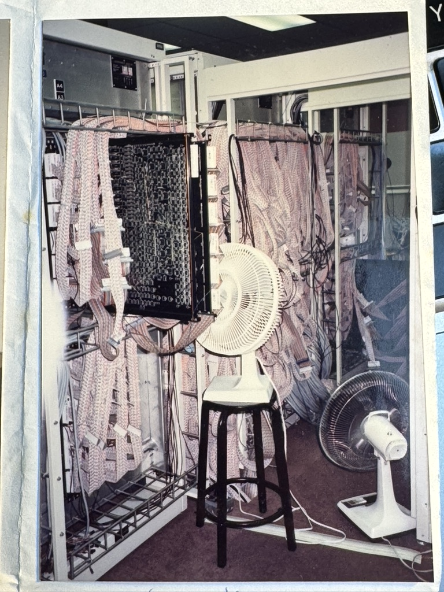

# Epilogue — The Path Behind This Book

The Chapter 16 concludes the technical journey of this book by shifting the focus from mechanisms and measurements to judgment. That shift is intentional. Performance engineering, particularly in supercomputing for AI, ultimately depends not only on technical skill, but on perspective—on how experience, context, and purpose shape the decisions we make.

The path behind this book is inseparable from that perspective. What follows is not a summary of techniques, but a personal account of how parallelism, supercomputing, and artificial intelligence gradually converged into a way of thinking that underlies everything presented in these pages.

Like many things that truly matter, this book is the result of a long journey rather than a single idea.

Its origins do not lie in a single idea or moment, but in a way of thinking that has accompanied me since my earliest days as a student: parallelism—not merely as a technical mechanism, but as a conceptual lens through which complex systems can be understood, designed, and reasoned about.

I studied computer science at the Facultat d’Informàtica de Barcelona (FIB), where I had the privilege of learning from professors affiliated with the Computer Architecture Department at the Universitat Politècnica de Catalunya (UPC). Beyond teaching us technical content, they conveyed something deeper and more enduring: a sense of intellectual rigor, academic freedom, and responsibility toward knowledge that had been hard-won by previous generations. That environment shaped not only what I learned, but how I learned to think.

From the beginning, I knew where I wanted to be. As a student, I worked to join that department and eventually began collaborating with the research group led by Professor Jesús Labarta. Shortly thereafter, I started my PhD under the supervision of Professor Eduard Ayguadé. At the time, our work was conducted within the CEPBA (European Center for Parallelism of Barcelona), an initiative that would later evolve into what is now the Barcelona Supercomputing Center (BSC). The CEPBA was led by Professor Mateo Valero, whose vision, leadership, and commitment to excellence left a profound and lasting mark on my career. His support and friendship from those early days remain deeply meaningful to me.

Before continuing my academic path in Barcelona, an experience abroad would fundamentally shape my understanding of supercomputing. In 1992, during my PhD years, I was invited by Professor David Padua—then Associate Director of the Center for Supercomputing Research and Development (CSRD) at the University of Illinois at Urbana-Champaign (UIUC). For many of us working in computer architecture and parallel programming, Padua’s work was already a major reference point. Receiving that invitation was both an honor and an invaluable opportunity.

At the CSRD, I joined the parallel compilation research group working on Cedar, a pioneering shared-memory experimental supercomputer designed to explore new architectural and software mechanisms for extracting parallelism from sequential programs. My contribution focused on the Benchmarking Project – Numerical Recipes, under the guidance of Rudolf (Rudi) Eigenmann, who led the compilation subgroup. Working alongside Rudi and his team gave me a front-row view of the challenges of automatic parallelization, compiler optimization, and performance evaluation on experimental hardware.

Those months in Urbana-Champaign were transformative. I arrived driven by curiosity; I left with a much deeper understanding of the intricate interplay between architecture, compilers, and performance—an understanding that has accompanied me throughout my entire career.

The photograph included here (Figure 6) was taken by me in 1992. The flat ribbon cables, prototype logic boards, improvised cooling fans, and the sensation of being surrounded by hardware still half in development were all real. Experimental supercomputing in the early 1990s was hands-on, improvisational, and intensely collaborative. Beneath that apparent fragility, however, lay an extraordinary ambition: to build systems capable of radically extending the limits of computational science.

_Figure 6 — Cedar experimental supercomputer at the Center for Supercomputing Research and Development (CSRD) at the UIUC (1992). Flat cable bundles, prototype logic boards, and improvised cooling fans were part of the day-to-day environment of early experimental supercomputing research._

That experience taught me something essential that still resonates today: true innovation often happens at the frontier where theory meets experimental engineering—where ideas are still rough, where systems are imperfect, and where progress depends as much on curiosity and patience as on technical brilliance. Even now, when I walk past MareNostrum 5, part of me still remembers the feeling of Cedar—that first spark of discovery that has never quite left.

After many years focused on the foundations of supercomputing, I began exploring how these systems could contribute to machine learning. In the early 2000s, encouraged by my long-time colleague and friend Professor Ricard Gavaldà, I started working at the intersection of these fields. This led, in 2006, to collaborations with outstanding PhD students such as Nicolas Poggi and Josep Lluís Berral, as we investigated how machine learning workloads could be supported and accelerated by supercomputing infrastructures.

From that point on, I continued deepening my understanding of machine learning through sustained personal effort and continuous learning—one of the great privileges of academic life. I attended specialized courses, carefully studied foundational textbooks, and followed the evolution of the field through key scientific publications.

The emergence of deep learning marked another decisive turning point. In 2014, thanks to the encouragement of my colleague Jordi Nin, I was first exposed to deep learning just as it was beginning to transform multiple research domains. I was struck by the central role of GPUs—hardware we had long used in supercomputing for numerical simulation—now driving a new wave of artificial intelligence.

In 2015, Dr. Joan Capdevila invited me to join him at the UPM Machine Learning and Advanced Statistics Summer School, where I took a course on neural networks and deep learning that left a lasting impression. A year later, following the advice of Dr. Oriol Vinyals, I attended the Machine Learning Summer School in Cádiz. There, I encountered reinforcement learning for the first time and witnessed firsthand the intellectual energy of a rapidly evolving field. Despite being one of the older participants, surrounded by younger researchers, I felt both grateful and invigorated. I knew it was time to fully commit to this new direction.

In 2016, I began co-supervising doctoral theses at the intersection of artificial intelligence and supercomputing with Dr. Xavier Giró-i-Nieto. Working alongside PhD students such as Miriam Bellver, Víctor Campos, and Amanda Duarte provided fresh insight into modern AI and contributed to shifting the research focus at the BSC toward this emerging domain. This period also allowed me to engage more deeply with the AI research community, participate in leading conferences, and collaborate with many outstanding researchers. I am deeply grateful for the generosity and intellectual openness of all those from whom I have learned along the way.

By the time large language models began to take center stage, I was already deeply immersed in deep learning. Coming from a supercomputing background, it felt natural to recognize what was truly driving this new AI revolution: supercomputing itself.

This book reflects that conviction. It places a deliberate emphasis on the training of AI models on supercomputing infrastructures—where the most demanding computational, architectural, and system-level challenges arise.

The book was born from a concrete academic need: to provide a modern, rigorous, and practical theoretical resource for my courses at the Universitat Politècnica de Catalunya. For years, I searched for a textbook that genuinely bridged supercomputing and deep learning—something cohesive, pedagogical, and grounded in real systems—but never found one. What I envisioned was not a collection of disconnected topics, but a coherent learning journey that would progressively equip students with the foundations required to understand and execute modern AI workloads at scale, while remaining faithful to the rigor of classical supercomputing.

Teaching with the MareNostrum supercomputers quite literally next door has been a privilege. Over the years, I developed and continuously refined teaching materials across successive generations of these systems. These materials evolved organically, shaped not only by rapid technological progress but also by the curiosity, engagement, and initiative of the students themselves. Their enthusiasm pushed me to extend and improve the laboratory assignments, often well beyond the original scope.

Over time, all these materials naturally converged into what we now call *HPC for AI*. When the Facultat d’Informàtica de Barcelona invited me to launch a course under that name, it felt like the right moment to gather, organize, and formalize everything into a single coherent work. This book is the result of that process.

There is a certain recursive aspect to its creation. The very artificial intelligence technologies that are the subject of these pages have also assisted me in writing them—helping explore alternatives, refine explanations, and sustain a level of breadth and depth that would have been difficult to achieve otherwise. Experiencing this firsthand has reinforced a key idea that runs throughout the book: AI is not merely an application domain; it is an accelerator of productivity and understanding. AI alone could not have written this book—at least not yet—but it has enabled a way of working that was previously out of reach, transforming the act of writing into a more powerful and informed process. The reader will be the final judge.

This book is not merely a teaching resource. It is an invitation to understand why, now more than ever, artificial intelligence is—at its core—a supercomputing problem.

Whether approached as a student, a researcher, or a practitioner, my hope is that this book helps you see these systems not only as tools to be used, but as systems to be understood.
